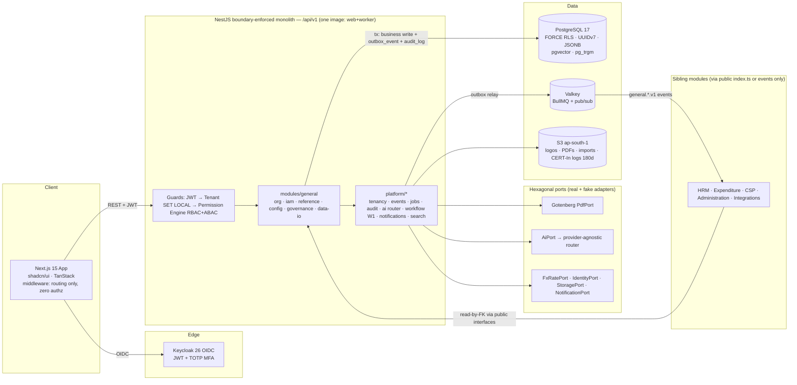
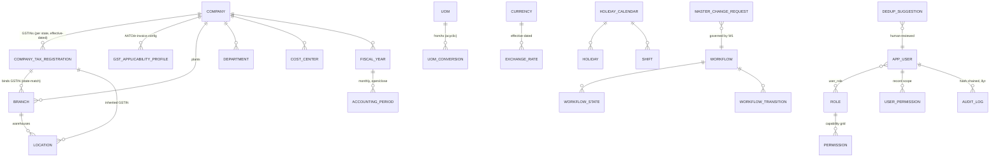

# IND-CORE Module 01 — General Platform and Master Data

## Engineering Implementation Blueprint

**Module:** MODULE 01 — General Module (Platform Foundation & Master Data)
**Product:** IND-CORE Manufacturing ERP — multi-tenant SaaS for Indian SMB/mid-market manufacturers
**Plan status:** MVP implementation plan **v2.0** · 18 July 2026 · Investor-demo quality target
**Conforms to:** `DECISIONS-V2.md` (binding decision digest, post-disproof). Where this plan and any earlier artifact conflict, DECISIONS-V2 wins.

This blueprint restructures the V2 General module plan into the suite's standard 20-section engineering format without altering its substance, technology stack, decisions, or demo data. General is **Module 01** — the platform foundation and master-data backbone that the five separately-planned sibling V2 modules inherit and consume: **Administration, HRM, Expenditure, CSP, and Integrations**. Those sibling plans reference this module's masters and services by touchpoint only; nothing from them is merged here. Every stack choice, statutory fact, DECISIONS-V2 lineage marker, and seeded demo row from the source plan is preserved; content has been moved to its canonical section and, where a structural gap existed, expanded only from this module's own material (for example, the tabular schema is rendered as DDL in §9 and validation/testing rules are enumerated from the FRs and Edge Cases).

**Module-boundary note (General vs Administration):** General owns the **business master records** — companies as legal/costing entities, GSTIN registrations, org units, reference masters (UoM, currency/FX, tax, statutory config, fiscal calendar), naming series, and the platform bootstrap that all siblings inherit. Administration owns the **identity/governance overlay** — platform operations, health signals, and the SoD-explanation text feature. The handshake is explicit: General owns business identity; Administration owns platform ops.

---

## 1. Module Overview

The General module is the platform foundation and master-data backbone of the entire ERP. Every other module — Engineering, SMBD, Planning, Purchase, Inventory, Production, Quality/QMS, Accounts, HRM, Expenditure, CSP — repeatedly needs the same underlying facts: which company and plant a transaction belongs to, who the user is and what they may do, what unit a quantity is measured in and how it converts, what currency and exchange rate apply, which fiscal year a date falls in, what number a document should get, who must approve it, and who changed what. The General module is the single authoritative place where these shared facts are defined once and consumed everywhere by foreign key.

Because General is the **first module built**, this plan also carries the platform bootstrap: monorepo, CI/CD with **CI-enforced module boundaries**, multi-tenancy with **FORCE RLS**, Keycloak authentication, the RBAC+ABAC permission engine, the transactional-outbox event bus on Valkey, and the hash-chained audit framework that all five sibling modules (HRM, Expenditure, CSP, Administration, Integrations — each planned separately) will inherit. Those sibling plans reference this module's masters and services by touchpoint only; nothing from them is merged here.

### 1.1 Business Problem

Indian SMB/mid-market manufacturers (50–500 employees) run on a patchwork of Tally, Excel, and tribal knowledge. The market evidence from the competitive research sharpens why the foundation module is the battleground:

1. **The Tally-to-ERP cliff.** Millions of manufacturers keep accounts on Tally (Silver ₹22,500 / Gold ₹67,500 one-time; claimed ~2.5M+ businesses) and run production on Excel/paper, because TallyPrime has **no MRP, no routing/work centers, no shop floor, no quality** ([Tally Solutions](https://tallysolutions.com/tally-prime/); [Markit price list](https://www.markitsolutions.in/product/tally-prime)). The next rung up is a cliff: SAP Business One implementations run **₹8–25 lakh** with 3–6 month projects ([Emerging Alliance](https://www.emerging-alliance.com/sap-business-one-pricing-in-india/); [Praxis](https://praxisinfosolutions.com/blog/sap-business-one-price-in-india-a-detailed-breakdown-of-sap-b1-cost/)), and NetSuite lands at ₹40L+/yr all-in ([Broken Rubik pricing guide](https://www.brokenrubik.com/blog/netsuite-pricing-the-definitive-guide)). The ₹500–1,500/user/mo cloud band between Tally and B1 is thinly served (RES-competitors §6.1).
2. **Global clouds treat India compliance as a lossy bolt-on.** Oracle's own documentation lists NetSuite India limitations that are disqualifying for a multi-plant manufacturer: **only one GSTIN per state nexus, no GST on advances/transfer orders, TDS gaps** ([Oracle docs — India SuiteTax limitations](https://docs.oracle.com/en/cloud/saas/netsuite/ns-online-help/article_0220055541.html)). Business Central's India localization is recent and thinner than Tally-class depth ([Microsoft Learn — BC India](https://learn.microsoft.com/en-us/dynamics365/business-central/localfunctionality/india/gst-e-invoice)). A manufacturer with plants in Maharashtra and Tamil Nadu holds **two GSTINs under one PAN** — General must make GSTIN a first-class dimension bound to every plant and warehouse from day one (RES-competitors §7.2).
3. **Master-data drift kills implementations.** Without one source of truth, one team's "KG" is not another's "Kg"; Purchase books against a plant Production doesn't recognise; two invoices get the same number. Every downstream report becomes unreliable and reconciliation consumes finance's month-end.
4. **Whitespace: no shipping product combines** (1) Tally-grade connected India compliance, (2) real manufacturing depth, (3) native Indian statutory payroll, (4) modern multi-tenant SaaS at Indian SMB prices, (5) first-party assistive AI (RES-competitors §6). ERPNext comes closest architecturally but with community-grade support and no polished first-party AI layer ([CFO Club review](https://thecfoclub.com/tools/erpnext-review/); [GitHub issue #50807](https://github.com/frappe/erpnext/issues/50807)). The dangerous convergences are Zoho ERP moving down into manufacturing with Zia agents and Odoo's PPP pricing + v19 AI agents (RES-competitors §6.6) — we must win on manufacturing + compliance depth + AI UX, not price alone.
5. **Provable governance is now a statutory product feature.** MCA rules require accounting software to maintain an **audit trail (edit log) that cannot be disabled**, tamper-evident, retained **8 years**, with books on servers **daily-backed-up physically in India** ([ICAI Implementation Guide 2024](https://eirc-icai.org/uploads/background_materials/Revised%202024_Implementation%20Guide%20on%20Reporting%20of%20Audit%20Trail%20(1)_1712114860.pdf); [Taxguru](https://taxguru.in/company-law/audit-trail-companies-act-2013-wef-01-04-2023.html)). Customers' statutory auditors will test our product under Rule 11(g). Most SMB systems fail this outright.
6. **DPDP is a build-now, enforce-May-2027 obligation.** DPDP Rules 2025 were notified 13/14 Nov 2025 with substantive obligations (notice, consent, breach, safeguards, rights; penalties to ₹250cr) enforceable **12/13 May 2027** ([PIB](https://static.pib.gov.in/WriteReadData/specificdocs/documents/2025/nov/doc20251117695301.pdf); [AZB Partners](https://www.azbpartners.com/bank/indias-digital-personal-data-protection-act-phased-rollout-and-key-compliance-milestones/)). Retrofitting consent and erasure into a shipped schema is 10× costlier — purpose-tagging and the PII catalog belong in the v1 schema. Marketing claim is strictly **"DPDP-ready, aligned to DPDP Rules 2025 phase-in (May 2027)"** — never "DPDP compliant" in 2026.
7. **Configuration requires developers everywhere else.** Changing an approval threshold, a number series, or a holiday calendar should be an admin task, not a change request to a vendor — this is how we beat B1's consultant dependence and Tally's rigidity simultaneously.

If General is wrong, every downstream module is wrong. The business problem this module solves is: **make the shared foundation correct, compliant, and configurable — once — so the other eleven functional modules never have to.**

### 1.2 Request & data flow (architecture at a glance)



### 1.3 Sibling-module touchpoints (contract only)

| Module | Consumes from General | Notifies General |
|---|---|---|
| HRM | Departments, locations, holiday/shift calendars, employee series, roles, cost centers, **statutory-config as-of lookups (EPF/ESI/PT)** | Audit events; department-head changes via MCR |
| Expenditure | Cost centers, currencies + FX as-of lookup, tax templates, EXP series, W1 engine, notification rules | Audit events |
| CSP | Users/roles, TKT series, notification channels, W1 engine | Audit events |
| Administration | Users & roles handshake (General owns business identity; Administration owns platform ops) | Operational health signals for readiness |
| Integrations | Outbox events bridged to external webhooks (HMAC-signed); real adapters (RBI FX, GSP/IRP, EWB, GSTN validation) plugged into General-declared ports | Feed results written through effective-dated APIs |

### 1.4 What changed in V2

| # | Change | Reason | Source |
|---|---|---|---|
| 1 | ORM: Prisma → **Drizzle ORM v1** (+ drizzle-kit, raw SQL for reports) | RLS ergonomics — Prisma wraps every query in an interactive transaction to use `SET LOCAL` (issue #12735 open); Drizzle is SQL-first and fits the per-request `SET LOCAL app.tenant_id` pattern cleanly. Only these grounds; Prisma-7 weight/perf arguments retired | DECISIONS-V2 §2 |
| 2 | Cache/queue: Redis → **Valkey** (ElastiCache) + BullMQ, versions pinned | BSD license, ~20–30% cheaper ElastiCache, BullMQ CI passes on Valkey; near-zero revert cost (config swap back to Redis 8) | DECISIONS-V2 §1–2 |
| 3 | DB: Postgres 16 → **17**; PKs BIGINT → **UUIDv7**; composite indexes lead with `tenant_id` | Current major; UUIDv7 keeps insert locality while enabling per-tenant export/merge; tenant-leading indexes make RLS predicates index-served | DECISIONS-V2 §1, §5 |
| 4 | RLS: "enabled" → **FORCE RLS + non-owner `app_user` (NOBYPASSRLS) + `SET LOCAL`** with hardened acceptance criteria, CI leak probes on every migration, week-1 overhead benchmark | RLS as fail-closed backstop against ₹250cr DPDP exposure; unbenchmarked RLS is a latent perf cliff (flip trigger >15–20%) | DECISIONS-V2 §2, §5 |
| 5 | PDF: Playwright/Chromium render → **Gotenberg** sidecar (HTML→PDF) | Pixel-faithful GST-format documents from web templates without owning a browser farm | DECISIONS-V2 §2 |
| 6 | Dev object storage: MinIO → **Garage/SeaweedFS/LocalStack**; prod stays S3 ap-south-1 | MinIO community edition in maintenance mode | DECISIONS-V2 §2 |
| 7 | AI: Claude-API wrapper → **provider-agnostic thin router** `completion(task, schema)`; module AI scope cut to **dedup suggestions (COMMITTED)** + **HSN/SAC suggestion (stretch)**; NL-to-config demoted to one scripted demo flow; audit digest → future | No India-processed Claude inference on any channel; only document-centric assistive AI has shipped-and-stuck evidence; routing = cost + residency hedge | DECISIONS-V2 §2, §4 |
| 8 | IaC: Terraform → **OpenTofu** (encrypted state) | Native state encryption + MPL governance — not "license risk" | DECISIONS-V2 §2 |
| 9 | Module boundaries: aspirational NestJS modules → **dependency-cruiser CI gate from Sprint 1**, cross-module imports only via public `index.ts` or outbox events | Unenforced modularity decays (Shopify lesson) | DECISIONS-V2 §2, §5 |
| 10 | Next.js: **middleware performs zero authorization**; authz lives in NestJS guards + RLS only; CVE pin/patch policy | CVE-2025-29927 middleware-bypass lesson | DECISIONS-V2 §2 |
| 11 | Compliance recalibration: market as **"DPDP-ready"** (substantive obligations 12/13 May 2027); CERT-In 6h/180-day India logs/NIC-NPL NTP moved into Sprint 0 as **live-now** duties; MCA 8-year audit retention + daily India-resident backups made explicit; e-invoice applicability = per-tenant effective-dated config (₹5cr threshold; 30-day IRN window only ≥₹10cr) | Corrected, normative compliance facts | DECISIONS-V2 §3; RES-compliance §1–4 |
| 12 | New **Edge Cases** and **Testing Strategy** sections; GSP vendor evaluation flagged as critical-path dependency (Aug-2026 GSTN API change) even though integration lands in the Integrations module | Disproof engagement findings; risk #1 is the 1 Aug 2026 GSTN API change | DECISIONS-V2 §3, §6 |

**MVP scoping stance (summary, unchanged in substance from V1):**

| In MVP | Deferred post-MVP |
|---|---|
| Single-company-friendly tenant model that is **multi-GSTIN from day one** (2 plants, 2 states) | Full multi-company consolidation, inter-company defaults |
| Core RBAC (roles, capability grid) + ABAC scope conditions evaluated in-app | ABAC condition **builder UI**, field-level masking UI |
| Effective-dated tax codes, FX rates, and statutory reference config (insert-new-row only) | Real-time GSTN/RBI regulatory feeds with staged rollout |
| Naming series with tokens (`.YYYY.`, `.#####`, plant), yearly reset | Scripted/hook-based series |
| Simple **linear** workflow engine behind the `WorkflowExecutor` port (states, role-gated transitions, one condition, SLA timer fields reserved) | Parallel approvals, escalation, delegation; Temporal at defined triggers |
| Hash-chained, append-only audit log (8-year financial retention) with export pack | External blockchain anchoring, configurable per-field audit granularity |
| CSV/XLSX import with dry-run validation | Full mapping-template import framework with rollback; Tally importer (named open item) |
| India localization pack (FY Apr–Mar, GST/HSN, lakh/crore) | Additional country packs, config promotion, SCIM/LDAP sync, Indic i18n (named open item) |

---

## 2. Objectives

### 2.A Product objectives

1. **Single source of truth.** All shared masters (company, org units, locations, users/roles, UoM, currency/FX, tax, fiscal calendar, series) defined once in General and consumed by FK; CI-enforced module boundaries make private copies structurally impossible, not just discouraged.
2. **India-compliant by default.** Multi-GSTIN per company with plant/warehouse→GSTIN binding, HSN/SAC + GST slab masters with effective dating, per-tenant GST applicability profile (e-invoice ≥ ₹5cr AATO; 30-day IRN window ≥ ₹10cr), FY Apr–Mar with `FY(26-27)` naming, INR `#,##,###.##` lakh/crore formatting, dd-mm-yyyy — preloaded via an India Manufacturing template pack. **No statutory number is ever a constant in code.**
3. **Provable governance.** Hash-chained append-only audit log (MCA-ready, 8-year retention, no off-switch), role-capability matrix export, "explain access" simulator, soft-delete-only masters.
4. **DPDP-ready platform (May 2027 phase-in).** India data residency (ap-south-1), encryption at rest/in transit, FORCE RLS isolation with rehearsed per-tenant export/PIT-restore runbook, consent capture (`consent_record`) and data-principal request scaffolding (`dsr_request`), PII-minimised AI calls.
5. **Live-now security compliance.** CERT-In duties apply **today**: 6-hour incident reporting muscle, 180-day rolling ICT logs in Indian jurisdiction (ap-south-1 S3 lifecycle), clocks synced to NIC/NPL NTP (`samay1/samay2.nic.in`) or documented traceability ([CERT-In Directions 28.04.2022](https://www.cert-in.org.in/PDF/CERT-In_Directions_70B_28.04.2022.pdf)).
6. **Config-not-code.** Admins configure naming series, workflows, notification rules, holiday calendars, and global defaults through the UI with preview/test affordances.
7. **Demo-day credibility.** A seeded Trishul Precision Components tenant where an investor can watch: setup wizard → readiness check → explain-access → approve a master-change request → dedup suggestion accepted → audit chain verified — in under 10 minutes.
8. **Go-live in hours, not weeks.** Guided setup wizard + readiness checklist reduces tenant onboarding to a single working session — the direct answer to B1's 3–6-month implementations (RES-competitors §7.10).

### 2.B Engineering objectives

1. **Platform bootstrap for five sibling modules.** Deliver tenancy, auth, permissions, outbox events, audit, jobs, notifications, AI router, and hexagonal ports (storage, PDF, search, FX feed, identity) as reusable platform packages with stable internal interfaces and CI-gated boundaries.
2. **Structural modularity.** `dependency-cruiser` gates CI from Sprint 1; cross-module imports only via each module's public `index.ts` or outbox events — "no private master copies" is enforced, not aspirational.
3. **Fail-closed tenant isolation.** FORCE RLS + non-owner `app_user` (NOBYPASSRLS) + per-request `SET LOCAL app.tenant_id`, with policy-coverage checks and two-tenant leak probes on every migration and a week-1 overhead benchmark.
4. **Effective-dated data layer.** Tax, FX, and statutory-config are insert-new-row only with `as_of` lookups — no "update rate in place" path exists in the API or the database.
5. **Deterministic document numbering.** Atomic `UPDATE … RETURNING` series allocation, gap-free under concurrency, idempotency-keyed for integration callers, fail-closed at exhaustion.
6. **Tamper-evident governance.** Hash-chained, INSERT-only `audit_log` with per-tenant chaining, chain-verify job/endpoint/UI badge, and 8-year retention.

---

## 3. User Personas

Role design follows the spec's matrix (§14): built-in roles are `is_system=true` and non-deletable; Auditor is read+export everywhere and can never write; Consultant rights are time-boxed and revoked at go-live. AI features run under the **calling user's JWT** — there is no AI super-role persona.

| Persona | Demo identity (Trishul) | What they do in General | Frequency |
|---|---|---|---|
| System / ERP Administrator | Vikram Joshi (IT Admin) | Company setup, users, roles, series, workflows, settings, notification rules | Daily/weekly |
| Implementation Consultant | Partner user (IND-CORE services) | Initial tenant modelling, org structure, master import; elevated rights revoked at go-live | Project phase |
| Finance Controller | Meera Iyer | Fiscal years, period open/close, currencies, FX rates, tax masters, GST applicability profile, cost centers | Period-driven |
| Plant / Operations Manager | Rajesh Kulkarni (Pune Plant Head) | Warehouses, plant holiday & shift calendars, own-plant users (read) | Setup + occasional |
| Department Head / Approver | Priya Deshmukh (HR), Deepa Menon (Purchase) | Participate in approval workflows; consume notifications | Event-driven |
| Auditor / Compliance Officer | External auditor login (read+export only) | Audit-log review under Rule 11(g), permission matrix export, change-history export | Quarterly/annual |
| Every end user (indirect) | Sanjay Patil, Kavita Rao, Arun Nair, Imran Shaikh | Every screen they touch reads General masters (UoM dropdowns, currency, numbering) | Continuous |

### 3.1 Persona detail — goals, pain points, primary screens

**System / ERP Administrator (Vikram Joshi).** *Goals:* stand up the tenant, keep users/roles/series/workflows correct, respond to config requests without a vendor ticket. *Pain points:* opaque permission systems, config-by-change-request, invisible audit state. *Primary screens:* Setup Wizard, Users, Roles & permission grid, Naming Series, Workflows, Notification Rules, Settings, Health Dashboard.

**Implementation Consultant (partner user).** *Goals:* model org structure and import masters fast, then hand off. *Pain points:* multi-week B1-style implementations; elevated rights lingering after go-live. *Primary screens:* Setup Wizard, Org Explorer, Import pipeline, Readiness gate (rights auto-revoked at go-live).

**Finance Controller (Meera Iyer).** *Goals:* period-correct tax/FX, approve governed master changes, keep fiscal periods clean. *Pain points:* silent history rewrites, ambiguous rate-as-of behaviour. *Primary screens:* Fiscal Years, Exchange Rates, Tax Codes, Statutory Config, GST applicability profile, Change Requests (approver).

**Plant / Operations Manager (Rajesh Kulkarni).** *Goals:* correct warehouses, plant calendars/shifts; own-plant visibility only. *Pain points:* seeing data for plants that are not his. *Primary screens:* Warehouses, Holiday Calendars, Org Explorer (scoped to PNQ), read-only user list. Used live in Explain Access (scoped to Branch = PNQ).

**Department Head / Approver (Priya Deshmukh, Deepa Menon).** *Goals:* approve/reject requests quickly, from a phone if needed. *Pain points:* desktop-only approvals, noisy notifications. *Primary screens:* Change Requests (Kanban), notification inbox, mobile-optimised approve/reject.

**Auditor / Compliance Officer (external).** *Goals:* verify the audit trail under Rule 11(g), export the permission matrix and change history. *Pain points:* systems that cannot prove tamper-evidence. *Primary screens:* Audit Log (chain-verified badge), audit-pack export, permission-matrix export — read+export only, never write.

**Every end user (Sanjay Patil, Kavita Rao, Arun Nair, Imran Shaikh).** *Goals:* just use the masters (UoM dropdowns, currency, numbering) correctly. *Pain points:* inconsistent units/currencies/numbers. *Primary screens:* indirect — every module screen reads General masters continuously.

---

## 4. Functional Requirements

Requirements are grouped into lettered sub-areas (4.A…4.I) and tagged **[MVP]** or **[Post-MVP]**. All MVP items are demoable. The nine sub-areas map one-to-one to the source FR groups: (4.A) Tenant/Company/Tax Identity, (4.B) Organization Structure, (4.C) Identity & Access, (4.D) Reference Masters, (4.E) System Behavior Configuration, (4.F) Governance & Traceability, (4.G) Data Operations & Onboarding, (4.H) Platform Services, and (4.I) India Compliance Traceability (cross-cutting).

### 4.A Tenant, Company & Tax Identity (FR-1)

- **FR-1.1 [MVP]** Tenant provisioning seeds a super-admin, India-default system settings (timezone Asia/Kolkata, dd-mm-yyyy, `#,##,###.##`, INR, week starts Monday), and the India Manufacturing template pack (standard UoMs, warehouse types, GST slabs, series templates). The `tenant` registry row is platform-level (not RLS-scoped); everything else the wizard creates is tenant-scoped under FORCE RLS.
- **FR-1.2 [MVP]** Company (legal entity) CRUD: legal name, abbreviation, base currency INR, country, fiscal pattern APR-MAR, PAN/CIN/TAN, logo upload (S3 ap-south-1 via StoragePort), registered address, rounding/precision, default holiday calendar & warehouse. States: Draft → Active → Inactive.
- **FR-1.3 [MVP]** Multiple GSTIN registrations per company (one per state): 15-char format + check-digit validation, state code, registration type (Regular/Composition/SEZ), address, **effective_from date**, primary flag. Deactivation only (no delete). Registration data model carries the fields downstream e-invoice/EWB payloads need under the **1 Aug 2026 GSTN API change** (state-code/PIN validation, Ship-to GSTIN identity per [GSTN advisory PDF](https://tutorial.gst.gov.in/downloads/news/advisory_einvoice_api_ewb_by_irn_approved.pdf)).
- **FR-1.4 [MVP]** **GST applicability profile per tenant/company (effective-dated):** AATO band declaration driving e-invoice applicability (mandatory at AATO ≥ **₹5 crore**, Notif. 10/2023-CT — [xflowpay](https://www.xflowpay.com/blog/e-invoice-limit)) and the **30-day IRN reporting window flag (only at AATO ≥ ₹10 crore**, [einvoice6 IRP notice](https://einvoice6.gst.gov.in/content/revised-time-limit-for-e-invoice-reporting-for-businesses-with-aato-of-%E2%82%B910-crores-above/)). No ₹1cr threshold exists; if it ever notifies, it is a config row, not a release. Sales/Integrations consume this profile; General owns it.
- **FR-1.5 [Post-MVP]** Multiple companies per tenant with shared vs company-scoped masters; online GSTN validation API (via Integrations/GSP).

### 4.B Organization Structure (FR-2)

- **FR-2.1 [MVP]** Branch/Plant/Division hierarchy under company (self-referencing parent), each plant bindable to exactly one active GSTIN registration, default cost center, and holiday calendar. Binding validation: plant's GSTIN state code must match the plant address state (see §15 Validation / Edge Cases).
- **FR-2.2 [MVP]** Departments with parent hierarchy, department head (user FK), cost center link.
- **FR-2.3 [MVP]** Cost centers as a tree (`is_group`), company-scoped, disable-only.
- **FR-2.4 [MVP]** Locations/warehouses: types RM / WIP / FG / Quarantine / Scrap / Transit / Subcontractor; parent-child (`is_group`); plant linkage; **GSTIN inherited from plant** (correct e-invoice/e-way-bill identity per stock location — the NetSuite single-GSTIN failure inverted into a feature).
- **FR-2.5 [MVP]** Org structure explorer: interactive tree company → plant → department/warehouse/cost center with drill-down and "where-used" counts before deactivation.
- **FR-2.6 [Post-MVP]** Multiple hierarchy purposes (statutory vs cost vs purchasing-policy roll-ups).

### 4.C Identity & Access (FR-3)

- **FR-3.1 [MVP]** User lifecycle: Invite → Active → Suspended → Deactivated; profile (name, email, mobile, language, timezone), default company/plant/warehouse; TOTP MFA; password policy from system settings; DPDP consent notice + timestamp captured at first login into `consent_record` (build now, enforce at May-2027 phase-in).
- **FR-3.2 [MVP]** Roles with capability grid per doctype: create/read/write/submit/cancel/delete/print/export. Seven seeded system roles per spec §14. Role clone.
- **FR-3.3 [MVP]** ABAC scope conditions stored as JSONB on permissions (e.g., `{"branch_id":"$user.default_branch_id"}`) and **enforced by the in-app permission engine** on every query; MVP conditions authored via seeded templates/JSON editor, not a visual builder.
- **FR-3.4 [MVP]** User Permissions (record scoping): restrict a user to specific Company/Plant/Warehouse/Cost Center values, with applicable-doctype list and bulk apply.
- **FR-3.5 [MVP]** "Explain access" simulator: pick user + doctype + action → allow/deny with the granting/denying rule chain.
- **FR-3.6 [MVP]** SoD conflict report (rule-pack: e.g., create+approve on same doctype flagged). Conflict logic is deterministic rules; AI-generated explanation text is a post-MVP stretch owned by Administration (DECISIONS-V2 §4 #8).
- **FR-3.7 [Post-MVP]** Visual ABAC condition builder, field-level masking UI, SSO federation beyond built-in OIDC, SCIM provisioning, access recertification campaigns.

### 4.D Reference Masters (FR-4)

- **FR-4.1 [MVP]** UoM master (name, symbol, category, whole-number flag, precision) + UoM conversions (from, to, factor > 0, optional item override; unique per triple). Transitive conversion resolution (g→kg→ton) via BFS at read time with **cycle detection and contradictory-path detection** (see §15 Validation).
- **FR-4.2 [MVP]** Currency master (ISO 4217, symbol, decimals, enabled) with INR as base; exchange rates effective-dated **insert-new-row only**, unique per (from, to, date), source Manual/Feed; "rate as of date" lookup API; scheduled RBI-reference-rate feed job behind `FxRatePort` (fake adapter in demo mode).
- **FR-4.3 [MVP]** Tax masters: HSN/SAC code master with description; GST slab (total + CGST/SGST/IGST/Cess split) **effective-dated as insert-new-row** so historical documents keep period-correct rates; tax templates (Sales/Purchase/Item) with lines. TDS/TCS categories seeded as effective-dated reference data (consumed by Purchase/Expenditure/HRM later).
- **FR-4.4 [MVP]** **Statutory reference config package (`packages/statutory-config`):** effective-dated tables seeded for EPF wage ceiling (₹15,000, re-notified 29 May 2026 — [SCC Online](https://www.scconline.com/blog/post/2026/06/01/15000-wage-ceiling-epf-coverage-membership-contributions/)), ESI ₹21,000, PT slabs per state (MH monthly incl. Feb ₹300; TN half-yearly — [Zoho Payroll table](https://www.zoho.com/in/payroll/academy/taxes-and-compliance/professional-tax-rules.html)). General owns the storage pattern and as-of lookup service; HRM/Expenditure consume. **Never constants in code** (DECISIONS-V2 §3).
- **FR-4.5 [MVP]** Fiscal years `FY(26-27)` (01-Apr → 31-Mar), auto-generated monthly accounting periods with Open/Closed status, exactly one current FY, states Future → Current → Closed. Date→period resolution API.
- **FR-4.6 [MVP]** Holiday calendars per plant/year: weekly-off pattern, holiday rows, clone-from-previous-year; shift definitions attached to calendar; assignable to plant and department (consumed by Planning, Production, HRM).
- **FR-4.7 [Post-MVP]** Item-specific variable conversions (coil weight↔length), FX bulk revaluation trigger into Accounts.

### 4.E System Behavior Configuration (FR-5)

- **FR-5.1 [MVP]** Naming series per doctype per company: token pattern (`PO-.YY.YY.-.#####`, `WO-{plant}-.#####`), padding, reset policy Never/Yearly/Monthly, atomic counter allocation (`UPDATE … RETURNING` in the caller's transaction), preview-next-number, collision check across series of the same doctype, exhaustion telemetry at >80% of padding capacity. Batch/serial/challan series are first-class doctypes.
- **FR-5.2 [MVP]** Workflow engine **W1** (custom, behind the `WorkflowExecutor` port): workflow per doctype; states with doc_status (0/1/2) and editable-by role; transitions with action label, allowed role, optional single condition expression (safe evaluator, no eval); SLA-timer fields present in schema (execution post-MVP); on-transition actions limited to notify + audit in MVP. Visual read-only diagram; test-run against a sample document. Applied in-module to the **Master Change Request** doctype. The port keeps the Temporal exit documented (day-spanning sagas; >2–3 bespoke recovery mechanisms — DECISIONS-V2 §1).
- **FR-5.3 [MVP]** Notification rules: trigger (save/submit/state-change/scheduled), doctype, condition, channels Email (SES) + In-App (Socket.IO) — SMS (MSG91) and signed webhooks stubbed behind flags; recipients by role/field/user; Handlebars templates; test-send; throttle. WhatsApp BSP is a **named fast-follow**, not MVP (DECISIONS-V2 §1).
- **FR-5.4 [MVP]** Print formats: letterhead (logo, header/footer HTML), per-doctype template (HTML + Handlebars), A4 default, server-rendered PDF via **Gotenberg sidecar** behind `PdfPort`, is-default per doctype. WYSIWYG designer deferred — MVP ships curated templates with a code editor + live preview.
- **FR-5.5 [MVP]** Global defaults & system settings as typed key-value (scope System/Company): formats, precision, rounding, timezone, session timeout, password/MFA policy. Change confirmation dialog + audit.
- **FR-5.6 [Post-MVP]** Parallel/escalating workflows, delegation, webhook actions, WYSIWYG print designer, config export/import (environment promotion).

### 4.F Governance & Traceability (FR-6)

- **FR-6.1 [MVP]** Append-only audit log for all master mutations + logins: ts, user, action, doctype, record id, field-level old→new JSONB diff, IP, session; **hash-chained per tenant** (`row_hash = SHA256(prev_hash ‖ canonical_payload)`); INSERT-only DB grant; **no off-switch at any privilege level**; chain-verify job + endpoint + UI badge; **8-year retention** aligned to s.128(5)/Rule 11(g) ([ICAI guide](https://eirc-icai.org/uploads/background_materials/Revised%202024_Implementation%20Guide%20on%20Reporting%20of%20Audit%20Trail%20(1)_1712114860.pdf)).
- **FR-6.2 [MVP]** Audit explorer: filter by doctype/user/date/action, visual diff, export CSV/PDF "audit pack" (statutory/ISO; Rule 11(g) auditor export).
- **FR-6.3 [MVP]** Master Change Request: workflow-gated edits to critical masters (tax codes, FX manual overrides, fiscal year, GSTIN, statutory config) — request → Finance/Admin approval → apply, all audited.
- **FR-6.4 [MVP]** Soft delete only (`is_active=false`) everywhere; no hard DELETE on masters; deactivation blocked when active references exist, with where-used view.
- **FR-6.5 [MVP]** DPDP scaffolding: `consent_record` and `dsr_request` platform tables with a minimal rights-request queue (access/correction/erasure, 90-day SLA timer field) — build now, workflow-enforce at phase-in ([Ikigai Law on Rules 2025](https://www.ikigailaw.com/article/647/a-closer-look-at-the-dpdp-rules-2025)).
- **FR-6.6 [Post-MVP]** Configurable audit granularity per doctype/field; external hash anchoring.

### 4.G Data Operations & Onboarding (FR-7)

- **FR-7.1 [MVP]** CSV/XLSX import for UoM, conversions, currencies, FX, HSN/tax codes, holidays, users, warehouses, cost centers — with column mapping, dry-run validation report, all-or-nothing commit per file (BullMQ job on Valkey).
- **FR-7.2 [MVP]** List-view export (CSV/XLSX) respecting the caller's permissions.
- **FR-7.3 [MVP]** Setup wizard + Configuration Readiness check: ordered checklist (company → GSTIN → GST applicability profile → org → masters → series → FY current → ≥1 admin user), status badges, jump-to-fix, go-live gate.
- **FR-7.4 [MVP]** Master Data Health dashboard: counts, completeness %, orphan detection (plant without warehouse, UoM without conversion), duplicate suspects (pg_trgm similarity feeding FR-8.4), series near-exhaustion.
- **FR-7.5 [MVP]** **Per-tenant export runbook hook:** admin-triggered full-tenant data export (DPDP data-portability posture + offboarding); rehearsed alongside the PIT-restore runbook (DECISIONS-V2 §5).
- **FR-7.6 [Post-MVP]** Tally importer (named open work item — DECISIONS-V2 §6h); mapping-template framework with rollback.

### 4.H Platform Services (FR-8, bootstrap, consumed by all modules)

- **FR-8.1 [MVP]** Tenancy: `tenant_id` on every tenant-scoped row + **FORCE RLS** policies; app connects only as non-owner `app_user` (NOBYPASSRLS); tenant resolved from JWT and set via `SET LOCAL app.tenant_id` per request transaction; demo-tenant feature flag.
- **FR-8.2 [MVP]** Internal event bus: transactional **outbox** (`outbox_event` written in the business transaction) → **Valkey pub/sub** relay; idempotent consumers; **versioned event names** (`general.currency.disabled.v1`, `general.fiscal_year.current_changed.v1`, `general.tax_code.updated.v1`, `general.gstin.updated.v1`); ledger-critical flows stay synchronous in one DB transaction.
- **FR-8.3 [MVP]** Versioned REST `/api/v1` with OpenAPI docs, cursor-only pagination, idempotency keys on mutating integration endpoints, per-tenant rate limits, the standard error envelope (see §10 API Design).
- **FR-8.4 [MVP — COMMITTED AI]** **Master-data dedup suggestions** via the provider-agnostic AI router: pg_trgm/GSTIN-exact first, embeddings (pgvector HNSW) second; candidate pairs with confidence; **human performs every merge**. Binding guardrails (DECISIONS-V2 §4): Zod-validated outputs never executed; runs under the calling user's JWT; every call logged to hash-chained `ai_action_log`; AI-assisted records tagged `source=ai_assisted`; PII minimization before egress; per-tenant opt-out + daily token budgets + kill switch; golden-set eval gate (must beat the deterministic pg_trgm baseline) before ship.
- **FR-8.5 [Stretch AI]** **HSN/SAC + GST-rate suggestion** from item/service description, validated against the official directory-derived `tax_code` master before display; same guardrails. Ships only if the golden-set gate passes.
- **FR-8.6 [Demo-only]** NL-to-config: **one scripted demo flow** ("Create fiscal year 2027-28 and set it current" → previewed change set → human confirm) — not a committed product feature (DECISIONS-V2 §4). V1's config copilot, weekly audit digest, smart defaults, data-quality scoring AI, workflow-bottleneck AI, and regulatory-watch AI all move to Future (see §18).
- **FR-8.7 [MVP]** Observability/compliance plumbing owned by this bootstrap: OTel + Grafana Cloud + Sentry; **CERT-In log pipeline → ap-south-1 S3 with 180-day lifecycle; chrony → `samay1.nic.in`/`samay2.nic.in` or documented traceability; RDS daily automated backups in-region** (MCA daily India-resident backup duty).

### 4.I India Compliance Traceability (FR-9, cross-cutting, corrected facts)

| Obligation (status Jul 2026) | Where satisfied in this module |
|---|---|
| GST multi-GSTIN (one per state under one PAN) — LIVE | FR-1.3 registrations; FR-2.1/2.4 plant & warehouse → GSTIN binding feeding e-invoice/EWB downstream |
| E-invoice AATO ≥ ₹5cr; 30-day IRN window only ≥ ₹10cr; no ₹1cr notification — LIVE | FR-1.4 per-tenant effective-dated GST applicability profile |
| 1 Aug 2026 GSTN API change (Ship-to GSTIN, state-code/PIN checks) — **2 weeks out** | FR-1.3 registration data completeness + validations; GSP integration itself is Integrations-module scope; **GSP evaluation is an open critical-path item** (DECISIONS-V2 §6d) |
| HSN/SAC classification & rate correctness | FR-4.3 effective-dated tax codes; FR-8.5 AI suggestion (stretch) with directory validation + human confirm |
| Statutory numbers as config, never constants | FR-4.4 statutory-config package (EPF/ESI/PT effective-dated) |
| FY April–March, `FY(26-27)` display | FR-4.5 fiscal years + periods; date-resolve API |
| INR lakh/crore, dd-mm-yyyy | FR-5.5 system settings + shared formatting utilities |
| MCA audit trail: non-disableable, tamper-evident, **8-year retention**; **daily India-resident backups** — LIVE since 1 Apr 2023 | FR-6.1 hash chain; FR-8.7 backup posture; Rule 11(g) auditor export (FR-6.2) |
| CERT-In 6h reporting / 180-day India logs / NIC-NPL NTP — **LIVE NOW, no MSME carve-out** | FR-8.7 pipeline + Sprint 0 incident runbook; audit log provides forensics |
| DPDP (substantive obligations 12/13 May 2027) — market as **"DPDP-ready"** | FR-3.1 consent capture; FR-6.5 consent/DSR scaffolding; FR-7.5 tenant export; residency + encryption + RLS (FR-8.1) |
| Dual breach clocks (CERT-In 6h now; DPB immediate/72h + users "without delay" May 2027) | One playbook, two timers, single evidence pack — runbook in `docs/runbooks`, notification hooks FR-5.3 |
| Job-work (challan) traceability numbering | FR-5.1 batch/serial/challan series as first-class naming series |

---

## 5. Non-functional Requirements

Synthesized from the engineering goals, System Architecture, and DECISIONS-V2 acceptance criteria. Each NFR is testable (see §16).

| ID | Category | Requirement |
|---|---|---|
| **NFR-01** | Performance | List/read endpoints return **p95 < 300 ms** on demo-data volumes **including RLS overhead**; measured in the Sprint 4 load pass. |
| **NFR-02** | Performance (RLS budget) | FORCE RLS + `SET LOCAL` adds **≤ 15–20 %** overhead vs baseline on representative list queries; a week-1 benchmark establishes the number and is re-run at each milestone; exceeding the flip trigger routes to documented alternatives (silo tier / index changes). |
| **NFR-03** | Tenant isolation | Cross-tenant reads are **structurally impossible**: FORCE RLS + non-owner `app_user` (NOBYPASSRLS) + `SET LOCAL app.tenant_id` with **no default** on `app.tenant_id` (missing context errors, failing closed). Two-tenant leak probes assert zero rows / 404 on every migration. |
| **NFR-04** | Data residency | All primary data, backups, object storage, and CERT-In logs reside in **India (ap-south-1)**; DR in ap-south-2; no cross-region egress of tenant data. |
| **NFR-05** | Master-data integrity | Effective-dated masters (tax, FX, statutory config) are **insert-new-row only**; in-place mutation of rate columns is impossible (no API path + DB trigger guard); as-of lookups are deterministic (`max(effective_from) ≤ as_of`). |
| **NFR-06** | Referential integrity | Masters are **soft-delete only**; deactivation is blocked while active references exist (`WHERE_USED_CONFLICT` 409 with blast radius); every composite index **leads with `tenant_id`** so RLS predicates are index-served. |
| **NFR-07** | Numbering correctness | Document numbers are **gap-free and duplicate-free under concurrency** (atomic `UPDATE … RETURNING`), period-derived from the document's own date, idempotency-keyed for integration callers, and **fail-closed** at exhaustion (`SERIES_EXHAUSTED`). |
| **NFR-08** | Tamper-evidence | `audit_log` is append-only, INSERT-only-granted, hash-chained per tenant, with **no off-switch at any privilege level** and **8-year retention**; chain verification runs on a schedule and on demand. |
| **NFR-09** | Availability & durability | RDS **daily automated in-region backups + PITR**; audit-chain durability underpinned by the same; chain-verify + alert nightly. |
| **NFR-10** | Security (authz placement) | **Next.js middleware performs zero authorization**; all authz is in NestJS guards + permission engine + RLS; Next.js versions pinned with a CVE patch policy (CVE-2025-29927 lesson). |
| **NFR-11** | Security (data protection) | Encryption at rest and in transit; PII columns schema-tagged and PII-minimised before any AI egress; pre-signed URLs keep binaries out of the API path. |
| **NFR-12** | Compliance (live-now) | CERT-In 6-hour incident reporting muscle, **180-day rolling ICT logs** in ap-south-1 S3 lifecycle, clocks synced to NIC/NPL NTP (`samay1/samay2.nic.in`) or documented traceability. |
| **NFR-13** | API consistency | Versioned `/api/v1`, **cursor-only pagination**, idempotency keys on mutating integration endpoints, per-tenant rate limits (429 + `Retry-After`), standard error envelope with `request_id` + `doc_url` on every non-2xx. |
| **NFR-14** | Modularity | Cross-module imports only via public `index.ts` or outbox events; **dependency-cruiser gates CI from Sprint 1**; OpenAPI drift blocked after M3. |
| **NFR-15** | Observability | OTel traces + Grafana Cloud + Sentry across web + worker roles; series-exhaustion, chain-break, and RLS-overhead-regression signals alert. |
| **NFR-16** | Accessibility | **Lighthouse ≥ 90 accessibility** on the five demo-path screens; keyboard-first tables, shadcn semantics, skeleton loaders. |
| **NFR-17** | AI safety | Router outputs are Zod-validated or discarded, never executed; every call hash-chained in `ai_action_log`; per-tenant opt-out, daily token budgets, kill switch; golden-set eval gate must beat the deterministic baseline before ship. |

---

## 6. UI/UX Flow

### 6.1 Week-1 data-grid decision (blocking, ADR'd)

General is the grid-heaviest module (23 List→Form→Detail screen families), and every sibling inherits its grid. **Week 1 ends with an ADR choosing the single data-grid wrapper** (TanStack Table + our conventions vs a packaged grid), evaluated against: server-side cursor pagination, column filters/saved views, bulk select, virtualized 10k rows, accessibility, INR/date formatting hooks. Bail-out to AntD is pre-authorized at module 3 if velocity disappoints (DECISIONS-V2 §1). No screen ships on an off-convention grid.

### 6.2 Primary interaction loops

- **List → Form → Detail everywhere.** Lists use the blessed grid wrapper, server-side cursor pagination, saved views, bulk actions, and CSV/XLSX export. Forms use React Hook Form + Zod with inline validation (GSTIN check digit as-you-type, factor>0), autosave-draft, and an unsaved-changes guard. Detail views show a state badge + actions with tabs: Overview / Related / Where-used / Audit history.
- **Onboarding loop (go-live in one session).** Setup Wizard walks lifecycle Phases 1–4 with the India pack pre-applied as review-and-confirm; a dedicated GST applicability step translates the AATO band into e-invoice/IRN-window flags in plain language; the Readiness gate must go green before go-live, and consultant elevated rights are revoked at that gate.
- **Effective-dated write loop.** For tax codes, FX, and statutory config there is **no in-place edit affordance** — the only write path is "New rate from date…", rendered as a timeline strip with an "as of" date picker so history is visible and never rewritten.
- **Governance loop (dogfooded W1).** A critical master edit becomes a Master Change Request → Kanban by W1 state → approver sees a proposed-vs-current diff → approve/reject with comment → on approval the effective-dated row is applied, notifications fire, and the audit chain grows — all in one visible arc.
- **Dedup loop (human-in-the-loop AI).** The Health Dashboard surfaces candidate pairs with confidence + method badge; the reviewer opens a merge-preview showing the FK re-pointing plan; a human confirms; the merge is tagged `source=ai_assisted` and attributed in the audit chain.
- **Assurance loop.** The Audit Log stream carries a live **"chain verified — n entries" badge** and a one-click Rule 11(g) export button, turning an invisible compliance feature into a visible sales asset.

### 6.3 Formatting, responsiveness, and the named mobile/offline gap

- **India formatting everywhere:** dd-mm-yyyy, `₹ 1,23,456.78` lakh/crore, Asia/Kolkata — one shared `Intl`-based utility driven by system settings, reused by Gotenberg PDF templates.
- **Accessibility & polish:** shadcn semantics, keyboard-first tables, skeleton loaders, optimistic updates, empty states with "seed from template" CTAs.
- **Responsive scope:** admin config screens are desktop-first but responsive; approver flows (MCR approve/reject, notifications) and read views optimised for phones — Dept Heads approve from mobiles.
- **⚠ Mobile/offline gap (named top strategic gap — DECISIONS-V2 §2, §6a):** General's *shop-floor-adjacent* surfaces — holiday/shift calendar consultation, warehouse lookup, user self-profile — are the thin edge of a required **mobile/offline phase that must be planned before HRM/CSP UX freezes**. This plan flags every screen with a shop-floor consumer (calendars, warehouses, notifications) as candidates for the offline-capable pattern; no offline work is in this module's MVP, but the screen inventory feeds that phase's scoping. Responsive web is **not** accepted as the long-term answer for shop-floor personas.
- **Demo mode:** feature-flagged banner ("Demo tenant — Trishul Precision Components"), one-click dataset reset.

### 6.4 Security rule (normative)

**Next.js middleware performs zero authorization.** Middleware may handle locale/redirect/telemetry only. Every authz decision is made by NestJS guards + the permission engine + RLS; the web app treats API 403s as the source of truth and renders accordingly. Next.js versions pinned; CVE patch policy documented (CVE-2025-29927 lesson, DECISIONS-V2 §2).

---

## 7. Screen-by-Screen Design

Each subsection lists layout, key components, primary actions, and empty/error states. All lists ride the blessed grid wrapper; all forms are RHF + Zod.

### 7.1 Setup Wizard
- **Layout:** ordered steps mirroring lifecycle Phases 1–4; left step-rail, main review-and-confirm panel.
- **Key components:** India pack pre-applied cards; GST applicability step (AATO band → e-invoice/IRN-window flags explained in plain language); final Readiness gate.
- **Actions:** confirm each step, jump-to-fix, complete go-live gate (revokes consultant elevated rights).
- **Empty/error:** empty tenant seeds from template pack; unmet checklist items block the gate with a jump-to-fix link.

### 7.2 Company & GSTIN
- **Layout:** company form with a GSTIN child table.
- **Key components:** state badges, primary star, effective-from column, as-you-type GSTIN validation (15-char + check digit + state code).
- **Actions:** add/deactivate GSTIN (no delete), set primary, upload logo via pre-signed S3.
- **Empty/error:** no GSTIN → readiness flag; duplicate active state registration → partial-unique rejection; state-code mismatch surfaced inline.

### 7.3 Org Explorer
- **Layout:** collapsible tree company → plant → department/warehouse/cost center with a side-panel detail.
- **Key components:** where-used counts, blast-radius dialog on deactivate.
- **Actions:** drill-down, deactivate (guarded), re-parent (with GSTIN re-derivation confirm).
- **Empty/error:** orphan detection (plant without warehouse) flagged; deactivate with active refs → 409 blast-radius dialog.

### 7.4 Users (list/form)
- **Layout:** list with status chips; invite/edit form.
- **Key components:** role badges, MFA indicator, last-login, dormant filter.
- **Actions:** invite (Keycloak provisioning + queued mail), lifecycle transitions, assign roles, apply user-permissions.
- **Empty/error:** invited-but-not-active state shown; deactivated-in-app but live Keycloak session handled by per-request status check.

### 7.5 Roles & permission grid
- **Layout:** doctype × capability matrix.
- **Key components:** tri-state column toggles, scope-condition chips (JSON editor + templates), matrix export.
- **Actions:** edit capability flags, author ABAC conditions, clone role, export matrix.
- **Empty/error:** system roles are read-only (non-deletable); invalid JSON condition blocked at save.

### 7.6 Explain Access
- **Layout:** input row (user + doctype + action + optional sample record) → verdict panel.
- **Key components:** animated allow/deny verdict with the granting/denying **rule chain** — the signature demo moment.
- **Actions:** run simulation; the output is snapshot-tested against the same decision objects the engine enforces.
- **Empty/error:** deny renders the denying rule; no-match renders deny-by-default explanation.

### 7.7 Exchange Rates / Tax Codes / Statutory Config
- **Layout:** effective-dated **timeline strips** (rate history per code) with an "as of" date picker.
- **Key components:** "New rate from date…" is the **only** write path — no in-place edit affordance exists.
- **Actions:** insert new effective-dated row (MCR-governed for statutory/critical); as-of lookup.
- **Empty/error:** duplicate `(code, effective_from)` blocked by unique constraint; missing `as_of` → `EFFECTIVE_DATE_REQUIRED`.

### 7.8 Fiscal Year
- **Layout:** FY cards (Future/Current/Closed) with a 12-period chip grid.
- **Key components:** March rollover banner; set-current is workflow-governed.
- **Actions:** create FY (+12 auto periods), set current, close period, resolve date→period.
- **Empty/error:** only one current FY (partial-unique); closing a period is as-of-date based, never "current FY" based.

### 7.9 Naming Series
- **Layout:** token-chip pattern builder with live preview.
- **Key components:** live preview `PO-2627-00001`; counter gauge with exhaustion warning.
- **Actions:** edit pattern/padding/reset policy, preview-next (consumes no counter).
- **Empty/error:** collision check across same-doctype series rejects overlapping emissions; ≥80% capacity warns, 100% fails closed with `SERIES_EXHAUSTED`.

### 7.10 Workflow Builder
- **Layout:** state list + transition table + read-only diagram.
- **Key components:** safe condition evaluator, test-run panel.
- **Actions:** define states/transitions, activate (one active per doctype), test-run against a sample document, render diagram.
- **Empty/error:** invalid condition expression rejected (no eval); activating a second workflow per doctype blocked by partial-unique.

### 7.11 Change Requests (MCR)
- **Layout:** Kanban by W1 state.
- **Key components:** diff viewer proposed-vs-current; approve/reject with comment.
- **Actions:** submit, transition (role-gated by engine), approve/reject.
- **Empty/error:** unauthorized transition denied; on approval the effective-dated row is applied and audited.

### 7.12 Audit Log
- **Layout:** filterable stream (doctype/user/date/action).
- **Key components:** field-level diff viewer, **"chain verified" badge**, Rule 11(g) export button.
- **Actions:** filter, view diff, verify chain, export audit pack (CSV/PDF).
- **Empty/error:** chain break surfaces `first_break`; no manual edit is possible (INSERT-only DB grant).

### 7.13 Dedup Suggestions
- **Layout:** candidate-pair list.
- **Key components:** confidence + method badge (trgm/GSTIN/embedding); merge-preview shows the FK re-pointing plan; `source=ai_assisted` tag visible.
- **Actions:** open merge-preview, human-confirm merge, dismiss.
- **Empty/error:** clean tenant shows empty state; merge is irreversible and fully audited.

### 7.14 Health Dashboard
- **Layout:** tile grid.
- **Key components:** completeness gauges, orphans, dedup tile, SoD conflicts, series status — every tile deep-links to the fix.
- **Actions:** drill into any tile → the corresponding fix screen.
- **Empty/error:** healthy tenant shows all-green; each anomaly deep-links to remediation.

---

## 8. Navigation

### 8.1 App shell
Left sidebar (module switcher); top bar with global search (Cmd-K, `SearchPort`-backed), company/plant context switcher, notification bell (Socket.IO), user menu; persistent breadcrumbs on every screen.

### 8.2 Sidebar menu groups (nav tree)

```
Organization
  ├─ Company
  ├─ GSTINs
  ├─ GST Profile
  ├─ Plants
  ├─ Departments
  ├─ Cost Centers
  ├─ Warehouses
  └─ Org Explorer
Access
  ├─ Users
  ├─ Roles
  ├─ User Permissions
  ├─ Explain Access
  └─ SoD Report
Masters
  ├─ UoM
  ├─ Conversions
  ├─ Currencies
  ├─ Exchange Rates
  ├─ Tax Codes
  ├─ Tax Templates
  ├─ Statutory Config
  ├─ Fiscal Years
  └─ Calendars
Configuration
  ├─ Naming Series
  ├─ Workflows
  ├─ Notification Rules
  ├─ Print Formats
  └─ Settings
Governance
  ├─ Change Requests
  ├─ Audit Log
  ├─ Dedup Suggestions
  ├─ Health Dashboard
  └─ Readiness
```

### 8.3 Breadcrumbs & deep links
- Breadcrumbs follow the List → Form → Detail hierarchy (e.g., `Masters / Tax Codes / 9988 / Audit history`).
- Detail tabs are deep-linkable (Overview / Related / Where-used / Audit history).
- Every Health Dashboard tile deep-links to its fix screen; Readiness checklist items jump-to-fix.

### 8.4 Permission-gated visibility
Menu items and actions render against the permission engine's decision object: a user without capability on a doctype does not see its nav entry, and the web app treats API 403s as the source of truth. Auditor sees read+export surfaces only; consultant elevated entries disappear once go-live revokes those rights. Middleware performs **zero** authorization — visibility is driven by API-reported permissions, never by client-side route guards alone.

---

## 9. Database Schema (PostgreSQL 17)

### 9.1 Conventions (platform-normative, all tenant-scoped tables)

`id UUID PK (UUIDv7)`; `tenant_id UUID NOT NULL`; `created_at/created_by`, `updated_at/updated_by`; `is_active` soft delete — **no hard DELETE on masters**; FORCE RLS policy as in §9.2; **every composite index leads with `tenant_id`** (e.g., `(tenant_id, doctype, record_id)`), so RLS predicates are index-served; statutory/rate masters are **effective-dated insert-new-row** with `effective_from` and as-of lookups. Postgres 17, drizzle-kit migrations; **migration role ≠ runtime role**. The standard trailing columns below are implied on every tenant-scoped table and elided from individual DDL for brevity:

```sql
-- Standard columns present on every tenant-scoped table (Drizzle-managed):
--   id          uuid        PRIMARY KEY DEFAULT uuidv7(),
--   tenant_id   uuid        NOT NULL,
--   is_active   boolean     NOT NULL DEFAULT true,   -- soft delete; no hard DELETE on masters
--   created_at  timestamptz NOT NULL DEFAULT now(),
--   created_by  uuid,
--   updated_at  timestamptz NOT NULL DEFAULT now(),
--   updated_by  uuid
```

### 9.2 Tenancy — FORCE RLS pattern (normative, applied to every tenant-scoped table)

```sql
ALTER TABLE company_tax_registration ENABLE ROW LEVEL SECURITY;
ALTER TABLE company_tax_registration FORCE ROW LEVEL SECURITY;
CREATE POLICY tenant_isolation ON company_tax_registration
  USING (tenant_id = current_setting('app.tenant_id')::uuid)
  WITH CHECK (tenant_id = current_setting('app.tenant_id')::uuid);
-- App connects ONLY as non-owner app_user (NOBYPASSRLS); per request:
-- BEGIN; SET LOCAL app.tenant_id = '<uuid from JWT>'; ...; COMMIT;
```

- App-layer tenant scoping (repository injects `tenant_id` predicates) is **primary**; RLS is the **fail-closed backstop**. One simple policy per table — no clever policy logic.
- `FORCE` matters: even the table owner cannot bypass; the migration role is separate from the runtime `app_user` role.
- CI harness: policy-coverage check (every tenant-scoped table has exactly this policy) + two-tenant leak probes run on **every migration**.
- **Week-1 RLS overhead benchmark** on representative list queries; flip trigger to documented alternatives at >15–20% overhead.
- The `tenant` registry table is deliberately **not** RLS-scoped (platform-level); everything else in this module is. The migration applies the identical `tenant_isolation` policy to every table in §9.4 via a helper (`apply_tenant_rls('<table>')`).

### 9.3 Platform tables (bootstrap; cross-module)

```sql
-- tenant registry — NOT RLS-scoped (platform-level)
CREATE TABLE tenant (
  id          uuid PRIMARY KEY DEFAULT uuidv7(),
  name        text NOT NULL,
  status      text NOT NULL DEFAULT 'active',   -- active/suspended
  plan        text NOT NULL,
  is_demo     boolean NOT NULL DEFAULT false,    -- demo-tenant feature flag
  created_at  timestamptz NOT NULL DEFAULT now()
);

-- transactional outbox event bus (written in the business transaction)
CREATE TABLE outbox_event (
  id            uuid PRIMARY KEY DEFAULT uuidv7(),  -- event UUID (consumer dedup)
  tenant_id     uuid NOT NULL,
  event_type    text NOT NULL,                      -- versioned: general.entity.verb.v1
  payload       jsonb NOT NULL,
  published_at  timestamptz                          -- NULL until relayed
);
CREATE INDEX ix_outbox_unpublished ON outbox_event (tenant_id, published_at NULLS FIRST);

-- hash-chained, tamper-evident audit trail (8-year retention; no off-switch)
CREATE TABLE audit_log (
  id                uuid PRIMARY KEY DEFAULT uuidv7(),
  tenant_id         uuid NOT NULL,
  ts                timestamptz NOT NULL DEFAULT now(),
  user_id           uuid,
  action            text NOT NULL,                  -- create/update/deactivate/login/...
  doctype           text NOT NULL,
  record_id         uuid,
  diff              jsonb,                           -- field-level old->new
  ip                inet,
  session_id        text,
  prev_hash         bytea,
  row_hash          bytea NOT NULL,                  -- SHA256(prev_hash || canonical_payload)
  canonical_payload jsonb NOT NULL
);
CREATE INDEX ix_audit_lookup ON audit_log (tenant_id, doctype, record_id);
-- app_user granted INSERT + SELECT only; no UPDATE/DELETE at any privilege level

-- every AI router call (hash-chained)
CREATE TABLE ai_action_log (
  id             uuid PRIMARY KEY DEFAULT uuidv7(),
  tenant_id      uuid NOT NULL,
  ts             timestamptz NOT NULL DEFAULT now(),
  caller_user_id uuid NOT NULL,                     -- runs under calling user's JWT
  task           text NOT NULL,                      -- dedup/suggest-hsn/...
  model          text NOT NULL,
  tokens         integer,
  input_digest   bytea,
  output_digest  bytea,
  prev_hash      bytea,
  row_hash       bytea NOT NULL
);

-- DPDP consent capture (purpose-tagged; Consent-Manager-compatible)
CREATE TABLE consent_record (
  id           uuid PRIMARY KEY DEFAULT uuidv7(),
  tenant_id    uuid NOT NULL,
  user_id      uuid NOT NULL,
  purpose      text NOT NULL,                        -- purpose-tagged
  notice_text  text NOT NULL,
  granted_at   timestamptz NOT NULL DEFAULT now()
);

-- data-principal rights queue (build now, workflow-enforce at phase-in)
CREATE TABLE dsr_request (
  id             uuid PRIMARY KEY DEFAULT uuidv7(),
  tenant_id      uuid NOT NULL,
  request_type   text NOT NULL,                      -- access/correction/erasure
  subject_ref    text NOT NULL,
  status         text NOT NULL DEFAULT 'open',
  hold_basis     text,                               -- statutory-hold basis (anonymize-not-delete)
  sla_due_at     timestamptz,                        -- 90-day SLA timer
  created_at     timestamptz NOT NULL DEFAULT now()
);
```

### 9.4 MVP tables (module-owned)

```sql
-- 1. Company (legal entity)
CREATE TABLE company (
  id uuid PRIMARY KEY DEFAULT uuidv7(), tenant_id uuid NOT NULL,
  legal_name text NOT NULL, abbr text NOT NULL,
  country char(2) NOT NULL DEFAULT 'IN', fiscal_pattern text NOT NULL DEFAULT 'APR-MAR',
  pan text, cin text, tan text, logo_url text, rounding_precision smallint NOT NULL DEFAULT 2,
  is_default boolean NOT NULL DEFAULT false,
  base_currency_id uuid NOT NULL REFERENCES currency(id),
  default_holiday_calendar_id uuid REFERENCES holiday_calendar(id),
  default_warehouse_id uuid REFERENCES location(id)
  -- + standard columns
);
CREATE UNIQUE INDEX uq_company_abbr ON company (tenant_id, abbr);
CREATE UNIQUE INDEX uq_company_default ON company (tenant_id) WHERE is_default;  -- one default/tenant

-- 2. Company GSTIN registrations (multi-GSTIN, effective-dated)
CREATE TABLE company_tax_registration (
  id uuid PRIMARY KEY DEFAULT uuidv7(), tenant_id uuid NOT NULL,
  company_id uuid NOT NULL REFERENCES company(id),
  gstin char(15) NOT NULL,                            -- format + check-digit validated
  state_code char(2) NOT NULL, registration_type text NOT NULL,  -- Regular/Composition/SEZ
  address_id uuid REFERENCES address(id),
  effective_from date NOT NULL, is_primary boolean NOT NULL DEFAULT false
  -- + standard columns
);
CREATE UNIQUE INDEX uq_gstin_state_active ON company_tax_registration (tenant_id, company_id, state_code) WHERE is_active;
CREATE UNIQUE INDEX uq_gstin_primary ON company_tax_registration (tenant_id, company_id) WHERE is_primary;  -- one primary/company

-- 3. GST applicability profile (per-tenant e-invoice/IRN-window; insert-new-row)
CREATE TABLE gst_applicability_profile (
  id uuid PRIMARY KEY DEFAULT uuidv7(), tenant_id uuid NOT NULL,
  company_id uuid NOT NULL REFERENCES company(id),
  aato_band text NOT NULL,
  einvoice_applicable boolean NOT NULL,               -- true at AATO >= Rs.5cr
  irn_window_days integer,                            -- NULL unless AATO >= Rs.10cr
  effective_from date NOT NULL                        -- insert-new-row
  -- + standard columns
);

-- 4. Reusable addresses (pincode<->state consistency for Aug-2026 API validations)
CREATE TABLE address (
  id uuid PRIMARY KEY DEFAULT uuidv7(), tenant_id uuid NOT NULL,
  line1 text NOT NULL, line2 text, city text, district text,
  state_code char(2) NOT NULL, pincode char(6) NOT NULL, country char(2) NOT NULL DEFAULT 'IN',
  CONSTRAINT ck_pincode_state CHECK (true)  -- pincode<->state consistency enforced at write
  -- + standard columns
);

-- 5. Branch / Plant / Division / BU (self-referencing)
CREATE TABLE branch (
  id uuid PRIMARY KEY DEFAULT uuidv7(), tenant_id uuid NOT NULL,
  company_id uuid NOT NULL REFERENCES company(id),
  parent_branch_id uuid REFERENCES branch(id),
  name text NOT NULL, type text NOT NULL,             -- Plant/Branch/Division/BU
  gstin_id uuid REFERENCES company_tax_registration(id),  -- STATE-MATCH check at write
  default_cost_center_id uuid REFERENCES cost_center(id),
  holiday_calendar_id uuid REFERENCES holiday_calendar(id),
  address_id uuid REFERENCES address(id)
  -- + standard columns
);

-- 6. Department (parent hierarchy)
CREATE TABLE department (
  id uuid PRIMARY KEY DEFAULT uuidv7(), tenant_id uuid NOT NULL,
  company_id uuid NOT NULL REFERENCES company(id),
  parent_department_id uuid REFERENCES department(id),
  name text NOT NULL,
  head_user_id uuid REFERENCES app_user(id),
  cost_center_id uuid REFERENCES cost_center(id)
  -- + standard columns
);

-- 7. Cost center (financial control tree)
CREATE TABLE cost_center (
  id uuid PRIMARY KEY DEFAULT uuidv7(), tenant_id uuid NOT NULL,
  company_id uuid NOT NULL REFERENCES company(id),
  parent_cost_center_id uuid REFERENCES cost_center(id),
  name text NOT NULL, is_group boolean NOT NULL DEFAULT false, disabled boolean NOT NULL DEFAULT false
  -- + standard columns
);

-- 8. Location / warehouse hierarchy (GSTIN inherited from plant)
CREATE TABLE location (
  id uuid PRIMARY KEY DEFAULT uuidv7(), tenant_id uuid NOT NULL,
  company_id uuid NOT NULL REFERENCES company(id),
  branch_id uuid REFERENCES branch(id),
  parent_location_id uuid REFERENCES location(id),
  name text NOT NULL,
  warehouse_type text NOT NULL,                       -- RM/WIP/FG/Quarantine/Scrap/Transit/Subcon
  is_group boolean NOT NULL DEFAULT false,
  gstin_id uuid REFERENCES company_tax_registration(id),  -- inherited from plant
  address_id uuid REFERENCES address(id)
  -- + standard columns
);

-- 9. App user (identity profile; mobile is PII-tagged)
CREATE TABLE app_user (
  id uuid PRIMARY KEY DEFAULT uuidv7(), tenant_id uuid NOT NULL,
  email text NOT NULL, full_name text NOT NULL,
  mobile text,                                        -- @pii DPDP data-map tag
  language text NOT NULL DEFAULT 'en', timezone text NOT NULL DEFAULT 'Asia/Kolkata',
  status text NOT NULL DEFAULT 'invited',             -- Invite/Active/Suspended/Deactivated
  mfa_enabled boolean NOT NULL DEFAULT false, keycloak_sub text,
  default_company_id uuid REFERENCES company(id),
  default_branch_id uuid REFERENCES branch(id),
  default_warehouse_id uuid REFERENCES location(id)
  -- + standard columns
);
CREATE UNIQUE INDEX uq_user_email ON app_user (tenant_id, email);

-- 10. Role
CREATE TABLE role (
  id uuid PRIMARY KEY DEFAULT uuidv7(), tenant_id uuid NOT NULL,
  name text NOT NULL, description text, is_system boolean NOT NULL DEFAULT false
  -- + standard columns
);
CREATE UNIQUE INDEX uq_role_name ON role (tenant_id, name);

-- 11. User<->role junction
CREATE TABLE user_role (
  tenant_id uuid NOT NULL,
  user_id uuid NOT NULL REFERENCES app_user(id),
  role_id uuid NOT NULL REFERENCES role(id),
  PRIMARY KEY (tenant_id, user_id, role_id)
);

-- 12. Permission (capability grid + ABAC)
CREATE TABLE permission (
  id uuid PRIMARY KEY DEFAULT uuidv7(), tenant_id uuid NOT NULL,
  role_id uuid NOT NULL REFERENCES role(id),
  doctype text NOT NULL,
  can_create boolean NOT NULL DEFAULT false, can_read boolean NOT NULL DEFAULT false,
  can_write boolean NOT NULL DEFAULT false, can_submit boolean NOT NULL DEFAULT false,
  can_cancel boolean NOT NULL DEFAULT false, can_delete boolean NOT NULL DEFAULT false,
  can_print boolean NOT NULL DEFAULT false, can_export boolean NOT NULL DEFAULT false,
  scope_condition jsonb,                              -- ABAC, compiled into SQL predicates
  field_restrictions jsonb                            -- field-level visibility -> serializer
  -- + standard columns
);
CREATE UNIQUE INDEX uq_permission ON permission (tenant_id, role_id, doctype);

-- 13. User permission (record scoping)
CREATE TABLE user_permission (
  id uuid PRIMARY KEY DEFAULT uuidv7(), tenant_id uuid NOT NULL,
  user_id uuid NOT NULL REFERENCES app_user(id),
  allow_doctype text NOT NULL, allow_value_id uuid NOT NULL,
  applicable_doctypes jsonb
  -- + standard columns
);

-- 14. UoM
CREATE TABLE uom (
  id uuid PRIMARY KEY DEFAULT uuidv7(), tenant_id uuid NOT NULL,
  name text NOT NULL, symbol text NOT NULL, category text NOT NULL,
  must_be_whole_number boolean NOT NULL DEFAULT false, precision smallint NOT NULL DEFAULT 3
  -- + standard columns
);
CREATE UNIQUE INDEX uq_uom_name ON uom (tenant_id, name);

-- 15. UoM conversion (acyclic; cycle/contradiction check at write)
CREATE TABLE uom_conversion (
  id uuid PRIMARY KEY DEFAULT uuidv7(), tenant_id uuid NOT NULL,
  from_uom_id uuid NOT NULL REFERENCES uom(id),
  to_uom_id uuid NOT NULL REFERENCES uom(id),
  item_id uuid,                                       -- nullable; FK deferred to Engineering
  factor decimal(18,9) NOT NULL CHECK (factor > 0)
  -- + standard columns
);
CREATE UNIQUE INDEX uq_uom_conv ON uom_conversion (tenant_id, from_uom_id, to_uom_id, item_id);

-- 16. Currency
CREATE TABLE currency (
  id uuid PRIMARY KEY DEFAULT uuidv7(), tenant_id uuid NOT NULL,
  code char(3) NOT NULL, name text NOT NULL, symbol text,
  decimal_places smallint NOT NULL DEFAULT 2, is_enabled boolean NOT NULL DEFAULT true
  -- + standard columns
);
CREATE UNIQUE INDEX uq_currency_code ON currency (tenant_id, code);

-- 17. Exchange rate (effective-dated, insert-new-row only)
CREATE TABLE exchange_rate (
  id uuid PRIMARY KEY DEFAULT uuidv7(), tenant_id uuid NOT NULL,
  from_currency_id uuid NOT NULL REFERENCES currency(id),
  to_currency_id uuid NOT NULL REFERENCES currency(id),
  rate decimal(18,9) NOT NULL, effective_date date NOT NULL,
  source text NOT NULL DEFAULT 'Manual'               -- Manual/Feed
  -- + standard columns
);
CREATE UNIQUE INDEX uq_fx ON exchange_rate (tenant_id, from_currency_id, to_currency_id, effective_date);

-- 18. Tax code (HSN/SAC + GST slab, effective-dated; rate columns trigger-guarded against UPDATE)
CREATE TABLE tax_code (
  id uuid PRIMARY KEY DEFAULT uuidv7(), tenant_id uuid NOT NULL,
  code text NOT NULL, description text,
  gst_rate numeric(5,2) NOT NULL, cgst numeric(5,2), sgst numeric(5,2), igst numeric(5,2), cess numeric(5,2),
  effective_from date NOT NULL
  -- + standard columns
);
CREATE UNIQUE INDEX uq_tax_code ON tax_code (tenant_id, code, effective_from);  -- new row per rate change

-- 19. Tax template + lines
CREATE TABLE tax_template (
  id uuid PRIMARY KEY DEFAULT uuidv7(), tenant_id uuid NOT NULL,
  company_id uuid NOT NULL REFERENCES company(id),
  name text NOT NULL, type text NOT NULL               -- Sales/Purchase/Item
  -- + standard columns
);
CREATE TABLE tax_template_line (
  id uuid PRIMARY KEY DEFAULT uuidv7(), tenant_id uuid NOT NULL,
  template_id uuid NOT NULL REFERENCES tax_template(id),
  rate numeric(5,2) NOT NULL, charge_type text NOT NULL,
  account_head_ref text                                -- soft until Accounts
  -- + standard columns
);

-- 20. Statutory config (EPF/ESI/PT/bonus reference; effective-dated, MCR-governed)
CREATE TABLE statutory_config (
  id uuid PRIMARY KEY DEFAULT uuidv7(), tenant_id uuid NOT NULL,
  config_key text NOT NULL, jurisdiction text NOT NULL,  -- state or 'IN'
  value jsonb NOT NULL, effective_from date NOT NULL      -- insert-new-row
  -- + standard columns
);

-- 21. Fiscal year + accounting period (one current FY/tenant)
CREATE TABLE fiscal_year (
  id uuid PRIMARY KEY DEFAULT uuidv7(), tenant_id uuid NOT NULL,
  company_id uuid REFERENCES company(id),             -- nullable
  name text NOT NULL,                                 -- 'FY(26-27)'
  start_date date NOT NULL, end_date date NOT NULL, is_current boolean NOT NULL DEFAULT false
  -- + standard columns
);
CREATE UNIQUE INDEX uq_fy_current ON fiscal_year (tenant_id) WHERE is_current;  -- one current/tenant
CREATE TABLE accounting_period (
  id uuid PRIMARY KEY DEFAULT uuidv7(), tenant_id uuid NOT NULL,
  fiscal_year_id uuid NOT NULL REFERENCES fiscal_year(id),
  name text NOT NULL, status text NOT NULL DEFAULT 'Open'  -- Open/Closed
  -- + standard columns
);

-- 22. Holiday calendar + holiday + shift
CREATE TABLE holiday_calendar (
  id uuid PRIMARY KEY DEFAULT uuidv7(), tenant_id uuid NOT NULL,
  name text NOT NULL, year smallint NOT NULL, weekly_off text  -- e.g. 'Sunday'
  -- + standard columns
);
CREATE TABLE holiday (
  id uuid PRIMARY KEY DEFAULT uuidv7(), tenant_id uuid NOT NULL,
  calendar_id uuid NOT NULL REFERENCES holiday_calendar(id),
  date date NOT NULL, description text
);
CREATE TABLE shift (
  id uuid PRIMARY KEY DEFAULT uuidv7(), tenant_id uuid NOT NULL,
  calendar_id uuid NOT NULL REFERENCES holiday_calendar(id),
  name text NOT NULL, start_time time NOT NULL, end_time time NOT NULL
);

-- 23. Naming series (atomic counter; allocated-number uniqueness guard per doctype)
CREATE TABLE naming_series (
  id uuid PRIMARY KEY DEFAULT uuidv7(), tenant_id uuid NOT NULL,
  company_id uuid REFERENCES company(id),             -- nullable
  doctype text NOT NULL, prefix_pattern text NOT NULL,
  current_counter bigint NOT NULL DEFAULT 0,
  reset_policy text NOT NULL DEFAULT 'Yearly',        -- Never/Yearly/Monthly
  padding smallint NOT NULL DEFAULT 5, last_reset_period text
  -- + standard columns
);
CREATE UNIQUE INDEX uq_series ON naming_series (tenant_id, doctype, company_id, prefix_pattern);

-- 24. Workflow (W1) + states + transitions (one active workflow/doctype)
CREATE TABLE workflow (
  id uuid PRIMARY KEY DEFAULT uuidv7(), tenant_id uuid NOT NULL,
  name text NOT NULL, doctype text NOT NULL, is_active boolean NOT NULL DEFAULT false, version integer NOT NULL DEFAULT 1
  -- + standard columns
);
CREATE UNIQUE INDEX uq_workflow_active ON workflow (tenant_id, doctype) WHERE is_active;
CREATE TABLE workflow_state (
  id uuid PRIMARY KEY DEFAULT uuidv7(), tenant_id uuid NOT NULL,
  workflow_id uuid NOT NULL REFERENCES workflow(id),
  name text NOT NULL, doc_status smallint NOT NULL,   -- 0/1/2
  editable_by_role_id uuid REFERENCES role(id)
);
CREATE TABLE workflow_transition (
  id uuid PRIMARY KEY DEFAULT uuidv7(), tenant_id uuid NOT NULL,
  workflow_id uuid NOT NULL REFERENCES workflow(id),
  from_state_id uuid NOT NULL REFERENCES workflow_state(id),
  to_state_id uuid NOT NULL REFERENCES workflow_state(id),
  action text NOT NULL, allowed_role_id uuid REFERENCES role(id),
  condition_expr text,                                -- safe evaluator, no eval
  sla_minutes integer                                 -- reserved (execution post-MVP)
);

-- 25. Notification rule
CREATE TABLE notification_rule (
  id uuid PRIMARY KEY DEFAULT uuidv7(), tenant_id uuid NOT NULL,
  doctype text NOT NULL, trigger_event text NOT NULL, -- save/submit/state-change/scheduled
  condition_expr text, channel text NOT NULL,         -- Email/InApp/SMS/Webhook
  recipients jsonb NOT NULL, subject_template text, body_template text,
  throttle_minutes integer
  -- + standard columns
);

-- 26. System setting (typed key-value)
CREATE TABLE system_setting (
  id uuid PRIMARY KEY DEFAULT uuidv7(), tenant_id uuid NOT NULL,
  company_id uuid REFERENCES company(id),
  scope text NOT NULL,                                -- System/Company
  setting_key text NOT NULL, setting_value jsonb NOT NULL, data_type text NOT NULL
  -- + standard columns
);
CREATE UNIQUE INDEX uq_setting ON system_setting (tenant_id, scope, company_id, setting_key);

-- 27. Master change request (runs on W1)
CREATE TABLE master_change_request (
  id uuid PRIMARY KEY DEFAULT uuidv7(), tenant_id uuid NOT NULL,
  doctype text NOT NULL, record_id uuid,
  proposed_diff jsonb NOT NULL, workflow_state text NOT NULL, reason text,
  requested_by uuid NOT NULL REFERENCES app_user(id)
  -- + standard columns
);

-- 28. Import job (pipeline state)
CREATE TABLE import_job (
  id uuid PRIMARY KEY DEFAULT uuidv7(), tenant_id uuid NOT NULL,
  doctype text NOT NULL, file_url text NOT NULL,
  status text NOT NULL,                               -- DryRun/Validated/Committed/Failed
  row_stats jsonb, error_report_url text,
  created_by uuid NOT NULL REFERENCES app_user(id)
  -- + standard columns
);

-- 29. Notification outbox (delivery log)
CREATE TABLE notification_outbox (
  id uuid PRIMARY KEY DEFAULT uuidv7(), tenant_id uuid NOT NULL,
  rule_id uuid REFERENCES notification_rule(id),
  recipient_user_id uuid REFERENCES app_user(id),
  channel text NOT NULL, status text NOT NULL, payload jsonb
  -- + standard columns
);

-- 30. Dedup suggestion (AI/trgm candidate pairs; merge is human-executed)
CREATE TABLE dedup_suggestion (
  id uuid PRIMARY KEY DEFAULT uuidv7(), tenant_id uuid NOT NULL,
  doctype text NOT NULL, record_a uuid NOT NULL, record_b uuid NOT NULL,
  confidence numeric(4,3), method text NOT NULL,      -- trgm/gstin/embedding
  status text NOT NULL DEFAULT 'Open',                -- Open/Merged/Dismissed
  reviewed_by uuid REFERENCES app_user(id)            -- source=ai_assisted tag on outputs
  -- + standard columns
);
```

### 9.5 Post-MVP tables (designed, not built)

| Table | Purpose |
|---|---|
| `print_format` / `letterhead` | MVP ships 3 curated templates in `system_setting`; dedicated tables arrive with the WYSIWYG designer |
| `org_hierarchy` / `org_hierarchy_node` | Multiple hierarchy purposes (statutory/cost/purchasing) |
| `delegation_rule`, `approval_matrix` | Amount-threshold routing, out-of-office delegation |
| `config_changeset` | Environment promotion (sandbox→prod diffs) |
| `sod_rule` (custom) | SoD rule-pack as code in MVP; custom rules become data post-MVP |
| `merge_history` | Full golden-record MDM survivorship (MVP records merges in `audit_log` + `dedup_suggestion`) |

### 9.6 ERD (core relationships)



---

## 10. API Design

All endpoints under `/api/v1`. **Auth:** Keycloak OIDC JWT (browser) + scoped hashed API keys (machines); tenant derived from token claims — never from the request body. Permission-checked by the engine; OpenAPI-documented. Mutations emit outbox events and audit entries; every 2xx mutation returns `X-Audit-Id`. `DELETE` always means soft-deactivate.

### 10.1 Platform API conventions (normative, DECISIONS-V2 §5)

- **Pagination:** cursor-only (`?cursor=&limit=`); no offset pagination anywhere.
- **Idempotency:** `Idempotency-Key` header on mutating integration endpoints (series allocate, import commit, anything Integrations calls); replay-safe — same key + same payload returns the original result; **409 on key reuse with a different payload hash**.
- **Rate limits:** per-tenant; 429 with `Retry-After`.
- **Webhooks (outbound, via Integrations):** HMAC-SHA256 signatures (`t=…,v1=…`, 5-minute tolerance, rotatable secrets).
- **Effective dating:** tax, FX, and statutory-config read endpoints require or default an `as_of` date — **no "current rate" endpoint exists by design**.
- **Error envelope (every non-2xx):**

```json
{ "error": { "code": "VALIDATION_FAILED", "message": "…", "details": [],
             "request_id": "req_…", "doc_url": "https://docs.3s-erp.in/errors/…" } }
```

Representative codes: `VALIDATION_FAILED` (422), `PERMISSION_DENIED`, `TENANT_MISMATCH`, `WHERE_USED_CONFLICT` (409, `details` carries where-used counts), `IDEMPOTENCY_CONFLICT` (409), `RATE_LIMITED` (429), `EFFECTIVE_DATE_REQUIRED`, `SERIES_EXHAUSTED`.

### 10.2 Endpoints (~35), grouped by resource

**Companies & tax identity**

| # | Method | Path | Purpose / notes |
|---|---|---|---|
| 1 | POST | `/companies` | Create company (legal name, abbr, currency, PAN/CIN/TAN, fiscal pattern) |
| 2 | GET/PATCH | `/companies/{id}` | Read/update; logo via pre-signed S3 upload sub-resource |
| 3 | POST/GET | `/companies/{id}/gstins` | Add/list GSTIN registrations (format + check-digit + state-code validation; effective-dated) |
| 4 | GET/POST | `/companies/{id}/gst-profile` | GST applicability profile — POST creates new effective-dated row (₹5cr e-invoice / ₹10cr 30-day-window flags) |

**Organization structure**

| # | Method | Path | Purpose / notes |
|---|---|---|---|
| 5 | GET | `/org/tree` | Org explorer: nested company→branch→dept/warehouse/cost-center with where-used counts |
| 6 | POST/GET/PATCH/DELETE | `/branches` · `/departments` · `/cost-centers` · `/locations` | CRUD org units (4 resource families); deactivate returns 409 `WHERE_USED_CONFLICT` when referenced |
| 7 | GET | `/locations?branch_id=&type=` | Warehouse lookup with resolved GSTIN (for consumers) |

**Identity & access**

| # | Method | Path | Purpose / notes |
|---|---|---|---|
| 8 | POST | `/users` | Invite user (Keycloak provisioning, invite mail queued) |
| 9 | GET/PATCH | `/users/{id}` | Profile, defaults, lifecycle status transitions |
| 10 | PUT | `/users/{id}/roles` | Replace-set role assignment |
| 11 | POST/GET/DELETE | `/users/{id}/user-permissions` | Record scoping; bulk apply |
| 12 | GET/POST/PUT | `/roles` · `/roles/{id}/permissions` · `/roles/{id}/clone` | Roles + capability grid + clone |
| 13 | POST | `/iam/explain-access` | Simulator: user + doctype + action (+ sample record) → allow/deny + rule chain |
| 14 | GET | `/iam/sod-conflicts` | SoD report (deterministic rule-pack) |

**Reference masters**

| # | Method | Path | Purpose / notes |
|---|---|---|---|
| 15 | GET/POST | `/uoms` · `/uom-conversions` | UoM masters; conversion create validates factor>0, no duplicate triple, **no cycle/contradiction** |
| 16 | GET | `/uom-conversions/resolve?from=&to=&item_id=` | Transitive conversion → factor + path; 404 if no path |
| 17 | GET/PATCH | `/currencies` | Enable/disable; base currency immutable post-setup |
| 18 | POST/GET | `/exchange-rates` | POST new effective-dated rate (insert-new-row); GET history |
| 19 | GET | `/exchange-rates/lookup?from=&to=&as_of=` | Rate as-of date → rate + source + effective_date |
| 20 | GET/POST | `/tax-codes` (+ `?as_of=`) | HSN/SAC + slabs; POST rate change = new effective_from row |
| 21 | GET/POST | `/tax-templates` | Templates + nested lines |
| 22 | GET/POST | `/statutory-config` (+ `?key=&jurisdiction=&as_of=`) | Effective-dated statutory values (EPF/ESI/PT); writes MCR-governed |
| 23 | POST/GET | `/fiscal-years` (+ `/{id}/set-current`, `/periods/{id}/close`, `/resolve?date=`) | FY + 12 auto periods; set-current is workflow-governed; date→FY/period resolution |
| 24 | GET/POST | `/holiday-calendars` (+ `/{id}/holidays`, `/{id}/shifts`, `/{id}/clone`) | Calendars, shifts, clone-to-next-year |

**System behaviour configuration**

| # | Method | Path | Purpose / notes |
|---|---|---|---|
| 25 | GET/POST/PATCH | `/naming-series` (+ `/{id}/preview`) | Series config; preview consumes no counter |
| 26 | POST | `/naming-series/allocate` | **Internal** atomic allocation; `Idempotency-Key` required; 409 on hash mismatch |
| 27 | GET/POST/PATCH | `/workflows` (+ `/{id}/activate`, `/{id}/test-run`, `/{id}/diagram`) | W1 definitions, dry-run, render model |
| 28 | POST/GET | `/change-requests` (+ `/{id}/transition`) | MCR lifecycle; role-gated by engine |
| 29 | GET/POST | `/notification-rules` (+ `/{id}/test-send`) | Rules; test-send renders to caller only |
| 30 | GET/PUT | `/settings?scope=&company_id=` | Typed key-values; dangerous keys require confirm header |

**Governance, data operations & AI**

| # | Method | Path | Purpose / notes |
|---|---|---|---|
| 31 | GET | `/audit-logs` · `/audit-logs/export` · `/audit-logs/verify-chain` | Explorer, Rule 11(g) audit pack, chain verification `{valid, entries_checked, first_break?}` |
| 32 | POST | `/imports` (+ `/{id}/dry-run`, `/{id}/commit`) | Multipart → map → dry-run report → commit (BullMQ); commit is idempotency-keyed |
| 33 | GET | `/readiness` · `/health-dashboard` | Go-live checklist; completeness/orphans/duplicates/series status |
| 34 | GET/POST | `/dedup/suggestions` (+ `/{id}/merge-preview`, `/{id}/dismiss`) | **Committed AI:** candidate pairs with confidence + method; merge-preview shows FK re-pointing plan; merge executes only via human-confirmed POST |
| 35 | POST | `/ai/suggest-hsn` | **Stretch AI:** description → ranked HSN/SAC + rate candidates validated against `tax_code`; logged to `ai_action_log` |

### 10.3 Events / outbox (versioned)

Transactional **outbox** (`outbox_event` written in the business transaction) → **Valkey pub/sub** relay; consumers are idempotent (event UUID dedup); event names are **versioned** `general.entity.verb.v1`. Ledger-critical flows (none in General; fiscal-period close is the nearest) stay synchronous in one DB transaction.

| Event | Emitted when | Consumed by |
|---|---|---|
| `general.currency.disabled.v1` | Currency disabled | Expenditure, Integrations |
| `general.fiscal_year.current_changed.v1` | Current FY changes | All modules |
| `general.tax_code.updated.v1` | New effective-dated tax row | Expenditure, Integrations |
| `general.gstin.updated.v1` | GSTIN registration change | Integrations (e-invoice/EWB) |
| `general.master.merged.v1` | Dedup merge executed | All consumers (cache refresh / FK re-point) |

---

## 11. Backend Logic

Runtime sequences and algorithms from the System Architecture, expressed as pseudocode. All flows execute inside the per-request `BEGIN; SET LOCAL app.tenant_id; …; COMMIT;` envelope.

### 11.1 Monorepo & module layout (Turborepo — platform convention §5)

```
apps/web                 → Next.js 15 (NO authorization in middleware)
apps/api                 → NestJS modular monolith (one image; web + worker roles)
  src/platform/{tenancy,database,events,jobs,ai,workflow,audit,notifications,search}
  src/modules/{general,hrm,expenditure,csp,administration,integrations}
packages/{contracts,db,statutory-config,ui}
infra/                   → OpenTofu (encrypted state)
docs/{adr,runbooks,compliance}
```

- `modules/general` internally: `org`, `iam`, `reference`, `config`, `governance`, `data-io` NestJS sub-modules; **only `modules/general/index.ts` is importable** by siblings — dependency-cruiser fails CI on any deep import (rule set landed Sprint 1, enforced forever).
- **Hexagonal ports** for every external system, each with a real + fake (demo-mode) adapter: `IdentityPort` (Keycloak admin API), `FxRatePort` (RBI feed / fake), `StoragePort` (S3 / Garage), `PdfPort` (Gotenberg / fake), `AiPort` (router / canned), `SearchPort` (PG FTS), `NotificationPort` (SES/MSG91/Socket.IO), `WorkflowExecutor` (W1 engine / future Temporal). Demo mode is a composition-root swap, not `if (demo)` scattering.

### 11.2 Permission model (layered, deny-by-default)

| Layer | Question | Mechanism | Evaluated |
|---|---|---|---|
| 1. Tenancy | Which tenant's data at all? | FORCE RLS on `tenant_id` (`SET LOCAL` per request tx) | Database (backstop) + repository predicate (primary) |
| 2. RBAC capability | May this role do this action on this doctype? | `permission` grid flags | App guard |
| 3. ABAC scope | On which records? | `scope_condition` JSONB compiled into SQL predicates | App query layer |
| 4. User permission | Per-user record restrictions? | `user_permission` allow-lists intersected with layer 3 | App query layer |
| 5. Field restrictions | Which fields visible/editable? | `field_restrictions` JSONB → DTO serializer | Serialization |

The composed decision object (which rules fired, in what order) feeds the Explain Access simulator. **AI calls inherit exactly this stack** — the router executes under the calling user's JWT; there is no service-account bypass.

### 11.3 Audit pipeline (Drizzle-era design)

All mutations flow through a unit-of-work/repository layer that (in the same DB transaction) writes the business rows, the canonical old→new diff, and the `outbox_event`. The governance service computes the hash chain under a per-tenant advisory lock and appends to `audit_log` (INSERT-only grant for `app_user`). No ORM-middleware magic — explicit, testable, and immune to "someone queried around the middleware".

```
unitOfWork(tenant_id, user, action):
  BEGIN; SET LOCAL app.tenant_id = tenant_id
  write business rows
  diff := canonical_old_to_new(before, after)
  INSERT outbox_event(event_type='general.entity.verb.v1', payload)
  advisory_lock(hashof(tenant_id))                    -- serialize chain per tenant
  prev := SELECT row_hash FROM audit_log WHERE tenant_id=? ORDER BY ts DESC LIMIT 1
  row_hash := SHA256(prev ‖ canonical_payload)
  INSERT audit_log(prev_hash=prev, row_hash, diff, ...)  -- INSERT-only grant
  COMMIT                                                -- returns X-Audit-Id
```

### 11.4 Series allocation (gap-free under concurrency)

Single `UPDATE … RETURNING` inside the caller's transaction — gap-free, rollback-safe, idempotency-keyed for integration callers. The period is derived from the **document's own date**, not `now()`, so a 31-Mar document always draws from the 26-27 counter even if allocated on 1 Apr.

```
allocate(doctype, company_id, doc_date, idempotency_key):
  period := derive_period(doc_date, reset_policy)      -- from doc_date, NOT now()
  if idempotency_key seen with same payload: return cached number
  if idempotency_key seen with different payload: 409 IDEMPOTENCY_CONFLICT
  UPDATE naming_series
     SET current_counter = current_counter + 1
   WHERE (tenant_id, doctype, company_id, prefix_pattern) matches
     AND current_counter < capacity(padding)
   RETURNING current_counter
  if no row (at capacity): fail closed -> SERIES_EXHAUSTED
  telemetry at >80% capacity; notification at >=90%
  format(prefix_pattern, period, pad(current_counter))
```

### 11.5 Effective-dated as-of lookup (tax / FX / statutory)

```
as_of_lookup(code, as_of_date):
  SELECT * FROM <effective_dated_table>
   WHERE code = ? AND effective_from <= as_of_date
   ORDER BY effective_from DESC, created_at DESC
   LIMIT 1                                             -- max(effective_from) <= as_of
-- No "current rate" endpoint exists. In-place rate mutation is impossible
-- (no API path + DB trigger guard). A correction is a NEW row + audit trail.
```

### 11.6 UoM transitive conversion (BFS with cycle/contradiction detection)

```
resolve(from, to, item_id):
  edges := item-override edges first, then generic edges
  BFS from `from` to `to` over edges, multiplying factors
  detect cycle: reject any path whose round-trip product deviates from 1 beyond tolerance
  detect contradiction: duplicate paths with conflicting factors -> reject at WRITE time
  if no path: 404 naming the two disconnected components
  return { factor, path }
```

### 11.7 W1 workflow engine

States/transitions/approvers/SLA-timer fields ONLY, behind `WorkflowExecutor`; Master Change Request is its first consumer. A transition fires only if the caller holds `allowed_role` and the (single, safe-evaluated) `condition_expr` passes; on-transition actions are limited to notify + audit in MVP. Temporal exit criteria documented in an ADR (day-spanning sagas; >2–3 bespoke recovery mechanisms).

### 11.8 Outbox relay & tenant-safe workers

Poller publishes unpublished `outbox_event` rows to Valkey pub/sub; consumers dedup on event UUID. BullMQ workers carry `tenant_id` and open their own `SET LOCAL` transaction — a job without tenant context cannot read tenant tables (fails closed). Integration touchpoints owned elsewhere but consumed here: Keycloak (identity), RBI FX feed (fake adapter for demo), SES/MSG91, and **GSP/IRP + EWB ports declared in `platform` now** (fake adapters only) so Integrations lands its GSP adapter behind an existing seam — the GSP vendor evaluation is a now-running critical-path item for the 1 Aug 2026 GSTN change ([ClearTax on GSP integration modes](https://cleartax.in/s/e-invoicing-api-integration-modes)).

---

## 12. Frontend Components

Mapped to the frontend stack: **Next.js 15 (React 19, App Router) + TypeScript; shadcn/ui + Tailwind; TanStack Table + TanStack Query; React Hook Form + Zod.** A single blessed data-grid wrapper (TanStack Table core + our column/filter/bulk-action conventions) is decided and ADR'd in week 1 because every sibling module inherits it.

### 12.1 Shared / platform components

| Component | Responsibility |
|---|---|
| `AppShell` | Left module-switcher sidebar, top bar, breadcrumbs, notification bell (Socket.IO), company/plant context switcher |
| `GlobalSearch` (Cmd-K) | `SearchPort`-backed name/code lookup |
| `DataGrid` (blessed wrapper) | TanStack Table + server-side cursor pagination, column filters, saved views, bulk select, virtualized 10k rows, INR/date formatting hooks — the single grid every module inherits |
| `EntityForm` | RHF + Zod, inline validation, autosave-draft, unsaved-changes guard |
| `DetailTabs` | Overview / Related / Where-used / Audit history |
| `WhereUsedDialog` | Blast-radius reference counts before deactivation |
| `EffectiveDateTimeline` | Timeline strip + "as of" picker + "New rate from date…" (only write path) |
| `AuditDiffViewer` + `ChainVerifiedBadge` | Field-level diff; green "chain verified — n entries" badge |
| `IntlFormat` util | dd-mm-yyyy, `₹ 1,23,456.78` lakh/crore, Asia/Kolkata — shared with Gotenberg templates |

### 12.2 Screen-family components

| Component | Screen |
|---|---|
| `SetupWizard` (stepper) | Onboarding, GST applicability step, Readiness gate |
| `GstinChildTable` | Company & GSTIN (state badges, primary star, as-you-type validation) |
| `OrgTree` | Org Explorer (collapsible tree + side panel + where-used) |
| `PermissionGrid` | Roles (doctype × capability tri-state matrix, scope-condition chips, matrix export) |
| `ExplainAccessPanel` | Animated allow/deny verdict with rule chain |
| `FyCards` + `PeriodChipGrid` | Fiscal Year (Future/Current/Closed, March rollover banner) |
| `SeriesPatternBuilder` | Naming Series (token chips, live preview, counter gauge) |
| `WorkflowDiagram` + `TestRunPanel` | Workflow Builder (read-only diagram, dry-run) |
| `McrKanban` + `DiffViewer` | Change Requests |
| `DedupPairList` + `MergePreview` | Dedup Suggestions (confidence/method badges, FK re-point plan, `source=ai_assisted` tag) |
| `HealthTiles` | Health Dashboard (completeness gauges, orphans, SoD, series status — deep-linking) |

### 12.3 Charts & responsiveness
**Recharts** powers the modest dashboards (completeness gauges, FX trend, workflow aging, audit sparkline), composing inside shadcn with no charting server. Admin config screens are desktop-first but responsive; approver flows and read views are phone-optimised. Shop-floor-adjacent surfaces (calendars, warehouse lookup, self-profile, notifications) are flagged for the future offline-capable pattern (see §6.3 and §18).

---

## 13. AI Features

General's AI scope is deliberately narrow and honestly bounded to what has shipped-and-stuck evidence (DECISIONS-V2 §2, §4). All AI runs through a **provider-agnostic thin router** — `completion(task, schema)` — small-model default (GPT-5 mini / Gemini Flash class), Claude as routed premium, with an OpenAI-India track pending contract verification. There is **no India-processed Claude inference on any channel**, so the router is a residency + cost hedge, not a nicety. pgvector (HNSW) provides embeddings. Every guardrail below is binding.

### 13.A Committed — Master-data dedup suggestions (FR-8.4, MVP)
- **What:** pg_trgm/GSTIN-exact matching first, embeddings (pgvector HNSW) second; produces candidate pairs with confidence and method.
- **Human-in-the-loop:** the model never merges — a human performs every merge via a confirmed POST; merge-preview shows the FK re-pointing plan.
- **Ship gate:** a golden-set eval harness must show the model beats the deterministic pg_trgm baseline before it ships; otherwise the deterministic baseline stands alone.
- **Demo:** Health Dashboard flags "Sindhu Steels & Alloys" vs "Sindhu Steel and Alloys" (trgm 0.87) and "Kg" vs "KG"; human confirms; audit attributes the human.

### 13.B Stretch — HSN/SAC + GST-rate suggestion (FR-8.5)
- **What:** from an item/service description, propose ranked HSN/SAC codes + rates, **validated against the directory-derived `tax_code` master before display**, human-confirmed.
- **Ship gate:** ships only if the golden-set gate passes; same guardrails as 13.A.

### 13.C Demo-only — NL-to-config (FR-8.6)
- **What:** **one scripted demo flow** ("Create fiscal year 2027-28 and set it current" → previewed change set → human confirm → applied, attributed). Not a committed product feature. V1's config copilot, weekly audit digest, smart defaults, data-quality scoring AI, workflow-bottleneck AI, and regulatory-watch AI all move to Future (§18).

### 13.D Binding guardrails (DECISIONS-V2 §4)
- Zod-validated outputs; **never executed** — invalid output is discarded.
- Runs under the **calling user's JWT** — no service-account bypass; AI inherits the full RBAC+ABAC+user-permission stack.
- Every router call logged to the **hash-chained `ai_action_log`** (task, model, tokens, caller, input/output digests).
- AI-assisted records tagged `source=ai_assisted`.
- **PII minimization before egress** (schema-tagged PII columns filtered).
- Per-tenant **opt-out + daily token budgets + kill switch**.
- Golden-set eval gate is the ship gate for FR-8.4/8.5.

---

## 14. Security

### 14.1 Role / permission matrix (seven seeded system roles)

Built-in roles are `is_system=true` and non-deletable; deny-by-default; capability grid per doctype spans create/read/write/submit/cancel/delete/print/export. Auditor is read+export everywhere and can never write; Consultant rights are time-boxed and revoked at go-live.

| Role | Capability posture | Scope |
|---|---|---|
| System / ERP Administrator | Full config: users, roles, series, workflows, settings, notifications | Tenant-wide |
| Implementation Consultant | Elevated setup/import rights, **time-boxed, revoked at go-live** | Project phase |
| Finance Controller | Fiscal years, periods, currencies/FX, tax masters, GST profile, cost centers; MCR approver | Tenant-wide (finance) |
| Plant / Operations Manager | Warehouses, plant calendars/shifts, own-plant users (read) | ABAC-scoped to own plant (e.g., PNQ) |
| Department Head / Approver | Participate in workflows; consume notifications | Department/record-scoped |
| Auditor / Compliance Officer | **Read + export only, never write** — audit log, permission matrix, change history | Tenant-wide, read-only |
| End User | Reads General masters (UoM/currency/numbering) via other modules | Record-scoped |

Every cell of this matrix is expressed as an automated **allow and deny** test (§16); explain-access output is snapshot-tested against the same decision objects so the simulator can never diverge from enforcement. AI features run under the calling user's JWT — there is no AI super-role persona.

### 14.2 Layered controls

- **Authentication:** Keycloak 26 (self-hosted ap-south-1) owns credentials, TOTP MFA, session policy; JWT carries `tenant_id` + subject; guard checks app-side user status on every request (JWT alone is insufficient — handles Keycloak/app_user drift).
- **Authorization:** the five-layer engine (§11.2); **Next.js middleware performs zero authorization** (CVE-2025-29927 lesson) — authz lives in NestJS guards + RLS only; Next.js pinned with a CVE patch policy.
- **Tenant isolation:** FORCE RLS + non-owner `app_user` (NOBYPASSRLS) + `SET LOCAL`; `app.tenant_id` has no default (fails closed); `SECURITY DEFINER` functions banned by migration lint; new tables without a policy fail the CI policy-coverage check.
- **Audit for master changes:** all master mutations flow through the unit-of-work into the hash-chained, INSERT-only `audit_log`; critical-master edits are workflow-gated via the **Master Change Request** (tax codes, FX manual overrides, fiscal year, GSTIN, statutory config) — request → Finance/Admin approval → apply, all audited. Administration's workflow/audit services consume these signals; General owns the business-record audit.
- **Data protection & residency:** encryption at rest/in transit; ap-south-1 residency; pre-signed URLs keep binaries out of the API path; PII columns schema-tagged for the DPDP data inventory and AI egress filter.
- **Live-now compliance controls:** CERT-In log pipeline → ap-south-1 S3 (180-day lifecycle); chrony → NIC/NPL NTP; RDS daily in-region backups + PITR; 6-hour incident runbook.

### 14.3 RLS bypass paths — enumerated and closed

(a) Connection as table owner — app connects only as non-owner `app_user` (NOBYPASSRLS), migration role separate; (b) missing `SET LOCAL` (pool reuse) — `app.tenant_id` has no default, `current_setting` errors, failing closed; (c) `SECURITY DEFINER` functions — banned by migration lint; (d) BullMQ workers — jobs carry `tenant_id` and open their own `SET LOCAL` transaction; (e) new table without policy — CI policy-coverage check fails the migration; (f) `audit_log`/`outbox_event` reads — RLS-scoped like everything else; only the platform relay role sees cross-tenant outbox rows.

---

## 15. Validation

Numbered validation rules per master/entity, synthesised from the FRs and Edge Cases. Each is a hard write-time or read-time rule with a designed failure.

### 15.A Company & GSTIN
- **VR-CO-1** GSTIN is 15 chars with a valid check digit and a recognised state code (as-you-type + server).
- **VR-CO-2** At most one **active** registration per `(company, state_code)`; a second is rejected by partial-unique.
- **VR-CO-3** At most one **primary** GSTIN per company (partial-unique).
- **VR-CO-4** GSTIN is deactivate-only (no delete); deactivation blocked while plants/warehouses bind it → 409 `WHERE_USED_CONFLICT` with blast radius.
- **VR-CO-5** Address `pincode` must be consistent with `state_code` (Aug-2026 GSTN PIN/state checks).
- **VR-CO-6** Company `abbr` unique per tenant; exactly one `is_default` company per tenant.

### 15.B Organization
- **VR-ORG-1** A plant's bound GSTIN state code **must match** the plant address state → hard validation error at write.
- **VR-ORG-2** Warehouse GSTIN is inherited from its plant; re-parenting a warehouse to a plant in another state re-derives the inherited GSTIN with an explicit confirm dialog + audit entry (in-flight stock documents carry the old identity).
- **VR-ORG-3** Deactivating any org unit with active references is blocked with a where-used view.

### 15.C Identity & Access
- **VR-IAM-1** User email unique per tenant; lifecycle transitions restricted to Invite → Active → Suspended → Deactivated.
- **VR-IAM-2** ABAC `scope_condition` must be valid JSON referencing known tokens (e.g., `$user.default_branch_id`); invalid JSON blocked at save.
- **VR-IAM-3** System roles cannot be deleted; Auditor can never be granted write.
- **VR-IAM-4** User deactivated in-app is denied even with a live Keycloak JWT (per-request app-side status check).

### 15.D Reference masters
- **VR-REF-1** UoM conversion `factor > 0`; unique per `(from, to, item)` triple.
- **VR-REF-2** No conversion may create a **cycle** whose round-trip product deviates from 1 beyond precision tolerance, nor a **contradictory** duplicate path with conflicting factors — rejected at write; item-override edges resolve before generic edges; missing path → 404 naming the disconnected components.
- **VR-REF-3** Currency code unique per tenant; base currency (INR) immutable post-setup.
- **VR-REF-4** Exchange rate is insert-new-row only; unique per `(from, to, effective_date)`; no in-place update path.
- **VR-REF-5** Tax code unique per `(code, effective_from)`; rate columns cannot be UPDATEd (trigger-guarded) — a change is a new effective_from row.
- **VR-REF-6** Statutory config writes are MCR-governed and insert-new-row (effective-dated).
- **VR-REF-7** Effective-dated read endpoints require/default `as_of`; absence → `EFFECTIVE_DATE_REQUIRED`. Retroactive rows are allowed but MCR-governed and audited.

### 15.E Fiscal calendar & series
- **VR-FY-1** Exactly one current FY per tenant (partial-unique); set-current is workflow-governed and cannot run while an allocation transaction holds the series row.
- **VR-FY-2** Period-close checks are `as_of`-date based, never "current FY" based.
- **VR-SER-1** Two series for one doctype whose patterns can emit the same string are rejected at save by a collision simulation.
- **VR-SER-2** The allocator derives the period from the **document's own date**; a 31-Mar document draws from the 26-27 counter even if allocated on 1 Apr.
- **VR-SER-3** At 100% padding capacity, allocation fails **closed** with `SERIES_EXHAUSTED` (a duplicate number is a statutory defect; a blocked document is a support ticket); telemetry at 80%, notification at 90%.

### 15.F Governance, import & merge
- **VR-GOV-1** Masters are soft-delete only; no hard DELETE path exists.
- **VR-GOV-2** `audit_log` admits INSERT only; any UPDATE/DELETE is denied at the DB layer for `app_user`.
- **VR-IMP-1** Import commit **re-validates** all-or-nothing against current masters; if a master changed since dry-run (e.g., a UoM deactivated), commit fails with a fresh error report rather than trusting the stale dry-run.
- **VR-IMP-2** Import commit is idempotency-keyed; a replayed key yields a single import job.
- **VR-MRG-1** Merge re-points FKs in batches within a per-module transaction via each module's exposed re-point endpoint (never raw cross-module SQL), marks the loser `is_active=false` with `merged_into_id`, emits `general.master.merged.v1`, and is irreversible (audit carries full pre-merge state).
- **VR-DSR-1** Erasure requests intersecting statutory holds (8-year MCA audit rows, financial documents) are **anonymize-not-delete**, with the hold basis recorded in `dsr_request`.

---

## 16. Testing

Module-specific tests; they extend (not replace) the platform CI gates. Tests are tagged `TC-<suite>-<nn>`. The golden-test suites (`TC-DATE`, `TC-SER`, `TC-AUDIT`) are non-negotiable ship gates.

### 16.A RLS & tenant isolation (`TC-RLS`)
- **TC-RLS-01** Two-tenant leak probe on **every migration**: spin Trishul + Kaveri contexts; for every tenant-scoped table and every list/read endpoint assert zero cross-tenant rows and 404 on direct-ID probes.
- **TC-RLS-02** Negative space: a migration adding a table without the standard policy fails the policy-coverage assertion.
- **TC-RLS-03** A query issued without `SET LOCAL` must error, not return data.
- **TC-RLS-04** The week-1 RLS benchmark is re-run at each milestone; overhead regression beyond the 15–20% flip trigger fails.

### 16.B Effective-dating golden tests (`TC-DATE`)
- **TC-DATE-01** Frozen golden dataset (tax codes, FX, statutory config) with rate changes at known dates; as-of lookups for three historical dates + boundary dates (day-before/day-of/day-after `effective_from`) return period-correct values.
- **TC-DATE-02** Re-run after each of: new-row insert, retroactive insert, and an attempted in-place mutation (must be impossible).
- **TC-DATE-03** Shared as a fixture package so HRM/Expenditure consume identical goldens.

### 16.C Naming-series concurrency (`TC-SER`)
- **TC-SER-01** 500 parallel allocations against one series → no duplicates, no gaps, monotonic.
- **TC-SER-02** Rollback test: allocate inside an aborting transaction → number not burned twice under retry with the same `Idempotency-Key`.
- **TC-SER-03** Yearly-reset race: allocations straddling the reset instant with document dates on both sides → each document draws from its own period's counter.
- **TC-SER-04** Exhaustion: at capacity → `SERIES_EXHAUSTED` fail-closed.

### 16.D Permission matrix (`TC-PERM`)
- **TC-PERM-01** Every cell of the §14 role matrix as an automated **allow and deny** test (7 roles × doctypes × 8 capabilities).
- **TC-PERM-02** ABAC scope: Rajesh (PNQ) sees no CJB rows.
- **TC-PERM-03** User-permission intersection tests.
- **TC-PERM-04** Explain-access output snapshot-tested against the same decision objects as enforcement (the simulator can never diverge).
- **TC-PERM-05** AI-path: dedup and HSN endpoints called as a low-privilege user must see only that user's permitted records (AI under caller's JWT).

### 16.E Import dry-run (`TC-IMP`)
- **TC-IMP-01** Clean file → dry-run report zero errors → commit persists all.
- **TC-IMP-02** Poisoned file (bad GSTIN check digit, duplicate UoM triple, cyclic conversion, unknown FK) → dry-run enumerates every error with row numbers and commit is blocked.
- **TC-IMP-03** Drift: master changed between dry-run and commit → commit re-validates and fails atomically.
- **TC-IMP-04** Idempotent commit: same `Idempotency-Key` replayed → single import job.

### 16.F Audit-chain invariants (`TC-AUDIT`)
- **TC-AUDIT-01** Property-based: any mutation through any endpoint yields exactly one chained entry whose diff reconstructs the change.
- **TC-AUDIT-02** Chain verification over seeded history in CI.
- **TC-AUDIT-03** Concurrency: parallel mutations (one tenant) → chain remains linear and valid under the advisory lock.
- **TC-AUDIT-04** Tamper: a manual UPDATE attempt on `audit_log` as `app_user` → permission denied at the DB layer.

### 16.G Boundary & contract (`TC-BND`)
- **TC-BND-01** dependency-cruiser gate: no deep imports across `modules/*`.
- **TC-BND-02** Outbox consumer contract tests against versioned event fixtures (`general.tax_code.updated.v1`).
- **TC-BND-03** OpenAPI drift check (breaking changes blocked after M3).
- **TC-BND-04** Error-envelope shape asserted on every non-2xx path (code, request_id, doc_url present).

### 16.H AI guardrails (`TC-AI`)
- **TC-AI-01** Router outputs must parse against the Zod schema or be discarded (fuzz with malformed model output).
- **TC-AI-02** One `ai_action_log` entry per call (hash-chained).
- **TC-AI-03** Per-tenant kill switch verified to block calls.
- **TC-AI-04** Golden-set eval harness: dedup precision/recall vs pg_trgm baseline — the ship gate for FR-8.4/8.5.

### 16.I Compliance smoke (`TC-CMP`)
- **TC-CMP-01** 180-day S3 lifecycle policy asserted in infra tests.
- **TC-CMP-02** chrony NTP source verified in AMI/container conformance test.
- **TC-CMP-03** Backup-restore drill scripted (per-tenant PIT-restore runbook executed against staging quarterly).
- **TC-CMP-04** Dual-clock breach runbook has a tabletop-exercise checklist in `docs/runbooks`.

### 16.J Edge-case coverage (`TC-EDGE`, mapped from §15 / Edge Cases)
- **TC-EDGE-01** FY rollover mid-transaction (23:59:58 on 31 Mar) → document draws from its own period's counter (ties to TC-SER-03).
- **TC-EDGE-02** Multi-GSTIN binding errors: state mismatch fatal; deactivation with binds → 409; two active per state rejected; cross-state re-parent re-derives GSTIN with confirm + audit.
- **TC-EDGE-03** UoM cycle/contradiction/duplicate-path rejected at write; missing path → 404 naming components.
- **TC-EDGE-04** Effective-date overlap: same `(code, effective_from)` twice rejected; in-place delete/update impossible (trigger + no API path).
- **TC-EDGE-05** Duplicate-master merge with FK references re-points per module boundary and emits `general.master.merged.v1`.
- **TC-EDGE-06** Tenant export runs under RLS context; a dropped WHERE clause yields empty files, not leaks; erasure vs statutory hold → anonymize-not-delete.
- **TC-EDGE-07** Keycloak/app_user drift: deactivated-in-app denied despite live session; orphan `keycloak_sub` caught by nightly health scan.

### 16.K Quality gates (enforced in CI throughout)
- RLS policy coverage + two-tenant leak probes on every migration (Kaveri creds vs every Trishul endpoint → zero rows/404).
- Permission-matrix suite: every §14 cell as allow and deny tests.
- Audit invariants; series concurrency (500 parallel → no duplicates/gaps); effective-dating golden tests for three historical dates after a rate change.
- dependency-cruiser boundary gate; OpenAPI drift check.
- Lighthouse ≥ 90 accessibility on five demo-path screens; p95 < 300 ms.

---

## 17. MVP Scope

Ten weeks, two-week sprints, solo-architect + 2–3 engineers. General is Module 1, so Sprints 0–1 carry the platform bootstrap. Definition of done per item: code + tests + OpenAPI + seed data + demo path. A timeline/scope feasibility pass on the overall 4–6-month product claim is an open mandatory item (DECISIONS-V2 §6e); this module's 10-week envelope is the input to it, and the descope ladder in §17.4 is pre-agreed.

### 17.1 Must / Should / Deferred

| Tier | Scope |
|---|---|
| **Must (MVP)** | Multi-GSTIN-from-day-one tenant model (2 plants/2 states); FORCE RLS isolation + audit chain + effective dating + series atomicity (**never descoped**); company/org/IAM core; reference masters (UoM/currency/FX/tax/statutory/FY/calendars) as India pack; naming series; W1 workflow + Master Change Request; notification rules (Email+In-App); print formats (curated); system settings; audit explorer + Rule 11(g) export; setup wizard + readiness; health dashboard; **committed dedup AI**; CSV/XLSX import with dry-run; DPDP scaffolding; CERT-In/MCA live-now posture. |
| **Should (MVP if capacity)** | HSN/SAC suggestion (stretch AI, gated by golden set); scripted NL-to-config demo flow; full 8-doctype import; all health-dashboard tiles. |
| **Deferred (Post-MVP)** | Multi-company consolidation; parallel/escalation/delegation workflows (Temporal at triggers); visual ABAC builder + field masking; SSO/SCIM/LDAP; WYSIWYG print designer; live GSTN/RBI feeds; Tally importer; mobile/offline phase; Indic i18n; config promotion; the broader V1 AI list (§18). |

### 17.2 Build phases (sprints) with acceptance criteria

**Sprint 0 — Weeks 1–2: Platform bootstrap (compliance-critical front-loaded).** Turborepo monorepo per §11.1; GitHub Actions CI (typecheck, unit tests, drizzle-kit migration check, Docker build) with the dependency-cruiser gate wired day 1; Docker Compose dev (Postgres 17 +pgvector/pg_trgm, Valkey, Keycloak 26, Garage/LocalStack, Gotenberg, MailHog); OpenTofu skeleton for ap-south-1 (encrypted state, ap-south-2 DR noted); **Week-1 gate A** RLS overhead benchmark (flip >15–20%); **Week-1 gate B** data-grid ADR (blocks all list screens); CERT-In live-now duties (180-day S3 log lifecycle, chrony → NIC/NPL NTP, 6-hour incident runbook + form + on-call); MCA posture (daily in-region backups verified, 8-year retention configured); Keycloak realm (export in repo), OIDC login, JWT guard, TOTP MFA; NestJS skeleton; Next.js shell (middleware zero authz); FORCE RLS conventions + non-owner `app_user` + `SET LOCAL` wrapper + demo-tenant flag + two-tenant leak-probe harness on every migration; audit framework v1 (unit-of-work diff, hash-chained INSERT-only `audit_log`, verify job); outbox + Valkey relay (versioned names) + BullMQ; **GSP vendor evaluation kicked off**.
*Acceptance (M0):* login as seeded admin on deployed stack; every write audited and chain-verifiable; leak probes green; both week-1 ADRs merged.

**Sprint 1 — Weeks 3–4: Company, org structure, IAM core.** Company CRUD + logo upload; GSTIN registrations (format/check-digit/state-code, effective-dated); GST applicability profile (₹5cr/₹10cr flags); branch/plant (state-match), department, cost-center, location/warehouse hierarchies + where-used + deactivation guard; Org Explorer tree; users (invite→Keycloak, lifecycle) + roles + capability grid + user_role + `consent_record` at first login; permission engine v1 (capability checks, ABAC compiler, user permissions); seed 7 system roles + §14 matrix; **dependency-cruiser rule set finalized and enforcing**.
*Acceptance (M1):* Trishul org fully modelled; Rajesh (scoped to PNQ) sees only Pune warehouses; boundary gate red on any deep import.

**Sprint 2 — Weeks 5–6: Reference masters (India pack).** UoM + conversions + transitive resolver (cycle/contradiction) + item-override hook; currencies + effective-dated FX + as-of lookup + `fx-feed` behind FxRatePort (fake RBI); tax codes (effective-dated, insert-new-row only) + tax templates; `packages/statutory-config` + `statutory_config` (EPF ₹15,000/ESI ₹21,000/PT MH+TN) + as-of lookup; fiscal years + auto periods + open/close + date-resolve + one-current constraint; holiday calendars/shifts/clone; India template-pack seeder + lakh/crore + dd-mm-yyyy utilities; import pipeline v1 (CSV/XLSX → map → dry-run → commit).
*Acceptance (M2):* full Demo Dataset loads; FX/tax/statutory lookups period-correct by date; effective-dating golden tests green.

**Sprint 3 — Weeks 7–8: Configuration engine.** Naming series (tokens, atomic allocator with idempotency 409, preview, reset policies, exhaustion telemetry); W1 workflow engine behind `WorkflowExecutor` (definitions, role-gated transitions, safe evaluator, activate, test-run, diagram; Temporal exit ADR); Master Change Request wired to W1 (incl. statutory-config edits); notification rules + channels (SES, Socket.IO; MSG91/webhook stubs) + Handlebars + test-send + throttle; global defaults/settings + confirm-on-dangerous-keys; print formats v1 (3 curated templates, letterhead, Gotenberg render via PdfPort); per-tenant rate limiting + error envelope finalized.
*Acceptance (M3):* end-to-end governance demo — Deepa submits MCR-2627-0001, Meera approves, effective-dated tax row applied, notifications fire, audit chain grows.

**Sprint 4 — Weeks 9–10: Governance polish, committed AI, demo hardening.** Audit explorer UI + chain-verify badge + Rule 11(g) export; Explain Access + SoD rule-pack + dormant-user report; Master Data Health dashboard + **dedup v1 (pg_trgm/GSTIN baseline → AI-router candidates behind the golden-set gate; human-confirmed merge with FK re-point preview)**; HSN/SAC suggestion (stretch, gated) + scripted NL-to-config flow; setup wizard + Readiness gate (incl. GST step); DPDP-ready checklist pass (consent verified, `dsr_request` smoke-tested, PII data-inventory export, dual-clock breach runbook, per-tenant export + PIT-restore runbook rehearsed); load/perf pass (list p95 < 300 ms incl. RLS) + accessibility sweep + mobile approver flows + screen inventory handed to the mobile/offline phase; demo script + one-click reset + Kaveri isolation demo.
*Acceptance (M4, MVP complete):* scripted 10-minute investor demo runs clean.
*Buffer & handoff (end of Week 10):* stabilisation, OpenAPI freeze, public module-interface docs; Frappe-rejection ADR written; GSP evaluation status + pricing-model inputs delivered.

### 17.3 Investor demo beats (10 minutes)

| Min | Beat | What the audience sees |
|---|---|---|
| 0–1 | Setup wizard & readiness | India pack pre-seeded; GST applicability explained (₹42cr → 30-day IRN window on); checklist flips green |
| 1–3 | Org & multi-GSTIN | Pune vs Coimbatore plants bound to state GSTINs — the exact thing NetSuite's India localization cannot do |
| 3–4 | Explain Access | Rajesh (PNQ-scoped) simulated against Coimbatore warehouse → deny, with rule chain |
| 4–6 | Governed master change | Deepa submits MCR-2627-0001 (HSN 9988 12%→18%); Meera approves on mobile; new effective-dated row; old invoices unaffected |
| 6–7 | Audit chain | "Chain verified — n entries" badge; one-click Rule 11(g) export pack |
| 7–8 | Dedup (committed AI) | Health dashboard flags "Sindhu Steels & Alloys" pair at 0.87; merge-preview; human confirms; audit attributes the human |
| 8–9 | Scripted NL-to-config flow | "Create FY 2027-28 and set it current" → previewed change set → human confirm → applied, attributed (demo-only flow) |
| 9–10 | Tenant isolation & health | Switch to Kaveri (zero Trishul data); health dashboard closes the loop |

### 17.4 Anti-goals & Risks (MVP)

**Anti-goals / explicit MVP limitations:**

| Limitation | Why acceptable for MVP |
|---|---|
| Single company per tenant (multi-GSTIN, multi-plant supported) | Matches SMB pilot profile; schema is multi-company-ready |
| Linear W1 workflows; no parallel/escalation/delegation | Covers master-governance and sibling approval demos; `WorkflowExecutor` port keeps the Temporal exit open |
| ABAC via JSON templates, no visual builder; no field-masking UI | Engine enforcement is real; authoring UX is an admin-only edge |
| Print designer = curated templates + code editor | Demo needs 3 good documents, not a designer |
| FX feed faked; GSTN validation offline (format/check-digit only) | Live feeds belong to Integrations (via GSP) |
| No SCIM/LDAP; SSO limited to Keycloak OIDC | Enterprise-deal feature, not pilot-blocking |
| AI limited to dedup (committed) + HSN (stretch) + one scripted NL flow | Only document-centric assistive AI has shipped-and-stuck evidence; NL-to-SQL class features fail Spider 2.0 at 10.1% (DECISIONS-V2 §2) |
| No mobile/offline capability | Named top strategic gap with a dedicated phase **before HRM/CSP UX freeze** — not silently absorbed here |

**Risks & mitigations:**

| # | Risk | Impact | Mitigation |
|---|---|---|---|
| 1 | **Team-capacity / scope feasibility** — 10-week module inside a 4–6-month product claim with 2–3 engineers (DECISIONS-V2 §6e) | Slip cascades to all five sibling modules | Feasibility pass is a named open item; pre-agreed **descope ladder**: (1) HSN stretch AI, (2) print formats to 1 template, (3) health dashboard tiles, (4) import to 4 doctypes — never descoped: RLS, audit chain, effective dating, series atomicity |
| 2 | **RLS overhead or misconfiguration** | Perf cliff or ₹250cr-class DPDP breach | Week-1 benchmark with >15–20% flip trigger; FORCE RLS + non-owner role; policy-coverage + leak probes on every migration; per-tenant export/PIT-restore runbook rehearsed |
| 3 | **Drizzle v1 maturity** | Query-layer rework | Repository/unit-of-work seam isolates the builder; Kysely + Atlas documented as the swap (DECISIONS-V2 §1); raw SQL already carries the hard paths |
| 4 | **Permission engine complexity creep** | Wrong data exposure | Single decision function; exhaustive §14 matrix tests; explain-access doubles as debugger; deny-by-default |
| 5 | **Audit chain breaks under concurrency** | Tamper-evidence claim collapses; Rule 11(g) qualification | Per-tenant advisory lock; nightly verify + alert; PITR; INSERT-only grants tested |
| 6 | **Series duplicate/gap under load** | Duplicate invoice numbers = statutory defect | Atomic `UPDATE…RETURNING` + idempotency keys; 500-way concurrency test; fail-closed exhaustion |
| 7 | **GSP selection slips past the 1 Aug 2026 GSTN change** (product-wide risk #1) | Tenants' e-invoice/EWB payloads fail at the IRP | Evaluation started Sprint 0; ports + fake adapters ready; GSTIN/address masters already carry the new mandatory fields; sandbox-certification tracked weekly |
| 8 | **Keycloak operational overhead** | Sprint 0 drag; upgrade risk | Explicit ops budget line or managed Keycloak; realm export in repo; upgrade runbook; Zitadel revisit only if zero LDAP asks in 20 deals |
| 9 | **Effective-dating done inconsistently by consumers** | Historical documents silently wrong | No "latest" endpoints exist; shared golden-test fixture package; contract tests in `packages/contracts` |
| 10 | **Statutory changes mid-build** (GST slabs, EPF ceiling, MH PT women's exemption conflict) | Demo data or payroll math outdated | Everything effective-dated data; MH PT exemption flagged for primary-source verification; quarterly manual regulatory review until the regulatory-watch feature exists |
| 11 | **AI trust failure in demo** | Credibility damage | Human-in-the-loop merges only; golden-set gate must beat baseline; confidence thresholds; kill switch; `source=ai_assisted` transparency |
| 12 | **Over-claiming DPDP compliance in 2026** | Regulator/buyer-counsel trouble, or 2027 retrofit panic | Only permissible phrasing everywhere: **"DPDP-ready, aligned to DPDP Rules 2025 phase-in (May 2027)"**; checklist in Sprint 4 |
| 13 | **Data-grid choice proves wrong after screens ship** | Rework across 23 screen families | Week-1 ADR with explicit evaluation criteria; wrapper isolates the grid; AntD bail-out pre-authorized at module 3 |

---

## 18. Future Roadmap

Deferred work is staged in three post-MVP phases, each with documented triggers. Suggested Improvements that raise the demo/quality bar are folded in below.

### 18.1 Deferred tier (staged, with triggers)

**Phase 2 (Months 3–5) — Enterprise hardening:** multi-company tenants; parallel/threshold/escalation workflows (**re-evaluate Temporal at documented triggers** — day-spanning sagas / >2–3 bespoke recovery mechanisms); visual ABAC builder + field masking + recertification; SSO federation (SAML), SCIM; WYSIWYG print designer; configurable audit granularity; **mobile/offline shop-floor phase lands before HRM/CSP UX freeze** (DECISIONS-V2 §6a); WhatsApp BSP fast-follow; Tally importer (§6h); Indic i18n plan (§6g) with **Meilisearch pull-forward if Indic search demands it**.

**Phase 3 (Months 6–9) — Compliance & data automation:** live GSTN GSTIN validation + HSN/GST regulatory feed with staged rollout and impact preview (via Integrations/GSP); RBI FX feed productionised + bulk revaluation into Accounts; config promotion (Git-backed export/diff/import); full import framework with rollback; localization packs beyond India; Consent-Manager interoperability hardening ahead of the Nov 2026 CM regime and full DPDP rights enforcement ahead of May 2027.

**Phase 4 (Months 9+) — Intelligence & MDM (V1's AI list lands here, gated by the same guardrails):** golden-record MDM with survivorship (building on dedup); config copilot as a real product feature (beyond the scripted flow) via the read-only MCP surface + draft-record pattern for AI writes (DECISIONS-V2 §4); weekly audit digest + anomaly flags; data-quality scoring and smart defaults; workflow-bottleneck optimizer; regulatory-watch automation; SoD-explanation text (Administration); policy-as-code governance (OPA-style); external audit-chain anchoring; supplier/customer self-service master portals; graph-based lineage/impact analysis.

### 18.2 Suggested Improvements (beyond spec, demo/quality bar)

1. **India Manufacturing template pack as the default onboarding path.** One click seeds UoMs, warehouse types, GST slabs, FY, series, roles — the wizard becomes a review, not a data-entry marathon. The "go-live in hours" story against the ₹8–25L/3–6-month B1 baseline.
2. **Effective-dated everything, enforced at the data layer.** Tax/FX/statutory lookups always take an `as_of` date; the API has no "update rate in place" path — only insert-new-row with `effective_from`. Kills the classic ERP bug of silently rewriting history.
3. **"Explain access" simulator in MVP.** Cheap to build on the permission engine (which already computes the rule chain); the single most differentiated demo moment versus opaque incumbent permission systems.
4. **Hash-chain verification as a visible UI element.** A green "chain verified — 4,312 entries" badge turns an invisible MCA compliance feature into a sales asset for auditor/ISO/IATF conversations.
5. **Where-used impact view before deactivation.** Every master's detail page shows live reference counts from consumer modules (via public interfaces); deactivation shows the blast radius first.
6. **Workflow engine dogfooded inside General.** Master Change Request runs on the same W1 engine other modules will use — demoed with real stakes (a GST-rate change needs Finance approval).
7. **Dedup as the flagship General AI moment, human-in-the-loop.** The health dashboard surfaces "Sindhu Steels & Alloys" vs "Sindhu Steel and Alloys" with confidence and a merge-preview; a human clicks merge; the audit chain attributes it. Deterministic pg_trgm baseline first, model assist second — and the model must beat the baseline on the golden set to ship.
8. **SoD rule-pack shipped, not just reported.** 5–6 canonical manufacturing SoD rules (create+approve PO, maintain FX+post journal, user-admin+auditor) evaluated nightly, surfaced on the health dashboard.
9. **Naming-series exhaustion and gap telemetry.** Counters at >80% of padding capacity raise a notification; gap detection is a report (gaps are legal but auditors ask).
10. **DPDP data-map annotation in the Drizzle schema.** Columns holding personal data (user mobile, email) carry schema metadata tags powering an auto-generated DPDP data inventory and the PII-minimization filter for AI egress — cheap now, painful to retrofit.
11. **Compliance calendar surfaced in-product.** Readiness screen shows dated obligations relevant to config (e.g., "30-day IRN window applies to you from your ₹10cr AATO declaration") so compliance posture is visible, not buried.

### 18.3 Pending ADRs (named deliverables, `docs/adr`)

- **Frappe/ERPNext-rejection memo** (DECISIONS-V2 §6b): why we build on NestJS/Postgres rather than adopting Frappe's metadata-driven DocType platform — expected grounds: MariaDB + GPLv3 posture, RLS-grade multi-tenant isolation, first-party AI layer absent upstream ([CFO Club](https://thecfoclub.com/tools/erpnext-review/); [GitHub #50807](https://github.com/frappe/erpnext/issues/50807)) — while adopting its best idea (metadata-driven custom fields) post-MVP.
- Data-grid wrapper (week 1) · RLS benchmark result (week 1) · W1→Temporal exit criteria (Sprint 3) · Drizzle→Kysely seam (Sprint 0).

---

## 19. Technology Stack & Rationale

The stack conforms exactly to **DECISIONS-V2 §1** and aligns to the **IND-CORE shared platform baseline** every sibling module (Administration, HRM, Expenditure, CSP, Integrations) inherits from this bootstrap. Justifications are specific to General; runner-ups are noted with rejection grounds. The V2 stack is authoritative and unchanged.

| Layer | Choice (V2) | Rationale | Runner-up (rejected) |
|---|---|---|---|
| Frontend | **Next.js 15 (React 19, App Router) + TypeScript; shadcn/ui + Tailwind; TanStack Table + TanStack Query; RHF + Zod** | Most list/form-dense module (23 screen families); one blessed grid wrapper ADR'd week 1 and inherited by every sibling; Zod schemas shared with backend DTOs (GSTIN check-digit, ISO-code, factor validation written once); **middleware performs zero authz** (CVE-2025-29927), Next.js pinned with patch policy | Ant Design (bail-out pre-authorized at module 3 if shadcn grid velocity disappoints) |
| Backend | **NestJS (Node 22/24 LTS, TypeScript) boundary-enforced modular monolith; one image, web + worker roles** | General maps to `apps/api/src/modules/general` + cross-cutting `platform/*`; cross-module imports only via public `index.ts`/outbox events; **dependency-cruiser gates CI from Sprint 1** — makes "no private master copies" structural | Spring Boot Modulith (team TS depth, one language, Node BullMQ ecosystem) |
| Database | **PostgreSQL 17 (RDS ap-south-1), pooled shared schema + `tenant_id` + FORCE RLS, bridge-ready** | 25+ FK-dense integrity-critical tables; FORCE RLS + non-owner `app_user` survives ₹250cr-exposure DPDP audit; JSONB carries workflow defs/ABAC/audit diffs; partial unique indexes enforce one-current-FY and one-primary-GSTIN; Citus/silo exits documented | Schema-per-tenant (migration/ops burden at SMB tenant counts) |
| ORM | **Drizzle ORM v1 + drizzle-kit; raw SQL for reports** | RLS ergonomics + SQL-first fit: composes into `BEGIN; SET LOCAL app.tenant_id; …; COMMIT;` naturally (Prisma wraps every query in an interactive tx, issue #12735); raw SQL for atomic series counter, recursive CTEs (org/cost trees), pg_trgm dedup, chain verification; audit capture in explicit repository/unit-of-work layer | Kysely + Atlas (seam kept — repository layer isolates the builder) |
| Cache & Queue | **Valkey (ElastiCache) + BullMQ, versions pinned** | Queues: `fx-feed`, `imports`, `notifications`, `pdf-render` (Gotenberg), `health-scan`, `outbox-relay` + March period-rollover crons; BSD license, ~20–30% cheaper ElastiCache, BullMQ CI passes on Valkey | Redis 8 (revert is a config swap; near-zero cost) |
| Auth | **Keycloak 26 self-hosted ap-south-1 + Organizations** | Auth.js cannot carry the orgs/SAML/LDAP/residency triad; Keycloak owns credentials/TOTP MFA/session policy; business-permission layer stays in-app (joins business data an IdP can't see); JWT carries `tenant_id` + subject; ops budget line explicit, realm export in repo | Zitadel (revisit only if zero LDAP asks in 20 deals) |
| Storage & PDF | **S3 ap-south-1 (prod); Garage/SeaweedFS/LocalStack (dev/demo); Gotenberg sidecar for HTML→PDF behind `PdfPort`** | Pre-signed URLs keep binaries out of the API path; India residency supports DPDP + MCA in-India backup duty; Gotenberg gives pixel-faithful GST documents from the same Handlebars/HTML admins preview (MinIO dropped — community edition in maintenance mode) | @react-pdf (simple docs); Typst (at volume) |
| Search | **Postgres FTS + pg_trgm behind `SearchPort`** | Master-data search is name/code lookup at modest row counts; trigram indexes double as the deterministic dedup baseline | Meilisearch (pull-forward trigger is Indic-script search quality) |
| AI | **Provider-agnostic thin router — `completion(task, schema)` — small-model default (GPT-5 mini / Gemini Flash class); Claude as routed premium; OpenAI-India track pending; pgvector (HNSW)** | No India-processed Claude inference on any channel → router is a residency + cost hedge; scope: dedup (committed), HSN/SAC (stretch), one scripted NL-to-config demo; all DECISIONS-V2 §4 guardrails bind | Azure Document Intelligence (extraction fallback — Expenditure's concern); Qdrant (at >5M vectors / OLTP impact / p95>200ms) |
| Notifications | **SES + MSG91 (flagged) + Socket.IO + signed webhooks (stubs)** | The rule engine defined in General is the shared delivery service for all modules; channel adapters built once behind `NotificationPort`; WhatsApp BSP = named fast-follow | — |
| Charts | **Recharts** | Modest dashboards (completeness gauges, FX trend, workflow aging, audit sparkline); composes inside shadcn with no charting server | — |
| Infra / IaC / Observability | **AWS ap-south-1 (ap-south-2 DR): ECS Fargate (one image, web+worker), RDS Postgres 17, ElastiCache Valkey, S3, SES, CloudFront; OpenTofu (encrypted state) + GitHub Actions; OTel + Grafana Cloud + Sentry; CERT-In logs in ap-south-1 S3 (180-day lifecycle); chrony → NIC/NPL NTP** | General bootstraps the platform, so it owns the IaC/pipelines every sibling inherits; daily in-region encrypted backups + PITR underpin the MCA daily-backup duty and audit-chain durability; OpenTofu for native state encryption + MPL governance | Terraform / GitLab CI; DO BLR1 on cost; E2E/Yotta for PSU-only deals |

---

## 20. Demo Data (Seed)

Seeded for tenant **Trishul Precision Components Pvt Ltd** (CNC-machined auto components, Pune HQ, ~120 employees, FY(26-27), INR). Second tenant **Kaveri ElectroFab Industries** (Bengaluru, sheet-metal enclosures) seeded minimally to power the RLS isolation demo and CI leak probes. Demo universe per DECISIONS-V2 §7 (unchanged names/GSTINs/series); compliance-sensitive config corrected to V2 facts.

### 20.1 Company, GSTINs & GST applicability (effective-dated)

| Field | Value |
|---|---|
| Legal name | Trishul Precision Components Pvt Ltd |
| Abbr / Base currency / Country | TPC / INR / IN |
| PAN · CIN · TAN | AABCT1234F · U29299PN2015PTC157789 · PNET12345F |
| Fiscal pattern | APR-MAR (current: FY(26-27)) |

| GSTIN | State | Plant | Type | Effective from | Primary |
|---|---|---|---|---|---|
| 27AABCT1234F1Z5 | Maharashtra (27) | Pune-Chakan | Regular | 01-04-2017 | Yes |
| 33AABCT1234F1Z9 | Tamil Nadu (33) | Coimbatore | Regular | 01-07-2019 | No |

**GST applicability profile (new in V2, effective-dated):**

| Tenant | AATO band | E-invoice (≥₹5cr) | 30-day IRN window (≥₹10cr) | Effective from |
|---|---|---|---|---|
| Trishul (TPC) | ₹42 crore | **Yes** | **Yes** — alert day 20, hard-warn day 25+ | 01-04-2026 |
| Kaveri ElectroFab | ₹7 crore | **Yes** | **No** (below ₹10cr) | 01-04-2026 |

This pair demonstrates the corrected threshold logic live: both tenants e-invoice (≥₹5cr), only Trishul carries the 30-day window ([einvoice6](https://einvoice6.gst.gov.in/content/revised-time-limit-for-e-invoice-reporting-for-businesses-with-aato-of-%E2%82%B910-crores-above/)). No ₹1cr row exists anywhere.

### 20.2 Plants & Warehouses

| Plant (branch) | Type | GSTIN | Warehouses (type) |
|---|---|---|---|
| Pune-Chakan Plant (PNQ) | Plant | 27…Z5 | PNQ-RM (RM), PNQ-WIP (WIP), PNQ-FG (FG), PNQ-QH (Quarantine), PNQ-SCR (Scrap) |
| Coimbatore Plant (CJB) | Plant | 33…Z9 | CJB-RM (RM), CJB-WIP (WIP), CJB-FG (FG), CJB-TRN (Transit) |

### 20.3 Departments & Cost Centers

| Department | Head | Cost Center | Cost-center tree |
|---|---|---|---|
| Production – Pune | Rajesh Kulkarni | CC-PNQ-PROD | TPC (group) → PNQ (group) → CC-PNQ-PROD, CC-PNQ-QA, CC-PNQ-STR, CC-PNQ-MNT |
| Quality | Kavita Rao | CC-PNQ-QA | TPC → CJB (group) → CC-CJB-PROD |
| Stores | Arun Nair | CC-PNQ-STR | TPC → CC-CORP (group) → CC-FIN, CC-HR, CC-PUR |
| Finance | Meera Iyer | CC-FIN | |
| HR | Priya Deshmukh | CC-HR | |
| Purchase | Deepa Menon | CC-PUR | |
| Maintenance | Imran Shaikh | CC-PNQ-MNT | |

### 20.4 Users & Roles

| User | Email | Role(s) | Default plant | Status | MFA |
|---|---|---|---|---|---|
| Vikram Joshi | vikram.joshi@trishulpc.in | System Admin | PNQ | Active | Yes |
| Meera Iyer | meera.iyer@trishulpc.in | Finance Controller | PNQ | Active | Yes |
| Rajesh Kulkarni | rajesh.kulkarni@trishulpc.in | Plant/Ops Manager | PNQ | Active | Yes |
| Deepa Menon | deepa.menon@trishulpc.in | Dept Head/Approver, End User | PNQ | Active | No |
| Priya Deshmukh | priya.deshmukh@trishulpc.in | Dept Head/Approver, End User | PNQ | Active | No |
| Arun Nair | arun.nair@trishulpc.in | End User | PNQ | Active | No |
| Kavita Rao | kavita.rao@trishulpc.in | End User | PNQ | Active | No |
| Sanjay Patil | sanjay.patil@trishulpc.in | End User | PNQ | Invited | No |
| Audit Guest | auditor@ext-audit.in | Auditor (read+export only) | — | Active | Yes |

Consent: each user's first login writes a `consent_record` row (notice text shown; "DPDP-ready" posture — enforcement at May-2027 phase-in). User-permission demo: Rajesh scoped to Branch = PNQ — used live in Explain Access.

### 20.5 UoMs & Conversions

| UoM | Symbol | Category | Whole? | | Conversion | Factor |
|---|---|---|---|---|---|---|
| Nos | Nos | Count | Yes | | Box → Nos | 12 |
| Kg | kg | Weight | No | | Ton → Kg | 1000 |
| Gram | g | Weight | No | | Kg → Gram | 1000 |
| Ton | t | Weight | No | | Metre → mm | 1000 |
| Metre | m | Length | No | | RM-EN8-BAR-25: Metre → Kg (item override) | 3.85 |
| Millimetre | mm | Length | No | | | |
| Box | box | Count | Yes | | | |
| Hour | hr | Time | No | | | |

Items referenced (owned by Engineering later, soft refs now): TPC-SFT-001 Input Shaft, TPC-BRG-HSG-004 Bearing Housing, TPC-FLG-010 Flange Coupling, RM-EN8-BAR-25, RM-AL-6061-SHT.

### 20.6 Currencies & FX (effective-dated, insert-new-row)

| Currency | Enabled | | From→To | Rate | Effective | Source |
|---|---|---|---|---|---|---|
| INR (base) | Yes | | USD→INR | 84.1200 | 01-04-2026 | Feed |
| USD | Yes | | USD→INR | 84.3550 | 01-07-2026 | Feed |
| EUR | Yes | | EUR→INR | 91.7800 | 01-07-2026 | Feed |
| JPY | Yes | | JPY→INR | 0.5610 | 01-07-2026 | Manual |

### 20.7 HSN/GST Tax Codes (effective-dated)

| HSN/SAC | Description | GST % | CGST/SGST/IGST | Effective from |
|---|---|---|---|---|
| 8483 | Transmission shafts, cranks, bearing housings | 18 | 9 / 9 / 18 | 01-04-2026 |
| 7228 | Bars & rods, alloy steel (EN8) | 18 | 9 / 9 / 18 | 01-04-2026 |
| 7606 | Aluminium plates, sheets (6061) | 18 | 9 / 9 / 18 | 01-04-2026 |
| 8207 | Interchangeable tools (tooling) | 18 | 9 / 9 / 18 | 01-04-2026 |
| 9988 | Job-work services (machining) | 12 | 6 / 6 / 12 | 01-04-2026 |
| 9965 | Goods transport services | 5 | 2.5 / 2.5 / 5 | 01-04-2026 |

### 20.8 Statutory config (new in V2 — effective-dated, consumed by HRM/Expenditure)

| Key | Jurisdiction | Value | Effective from | Source |
|---|---|---|---|---|
| epf.wage_ceiling | IN | ₹15,000 | 29-05-2026 (re-notified) | [SCC Online](https://www.scconline.com/blog/post/2026/06/01/15000-wage-ceiling-epf-coverage-membership-contributions/) |
| esi.coverage_threshold | IN | ₹21,000 | 01-01-2017 | Labour Ministry FAQs |
| pt.slabs | MH | monthly; >₹10,000 → ₹200/mo, ₹300 in Feb | 01-04-2023 | [Zoho Payroll table](https://www.zoho.com/in/payroll/academy/taxes-and-compliance/professional-tax-rules.html) — MH women's exemption limit flagged for verification |
| pt.slabs | TN | half-yearly slabs | 01-04-2023 | same |

### 20.9 Fiscal Year, Holiday Calendar, Naming Series

- **FY(26-27):** 01-04-2026 → 31-03-2027, is_current; Apr–Jun 2026 Closed, Jul-2026 onward Open. FY(27-28) seeded as Future.
- **Pune Plant Calendar 2026 (weekly off: Sunday):** Gudi Padwa 19-03, Maharashtra Day 01-05, Independence Day 15-08, Ganesh Chaturthi 04-09, Gandhi Jayanti 02-10, Diwali (Laxmi Pujan) 08-11. Shifts A 06:00–14:00 · B 14:00–22:00 · G 09:00–17:30.

| Doctype | Pattern | Next number | Reset |
|---|---|---|---|
| Purchase Order | PO-.YY.YY.-.##### | PO-2627-00001 | Yearly |
| Sales Order | SO-.YY.YY.-.##### | SO-2627-00001 | Yearly |
| Work Order | WO-{plant}-.##### | WO-PNQ-00001 | Yearly |
| Sales Invoice | INV-.YY.YY.-.##### | INV-2627-00001 | Yearly |
| GRN | GRN-.YY.YY.-.##### | GRN-2627-00001 | Yearly |
| Expense Claim | EXP-.YY.YY.-.##### | EXP-2627-00001 | Yearly |
| Support Ticket | TKT-.YY.YY.-.##### | TKT-2627-00001 | Yearly |
| Master Change Request | MCR-.YY.YY.-.#### | MCR-2627-0001 | Yearly |

### 20.10 Seeded governance & AI demo arcs

- **MCR-2627-0001:** Deepa Menon proposes HSN 9988 rate change 12%→18% (mock scenario); pending with Meera Iyer. Approving it live shows W1 workflow + notification + **new effective-dated tax row (old invoices keep 12%)** + audit chain growth in one arc.
- **Dedup seed:** Kaveri tenant is clean; Trishul carries two seeded near-duplicates — vendor-master soft refs "Sindhu Steels & Alloys" vs "Sindhu Steel and Alloys" (trgm 0.87) and UoM "Kg" vs "KG" — powering the committed-AI dedup demo with a human-confirmed merge.
- **Vendors/customers referenced consistently across modules:** Sindhu Steels & Alloys (Mumbai), OmTek Tooling (Rajkot), Vega Logistics (Pune), Arka Facility Services (Pune); Ashvamedha Motors (Chennai), BlueOrbit Pumps (Ahmedabad), Deccan Agrotech (Hyderabad). Datasets 5–15 rows per entity, internally consistent across all six modules.

---

## Appendix A — Research findings & key sources

Citations preserved from the source plan, grouped by theme; RES-refs denote internal research digests (RES-competitors, RES-compliance).

**Competitive & market (RES-competitors):**
- Tally pricing & manufacturing gaps — [Tally Solutions](https://tallysolutions.com/tally-prime/); [Markit price list](https://www.markitsolutions.in/product/tally-prime)
- SAP Business One India pricing (₹8–25L / 3–6 months) — [Emerging Alliance](https://www.emerging-alliance.com/sap-business-one-pricing-in-india/); [Praxis](https://praxisinfosolutions.com/blog/sap-business-one-price-in-india-a-detailed-breakdown-of-sap-b1-cost/)
- NetSuite pricing (₹40L+/yr) — [Broken Rubik pricing guide](https://www.brokenrubik.com/blog/netsuite-pricing-the-definitive-guide)
- NetSuite India SuiteTax limitations (single GSTIN per state nexus, no GST on advances/transfer orders, TDS gaps) — [Oracle docs](https://docs.oracle.com/en/cloud/saas/netsuite/ns-online-help/article_0220055541.html)
- Business Central India localization — [Microsoft Learn](https://learn.microsoft.com/en-us/dynamics365/business-central/localfunctionality/india/gst-e-invoice)
- ERPNext review & AI gap — [CFO Club](https://thecfoclub.com/tools/erpnext-review/); [GitHub issue #50807](https://github.com/frappe/erpnext/issues/50807)

**GST / e-invoice (RES-compliance §1–4):**
- 1 Aug 2026 GSTN API change (Ship-to GSTIN, state-code/PIN checks) — [GSTN advisory PDF](https://tutorial.gst.gov.in/downloads/news/advisory_einvoice_api_ewb_by_irn_approved.pdf)
- E-invoice ₹5cr threshold (Notif. 10/2023-CT) — [xflowpay](https://www.xflowpay.com/blog/e-invoice-limit)
- 30-day IRN reporting window (≥₹10cr) — [einvoice6 IRP notice](https://einvoice6.gst.gov.in/content/revised-time-limit-for-e-invoice-reporting-for-businesses-with-aato-of-%E2%82%B910-crores-above/)
- GSP integration modes — [ClearTax](https://cleartax.in/s/e-invoicing-api-integration-modes)

**MCA audit trail / governance:**
- ICAI Implementation Guide 2024 (Rule 11(g), 8-year retention, daily India backups) — [EIRC-ICAI](https://eirc-icai.org/uploads/background_materials/Revised%202024_Implementation%20Guide%20on%20Reporting%20of%20Audit%20Trail%20(1)_1712114860.pdf); [Taxguru](https://taxguru.in/company-law/audit-trail-companies-act-2013-wef-01-04-2023.html)

**DPDP & CERT-In:**
- DPDP Rules 2025 phase-in (May 2027; penalties to ₹250cr) — [PIB](https://static.pib.gov.in/WriteReadData/specificdocs/documents/2025/nov/doc20251117695301.pdf); [AZB Partners](https://www.azbpartners.com/bank/indias-digital-personal-data-protection-act-phased-rollout-and-key-compliance-milestones/); [Ikigai Law on Rules 2025](https://www.ikigailaw.com/article/647/a-closer-look-at-the-dpdp-rules-2025)
- CERT-In Directions 28.04.2022 (6h reporting, 180-day logs, NIC/NPL NTP) — [CERT-In PDF](https://www.cert-in.org.in/PDF/CERT-In_Directions_70B_28.04.2022.pdf)

**Statutory config (payroll reference):**
- EPF wage ceiling ₹15,000 (re-notified 29 May 2026) — [SCC Online](https://www.scconline.com/blog/post/2026/06/01/15000-wage-ceiling-epf-coverage-membership-contributions/)
- PT slabs (MH/TN) — [Zoho Payroll table](https://www.zoho.com/in/payroll/academy/taxes-and-compliance/professional-tax-rules.html)

**Provenance:** All facts trace to `DECISIONS-V2.md` (binding decision digest, post-disproof) and the RES-competitors / RES-compliance research digests. Where this plan and any earlier artifact conflict, DECISIONS-V2 wins.

---

## Appendix B — Open questions, assumptions & documented triggers

### B.1 Named open / critical-path items
- **GSP vendor evaluation** — open critical-path item for the 1 Aug 2026 GSTN API change (DECISIONS-V2 §6d); evaluation started Sprint 0, sandbox-certification tracked weekly; the GSP adapter itself lands in the Integrations module behind General-declared ports.
- **Timeline/scope feasibility pass** on the 4–6-month product claim (DECISIONS-V2 §6e) — this module's 10-week envelope is the input; descope ladder in §17.4 pre-agreed.
- **Frappe/ERPNext-rejection ADR** (§6b) — due at Week-10 handoff.
- **MH PT women's exemption limit** — flagged for primary-source verification (RES-compliance §10.5).
- **OpenAI-India inference track** — pending contract verification (no India-processed Claude inference on any channel).
- **Named open work items:** Tally importer (§6h); Indic i18n plan (§6g) with Meilisearch pull-forward trigger.

### B.2 Documented triggers (flip / pull-forward conditions)
- **RLS overhead flip trigger:** >15–20% overhead on representative list queries → route to documented alternatives (silo tier / index changes).
- **Data-grid bail-out:** AntD pre-authorized at module 3 if shadcn grid velocity disappoints.
- **Drizzle→Kysely swap:** repository/unit-of-work seam kept so a swap is a contained refactor (DECISIONS-V2 §1).
- **W1→Temporal exit:** day-spanning sagas or >2–3 bespoke recovery mechanisms (ADR in Sprint 3).
- **Cache revert:** Valkey→Redis 8 is a config swap (near-zero cost either direction).
- **Meilisearch pull-forward:** Indic-script search quality demand.
- **Qdrant migration:** >5M vectors / OLTP impact / p95 > 200 ms.

### B.3 Assumptions
- Single company per tenant in MVP (schema is multi-company-ready); multi-GSTIN/multi-plant supported from day one.
- FX feed and GSTN validation are faked/offline in MVP (format + check-digit only); live feeds belong to Integrations via GSP.
- Demo universe (Trishul Precision Components + Kaveri ElectroFab Industries) and all GSTINs/series are fixed per DECISIONS-V2 §7 and unchanged in V2; only compliance-sensitive config was corrected to V2 facts.
- DPDP is marketed strictly as "DPDP-ready, aligned to DPDP Rules 2025 phase-in (May 2027)" — never "DPDP compliant" in 2026.
