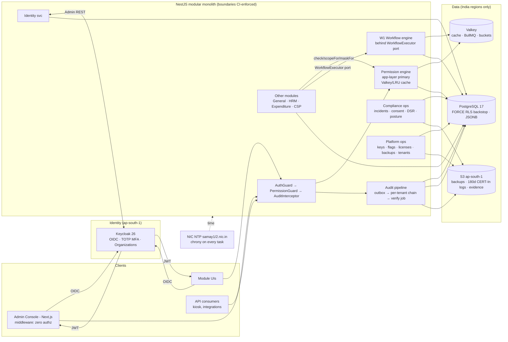
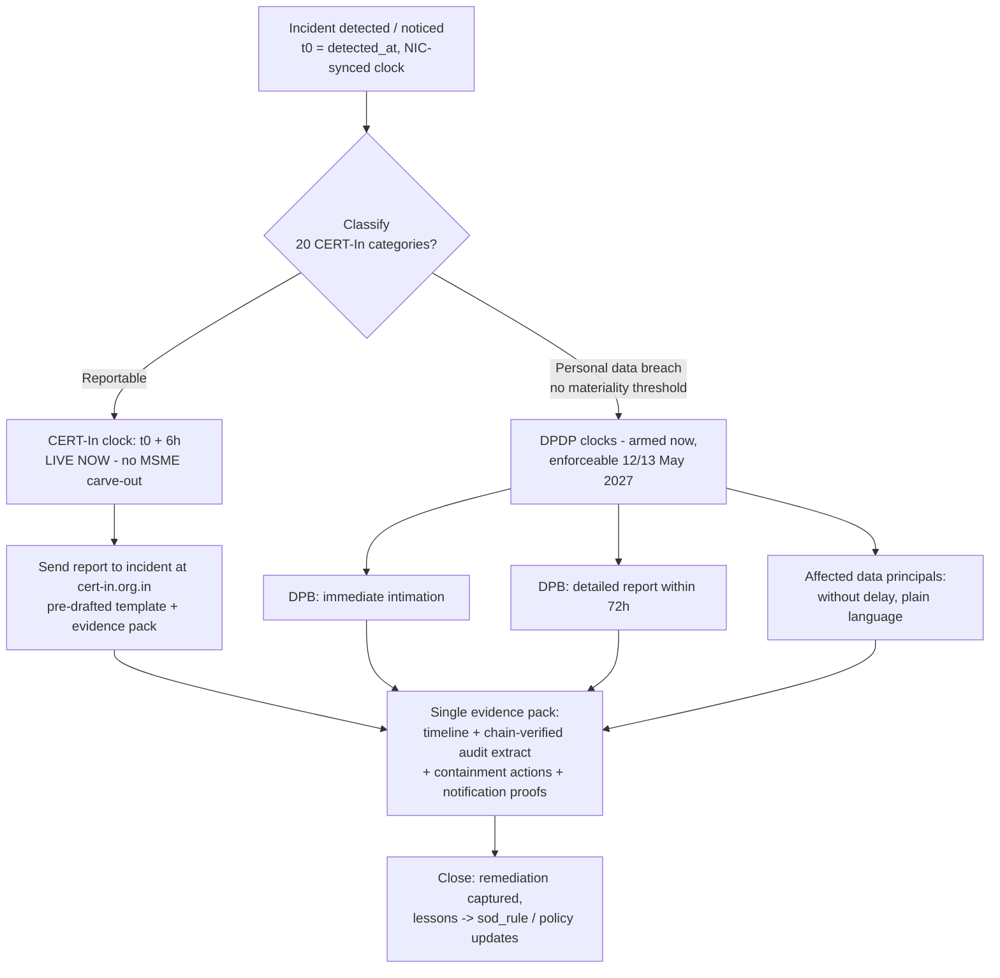

# IND-CORE Module 05 — Administration and Governance

## Engineering Implementation Blueprint

Administration is the **control plane** of the IND-CORE Manufacturing ERP. It publishes identity, access, governance, and operational machinery that the five sibling V2 modules — **General**, **HRM**, **Expenditure**, **CSP**, and **Integrations** — consume rather than reimplement. This blueprint is a post-due-diligence **V2** document: every choice conforms to **DECISIONS-V2** (binding digest), and the "What changed in V2" record (§1.2) traces each correction back to the diligence engagement. The V2 lineage is normative — the stack, the platform-table ownership, and the compliance posture below are not aspirations but acceptance criteria.

The demo universe is the **Trishul Precision Components Pvt Ltd** tenant (Pune HQ; plants Pune-Chakan and Coimbatore), with a second tenant **Kaveri ElectroFab Industries** (Bengaluru) present for tenant-isolation and leak-probe demonstrations. Sibling plans are referenced as PLAN-1-V2 … PLAN-6-V2; compliance facts derive from RES-compliance; architecture verdicts from RES-architecture (see Appendix A).

---

## 1. Module Overview

**Module 05 — Administration** is the single place where the platform's identity, access, governance, and operational machinery live: who can log in and how (OIDC via **Keycloak 26**, TOTP MFA, session and password policy), what each person can do (RBAC permission grid refined by row-level scoping and field-level masking, resolved by an in-app engine with Postgres **FORCE RLS** as the fail-closed backstop), how change is governed (a deliberately thin custom **W1** workflow engine consumed by every module through a `WorkflowExecutor` port), how the system proves what happened (a per-tenant SHA-256 hash-chained, INSERT-only audit log with no off-switch and 8-year retention), how the platform tells regulators what happened (a dual-clock breach playbook: CERT-In 6-hour reporting **live now**, DPDP Board timers armed for May 2027), and how the platform is operated (API keys, licenses, feature flags, settings, India-resident daily backups, NIC/NPL-synced clocks).

### 1.1 Published services & consumers

Every other module — General, HRM, Expenditure, CSP, Integrations — consumes services published here rather than reimplementing them:

| Service published by Administration | Consumed by |
|---|---|
| Authentication (Keycloak OIDC tokens, sessions, MFA) | All modules, kiosk clients, API consumers |
| Permission checks (RBAC + row scope + field masks; app-layer primary, FORCE RLS backstop) | Every API endpoint and UI screen platform-wide |
| Workflow/approval engine (W1: states, transitions, approvers, SLA timers — behind `WorkflowExecutor` port) | Expenditure (PO/claims), General (master changes), HRM (leave), CSP (escalations) |
| Audit pipeline (per-tenant hash chain, before/after diffs, verify job) | Every mutating operation in every module |
| AI governance substrate (`ai_action_log`, per-tenant opt-out, kill switch, token budgets) | All 8 MVP AI features platform-wide |
| DPDP machinery (`consent_record`, `dsr_request`, incident register, dual-clock playbook) | HRM, CSP customer portal, platform |
| API keys, scopes, rate limits; feature flags; licenses; tenant registry | Integrations layer, all modules |

### 1.2 Module boundary (load-bearing)

The **General module owns business master data** — companies as legal/costing entities, currencies, UoM, tax templates, number series, item/customer/supplier masters. **Administration owns who can do what, how they authenticate, how the system is governed, and how technical settings behave.** Where the two touch (e.g., "Company"), General defines the business record and Administration layers an *admin overlay* on top (security-policy binding, data-residency tag, delegated admins, default approval routing). Administration additionally owns the cross-module **platform tables**: `tenant` (registry — deliberately *not* RLS-scoped), `audit_log`, `ai_action_log`, `consent_record`, `dsr_request`, and `outbox_event` (per DECISIONS-V2 §5). Cross-references are by FK; nothing is duplicated.

### 1.3 Architecture at a glance



### 1.4 What changed in V2

This module absorbs most of the security and compliance corrections from the due-diligence engagement. All rows conform to DECISIONS-V2 (binding).

| # | V1 → V2 | Why (one line) |
|---|---|---|
| 1 | "Keycloak (with Auth.js fallback allowed by shared stack)" → **Keycloak 26 self-hosted ap-south-1 + Organizations, full stop; Auth.js retired platform-wide** | Auth.js cannot carry the orgs/SAML/LDAP/residency triad [DECISIONS-V2 §2] |
| 2 | Keycloak ops burden unpriced → **named ops budget line (or managed-KC alternative); Zitadel documented runner-up with explicit trigger** | Self-hosted IdP is real toil; the decision digest requires the cost to be visible [§1 Auth row] |
| 3 | Prisma → **Drizzle ORM v1**; audit diff capture moves from Prisma middleware to a repository-layer capture point | RLS `SET LOCAL` ergonomics (Prisma wraps every query in an interactive transaction; issue #12735 open) + SQL-first fit [§2] |
| 4 | Redis → **Valkey** (ElastiCache); BullMQ pinned versions | BSD license, ~20–30% cheaper, BullMQ CI passes on Valkey [§2] |
| 5 | Postgres 16, "RLS beneath everything" (loose) → **Postgres 17 + FORCE RLS fail-closed backstop with hardened acceptance criteria**: non-owner `app_user` (NOBYPASSRLS), `SET LOCAL` per transaction, UUIDv7, two-tenant leak probes in CI on every migration, week-1 RLS benchmark | ₹250cr DPDP safeguard exposure; RLS gotchas are engineering criteria, not aspirations [§2, §5] |
| 6 | Authz placement unstated for Next.js → **middleware performs zero authorization**; authz lives in NestJS guards + RLS only | CVE-2025-29927 lesson [§2] |
| 7 | Workflow engine (custom, informal scope) → **custom W1 engine with a hard feature budget — states/transitions/approvers/SLA timers ONLY — behind a `WorkflowExecutor` port, Temporal adoption triggers documented** | Scope-creep into homegrown BPM is a named risk; exit stays open ([RES-architecture §c](https://temporal.io/blog/temporal-replaces-state-machines-for-distributed-applications)) |
| 8 | MVP AI teaser "NL-to-workflow drafting" → **demoted to one scripted demo flow only**; Administration's only AI item is stretch #8: SoD-conflict *explanation text* (conflict logic stays deterministic) | AI portfolio cut ~40 → 8; NL-to-config has no shipped-and-stuck evidence [§4] |
| 9 | DPDP treated as broadly current → **corrected phase-in: Consent-Manager regime Nov 2026; ALL substantive obligations 12/13 May 2027**; marketing phrasing fixed to "DPDP-ready, aligned to DPDP Rules 2025 phase-in (May 2027)" | Rules notified 13/14 Nov 2025 with staggered commencement ([PIB](https://static.pib.gov.in/WriteReadData/specificdocs/documents/2025/nov/doc20251117695301.pdf)) |
| 10 | CERT-In noted as a setting → **normative live-now posture: 6-hour reporting muscle, 180-day rolling India-jurisdiction ICT logs as sprint-1 infrastructure, NIC/NPL NTP (chrony → `samay1/samay2.nic.in`) architecture** | Applies today, no MSME carve-out ([CERT-In Directions](https://www.cert-in.org.in/PDF/CERT-In_Directions_70B_28.04.2022.pdf)) |
| 11 | Breach handling = incident form → **dual-clock breach playbook**: CERT-In 6h (now) + DPB immediate/72h + data principals "without delay" (May 2027) — one playbook, two timers, single evidence pack | Two regulators, two clocks [RES-compliance §9.6] |
| 12 | Platform tables scattered → **Administration owns `tenant` registry (not RLS-scoped), `audit_log`, `ai_action_log`, `consent_record`, `dsr_request`** with UUIDv7 PKs, cursor pagination, canonical error envelope | Platform conventions normative [DECISIONS-V2 §5] |
| 13 | Terraform + MinIO (dev) → **OpenTofu (encrypted state) + Garage/LocalStack for dev object storage** | Native state encryption; MinIO community edition in maintenance mode [§2] |
| 14 | No dedicated sections → **new Edge Cases and Testing Strategy sections**, incl. authz golden matrix, RLS leak probes per migration, audit-chain tamper tests, restore drills that preserve chain integrity, and a **6-hour-incident tabletop exercise as a release gate** | Disproof pass: unenforced controls decay; compliance muscle must be rehearsed |

**MVP scope in one sentence:** Keycloak-26-backed OIDC authentication with TOTP MFA, session and password policy enforcement, an RBAC grid with row scoping and field masking (app-layer primary, FORCE RLS backstop), a linear multi-level W1 workflow engine behind a port, a per-tenant hash-chained non-disableable audit log with chain-verify and MCA Rule 11(g) export, CERT-In-grade incident/logging/NTP infrastructure live from sprint 1, DPDP-ready consent/DSR plumbing armed for May 2027, scoped hashed API keys, feature flags, and India-resident daily backups — demonstrated end-to-end on the Trishul Precision Components demo tenant.

**Deferred past MVP:** SAML per-tenant enterprise SSO, SCIM 2.0 provisioning, SIEM streaming, SoD analytics engine (deterministic rules table ships; stretch AI #8 adds explanation text only), policy-as-code/config promotion, parallel/branched workflows, delegation & out-of-office routing, Temporal adoption (triggers documented in §11 and §18).

### 1.5 Business problem this module solves

Indian SMB/mid-market manufacturers running spreadsheets or legacy ERPs face a cluster of governance failures this module solves:

1. **Everyone is an admin.** In typical Tally-plus-Excel setups, a handful of shared logins hold full access. Cost sheets, supplier pricing, BOM formulations (trade secrets), and employee PII/salary data are visible to anyone with the password. No least-privilege, no plant-level scoping, no field masking.
2. **Approvals live on WhatsApp.** Purchase orders above a threshold "need the Plant Head's OK," but that OK is a forwarded message, unenforced by the system. Documents post without approval; auditors find no trail. A configurable, role-gated, amount-conditioned approval engine is the fix — one shared engine, not per-module hard-coding.
3. **The MCA audit trail is legally mandatory and usually absent — and it binds the product, not just the customer.** Since 1 April 2023, the proviso to Rule 3(1), Companies (Accounts) Rules 2014 requires accounting software to record an audit trail of *each and every transaction*, an edit log of every change with the date, and to ensure the trail **cannot be disabled** ([ICAI Implementation Guide 2024](https://eirc-icai.org/uploads/background_materials/Revised%202024_Implementation%20Guide%20on%20Reporting%20of%20Audit%20Trail%20(1)_1712114860.pdf); [Taxguru](https://taxguru.in/company-law/audit-trail-companies-act-2013-wef-01-04-2023.html)). Auditors report on it under Rule 11(g); retention aligns with the **8-year** books-of-account requirement (s.128(5)). Rule 3(5)/(6) additionally requires books to remain accessible in India with **daily backup on servers physically located in India**. Most SMB systems fail this outright; ours must pass it by construction.
4. **DPDP Act 2023 + DPDP Rules 2025 turn the manufacturer into a Data Fiduciary — on a knowable clock.** The Rules were notified 13/14 November 2025 with staggered commencement: the Consent-Manager framework lands **November 2026** and *all substantive obligations* — notice, consent, security safeguards, breach notification (immediate intimation to the Data Protection Board + 72-hour detailed report + affected data principals "without delay", no materiality threshold), retention/erasure, data-principal rights with a 90-day response ceiling, penalties to **₹250 crore** — become enforceable **12/13 May 2027** ([PIB](https://static.pib.gov.in/WriteReadData/specificdocs/documents/2025/nov/doc20251117695301.pdf); [AZB Partners](https://www.azbpartners.com/bank/indias-digital-personal-data-protection-act-phased-rollout-and-key-compliance-milestones/); [Ikigai Law](https://www.ikigailaw.com/article/647/a-closer-look-at-the-dpdp-rules-2025)). Nothing substantive is enforceable in July 2026 — but the product ships into a market where everything lands within its first year. Retrofitting consent and erasure into a shipped schema is ~10× costlier than building the plumbing now. Note: employee data is a "legitimate use" under s.7 (no consent needed) — but safeguards, breach notification, and rights handling still apply.
5. **CERT-In directions apply to us today — no MSME carve-out.** The 28 April 2022 Directions bind "service providers, intermediaries, data centres, body corporate" — a SaaS ERP vendor squarely: **6-hour incident reporting** to incident@cert-in.org.in across 20 categories, **180-day rolling ICT logs within Indian jurisdiction**, and **clocks synced to NIC/NPL NTP** (`samay1.nic.in`/`samay2.nic.in`) or documented traceability — AWS Time Sync alone is not literally compliant ([CERT-In Directions](https://www.cert-in.org.in/PDF/CERT-In_Directions_70B_28.04.2022.pdf); [FAQs](https://www.cert-in.org.in/PDF/FAQs_on_CyberSecurityDirections_May2022.pdf)). Without a central audit pipeline and session/login telemetry, an SMB cannot even detect — let alone report — in six hours. Penalty: s.70B(7) IT Act, up to 1 year imprisonment / ₹1 lakh fine.
6. **IT Act §43A "reasonable security practices"** and customer/ISO/IATF audits demand demonstrable access control, maker-checker separation, and periodic access-review evidence. Enterprise ERPs bolt this on with expensive GRC add-ons; SMBs get nothing.
7. **Operational fragility.** No tested backups, no restore drills, no feature-rollout safety, no control over API/machine access from shop-floor kiosks and integration scripts — and now, no defensible answer when a statutory auditor or CERT-In asks for evidence.

Condensed: **manufacturers need enterprise-grade security, approvals, and regulator-ready compliance evidence at SMB cost and complexity** — built into the platform, not sold as an add-on.

---

## 2. Objectives

### 2.1 Product objectives (MVP, investor-demo quality)

| # | Goal | Measurable demo outcome |
|---|---|---|
| G1 | Secure identity: OIDC login via Keycloak 26, TOTP MFA, session policy | Live login as 3 personas; forced MFA on privileged role; idle-timeout and kill-session demo |
| G2 | Least-privilege access: RBAC grid + row scope + field masks | CNC Operator sees Pune-Chakan work orders only; cost fields masked; "Explain access" shows why |
| G3 | Governed change: W1 workflow with amount conditions | PO > ₹1,00,000 routes to Plant Head; live approval from the Approval Inbox; SLA countdown visible |
| G4 | Tamper-evident audit: per-tenant hash chain + explorer + verify job | Before/after diff of a price change; chain-verify passes live; tamper attempt breaks the chain visibly; Rule 11(g) export |
| G5 | Regulator readiness, live now: CERT-In posture | Incident register with 6-hour due-clock; 180-day India-resident log tile green; NTP traceability panel shows `samay1.nic.in` sync |
| G6 | DPDP-ready (May 2027): dual-clock playbook + DSR plumbing | Breach runbook screen arms both timers from one incident; one seeded DSR record with 90-day SLA tracker |
| G7 | Machine access under control: hashed, scoped API keys + rate limits | Kiosk key limited to production doctypes; revoke live, watch 401; rotation flow |
| G8 | Safe operations: flags, settings, India-resident daily backups | Toggle a flag per company (audited); backup tile green with last restore-test date and "India-region" badge |

### 2.2 Engineering objectives

- **Permission-check performance budget:** < 5 ms p95 warm (in-process + Valkey cache), < 1 ms on cache hit, ≤ 1 engine call per request for list scoping (predicates returned as data). End-to-end authorization overhead on a typical API request ≤ 8 ms p95. Week-1 benchmark of FORCE RLS overhead on the top-10 queries; **flip trigger: > 15–20% overhead** forces a design review [DECISIONS-V2 §5].
- **Zero bypass, two walls:** app-layer tenant scoping and permission checks are primary; **FORCE RLS with a non-owner `app_user` role (NOBYPASSRLS) and per-transaction `SET LOCAL app.tenant_id`** is the fail-closed backstop. Next.js middleware performs **zero authorization** (CVE-2025-29927 lesson); all authz in NestJS guards + RLS.
- **Audit writes never lost, never blocking:** transactional outbox in the same DB transaction as the business write; single-writer chain worker; p99 overhead on business writes < 8 ms; chain lag SLO < 5 s, alarmed.
- **No off-switch anywhere:** no code path, config flag, tenant setting, or admin role can disable audit capture on accounts-adjacent doctypes. This is a Rule 11(g) qualification risk, treated as a severity-1 defect class.
- **W1 budget discipline:** the workflow engine implements states, transitions, approvers, and SLA timers **only**, behind the `WorkflowExecutor` port. Any feature beyond that budget requires an ADR referencing the Temporal triggers.
- **Deny-by-default** resolution order: authenticate → effective roles → union of privileges → row-scope intersection → field masks → deny if no grant.
- **CI gates from sprint 1:** dependency-cruiser module-boundary checks; RLS policy-coverage + two-tenant leak probes on every migration; authz golden-matrix tests.

*(MVP non-goals are catalogued in §17.6 Anti-goals.)*

---

## 3. User Personas

At Trishul's ~120-employee scale, personas collapse onto fewer humans; the role model keeps the *capabilities* separate so the same design scales to multi-plant enterprises — and so the SoD principle (no role both changes security config and touches audit) survives the collapse.

| Persona | Demo identity (Trishul) | Primary needs in this module |
|---|---|---|
| **System Administrator** | Nikhil Sharma / Vikram Joshi (IT Admin, per PLAN-1) | User provisioning, roles, settings, backups, licenses, feature flags |
| **Security / IT Admin** | Nikhil Sharma (dual-hat at SMB scale) | MFA/password/session policy, API keys, session monitor, incident containment, breach runbook |
| **Compliance Officer / Internal Auditor** | Anita Joshi, Compliance Officer | Audit Explorer with chain-verify status, access-matrix export, Rule 11(g) evidence packs, DPDP/MCA/CERT-In posture |
| **Workflow / Process Owner** | Meera Iyer, Finance Controller | Design and maintain approval workflows (PO, claims), thresholds, notifications, simulation |
| **Approver (consumer persona)** | Rajesh Kulkarni, Plant Head | Approval Inbox: act on POs > ₹1,00,000, SLA countdown |
| **Requester (consumer persona)** | Deepa Menon, Purchase Officer | Sees workflow status on her POs; no admin surface |
| **Branch Admin (delegated)** | Arun Nair, Stores In-charge (Pune-Chakan) | Manage kiosk/operator accounts for own branch only |
| **DPO / Privacy Officer** | Priya Deshmukh, HR Manager (interim DPO) | PII-access log view, retention settings, consent records, DSR queue, breach-notification duties (May 2027) |
| **Shop-floor operator (consumer)** | Sanjay Patil, CNC Operator, Shift A | Scoped kiosk login; own plant's work orders, no cost fields |
| **Integration/DevOps engineer** | (Nikhil Sharma) | API keys, webhook stubs, environment settings, rate limits, NTP/log-retention infrastructure |
| **On-call incident commander (new in V2)** | Rotates: Nikhil / Meera | Owns the 6-hour CERT-In clock: classification matrix, pre-drafted report form, evidence-pack export |

### 3.1 Persona detail (goals / pain points / primary screens)

- **System Administrator (Nikhil / Vikram).** *Goals:* provision users in 30 seconds via role profiles, keep licenses/flags/backups green, never be the single point of lockout failure. *Pain points:* role sprawl, manual invitations, un-drilled restores, break-glass fear. *Primary screens:* User List & Detail, Role & Role Profile Manager, Licenses & Settings, Backup Status, API Keys / Feature Flags.
- **Security / IT Admin (Nikhil, dual-hat).** *Goals:* enforce MFA/session/password policy, spot credential-stuffing fast, contain incidents in minutes. *Pain points:* no telemetry, shared logins, no revocation muscle. *Primary screens:* Security Policy, Session Monitor, Breach Runbook, API Keys.
- **Compliance Officer / Internal Auditor (Anita).** *Goals:* prove the audit trail is intact and non-disableable, hand the statutory auditor an export not a meeting. *Pain points:* absent trails, no chain evidence, Rule 11(g) exposure. *Primary screens:* Audit Explorer (read/export only), Permission Matrix export, Rule 11(g) pack, Compliance posture.
- **Workflow / Process Owner (Meera).** *Goals:* model amount-based approvals, simulate approver chains before activation, avoid stalled instances. *Pain points:* WhatsApp approvals, per-module hard-coding, unversioned changes. *Primary screens:* Workflow Builder, Simulate, Approval Inbox (as Finance Controller escalation target).
- **Approver (Rajesh).** *Goals:* act on POs > ₹1,00,000 with full context and an SLA countdown, on mobile. *Pain points:* forwarded approvals, no trail, no deadline visibility. *Primary screens:* Approval Inbox (mobile-optimized).
- **Requester (Deepa).** *Goals:* see live status of her POs; never need an admin surface. *Pain points:* opaque approval state. *Primary screens:* workflow status widget in Expenditure (no admin surface).
- **Branch Admin (Arun).** *Goals:* manage Pune-Chakan kiosk/operator accounts only, bounded surface. *Pain points:* over-broad admin, cross-branch leakage. *Primary screens:* bounded User List (branch-scoped), kiosk key management.
- **DPO / Privacy Officer (Priya).** *Goals:* view PII-access logs, run the DSR queue with 90-day SLAs, honor statutory holds, be ready for May 2027. *Pain points:* no consent registry, no erasure logic. *Primary screens:* Privacy / DSR queue, Security Policy (DPDP safeguards checklist), Compliance posture.
- **Shop-floor operator (Sanjay).** *Goals:* scoped kiosk login to own plant's work orders, cost fields never shown. *Pain points:* cost/margin exposure, cross-plant visibility. *Primary screens:* kiosk work-order surface (no admin console).
- **Integration/DevOps engineer (Nikhil).** *Goals:* issue scoped hashed API keys, tune rate limits, keep NTP/log-retention infrastructure compliant. *Pain points:* unscoped machine access, offshore logs. *Primary screens:* API Keys, Settings, Compliance posture (NTP/log floors).
- **On-call incident commander (Nikhil / Meera, rotating).** *Goals:* own the 6-hour CERT-In clock — classify, contain, report, export evidence — inside the tooling. *Pain points:* no classification matrix, no pre-drafted form, no evidence pack. *Primary screens:* Breach Runbook, Session Monitor, Audit Explorer.

---

## 4. Functional Requirements

Requirements are tagged **[MVP]** or **[Post-MVP]**. IDs are stable for the roadmap checklists. V2 additions/changes are marked **(V2)**. The eight FR families below map to lettered sub-areas 4.A–4.H; every requirement in the source is preserved verbatim.

**Summary of the eight sub-areas:**

| Sub-area | Family | MVP thrust |
|---|---|---|
| 4.A | Identity & user management (FR-1) | Keycloak-provisioned users, invitation flow, bulk import, break-glass recovery |
| 4.B | Roles & RBAC permissions (FR-2) | Roles, role profiles, permission grid, deny-by-default resolution, "Explain access" |
| 4.C | Row-level & field-level permissions (FR-3) | Scope predicates + FORCE RLS backstop; field masks server-side |
| 4.D | Authentication, MFA, session & password policy (FR-4) | OIDC+PKCE, TOTP MFA, session registry, password policy, CERT-In login telemetry |
| 4.E | Workflow / approval engine — W1 (FR-5) | Budgeted engine behind `WorkflowExecutor`; linear multi-level approvals; simulation |
| 4.F | Audit pipeline (FR-6) | Append-only per-tenant hash chain, verify job, Explorer, Rule 11(g) export |
| 4.G | Incident, breach & compliance ops (FR-7) | Incident register, dual-clock automation, consent/DSR plumbing, posture panel |
| 4.H | API access, licenses, flags, settings, backups (FR-8) | Hashed scoped keys, licenses, flags, settings floors, India-resident backups, tenant registry |

### 4.A Identity & user management (FR-1)

- **FR-1.1 [MVP]** Create/edit/enable/disable users: name, login email, employee link (FK → General/HR employee), home company, default branch, auth source (`keycloak`), status (Invited → Active → Suspended → Locked → Disabled → Deprovisioned).
- **FR-1.2 [MVP]** Invitation flow: create user → provision in Keycloak via Admin REST API (tenant mapped to a **Keycloak Organization** (V2)) → email activation link → forced password set + MFA enrollment on first login for MFA-required roles.
- **FR-1.3 [MVP]** Password reset (admin-initiated and self-service via Keycloak flows); force-MFA-reset; force logout (revoke sessions app-side + Keycloak back-channel).
- **FR-1.4 [MVP]** Bulk CSV import of users with role-profile assignment and per-row validation report (strict schema, no formula pass-through; imported users start Invited).
- **FR-1.5 [MVP]** User detail shows: effective permissions viewer, row scopes, MFA devices, active sessions, API keys owned, last login.
- **FR-1.6 [MVP] (V2)** Admin break-glass recovery procedure for "last admin locked out with MFA lost": documented, dual-control, fully audited (see §15/§16) — runbook + sealed recovery credential, not a UI bypass.
- **FR-1.7 [Post-MVP]** SCIM 2.0 inbound provisioning; joiner/mover/leaver automation from HR events; access-review campaigns.

### 4.B Roles & RBAC permissions (FR-2)

- **FR-2.1 [MVP]** Roles with name, description, owner, category, `is_privileged` flag; lifecycle Draft → Active → Deprecated; role cloning.
- **FR-2.2 [MVP]** Role Profiles (bundles) for job-based provisioning; users get profiles, not hand-picked privileges.
- **FR-2.3 [MVP]** Permission grid per doctype × action: `create, read, write, delete, submit, cancel, amend, print, export, email, import, report, share`; permission level 0 = document, 1..n = field groups; `if_owner` flag.
- **FR-2.4 [MVP]** Effective-permission resolution (deny-by-default): union of profile roles + direct roles (minus time-expired grants) → union of privileges → row-scope intersection → field masks → simple JSONB ABAC predicates.
- **FR-2.5 [MVP]** "Explain access" simulator: user + doctype + action (+ optional record) → ALLOW/DENY with the full decision path. **(V2)** The simulator runs the *same* engine code path as enforcement (single pipeline), and a nightly divergence probe replays a sample of real decisions against the simulator to prove simulate == actual (see §16).
- **FR-2.6 [MVP] (V2)** Role/grant changes bump the user's `perm_version` and publish invalidation; **token claims are never the source of permissions** — changes take effect on the next request without re-login; privileged-role *revocations* additionally force session revocation (see §15/§16: role change mid-session).
- **FR-2.7 [Post-MVP]** SoD conflict engine with preventive grant-time checks; **(V2)** stretch AI #8 adds *explanation text* for a flagged conflict — the conflict logic itself stays deterministic rules in `sod_rule` [DECISIONS-V2 §4].

### 4.C Row-level (record) & field-level permissions (FR-3)

- **FR-3.1 [MVP]** Row scoping by dimension: Company, Branch/Plant, Warehouse, Cost Center, Department (Territory post-MVP); assignable to user or role; per-doctype or all; `is_default` drives list-view filters.
- **FR-3.2 [MVP] (V2)** Enforcement at the query layer: the engine returns scope predicates that module services apply via **Drizzle `where` composition**; beneath everything, **FORCE RLS on `tenant_id`** (non-owner `app_user`, `SET LOCAL` per transaction) is the fail-closed tenant backstop — app scoping is primary, RLS is the second wall, both mandatory [DECISIONS-V2 §5].
- **FR-3.3 [MVP]** Field-level rules per doctype/field/role: `hidden | read_only | masked | editable`; masking format (e.g., `₹ ****`); API responses strip/mask server-side, never client-side only.
- **FR-3.4 [MVP]** Manufacturing defaults shipped as templates: operators see routings but not cost/margin fields on BOMs; HR salary fields masked outside HR/Finance roles.
- **FR-3.5 [Post-MVP]** ABAC condition builder UI — MVP accepts hand-entered JSONB conditions on field rules only.

### 4.D Authentication, MFA, session & password policy (FR-4)

- **FR-4.1 [MVP] (V2)** OIDC Authorization Code + PKCE against **self-hosted Keycloak 26 in ap-south-1, one realm per environment, tenant = Keycloak Organization** (Organizations feature, first-class in KC 26). Short-lived JWT access tokens (5 min), rotating refresh tokens, httpOnly/SameSite cookies. **Auth.js is retired**; no fallback path exists.
- **FR-4.2 [MVP]** TOTP MFA (Keycloak-native), enforced per role via security policy; backup codes. **[Post-MVP]** WebAuthn/passkeys (flag `passkey_login_beta`), SMS OTP fallback via MSG91 (DLT templates).
- **FR-4.3 [MVP]** App-side session registry mirroring Keycloak sessions: idle timeout, absolute timeout, max concurrent sessions, revoke-one/revoke-all (Keycloak back-channel logout + **Valkey** revocation list checked by `AuthGuard`).
- **FR-4.4 [MVP]** Password policy (mapped to Keycloak realm policy): min length ≥ 12, breached-password check (HIBP k-anonymity, cached), history depth, lockout threshold/window; no forced periodic rotation per [NIST 800-63B](https://pages.nist.gov/800-63-4/sp800-63b.html).
- **FR-4.5 [MVP] (V2)** Login-attempt log (success/failure, IP, device fingerprint) — classified as **CERT-In ICT security telemetry**: retained ≥ 180 days rolling, **stored in Indian jurisdiction (ap-south-1)**, timestamps from NIC/NPL-synced clocks. Feeds the Security dashboard and the audit pipeline.
- **FR-4.6 [MVP] (V2)** Security policy bindable to company or global: MFA required, allowed factors, timeouts, concurrent cap, IP allowlist (CIDR), login hours. Geo/device rules **[Post-MVP]**.
- **FR-4.7 [Post-MVP]** SAML 2.0 per-tenant SSO (Keycloak brokering), JIT provisioning; kiosk PIN/badge fast-login for shop floor.

### 4.E Workflow / approval engine — platform service W1, budgeted (FR-5)

- **FR-5.0 [MVP] (V2)** **Feature budget (binding):** the engine implements **states, transitions, approver resolution, and SLA timers only**, exposed through the `WorkflowExecutor` port. Anything else (parallel branches, sagas, compensation, day-spanning orchestration) is out of budget; the documented exit is Temporal behind the same port [DECISIONS-V2 §1; RES-architecture §c].
- **FR-5.1 [MVP]** Workflow definitions per doctype with optional company scope; versioned; lifecycle Draft → Testing → Active → Deprecated. **In-flight instances stay pinned to their definition version** (see §15/§16).
- **FR-5.2 [MVP]** States (name, `is_editable`, allowed-edit role, mapped doc status) and transitions (action, from→to, allowed role, condition expression).
- **FR-5.3 [MVP]** Linear multi-level approval rules: sequence, condition expression (e.g., `amount > 100000`), approver resolution = named user | role | manager-of-requester; escalation timer (hours) with escalate-to target; auto-approve condition. Parallel approval **[Post-MVP — Temporal-trigger territory]**.
- **FR-5.4 [MVP]** Condition expressions: safe, sandboxed JSON-logic-style evaluator over a whitelisted context (`amount, company_id, branch_id, cost_center, item_group, requester_department`) — no arbitrary code, fuzz-tested.
- **FR-5.5 [MVP]** Runtime API via the port: `start(docType, recordId, context)`, `availableActions(user)`, `act(action, comment)`, `state()`, admin reassignment. Every action writes an immutable `workflow_action_log` row and a hash-chained audit entry, in one DB transaction with the document mutation.
- **FR-5.6 [MVP]** Approval Inbox: pending items with document summary, requester, amount, SLA countdown; approve / reject-with-reason; bulk approve. Delegation and recall **[Post-MVP]**; **(V2)** admin *reassignment* covers the "delegated approver leaves company" case in MVP (see §15/§16).
- **FR-5.7 [MVP]** Notification bindings per transition (email + in-app) using Handlebars templates.
- **FR-5.8 [MVP]** Simulation: run a sample context through a Draft definition, show the resolved approver chain before activation.
- **FR-5.9 [Post-MVP]** Visual drag-drop designer; workflow analytics. **(V2)** NL-to-workflow drafting is **not** an MVP feature — it survives only as *one scripted demo flow* [DECISIONS-V2 §4].

### 4.F Audit pipeline — statutory: MCA + CERT-In + DPDP (FR-6)

- **FR-6.1 [MVP]** Append-only `audit_log`: every login/logout, permission change, config change, and create/update/delete of business records with **before/after field values**, actor, IP, session, company/branch, result. INSERT-only grant for the app DB role + guard trigger; **no tenant-level or admin-level off-switch exists anywhere** (Rule 3(1) proviso).
- **FR-6.2 [MVP] (V2)** Hash chaining **per tenant**: `row_hash = SHA-256(prev_hash ‖ canonical_payload)` computed by a single-writer sequencer worker; daily anchor checkpoints; **scheduled verify job** (not just an endpoint) re-walks each tenant's chain and alarms on first divergence.
- **FR-6.3 [MVP] (V2)** Capture mechanics: NestJS audit interceptor (request context) + **repository-layer diff capture in the Drizzle data-access layer** (before/after field diffs) → `outbox_event`/`audit_outbox` row in the same transaction → BullMQ-on-Valkey `audit-chain` worker sequences, hashes, finalizes.
- **FR-6.4 [MVP]** Audit Explorer: filter by actor, doctype, record, action, date range, company/branch, result; before/after diff viewer; CSV/JSON evidence export (export itself audited).
- **FR-6.5 [MVP] (V2)** Retention floors enforced as settings with hard minimums: **8 years** for transaction-touching entries (MCA s.128(5) alignment); **≥ 180 days online, India-resident** for auth/security events (CERT-In); **≥ 1 year** for PII-access logs (DPDP Rule 6, effective May 2027 — enforced now). `is_pii_access` tagging feeds the privacy report.
- **FR-6.6 [MVP] (V2)** **Auditor export for MCA Rule 11(g):** one-click report per company/FY — audit-trail feature operated throughout the period, chain-verification attestations (verify-job history), edit-log extract for sampled transactions, retention statement.
- **FR-6.7 [Post-MVP]** SIEM export (Syslog/CEF, HTTPS push), S3 Object-Lock WORM archival, anomaly detection, NL audit query.

### 4.G Incident, breach & compliance operations — V2, promoted to first-class (FR-7)

- **FR-7.1 [MVP]** Incident register: title, severity, category (mapped to the **20 CERT-In-reportable categories**), detected_at, description, PII flags, affected-principal estimate, status.
- **FR-7.2 [MVP]** **Dual-clock automation:** on incident creation, compute and display (a) CERT-In `report_due_at = detected_at + 6h` for reportable categories — **live obligation now**; (b) DPDP timers — DPB immediate intimation + 72-hour detailed report + principals "without delay" — displayed as **"armed — enforceable 12/13 May 2027"** until phase-in, then hard. One playbook, two timers, single evidence pack.
- **FR-7.3 [MVP]** Pre-drafted CERT-In report template (per the official form), on-call rota reference, and one-click **evidence-pack export**: incident timeline, relevant chain-verified audit extract, affected sessions/keys, containment actions.
- **FR-7.4 [MVP]** `consent_record` platform table (purpose-tagged, CM-compatible design so a registered Consent Manager can be honoured when the regime goes live **Nov 2026**) and `dsr_request` queue (access/correction/erasure; ≤ 90-day SLA timer) — plumbing live, enforcement armed for May 2027. Consent-manager *integration* itself [Post-MVP].
- **FR-7.5 [MVP]** Compliance posture panel: CERT-In log-retention floor (≥180d, India), NTP sync status (chrony → `samay1/samay2.nic.in`, offset + traceability), MCA audit-trail status, daily India-backup evidence, DPDP phase-in countdowns.

### 4.H API access, licenses, flags, settings, backups (FR-8)

- **FR-8.1 [MVP]** API keys: name, owner, scopes (e.g., `production:write`), environment, rate limit (Valkey token bucket), IP allowlist, expiry; **secret shown once, stored as hash** with `key_prefix`; rotate/revoke; last-used tracking. `Idempotency-Key` honoured on mutating integration endpoints (replay-safe; 409 on hash mismatch) [DECISIONS-V2 §5].
- **FR-8.2 [Post-MVP]** OAuth2 client-credentials apps (Keycloak clients); outbound webhooks with HMAC-SHA256 signing (`t=…,v1=…`, 5-min tolerance, rotatable secrets) + delivery log/replay.
- **FR-8.3 [MVP]** License record per tenant: plan, named seats, entitled modules, validity; usage meter; soft enforcement.
- **FR-8.4 [MVP]** Feature flags: key, environment, scope (global/company/role), on/off; cached in-process SDK; every toggle audited. Percentage rollout **[Post-MVP]**.
- **FR-8.5 [MVP]** System settings registry: typed JSONB key/value, global or per-company, `is_secret` values as SSM refs; retention floors live here with hard minimums.
- **FR-8.6 [MVP] (V2)** Backup jobs: nightly full + WAL PITR via RDS, **daily backups on servers physically in India (ap-south-1; DR copy ap-south-2 — still India)** per MCA Rule 3(5)/(6); AES-256/KMS; GFS retention; last run/status/size; **last restore-test date**; restore drills must preserve audit-chain integrity (see §15/§16). Per-tenant export/PIT-restore runbook rehearsed [DECISIONS-V2 §5].
- **FR-8.7 [MVP]** Admin Home dashboard tiles incl. compliance posture (FR-7.5).
- **FR-8.8 [MVP]** Company overlay (1:1 with General company): security-policy binding, data-residency tag (`in-region` default), delegated admins, flag overrides. Branch registry view with branch-admin bounded surface.
- **FR-8.9 [MVP] (V2)** **Tenant registry** (`tenant` — platform table, deliberately not RLS-scoped): tenant lifecycle (active/suspended/offboarding), Keycloak org mapping, silo-tier flag (bridge-ready), offboarding state machine (export → verify → crypto-shred; see §15/§16).

---

## 5. Non-functional Requirements

NFRs are synthesized from the engineering objectives (§2.2) and the system architecture (§11); each carries an acceptance signal. They are binding V2 acceptance criteria, not aspirations.

| ID | Category | Requirement | Acceptance signal |
|---|---|---|---|
| **NFR-01** | Performance — authz hot path | Permission check < 5 ms p95 warm, < 1 ms on cache hit; ≤ 1 engine call per request for list scoping (predicates returned as data); ≤ 8 ms p95 total authorization overhead per request | Load test at 50 concurrent users; OTel `permission.decision` span p95 on the demo Grafana board |
| **NFR-02** | RLS overhead budget | FORCE RLS overhead on the top-10 queries benchmarked in week 1; **> 15–20% overhead triggers a mandatory design review** [DECISIONS-V2 §5] | Week-1 benchmark artifact; flip-trigger gate recorded in ADR |
| **NFR-03** | Fail-closed tenant isolation | Two walls: app-layer scoping primary + FORCE RLS backstop (non-owner `app_user` NOBYPASSRLS, `SET LOCAL app.tenant_id` per tx); a forgotten `SET LOCAL` returns **zero rows, not all rows**; Next.js middleware performs **zero authorization** (CVE-2025-29927) | Two-tenant leak probes green on every migration; missing-context probe returns zero rows |
| **NFR-04** | Audit durability & non-blocking | Audit writes never lost, never blocking: transactional outbox in the business tx; single-writer chain worker; p99 overhead on business writes < 8 ms; chain lag SLO < 5 s, alarmed | `audit.chain_lag` span < 5 s; nothing lost when a worker is killed mid-run |
| **NFR-05** | No off-switch (immutability) | No code path, config flag, tenant setting, or admin role can disable audit capture on accounts-adjacent doctypes; UPDATE/DELETE on `audit_log` rejected at grant *and* guard trigger | Off-switch code-scan gate; both-walls immutability test; treated as a severity-1 defect class |
| **NFR-06** | Retention floors | Hard minimums in `system_setting`: **8 years** transaction-touching (MCA s.128(5)); **≥ 180 days online, India-resident** auth/security (CERT-In); **≥ 1 year** PII-access (DPDP Rule 6) — UI cannot set below floors | Settings service refuses sub-floor values; posture panel shows floors |
| **NFR-07** | Data residency (India) | Identity data never leaves India (Keycloak ap-south-1); CERT-In ICT/security logs live in ap-south-1 S3 (180-day lifecycle), never solely offshore; backups in ap-south-1, DR ap-south-2 (both India) | Log-architecture review; SaaS observability restricted to metrics/traces or contractually India-pinned [RES-compliance §9.7] |
| **NFR-08** | Availability & DR | Keycloak multi-AZ with its DB in the RDS PITR regime; RDS Postgres 17 encrypted + PITR; DR region ap-south-2; Keycloak outage never degrades to weaker auth (refresh fails → "sign-in temporarily unavailable") | Keycloak-outage edge case rehearsed; KC restore part of the restore drill |
| **NFR-09** | Backup SLA | Nightly full + WAL PITR (RDS); daily India-resident backups (Rule 3(5)/(6)); AES-256/KMS; GFS retention; last-restore-test tracked (stale > 90d ambers); restore drills preserve audit-chain integrity | `restore_preserved_chain = true` recorded each release; restore drill is a release gate |
| **NFR-10** | Time-sync accuracy | Clocks NIC/NPL-traceable: chrony → `samay1/samay2.nic.in` primary + AWS Time Sync fallback (documented traceability); offset telemetry every 5 min; sustained offset > 100 ms alarms | `time_sync_log` evidence; posture panel offset indicator; hash-chain ordering never depends on wall-clock |
| **NFR-11** | Incident reporting SLA | CERT-In 6-hour reporting live now (no MSME carve-out); DPDP DPB immediate/72h + principals "without delay" armed for 12/13 May 2027; single evidence pack for both clocks | 6-hour tabletop exercise as release gate; dual-clock automation computes both timers on incident creation |
| **NFR-12** | Scalability & bridge-readiness | Pooled shared schema + `tenant_id` + FORCE RLS, bridge-ready to a silo tier for premium tenants (documented exit, not an MVP build); PgBouncer/transaction-pooling-safe via `SET LOCAL` | 50-concurrent-user demo load; composite indexes lead with `tenant_id` |
| **NFR-13** | W1 budget discipline | Workflow engine implements states/transitions/approvers/SLA timers **only**, behind `WorkflowExecutor`; any excess requires an ADR referencing Temporal triggers | W1 budget ADR signed at sprint-3 exit; port boundary dependency-cruiser-enforced |
| **NFR-14** | Security posture (deny-by-default) | Deny-by-default resolution order; 5-min access tokens + rotating refresh; httpOnly/SameSite cookies; Valkey revocation checked per request; token claims are never the source of permissions | OWASP ASVS 5.0 L2 spot-check; authz golden-matrix invariant (no grant → DENY, ever) |
| **NFR-15** | Observability & SLOs | OTel spans tag `permission.decision`, `audit.chain_lag`, `workflow.transition`; module SLOs (check < 5 ms p95, chain lag < 5 s) on the demo Grafana board; Sentry for errors | Grafana board renders SLOs; CERT-In logs pinned to India regardless of SaaS tooling |
| **NFR-16** | Maintainability & boundaries | Boundary-enforced modular monolith; modules import Administration only via public `index.ts`/ports; dependency-cruiser CI gates from sprint 1 | Boundary violations fail CI; runtime assertion that no module reaches workflow/audit tables except via ports |

---

## 6. UI/UX Flow

The admin console lives at `/admin` inside the shared Next.js shell (left nav, tenant/company switcher, ⌘K command palette). Desktop-first with responsive collapse; the Approval Inbox is fully mobile-optimized. Destructive actions use typed confirmation. Deny states are explanatory — a 403 renders the engine's decision reason rather than a blank wall. Every admin change shows "who last changed this" linking into the Audit Explorer pre-filtered. INR is displayed in lakh/crore format. The primary admin loops:

- **Provisioning loop.** Admin opens User List → creates a user or runs the bulk-import wizard → assigns a **Role Profile** (job bundle, not hand-picked privileges) → Keycloak Organization provisioning + activation email fire → the invitee sets a password and enrolls TOTP on first login (forced for MFA-required roles). Provisioning a "Purchase Officer — Pune" takes ~30 seconds.
- **Permission-design loop.** Workflow/Security owner opens Role & Role Profile Manager → edits the doctype × 13-action grid (tri-state, `if_owner` toggles) → reviews an **unsaved-diff preview** (the diff is exactly what gets audited) → saves → affected users' `perm_version` bumps and takes effect on their next request (no re-login).
- **Explain-access loop.** Anyone debugging access opens the **"Explain access" simulator** drawer → picks user + doctype + action (+ optional record) → gets an ALLOW/DENY verdict chip and a step-by-step decision path ("✔ role *Purchase Officer* grants `PurchaseOrder.create` · ✔ scope Branch = Pune-Chakan matches · ⚠ `unit_cost` masked"). The simulator runs the enforcement pipeline; a footer shows the nightly divergence-probe pass timestamp.
- **Approval loop.** Requester submits (in a module) → W1 resolves the approver chain → approver opens the **Approval Inbox** (mobile swipe supported) → sees doc summary, ₹ amount, and an SLA countdown chip (amber < 4h) → approves or rejects-with-reason → the action is written in one DB transaction with the doc mutation and hash-chained audit.
- **Audit-investigation loop.** Auditor opens the **Audit Explorer** → filters (actor/doctype/record/action/dates/result/PII-only) + fuzzy search → expands a row to a red/green before/after diff → confirms the **chain-verify badge** ("Chain intact through seq 48,115 · verified 02:00 IST") → exports an audited evidence bundle. No edit affordances exist anywhere by design.
- **Breach/incident loop.** On-call opens the **Breach Runbook** → classifies against the 20 CERT-In categories → the **dual-clock header** arms (CERT-In 6h live; DPDP timers "armed — May 2027") → runs one-click containment (kill sessions / disable user / rotate key, each audited) → fills the pre-drafted CERT-In template → exports the evidence pack. Target: contained and reported inside the 6-hour clock.
- **Privacy/DSR loop.** DPO opens the **Privacy / DSR queue** → browses consent records (purpose, basis, given/withdrawn) → works the DSR queue with 90-day SLA bars → statutory-hold indicators block erasure where books-retention applies ("erasure blocked: 8-year books retention until 2034").
- **Operations loop.** Admin monitors **Admin Home** tiles (Normal / Degraded / Critical), toggles a feature flag (audited, 30s undo toast), checks **Backup Status** (India-region badge, last restore-test, `restore_preserved_chain`), and manages **API Keys** (secret-shown-once, rotate with overlap window, revoke → immediate 401).

---

## 7. Screen-by-Screen Design

Fifteen screens compose the console. Each notes layout, key components, actions, and empty/error states. Shared conventions: typed confirmation on destructive actions; explanatory 403s (rendered from the engine's decision reason); "who last changed this" deep-links into a pre-filtered Audit Explorer; INR in lakh/crore.

### 7.1 Admin Home / Console
- **Layout:** tile grid with a Normal / Degraded / Critical state banner.
- **Key components:** tiles — Active users, Failed logins 24h (sparkline), Backup status (+ India-region badge, last restore-test), Pending approvals, License seats, Flag changes 7d, Open incidents (with soonest CERT-In due-clock), and a **Compliance posture strip** (NTP offset ✓, 180-day log floor ✓, chain-verify ✓, DPDP countdowns).
- **Actions:** drill into any tile's underlying screen.
- **Empty/error:** first-run shows zeroed tiles with setup hints; a degraded backup or amber NTP offset flips the relevant tile and the top banner.

### 7.2 User List & Detail
- **Layout:** table + tabbed detail; bulk-import wizard.
- **Key components:** table columns — status, role-profile chips, MFA ✓/✗, last login. Detail tabs: Profile | Access (grants + valid-until + effective-permissions viewer) | Scopes | Security (MFA devices, sessions with revoke, recent logins) | API keys.
- **Actions:** create/edit/enable/disable, reset credentials (password|MFA), assign role profile, revoke sessions, bulk CSV import.
- **Empty/error:** empty list → "Invite your first user"; CSV import renders a per-row validation report (strict schema; imported users start Invited); Branch Admin sees a branch-bounded subset only.

### 7.3 Role & Role Profile Manager
- **Layout:** role list + permission grid editor.
- **Key components:** doctypes × 13 actions, tri-state checkboxes, `if_owner` toggles, virtualized (TanStack Table); unsaved-diff preview before save (the diff is what gets audited); role clone; lifecycle chips (Draft → Active → Deprecated).
- **Actions:** create/clone role, edit grid, bundle profiles, save (bumps `perm_version` of affected users).
- **Empty/error:** unsaved-changes guard; save shows the audited diff; deprecated roles are read-only.

### 7.4 Permission Matrix + "Explain access" simulator
- **Layout:** cross-role matrix with export + a simulator drawer.
- **Key components:** matrix (roles × doctypes/actions) with CSV export; simulator drawer — user + doctype + action + optional record → ALLOW/DENY verdict chip + step-by-step decision path; footer note "simulator runs the enforcement pipeline — verified nightly" (divergence-probe status).
- **Actions:** run simulate, export matrix.
- **Empty/error:** simulate against a non-existent grant returns an explicit DENY with the missing-grant reason; simulator always bypasses the cache (fresh compile).

### 7.5 Row-Scope & Field Rules
- **Layout:** two rule tables (row scopes, field rules).
- **Key components:** "preview affected records" for row scopes; field rules with live "view as role" masked preview (`hidden | read_only | masked | editable`, mask format).
- **Actions:** create/edit/delete scope rules and field rules; preview.
- **Empty/error:** preview shows zero-match warnings; masks are applied server-side even in the preview.

### 7.6 Security Policy
- **Layout:** card sections (MFA / session / network / password) + a read-only compliance strip.
- **Key components:** NIST hints (no forced rotation; breached-password check); "simulate impact" count of affected users; compliance strip — DPDP safeguards checklist (armed May 2027), CERT-In floors, MCA status (read-only indicators from settings).
- **Actions:** edit policy (synced to Keycloak realm; drift-checked), bind to company or global, set IP allowlist (CIDR).
- **Empty/error:** sub-floor retention values are refused with the hard minimum shown; realm-sync drift raises an alarm indicator.

### 7.7 Session Monitor
- **Layout:** live table (Socket.IO) + login-attempt sub-tab.
- **Key components:** columns — user, IP, device, MFA badge; revoke actions; login-attempt sub-tab with failure facets; concurrent-cap breach banner.
- **Actions:** revoke-one / revoke-all (propagates to Valkey + Keycloak back-channel, < 5 s to 401).
- **Empty/error:** no active sessions → quiet state; a concurrent-cap breach raises a banner.

### 7.8 Workflow Builder
- **Layout:** definitions list + detail with a read-only state diagram.
- **Key components:** list columns — doctype, scope, version, status, active instances. Detail: States, Transitions, Approval-level cards (condition, approver, escalation); auto-rendered read-only **Mermaid** state diagram; Simulate (context form → approver chain); Activate (guarded — warns about in-flight pinning); Version history. *(V2: no AI drawer — NL-to-workflow is a scripted demo only.)*
- **Actions:** create/edit Draft (editing Active forks version n+1), simulate, activate, view versions.
- **Empty/error:** activation warns with the in-flight instance count (pinned to prior version); a broken pinned definition is resolved via per-instance reassign, never in-place surgery.

### 7.9 Approval Inbox
- **Layout:** card list, mobile-optimized.
- **Key components:** doc badge, requester, ₹ amount, SLA countdown chip (amber < 4h), Approve / Reject-with-reason, bulk approve; mobile swipe actions.
- **Actions:** approve, reject-with-reason, bulk approve.
- **Empty/error:** empty inbox → "No pending approvals"; a stale item past SLA shows the escalation state.

### 7.10 Audit Explorer (compliance showpiece)
- **Layout:** filter bar + virtualized results + side panel; header chain badge.
- **Key components:** filters (actor, doctype, record, action, dates, result, PII-only) + fuzzy search; virtualized results; row expand → before/after diff (red/green); side panel with actor/session/IP; header **chain-verify status badge** ("Chain intact through seq 48,115 · verified 02:00 IST by nightly job") with on-demand re-verify; Export evidence (audited).
- **Actions:** filter/search, expand diff, re-verify chain, export.
- **Empty/error:** no edit affordances anywhere by design; a chain break surfaces the first-break `tenant_seq` in the header.

### 7.11 Breach Runbook screen (V2)
- **Layout:** incident detail rendered as a *runbook* with a dual-clock header.
- **Key components:** classification picker (20 CERT-In categories); dual-clock header (CERT-In 6h countdown live; DPDP DPB immediate/72h/principals timers shown "armed — May 2027"); containment checklist with one-click actions (kill sessions / disable user / rotate key — each audited); pre-filled CERT-In report template; **"Export evidence pack"** (timeline + chain-verified audit extract + containment log → PDF/ZIP).
- **Actions:** classify, contain, record report/notification timestamps, export evidence pack.
- **Empty/error:** non-reportable classification hides the CERT-In clock but keeps the record; a personal-data breach arms the DPDP timers.

### 7.12 Privacy / DSR queue (V2)
- **Layout:** consent browser + DSR queue.
- **Key components:** consent records browser (purpose, basis, given/withdrawn); DSR queue with 90-day SLA bars and statutory-hold indicators ("erasure blocked: 8-year books retention until 2034"); DPO contact setting.
- **Actions:** work DSR items (access/correction/erasure), record resolution, set DPO contact.
- **Empty/error:** erasure under a statutory hold returns `refused_statutory_hold` with the legal basis; SLA bars amber at 60/80 days.

### 7.13 API Keys / Feature Flags
- **Layout:** key list + flag list.
- **Key components:** key prefix display, scopes chips, secret-shown-once gate, rotate/revoke, last-used sparkline; flags with audited toggles + 30s undo toast.
- **Actions:** create key (secret shown once), rotate (overlap window), revoke (→ immediate 401); toggle flag (audited).
- **Empty/error:** the full secret is unrecoverable after creation (hash-only); revoked keys show 401 usage immediately.

### 7.14 Backup Status
- **Layout:** job cards.
- **Key components:** schedule, last run, GFS chips, **India-region badge**, last restore-test date (stale > 90d ambers), `restore_preserved_chain` indicator; "Run now"; restore links to runbook.
- **Actions:** run-now, open restore runbook.
- **Empty/error:** a stale restore-test date ambers the card; a failed job raises an alert.

### 7.15 Licenses & Settings
- **Layout:** seat gauge + grouped/searchable settings registry.
- **Key components:** seat gauge, module entitlements; settings registry grouped/searchable, secret values masked (SSM refs), **retention-floor fields show hard minimums and refuse lower values**.
- **Actions:** edit settings (floors enforced server-side), view entitlements.
- **Empty/error:** attempting a sub-floor retention value is rejected inline with the minimum shown; secret values never display plaintext.

---

## 8. Navigation

### 8.1 Sidebar / nav tree

The console mounts at `/admin` in the shared Next.js shell (left nav + tenant/company switcher + ⌘K command palette). The tree is permission-gated — a node renders only if the principal holds a grant for its underlying doctype/action.

```
/admin
├── Home                         → 7.1  Admin Home / Console
├── Identity
│   ├── Users                    → 7.2  User List & Detail
│   ├── Roles & Role Profiles    → 7.3  Role & Role Profile Manager
│   └── Permission Matrix        → 7.4  Permission Matrix + Explain access
├── Access Rules
│   ├── Row Scopes & Field Rules → 7.5  Row-Scope & Field Rules
│   └── Security Policy           → 7.6  Security Policy
├── Sessions                      → 7.7  Session Monitor (+ Login attempts sub-tab)
├── Workflow
│   ├── Definitions               → 7.8  Workflow Builder
│   └── Approval Inbox            → 7.9  Approval Inbox
├── Audit & Compliance
│   ├── Audit Explorer            → 7.10 Audit Explorer
│   ├── Breach Runbook / Incidents→ 7.11 Breach Runbook
│   ├── Privacy / DSR             → 7.12 Privacy / DSR queue
│   └── Compliance Posture        → strip surfaced on Home + this deep view
├── Platform Ops
│   ├── API Keys                  → 7.13 API Keys / Feature Flags
│   ├── Feature Flags             → 7.13 API Keys / Feature Flags
│   ├── Backups                   → 7.14 Backup Status
│   ├── Licenses & Settings       → 7.15 Licenses & Settings
│   ├── Company Overlay / Branches→ FR-8.8 admin overlay + branch registry
│   └── Tenant Registry           → FR-8.9 tenant lifecycle (platform role only)
```

### 8.2 Permission-gated visibility

- **Compliance Auditor** (Anita) sees Audit & Compliance with read/export only — no edit affordances anywhere in the Audit Explorer by design.
- **Branch Admin** (Arun) sees a bounded Identity surface scoped to his branch (Pune-Chakan) and kiosk-key management; no security-policy or tenant-registry nodes.
- **Tenant Registry** is restricted to the platform role (it is the thing RLS scopes *by*, deliberately not RLS-scoped).
- **Shop-floor operator** (Sanjay) has no admin console at all — kiosk surface only.
- Nodes a principal cannot act on are hidden, not merely disabled; direct navigation to a gated route renders an explanatory 403 (the engine's decision reason).

### 8.3 Breadcrumbs & deep links

- Breadcrumbs follow the tree, e.g. `Admin / Audit & Compliance / Audit Explorer`.
- **"Who last changed this"** on any admin record deep-links into the Audit Explorer pre-filtered to that record (`/admin/audit?record_id=…`).
- Home tiles deep-link into their screens (e.g., Open incidents tile → the incident's Breach Runbook with the CERT-In clock already ticking).
- The ⌘K command palette jumps to any screen or entity by name (user finder powered by Postgres FTS + pg_trgm).
- Backup card "restore" links to the restore runbook; incident evidence-pack links resolve to short-TTL presigned S3 URLs.

---

## 9. Database Schema (PostgreSQL 17)

**Platform conventions (normative, DECISIONS-V2 §5):** UUIDv7 PKs; every tenant-scoped table carries `tenant_id` + `created_at/by`, `updated_at/by`, `is_active` soft delete (no hard DELETE on masters/financial documents); composite indexes lead with `tenant_id`; **FORCE RLS** pattern on every tenant-scoped table (one simple policy); effective-dated statutory config (INSERT-new-row with `effective_from`, never constants in code); outbox events versioned (`module.entity.verb.v1`). Schema is defined in **Drizzle ORM v1** (drizzle-kit migrations), with raw SQL for the sharp edges (chain sequencer under advisory lock, verification walks, dynamic Audit Explorer filters). Repeated columns are omitted from the column tables below. **Bold** = MVP; *italic* = post-MVP (schema may ship early, unused).

### 9.1 The FORCE RLS pattern (applied to every tenant-scoped table)

The app connects only as a **non-owner `app_user` role (NOBYPASSRLS)**; tenancy middleware opens each request's transaction with `SET LOCAL app.tenant_id`. An engine bug cannot leak across tenants; a forgotten `SET LOCAL` returns zero rows rather than all rows.

```sql
-- Role the application connects as (cannot bypass RLS; not the table owner)
CREATE ROLE app_user NOLOGIN NOBYPASSRLS;

-- Canonical per-table isolation policy (one simple policy per tenant-scoped table)
ALTER TABLE <t> ENABLE ROW LEVEL SECURITY;
ALTER TABLE <t> FORCE ROW LEVEL SECURITY;              -- owner cannot bypass either
CREATE POLICY tenant_isolation ON <t>
  USING      (tenant_id = current_setting('app.tenant_id')::uuid)
  WITH CHECK (tenant_id = current_setting('app.tenant_id')::uuid);

-- Per-request, per-transaction tenant binding (Drizzle SQL-first; PgBouncer-safe)
BEGIN;
  SET LOCAL app.tenant_id = '<uuid from JWT>';
  -- ... module queries; app scoping composes Drizzle WHERE predicates on top ...
COMMIT;
```

### 9.2 Platform tables owned by Administration (cross-module)

`tenant` is the single deliberate exception to RLS scoping — it is the thing RLS scopes *by*. DDL for the six platform tables:

```sql
-- tenant registry — deliberately NOT RLS-scoped; access restricted to the platform role
CREATE TABLE tenant (
  id                uuid PRIMARY KEY DEFAULT uuidv7(),
  name              text NOT NULL,
  status            text NOT NULL DEFAULT 'active'      -- active|suspended|offboarding|offboarded
                    CHECK (status IN ('active','suspended','offboarding','offboarded')),
  kc_org_id         text,                                -- Keycloak Organization mapping
  tier              text NOT NULL DEFAULT 'pooled'       -- pooled | silo (post-MVP bridge)
                    CHECK (tier IN ('pooled','silo')),
  data_residency    text NOT NULL DEFAULT 'in-region',
  offboarding_state jsonb,                               -- export → verify → crypto-shred state machine
  created_at        timestamptz NOT NULL DEFAULT now(),
  updated_at        timestamptz NOT NULL DEFAULT now()
);
COMMENT ON TABLE tenant IS 'Platform registry; every other table.tenant_id FKs here. NOT RLS-scoped.';

-- audit_log — append-only, per-tenant SHA-256 hash chain; INSERT-only + guard trigger; 8-yr floor
CREATE TABLE audit_log (
  id            bigserial PRIMARY KEY,                   -- global insert order
  tenant_id     uuid NOT NULL REFERENCES tenant(id),
  tenant_seq    bigint NOT NULL,                         -- per-tenant chain order
  event_time    timestamptz NOT NULL,                    -- NIC/NPL-traceable
  actor_user_id uuid,
  action        text NOT NULL,
  doc_type      text,
  record_id     text,
  field_changes jsonb,                                   -- before/after diff
  company_id    uuid,
  branch_id     uuid,
  ip_address    inet,
  session_id    uuid,
  result        text NOT NULL,
  is_pii_access boolean NOT NULL DEFAULT false,
  source        text NOT NULL DEFAULT 'human'            -- human | ai_assisted | system
                CHECK (source IN ('human','ai_assisted','system')),
  prev_hash     char(64),
  row_hash      char(64),
  UNIQUE (tenant_id, tenant_seq)
);
CREATE INDEX audit_log_changes_gin ON audit_log USING gin (field_changes);
CREATE INDEX audit_log_doc_trgm    ON audit_log USING gin (doc_type gin_trgm_ops, record_id gin_trgm_ops);
-- app_user has INSERT only; a guard trigger rejects UPDATE/DELETE regardless of role.

-- ai_action_log — hash-chained log of every AI router call (all 8 features); same chain mechanics
CREATE TABLE ai_action_log (
  id               uuid PRIMARY KEY DEFAULT uuidv7(),
  tenant_id        uuid NOT NULL REFERENCES tenant(id),
  user_id          uuid NOT NULL,                        -- calling JWT — never a super-role
  feature          text NOT NULL,                        -- e.g. 'sod_explain'
  model            text NOT NULL,
  input_digest     text NOT NULL,
  output_digest    text NOT NULL,
  schema_valid     boolean NOT NULL,
  accepted_by_user boolean,
  token_cost       integer NOT NULL DEFAULT 0,
  prev_hash        char(64),
  row_hash         char(64),
  created_at       timestamptz NOT NULL DEFAULT now()
);

-- consent_record — DPDP consent registry, CM-compatible; employment rows carry basis=legitimate_use (s.7)
CREATE TABLE consent_record (
  id                 uuid PRIMARY KEY DEFAULT uuidv7(),
  tenant_id          uuid NOT NULL REFERENCES tenant(id),
  data_principal_ref text NOT NULL,
  purpose_code       text NOT NULL,
  basis              text NOT NULL                       -- consent | legitimate_use_employment
                     CHECK (basis IN ('consent','legitimate_use_employment')),
  given_at           timestamptz,
  withdrawn_at       timestamptz,
  via                text NOT NULL DEFAULT 'direct'       -- direct | consent_manager (Nov 2026)
                     CHECK (via IN ('direct','consent_manager')),
  notice_version     text
);

-- dsr_request — data-principal rights queue; 90-day SLA; statutory-hold aware
CREATE TABLE dsr_request (
  id                  uuid PRIMARY KEY DEFAULT uuidv7(),
  tenant_id           uuid NOT NULL REFERENCES tenant(id),
  type                text NOT NULL                      -- access | correction | erasure
                      CHECK (type IN ('access','correction','erasure')),
  data_principal_ref  text NOT NULL,
  received_at         timestamptz NOT NULL,
  due_at              timestamptz NOT NULL,               -- received + 90d
  status              text NOT NULL DEFAULT 'open'        -- open|in_progress|fulfilled|refused_statutory_hold
                      CHECK (status IN ('open','in_progress','fulfilled','refused_statutory_hold')),
  resolution          jsonb,
  statutory_hold_refs text                                -- e.g. 8-yr books retention
);

-- outbox_event — transactional outbox; written in the business tx; Valkey relay; idempotent consumers
CREATE TABLE outbox_event (
  id           uuid PRIMARY KEY DEFAULT uuidv7(),
  tenant_id    uuid NOT NULL REFERENCES tenant(id),
  event_name   text NOT NULL,                             -- 'admin.user.created.v1' …
  payload      jsonb NOT NULL,
  created_at   timestamptz NOT NULL DEFAULT now(),
  processed_at timestamptz
);
```

| Table | Purpose | Notes |
|---|---|---|
| **`tenant`** | Tenant registry — **deliberately NOT RLS-scoped** | Access restricted to platform role; every other table's `tenant_id` FKs here |
| **`audit_log`** | Append-only, per-tenant hash-chained statutory log | INSERT-only grant + guard trigger; UNIQUE(tenant_id, tenant_seq); GIN on `field_changes`; trgm on doc_type/record_id; 8-yr retention floor |
| **`ai_action_log`** | Hash-chained log of every AI router call (all 8 features) | Same chain mechanics as audit_log; per-tenant opt-out + kill switch honoured upstream; `user_id` = calling JWT, never a super-role |
| **`consent_record`** | DPDP consent registry (CM-compatible design) | Employment rows carry `basis=legitimate_use` (s.7); CM regime live Nov 2026 |
| **`dsr_request`** | Data-principal rights queue | SLA worker `dsr-sla` alarms at 60/80 days; enforcement hard from May 2027 |
| **`outbox_event`** | Transactional outbox (platform convention) | Written in business tx; Valkey relay; idempotent consumers |

### 9.3 Identity & sessions

```sql
-- app_user — app identity linked to Keycloak subject; NO password hash here (credentials in Keycloak only)
CREATE TABLE app_user (
  id                uuid PRIMARY KEY DEFAULT uuidv7(),
  tenant_id         uuid NOT NULL REFERENCES tenant(id),
  keycloak_sub      text NOT NULL UNIQUE,
  login_email       text NOT NULL,                        -- unique per tenant
  full_name         text NOT NULL,
  employee_id       uuid,                                 -- → HRM
  home_company_id   uuid,                                 -- → General
  default_branch_id uuid,
  auth_source       text NOT NULL DEFAULT 'keycloak',
  status            text NOT NULL DEFAULT 'invited',
  mfa_enrolled      boolean NOT NULL DEFAULT false,
  last_login_at     timestamptz,
  perm_version      bigint NOT NULL DEFAULT 1,            -- bumped on any grant/role/scope change
  access_review_due timestamptz,                          -- post-MVP
  is_active         boolean NOT NULL DEFAULT true,
  created_at        timestamptz NOT NULL DEFAULT now(),
  UNIQUE (tenant_id, login_email)
);
-- + tenant_isolation FORCE RLS policy per §9.1

-- session — app session registry mirroring Keycloak; active-session partial index; revocations → Valkey
CREATE TABLE session (
  id                 uuid PRIMARY KEY DEFAULT uuidv7(),
  tenant_id          uuid NOT NULL REFERENCES tenant(id),
  user_id            uuid NOT NULL REFERENCES app_user(id),
  kc_session_id      text,
  token_hash         text NOT NULL,
  ip_address         inet,
  device_fingerprint text,
  last_seen_at       timestamptz,
  expires_at         timestamptz NOT NULL,
  revoked_at         timestamptz,
  revoke_reason      text,                                -- logout|admin|role_revoked|incident (V2)
  mfa_satisfied      boolean NOT NULL DEFAULT false
);
CREATE INDEX session_active ON session (user_id) WHERE revoked_at IS NULL;
```

| Table | Purpose | Key columns | Notes |
|---|---|---|---|
| **`app_user`** | App identity linked to Keycloak subject | `keycloak_sub` (unique), `login_email` (unique/tenant), `full_name`, `employee_id?` → HRM, `home_company_id?` → General, `default_branch_id`, `auth_source`, `status`, `mfa_enrolled`, `last_login_at`, `perm_version`, `access_review_due`* | No password hash here — credentials live in Keycloak only |
| **`session`** | App session registry mirroring Keycloak | `user_id`, `kc_session_id`, `token_hash`, `ip_address` INET, `device_fingerprint`, `last_seen_at`, `expires_at`, `revoked_at?`, `revoke_reason?` (V2: logout/admin/role_revoked/incident), `mfa_satisfied` | Active-session partial index; revocations mirrored to Valkey |
| **`login_attempt`** | CERT-In auth telemetry (≥180d, India-resident) | `id` BIGSERIAL, `tenant_id`, `login_email`, `user_id?`, `result` (success/bad_credentials/locked/mfa_failed), `ip_address`, `user_agent`, `attempted_at` | Feeds dashboard + audit; NIC-synced timestamps |
| **`mfa_enrollment`** | Admin-visibility mirror of Keycloak MFA credentials | `user_id`, `type` (totp/*webauthn*/*sms*/backup_codes), `label`, `enrolled_at`, `last_used_at`, `is_primary` | No secret material outside Keycloak |
| **`password_policy`** / **`security_policy`** | Credential rules (pushed to KC realm) / session-MFA-network policy | min_length, breached_check, history, lockout / mfa_required, factors, timeouts, concurrent cap, `ip_allowlist` CIDR[], `login_hours` JSONB*, `password_policy_id`, `company_id?` | Policy sync job reconciles KC realm ↔ rows; drift alarmed |

### 9.4 RBAC & scoping

| Table | Purpose | Key columns |
|---|---|---|
| **`role`** | Named privilege set | `id`, `name` (unique/tenant), `description`, `category`, `is_privileged`, `owner_user_id`, `status` |
| **`role_profile`** / **`role_profile_role`** | Job bundle / M:N | standard |
| **`permission`** | Privilege catalog | `doc_type`, `perm_level` (0=doc, 1..n=field groups), `action` (13 actions), UNIQUE(doc_type, perm_level, action) |
| **`role_permission`** | Grant | `role_id`, `permission_id`, `if_owner`; UNIQUE pair |
| **`user_role`** | Assignment | `user_id`, `role_id?` xor `role_profile_id?`, `granted_by`, `granted_at`, `valid_until?`, `justification?` |
| **`user_permission`** | Row scope | `user_id?`/`role_id?`, `scope_dimension` (company/branch/warehouse/cost_center/department/*territory*), `scope_value_id`, `apply_to_doctype?`, `is_default` |
| **`field_permission`** | Field rule | `doc_type`, `field_name`, `role_id`, `access` (hidden/read_only/masked/editable), `mask_format?`, `condition_expr` JSONB? |
| **`sod_rule`** (MVP schema + seed, engine post-MVP) | Deterministic conflict matrix | `name`, `role_a_id`, `role_b_id`, `risk_level`, `enforcement` (prevent/warn/detect), `description` — seeded with P2P/R2R classics; stretch AI #8 explains rows, never creates them |

The 13 permission actions are: `create, read, write, delete, submit, cancel, amend, print, export, email, import, report, share`.

### 9.5 Workflow engine (W1)

| Table | Purpose | Key columns |
|---|---|---|
| **`workflow_definition`** | Versioned per doctype | `doc_type`, `name`, `scope_company_id?`, `version`, `status` (draft/testing/active/deprecated); one Active per (doc_type, scope) enforced by partial unique index |
| **`workflow_state`** / **`workflow_transition`** | Nodes / edges | state: `state_name`, `is_editable`, `allow_edit_role_id?`, `doc_status`; transition: `action`, `from_state_id`, `to_state_id`, `allowed_role_id`, `condition_expr` JSONB? |
| **`approval_rule`** | Level rules | `sequence`, `condition_expr` JSONB, `approver_type` (user/role/manager_of_requester), `approver_ref`, `escalation_hours?`, `escalate_to_ref?`, `auto_approve`, *`is_parallel`* (ships dormant — W1 budget) |
| **`workflow_instance`** | Runtime, version-pinned | `workflow_id` (pinned), `doc_type`, `record_id`, `current_state_id`, `current_level`, `status`, `context` JSONB snapshot, `sla_due_at?`; UNIQUE(doc_type, record_id) WHERE active |
| **`workflow_action_log`** | Immutable action trail | `id` BIGSERIAL, `instance_id`, `action`, `actor_user_id`, `from/to_state_id`, `comment`, `acted_at`, `level`; mirrored into `audit_log` |

### 9.6 Audit & compliance support

| Table | Purpose | Key columns |
|---|---|---|
| **`audit_outbox`** | Transactional capture buffer | `payload` JSONB, `created_at`, `processed_at?`; drained in-order by single-writer worker |
| **`audit_anchor`** | Chain checkpoints | `tenant_id`, `upto_tenant_seq`, `anchor_hash`, `anchored_at`; daily |
| **`chain_verification`** (V2) | Verify-job attestations | `tenant_id`, `from_seq`, `to_seq`, `intact` BOOL, `first_break_seq?`, `verified_at`; feeds Rule 11(g) pack + Explorer badge |
| **`incident`** | CERT-In/DPDP incident register | `title`, `severity`, `category` (20 CERT-In categories + other), `detected_at`, `description`, `pii_affected`, `data_principals_estimate?`, `cert_in_reportable`, `cert_in_due_at` (detected + 6h), `cert_in_reported_at?`, `dpdp_dpb_intimated_at?`, `dpdp_dpb_report_due_at` (detected + 72h, armed), `principals_notified_at?`, `evidence_pack_ref?`, `status` |
| **`time_sync_log`** (V2) | NTP traceability evidence | `host`, `source` (samay1/samay2/aws-fallback), `offset_ms`, `checked_at`; 180-day retention |

### 9.7 Platform ops, org overlay & settings

| Table | Purpose | Key notes |
|---|---|---|
| **`api_key`** | Machine access | `key_prefix` (12), `secret_hash` (argon2), `scopes` VARCHAR[], `environment`, `rate_limit_rpm`, `ip_allowlist` CIDR[], `expires_at?`, `last_used_at`, `status`; secret shown once; bucket state in Valkey |
| *`api_client`* / *`webhook`* / *`webhook_delivery`* | OAuth2 apps / outbound events | post-MVP; HMAC-SHA256 `t=…,v1=…` convention |
| **`license`** | Tenant entitlement | plan, named seats, modules, validity, soft enforcement |
| **`feature_flag`** | Scoped toggles | unique(flag_key, environment); scope global/company/role/*user_percent*; toggles audited |
| **`system_setting`** | Typed registry | e.g., `audit.retention_years=8` (floor 8), `logs.security_min_retention_days=180` (floor 180), `logs.pii_access_min_retention_days=365` (floor 365); `is_secret` → SSM ref; **floors are hard minimums enforced in the service layer** |
| **`backup_job`** | Backup registry & evidence | schedule, target (S3 ap-south-1; DR ap-south-2 — India), `encryption`, GFS `retention_policy`, `last_run_at/status/size`, `last_restore_test?`, `restore_preserved_chain?` (V2 — set by the restore drill) |
| **`company_admin_overlay`** / **`branch_admin_overlay`** | Admin layer over General records | 1:1 FK to General company/branch; security-policy binding, `data_residency_tag`, delegated admins; **no business fields — General owns those** |
| **`notification_template`** / **`notification_binding`** | Templates + transition bindings | Handlebars; email + in-app MVP |

**MVP vs post-MVP summary:** everything bold above ships in MVP (including `sod_rule` seeded, `consent_record`/`dsr_request` plumbing, and dormant `is_parallel`). Post-MVP: `api_client`, `webhook*`, SCIM shadow tables, WORM archival metadata, access-review campaign tables.

**Key relationships:** `tenant` ← everything; `app_user` –< `user_role` >– `role` –< `role_permission` >– `permission`; `role` –< `role_profile_role` >– `role_profile`; `app_user` –< `user_permission`, `session`, `mfa_enrollment`, `api_key`; `workflow_definition` –< `workflow_state`/`workflow_transition`/`approval_rule`; `workflow_instance` –< `workflow_action_log`; **everything writes to `audit_log` via the outbox**; `incident` → evidence pack → `audit_log` extracts; overlays FK General, never duplicate.

---

## 10. API Design

All endpoints live under `/api/v1/admin/*` (workflow runtime under `/api/v1/workflow/*` — all modules consume it). Authentication is **Keycloak OIDC JWT** (browser) + **scoped hashed API keys** (machines); every endpoint is permission-guarded; mutating endpoints are audited; **cursor pagination only**; per-tenant rate limits (429 + `Retry-After`); `Idempotency-Key` on mutating integration endpoints. (~34 endpoint groups; OpenAPI-generated docs; an automated walk test asserts every mutating endpoint is guarded + audited.)

### 10.A Auth & sessions

| # | Method | Path | Purpose |
|---|---|---|---|
| 1 | GET | `/auth/login` → Keycloak | OIDC Authorization Code + PKCE; callback sets httpOnly cookies |
| 2 | POST | `/auth/token/refresh` | Rotate refresh token → new 5-min access JWT |
| 3 | POST | `/auth/logout` | App revocation + Keycloak back-channel logout; audited |
| 4 | GET | `/auth/me` | Principal: profile, effective role names, `perm_version`, MFA status |
| 5 | GET / DELETE | `/admin/sessions?user_id&active` · `/admin/sessions/{id}` | Session monitor / force-logout one (Valkey + KC); audited |
| 6 | DELETE | `/admin/users/{id}/sessions` | Kill all sessions for user → `{revoked_count}` |

### 10.B Users, roles, permissions

| # | Method | Path | Purpose |
|---|---|---|---|
| 7 | GET/POST/PATCH | `/admin/users`, `/admin/users/{id}` | List (cursor, filters) / create (+ Keycloak Org provisioning + invite) / edit-status; status changes audited |
| 8 | POST | `/admin/users/{id}/reset-credentials` | `{mode: password\|mfa}` → 202 (Keycloak action email) |
| 9 | POST | `/admin/users/import` | Bulk CSV (async) → `{job_id}` + per-row report |
| 10 | GET/POST/PATCH | `/admin/roles`, `/{id}` (+`?clone_from`) | Role CRUD/clone |
| 11 | PUT | `/admin/roles/{id}/permissions` | Replace grid `{grants:[{doc_type, perm_level, action, if_owner}]}`; diff audited; bumps `perm_version` of affected users |
| 12 | GET/POST | `/admin/role-profiles` | Profile bundles |
| 13 | POST / DELETE | `/admin/users/{id}/grants` · `/admin/grants/{grantId}` | Assign role/profile (time-boxed, justification) / revoke; privileged revocations also revoke sessions |
| 14 | GET/POST/DELETE | `/admin/user-permissions` | Row-scope rules CRUD |
| 15 | GET/PUT | `/admin/field-permissions?doc_type` | Field rules per doctype |
| 16 | POST | `/admin/permissions/simulate` | **Explain access:** `{user_id, doc_type, action, record_id?}` → `{decision, path[], deny_reason?}` — same engine pipeline as enforcement |
| 17 | GET | `/admin/users/{id}/effective-permissions` | Compiled matrix: doc_type → actions[], scopes, masks |

**Sample — Explain access (endpoint 16):**
```jsonc
// POST /api/v1/admin/permissions/simulate
{ "user_id": "…sanjay…", "doc_type": "PurchaseOrder", "action": "approve", "record_id": "PO-2627-00042" }
// 200 OK
{ "decision": "DENY",
  "path": [
    "✔ authenticated: sanjay.patil",
    "✔ effective roles: [CNC Operator]",
    "✘ no grant: PurchaseOrder.approve not in union of privileges" ],
  "deny_reason": "Role 'CNC Operator' has no grant for PurchaseOrder.approve" }
```

### 10.C Security policy

| # | Method | Path | Purpose |
|---|---|---|---|
| 18 | GET/PUT | `/admin/security-policies/{id}` · `/admin/password-policies/{id}` | Session/MFA/IP + password rules; synced to Keycloak realm; drift-checked |
| 19 | GET | `/admin/login-attempts?result&from&to&user&cursor` | CERT-In telemetry query (180-day online window) |

### 10.D Workflow — definitions + runtime (the `WorkflowExecutor` surface)

| # | Method | Path | Purpose |
|---|---|---|---|
| 20 | GET/POST | `/workflow/definitions` | List/create (Draft v1: states, transitions, approval_rules) |
| 21 | PUT / POST | `/workflow/definitions/{id}` · `/{id}/activate` | Edit Draft (editing Active forks version n+1) / activate — **in-flight instances stay pinned** |
| 22 | POST | `/workflow/definitions/{id}/simulate` | Dry-run: `{context}` → resolved approver chain per level |
| 23 | POST | `/workflow/instances` | `start(docType, recordId, context)` |
| 24 | GET | `/workflow/instances/{docType}/{recordId}` | State + caller's available actions + action trail |
| 25 | POST | `/workflow/instances/{id}/act` | `{action, comment?}`; role+condition validated in one tx; audited |
| 26 | GET | `/workflow/approvals/inbox?cursor` | Caller's pending items with SLA `sla_due_at` |
| 27 | POST | `/workflow/instances/{id}/reassign` | Admin reassignment `{to_user_id, reason}` (covers leaver case); audited |

### 10.E Audit, compliance, keys, ops

| # | Method | Path | Purpose |
|---|---|---|---|
| 28 | GET | `/admin/audit?actor&doc_type&record_id&action&from&to&pii_only&cursor` | Audit Explorer query with `field_changes` diffs |
| 29 | POST | `/admin/audit/export` | Evidence export (async, audited) → presigned URL |
| 30 | POST / GET | `/admin/audit/verify` · `/admin/audit/verifications` | On-demand chain walk `{from_seq?, to_seq?}` → `{intact, first_break_seq?}` / nightly verify-job attestation history |
| 31 | POST | `/admin/audit/rule11g-pack` | **MCA Rule 11(g) auditor pack** per company/FY: operation attestation, verify history, edit-log extract, retention statement → PDF/CSV bundle (Gotenberg) |
| 32 | GET/POST/PATCH | `/admin/incidents`, `/{id}` | Incident register; server computes `cert_in_due_at` (+6h) and DPDP timers; PATCH records report/notification timestamps |
| 33 | POST | `/admin/incidents/{id}/evidence-pack` | Assemble timeline + chain-verified audit extract + containment log → export |
| 34 | GET/POST/PATCH | `/admin/dsr`, `/{id}` | DSR queue (90-day SLA); statutory-hold aware |
| 35 | GET | `/admin/compliance/posture` | Posture panel: log-retention floors, NTP offset/source, backup residency, chain status, DPDP countdowns |
| 36 | GET/POST, POST/DELETE | `/admin/api-keys` · `/{id}/rotate` · `/{id}` | Create (secret once) / rotate / revoke; audited |
| 37 | GET/POST/PATCH | `/admin/feature-flags`, `/{key}` | Flags CRUD + toggle (audited) |
| 38 | GET/PUT | `/admin/settings?scope&company_id` | Settings registry; retention floors enforced server-side |
| 39 | GET / POST | `/admin/backups` · `/admin/backups/{id}/run` | Registry + run-now; includes `last_restore_test`, `restore_preserved_chain` |
| 40 | GET | `/admin/licenses/current` · `/admin/dashboard` | Entitlement/seats · Admin Home tiles |

**Sample — Incident create (endpoint 32):**
```jsonc
// POST /api/v1/admin/incidents
{ "title": "Credential-stuffing burst against Chakan kiosk accounts",
  "category": "attacks_identity_credential", "severity": "high",
  "detected_at": "2026-07-14T12:15:00+05:30", "pii_affected": false }
// 201 Created — server computes both clocks
{ "id": "INC-2627-0007",
  "cert_in_reportable": true, "cert_in_due_at": "2026-07-14T18:15:00+05:30",
  "dpdp_dpb_report_due_at": null, "dpdp_status": "armed — enforceable 12/13 May 2027",
  "status": "open" }
```

### 10.F Events, outbox & platform conventions

- **Transactional outbox.** Every mutating operation writes an `outbox_event` row **in the same DB transaction** as the business write; a Valkey relay drains it to idempotent consumers. Event names follow the versioned convention `module.entity.verb.v1` (e.g., `admin.user.created.v1`, `admin.role.permissions_changed.v1`). Audit capture uses the parallel `audit_outbox` buffer drained by the single-writer `audit-chain` worker.
- **Canonical error envelope** [DECISIONS-V2 §5]:
```json
{ "error": { "code": "PERMISSION_DENIED", "message": "Role 'CNC Operator' has no grant for PurchaseOrder.approve",
             "details": [], "request_id": "req_01J...", "doc_url": "https://docs.3s-erp.in/errors/PERMISSION_DENIED" } }
```
- **Cursor pagination only** — no offset pagination anywhere; list endpoints accept `&cursor=` and return an opaque next-cursor.
- **Rate limits** — per-tenant token buckets (Valkey); breaches return `429` + `Retry-After`.
- **Idempotency** — `Idempotency-Key` honoured on mutating integration endpoints (replay-safe; `409` on hash mismatch).

---

## 11. Backend Logic

### 11.1 Permission engine — two walls, one budget

**Wall 1 (app layer, primary).** Every controller annotates `@RequirePermission(docType, action)`; the global `PermissionGuard` resolves the JWT principal, calls the engine, and denies with 403 + a decision reason code. Module services call `scopeFor(user, docType)` and spread the returned predicate into Drizzle `where` — **one engine call per request**. A shared serializer applies `maskFor()` so masked fields never leave the server.

**Wall 2 (FORCE RLS, fail-closed backstop).** Every tenant-scoped table has `ENABLE` + `FORCE ROW LEVEL SECURITY`, one simple `tenant_isolation` policy on `current_setting('app.tenant_id')::uuid` (USING + WITH CHECK); the app connects only as non-owner `app_user` (NOBYPASSRLS); tenancy middleware opens each request's transaction with `SET LOCAL app.tenant_id`. An engine bug cannot leak across tenants; a forgotten `SET LOCAL` returns zero rows rather than all rows.

**Performance budget.** Compiled per-(user, tenant) permission sets are cached in Valkey + an in-process LRU, invalidated by a `perm_version` bump on any grant/role/scope change (pub/sub). **< 5 ms p95 warm, < 1 ms cache-hit, ≤ 8 ms p95 total authz overhead per request.** Week-1 benchmark of RLS overhead on the top-10 queries; > 15–20% triggers a design review [DECISIONS-V2 §5]. **Cache coherence:** grant changes take effect next request (no re-login); privileged-role revocations additionally revoke sessions (§15/§16, case 2).

Deny-by-default resolution pseudocode:

```text
resolve(user, docType, action, record?):
  if not authenticated(user): return DENY("unauthenticated")
  roles   = union(profile_roles(user), direct_roles(user)) minus expired_grants(user)
  privs   = union over roles of role_permission(role, docType)          # level 0 + field groups
  if action not in privs: return DENY("no grant: <docType>.<action>")
  scope   = intersect over roles of row_scopes(user|role, docType)      # company/branch/warehouse/...
  if record and not scope.matches(record): return DENY("row scope excludes record")
  masks   = field_masks(roles, docType)                                 # hidden|read_only|masked|editable
  # simple JSONB ABAC predicates applied last
  return ALLOW(path=[roles, privs, scope, masks], masks=masks, predicate=scope.asData())
# scopeFor() returns scope.asData() so list queries get ONE engine call, predicate composed into Drizzle WHERE.
# The "Explain access" simulator calls this SAME function, cache-bypassed (fresh compile).
```

### 11.2 Workflow executor — W1 behind a port, Temporal triggers documented

- **Budget:** tenant-configurable **states, transitions, approver rules, SLA timers** as JSONB-configurable rows; the guarded transition function executes in **one DB transaction** with the document status change, action log, and audit outbox row; BullMQ-on-Valkey handles escalation timers and notifications. ~1–2 engineer-weeks of core, unavoidable product surface anyway.
- **Port:** all module consumption goes through `WorkflowExecutor` (`start/act/availableActions/state/reassign`). No module touches workflow tables directly — the port is a dependency-cruiser-enforced boundary.
- **Temporal adoption triggers (documented, binding):** (a) W2-class flows spanning **days with cross-system compensation** (e.g., bank payouts + payroll + GST filings in one saga), or (b) **> 2–3 bespoke retry/recovery mechanisms** accreting around BullMQ jobs. At the trigger: Temporal (self-host or Cloud — India-residency verified at adoption time) slots in *under* the port; W1 tenant configuration is untouched. Camunda rejected (heaviest ops, source-available, BPMN irrelevant without process analysts); Step Functions rejected (lock-in, per-transition economics, untestable ASL).

```text
act(instanceId, user, action, comment):
  BEGIN;  SET LOCAL app.tenant_id = <jwt.tenant>;
    inst = SELECT ... FROM workflow_instance WHERE id=instanceId FOR UPDATE;  # serialize concurrent act()
    tr   = transition(inst.workflow_id, inst.current_state, action);
    require role_ok(user, tr.allowed_role) and condition_ok(tr.condition_expr, inst.context);
    if approval_level: resolve approver (user|role|manager_of_requester); check level match
    UPDATE workflow_instance SET current_state=tr.to_state, current_level=…, sla_due_at=…;
    UPDATE <document> SET status = mapped_doc_status;
    INSERT workflow_action_log(...); INSERT audit_outbox(...);   # same tx
  COMMIT;
  enqueue escalation timer + notification bindings (BullMQ on Valkey);
# In-flight instances stay PINNED to their definition version; activation of n+1 never mutates them.
```

### 11.3 Audit hash-chain + verify job — no off-switch

- **Capture:** `AuditInterceptor` (request context: actor, IP, session, result) + repository-layer before/after diffs → outbox row in the same business transaction. Nothing is lost if a worker dies; nothing blocks the request path.
- **Chain:** the single-writer `audit-chain` worker (advisory lock; single concurrency) drains the outbox in order and computes, **per tenant**, `row_hash = SHA256(prev_hash ‖ canonical_payload)`, where `canonical_payload` is a deterministic serialization (sorted keys, normalized timestamps). Daily `audit_anchor` checkpoints bound re-verification cost and strengthen tamper evidence.
- **Immutability:** the app DB role has INSERT-only on `audit_log`; a guard trigger rejects UPDATE/DELETE at the DB layer regardless of role; **no code path, setting, flag, or tenant option can disable capture** — the MCA rule's "cannot be disabled" is satisfied structurally, not procedurally.
- **Verify job:** the scheduled `chain-verify` worker re-walks each tenant's chain from the last verified anchor nightly; the result is recorded (itself audited) and surfaced in the Explorer header and the Rule 11(g) pack; the first divergence pages on-call.
- **Retention:** 8-year floor on transaction-touching entries; 180-day India-resident floor on auth/security events; ≥ 1-year floor on PII-access events. Floors are hard minimums in `system_setting` — the UI cannot set below them.

```text
audit-chain worker (single writer, advisory lock per tenant):
  for each outbox row in (tenant_id, insertion order):
    prev = last finalized row_hash for tenant (or genesis)
    payload = canonical_serialize(row)          # sorted keys, normalized ts
    row_hash = SHA256(prev ‖ payload)
    INSERT audit_log(..., tenant_seq = prev_seq+1, prev_hash = prev, row_hash)  # UNIQUE(tenant_id,tenant_seq)
    mark outbox processed
chain-verify job (nightly): re-walk from last anchor; recompute; on first mismatch → record first_break_seq, page on-call.
```

### 11.4 Time-sync architecture (CERT-In NTP — normative)

- **Stratum source:** NIC's `samay1.nic.in` / `samay2.nic.in` (NPL-traceable) per the CERT-In direction.
- **Implementation:** chrony on every ECS task (sidecar/init layer) configured with NIC servers as primary sources **and** AWS Time Sync (169.254.169.123) as a local fallback; a documented traceability statement covers the fallback window. RDS/managed services inherit AWS time; the traceability doc records this with offset monitoring.
- **Evidence:** a `time-sync` telemetry job records offset vs NIC sources every 5 minutes into the ops store; the compliance posture panel shows current offset and last-sync; sustained offset > 100 ms alarms. Audit timestamps are therefore defensible as NIC/NPL-traceable — which is what makes the 6-hour incident timeline and the hash-chain timestamps stand up. Hash-chain ordering never depends on wall-clock time (per-tenant `tenant_seq` is the order), so skew degrades timestamp evidence quality, never chain integrity.

### 11.5 Dual-clock breach playbook

One playbook, two regulators, two clocks, single evidence pack:



Containment actions (kill sessions, disable accounts, rotate keys) are one-click from the incident screen and are themselves hash-chain audited — the evidence pack assembles itself.

### 11.6 Runtime sequence — PO approval with permission check and audit

```mermaid
sequenceDiagram
  participant D as Deepa Menon (Purchase Officer)
  participant P as Expenditure module
  participant PE as Permission engine
  participant WF as WorkflowExecutor (W1)
  participant AU as Audit outbox/chain worker
  participant R as Rajesh Kulkarni (Plant Head)

  D->>P: Submit PO-2627-00042 (₹4,82,160)
  P->>PE: check(Deepa, PurchaseOrder, submit)
  PE-->>P: ALLOW (role: Purchase Officer; scope: Pune-Chakan)
  P->>WF: act("Submit", context{amount:482160,...})
  WF->>WF: L2 matches amount > 100000 → approver = role Plant Head
  Note over P,WF: doc update + action log + audit outbox<br/>in ONE DB transaction (SET LOCAL app.tenant_id)
  WF-->>P: state = Pending Approval (L1), SLA due +24h
  AU->>AU: chain worker: SHA256(prev_hash ‖ payload) per tenant
  WF-->>R: notify (email + in-app)
  R->>WF: act("Approve", comment)
  WF->>PE: check(Rajesh, PurchaseOrder, approve) → ALLOW
  WF-->>P: state = Approved · doc submitted
  AU->>AU: approval hash-chained; nightly verify job attests
```

### 11.7 Integrations (this module's wiring)

| Integration | MVP | Post-MVP |
|---|---|---|
| **OIDC (Keycloak 26)** | Full — login, MFA, refresh, back-channel logout, Admin API provisioning, Organizations | WebAuthn/passkeys, adaptive step-up |
| **SAML 2.0 / SCIM 2.0** | — (stub screens) | Keycloak brokering per tenant; SCIM Users/Groups |
| **CERT-In reporting** | Template + evidence pack + on-call rota (manual send to incident@cert-in.org.in) | Structured submission automation if/when API exists |
| **NTP (NIC/NPL)** | chrony → `samay1/samay2.nic.in` + traceability doc + offset telemetry | — |
| **SIEM export** | Pull only (CSV/JSON) | Syslog/CEF + HTTPS push |
| **Email (SES) / SMS (MSG91, DLT)** | Email full; SMS post-MVP OTP fallback | Per-company sender domains |
| **Secrets** | SSM Parameter Store refs | Vault/KMS BYOK |
| **Backup storage (S3 ap-south-1/ap-south-2)** | Full — encrypted, GFS, India-resident daily | Object-Lock WORM |

---

## 12. Frontend Components

Stack: **Next.js 15 (React 19) + TypeScript**; **shadcn/ui + Tailwind**; **TanStack Table/Query**; **React Hook Form + Zod**. The admin console is the most table/form-dense surface in the product, so the component inventory leans on virtualization and shared validation schemas. **Binding V2 rule: Next.js middleware performs zero authorization** — it may redirect unauthenticated users for UX, but every decision is made by NestJS guards + RLS (CVE-2025-29927 lesson); Next.js versions are pinned with a CVE patch policy. The **one data-grid wrapper decided in week 1** (platform-wide decision) is consumed here most heavily.

| Component | Built on | Used by (screens) |
|---|---|---|
| **PermissionGrid** (doctype × 13-action, tri-state, `if_owner`, virtualized, unsaved-diff preview) | TanStack Table (virtualized) + shadcn checkbox | 7.3 Role Manager |
| **PermissionMatrixExport** (cross-role matrix + CSV) | TanStack Table + Query | 7.4 Permission Matrix |
| **ExplainAccessDrawer** (verdict chip + step-by-step path, cache-bypass, probe timestamp) | shadcn Sheet + Query | 7.4 Simulator |
| **RowScopeTable / FieldRuleTable** ("preview affected records", "view as role" masked preview) | TanStack Table + Query | 7.5 Row-Scope & Field Rules |
| **PolicyForm** (MFA/session/network/password cards, NIST hints, "simulate impact") | RHF + Zod (schemas shared with NestJS DTOs) | 7.6 Security Policy |
| **SessionMonitorTable** (live user/IP/device/MFA, revoke) | Socket.IO client + TanStack Table | 7.7 Session Monitor |
| **WorkflowBuilder** (states/transitions/approval-level cards, version history) | RHF + Zod + shadcn cards | 7.8 Workflow Builder |
| **WorkflowStateDiagram** (auto-rendered read-only) | Mermaid renderer | 7.8 Workflow Builder |
| **ApprovalInboxCards** (doc badge, ₹ amount, SLA countdown chip, mobile swipe) | shadcn Card + Query | 7.9 Approval Inbox |
| **AuditExplorer** (filter bar, fuzzy search, virtualized results, red/green diff viewer, chain-verify badge) | TanStack Table (cursor) + Query | 7.10 Audit Explorer |
| **DualClockHeader** (CERT-In 6h countdown live; DPDP timers "armed — May 2027") | React countdown + shadcn | 7.11 Breach Runbook |
| **ContainmentChecklist** (one-click kill-sessions/disable/rotate) | shadcn + Query mutations | 7.11 Breach Runbook |
| **DSRQueue** (90-day SLA bars, statutory-hold indicators) | TanStack Table + Query | 7.12 Privacy / DSR |
| **ApiKeyManager** (prefix display, secret-shown-once gate, rotate/revoke, last-used sparkline) | shadcn Dialog + Query | 7.13 API Keys |
| **FeatureFlagToggles** (audited toggle + 30s undo toast) | shadcn Switch + Toast | 7.13 Feature Flags |
| **BackupCards** (India-region badge, restore-test staleness, `restore_preserved_chain`) | shadcn Card + Query | 7.14 Backup Status |
| **SettingsRegistry** (grouped/searchable, retention-floor guards, masked secrets) | RHF + Zod | 7.15 Licenses & Settings |
| **PostureStrip** (NTP offset, 180-day log floor, chain-verify, DPDP countdowns) | shadcn + Query | 7.1 Home + Compliance Posture |
| **CommandPalette** (⌘K jump-to; user finder via FTS/pg_trgm) | shadcn Command | shell-wide |

Shared shell: left nav + tenant/company switcher + ⌘K palette; desktop-first with responsive collapse; the Approval Inbox is fully mobile-optimized; destructive actions use typed confirmation; INR in lakh/crore format. RHF+Zod share validation schemas with NestJS DTOs so client and server agree by construction. *Runner-up considered: Ant Design (bail-out at module 3 if shadcn composition cost balloons) — rejected as default for bundle weight and theming friction.*

---

## 13. AI Features

Administration ships **no actuating AI**. The AI portfolio was cut ~40 → 8 platform-wide; deterministic logic wins wherever a rule suffices. This module's contribution is (a) the **AI governance substrate** all 8 MVP features run on, and (b) exactly one feature-level item — **stretch #8: SoD-conflict explanation text**.

### 13.1 AI governance substrate (owned here, consumed platform-wide)

The shared `completion(task, schema)` router (small-model default; Claude routed premium) is *hosted* by the platform, but Administration **owns the guardrail substrate**:

- **Hash-chained `ai_action_log`** — every AI router call (all 8 features) is logged with the same chain mechanics as `audit_log`; `user_id` is the calling JWT, never a super-role.
- **AI calls run under the calling user's JWT** — no elevated identity; an AI feature can never do more than the human invoking it.
- **HITL risk tiers** — Tier-3 (access grants) is **advisory only, never actuating** — "the AI cannot grant access" is a feature of the control plane.
- **Per-tenant opt-out + daily token budgets + kill switch** — honoured upstream of every call.
- **`source=ai_assisted` tagging** on any audit row an AI touched.

### 13.2 Stretch #8 — SoD-conflict explanation text (the only feature-level AI)

The deterministic `sod_rule` table decides conflicts (seeded with the P2P/R2R classics); **the model only explains a row that the rules already flagged** — it never creates, changes, or suppresses a verdict. Even the explanation call is logged to the hash-chained `ai_action_log`. The flag `ai_sod_explain` ships **off** (role: Security Admin) and is demo-scripted only. V1's NL-to-workflow teaser is demoted to **one scripted demo flow** — not a product feature [DECISIONS-V2 §4].

### 13.3 What is deliberately NOT here

No AI grants access, no AI writes to the audit chain, no NL-to-config that mutates state. A broader "AI governance suite" (audit anomaly summaries, role mining, access-review copilot, NL audit query) is post-MVP and **evidence-gated** — each must beat a deterministic baseline on a golden-set eval before shipping (§18). AI restraint is treated as a security posture, not a gap.

---

## 14. Security

### 14.1 Permission / role matrix (demo tenant excerpt)

Seven MVP roles; deny-by-default; row scopes and field masks refine the grid. Highlights below reflect the seeded Trishul matrix.

| Role | Privileged | Key grants | Row scope | Field masks / notes |
|---|---|---|---|---|
| **System Administrator** | ✓ | Users, roles, settings, backups, licenses, flags | Company-wide | Cannot both change security config *and* touch audit (SoD) |
| **Plant Head** | ✓ (approver) | `PurchaseOrder.approve` (> ₹1L) | Branch = Pune-Chakan | Approver identity in workflow only |
| **Finance Controller** | — | Workflow ownership; Employee salary field visible | Company-wide | Salary field visible only to this role |
| **Purchase Officer** | — | `PurchaseOrder.create/submit` | Branch = Pune-Chakan | — |
| **Stores In-charge** | — | Inventory doctypes; Branch Admin (delegated) | Branch = Pune-Chakan | Bounded admin surface (own branch) |
| **CNC Operator** (kiosk) | — | Own plant work orders (read) | Branch = Pune-Chakan | BOM **cost fields masked**; no cost/margin |
| **Compliance Auditor** | — | `audit_log` full read/export | Company-wide | Read/export only; salary field masked even for this role |

`sod_rule` seeded: *Create Supplier ⊗ Approve Payment* (high, warn); *Post JE ⊗ Approve JE* (critical, prevent). SoD principle: **no role both changes security config and touches audit** — this survives even when personas collapse onto fewer humans at Trishul's scale.

### 14.2 Controls

- **Identity (Keycloak 26 OIDC/MFA).** OIDC Authorization Code + PKCE; 5-min access tokens; rotating refresh tokens; httpOnly/SameSite cookies; TOTP MFA enforced per role; brute-force lockout, password hashing/policy, breached-password check (HIBP k-anonymity) — all bought from Keycloak, self-hosted in ap-south-1 so **no identity data leaves India**.
- **Authorization placement.** Next.js **middleware performs zero authorization** (CVE-2025-29927 lesson — a middleware bypass must never be an authz bypass); all authz lives in NestJS guards + RLS. Token claims are never the source of permissions; the engine reads DB/cache so grant changes take effect without re-login.
- **Fail-closed tenant isolation (FORCE RLS).** Non-owner `app_user` (NOBYPASSRLS); one simple `tenant_isolation` policy per tenant-scoped table; `SET LOCAL app.tenant_id` per transaction; a forgotten context returns zero rows. Two-tenant leak probes gate every migration.
- **Tamper-evident audit.** Per-tenant SHA-256 hash chain; INSERT-only grant + guard trigger (both walls); daily anchors; nightly verify job; no off-switch anywhere (structural, not procedural).
- **Session & key hardening.** Valkey revocation list checked per request; concurrent-session cap; IP allowlists (CIDR); API keys hash-only with scopes + IP allowlist + expiry, one-click revoke, overlap-window rotation, per-key audit trail.
- **Workflow expression safety.** Sandboxed JSON-logic subset over a whitelisted context; no eval; fuzz-tested against hostile payloads.
- **DPDP posture.** Consent/DSR plumbing armed for May 2027; PII-access logging (≥1 year) enforced now; employee data as legitimate use (s.7) still carries safeguards + rights handling; statutory-hold logic reconciles erasure vs 8-year books retention; only permitted marketing phrasing is **"DPDP-ready, aligned to DPDP Rules 2025 phase-in (May 2027)"**.
- **CERT-In posture (live now).** 6-hour reporting muscle; 180-day India-jurisdiction ICT logs as sprint-1 infra; NIC/NPL NTP traceability; dual-clock playbook; on-call rota; pre-drafted report template; the 6-hour tabletop exercise as a release gate.
- **AI containment.** No actuating AI in the control plane; Tier-3 (access grants) advisory-only forever; `ai_action_log` hash-chained; per-tenant kill switch.

### 14.3 SoD & least privilege

Users receive **Role Profiles** (job bundles), never hand-picked privileges, avoiding role sprawl. The role model separates the capability to change security configuration from the capability to read/touch audit — a structural separation of duties that holds even at 120-employee scale where one human wears several hats. Manufacturing-native templates ship for kiosk/operator (plant-scoped, cost-masked), OT/gateway service accounts (API key, scope-limited, IP-bound), and branch-delegated admin.

---

## 15. Validation

Numbered validation rules derived from the FRs and the edge cases. Each is enforced server-side; UI enforcement is convenience only.

### 15.A Authentication, session & password policy
- **VR-01** Password min length ≥ 12; breached-password check (HIBP k-anonymity, cached); history depth enforced; **no forced periodic rotation** (NIST 800-63B). (FR-4.4)
- **VR-02** Lockout after the configured threshold within the window; locked accounts reject login and log a `login_attempt` with `result=locked`. (FR-4.4/4.5)
- **VR-03** Access tokens are 5-minute JWTs; refresh tokens rotate; cookies are httpOnly/SameSite; expired/rotated tokens are rejected. (FR-4.1)
- **VR-04** Session registry enforces idle timeout, absolute timeout, and max concurrent sessions; a concurrent-cap breach is blocked and bannered. (FR-4.3)
- **VR-05** Revoke-one/revoke-all propagates to Valkey + Keycloak back-channel within < 5 s (verified 401). (FR-4.3)
- **VR-06** MFA-required roles cannot complete first login without TOTP enrollment; the product ships **no** "skip MFA" affordance. (FR-4.2, edge case 1)
- **VR-07** IP allowlist (CIDR) and login-hours policy, where set, are enforced at the guard. (FR-4.6)
- **VR-08** Login-attempt telemetry is retained ≥ 180 days, India-resident (ap-south-1), NIC-synced timestamps. (FR-4.5)

### 15.B RBAC grid & scope integrity
- **VR-09** Deny-by-default: no grant → DENY, always; resolution follows authenticate → roles → privileges → row-scope intersection → field masks. (FR-2.4)
- **VR-10** Permission catalog uniqueness: `UNIQUE(doc_type, perm_level, action)`; grants reference valid catalog rows only. (schema §9.4)
- **VR-11** Field masks are applied **server-side**; masked fields never leave the server, never client-side only. (FR-3.3)
- **VR-12** Row-scope predicates are returned as data and composed into Drizzle `where`; FORCE RLS is the mandatory second wall on `tenant_id`. (FR-3.2)
- **VR-13** Grant/role/scope change bumps `perm_version` and invalidates cache; effective next request without re-login; privileged **revocations** additionally revoke sessions. (FR-2.6, edge case 2)
- **VR-14** The simulator runs the same engine pipeline as enforcement (cache-bypassed); a nightly divergence probe treats any mismatch as a severity-1 engine bug. (FR-2.5, edge case 3)
- **VR-15** `sod_rule` rows are deterministic; the stretch-AI explanation never creates/changes/suppresses a verdict. (FR-2.7)

### 15.C Workflow integrity
- **VR-16** Exactly one Active `workflow_definition` per (doc_type, scope) — partial unique index. (schema §9.5)
- **VR-17** In-flight instances stay pinned to their definition version; editing an Active definition forks Draft n+1, never mutates in place. (FR-5.1, edge case 4)
- **VR-18** Condition expressions accept only the whitelisted context (`amount, company_id, branch_id, cost_center, item_group, requester_department`); hostile/non-whitelisted payloads are rejected, never evaluated. (FR-5.4)
- **VR-19** A transition is applied only if role gate **and** condition gate pass; concurrent `act()` is serialized by the instance row lock (no double-fire). (FR-5.5, testing §16)
- **VR-20** Every workflow action writes an immutable `workflow_action_log` row and a hash-chained audit entry in one DB transaction with the document mutation. (FR-5.5)
- **VR-21** SLA/escalation timers keep running even when the resolved approver is a leaver, so nothing silently stalls. (edge case 5)

### 15.D Audit-chain invariants
- **VR-22** `audit_log` is INSERT-only for `app_user`; UPDATE/DELETE is rejected at the grant *and* the guard trigger (both walls). (FR-6.1)
- **VR-23** `UNIQUE(tenant_id, tenant_seq)`; `row_hash = SHA256(prev_hash ‖ canonical_payload)` with deterministic serialization. (FR-6.2)
- **VR-24** No code path, flag, tenant setting, or admin role can disable capture on accounts-adjacent doctypes (severity-1 defect class). (FR-6.1, engineering goal)
- **VR-25** A PIT-restore that truncates the chain tip requires a **restore attestation** entry; verify must be intact up to the restore point; a failure *below* the restore point is treated as tampering → incident. (edge case 6)
- **VR-26** Retention floors are hard minimums in `system_setting` (8 yr / ≥180 d / ≥1 yr); the settings service refuses sub-floor values. (FR-6.5, FR-8.5)

### 15.E API-key scoping & platform ops
- **VR-27** API-key secret is shown once and stored as an argon2 hash with `key_prefix`; scopes, IP allowlist, and expiry bound the blast radius. (FR-8.1)
- **VR-28** Revocation causes immediate 401s (bucket + hash check both fail); rotation issues the replacement before revocation (overlap window). (FR-8.1, edge case 8)
- **VR-29** `Idempotency-Key` on mutating integration endpoints is replay-safe; a hash mismatch returns 409. (FR-8.1)
- **VR-30** Incident creation computes `cert_in_due_at = detected_at + 6h` for reportable categories and arms the DPDP timers; classification is against the 20 CERT-In categories. (FR-7.1/7.2)
- **VR-31** DSR `due_at = received_at + 90d`; erasure under a statutory hold returns `refused_statutory_hold` with the legal basis. (FR-7.4, edge case 9)
- **VR-32** Backups assert India residency in job config (ap-south-1; DR ap-south-2); a restore drill records `restore_preserved_chain`. (FR-8.6)

---

## 16. Testing

Testing here is compliance engineering: several suites are **release gates**, not advisories. Test cases are grouped by suite; the golden matrix, RLS probes, restore drill, and the tabletop are gates.

### 16.A Authz golden matrix (TC-AZ)
- **TC-AZ-01** The demo permission matrix (7 roles × key doctypes × 13 actions, plus scopes and masks) is encoded as a golden fixture; CI asserts the engine's decision for **every cell**, including deny reasons. Any diff to the golden file requires module-owner review (the fixture *is* the security spec).
- **TC-AZ-02** Nightly property-based fuzz over random role/scope combinations asserts deny-by-default invariants: no grant → DENY, ever.
- **TC-AZ-03** Simulate-vs-enforce divergence probe (edge case 3) runs in CI on the golden matrix; any mismatch is a severity-1 engine bug.

### 16.B RLS leak probes on every migration (TC-RLS) — release gate
- **TC-RLS-01** Policy coverage — every tenant-scoped table has `ENABLE` + `FORCE` + exactly one `tenant_isolation` policy.
- **TC-RLS-02** Two-tenant probes — connect as `app_user`, `SET LOCAL` Trishul, attempt reads/writes of seeded **Kaveri** rows across representative tables (SELECT/INSERT/UPDATE/DELETE + JOIN paths); any cross-tenant visibility/writability fails the build.
- **TC-RLS-03** Missing-context probe — no `SET LOCAL` must return **zero rows, not all rows**.
- **TC-RLS-04** Quarterly pen-test-style probe pack against a staging clone.

### 16.C Workflow state-machine property tests (TC-WF)
- **TC-WF-01** fast-check suite over generated definitions (within W1 budget) + generated action sequences: never reach a state via a transition whose role/condition gate fails.
- **TC-WF-02** Never leave an instance without an available legal action unless terminal.
- **TC-WF-03** Never double-fire a transition under concurrent `act()` (serialization via the instance row lock).
- **TC-WF-04** Never unpin an in-flight instance during activation of a new version.
- **TC-WF-05** Condition-evaluator fuzzing: hostile JSON-logic payloads (deep nesting, non-whitelisted vars, type confusion) are rejected, never evaluated.

### 16.D Audit-chain tamper tests (TC-AUD)
- **TC-AUD-01** In a scratch DB: mutate one payload byte, delete a row, reorder two rows, and forge a plausible `row_hash` without the predecessor — the verify job reports the correct first-break `tenant_seq` in each case.
- **TC-AUD-02** Immutability: UPDATE/DELETE as `app_user` fails at the grant *and* the guard trigger (both walls tested independently).
- **TC-AUD-03** Off-switch code-scan gate asserts no config path references disabling the audit interceptor or capture layer for accounts-adjacent doctypes.

### 16.E Session / MFA flow tests (TC-SES)
- **TC-SES-01** Playwright E2E: login + TOTP; MFA-required role without enrollment → forced enrollment.
- **TC-SES-02** Idle/absolute timeout; concurrent-session cap.
- **TC-SES-03** Revoke-one/revoke-all propagation (< 5 s to 401); privileged-role revocation forces re-auth (edge case 2).
- **TC-SES-04** Lockout threshold + unlock; break-glass drill in staging (with post-use review artifact asserted).

### 16.F Restore drill preserving chain integrity (TC-BKP) — release gate, each release
- **TC-BKP-01** PIT-restore a production-like staging to T-minus-N; run chain-verify (intact to restore point); write a restore attestation; continue writes; re-verify the full chain including the attestation; assert `restore_preserved_chain` recorded and the Rule 11(g) pack renders the discontinuity correctly.
- **TC-BKP-02** Includes Keycloak DB restore and per-tenant export runbook execution for one tenant.

### 16.G Six-hour-incident tabletop exercise (TC-INC) — release gate
- **TC-INC-01** Before each release, a facilitator injects a synthetic scenario (e.g., a leaked kiosk key exercised from a foreign IP); the on-call must — inside the tooling — classify against the 20 categories, watch the 6-hour clock arm, contain (kill sessions / revoke key), produce the CERT-In report from the template, and export the evidence pack, **within 60 minutes of wall time**. DPDP timers are walked verbally ("if this were May 2027…"). Failures block release; learnings update the runbook.

### 16.H Integration / consistency suites (TC-INT)
- **TC-INT-01** OpenAPI walk test — every mutating endpoint is guarded + audited.
- **TC-INT-02** Permission p95 + chain-lag SLO load test (50 concurrent users) as a perf gate.
- **TC-INT-03** Boundary tests — dependency-cruiser plus a runtime assertion that no module reaches workflow/audit tables except via ports.

### 16.I Edge-case fixtures (source of the above; behavior + recovery)
1. **Admin locked out with MFA lost (last-admin problem).** (a) another privileged human force-MFA-resets via FR-1.3 (normal path); (b) if no privileged account is reachable, the **break-glass runbook** applies — a sealed recovery credential (Keycloak realm-admin service account, secret split between SSM and an offline holder, dual-control) resets MFA from the Keycloak admin API. Every use raises a Critical audit event + mandatory post-use review, and the incident register auto-opens a record. No UI "skip MFA" affordance ever ships.
2. **Role change mid-session — token refresh vs revocation.** Additive grants take effect next request via `perm_version` cache invalidation (no re-login). Privileged-role revocations also revoke sessions (Valkey list + Keycloak back-channel), forcing re-auth. Both paths audited with the triggering grant diff.
3. **Permission simulate vs actual divergence.** The simulator bypasses the LRU/Valkey cache (fresh compile); a nightly divergence probe replays a sample of the day's real ALLOW/DENY decisions; any mismatch pages and is a severity-1 engine bug. The simulator UI shows its last probe-pass timestamp.
4. **Workflow definition edited while instances are in flight.** Editing an Active definition forks Draft n+1; activation flips new instances to n+1 while in-flight instances stay pinned. A broken pinned definition is resolved via per-instance reassign or cancel-and-restart — no in-place surgery.
5. **Delegated approver leaves the company.** Leaver flow kills sessions, disables login, revokes API keys, and a pending-approvals sweep lists instances where the leaver is the resolved approver; MVP resolution is admin bulk-reassign (endpoint 27) with reason, audited. Escalation timers keep running during the gap.
6. **Audit chain broken by restore — recovery.** A PIT-restore can legitimately truncate the tip; procedure: restore to scratch → verify intact up to restore point → write a **restore attestation** (last verified `tenant_seq`, operator, reason, RDS restore job ID) → chain continues from the attestation → `chain_verification` history + attestation appear in the Rule 11(g) pack. A failure *below* the restore point is tampering → incident.
7. **Clock skew vs the NTP requirement.** chrony falls back to AWS Time Sync (documented traceability), posture panel ambers, sustained offset > 100 ms alarms; chain ordering never depends on wall-clock (`tenant_seq` is the order). Incident timelines display the sync source active at each entry.
8. **API key leaked — rotation blast radius.** Keys are stored hashed; revoke → immediate 401s; usage sparkline shows whether the leaked key was exercised; audit query by `key_prefix` lists every action for the evidence pack; scopes + IP allowlist bound the blast radius; rotation issues the replacement before revocation (overlap window). Personal-data touch → incident, dual-clock evaluation.
9. **Tenant offboarding — export + crypto-shred.** `status → offboarding` drives: freeze mutating access → per-tenant export (logical dump + object artifacts + final chain-verify attestation shipped with the export) → statutory holds honored (8-yr books) → **crypto-shred** (per-tenant KMS key scheduled for deletion) → `status → offboarded`, Keycloak Org disabled, offboarding audit retained. Erasure during a hold returns `refused_statutory_hold`.
10. **Keycloak outage.** Existing 5-min tokens work briefly; refresh fails → "sign-in temporarily unavailable" (no authz degradation, no weaker-auth fallback). Break-glass is a Keycloak admin path, not a bypass. KC runs multi-AZ with its DB in the RDS PITR regime; KC restore is part of the restore drill.

---

## 17. MVP Scope

### 17.1 Must-have (MVP)

Keycloak-26-backed OIDC authentication with TOTP MFA, session and password policy enforcement; an RBAC grid with row scoping and field masking (app-layer primary, FORCE RLS backstop); a linear multi-level W1 workflow engine behind a port; a per-tenant hash-chained non-disableable audit log with chain-verify and MCA Rule 11(g) export; CERT-In-grade incident/logging/NTP infrastructure live from sprint 1; DPDP-ready consent/DSR plumbing armed for May 2027; scoped hashed API keys; feature flags; and India-resident daily backups — demonstrated end-to-end on the Trishul demo tenant.

### 17.2 Should-have (in MVP, lower priority)
- Company admin overlay + branch-admin bounded surface; tenant registry with offboarding state machine.
- Compliance posture panel; NTP traceability panel; DSR SLA worker; Rule 11(g) Gotenberg PDF pack.
- Manufacturing-native access templates (kiosk/operator, OT/gateway service accounts, branch-delegated admin).

### 17.3 Deferred (not in MVP)

SAML per-tenant SSO, SCIM 2.0, LDAP sync; a SoD *engine* (deterministic `sod_rule` table ships and seeds classic conflicts; preventive automation + stretch-AI explanation are post-MVP); parallel/branched workflow topologies (linear multi-level only — W1 budget); SIEM push (audit export is pull CSV/JSON only); per-user impersonation (post-MVP with full session recording); config promotion/policy-as-code; delegation & OOO routing; Temporal adoption.

### 17.4 Build phases with acceptance criteria

**10 weeks, 2 engineers + 1 designer (shared).** Administration and General bootstrap the platform together — nothing else can be built until auth, tenancy, and the permission guard exist. V2 ordering rules: **Keycloak + RLS harness and CI boundary gates land in sprint 1; CERT-In log-retention + NTP infrastructure lands in sprint 1 (a live legal obligation, not a feature); the chain-verify job ships with the audit pipeline, not after it.**

**Sprint 1 (Weeks 1–2) — Platform bootstrap: identity, tenancy walls, live-now compliance infra.** Compose stack (Postgres 17 + Valkey + Keycloak 26 + Garage/LocalStack + MailHog + chrony NIC NTP); OpenTofu skeleton ap-south-1 (encrypted state); Keycloak realm per env, **Organizations = tenants**; OIDC Code+PKCE in Next.js (middleware: zero authz); JWT guard in NestJS; `tenant` registry + tenancy middleware (`BEGIN; SET LOCAL app.tenant_id`); **FORCE RLS on all tables; non-owner `app_user` (NOBYPASSRLS)**; **RLS harness in CI** (policy-coverage + two-tenant Trishul/Kaveri leak probes per migration; week-1 overhead benchmark, flip trigger 15–20%); **CI boundary gates** (dependency-cruiser); **CERT-In infra live now** (S3 180-day lifecycle, login-attempt capture, chrony → `samay1/samay2.nic.in` + traceability + offset telemetry, on-call rota + pre-drafted report committed); `app_user` + Keycloak provisioning; session registry + Valkey revocation; TOTP MFA for privileged roles; Drizzle schema v1 + Trishul seed scaffolding.
*Exit:* three personas log in via Keycloak with MFA; kill-session works; leak probes green; a synthetic incident can be classified and its 6-hour clock computed; NTP offset visible.

**Sprint 2 (Weeks 3–4) — RBAC engine + audit pipeline with verify.** Role/profile/permission/user_role CRUD + APIs (catalog seeded); resolution engine (deny-by-default) + Valkey/LRU cache + `perm_version` invalidation; privileged-revocation → session revocation; global `PermissionGuard` + `@RequirePermission` adopted by General (first consumer); row-scope `scopeFor()` predicates; field-mask serializer; "Explain access" simulate + effective-permissions endpoints; audit interceptor + repository-layer diff capture → outbox in-transaction; **`audit-chain` single-writer worker + daily anchors**; INSERT-only grant + guard trigger; **nightly `chain-verify` job + attestation table + alarm (early)**; perf p95 check < 5 ms warm verified.
*Exit:* Sanjay sees only Pune-Chakan work orders, cost masked, simulator explains why; price change shows diff; tamper test breaks the chain and pages.

**Sprint 3 (Weeks 5–6) — Workflow engine (W1) + explorer.** Definition model + versioning + activation guardrails (in-flight pinning); condition evaluator (JSON-logic subset, whitelisted, fuzz-tested); runtime behind `WorkflowExecutor` (start/act/availableActions/state in one tx with doc mutation + audit); escalation worker + notification bindings; simulation endpoint; Approval Inbox API + mobile-first UI; admin reassignment; Audit Explorer API + UI (filters, cursor, diffs, chain badge); evidence export job; Expenditure PO submit/approve wired end-to-end.
*Exit:* PO-2627-00042 routes to Rajesh and is approved from the inbox; ₹38,500 PO auto-approves; trail visible with chain-verified badge; **W1 budget ADR signed** (nothing beyond states/transitions/approvers/timers).

**Sprint 4 (Weeks 7–8) — Compliance ops + platform ops.** Incident register + dual-clock automation + breach-runbook screen + evidence-pack export; tabletop-exercise script written; `consent_record` + `dsr_request` plumbing + DSR queue UI + `dsr-sla` worker + statutory-hold logic; **Rule 11(g) auditor pack** endpoint + Gotenberg PDF; retention floors enforced in settings; API keys (issue/rotate/revoke, scope checks, Valkey token buckets); feature flags + cached SDK (audited); licenses + seat meter; backup registry → S3 ap-south-1 (KMS) + RDS PITR evidence + **India-residency assertions**; company overlay + branch-admin bounded surface.
*Exit:* kiosk key demo (scoped write → revoke → 401); seeded INC-2627-0007 walks the 6-hour clock end-to-end; DSR-2627-0001/0002 render with SLA bars; auditor pack exports.

**Sprint 5 (Weeks 9–10) — Console polish, hardening, drills as gates.** Admin Home tiles + posture strip; session monitor live view; permission matrix + simulator final UX; workflow Mermaid auto-diagram; responsive/a11y/empty-state pass; full Trishul + Kaveri seed idempotent + resettable; scripted NL-to-workflow *demo flow* (no product feature); demo script; security review (OWASP ASVS 5.0 L2 spot-check, secrets audit, lockout/rate-limit verification, dependency scan; OpenAPI walk test); **restore drill preserving chain integrity** (PIT-restore → re-verify → `restore_preserved_chain` recorded); per-tenant export runbook rehearsed; **6-hour-incident tabletop exercise as a release gate**; Grafana board (decision latency, chain lag, failed logins, queue depth, NTP offset); load sanity (50 concurrent users).
*Exit:* the 20-minute investor demo runs clean twice back-to-back, including the credential-stuffing containment vignette and the tamper-breaks-the-chain vignette.

*(8-week compression path if forced: merge Sprint 4's platform-ops half into Sprint 5 and cut the branch-admin surface to read-only — compliance ops and drills are not cuttable.)*

### 17.5 Demo beats
- Live login as 3 personas; forced MFA on a privileged role; idle-timeout + kill-session.
- CNC Operator (Sanjay) sees Pune-Chakan work orders only, cost fields masked; "Explain access" shows why.
- PO-2627-00042 (₹4,82,160) routes to Rajesh (Plant Head), approved from the Approval Inbox with SLA countdown; PO-2627-00043 (₹38,500) auto-approves at L1.
- Price-change before/after diff; chain-verify passes live; **tamper attempt breaks the chain visibly** at seq 48,110; Rule 11(g) export.
- INC-2627-0007 credential-stuffing containment vignette walks the CERT-In 6-hour clock; evidence pack exports; NTP traceability panel shows `samay1.nic.in` sync.
- DSR-2627-0001 renders a 90-day SLA tracker; kiosk key scoped-write → revoke → 401; a per-company flag toggle (audited); backup tile green with India-region badge and last restore-test date.

### 17.6 Anti-goals (MVP non-goals)
- No SAML per-tenant SSO, no SCIM, no LDAP sync (Keycloak makes these config-not-code later; screens show roadmap stubs).
- No SoD *engine* (deterministic `sod_rule` table ships and seeds classic conflicts; preventive automation and stretch-AI explanation text are post-MVP).
- No parallel/branched workflow topologies; linear multi-level only (W1 budget).
- No SIEM push; audit export is pull (CSV/JSON) only.
- No per-user impersonation (post-MVP with full session recording).
- No claim of "DPDP compliant" anywhere — the only permissible phrasing is **"DPDP-ready, aligned to DPDP Rules 2025 phase-in (May 2027)"** [DECISIONS-V2 §3].

### 17.7 MVP limitations (stated, not hidden)

| Limitation | Consequence | Mitigation in MVP |
|---|---|---|
| Linear workflows only (W1 budget) | Complex multi-department approvals can't be modeled | Sequential multi-level + escalation covers P2P/JE demo cases; `is_parallel` dormant; Temporal triggers documented |
| No SCIM / SAML per-tenant SSO | IdP-driven provisioning is manual | Keycloak brokering makes this config-not-code later; stub screens |
| SoD is a seeded rules table, not an engine | Conflicting grants detected, not prevented | Role-profile templates avoid classic conflicts by construction; `sod_rule` seeded; detective report post-MVP |
| DPDP consent/DSR is plumbing + queue, not automation | Manual effort per request until May 2027 | 90-day SLA timers, statutory-hold logic, CM-compatible consent store — enforcement-ready; phrasing stays "DPDP-ready" |
| SIEM export pull-only | No real-time SOC integration | 180-day India-resident online retention + CSV/JSON export bridge |
| Backup restore is runbook, not console | Self-serve PITR absent | RDS PITR drilled each release with chain-integrity procedure; console shows evidence |
| No impersonation / JIT elevation | Some support flows slower | Deliberate until session recording exists |

### 17.8 Risks (MVP delivery)

The delivery-level risks are the un-cuttable gates: RLS leak probes on every migration, the chain-verify job shipping with (not after) the audit pipeline, and the 6-hour tabletop as a release gate. The Keycloak ops burden is the named V2 delivery risk (§18.2). Security/compliance risks and their mitigations are catalogued in §18.2.

---

## 18. Future Roadmap

### 18.1 Post-MVP roadmap (ordered)

1. **SAML 2.0 per-tenant SSO + SCIM 2.0** (Keycloak brokering; joiner/mover/leaver automation) — unlocks mid-market/enterprise; also the checkpoint for the Zitadel trigger review.
2. **SoD engine + access-review campaigns** — preventive grant-time checks on the seeded matrix, compensating-control overrides with expiry, quarterly recertification with auto-revoke; **stretch AI #8** adds natural-language conflict *explanations* on top of the deterministic verdicts (never replacing them) [DECISIONS-V2 §4].
3. **SIEM streaming** — Syslog/CEF + HTTPS push (Splunk/Sentinel/Elastic) + S3 Object-Lock WORM archival of audit segments.
4. **Workflow v2 at the Temporal trigger** — Temporal (India-residency verified at adoption) under the `WorkflowExecutor` port for day-spanning sagas; W1 stays the tenant-facing configuration layer; then delegation/OOO routing, recall, drag-drop designer, analytics.
5. **ABAC UI** — visual condition builder over the existing JSONB layer; shift-calendar-bound login hours for operators.
6. **Config promotion (config-as-code)** — export/diff/import of roles, workflows, flags, settings across envs with rollback; Git-ops PR flow later.
7. **DPDP automation completion** — consent-manager integrations (post-Nov-2026 ecosystem), automated erasure/anonymization jobs, DPIA support for SDF posture.
8. **PAM-lite** — JIT time-boxed privileged elevation with approval + auto-revoke; break-glass hardening; impersonation with full session recording.
9. **Manufacturing auth pack** — kiosk PIN/badge/RFID bound to workstation + shift, offline-tolerant shop-floor auth with re-sync audit (sequenced after the platform's mobile/offline shop-floor phase — open mandatory item (a) in DECISIONS-V2 §6), OT/PLC gateway service-account templates with short-rotation secrets.
10. **AI governance suite (evidence-gated)** — audit anomaly summaries, role mining, access-review copilot, NL audit query — each subject to the golden-set eval gate (must beat the deterministic baseline) before shipping [DECISIONS-V2 §4].

### 18.2 Security & compliance risks and mitigations

| Risk | Mitigation |
|---|---|
| **Keycloak ops burden (named V2 risk)** — patching, drift, HA, upgrade toil on a 4–8-eng team | **Budget line: ~0.25 FTE + dedicated infra, reviewed quarterly**; realm config in OpenTofu (drift-detected); sanctioned fallback = managed KC with verified India-region processing; **Zitadel runner-up — trigger: zero LDAP/AD asks in first 20 deals** |
| Permission-engine bug leaks cross-tenant data | FORCE RLS second wall + non-owner role; leak probes every migration; deny-by-default fails closed; pen-test before pilot |
| Audit chain worker falls behind / dies | Transactional outbox (nothing lost); lag SLO 5 s alarmed; single-writer advisory lock; daily anchors bound re-verification |
| Privileged admin tampers with audit | INSERT-only grant + guard trigger + per-tenant chain + anchors + nightly verify; SoD in role templates: no role both changes security config and touches audit |
| Compliance clock misses (CERT-In 6h now; DPDP dual clocks May 2027) | Dual-clock automation + pre-drafted template + on-call rota + **tabletop release gate**; retention floors as hard minimums |
| Log architecture drifts offshore (breaks 180-day India-jurisdiction test) | Security/ICT logs pinned to ap-south-1 S3 by construction; SaaS observability restricted to metrics/traces or contractually India-pinned |
| Token/session theft | 5-min tokens, rotating refresh, httpOnly/SameSite, Valkey revocation per request, concurrent cap, IP telemetry |
| API key leakage | Hash-only storage, scopes + IP allowlists + expiry, one-click revoke, overlap rotation, per-key audit trail (edge case 8) |
| Workflow expression injection | Sandboxed JSON-logic subset, whitelisted vars, no eval, fuzz-tested (§16.C) |
| W1 scope-creep into homegrown BPM | Hard feature budget enforced by ADR requirement + port boundary; Temporal triggers pre-agreed (day-spanning sagas; >2–3 bespoke recovery mechanisms) |
| Over-claiming DPDP compliance in 2026 collateral | Only permitted phrasing: **"DPDP-ready, aligned to DPDP Rules 2025 phase-in (May 2027)"** — enforced in sales/marketing review |
| AI feature drift into the control plane | Administration ships no actuating AI; Tier-3 (access grants) = advisory-only forever per guardrails; `ai_action_log` hash-chained; per-tenant kill switch |

### 18.3 DPDP phase-in machinery (dated work plan)

| Date | Obligation lands | Product work armed in MVP | Remaining work at phase-in |
|---|---|---|---|
| **Nov 2026** | Consent-Manager regime (Rule 4 + First Schedule) | `consent_record` designed CM-compatible (interop fields, `via=consent_manager`) | Integrate with registered CMs as they appear; no CM build (we are a fiduciary, not a CM) |
| **12/13 May 2027** | Notice, consent, safeguards (Rule 6), **breach notification (Rule 7)**, retention/erasure (Rule 8), rights ≤90d, penalties to ₹250cr | Dual-clock playbook (DPB timers armed), DSR queue + SLA worker, PII-access logging ≥1y, statutory-hold erasure logic, processor DPA checklist (AWS/MSG91/SES/AI vendors) | Flip DPDP timers from "armed" to enforced; notice-template rollout per tenant; DPB reporting artifacts finalized against Board practice |
| SDF designation (if ever) | DPIA, annual audit, India-resident DPO, possible category localisation | Data-residency already in-region; posture panel extensible | DPIA tooling; only if a tenant/vendor is designated ([s.10 criteria — no thresholds notified](https://www.azbpartners.com/bank/indias-digital-personal-data-protection-act-phased-rollout-and-key-compliance-milestones/)) |

### 18.4 Suggested improvements (differentiators over the reference product)

Improvements over the reference product ("IND-CORE Products and Services" Admin Tools) and typical ERP admin modules, ranked by demo impact:

1. **"Explain access" as a first-class product feature.** Odoo splits access across groups/record rules/field groups ([Odoo security docs](https://www.odoo.com/documentation/19.0/developer/reference/backend/security.html)); SAP hides it in authorization objects. We ship one **Effective Permissions viewer + simulator** running the same code path as enforcement, answering "what can Sanjay actually do to this PO, and *why*?" — with a nightly probe proving simulator and enforcement never diverge.
2. **Audit trail as a compliance product, not a table.** Hash-chained by design, chain-verify *job* with visible attestation history, one-click Rule 11(g) auditor pack — MCA edit-log compliance becomes a demo moment ("try to tamper; the chain breaks here"), and the statutory auditor gets an export instead of a meeting.
3. **Regulator clocks as UI.** No competitor shows a CERT-In 6-hour countdown, an NTP-traceability panel, and DPDP phase-in countdowns on one screen. Compliance evidence that is *visibly live* is a sales weapon in a market where the rules bite the customer's auditor first.
4. **One workflow engine, module-agnostic — and deliberately small.** The reference product hard-wires approvals per module. Our engine is a platform service behind a port with a versioned definition model and simulation-before-activation; the hard feature budget (states/transitions/approvers/SLA timers only) is itself the differentiator — it can't rot into an unmaintainable BPM clone, and the Temporal exit is pre-engineered.
5. **Job-based provisioning by default.** Users get Role Profiles ("Purchase Officer — Pune"), never hand-picked privileges — avoiding SAP/NetSuite role sprawl; demo provisioning takes 30 seconds.
6. **No SSO tax.** OIDC + MFA in the base product; SAML/SCIM post-MVP as Keycloak configuration, not new code — a stated pricing differentiator against enterprise ERPs.
7. **Manufacturing-native access templates.** Shipped role templates for kiosk/operator (plant-scoped, cost-masked), OT/gateway service accounts (API key, scope-limited, IP-bound), branch-delegated admin.
8. **Breach playbook with two timers and one evidence pack.** CERT-In-now and DPDP-2027 obligations are drilled from the same screen; the tabletop exercise is a release gate, so the muscle exists before the incident does.
9. **Feature flags + settings as governance objects.** Every toggle scoped, owned, audited — configuration change control becomes demonstrable.
10. **AI restraint as a security posture.** Administration ships *zero* actuating AI. The single stretch item (#8, SoD-conflict explanation) generates prose about a decision that deterministic rules already made — and even that is logged to the hash-chained `ai_action_log`. In the control plane, "the AI cannot grant access" is a feature.

---

## 19. Technology Stack & Rationale

Per DECISIONS-V2 §1, Administration uses **identical platform choices as the five sibling modules** — it is aligned to the IND-CORE shared platform baseline, not a bespoke stack. The layer table reproduces the recommended stack; rationales are specific to Administration's workloads (identity brokering, hot-path permission checks, session management, the audit pipeline, regulator-grade logging).

| Layer | Choice (V2) | Rationale (Administration-specific) |
|---|---|---|
| **Frontend** | **Next.js 15 (React 19)** + TypeScript; shadcn/ui + Tailwind; TanStack Table/Query; RHF + Zod | Most table/form-dense surface in the product — permission grids (doctype × 13-action), audit explorers with server-side cursor pagination, multi-step policy forms; TanStack virtualization keeps a 40-doctype grid responsive; RHF+Zod shares schemas with NestJS DTOs. **Binding: middleware performs zero authorization** (CVE-2025-29927); versions pinned with a CVE patch policy. *Runner-up:* Ant Design (bail-out at module 3) — rejected for bundle weight/theming friction. |
| **Backend** | **NestJS (Node 22/24 LTS)** boundary-enforced modular monolith | The `administration` module injects into *every* request; global Guards (`AuthGuard` → `PermissionGuard`) + Interceptors (`AuditInterceptor`) make cross-cutting enforcement declarative (`@RequirePermission(...)`); **dependency-cruiser CI gates from sprint 1** keep the control-plane boundary machine-enforced. Cross-cutting engines live in `apps/api/src/platform/{tenancy,audit,workflow,ai,…}`. *Runner-up:* Spring Boot Modulith — rejected: TS end-to-end beats JVM ops for a 4–8-engineer team. |
| **Database** | **PostgreSQL 17** (RDS ap-south-1), pooled shared schema + `tenant_id` + **FORCE RLS**, bridge-ready | Leans hardest on Postgres specifics: FORCE RLS (owner cannot bypass; app connects as non-owner `app_user` NOBYPASSRLS; `SET LOCAL app.tenant_id` per tx keeps PgBouncer/transaction pooling safe); JSONB + GIN for workflow conditions/diffs/settings; CIDR/INET for allowlists + login telemetry; BIGSERIAL + per-tenant seq on `audit_log` for hash-chain order; partial indexes for session/key lookups. `tenant` registry is the single deliberate RLS-scoping exception. *Runner-up:* silo tier for premium tenants (documented bridge exit). |
| **ORM** | **Drizzle ORM v1** + drizzle-kit; raw SQL for sharp edges | **V2 change from Prisma** on RLS ergonomics — Prisma wraps every query in an interactive transaction to carry `SET LOCAL` (issue #12735 open), taxing this module's hot path; Drizzle's SQL-first transactions make `BEGIN; SET LOCAL app.tenant_id` natural and cheap. Prisma-middleware diff capture is replaced by **repository-layer capture** (explicit, testable seam). Raw SQL retained for chain sequencer (advisory lock), verification walks, dynamic Explorer filters. *Runner-up:* Kysely + Atlas. |
| **Auth** | **Keycloak 26** self-hosted ap-south-1, with **Organizations**. Full stop. | Definitive V2 choice; **Auth.js retired platform-wide** (cannot carry the orgs/SAML/LDAP/residency triad). Buy the hard parts (login flows, TOTP MFA, brute-force lockout, password hashing/policy, token issuance/rotation, later SAML/SCIM), self-hosted in Mumbai — **no identity data leaves India**. Organizations map tenants without realm-per-tenant sprawl. RBAC+ABAC engine stays in-app (tokens carry only coarse claims). **Ops burden priced (V2): ~0.25 FTE ops + 2× Fargate tasks + shared RDS schema, reviewed quarterly**; sanctioned fallback = managed Keycloak with verified India-region contract. *Runner-up: Zitadel* — **trigger to switch: zero LDAP/AD-sync asks across the first 20 enterprise-ish deals.** Realm config in OpenTofu (drift-detected); no public admin console; admin API via least-scope service account. |
| **Cache/queue** | **Valkey** (ElastiCache) + **BullMQ** (versions pinned) | **V2 change from Redis:** BSD-licensed fork, ~20–30% cheaper, BullMQ CI passes on Valkey; near-zero revert cost. Duties: permission-cache invalidation pub/sub, session-revocation list, API-key token buckets, and BullMQ queues — `audit-chain` (single-writer), `workflow-escalation`, `sessions-sweep`, `backup-runner`, `user-import`, `key-expiry`/`license-meter`, `chain-verify` (V2, scheduled), `dsr-sla` (V2). |
| **Search** | **Postgres FTS + pg_trgm** behind `SearchPort` | Trigram indexes on `audit_log.doc_type/record_id` and user names power Audit Explorer fuzzy search + the user finder without a second system. *Runner-up:* Meilisearch — pull-forward trigger is Indic-script search, which the admin console will not hit. |
| **Storage/PDF** | **S3 ap-south-1**; dev via Garage/LocalStack; **Gotenberg** for PDF | Objects: encrypted backup artifacts (SSE-KMS, GFS), **CERT-In 180-day log archive (S3 ap-south-1 lifecycle — India by construction)**, audit evidence exports (short-TTL presigned URLs), bulk-import files, post-MVP WORM (Object Lock). **V2:** MinIO dropped for dev (maintenance mode) → Garage/SeaweedFS/LocalStack. Gotenberg renders the Rule 11(g) pack + incident evidence pack. |
| **AI** | Provider-agnostic thin router; Administration ships **governance, not features** | Shared `completion(task, schema)` router (small-model default; Claude routed premium) is hosted by the platform; Administration owns the guardrail substrate (hash-chained `ai_action_log`, calls under the calling user's JWT, HITL risk tiers, per-tenant opt-out + token budgets + kill switch, `source=ai_assisted`). Only feature-level AI is **stretch #8 SoD-conflict explanation** — deterministic `sod_rule` decides, the model only explains. |
| **Observability** | **OTel** + Grafana Cloud + Sentry; CERT-In logs pinned to India | OTel spans tag `permission.decision`, `audit.chain_lag`, `workflow.transition` (SLOs on the demo Grafana board). **Normative V2 split:** metrics/traces may live in Grafana Cloud, but **security/ICT logs CERT-In can demand live in ap-south-1 S3 (180-day lifecycle)** — never solely offshore; any SaaS log tooling requires contractual India-region pinning. *Runner-up:* self-hosted LGTM/SigNoz in-region. |
| **IaC/CI** | **OpenTofu** (encrypted state) + GitHub Actions | **V2 change from Terraform:** native state encryption (state holds Keycloak client-secret refs + KMS ARNs) + MPL governance. GitHub Actions carries sprint-1 CI gates: dependency-cruiser boundaries, RLS policy coverage + leak probes per migration, authz golden matrix. Dev Compose: app + Postgres 17 + Valkey + Keycloak 26 + Garage/LocalStack + MailHog + **chrony sidecar → NIC NTP**. |
| **Cloud** | **AWS ap-south-1** (ap-south-2 DR) | ECS Fargate (one image, web + worker roles), RDS Postgres 17 (encrypted, PITR), ElastiCache Valkey, S3, SES, CloudFront. **Both regions in India** — MCA "servers physically located in India" daily-backup requirement and CERT-In log-jurisdiction hold even in DR. *Runner-ups:* DigitalOcean BLR1 (rejected — weaker managed-Postgres/KMS for a compliance-heavy control plane), E2E/Yotta (PSU-only). |

### 19.1 System components (responsibilities)

| Component | Responsibility | Key interfaces |
|---|---|---|
| **Keycloak 26 (IdP, ap-south-1)** | Login flows, OIDC issuance, TOTP MFA, password hashing/policy, lockout; Organizations = tenants | OIDC endpoints; Admin REST API (provisioning, back-channel logout) |
| **Identity service** | App user registry, Keycloak sync, invitations, session registry + Valkey revocation, login-attempt capture (CERT-In telemetry) | `/api/v1/admin/users`, `/sessions`; `IdentityService` |
| **Permission engine** | Effective-permission compilation, decision evaluation, row-scope predicates, field masks, explain/simulate (same pipeline); Valkey + in-process LRU cache, version-stamp invalidation | `PermissionService.check()/scopeFor()/maskFor()`; `PermissionGuard`; `/permissions/*` |
| **Workflow engine (W1)** | Definitions/versions, runtime instances, transition validation, approver resolution, SLA/escalation timers — **nothing else** | **`WorkflowExecutor` port**; `/workflow/*` |
| **Audit pipeline** | Interceptor + repository-layer diff capture → transactional outbox → per-tenant chain sequencer → INSERT-only log; explorer; **scheduled verify job**; retention floors | `AuditInterceptor`; `audit-chain` + `chain-verify` workers; `/audit/*` |
| **Compliance ops (V2)** | Incident register + dual-clock playbook, CERT-In report template + evidence pack, consent/DSR queues, posture panel, NTP status | `/incidents`, `/consents`, `/dsr`, `/compliance/posture` |
| **Platform ops** | API keys + rate limits, licenses, flags, settings, backup registry (India-resident), company overlay, tenant registry | `/api-keys`, `/feature-flags`, `/settings`, `/backups`, `/licenses`, `/tenants` |
| **Admin console (Next.js)** | All screens in the UI/UX plan; **middleware does zero authz** | Consumes `/api/v1/admin/*` |

---

## 20. Demo Data (Seed)

Seeded for tenant **Trishul Precision Components Pvt Ltd** (Pune HQ; plants Pune-Chakan `27AABCT1234F1Z5`, Coimbatore `33AABCT1234F1Z9`); a second tenant **Kaveri ElectroFab Industries** (Bengaluru) exists for tenant-isolation and leak-probe demos (2 users, not detailed). Demo universe unchanged from V1 per DECISIONS-V2 §7 — users, roles, workflow, API keys, and flags are **reused verbatim**, with three V2 additions (CERT-In incident, chain-verified excerpt, DSR record). Formatted as an investor-demo seed: idempotent and resettable.

### 20.1 Users (9, reused)

| User | Email | Role profile(s) | Home / branch | MFA | Status |
|---|---|---|---|---|---|
| Nikhil Sharma | nikhil.sharma@trishulpc.in | System Administrator | Trishul / Pune HQ | TOTP ✓ | Active |
| Rajesh Kulkarni | rajesh.kulkarni@trishulpc.in | Plant Head — Pune | Trishul / Pune-Chakan | TOTP ✓ | Active |
| Meera Iyer | meera.iyer@trishulpc.in | Finance Controller, Workflow Owner | Trishul / Pune HQ | TOTP ✓ | Active |
| Deepa Menon | deepa.menon@trishulpc.in | Purchase Officer | Trishul / Pune-Chakan | TOTP ✓ | Active |
| Arun Nair | arun.nair@trishulpc.in | Stores In-charge, Branch Admin | Trishul / Pune-Chakan | TOTP ✓ | Active |
| Kavita Rao | kavita.rao@trishulpc.in | Quality Engineer | Trishul / Pune-Chakan | ✗ | Active |
| Sanjay Patil | sanjay.patil@trishulpc.in | CNC Operator (kiosk) | Trishul / Pune-Chakan | ✗ (kiosk) | Active |
| Priya Deshmukh | priya.deshmukh@trishulpc.in | HR Manager, DPO (interim) | Trishul / Pune HQ | TOTP ✓ | Active |
| Anita Joshi | anita.joshi@trishulpc.in | Compliance Auditor | Trishul / Pune HQ | TOTP ✓ | Invited |

### 20.2 Roles & permission-matrix excerpt (reused)

Roles: **System Administrator** (privileged), **Plant Head** (privileged approver), **Finance Controller**, **Purchase Officer**, **Stores In-charge**, **CNC Operator**, **Compliance Auditor** (read/export only). Highlights: PurchaseOrder approve (>₹1L) = Plant Head only; BOM cost fields **masked** for CNC Operator; Employee salary field visible only to Finance Controller (masked even for Compliance Auditor); `audit_log` full read/export = Compliance Auditor. Row scopes: Deepa, Arun, Sanjay, Rajesh → Branch = Pune-Chakan; Meera, Nikhil, Priya, Anita → Company-wide. `sod_rule` seeded: *Create Supplier ⊗ Approve Payment* (high, warn), *Post JE ⊗ Approve JE* (critical, prevent).

### 20.3 PO approval workflow (reused, active v1)

**`WF-PO-01` — "PO Approval (amount-based)"** · doctype PurchaseOrder · scope Trishul. States: Draft (editable) → Pending Approval → Approved / Rejected → Cancelled. Rules: **L1 — `amount ≤ 100000` → auto-approve**; **L2 — `amount > 100000` → role Plant Head, escalation 24h → Finance Controller**.

**Live instance — PO-2627-00042** (Sindhu Steels & Alloys, 1,200 kg RM-EN8-BAR-25, **₹4,82,160**): Deepa submits 14-Jul 10:12 → L2 match, notify Rajesh (SLA 15-Jul 10:12) → Rajesh approves 16:47 ("Rate matches OmTek quote benchmark. OK."). Contrast: **PO-2627-00043** (Vega Logistics, ₹38,500) auto-approved at L1.

### 20.4 Chain-verified audit excerpt with hashes (V2)

| tenant_seq | Time (IST) | Actor | Action | Detail | prev_hash → row_hash (first 12) |
|---|---|---|---|---|---|
| 48,101 | 14-Jul 09:58 | deepa.menon | login | OIDC + TOTP, IP 103.68.12.44 | `…e7b1a2` → `9f3c04d1a8e2` |
| 48,102 | 14-Jul 10:12 | deepa.menon | update · PO-2627-00042 | status Draft → Pending Approval | `9f3c04d1a8e2` → `b8127c55f0aa` |
| 48,107 | 14-Jul 12:03 | unknown (arun.nair) | login | bad password ×4, IP 45.114.88.9 | `b8127c55f0aa` → `4de9917bc3e0` |
| 48,108 | 14-Jul 12:06 | system | account_lock | arun.nair locked (5/15min) | `4de9917bc3e0` → `77a2f18d0b45` |
| 48,110 | 14-Jul 14:20 | meera.iyer | update · ItemPrice TPC-SFT-001 | rate ₹1,180 → ₹1,240 (diff) | `77a2f18d0b45` → `c51e6a9302dd` |
| 48,112 | 14-Jul 16:47 | rajesh.kulkarni | approve · PO-2627-00042 | workflow L2, comment recorded | `c51e6a9302dd` → `08bd42e7f916` |
| 48,115 | 15-Jul 09:02 | anita.joshi | export · audit_log | evidence CSV, Jul 1–14 | `08bd42e7f916` → `f2a90c81d4b7` |

Nightly `chain-verify` attestation (seeded): **"Trishul chain intact, seq 1 → 48,115, verified 15-Jul 02:00 IST"** — shown as the Explorer badge. The demo tamper vignette flips one byte of seq 48,110 in a scratch copy and re-runs verify: first break reported at 48,110.

### 20.5 Sample CERT-In incident timeline (V2)

**INC-2627-0007 — "Credential-stuffing burst against Chakan kiosk accounts"** · category: *Attacks on IT systems — identity theft/credential attacks* (CERT-In-reportable) · severity: High.

| Time (IST, NIC-synced) | Entry |
|---|---|
| 14-Jul 12:03 | Detection: 4 failed logins on arun.nair from IP 45.114.88.9 (non-allowlisted range) — auto-flag from login telemetry |
| 14-Jul 12:06 | Containment: account auto-locked (threshold 5/15min); session monitor shows no successful foreign session |
| 14-Jul 12:15 | Incident opened by Nikhil Sharma; classified reportable → **`cert_in_due_at` = 14-Jul 18:15 (6h clock running)** |
| 14-Jul 12:40 | Containment: kiosk key `tpc_live_9f3k` IP allowlist verified; password reset forced on arun.nair |
| 14-Jul 14:05 | **CERT-In report emailed to incident@cert-in.org.in** from pre-drafted template — 4h 02m elapsed; `cert_in_reported_at` recorded |
| 14-Jul 14:10 | DPDP panel: "No personal data breach identified — DPB clocks not started (regime enforceable May 2027)"; decision logged |
| 15-Jul 09:30 | Evidence pack exported (timeline + chain-verified extract 48,107–48,108 + containment log); incident → Closed-Remediated |

### 20.6 DSR record marked for May-2027 readiness (V2)

**DSR-2627-0001** · type: **Access request** · data principal: Sanjay Patil (employee) · received 10-Jul-2026 → `due_at` 08-Oct-2026 (90-day SLA) · status: Fulfilled 12-Jul (payslip + attendance data extract via HRM export) · basis note: *employment data = legitimate use (DPDP s.7) — no consent required; rights handling exercised as **May-2027 readiness drill***. A second seeded row, DSR-2627-0002 (erasure request from a former contractor), shows status `refused_statutory_hold` with reason "8-year books-of-account retention (Companies Act s.128(5)) until FY 2033-34" — demonstrating the statutory-hold logic.

### 20.7 API keys, flags, backups (reused, one flag change)

- **API keys:** **Chakan Shop-floor Kiosk** `tpc_live_9f3k` (Arun; `production:write`, `inventory:read`; 120 rpm; 10.20.0.0/24) · **GST e-Invoice Connector** `tpc_live_v7q2` (Nikhil; expires 31-Mar-2027).
- **Flags:** `demo_tenant_mode` on · `passkey_login_beta` off · `new_approval_inbox` on · **(V2)** `ai_workflow_drafting` replaced by `ai_sod_explain` (role: Security Admin, **off** — stretch #8, demo-scripted only).
- **Backups:** nightly 01:30 IST → S3 ap-south-1 (KMS), GFS 7/4/12, last restore-test 02-Jul-2026 with `restore_preserved_chain = true`.
- **License:** "Growth", 50 seats (24 used), valid to 31-Mar-2027.

---

## Appendix A — Research Findings & Key Sources

Provenance for the compliance and architecture facts asserted above. Internal digests: **DECISIONS-V2** (binding decision digest; §1 stack, §2 auth/DB, §3 DPDP phrasing, §4 AI portfolio, §5 platform conventions, §6 open mandatory items, §7 demo universe); **RES-compliance.md** (§9.6 dual-clock breach reasoning; §9.7 log-jurisdiction split); **RES-architecture.md** (§c workflow-engine verdict / Temporal triggers). Sibling plans: **PLAN-1-V2 … PLAN-6-V2** (this is PLAN-5-V2 — Administration; General, HRM, Expenditure, CSP, Integrations are the named siblings).

| Ref | Topic | Source |
|---|---|---|
| RES-architecture §c | Temporal replaces state machines; W1 budget + adoption triggers | https://temporal.io/blog/temporal-replaces-state-machines-for-distributed-applications |
| MCA audit trail | Rule 3(1) proviso; edit log; cannot be disabled; Rule 11(g); Rule 3(5)/(6) India backup | [ICAI Implementation Guide 2024](https://eirc-icai.org/uploads/background_materials/Revised%202024_Implementation%20Guide%20on%20Reporting%20of%20Audit%20Trail%20(1)_1712114860.pdf); [Taxguru](https://taxguru.in/company-law/audit-trail-companies-act-2013-wef-01-04-2023.html) |
| DPDP Rules 2025 phase-in | Notified 13/14 Nov 2025; CM Nov 2026; substantive May 2027; ₹250cr | [PIB](https://static.pib.gov.in/WriteReadData/specificdocs/documents/2025/nov/doc20251117695301.pdf); [AZB Partners](https://www.azbpartners.com/bank/indias-digital-personal-data-protection-act-phased-rollout-and-key-compliance-milestones/); [Ikigai Law](https://www.ikigailaw.com/article/647/a-closer-look-at-the-dpdp-rules-2025) |
| CERT-In Directions | 6-hour reporting, 180-day ICT logs India-jurisdiction, NIC/NPL NTP | [CERT-In Directions 70B (28.04.2022)](https://www.cert-in.org.in/PDF/CERT-In_Directions_70B_28.04.2022.pdf); [FAQs May 2022](https://www.cert-in.org.in/PDF/FAQs_on_CyberSecurityDirections_May2022.pdf) |
| Password policy | No forced periodic rotation; breached-password check | [NIST SP 800-63B](https://pages.nist.gov/800-63-4/sp800-63b.html) |
| RLS multi-tenancy | FORCE RLS, non-owner role, fail-closed framing | [AWS RLS guidance](https://aws.amazon.com/blogs/database/multi-tenant-data-isolation-with-postgresql-row-level-security/); [Nile fail-closed](https://www.thenile.dev/blog/multi-tenant-rls) |
| Reference product / access model | "Explain access" differentiation vs Odoo/SAP | [Odoo security docs](https://www.odoo.com/documentation/19.0/developer/reference/backend/security.html) |
| Security review baseline | OWASP ASVS 5.0 L2 spot-check | [OWASP ASVS](https://owasp.org/www-project-application-security-verification-standard/) |
| SDF designation criteria | s.10 — no thresholds notified | [AZB Partners](https://www.azbpartners.com/bank/indias-digital-personal-data-protection-act-phased-rollout-and-key-compliance-milestones/) |
| CVE-2025-29927 | Next.js middleware must perform zero authorization | Next.js middleware authorization-bypass advisory (V2 lesson; authz in NestJS guards + RLS only) |
| Prisma RLS ergonomics | `SET LOCAL` interactive-transaction tax → Drizzle | Prisma issue #12735 (open) |

---

## Appendix B — Open Questions, Assumptions & Documented Triggers

### B.1 Documented triggers (binding exits)

| Trigger | Threshold / condition | Action at trigger |
|---|---|---|
| **Temporal adoption** | (a) W2-class flows spanning days with cross-system compensation (bank payouts + payroll + GST in one saga), or (b) > 2–3 bespoke retry/recovery mechanisms accreting around BullMQ | Temporal (India-residency verified at adoption) slots *under* the `WorkflowExecutor` port; W1 tenant config untouched |
| **Keycloak → managed KC** | Named ops budget line (~0.25 FTE + infra) breached at quarterly review | Move to managed Keycloak, *provided* an India-region/data-processing contract is verified |
| **Keycloak → Zitadel** | Zero LDAP/AD-sync asks across the first 20 enterprise-ish deals | Reconsider Zitadel (lighter ops); LDAP is Keycloak's decisive advantage in Indian mid-market manufacturing |
| **RLS overhead design review** | FORCE RLS overhead > 15–20% on the top-10 queries (week-1 benchmark) | Mandatory design review [DECISIONS-V2 §5] |
| **Silo-tier bridge** | Premium tenant requires isolation beyond pooled schema | Documented bridge exit to a silo tier (not an MVP build) |
| **shadcn → Ant Design** | shadcn composition cost balloons by module 3 | Bail-out to Ant Design |
| **Postgres FTS → Meilisearch** | Indic-script search need (admin console will not hit it) | Pull Meilisearch forward |
| **Grafana Cloud → LGTM/SigNoz** | Grafana Cloud residency terms fail review | Self-host LGTM/SigNoz in-region; CERT-In logs stay pinned to ap-south-1 regardless |

### B.2 Assumptions
- Trishul operates at ~120 employees; personas collapse onto fewer humans, and the role model keeps capabilities separate so the design scales to multi-plant enterprises (and SoD survives the collapse).
- Nothing DPDP-substantive is enforceable in July 2026; the product ships DPDP plumbing armed for the May 2027 phase-in; the only permissible marketing phrasing is "DPDP-ready, aligned to DPDP Rules 2025 phase-in (May 2027)".
- Break-glass recovery uses a sealed Keycloak realm-admin service account, secret split between SSM and an offline holder under dual control — a Keycloak admin path, never a UI MFA-bypass.
- AWS Time Sync alone is not literally CERT-In-compliant; NIC/NPL NTP with a documented traceability statement covers the fallback window.

### B.3 Open questions
- **DECISIONS-V2 §6 open mandatory item (a):** the platform's mobile/offline shop-floor phase must land before the Manufacturing auth pack (kiosk PIN/badge/RFID, offline-tolerant auth) is sequenced.
- **SDF designation:** s.10 criteria carry no notified thresholds; DPIA/annual-audit/India-resident-DPO tooling is built only if a tenant/vendor is designated a Significant Data Fiduciary.
- **Managed-Keycloak India-region contract:** a data-processing/India-region contract must be verified before the managed-KC fallback is exercised.
- **Consent-Manager ecosystem:** registered Consent Managers do not yet exist; `consent_record` is CM-compatible by design, but integration waits on the post-Nov-2026 ecosystem.

---

*End of Module 05 — Administration, Engineering Implementation Blueprint (V2 lineage; PLAN-5-V2). Conforms to DECISIONS-V2 (binding digest); sibling plans PLAN-1-V2 … PLAN-6-V2; compliance facts per RES-compliance.md; architecture verdicts per RES-architecture.md.*
