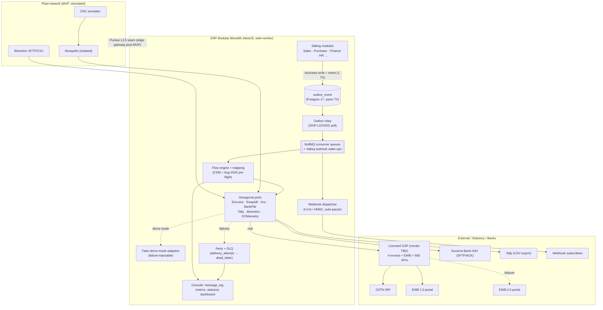

# IND-CORE Module 06 — Integrations

## Engineering Implementation Blueprint

This blueprint reformats the **Integrations (V2)** module of the **IND-CORE Manufacturing ERP** into the suite's standard 20-section engineering structure, without altering its substance, technology choices, or demo data. Integrations is the interoperability fabric of the platform — the single governed pathway through which the ERP core exchanges data and events with sibling modules, external IT/SaaS systems, Indian statutory portals, banks, and (post-MVP) shop-floor OT. It consumes shared masters and services from its sibling V2 modules — **Administration** (RBAC/ABAC roles and scopes, API-client governance, rate-limit policy, and the tenant registry that Integrations consumes rather than owns), **General** (the platform `outbox_event` and hash-chained `audit_log` tables, fiscal calendar, company/GSTIN masters), **HRM** (which consumes the biometric attendance punch feed this module transports), **Expenditure** (whose approved payment runs feed the bank-file pipeline), and **CSP** (customer/supplier-facing surfaces that subscribe to signed webhooks) — and it publishes versioned outbox events consumed across the suite. Everything here conforms to the binding platform decisions recorded in **DECISIONS-V2** (§1 stack, §2 modular-monolith boundaries, §4 AI guardrails, §5 tenancy/RLS/outbox conventions, §6 open critical-path items, §7 demo universe) and preserves the V2 lineage after the deep-research due-diligence pass (`RES-compliance.md`): Next.js 15 / React 19, NestJS on Node 22, PostgreSQL 17 with FORCE RLS and UUIDv7 PKs, Drizzle ORM v1, Keycloak 26, Valkey + BullMQ, OpenTofu IaC, and AWS `ap-south-1` residency. This module owns **no AI feature in its MVP** — an honest reflection of the platform's committed AI slate (see §13).

Two research findings dominate this module and shape every section that follows: (1) **the 1 Aug 2026 GSTN API change is risk #1 for the entire product** — Ship-to GSTIN becomes mandatory ("URP" if unregistered), a new mandatory `ExpShipDtls.Gstin` in the EWB-by-IRN API, state-code/PIN and Bill-to≠Ship-to validations, and a new voluntary EWB Closure API, all landing **two weeks after this plan's date**; and (2) **GSTN integration is GSP-mediated, always** — direct NIC/IRP credentials are a large-taxpayer privilege, so an SMB-focused ERP integrates through a licensed GSP/ASP, and **GSP vendor selection is an OPEN CRITICAL-PATH work item** (DECISIONS-V2 §6d), first on the roadmap, never an assumption.

---

## 1. Module Overview

**Module 06 — Integrations (V2)** is the interoperability fabric of the IND-CORE Manufacturing ERP: the single, governed pathway through which the ERP core (Sales, Purchase, Inventory, Production, Quality, Finance, HR/Payroll) exchanges data and events with sibling modules, external IT/SaaS systems, Indian statutory portals, banks, and (post-MVP) shop-floor OT. It ships as the `integrations` NestJS module inside the boundary-enforced modular monolith, plus an **Integration Console** UI.

This V2 is a full rewrite of PLAN-6 conforming to `DECISIONS-V2.md` (binding) after the deep-research due-diligence pass (`RES-compliance.md`). The module converts integration from bespoke per-project cost into platform capability: **reliable delivery** (outbox + at-least-once + idempotent consumers = exactly-once *effect*), **observability** (every message logged, traceable, replayable), and an **India statutory pack that is current to the Aug-2026 schema** — the strongest differentiator versus legacy mid-market ERPs.

### 1.1 What the module delivers (MVP scope, investor demo)

- Transactional `outbox_event` → Valkey-relayed internal bus (BullMQ consumers, Valkey pub/sub wake-ups).
- Connector framework as hexagonal ports with **real + fake demo-mode adapters for every external system** (the demo never depends on sandbox uptime).
- Six concrete connectors — GSP e-invoice sandbox; GSP/NIC e-Way Bill sandbox (dual-portal aware, Aug-2026 schema); Tally CSV export; "Suvarna Bank" H2H payment file; biometric SFTP/CSV pull; mock MQTT CNC feed.
- IMS data pipeline via GSP.
- Outbound webhooks with `t=…,v1=…` HMAC-SHA256 signing.
- Retry/backoff + DLQ with guard-railed replay.
- Monitoring console with correlation-ID tracing; statutory dashboard with 30-day-window aging and an Aug-2026 readiness checklist.

**Explicitly deferred (with adoption triggers, not vibes):** Kafka/Redpanda, Temporal, visual drag-and-drop mapper, OPC-UA/real MQTT edge gateway, EDI/AS2, Account Aggregator, saga orchestration, schema-registry service (see §17–§18).

### 1.2 Component topology

| Component | Realization | Responsibility |
|---|---|---|
| Gateway layer | NestJS middleware chain (auth → tenant `SET LOCAL` → throttle → Zod → idempotency → access log) | North-south entry for API clients + inbound webhooks; 202-and-enqueue |
| Event bus | Platform `outbox_event` (Postgres) → relay worker → BullMQ consumer queues + Valkey pub/sub wake-ups | Durable at-least-once distribution; versioned `module.entity.verb.v1` names; replay |
| Consumer dedup | `consumer_inbox` unique inserts (Postgres authoritative; Valkey fast-path) | At-least-once → exactly-once effect |
| Connector runtime | Hexagonal ports + DI-registered real/fake adapters + circuit breakers | Protocol adapters (GSP REST, SFTP, CSV, MQTT-mock); health checks |
| Transformation | Canonical JSON Schemas + mapping rows + sandboxed expressions + lookups (UQC, GST state codes, Tally COA) | External ↔ CDM ↔ target; Aug-2026 pre-flight validation; quarantine |
| Statutory pipeline | `EinvoicePort` / `EwaybillPort` / `ImsPort` via **GSP** | IRN + signed QR; EWB dual-portal + closure; IMS actions; lifecycle logs |
| Webhook engine | Subscription registry + `t=/v1=` HMAC signer + delivery worker + auto-pause | Outbound signed event push |
| Retry/DLQ | BullMQ backoff → `delivery_attempt` → `dead_letter`; rule-based triage | Never-silent failures; guard-railed replay |
| Scheduler | `schedule` table (source of truth) ⇄ BullMQ repeatables reconciler | Biometric pull, IMS pull, Tally export, health checks |
| Monitoring | Partitioned `message_log` + `message_metrics` rollups + alert rules | Trace, throughput, backlog, SLA, statutory funnel |
| IT/OT boundary | Compose-isolated Mosquitto + simulator, one-way in | Purdue L3.5 seam reserved; real edge gateway post-MVP |

The end-to-end architecture diagram (external/statutory/banks ↔ modular monolith ↔ simulated plant network) is rendered in full in **§11 Backend Logic**.

### 1.3 Module boundary (strict)

- **Administration** owns RBAC+ABAC roles, API-client identity governance, rate-limit policy, and the tenant registry. Integrations **consumes** these — its `api_client` scopes and per-tenant throttles resolve against Administration's published roles and policies; it never re-implements identity.
- **General** owns the platform `outbox_event` and hash-chained `audit_log` tables (defined in PLAN-1/platform). Integrations writes to them and cross-references them here but does **not** own them.
- **Finance** owns the credit-note document, ledger postings, and the QR-bearing invoice PDF template (rendered via the shared Gotenberg sidecar). Integrations registers the CN on the IRP and publishes the signed QR for Finance to print — it never keeps a ledger; **ledger-critical effects stay synchronous in the producer's own DB transaction and never ride the bus.**
- **Purchase** owns the IMS reconciliation workspace UI; Integrations owns the IMS transport and action log.
- **HRM** consumes the biometric attendance punch events; Integrations owns the pull, dedupe, and PII-minimized transport.
- **Production** consumes the CNC machine-state / cycle-rollup events; Integrations owns the (simulated in MVP) telemetry ingest.

### 1.4 What changed in V2

| # | V1 → V2 | Why (binding source) |
|---|---|---|
| 1 | Redis Streams bus → **Valkey pub/sub + BullMQ**; Kafka deferred with explicit adoption triggers | DECISIONS-V2 §1/§2: Valkey (BSD, ~20–30% cheaper ElastiCache, BullMQ CI-passing); outbox in Postgres remains the durability anchor |
| 2 | Prisma → **Drizzle ORM v1**; `withOutbox()` helper rewritten as a Drizzle transaction helper | §2: RLS ergonomics (`SET LOCAL` without interactive-tx wrapping) + SQL-first fit for SKIP LOCKED relay polling |
| 3 | Postgres 16 → **17**; UUID → **UUIDv7 PKs**; composite indexes lead with `tenant_id`; FORCE RLS everywhere | §1, §5 platform conventions |
| 4 | `event_outbox` (module table) → platform **`outbox_event`** (cross-module table); event names → **`module.entity.verb.v1`** versioned scheme | §5: outbox is a platform convention shared by all modules |
| 5 | NIC-direct sandbox assumption → **GSP-mediated GSTN integration, always**; GSP selection promoted to open critical-path item | §3 + §6d; direct-API floor is portal practice, not law ([RES-compliance §10.10](https://cleartax.in/s/e-invoicing-api-integration-modes)) |
| 6 | Generic "GSTN may change APIs" risk → **1 Aug 2026 advisory implemented now**: Ship-to GSTIN ("URP"), `ExpShipDtls.Gstin`, state-code/PIN + Bill-to≠Ship-to checks, EWB Closure API; **hard-dated sandbox-certification milestone** | §3 risk #1; [GSTN advisory](https://tutorial.gst.gov.in/downloads/news/advisory_einvoice_api_ewb_by_irn_approved.pdf) |
| 7 | Single EWB portal → **EWB 2.0 dual-portal failover** (live 1 Jul 2025), `ewaybill_log` gains portal + closure-status fields | §3; [GSTN/NIC update](https://a2ztaxcorp.net/gstn-announces-launch-of-e-way-bill-2-0-portal-from-july-1-2025-to-enhance-inter-operability-with-existing-system/) |
| 8 | Not covered → **IMS data pipeline** (accept/reject/pending via GSP, `ims_action_log`, CN one-period pending limit, sequential GSTR-2B recompute awareness) | §3; [GSTN revised IMS advisory](https://tutorial.gst.gov.in/downloads/news/revised_advisory_on_ims.pdf) |
| 9 | 30-day IRN window loosely "configurable" → **corrected: applies only at AATO ≥ ₹10 crore**; alert day 20, hard-warn day 25+; ₹5cr e-invoice threshold confirmed, **no ₹1cr notification exists** | §3 normative GST facts; [einvoice6 IRP notice](https://einvoice6.gst.gov.in/content/revised-time-limit-for-e-invoice-reporting-for-businesses-with-aato-of-%E2%82%B910-crores-above/) |
| 10 | Custom `X-IND-CORE-Signature` webhook header → platform-standard **HMAC-SHA256 `t=…,v1=…` scheme**, 5-min tolerance, rotatable secrets | §5 API conventions |
| 11 | AI DLQ triage + AI mapping suggestions in MVP → **dropped from MVP**; error triage reclassified as deterministic rules; any future AI goes through the provider-agnostic router | §4: not in the 8 MVP AI features; "everything else deferred/dropped/reclassified as rules" |
| 12 | Connector SDK → **hexagonal ports with real + fake demo-mode adapters for every external system**; demo never depends on sandbox uptime | §5 monorepo conventions |
| 13 | Terraform → **OpenTofu** (encrypted state); MinIO (dev S3/SFTP stand-in) → **LocalStack/Garage/SeaweedFS** | §1/§2: MinIO community edition in maintenance mode |
| 14 | New H1 sections **Edge Cases** and **Testing Strategy**; `Idempotency-Key` **mandatory** on IRN/EWB generation endpoints (replay-safe, 409 on hash mismatch) | §5 API conventions; due-diligence finding that statutory duplicate side effects are the costliest failure class |

### 1.5 Business problem

A mid-market Indian manufacturer like **Trishul Precision Components Pvt Ltd** (Pune-Chakan `27AABCT1234F1Z5`, Coimbatore `33AABCT1234F1Z9`) cannot operate its ERP as an island:

- **Statutory compulsion, not preference.** With AATO above the notified **₹5 crore** threshold ([Notification 10/2023-CT; xflowpay 2026 guide](https://www.xflowpay.com/blog/e-invoice-limit)), every B2B invoice must be registered on an Invoice Registration Portal to obtain an **IRN + signed QR** before it is a legally valid tax invoice; goods movement ≥ ₹50,000 requires an **e-Way Bill** ([NIC EWB API docs](https://docs.ewaybillgst.gov.in/apidocs/)). Taxpayers at AATO ≥ **₹10 crore** additionally face a **30-day reporting window** — the IRP rejects older documents outright ([einvoice6 notice](https://einvoice6.gst.gov.in/content/revised-time-limit-for-e-invoice-reporting-for-businesses-with-aato-of-%E2%82%B910-crores-above/)). A portal outage or silent failure directly blocks dispatches and revenue.
- **The rules move under your feet.** The **1 Aug 2026 GSTN API change** proves it: an ERP whose EWB-by-IRN payloads lack the Ship-to GSTIN starts failing statutory calls two weeks from this plan's date. Compliance connectivity is a living product surface, not a one-time build ([advisory PDF](https://tutorial.gst.gov.in/downloads/news/advisory_einvoice_api_ewb_by_irn_approved.pdf)).
- **ITC now flows through IMS.** Since Oct 2024 (with Oct 2025 tightening), input tax credit reaches GSTR-2B only via IMS accept/deemed-accept actions; credit notes can stay Pending only one tax period, and GSTR-2B is generated sequentially and must be recomputed after late IMS actions ([GSTN revised advisory](https://tutorial.gst.gov.in/downloads/news/revised_advisory_on_ims.pdf)). An ERP without an IMS pipeline silently costs its customers ITC.
- **Fragmented finance operations.** Re-keying into Tally, manual NetBanking uploads, hand reconciliation — every re-key is an error and an MCA audit-trail gap.
- **Shop-floor blindness.** Attendance punches live in biometric devices; machine state lives in CNC controllers. Payroll and OEE depend on data that never reaches the ERP without manual export.
- **Point-to-point rot.** Without a canonical model and a governed bus, each connection multiplies bespoke mappings (N² problem) and failures are silent — "the e-invoice didn't go through and nobody noticed until the truck was at the gate."
- **Trust and compliance.** GSTN/bank credentials are crown jewels; DPDP-readiness (phase-in May 2027, ₹250cr safeguard exposure), CERT-In 180-day India-resident logs (live now), and biometric punch data as personal data all bind this module's logging, storage, and credential design.

---

## 2. Objectives

### 2.1 Product objectives (MVP goals — investor-demo quality, ~9 weeks)

1. **Reliable event backbone.** Transactional `outbox_event` in Postgres 17 + Valkey-relayed distribution to BullMQ consumers; no domain event lost; at-least-once delivery + idempotent consumers ⇒ exactly-once *effect*; versioned event names `module.entity.verb.v1`. Ledger-critical flows never ride the bus — they stay synchronous in one DB transaction (DECISIONS-V2 §5).
2. **India statutory pack, GSP-mediated and Aug-2026-ready.** Generate IRN + signed QR and e-Way Bills against the **GSP sandbox** with the post-1-Aug-2026 payload schema; demonstrate a failed→retried→succeeded statutory submission live; support EWB 2.0 dual-portal failover and the EWB Closure API; deliver the IMS action pipeline.
3. **Hexagonal connector framework.** Every external system behind a TypeScript port with a **real adapter and a fake demo-mode adapter**; adding connector #7 touches no core code; the demo runs fully offline on fakes.
4. **Webhook pub/sub.** External subscribers receive HMAC-SHA256-signed (`t=…,v1=…`) event pushes with per-subscription retry policy, delivery logs, and auto-pause.
5. **Zero silent failures.** Exponential backoff + jitter, capped attempts, DLQ per flow, guard-railed replay, severity-routed alerts (statutory = high).
6. **Operable by humans.** An Integration Console a support engineer can use to see backlog, retry a message, rotate a credential, or pause a flow — plus a statutory dashboard Meera Iyer actually reads.
7. **Secure by default.** KMS-envelope-encrypted credentials (never plaintext in DB/logs), payload redaction at write time, scoped API clients with rate limits, ap-south-1 residency, CERT-In-aligned 180-day log retention.
8. **Demo-quality dataset.** Seeded connectors, flows, message logs, IRN/EWB/IMS/bank rows for Trishul — coherent with the shared demo universe, with payload examples on the **Aug-2026 schema**.

### 2.2 Engineering objectives

- **Durability anchored in Postgres, not the broker.** The transactional outbox requires event row + business row in one ACID transaction; broker loss ≤ replay, never data loss. The relay uses `FOR UPDATE SKIP LOCKED` so multiple instances never double-claim, and a partial index on pending rows keeps polling O(pending).
- **Exactly-once effect from at-least-once delivery.** `consumer_inbox` unique inserts are the authoritative dedup store (Postgres), with a Valkey set as fast-path cache only.
- **Boundary-enforced modular monolith.** The `integrations` module hosts the outbox relay, connector runtime, webhook dispatcher, and gateway middleware chain; cross-module imports only via public `index.ts` or outbox events, gated by dependency-cruiser in CI from sprint 1.
- **Statutory idempotency is structural, not disciplinary.** `Idempotency-Key` end-to-end, Get-before-retry baked into the adapter, and a unique document index make duplicate IRN registration unreachable.
- **New-schema-first.** e-Invoice/EWB payload builders are written against the Aug-2026 schema from the first line; sandbox certification is a hard-dated milestone that gates everything downstream.
- **Effective-dated statutory config, never constants in code.** e-Invoice applicability (₹5cr), the 30-day window flag (₹10cr), EWB threshold, and cancel windows are per-tenant effective-dated rows.

### 2.3 Non-goals for MVP

Kafka/Redpanda backbone, Temporal saga orchestration, a visual drag-and-drop flow/mapping designer, a real OPC-UA/MQTT edge gateway (OT is simulated), EDI/AS2 partner onboarding, Account Aggregator statement pull, a schema-registry service, GSP **production** go-live (sandbox only), Tally two-way sync (one-way CSV export only), and any AI feature. These are carried into **§17 MVP Scope** (Anti-goals) and **§18 Future Roadmap** with documented adoption triggers.

### 2.4 Demo success criteria

An investor watches a Trishul invoice finalize, sees it land in the Message Monitor; watches the GSP circuit open and the Statutory Dashboard show the submission queued with its 30-day window countdown; sees the circuit close (via a fake-adapter control), the IRN + signed QR appear, and the webhook fire to Ashvamedha Motors; traces one correlation ID end-to-end; sees invoice INV-2627-00004's day-20 amber window alert; closes an e-Way Bill live via the new Closure API; and fixes a malformed-biometric DLQ item to drain the DLQ to zero — all offline on fakes if the sandbox is down.

---

## 3. User Personas

All personas act within the demo universe (**Trishul Precision Components**; **Kaveri ElectroFab** as the second RLS-probe tenant and the effective-dated e-invoice-applicability-flip case). Permissions follow the platform RBAC + ABAC engine published by **Administration**: a role grants actions; JSONB scope conditions constrain them, and separation of duties keeps `statutory:submit` distinct from `credential:manage`. The Console at `/integrations` renders each persona only the surfaces their scopes permit.

### 3.1 Integration engineer / developer — "Integration Admin" login (implementation team)
- **Goals:** configure connectors and flows, author field mappings, register webhook subscriptions, promote configs across environments.
- **Pain points:** bespoke per-connection mappings multiply (N² problem); sandbox flakiness blocks progress; no single place to see whether a flow actually works.
- **Primary screens:** Connector Catalog + Connection Wizard, Flow & Mapping Editor (with dry-run + Aug-2026 pre-flight preview), Webhook Manager, API Clients & Schedules.

### 3.2 IT / platform administrator — Vikram Joshi (IT Admin)
- **Goals:** manage connections/credentials, environments, API clients, and rate limits; watch platform health.
- **Pain points:** credentials scattered and sometimes logged in plaintext; no rotation discipline; no view of circuit state or backlog.
- **Primary screens:** Overview dashboard (health map + circuit state), Connection Wizard (credential create/rotate, write-only), API Clients (scopes, quotas, rotate/revoke).

### 3.3 Finance / compliance officer — Meera Iyer (Finance Controller)
- **Goals:** own the e-invoice / EWB / IMS / bank flows; monitor the Statutory Dashboard; act on rejections **within the 30-day window** (Trishul is ≥ ₹10cr AATO); review Aug-2026 readiness.
- **Pain points:** a silent statutory failure blocks dispatch and revenue; the 30-day window is easy to miss; ITC leaks without an IMS pipeline; being blamed for breaches the ERP never surfaced.
- **Primary screens:** Statutory Dashboard (e-invoice funnel, window aging strip, EWB tab with closure, IMS tab), Aug-2026 Readiness Checklist, Bank Files.

### 3.4 Support / operations (NOC) — shared "Ops" role
- **Goals:** watch the message monitor, triage the DLQ, retry/replay under guardrails, respond to alerts.
- **Pain points:** silent failures discovered too late; risky bulk replays; no end-to-end trace.
- **Primary screens:** Message Monitor + trace drawer, DLQ Console with replay guardrails, Overview "Attention" list.

### 3.5 HR manager — Priya Deshmukh
- **Goals:** verify the biometric punch feed is healthy (the HRM module consumes the events).
- **Pain points:** attendance data stranded in devices; payroll depends on data that never arrives.
- **Primary screens:** Overview health map (biometric connector), Message Monitor filtered to punch pulls.

### 3.6 Plant head — Rajesh Kulkarni
- **Goals:** glance at connector health + the CNC mock feed on the overview.
- **Pain points:** shop-floor blindness — no line of sight from machine state to the ERP.
- **Primary screens:** Overview dashboard (connector health map, CNC heartbeat tile).

### 3.7 OT / controls engineer (post-MVP) — Imran Shaikh (Maintenance)
- **Goals:** view the mock CNC heartbeat in MVP; configure the real edge gateway post-MVP.
- **Pain points:** machine data trapped behind the Purdue boundary; no safe IT/OT seam.
- **Primary screens:** Overview CNC tile (MVP, "Simulated" ribbon); edge-gateway config (post-MVP).

### 3.8 External API consumer — Ashvamedha Motors EDI team; Trishul Customer-Portal service
- **Goals:** call scoped `/api/v1` endpoints; receive signed webhooks.
- **Pain points:** unauthenticated or unsigned pushes; no delivery visibility; secret rotation breaks integrations.
- **Primary screens:** none in-console (machine consumers); interact via API-client credentials and the `t=/v1=` signed webhook contract.

---

## 4. Functional Requirements

The functional surface is grouped into twelve lettered sub-areas. **4.A–4.C** are the platform plumbing (bus, connectors, mapping); **4.D–4.F** are the India statutory pack (e-invoice, e-way bill, IMS) that is the demo centerpiece; **4.G–4.I** are the operational connectors (bank, biometric, OT); **4.J–4.L** are the external surface and operability (webhooks, retry/DLQ/monitoring, gateway governance). Every requirement is preserved from the V2 spec. A trailing table pins the **statutory rules encoded as effective-dated config** — never constants in code.

### 4.A Event bus & transactional outbox (FR-1)

- **FR-1.1** Sibling modules write domain events to the platform `outbox_event` table **in the same Drizzle transaction** as the business write, via the exported `withOutbox(tx, event)` helper. Ledger postings and other ledger-critical effects are performed synchronously inside that same transaction — never deferred to the bus.
- **FR-1.2** A relay worker polls `outbox_event` (`status='pending' AND available_at<=now()`, `FOR UPDATE SKIP LOCKED`, batch 100), fans each event out to the BullMQ queue of every registered consumer (routing table), publishes a lightweight wake-up on Valkey pub/sub channel `bus.wake.<module>` (latency, not durability), then marks the row `published`. Crash between fan-out and mark ⇒ duplicate enqueue on next sweep — expected and safe.
- **FR-1.3** Every event carries `event_id` (UUIDv7), `event_name` (**`module.entity.verb.v1`**, e.g. `sales.invoice.finalized.v1`), `tenant_id`, `aggregate_type/id`, `idempotency_key`, `correlation_id`, `occurred_at`, `payload` (Zod/JSON-Schema-validated from `packages/contracts`). Consumers dedupe by unique insert into `consumer_inbox (consumer, event_id)` before side effects — Postgres is the authoritative dedup store; a Valkey set is a fast-path cache only.
- **FR-1.4** Per-aggregate ordering: consumer queues use BullMQ groups keyed by `aggregate_id` (or a single-concurrency queue where strict order matters, e.g. statutory submits per GSTIN).
- **FR-1.5** Replay: admin-only, audited re-enqueue of outbox rows by time window / aggregate / correlation ID with a `replayed_from` marker; consumers treat replays through the same dedup gate.
- **FR-1.6** Breaking payload changes ship as a new event version (`…verb.v2`) with dual-publish during migration; consumers subscribe by explicit version. No in-place schema mutation, ever.

### 4.B Connector framework — hexagonal ports (FR-2)

- **FR-2.1** Each external system class is a **port** (TypeScript interface): `EinvoicePort`, `EwaybillPort`, `ImsPort`, `BankFilePort`, `TallyExportPort`, `BiometricFeedPort`, `OtTelemetryPort`, `WebhookSinkPort`, plus generic `RestPort`/`SftpPort`. Every port has ≥2 adapters: **real** (GSP sandbox / bank SFTP / device share) and **fake demo-mode** (deterministic, latency-simulating, failure-injectable). Adapter choice is per-connection config; the console shows a "Simulated" ribbon on fakes.
- **FR-2.2** Connections are environment-scoped (dev/UAT/prod) instances of a connector; credentials held by reference (`credential_id` → KMS-envelope-encrypted blob) — never inline, never logged.
- **FR-2.3** "Test connection" from UI; scheduled health checks update `health_status`; missed heartbeats alert; per-connection circuit breaker (open after 5 consecutive failures, half-open probe after cool-down).
- **FR-2.4** Shipped MVP connectors: `gsp_einvoice_sandbox`, `gsp_ewb_sandbox` (dual-portal), `tally_csv_export`, `suvarna_bank_h2h`, `biometric_sftp_csv`, `mqtt_cnc_mock`, `generic_rest`, `generic_webhook_out` — each with real + fake adapters.

### 4.C Flows, mapping, transformation (FR-3)

- **FR-3.1** `integration_flow` = trigger (event / webhook / schedule / manual) → source → mapping → target, with retry policy and SLA target; versioned with activate/rollback.
- **FR-3.2** Field mappings: source path ↔ canonical path ↔ target path with sandboxed transform expressions (JSONata subset), defaults, required flags, lookup tables (UoM → UQC, state names → **GST state codes** — now validation-critical under the Aug-2026 state-code/PIN checks, Tally ledger map).
- **FR-3.3** Canonical Data Model v1 (JSON Schema, versioned in `packages/contracts`): `Party`, `Item`, `SalesOrder`, `Invoice` (GSTIN, HSN, CGST/SGST/IGST splits, **Ship-to block with GSTIN**), `Payment`, `Shipment` (Bill-to/Ship-to distinction, PIN, state code), `WorkOrder`, `ProductionEvent`, `AttendancePunch`, `InventoryMovement`, `LedgerEntry`, `BankStatementLine`, `ImsRecord`.
- **FR-3.4** Validation against canonical schema before dispatch; invalid records quarantined to DLQ with `error_category='validation'`. Aug-2026 pre-flight validations (Ship-to GSTIN present or "URP"; state code consistent with GSTIN prefix and PIN) run **client-side before the GSP call** so failures are caught in our DLQ, not as IRP rejections.
- **FR-3.5** MVP mapping editor = structured form (mapping-row table + expression field + sample-payload dry-run preview). Visual drag-and-drop designer post-MVP.

### 4.D Statutory: e-Invoice via GSP (FR-4)

- **FR-4.1** All GSTN traffic goes **through the selected GSP's API** (auth per GSP contract; sandbox first). `access_mode` config exists solely to distinguish GSP sandbox vs GSP production — there is **no direct-NIC mode** ([ClearTax integration modes](https://cleartax.in/s/e-invoicing-api-integration-modes); [GSTN IRP API integration guide](https://tutorial.gst.gov.in/downloads/news/e-invoice_api_integration_guide_irps.pdf)).
- **FR-4.2** On `sales.invoice.finalized.v1` for a B2B/export invoice where the tenant's effective-dated applicability flag is on (AATO ≥ **₹5 crore**; no ₹1cr notification exists — config, not code), build the INV-01 JSON from the canonical Invoice — **including the Aug-2026 fields** — validate, and submit via `EinvoicePort.generateIrn()`.
- **FR-4.3** Persist full lifecycle in `einvoice_irn_log`: redacted request payload, IRN (64-char), ack no/date, signed invoice JWT + signed QR stored verbatim (S3, 8-year retention class); status machine `pending → generated | failed | cancelled`.
- **FR-4.4** **Idempotency & ambiguity:** IRN is idempotent by (supplier GSTIN, doc type, doc no, FY). On ambiguous timeout/response-lost, call Get-IRN-by-document-details **before** any retry; if the IRP says already registered, adopt that IRN as success. Unique DB index enforces one attempt-chain per document.
- **FR-4.5** Cancellation within the **24-hour** window; after that, the UI surfaces the credit-note path (Finance module owns the CN document; this module registers the CN on the IRP too).
- **FR-4.6** **30-day reporting window — only for tenants with AATO ≥ ₹10 crore** (per-tenant effective-dated flag): compute `window_deadline_at = doc_date + 30d`; aging widget; **alert at day 20, hard-warn at day 25+** with escalating notifications to the Finance Controller; day-28+ items flagged critical. Tenants below ₹10cr see no window countdown (no false urgency).
- **FR-4.7** Publish `integrations.einvoice.generated.v1` (and `.failed.v1`) so Finance prints the signed QR on the invoice PDF (Gotenberg pipeline, sibling plan).

### 4.E Statutory: e-Way Bill — EWB 2.0 + Aug-2026 (FR-5)

- **FR-5.1** Trigger from `logistics.shipment.dispatch_ready.v1` where consignment value ≥ ₹50,000 (state-configurable). Preferred path: **EWB by IRN**; direct EWB JSON supported.
- **FR-5.2** **Aug-2026 schema enforced:** `ShipDtls.Gstin` mandatory whenever shipping details are given ("URP" for unregistered); `ExpShipDtls.Gstin` mandatory in the EWB-by-IRN API for exports; state-code/PIN cross-validation; Bill-to≠Ship-to combinations validated before submit ([advisory](https://tutorial.gst.gov.in/downloads/news/advisory_einvoice_api_ewb_by_irn_approved.pdf)).
- **FR-5.3** **Dual-portal failover:** connection config carries both EWB 1.0 and EWB 2.0 endpoints (`ewaybillgst.gov.in` / `ewaybill2.gst.gov.in`, cross-synchronised, same credentials); the adapter fails over automatically on 5xx/timeout and records which portal served each call ([EWB 2.0 launch](https://www.centaxonline.com/blog/e-way-bill-2.0-portal-launches-gstn-update)).
- **FR-5.4** Part-A/Part-B capture, Part-B vehicle update, cancellation in window, distance-based validity with expiry alerts for in-transit consignments.
- **FR-5.5** **EWB Closure API (voluntary, new):** on `logistics.shipment.delivered.v1` (or manual action), call closure with EWB no + closure date + remarks; `ewaybill_log.closure_status` tracks `not_closed | closed | closure_failed`.

### 4.F Statutory: IMS pipeline (FR-6)

- **FR-6.1** Scheduled GSP pull of IMS records (supplier invoices/CNs/amendments visible to the recipient GSTIN) into canonical `ImsRecord`; publish `integrations.ims.record_received.v1` for the Purchase module's reconciliation workspace (workspace UI lives in the Purchase plan; this module owns transport + action log).
- **FR-6.2** Push accept / reject / pending actions back via GSP; every action recorded in `ims_action_log` with the acting user, prior state, and GSTR-2B period.
- **FR-6.3** Encode the Oct-2025 rules as guards: credit notes may stay Pending **one tax period only** (countdown surfaced); acceptance of specified records requires the ITC-reversal declaration flag (full/partial/none) captured with the action; late actions after the 14th flag "GSTR-2B recompute required" — 2B is generated **sequentially** after the prior period's GSTR-3B ([revised IMS advisory](https://tutorial.gst.gov.in/downloads/news/revised_advisory_on_ims.pdf)).

### 4.G Bank payment files (FR-7)

- **FR-7.1** On `finance.payment_run.approved.v1`, generate the fictional **Suvarna Bank** H2H file (HDFC-style CSV: debit account, beneficiary, IFSC, amount, narration, NEFT/RTGS/IMPS) into `bank_file_batch`; file in S3 (SSE-KMS) with SHA-256 checksum; batch idempotent by `payment_run_ref`.
- **FR-7.2** MVP delivery = download + simulated SFTP drop (fake adapter; LocalStack in dev); reverse ACK import updates batch/line status (`generated → uploaded → acknowledged → processed | partially_failed`), UTRs on lines.
- **FR-7.3** Statement import (CSV/MT940-lite) → canonical `BankStatementLine` events for Finance reconciliation (recon logic lives in Finance; this module delivers clean data).

### 4.H Biometric attendance feed (FR-8)

- **FR-8.1** Scheduled SFTP/CSV pull (15 min) of punches `(device_id, employee_code, timestamp, direction)`; dedupe by that triple; publish `integrations.attendance.punch_recorded.v1` for HRM.
- **FR-8.2** PII minimized (employee code only — never name or biometric template), encrypted at rest, log-retention limits per DPDP-readiness posture.

### 4.I OT mock — demo (FR-9)

- **FR-9.1** Containerized MQTT simulator (Mosquitto, compose-isolated) publishes CNC heartbeats for `CNC-PNQ-01..03` (RUN/IDLE/FAULT, cycle count, spindle load); the `mqtt_cnc_mock` connector emits canonical `ProductionEvent` 1-min rollups.
- **FR-9.2** UI labels the feed "Simulated — edge gateway post-MVP"; architecture reserves the Purdue L3.5 DMZ seam so a real OPC-UA/MQTT gateway slots in without redesign ([Purdue model reference](https://softwaretoolbox.com/resources/what-is-purdue-model)).

### 4.J Webhooks — outbound + inbound (FR-10)

- **FR-10.1** Outbound: subscriptions on event names (versioned); delivery = HTTPS POST with header `X-IND-CORE-Signature: t=<unix_ts>,v1=<hex(hmac_sha256(secret, t + "." + body))>`; **5-minute tolerance**; per-subscription rotatable secret (old + new valid during grace window); retry default 6 attempts exp backoff 1m→32m; delivery log; test-fire; auto-pause after N consecutive dead deliveries; 7-day retention/replay policy for undeliverable events (see Edge Cases, §15).
- **FR-10.2** Inbound: `/api/v1/integrations/hooks/{connectorCode}` verifies source signature + timestamp window, enqueues raw payload to BullMQ, responds 202 fast.

### 4.K Retry, DLQ, monitoring (FR-11)

- **FR-11.1** Retry policy per flow: attempts (default 5), exp backoff + jitter; classification: timeout/5xx/429 retryable; validation/4xx/signature fatal.
- **FR-11.2** Exhausted messages → `dead_letter` with full redacted context; **deterministic rule-based triage** (error-code → category → suggested action mapping table — not AI); DLQ actions: inspect, edit-payload-and-resubmit (audited, guard-railed), bulk retry, ignore-with-reason.
- **FR-11.3** Circuit breaker per connection; graceful degradation: statutory messages queue and auto-retry within the reporting window with the countdown visible; Finance notified at severity high.
- **FR-11.4** Every hop in `message_log` (partitioned monthly) with correlation ID, direction, status, latency; end-to-end trace view; 1-min `message_metrics` rollups; alert rules (DLQ growth, SLA breach, heartbeat missed, window aging).

### 4.L API gateway function & governance (FR-12)

- **FR-12.1** NestJS middleware chain: API-client auth (hashed API key / OAuth2 client-credentials) → tenant resolver (`SET LOCAL app.tenant_id`) → Valkey-backed throttler (429 + `Retry-After`) → Zod validation → idempotency interceptor → access log. **No authorization in Next.js middleware** (CVE-2025-29927 lesson); authz lives in NestJS guards + RLS only.
- **FR-12.2** `api_client` management: scopes, rate limits, daily quotas, rotate/revoke, usage stats; separation of duties: `statutory:submit` ≠ `credential:manage`.
- **FR-12.3** Every config change (flow, mapping, credential, subscription) writes to the platform hash-chained `audit_log` (MCA-aligned, 8-year retention, no off-switch).

### 4.M Statutory rules encoded (effective-dated config — never constants in code)

| Rule | Value (MVP default) | Where enforced |
|---|---|---|
| e-Invoice applicability | AATO ≥ **₹5 crore** (per-tenant effective-dated flag; no ₹1cr notification exists) | Trigger predicate on `sales.invoice.finalized.v1` |
| 30-day IRN window | AATO ≥ **₹10 crore only**; alert day 20, hard-warn day 25+ | `einvoice_irn_log.window_deadline_at` + alert engine |
| IRN cancel window | 24 h; then credit-note path | Cancel endpoint guard + UI hint |
| IRN idempotency | One IRN per (supplier GSTIN, doc type, doc no, FY) | Get-before-retry + unique index + `Idempotency-Key` |
| EWB threshold | ≥ ₹50,000 (state-configurable) | Trigger predicate on dispatch event |
| EWB validity | Distance-based slabs | `valid_upto` + expiry alerts |
| Aug-2026 payload rules | Ship-to GSTIN mandatory ("URP"), `ExpShipDtls.Gstin`, state/PIN, Bill-to≠Ship-to | Pre-flight validator, versioned payload builder |
| IMS CN pending limit | One tax period | `ims_action_log` guard + countdown |
| GSTN access | **GSP-mediated, always** (vendor = open item) | Port/adapter design; no direct-NIC adapter exists |
| Data residency / logs | ap-south-1; CERT-In 180-day ICT logs in-region | Infra + S3 lifecycle |

---

## 5. Non-functional Requirements

NFRs are synthesized from the module's engineering goals and its published SLO table (demo-scale, MVP targets). Each is testable; the measurement source is named.

### 5.A Reliability & delivery guarantees

- **NFR-01 Zero event loss.** The transactional outbox is the durability invariant: an event row exists **iff** the business transaction committed. Broker (Valkey/BullMQ) loss degrades to replay, never data loss. *Measured via:* CI invariant test + reconciliation count check.
- **NFR-02 Exactly-once effect.** At-least-once delivery + `consumer_inbox` unique-insert dedup ⇒ side effects apply exactly once even under duplicate enqueue (relay crash between fan-out and mark-published). *Measured via:* property tests asserting effect counters = 1.
- **NFR-03 Statutory idempotency.** No duplicate IRN/EWB registration is reachable: `Idempotency-Key` (mandatory on generation/cancel/closure), Get-before-retry, and a unique document index. Same key + different request hash ⇒ 409. Keys retained 7 days.
- **NFR-04 Per-aggregate ordering.** Where strict order matters (statutory submits per GSTIN), a single-concurrency queue or BullMQ group keyed by `aggregate_id` preserves order.

### 5.B Performance & throughput (SLOs)

| SLO (NFR) | Target | Measured via |
|---|---|---|
| **NFR-05** Outbox publish lag (commit → consumer queue) | p95 < 2 s | relay metrics |
| **NFR-06** IRN generation end-to-end (GSP sandbox) | p95 < 5 s | `message_log.latency_ms` |
| **NFR-07** Webhook first-attempt delivery | p95 < 3 s from event publish | `webhook_delivery` |
| **NFR-08** Biometric punch freshness | < 20 min (15-min pull + processing) | `sync_job` watermarks |
| **NFR-09** Bus throughput headroom | 100 msg/s sustained, zero loss | Week-9 load sanity test |
| **NFR-10** Window-alert delivery (day 20/25) | < 5 min from threshold crossing | alert engine audit |
| **NFR-11** Console monitor staleness | ≤ 15 s | UI polling interval |

### 5.C Availability & resilience

- **NFR-12 Graceful degradation.** Per-connection circuit breaker (open after 5 consecutive failures, half-open probe after cool-down); statutory messages queue and auto-retry within the reporting window with the countdown visible.
- **NFR-13 Chaos-survivable.** Valkey restart mid-relay, relay `kill -9` mid-batch, and Postgres failover during a poll all recover with zero event loss and no double-publish beyond the dedup gate (CI chaos tests).
- **NFR-14 Dual-portal continuity.** EWB adapter fails over 1.0 ⇄ 2.0 automatically on 5xx/timeout; if both portals are down, the consignment is queued with a dispatch-blocking banner and high-severity alert (trucks must not move without a valid EWB).

### 5.D Security, residency & retention

- **NFR-15 Credential secrecy.** KMS-envelope-encrypted credentials; plaintext never persisted or logged; rotation with grace window; SoD between `credential:manage` and `statutory:submit`.
- **NFR-16 Data residency.** All compute/storage in AWS `ap-south-1` (ap-south-2 DR); CERT-In-aligned 180-day ICT logs stored in-region; chrony traceable to `samay1/samay2.nic.in`.
- **NFR-17 Retention.** `message_log` retention 24 months for statutory-linked / 6 months for telemetry; signed IRN JWTs/QR on an 8-year S3 class; hash-chained `audit_log` at 8-year retention with no off-switch; webhook undeliverables replayable for 7 days.
- **NFR-18 PII minimization.** Biometric feed carries employee code only (never name or biometric template); write-time payload redaction; bank accounts masked to last-4 in logs.

### 5.E Accessibility & UX quality

- **NFR-19 WCAG AA.** Status is never color-only (icons + text); IST timestamps throughout; desktop-first, responsive to tablet, tables collapse to cards below 768px.
- **NFR-20 Observability.** Every hop carries the `correlation_id` minted at the outbox row (bus → adapter → GSP response → webhook fan-out); a single trace view shows the whole chain; OTel + Grafana Cloud + Sentry.

---

## 6. UI/UX Flow

The **Integration Console** lives at `/integrations` in the ERP shell. Desktop-first, responsive to tablet; tables collapse to cards below 768px; TanStack server pagination, saved views, CSV export; WCAG AA (never color-only status — icons + text); IST timestamps. A global **environment badge** (Sandbox/Prod) and **adapter-mode ribbon** ("Simulated" on fakes) are always visible so no one ever mistakes a demo fake for a live statutory call. Destructive/statutory actions (cancel IRN, close EWB, revoke client, bulk retry) require typed confirmation; every mutating action links its correlation ID into the trace view; empty states teach ("No connections yet — start with the GSP e-invoice sandbox connector").

### 6.1 Primary loop A — Statutory submission and recovery (the demo hero)
An invoice finalizes upstream → the event lands on the bus → the Statutory Dashboard shows it moving through the e-invoice funnel. On success, the IRN + signed QR appear and a webhook fires. On a GSP circuit-open or ambiguous timeout, the operator watches the item queue with its **30-day window countdown** visible, sees the adapter do Get-before-retry, and — once the circuit closes — sees the IRN resolve without any duplicate registration. A day-20 amber window alert on an aged draft demonstrates the escalation path.

### 6.2 Primary loop B — Connector onboarding
From the Connector Catalog, an integration engineer runs the 4-step Connection Wizard (connector → environment/endpoints incl. EWB secondary URL → credential create/select, write-only → dynamic `config_schema` form), ending in a live **Test Connection** with adapter-mode toggle (real/fake) and a loud "Simulated" state.

### 6.3 Primary loop C — Flow authoring & dry-run
The engineer builds field mappings in a structured row table and runs a **sample-payload dry-run** that shows the transformed output **and the Aug-2026 pre-flight results inline**, catching Ship-to GSTIN / state-code-PIN violations before any GSP call.

### 6.4 Primary loop D — Operability (monitor → trace → DLQ drain)
Ops filters the Message Monitor, opens a trace drawer to follow one correlation ID across outbox → queue → adapter attempts → statutory/webhook outcome, and triages the DLQ under guardrails (mandatory dry-run diff on edited payloads, typed confirmation for bulk >50, `statutory:submit` scope for statutory items) until the DLQ reads "No dead letters — as it should be."

---

## 7. Screen-by-Screen Design

Ten primary surfaces. Each notes layout, key components, actions, and empty/error states. The responsiveness matrix follows in §7.11.

### 7.1 Overview dashboard (`/integrations`)
- **Layout:** 4-col KPI grid over charts; per-connector health map; "Attention" list.
- **Key components:** KPI tiles (24-h messages, success %, p95, DLQ size, active flows); connector health map with circuit state; throughput/error charts (Recharts over `message_metrics`); "Attention" list (open circuits, auto-paused webhooks, **window alerts**, Aug-2026 readiness gaps). 15-s refresh.
- **Actions:** drill into any KPI/connector; jump to Attention items.
- **Empty/error:** "No connections yet — start with the GSP e-invoice sandbox connector."

### 7.2 Statutory Dashboard (`/integrations/statutory`) — the demo hero
- **Layout:** e-invoice funnel tiles → IRN table → tabbed EWB / IMS panels.
- **Key components:**
  - e-Invoice funnel tiles (Generated / Pending / Failed / Cancelled this month).
  - **30-day IRN window aging strip — rendered only for tenants flagged AATO ≥ ₹10 crore**: green ≤ day 19, **amber alert from day 20**, **red hard-warn from day 25+** (persistent banner + SMS/email to Finance Controller), critical pulse at day 28; each chip links to the invoice and its trace. Sub-₹10cr tenants see a neutral "reported/not reported" list — no countdown theater.
  - IRN table (invoice, buyer, value, IRN short-hash, ack no, status, attempts, window days left) with actions Generate / Retry / Re-query status / Cancel (24-h guard) / View signed QR (rendered from stored payload).
  - **e-Way Bill tab:** EWB no, validity countdown, vehicle, portal-used badge (1.0/2.0), Part-B update, **Close EWB** action with closure-remarks modal, expiring-soon filter, **dual-portal health strip** with automatic-failover indicator.
  - **IMS tab:** pulled records by period, action states, **CN pending-period countdown**, ITC-reversal declaration capture, "2B recompute required" banner when late actions detected.
- **Actions:** generate/retry/re-query/cancel IRN; Part-B update, cancel, close EWB; accept/reject/pending IMS with ITC-reversal declaration.
- **Empty/error:** funnel tiles at zero; window strip hidden for sub-₹10cr tenants.

### 7.3 Aug-2026 Readiness Checklist (`/integrations/statutory/readiness`)
- **Layout:** one screen, checkbox-style with evidence links.
- **Key components:** Ship-to GSTIN in payload builder ✓/✗, `ExpShipDtls.Gstin` ✓/✗, state-code/PIN validator ✓/✗, Bill-to≠Ship-to rules ✓/✗, EWB Closure API wired ✓/✗, **GSP sandbox certification per API with last contract-test timestamp**, GSP advisory feed.
- **Actions:** export as PDF for customer compliance packs (Gotenberg).
- **Empty/error:** items pending certification show an honest ✗ with the blocking reason.

### 7.4 Connector Catalog + Connection Wizard
- **Layout:** cards by category; 4-step modal/full-page stepper.
- **Key components:** connector cards; wizard steps (connector → environment/endpoints incl. EWB secondary URL → credential create/select, write-only → dynamic `config_schema` form) ending in live Test Connection; adapter-mode toggle (real/fake) with loud "Simulated" state.
- **Actions:** create/enable/disable connection; test now; switch adapter mode.
- **Empty/error:** Test Connection returns `{ok, latency_ms, portal_used?, detail}`; failure shows the precise adapter error.

### 7.5 Flow & Mapping Editor
- **Layout:** split table / preview pane.
- **Key components:** mapping-row table (source | transform | canonical | target | required | default | lookup) with sample-payload dry-run preview showing **Aug-2026 pre-flight results inline**; Retry/SLA tab; Runs tab; Audit tab; version selector with activate/rollback.
- **Actions:** bulk-replace mappings; dry-run; activate/rollback version; pause with reason.
- **Empty/error:** dry-run pre-flight violations rendered against the offending field.

### 7.6 Message Monitor
- **Layout:** filter bar over a table; trace drawer at 40% (full-screen sheet on tablet).
- **Key components:** filters (flow, status, entity ref, correlation ID, date); trace drawer — vertical timeline outbox → queue → transform → each adapter attempt (code, latency, portal used) → statutory/webhook outcome; redacted payload viewer; copy correlation ID.
- **Actions:** retry a message; copy correlation ID; open trace.
- **Empty/error:** filtered-empty state; redaction applied on all payload views.

### 7.7 DLQ Console with replay guardrails
- **Layout:** split list/detail; grouped by `error_category`.
- **Key components:** counts + rule-based suggested action per group; item view with attempt history and redacted payload editor with **mandatory dry-run diff before resubmit of an edited payload**; bulk retry >50 items requires typed confirmation ("RETRY 73"); statutory items require `statutory:submit` scope and show the window countdown so an operator never replays an already-expired document blindly (expired → routed to credit-note guidance instead); ignore requires a reason; every action toasts the resulting correlation ID.
- **Actions:** inspect, edit-and-resubmit (guard-railed), bulk retry, ignore-with-reason.
- **Empty/error:** "No dead letters — as it should be."

### 7.8 Webhook Manager
- **Layout:** subscription list over delivery log.
- **Key components:** subscriptions (status incl. auto-paused, consecutive failures); delivery log with response codes/timing; signature-scheme doc snippet (`t=/v1=` example); test-fire; rotate-secret one-time reveal; **7-day retention notice** for dead endpoints.
- **Actions:** subscribe, test-fire, rotate secret, redeliver.
- **Empty/error:** auto-paused subscriptions visually loud; dead-endpoint gap report offered past 7 days.

### 7.9 Bank Files
- **Layout:** batch list → line drill-in.
- **Key components:** batches (status chips generated → uploaded → acknowledged → processed); download; ACK upload; line drill-in with UTRs; ₹ lakh formatting.
- **Actions:** download batch, upload ACK, inspect lines.
- **Empty/error:** partial-failure surfaced per line.

### 7.10 API Clients & Schedules
- **Layout:** client list + schedule list.
- **Key components:** scopes chips, rate/quota, usage sparkline, one-time secret modal; cron list in IST with next/last run, run-now, blackout windows.
- **Actions:** create/rotate/revoke client; run-now, edit blackout windows.
- **Empty/error:** one-time secret reveal; revoke requires typed confirmation.

### 7.11 Responsiveness matrix

| Screen | Desktop (≥1280) | Tablet (768–1279) | Mobile (<768) |
|---|---|---|---|
| Overview dashboard | 4-col KPI grid + charts side-by-side | 2-col KPIs, stacked charts | KPI cards stacked; health map scrolls horizontally |
| Statutory dashboard | Funnel + table + aging strip | Same, table condensed | Tiles + aging strip; table as cards |
| Aug-2026 readiness | Two-column checklist + evidence pane | Single column | Read-only checklist |
| Message Monitor | Table + trace drawer (40%) | Trace as full-screen sheet | Card list; trace sheet |
| DLQ console | Split list/detail | Stacked push navigation | Read + retry only; payload editing desktop-only |
| Flow/mapping editor | Split table / preview pane | Tabs: mapping ⇄ preview | View-only below 768px |
| Connection wizard | Modal stepper | Full-page stepper | Full-page, single-column |

---

## 8. Navigation

### 8.1 Sidebar / nav tree
The Console mounts under the ERP shell's left nav as **Integrations**, permission-gated per persona scope:

```
Integrations  (/integrations)
├── Overview                         (/integrations)                         [any integrations:read]
├── Statutory                        (/integrations/statutory)               [statutory:read]
│   ├── e-Invoice                    (/integrations/statutory#einvoice)
│   ├── e-Way Bill                   (/integrations/statutory#ewaybill)
│   ├── IMS                          (/integrations/statutory#ims)
│   └── Aug-2026 Readiness           (/integrations/statutory/readiness)
├── Connectors                       (/integrations/connectors)              [connector:read]
│   └── Connection Wizard            (/integrations/connectors/new)          [connector:manage]
├── Flows & Mappings                 (/integrations/flows)                   [flow:read / flow:manage]
├── Message Monitor                  (/integrations/messages)                [message:read]
├── Dead Letter Queue                (/integrations/dlq)                     [dlq:triage]
├── Webhooks                         (/integrations/webhooks)                [webhook:manage]
├── Bank Files                       (/integrations/bank-files)              [bank:read]
└── Admin                            (/integrations/admin)
    ├── API Clients                  (/integrations/admin/api-clients)       [apiclient:manage]
    └── Schedules                    (/integrations/admin/schedules)         [schedule:manage]
```

### 8.2 Breadcrumbs
`Integrations / Statutory / e-Invoice / INV-2627-00002` — every deep object (an IRN row, an EWB, a DLQ item, a message trace) is addressable and breadcrumbed back to its section.

### 8.3 Deep links
- Message trace: `/integrations/messages/:correlationId/trace` — the target of every "view trace" action and every alert toast.
- IRN detail: `/integrations/statutory#einvoice` filtered to `invoiceRef`.
- DLQ item: `/integrations/dlq/:id`.
- Every mutating action toasts the resulting correlation ID as a deep link into the trace view.

### 8.4 Permission-gated visibility
Nav entries render only when the user's Administration-published scopes permit: Finance Controller sees Statutory + Readiness + Bank Files; Ops sees Message Monitor + DLQ + Overview; the integration engineer sees Connectors + Flows + Webhooks + Admin; HR/Plant personas see only the Overview health surfaces relevant to their feed. Separation of duties is enforced in-nav and at the guard: `statutory:submit` is never bundled with `credential:manage`.

---

## 9. Database Schema (PostgreSQL 17)

**Conventions (DECISIONS-V2 §5):** **UUIDv7 PKs**; every tenant-scoped table carries `tenant_id` (FORCE RLS, policy per platform pattern), `created_at/by`, `updated_at/by`, `is_active`; composite indexes lead with `tenant_id`; no hard DELETE on statutory/financial logs; statutory numbers effective-dated. `outbox_event` and `audit_log` are **platform tables** (defined in PLAN-1/platform by General/Administration; cross-referenced here, not owned).

### 9.1 Table catalog

| # | Table | Purpose | Key columns (beyond standard) | Phase |
|---|---|---|---|---|
| 1 | `outbox_event` *(platform, x-ref)* | Transactional outbox | `aggregate_type/id`, `event_name` (`module.entity.verb.v1`), `schema_version`, `payload` JSONB, `idempotency_key` (uq per tenant), `correlation_id`, `status(pending/published/failed)`, `available_at`, `published_at`, `attempts`; partial index on pending | MVP |
| 2 | `consumer_inbox` | Exactly-once-effect dedup | `consumer`, `event_id`, `processed_at`; `UNIQUE(consumer, event_id)`; 30-day prune | MVP |
| 3 | `connector` | Catalog | `code` uq (`gsp_einvoice_sandbox`…), `category(statutory/bank/accounting/hr_device/ot/generic)`, `protocol`, `direction`, `version`, `config_schema` JSONB, `capabilities`, `status` | MVP |
| 4 | `connection` | Env-scoped instance | `connector_id`, `environment(dev/uat/prod)`, `adapter_mode(real/fake)`, `endpoint_url`, `secondary_endpoint_url` (EWB 2.0), `auth_type`, `credential_id`, `config` JSONB, `health_status`, `circuit_state`, `last_health_check` | MVP |
| 5 | `credential` | **KMS envelope encryption** | `type`, `encrypted_data_key` (KMS-wrapped), `ciphertext_ref`, `key_version`, `rotation_policy`, `expires_at`, `last_rotated_at`, `last_used_at`; plaintext never persisted/logged | MVP |
| 6 | `integration_flow` | Configured pipeline | `trigger_type/config`, source/target `connection_id`, `canonical_entity`, `version`, `status(draft/active/paused/retired)`, `pause_reason`, `retry_policy` JSONB, `sla_ms` | MVP |
| 7 | `field_mapping` | Mapping rows | `flow_id`, `seq`, `source_path`, `canonical_path`, `target_path`, `transform_expr`, `default_value`, `is_required`, `lookup_table` (`uqc_codes`, `gst_state_codes`, `tally_ledger_map`) | MVP |
| 8 | `message_log` | Per-message audit, **monthly-partitioned** | `flow_id`, `correlation_id` (trgm idx), `direction`, `entity_ref`, `status`, `latency_ms`, `payload_redacted` JSONB, `error_code/message`, `attempt_count`, `ts`; retention 24 mo statutory-linked / 6 mo telemetry | MVP |
| 9 | `delivery_attempt` | Every attempt | `message_log_id` / `webhook_delivery_id`, `attempt_no`, `started/finished_at`, `outcome(success/retryable/fatal)`, `response_code`, `error_detail`, `next_retry_at` | MVP |
| 10 | `dead_letter` | Exhausted/quarantined | `flow_id`, `correlation_id`, `source_ref`, `error_category(validation/auth/transform/timeout/downstream/unknown)`, `triage_rule_id` (deterministic), `suggested_action`, `payload` (redacted; >64KB → S3 ref), `attempts`, `status(new/retrying/resolved/ignored)`, `assigned_to`, `resolution_note`, `resolved_at` | MVP |
| 11 | `webhook_subscription` | Outbound subs | `subscriber_name`, `target_url`, `event_names` JSONB[], `secret_credential_id` (+ previous during rotation grace), `status(active/paused/auto_paused)`, `retry_policy`, `consecutive_failures`, `last_delivery_at` | MVP |
| 12 | `webhook_delivery` | Delivery lifecycle | `subscription_id`, `event_id`, `attempt_no`, `signature_ts`, `response_code`, `response_time_ms`, `status(delivered/retrying/failed/dead)`, `next_retry_at` | MVP |
| 13 | `einvoice_irn_log` | e-Invoice lifecycle + **30-day-window tracking** | see DDL in §9.2 | MVP |
| 14 | `ewaybill_log` | EWB lifecycle + **closure** | `shipment_ref`, `invoice_ref`, `irn`, `ewb_no`, `consignment_value`, `distance_km`, `valid_upto`, `vehicle_no`, `transporter_gstin`, `ship_to_gstin` ("URP" allowed), `bill_to_state`, `ship_to_state`, `portal_used(ewb1/ewb2)`, `status(pending/generated/part_b_updated/cancelled/expired/failed)`, `closure_status(not_closed/closed/closure_failed)`, `closed_at`, `closure_remarks`, `error_code/message` | MVP |
| 15 | `ims_action_log` | IMS actions audit | `gstin`, `supplier_gstin`, `doc_type(inv/cn/dn/amendment/boe)`, `doc_no/date`, `period`, `action(accept/reject/pending/deemed)`, `itc_reversal_declaration(full/partial/none/na)`, `pending_periods_used` INT, `acted_by`, `acted_at`, `gsp_sync_status`, `gstr2b_recompute_flag` BOOL | MVP |
| 16 | `bank_file_batch` (+ `bank_file_line`) | Payment files + ACK | `payment_run_ref` (idempotency anchor), `bank_connection_id`, `file_format`, `file_ref` (S3), `checksum_sha256`, `line_count`, `total_amount`, `status(generated/uploaded/acknowledged/processed/partially_failed)`, `ack_file_ref`; lines: beneficiary, IFSC, amount, `utr`, `line_status` | MVP |
| 17 | `api_client` | Inbound consumers | `client_id` uq, `secret_hash` (argon2), `auth_type`, `scopes` JSONB, `rate_limit_per_min`, `quota_per_day`, `status`, `last_used_at` (roles x-ref Administration) | MVP |
| 18 | `schedule` | Scheduled flows source of truth | `flow_id`, `cron_expr`/`interval_sec`, `timezone` ("Asia/Kolkata"), `blackout_windows`, `last/next_run_at`, `bullmq_job_key`, `enabled` | MVP |
| 19 | `sync_job` | Execution instances | `flow_id`, `mode(delta/full/replay)`, `watermark`, `records_read/written/failed`, `status`, timings, `triggered_by` | MVP |
| 20 | `message_metrics` | 1-min rollups | `flow_id`, `minute`, `count_ok/err`, `p50/p95_ms`, `backlog` | MVP |
| 21 | `reconciliation_run` | Cross-system count checks | thin `irn_vs_invoices` count check in MVP; full engine post-MVP | MVP-thin |
| 22 | `event_schema` registry; `edge_gateway`/`ot_tag_map` | Registry service; OT maps | schemas versioned in-repo for MVP | Post-MVP |

### 9.2 Load-bearing statutory DDL

Illustrative DDL for the load-bearing statutory table (Postgres 17, UUIDv7 via `uuidv7()`):

```sql
CREATE TABLE einvoice_irn_log (
  id                   UUID PRIMARY KEY DEFAULT uuidv7(),
  tenant_id            UUID NOT NULL,
  invoice_ref          VARCHAR(32)  NOT NULL,        -- 'INV-2627-00001'
  gstin                CHAR(15)     NOT NULL,        -- supplier GSTIN
  buyer_gstin          CHAR(15),
  ship_to_gstin        VARCHAR(15),                  -- Aug-2026: GSTIN or 'URP'
  doc_type             VARCHAR(8)   NOT NULL DEFAULT 'INV',
  doc_date             DATE         NOT NULL,
  fy                   CHAR(7)      NOT NULL,        -- '2026-27'
  taxable_value        NUMERIC(14,2) NOT NULL,
  total_value          NUMERIC(14,2) NOT NULL,
  status               irn_status   NOT NULL DEFAULT 'pending',
  irn                  CHAR(64),
  ack_no               VARCHAR(20),
  ack_date             TIMESTAMPTZ,
  signed_invoice_ref   TEXT,                         -- S3: signed JWT (8-yr class)
  signed_qr_ref        TEXT,
  -- 30-day-window tracking (AATO >= Rs.10cr tenants only):
  window_applicable    BOOLEAN      NOT NULL DEFAULT false,
  window_deadline_at   TIMESTAMPTZ,                  -- doc_date + 30d when applicable
  window_alert_level   SMALLINT     NOT NULL DEFAULT 0,  -- 0 none|1 day-20|2 day-25 hard|3 day-28 critical
  reported_at          TIMESTAMPTZ,
  reported_within_window BOOLEAN,
  attempts             INT NOT NULL DEFAULT 0,
  last_idempotency_key VARCHAR(160),
  error_code           VARCHAR(16),
  error_message        TEXT,
  cancelled_at         TIMESTAMPTZ,
  cancel_reason        VARCHAR(8),
  correlation_id       VARCHAR(64) NOT NULL,
  created_at           TIMESTAMPTZ NOT NULL DEFAULT now(),
  updated_at           TIMESTAMPTZ NOT NULL DEFAULT now(),
  UNIQUE (tenant_id, gstin, doc_type, invoice_ref, fy),  -- one IRN chain per document
  CONSTRAINT irn_set_when_generated CHECK (status <> 'generated' OR irn IS NOT NULL)
);
CREATE INDEX idx_irn_window ON einvoice_irn_log (tenant_id, window_deadline_at)
  WHERE window_applicable AND status IN ('pending','failed');
```

### 9.3 RLS & audit
All tables get the platform RLS pair (ENABLE + FORCE, `tenant_isolation` policy on `current_setting('app.tenant_id')::uuid`); CI runs policy-coverage + two-tenant leak probes on every migration. Config changes hash-chain into the platform `audit_log`.

---

## 10. API Design

All under `/api/v1/integrations`; Keycloak OIDC JWT (console) or API-client auth (machines); **cursor pagination only** (`?cursor=…&limit=…` → `{data, next_cursor}`); per-tenant rate limits (429 + `Retry-After`). Error envelope (platform-standard):

```json
{ "error": { "code": "IRN_WINDOW_EXPIRED", "message": "Invoice is older than the 30-day reporting window.",
             "details": [{"field": "doc_date", "issue": "window_deadline_at exceeded"}],
             "request_id": "req_01J…", "doc_url": "https://docs.3s-erp.in/errors/IRN_WINDOW_EXPIRED" } }
```

**Idempotency:** `Idempotency-Key` is **MANDATORY** on IRN/EWB generation, cancellation, and closure endpoints (400 `IDEMPOTENCY_KEY_REQUIRED` if absent) and honored on all other mutating endpoints (⚿). Same key + same request hash → replay of the stored response (200, `Idempotency-Replayed: true`); same key + **different** hash → **409 `IDEMPOTENCY_KEY_REUSED`**. Keys retained 7 days.

### 10.1 Endpoint catalog

| # | Method | Path | Purpose / notes |
|---|---|---|---|
| 1 | GET | `/connectors` | Catalog (filters: category, protocol) |
| 2 | GET | `/connectors/:code` | Detail + `config_schema` for dynamic form |
| 3 | POST ⚿ | `/connections` | Create connection (incl. `adapter_mode` real/fake) |
| 4 | PATCH | `/connections/:id` | Update / enable / disable / switch adapter mode |
| 5 | POST | `/connections/:id/test` | Test now → `{ok, latency_ms, portal_used?, detail}` |
| 6 | POST ⚿ | `/credentials` · POST `/credentials/:id/rotate` | Write-once secret store (KMS envelope); rotate with grace window; no secret echo |
| 7 | GET · POST ⚿ | `/flows` | List / create; PATCH `/flows/:id` for activate/pause(+reason)/retire |
| 8 | PUT | `/flows/:id/mappings` | Bulk-replace mapping rows + validation |
| 9 | POST | `/flows/:id/dry-run` | Sample payload → transformed output + Aug-2026 pre-flight results |
| 10 | POST ⚿ | `/events/publish` | Publish via outbox (internal + scoped clients) → `{event_id, correlation_id}` |
| 11 | GET | `/events/catalog` | Versioned event names + JSON Schemas |
| 12 | POST ⚿ | `/webhook-subscriptions` (+ PATCH, `/rotate-secret`, `/test`) | Subscribe; one-time secret reveal; `t=/v1=` signing documented in response |
| 13 | GET | `/webhook-deliveries` · POST ⚿ `/webhook-deliveries/:id/redeliver` | Delivery log + manual redelivery |
| 14 | POST | `/hooks/:connectorCode` | Inbound receiver (signature + 5-min window verified) → 202 |
| 15 | **POST 🔑** | `/statutory/einvoice/:invoiceRef/generate` | Generate IRN via GSP. **`Idempotency-Key` mandatory**; replay-safe; 409 on hash mismatch; ambiguous-timeout path does Get-IRN internally → `{irn, ack_no, signed_qr_ref, status}` or `202 queued` |
| 16 | **POST 🔑** | `/statutory/einvoice/:invoiceRef/cancel` | Cancel IRN — 24-h guard; past window → 422 `CANCEL_WINDOW_ELAPSED` + credit-note guidance |
| 17 | GET | `/statutory/einvoice` | IRN log + window aging (filters: `status`, `window_days_left<=`, `alert_level`) |
| 18 | GET | `/statutory/einvoice/:invoiceRef/irn-status` | **Re-query GSP/IRP by doc details** (response-lost recovery; read-only) |
| 19 | **POST 🔑** | `/statutory/ewaybill/generate` | By IRN (preferred) or direct; Aug-2026 fields required (`ship_to_gstin` or `"URP"`, state/PIN validated); → `{ewb_no, valid_upto, portal_used}` |
| 20 | **POST 🔑** | `/statutory/ewaybill/:ewbNo/part-b` | Vehicle update |
| 21 | **POST 🔑** | `/statutory/ewaybill/:ewbNo/cancel` | Cancel in window |
| 22 | **POST 🔑** | `/statutory/ewaybill/:ewbNo/close` | **EWB Closure API** (closure date + remarks) → `closure_status` |
| 23 | GET | `/statutory/ewaybill` | EWB log (validity countdown, closure status, portal used) |
| 24 | GET | `/statutory/readiness/aug2026` | Readiness checklist state (per-API sandbox-cert status, schema version, last contract-test run) |
| 25 | GET · POST ⚿ | `/ims/records` · `/ims/records/:id/action` | List pulled IMS records; act (accept/reject/pending + `itc_reversal_declaration`); CN one-period guard → 422 `IMS_PENDING_LIMIT` |
| 26 | POST ⚿ | `/bank/payment-files` · POST `/bank/payment-files/:id/ack` | Generate batch (idempotent by `payment_run_ref`) + presigned URL; import ACK |
| 27 | GET | `/messages` · GET `/messages/:correlationId/trace` | Monitor list + end-to-end trace (outbox → queue → adapter attempts → statutory/webhook outcome) |
| 28 | POST ⚿ | `/messages/:id/retry` · `/messages/retry-bulk` | Retry failed message(s); bulk >50 requires `confirm` token |
| 29 | GET · POST ⚿ | `/dlq` · `/dlq/:id/resubmit` · `/dlq/:id/ignore` | Triage; resubmit requires prior dry-run diff for edited payloads; statutory items need `statutory:submit` scope |
| 30 | POST ⚿ | `/replay` | Replay outbox window `{from, to, event_names?, aggregate_id?}` — admin, audited, dedup-gated by default |
| 31 | GET | `/metrics/overview` | Console KPIs (throughput, error rate, p95, DLQ size, health map, statutory funnel) |
| 32 | CRUD | `/api-clients` (+ `/:id/rotate`, `/:id/usage`) | External client management; one-time secret |

🔑 = `Idempotency-Key` mandatory. ⚿ = honored if present.

### 10.2 Events, outbox & webhooks (first-class)

**Event publication (outbox).** `POST /events/publish` writes to the platform `outbox_event` inside the caller's transaction (internal) or as a scoped-client call, returning `{event_id, correlation_id}`. Event names follow `module.entity.verb.vN` (past-tense verb, producer-module prefix); payloads validate against JSON Schemas in `packages/contracts` (semver'd in-repo; registry service post-MVP). A breaking change ships a new `vN+1` with a dual-publish migration window (FR-1.6). `GET /events/catalog` returns the versioned names + schemas.

**Event catalog (MVP, versioned names).**

| Event name | Producer | MVP consumers |
|---|---|---|
| `sales.invoice.finalized.v1` / `sales.invoice.cancelled.v1` | Finance/Sales | e-invoice pipeline, webhook fan-out, Tally export watermark |
| `logistics.shipment.dispatch_ready.v1` / `.dispatched.v1` / `.delivered.v1` | Sales/Inventory | EWB pipeline (delivered → optional closure), webhook fan-out |
| `finance.payment_run.approved.v1` / `finance.payment.received.v1` | Finance | Bank-file pipeline, webhook fan-out |
| `integrations.attendance.punch_recorded.v1` | Integrations (biometric adapter) | HRM module |
| `integrations.production.machine_state.v1` / `.cycle_rollup.v1` | Integrations (MQTT mock) | Production module, Overview dashboard |
| `integrations.einvoice.generated.v1` / `.failed.v1` | Integrations | Finance (QR on PDF via Gotenberg), alerting, webhooks |
| `integrations.ewaybill.generated.v1` / `.closed.v1` | Integrations | Dispatch UI, webhooks |
| `integrations.ims.record_received.v1` | Integrations | Purchase IMS workspace |
| `integrations.ops.flow_paused.v1` / `.circuit_opened.v1` / `.dlq_item_added.v1` | Integrations | Notification service, dashboard |

**Outbound webhook delivery & signing.** A subscriber POST carries `X-IND-CORE-Signature: t=<unix_ts>,v1=<hex(hmac_sha256(secret, t + "." + body))>` with a **5-minute tolerance**. Secrets are per-subscription and rotatable (old + new valid during a grace window; one-time reveal on `/rotate-secret`). Default retry is 6 attempts exp backoff 1m→32m; after N consecutive dead deliveries the subscription `auto_paused` and the subscriber is notified via fallback email. Undelivered events remain replayable from the outbox for **7 days** (`/webhook-deliveries/:id/redeliver`, or replay-from-timestamp, guard-railed and chronological); past 7 days the console offers a gap report instead of silent loss.

**Inbound receiver.** `POST /hooks/:connectorCode` verifies the source signature + timestamp window, enqueues the raw payload to BullMQ, and responds `202` fast.

**Retry / DLQ / replay endpoints.** `/messages/:id/retry` and `/messages/retry-bulk` (bulk >50 needs a `confirm` token); `/dlq` triage with `/dlq/:id/resubmit` (dry-run diff required for edited payloads; statutory items need `statutory:submit`) and `/dlq/:id/ignore` (reason required); `/replay` re-enqueues an outbox window, admin-only, audited, dedup-gated by default.

---

## 11. Backend Logic

### 11.1 Module flow diagram



### 11.2 Bus mechanics (correctness notes)

1. Producer calls `withOutbox(tx, event)` — business rows + `outbox_event` row commit atomically. **Ledger-critical effects (journal postings, stock valuation) execute synchronously inside this same transaction; the bus only carries after-the-fact notifications of them.**
2. Relay: `SELECT … WHERE status='pending' AND available_at<=now() ORDER BY id LIMIT 100 FOR UPDATE SKIP LOCKED` — multiple relay instances never double-claim; UUIDv7 ordering ≈ time ordering.
3. For each event, the relay consults the subscription routing table and enqueues one BullMQ job per consumer, publishes `bus.wake.<consumer>` on Valkey pub/sub, then marks `published`. Crash between steps ⇒ duplicate jobs next sweep; consumers' `consumer_inbox` insert makes duplicates no-ops.
4. Failed enqueue: `attempts++`, `available_at = now() + backoff(attempts)`; after 10 attempts → `failed` + ops alert (bus down ≠ data loss).
5. Replay: admin job re-enqueues filtered outbox rows with `replayed_from`; same dedup gate applies unless the operator explicitly requests "force re-effect" (audited, statutory queues excluded).

**Outbox relay pseudocode:**

```
loop every 500ms (BullMQ repeatable `outbox-relay`):
  rows = SELECT * FROM outbox_event
         WHERE status='pending' AND available_at <= now()
         ORDER BY id LIMIT 100 FOR UPDATE SKIP LOCKED
  for row in rows:
    consumers = routingTable.lookup(row.event_name)   # by versioned name
    try:
      for c in consumers:
        bullmq[c].add(row.event_name, row.payload,
                      { jobId: `${c}:${row.event_id}`,   # dedup at queue level too
                        group: row.aggregate_id })        # per-aggregate ordering
      valkey.publish(`bus.wake.${c}`, row.event_id)       # latency, not durability
      UPDATE outbox_event SET status='published', published_at=now() WHERE id=row.id
    except EnqueueError:
      UPDATE outbox_event
        SET attempts=attempts+1, available_at=now()+backoff(attempts)
        WHERE id=row.id
      if attempts+1 >= 10: SET status='failed'; alert(ops, 'bus_down')
```

**Consumer dedup (exactly-once effect):**

```
on consume(event):
  try: INSERT INTO consumer_inbox(consumer, event_id) VALUES ($me, event.event_id)
  except UniqueViolation: return ACK   # duplicate — no-op
  applySideEffect(event)               # runs exactly once
  # Valkey set is a fast-path pre-check only; Postgres is authoritative
```

### 11.3 GSP-mediated GSTN integration

All e-invoice, e-way bill, and IMS traffic flows **ERP → GSP → GSTN/IRP/NIC**. The GSP contract (vendor **TBD — open critical-path item**, DECISIONS §6d) determines auth style, rate limits, and per-document fees (economics model = open item §6c). The `EinvoicePort`/`EwaybillPort`/`ImsPort` interfaces are written against capabilities, not any vendor's SDK, so the GSP choice binds an adapter, not the architecture. Sandbox references for contract tests: [einv-apisandbox.nic.in](https://einv-apisandbox.nic.in/) schemas as mirrored by GSP sandboxes; [EWB API docs](https://docs.ewaybillgst.gov.in/apidocs/).

- **e-Invoice pipeline with IRN idempotency:** finalize → applicability predicate → canonical Invoice → Aug-2026 pre-flight validation → `Idempotency-Key`-guarded submit → on ambiguous outcome, Get-IRN-by-doc **before** retry → persist IRN/JWT/QR → `integrations.einvoice.generated.v1` → Finance PDF + webhook fan-out.
- **EWB 2.0 dual-portal failover:** adapter holds both base URLs; health-checks both; primary/secondary per config; failover on 5xx/timeout with the serving portal recorded per call; consolidated/Part-B/extension operations valid on either portal since cross-sync is server-side ([A2Z Taxcorp note](https://a2ztaxcorp.net/gstn-announces-launch-of-e-way-bill-2-0-portal-from-july-1-2025-to-enhance-inter-operability-with-existing-system/)).
- **IMS workspace data path:** `ims-pull` schedule → GSP → canonical `ImsRecord` → event to Purchase workspace → user actions (accept/reject/pending + ITC-reversal declaration) → `ims_action_log` → GSP push → GSTR-2B recompute flag when actions land after the 14th (sequential-2B awareness).

**IRN Get-before-retry pseudocode (the structural duplicate-defense):**

```
generateIrn(invoice, idempotencyKey):
  assert idempotencyKey present                      # else 400 IDEMPOTENCY_KEY_REQUIRED
  if stored = idempotencyStore.get(idempotencyKey):
     if stored.hash == hash(request): return replay(stored)   # 200 Idempotency-Replayed
     else: return 409 IDEMPOTENCY_KEY_REUSED
  payload = buildInv01_Aug2026(invoice)              # Ship-to GSTIN/URP, state/PIN, Bill-to≠Ship-to
  preflight(payload) or quarantineToDLQ('validation')
  try:
    resp = gsp.generateIrn(payload, idempotencyKey)
    persist(status='generated', irn=resp.irn, jwt→S3, qr→S3)
    publish('integrations.einvoice.generated.v1')
  except AmbiguousTimeout:                            # response lost, NOT a clean failure
    existing = gsp.getIrnByDoc(gstin, docType, docNo, fy)   # BEFORE any retry
    if existing: adoptAsSuccess(existing)             # converge on the registered IRN
    else: scheduleRetry(expBackoffJitter, maxAttempts=5)
  except RetriesExhausted:
    deadLetter(context); alert(HIGH, windowCountdownVisible=true)
```

### 11.4 Statutory sequence (happy path + ambiguity)

```mermaid
sequenceDiagram
    participant FIN as Finance module
    participant OB as outbox_event
    participant Q as BullMQ statutory-submit
    participant AD as EinvoicePort (GSP adapter)
    participant GSP as GSP sandbox
    participant LOG as einvoice_irn_log / DLQ

    FIN->>OB: sales.invoice.finalized.v1 (same TX)
    OB->>Q: relay enqueues (at-least-once)
    Q->>AD: consume (dedup via consumer_inbox)
    AD->>AD: build INV-01 + Aug-2026 pre-flight (ShipDtls.Gstin, state/PIN)
    AD->>GSP: Generate IRN (Idempotency-Key)
    alt success
        GSP-->>AD: IRN + AckNo + signed JWT/QR
        AD->>LOG: status=generated; artifacts to S3
        AD->>OB: integrations.einvoice.generated.v1
    else ambiguous timeout / response lost
        AD->>GSP: Get IRN by doc details (BEFORE retry)
        alt already registered
            GSP-->>AD: existing IRN → adopt as success
        else not registered
            AD->>AD: backoff retry (exp + jitter, max 5)
        end
    else retries exhausted
        AD->>LOG: dead_letter + HIGH alert (window countdown visible)
    end
```

### 11.5 Webhook signing, retry & backoff

```
deliver(subscription, event):
  body = serialize(event)
  t = now_unix()
  sig = hmac_sha256(subscription.secret, `${t}.${body}`)
  headers['X-IND-CORE-Signature'] = `t=${t},v1=${hex(sig)}`
  # during rotation grace: sign with new secret; both valid on the verify side
  resp = httpsPost(subscription.target_url, body, headers, timeout=Xs)
  if resp.2xx:
    record(webhook_delivery, status='delivered'); subscription.consecutive_failures = 0
  else:
    record(delivery_attempt, outcome='retryable')
    schedule(nextAttempt, backoff=[1m,2m,4m,8m,16m,32m])   # default 6 attempts
    subscription.consecutive_failures++
    if consecutive_failures >= N: subscription.status='auto_paused'; notifyFallbackEmail()
```

Retry classification is shared across flows: **timeout / 5xx / 429 are retryable; validation / 4xx / signature failures are fatal** and go straight to the DLQ. Exhausted messages carry full redacted context and a **deterministic rule-based triage** (`error-code → category → suggested action` mapping table — not AI).

### 11.6 Scheduler & connector sync
The `schedule` table is the source of truth; a reconciler keeps BullMQ repeatables in sync (biometric pull 15-min, IMS pull, Tally export nightly, health checks 5-min). Each run is a `sync_job` with a `watermark` (delta/full/replay), `records_read/written/failed`, and timings. Health checks update `connection.health_status` and drive the per-connection circuit breaker (open after 5 consecutive failures, half-open probe after cool-down).

---

## 12. Frontend Components

Built on the V2 frontend stack — **Next.js 15 (React 19, App Router) + TypeScript; shadcn/ui + Tailwind; TanStack Table + Query; React Hook Form + Zod**. The console is list-and-detail heavy, so TanStack Table's virtualized server-paginated grids carry the 10k+-row logs and TanStack Query polling gives near-live monitors without socket plumbing (Socket.IO reserved for alert toasts). Zod schemas from `packages/contracts` validate connector-config forms identically client- and server-side. **Middleware performs zero authorization** (CVE-2025-29927 lesson) — authz lives in NestJS guards + RLS.

| Component | Type | Backs which screen | Notes |
|---|---|---|---|
| `EnvironmentBadge` / `AdapterModeRibbon` | Global chrome | All | Always-visible Sandbox/Prod + "Simulated" on fakes |
| `KpiTileGrid` | Presentational | Overview | 24-h messages, success %, p95, DLQ size, active flows |
| `ConnectorHealthMap` | Data-viz | Overview | Circuit state per connection; color + icon (WCAG AA) |
| `ThroughputErrorChart` | Recharts | Overview | Over `message_metrics` rollups; 15-s refresh |
| `AttentionList` | List | Overview | Open circuits, auto-paused webhooks, window alerts, readiness gaps |
| `EinvoiceFunnelTiles` | Presentational | Statutory | Generated / Pending / Failed / Cancelled this month |
| `WindowAgingStrip` | Stateful widget | Statutory | Rendered only for ≥₹10cr tenants; green/amber/red/critical chips linking to trace |
| `IrnTable` | TanStack Table | Statutory | Generate / Retry / Re-query / Cancel / View signed QR |
| `EwbTab` + `DualPortalHealthStrip` | Composite | Statutory | Portal-used badge, Part-B, Close-EWB modal, failover indicator |
| `ImsTab` | Composite | Statutory | Period records, CN pending countdown, ITC-reversal capture, 2B-recompute banner |
| `ReadinessChecklist` | Form/checklist | Aug-2026 Readiness | Evidence links; Gotenberg PDF export |
| `ConnectionWizard` | Stepper | Connectors | 4-step; dynamic `config_schema` form; live Test Connection; real/fake toggle |
| `MappingRowTable` + `DryRunPreview` | Editor | Flows | Inline Aug-2026 pre-flight results |
| `MessageMonitorTable` + `TraceDrawer` | Table + drawer | Message Monitor | Vertical timeline; redacted payload viewer; copy correlation ID |
| `DlqConsole` + `PayloadDiffEditor` | Split view | DLQ | Mandatory dry-run diff; typed bulk-confirm; scope-gated statutory resubmit |
| `WebhookManager` + `SignatureDocSnippet` | Composite | Webhooks | Delivery log, test-fire, one-time secret reveal, 7-day notice |
| `BankBatchList` + `LineDrillIn` | Table | Bank Files | Status chips; UTRs; ₹ lakh formatting |
| `ApiClientPanel` + `ScheduleList` | Admin | API Clients & Schedules | Scope chips, quotas, usage sparkline; IST cron with run-now/blackouts |
| `TypedConfirmDialog` | Utility | Destructive/statutory actions | Enforces typed confirmation + correlation-ID toast |

---

## 13. AI Features

**None in this module's MVP — and that is the honest, decided position.** DLQ triage and mapping suggestions were considered and **reclassified as deterministic rules** per DECISIONS-V2 §4: only the platform's committed AI features (1–3) ship in the demo cycle, and **none of them live in Integrations**. This module's V1→V2 change #11 explicitly records that "AI DLQ triage + AI mapping suggestions in MVP" were **dropped from MVP**; error triage is now a deterministic `error-code → category → suggested action` mapping table, not a model.

Any *future* assistive feature (e.g. anomaly narration, DLQ summarization) is **post-MVP only** and must go through the platform's **provider-agnostic thin router** `completion(task, schema)`:

- executes **under the calling user's JWT** (never a service identity that can see more than the user);
- returns **Zod-validated** structured output;
- logs every call to `ai_action_log`;
- follows the **draft-record pattern — advisory only, never actuating** a statutory or financial side effect;
- is subject to the platform **golden-set eval gate** before any release.

The deterministic DLQ triage table is what the demo shows (e.g. "Employee code EMP-0X13 not in HR master → fix code and resubmit"); it is precise, auditable, and needs no model. See §18 item 9 for the roadmapped, router-mediated AI enhancements.

---

## 14. Security

Console users authenticate via **Keycloak 26** (self-hosted ap-south-1, Organizations) with OIDC JWT; machines use **OAuth2 client-credentials or scoped hashed API keys** per `api_client`, enforced by the in-app RBAC+ABAC engine whose roles are owned by **Administration**. Outbound GSP/bank credentials are **not** user auth — they live KMS-envelope-encrypted and decrypt only in adapter memory at call time.

### 14.1 Role / permission matrix

Scopes are the enforcement primitive; the table maps demo personas to the scopes they carry. **Separation of duties is hard: `statutory:submit` and `credential:manage` never coexist on one role.**

| Scope | Integration Admin (dev) | IT Admin (Vikram) | Finance Controller (Meera) | Ops / NOC | HR (Priya) | Plant (Rajesh) | API client |
|---|:--:|:--:|:--:|:--:|:--:|:--:|:--:|
| `integrations:read` | ✓ | ✓ | ✓ | ✓ | ✓ | ✓ | — |
| `connector:read` / `connector:manage` | ✓ / ✓ | ✓ / ✓ | — | ✓ / — | — | — | — |
| `flow:read` / `flow:manage` | ✓ / ✓ | ✓ / — | ✓ / — | ✓ / — | — | — | — |
| `credential:manage` | — | ✓ | — | — | — | — | — |
| `statutory:read` | ✓ | ✓ | ✓ | ✓ | — | — | — |
| `statutory:submit` | ✓ (sandbox) | — | ✓ | — | — | — | scoped |
| `message:read` | ✓ | ✓ | ✓ | ✓ | ✓ (own feed) | ✓ (own feed) | — |
| `dlq:triage` | ✓ | — | ✓ (statutory items) | ✓ | — | — | — |
| `webhook:manage` | ✓ | ✓ | — | — | — | — | — |
| `bank:read` | ✓ | ✓ | ✓ | — | — | — | — |
| `apiclient:manage` | — | ✓ | — | — | — | — | — |
| `schedule:manage` | ✓ | ✓ | — | ✓ | — | — | — |
| `replay:admin` | ✓ | ✓ | — | — | — | — | — |

### 14.2 Controls

- **Credential secrecy (KMS envelope).** `credential` stores a KMS-wrapped AES-256-GCM data key + `ciphertext_ref`; plaintext is never persisted or logged. Rotation keeps the old `key_version` valid for a grace window (default 15 min) so in-flight adapter calls complete on the key they opened with; revocation fails in-flight work into ordinary retry with the new credential.
- **API-key scopes & rotation.** Keys are argon2-hashed (`secret_hash`), scoped, rate-limited, and daily-quota'd; rotate/revoke with one-time secret reveal; per-client usage stats.
- **Webhook signature verification.** Outbound `t=/v1=` HMAC-SHA256 with 5-minute tolerance and rotatable secrets; inbound receiver verifies source signature + timestamp window before enqueue. Clock integrity from chrony traceable to `samay1/samay2.nic.in`; a skew monitor alerts if the app-host offset exceeds 30 s.
- **Tenant isolation (RLS).** Every tenant-scoped table has ENABLE + FORCE RLS with a `tenant_isolation` policy on `current_setting('app.tenant_id')::uuid`; the gateway sets `SET LOCAL app.tenant_id` per request; CI runs policy-coverage + two-tenant leak probes on every migration.
- **Gateway middleware order.** API-client auth → tenant resolver → Valkey throttler (429 + `Retry-After`) → Zod validation → idempotency interceptor → access log. **No authorization in Next.js middleware** (CVE-2025-29927); authz is NestJS guards + RLS only.
- **Audit.** Every config change (flow, mapping, credential, subscription) hash-chains into the platform `audit_log` (MCA-aligned, 8-year retention, no off-switch).
- **Rate limits.** Per-tenant and per-client throttling backed by Valkey; statutory-submit queue runs concurrency 2 with per-GSTIN groups to respect GSP quotas.
- **Redaction & PII minimization.** Write-time payload redaction; bank accounts masked to last-4 in logs; the biometric feed carries employee code only (never name or biometric template); CERT-In 180-day ICT logs stored in-region.

---

## 15. Validation

Numbered validation rules per entity/payload, drawn from the FRs, the Aug-2026 statutory rules, and the Edge Cases. Pre-flight rules run **client-side before any GSP call** so violations land in our DLQ as `validation`, never as opaque IRP rejections.

### 15.A e-Invoice (INV-01) payload
- **VAL-EI-01** Applicability predicate must be true: tenant's effective-dated flag on (AATO ≥ ₹5cr) and invoice is B2B/export; otherwise no submission (config, not code).
- **VAL-EI-02** `Idempotency-Key` present, else 400 `IDEMPOTENCY_KEY_REQUIRED`; same key + different request hash ⇒ 409 `IDEMPOTENCY_KEY_REUSED`.
- **VAL-EI-03** IRN uniqueness by (supplier GSTIN, doc type, doc no, FY) — enforced by unique index; Get-before-retry on ambiguous timeout must precede any retry.
- **VAL-EI-04** GSTIN is 15-char; CGST/SGST/IGST splits and taxable/total values consistent; HSN present per line.
- **VAL-EI-05** Cancellation only within the 24-h window; past window → 422 `CANCEL_WINDOW_ELAPSED` + credit-note guidance; cancel blocked if an active (non-cancelled) EWB references the IRN.
- **VAL-EI-06** For ≥₹10cr tenants, if `doc_date + 30d` has passed and unreported, freeze auto-retry, set `reported_within_window=false`, raise critical alert, route to remediation guidance (never auto-issue CN).

### 15.B e-Way Bill payload (Aug-2026)
- **VAL-EWB-01** Trigger only when consignment value ≥ ₹50,000 (state-configurable).
- **VAL-EWB-02** `ShipDtls.Gstin` mandatory whenever shipping details are present — a valid GSTIN or the literal `"URP"`.
- **VAL-EWB-03** `ExpShipDtls.Gstin` mandatory in the EWB-by-IRN API for exports.
- **VAL-EWB-04** `Stcd` (state code) must be consistent with the GSTIN prefix **and** the PIN region for the ship-to address; mismatch is rejected pre-flight.
- **VAL-EWB-05** Bill-to≠Ship-to combinations validated against the Aug-2026 rules before submit (drop-shipment case).
- **VAL-EWB-06** Closure only via the EWB Closure API with EWB no + closure date + remarks; `closure_status` transitions `not_closed → closed | closure_failed`.

### 15.C IMS action
- **VAL-IMS-01** A credit note may stay `Pending` for **one tax period only**; a second-period pending attempt → 422 `IMS_PENDING_LIMIT`.
- **VAL-IMS-02** Acceptance of specified records requires the ITC-reversal declaration flag (`full/partial/none`) captured with the action.
- **VAL-IMS-03** An action landing after the 14th sets `gstr2b_recompute_flag` (2B is generated sequentially after the prior period's GSTR-3B).

### 15.D Bank file
- **VAL-BANK-01** Batch idempotent by `payment_run_ref` — re-approval must not produce a second file.
- **VAL-BANK-02** File carries a SHA-256 checksum; header/detail/trailer byte-exact to the Suvarna H2H golden format; IFSC and beneficiary-name edge cases (truncation) handled.
- **VAL-BANK-03** ACK import advances status `generated → uploaded → acknowledged → processed | partially_failed` and records UTRs per line.

### 15.E Biometric punch
- **VAL-BIO-01** Dedupe by the triple `(device_id, employee_code, timestamp)`.
- **VAL-BIO-02** Payload restricted to employee code + timestamp + direction — never name or biometric template; malformed/unknown-employee rows quarantine to DLQ as `validation`.

### 15.F Webhook & inbound
- **VAL-WH-01** Outbound signature `t=<unix_ts>,v1=<hmac_sha256(secret, t + "." + body)>`; inbound rejects tampered body, timestamp older than 5 min, or wrong secret.
- **VAL-WH-02** During rotation grace, both old and new secrets verify; after grace, old dies.
- **VAL-WH-03** Auto-pause after N consecutive dead deliveries; undeliverables replayable 7 days, then gap report.

### 15.G Connection, credential & idempotency (cross-cutting)
- **VAL-CONN-01** Credentials referenced by `credential_id` only — never inline, never logged; write-once with no secret echo.
- **VAL-CONN-02** EWB connection must carry both primary (1.0) and secondary (2.0) endpoint URLs to enable failover.
- **VAL-CONN-03** Canonical-schema validation runs before dispatch; invalid records quarantine to DLQ with `error_category='validation'`.
- **VAL-CONN-04** Idempotency keys retained 7 days; replay returns the stored response with `Idempotency-Replayed: true`.

---

## 16. Testing

Test IDs are grouped by concern. Contract tests, the outbox invariant, IRN idempotency, webhook signing, and bank-file golden formats are the load-bearing suites; fake adapters are generated from the same fixtures used in CI so the demo and the tests cannot diverge.

### 16.A Contract tests vs GSP/IRP sandbox
- **TC-CT-01** Recorded-fixture suites per statutory API: generate / get / cancel IRN; EWB by-IRN / direct / Part-B / cancel / **closure**; IMS pull / act.
- **TC-CT-02** Aug-2026 schema matrix: Ship-to GSTIN present / `"URP"` / **absent (must fail pre-flight)**; `ExpShipDtls.Gstin` present for exports; state-code/PIN mismatch matrix; Bill-to≠Ship-to combinations.
- **TC-CT-03** Nightly live-sandbox smoke re-baselines fixtures; **fixture drift fails CI loudly** (the GSTN-volatility early-warning system).
- **TC-CT-04** Fake adapters generated from the same fixtures — assert demo fake ≡ test double.

### 16.B Outbox exactly-once-effect
- **TC-OB-01** Property test: an event row exists **iff** the business tx committed (rollback ⇒ no event).
- **TC-OB-02** Relay `kill -9` mid-batch ⇒ every event delivered ≥1×, consumer side effects exactly 1× (assert via `consumer_inbox` + effect counters).
- **TC-OB-03** Concurrent relay instances never double-claim (SKIP LOCKED test with 4 workers).

### 16.C IRN idempotency
- **TC-ID-01** Same `Idempotency-Key` + same body ⇒ replayed response, exactly one GSP call.
- **TC-ID-02** Same key + different body ⇒ 409 `IDEMPOTENCY_KEY_REUSED`.
- **TC-ID-03** Ambiguous-timeout simulation (fake adapter: accept-then-drop-response) ⇒ Get-before-retry adopts the registered IRN, zero duplicate registrations.
- **TC-ID-04** Unique-index violation unreachable under 100-way concurrent submit of the same invoice.

### 16.D Webhook signature + replay
- **TC-WH-01** Golden-vector tests for `t=/v1=` HMAC.
- **TC-WH-02** Tampered body / old timestamp (>5 min) / wrong secret all rejected.
- **TC-WH-03** Rotation grace: old + new valid, then old dies.
- **TC-WH-04** Auto-pause after N failures; redelivery idempotent at the subscriber contract level (`event_id` stable across attempts).

### 16.E DLQ drain drills
- **TC-DLQ-01** Inject 200 mixed-category failures ⇒ verify deterministic classification and rule-based suggested action.
- **TC-DLQ-02** Guard-railed bulk retry (typed confirm), edited-payload dry-run diff enforcement, statutory-scope gating.
- **TC-DLQ-03** Drain to zero with an audit entry for every action (CI + quarterly runbook).

### 16.F Chaos & resilience
- **TC-CH-01** Kill/restart Valkey during a 1k-event burst ⇒ zero event loss (outbox is truth), BullMQ jobs recover, wake-up channel resubscribes, backlog drains; alert fires and clears.
- **TC-CH-02** Postgres failover during a relay poll ⇒ job resumes, no double-publish beyond dedup.
- **TC-CH-03** Dual-portal EWB failover mid-consignment; both-down ⇒ dispatch-blocking banner + high-severity alert.

### 16.G Bank-file golden formats
- **TC-BF-01** Byte-exact golden files for Suvarna H2H (header/detail/trailer, checksums, ₹ formats, IFSC edge cases, name truncation).
- **TC-BF-02** ACK importer against golden ACKs including partial-failure.
- **TC-BF-03** Batch idempotency by `payment_run_ref` (re-approve ⇒ no second file).

### 16.H Platform gates
- **TC-PG-01** RLS two-tenant leak probes on every migration (statutory logs included).
- **TC-PG-02** Redaction audit: no GSTIN-adjacent PII beyond policy, bank accounts masked to last-4, no biometric identifiers ever.
- **TC-PG-03** Load sanity 100 msg/s sustained / 1k burst zero-loss.
- **TC-PG-04** Aug-2026 readiness endpoint asserted green before release.

### 16.I Edge-case coverage (from §17 Edge Cases in the source spec)
- **TC-EC-01** IRN generated but response lost → Get-IRN adopts registered IRN; local record converges (endpoint #18 exposes the same re-query).
- **TC-EC-02** Cancel at hour 25 → 422 + credit-note guidance; CN itself IRP-registered and linked back to the original IRN.
- **TC-EC-03** Credential rotation during in-flight batch → old key valid for grace; `key_version` recorded per attempt.
- **TC-EC-04** Clock skew: `t=` tolerance ±5 min; IRP date semantics computed in IST calendar days server-side; skew monitor alerts at >30 s offset.
- **TC-EC-05** Tenant crosses ₹5cr AATO mid-year (Kaveri ElectroFab): effective-dated applicability flip affects only invoices finalized on/after the effective date; pre-flip checklist shown.
- **TC-EC-06** 30-day window expiry with unreported invoices → freeze auto-retry, critical alert, remediation route; every day-20/25/28/30 escalation in the audit log.

---

## 17. MVP Scope

Nine weeks, two engineers (1 backend-heavy, 1 full-stack) + shared designer; platform scaffolding (auth, tenancy, RLS harness, shell UI, `outbox_event` platform table) from the General/Administration workstream. **Calendar anchor: plan date 18 Jul 2026; the GSTN changes go live 1 Aug 2026.**

### 17.1 Must / Should / Deferred

**Must (MVP demo):** transactional outbox + Valkey/BullMQ relay with replay; hexagonal connector framework with real + fake adapters; six connectors (`gsp_einvoice_sandbox`, `gsp_ewb_sandbox` dual-portal, `tally_csv_export`, `suvarna_bank_h2h`, `biometric_sftp_csv`, `mqtt_cnc_mock`); e-invoice IRN pipeline with Aug-2026 schema + Get-before-retry + 30-day window (₹10cr); e-way bill with dual-portal failover + Closure API; IMS pull/action pipeline; outbound + inbound webhooks with `t=/v1=` signing; retry/backoff + DLQ with guard-railed replay; gateway middleware + `api_client` governance; monitoring console (Overview, Message Monitor + trace, DLQ); Statutory Dashboard + Aug-2026 Readiness Checklist; idempotent Trishul seed.

**Should:** dry-run pre-flight preview inline in the mapping editor; dual-portal health strip with failover indicator; EWB Closure UX; readiness PDF export (Gotenberg); thin `irn_vs_invoices` reconciliation count check.

**Deferred (with triggers, §18):** Kafka/Redpanda, Temporal, visual drag-and-drop mapper, real OPC-UA/MQTT edge gateway, EDI/AS2, Account Aggregator, saga orchestration, schema-registry service, GSP production go-live, Tally two-way sync, any AI feature.

### 17.2 Build phases & acceptance criteria

**Week 0–1 (parallel, starts immediately) — GSP vendor evaluation [CRITICAL PATH].** Shortlist 3 GSPs (sandbox quality, Aug-2026 readiness statement, per-document fee card, IMS API coverage, uptime SLA, mTLS posture); score matrix; commercial term sheet → **decision by end of week 1** (DECISIONS §6d; per-document fee economics feed the pricing model §6c). Obtain sandbox credentials from the top-2 candidates (hedge) — contract tests run against both until signing.

**Weeks 1–2 — Outbox + bus foundation ‖ Aug-2026 schema work.** Migrations (`consumer_inbox`, `connector`, `connection`, `credential`, partitioned `message_log`); Drizzle `withOutbox()` helper published to sibling teams; relay worker (SKIP LOCKED → BullMQ fan-out + Valkey wake-ups), routing table, replay job; CI outbox invariant + duplicate-delivery tests; credential service (KMS envelope, write-only API); **payload builders written against the Aug-2026 schema from the first line**.

**Weeks 3–4 — Webhooks + connector SDK.** Hexagonal port interfaces + adapter registry + health checks + circuit breakers; **fake adapters for every port** (failure-injection API); gateway middleware chain (API-client auth, Valkey throttler, Zod, idempotency interceptor incl. 409-on-hash-mismatch, access log); `api_client` CRUD; outbound webhooks (`t=/v1=` signer, delivery worker, auto-pause, rotation grace, test-fire) + inbound receiver; `dead_letter` + `delivery_attempt` + retry classification + rule-based triage table + guard-railed DLQ resubmit API.

**Weeks 4–6 — Statutory connectors (demo centerpiece).** `gsp_einvoice_sandbox` (generate with Idempotency-Key, Get-IRN-before-retry, 24-h cancel, signed JWT/QR to S3, `einvoice_irn_log` lifecycle, ₹10cr window computation + day-20/25/28 alerts); `gsp_ewb_sandbox` (by-IRN + direct, Part-B, cancel, **Closure API**, dual-portal failover with `portal_used`); IMS pull + action push + `ims_action_log` guards; Statutory Dashboard v1 + Aug-2026 readiness screen; contract tests on recorded fixtures in CI.

**Weeks 6–7 — Bank, Tally, devices.** `suvarna_bank_h2h` (file gen, checksum, S3, fake SFTP, ACK import) + Bank Files UI; `tally_csv_export` + nightly schedule (Tally **importer** spec = open item, see §18); `biometric_sftp_csv` (parse, dedupe, publish; seeded DLQ case); `mqtt_cnc_mock` (Mosquitto + simulator, rollups); Flow & mapping editor with dry-run + pre-flight preview.

**Week 8 — Monitoring console.** `message_metrics` rollups; Overview dashboard; Message Monitor + trace drawer; DLQ console with guardrails; alert rules → SES/MSG91/in-app with severity routing.

**Week 9 — Hardening + demo polish.** Idempotent seed (full Trishul dataset incl. Aug-2026 fixtures); scripted-demo rehearsal in fake mode and sandbox mode back-to-back; redaction audit; hooks pen-check (signature, replay window); chaos drills (Valkey restart mid-relay, relay kill, DLQ drain); 1k-event burst zero-loss check; docs (connector authoring guide, event catalog, runbooks).

| End of | Acceptance checkpoint |
|---|---|
| W1 | GSP vendor decision recorded (ADR); both sandboxes accessible |
| **31 Jul 2026** | ⛳ **HARD-DATED: Aug-2026 sandbox certification passed** — all new-schema calls pass against the GSP sandbox (both candidates); fixtures baselined; readiness checklist green. Gates everything downstream; if the GSP sandbox lags, certify against the NIC sandbox mirror ([einv-apisandbox.nic.in](https://einv-apisandbox.nic.in/)) and re-certify on GSP |
| W4 | Signed webhook delivered; tampered signature rejected; failed delivery auto-pauses; duplicate event provably no-ops |
| W6 | IRN on GSP sandbox for a Trishul invoice with new-schema EWB + closure; forced timeout demonstrates Get-before-retry; day-20 alert fires |
| W7 | Bank ACK round-trip; punches land in HRM; CNC ticking |
| W9 | Full scripted demo runs offline (fakes) and online (sandbox) back-to-back; zero unhandled DLQ items |

### 17.3 Demo beats (5-minute storyline)

1. Finalize INV-2627-00003 → watch it in the Message Monitor.
2. GSP circuit open → Statutory Dashboard shows queued + window countdown.
3. Close the circuit via a fake-adapter control → auto-retry, IRN + QR appear, webhook fires to Ashvamedha.
4. Trace one correlation ID end-to-end.
5. Show INV-2627-00004's day-20 amber alert.
6. Close an EWB via the Closure API.
7. Fix the biometric DLQ item → DLQ drains to zero.

### 17.4 Anti-goals (accepted MVP limitations, by design)

| Limitation | Rationale / mitigation |
|---|---|
| Valkey+BullMQ bus, not Kafka | At pilot volume Kafka is ops overhead; durability is in the outbox; `EventBusPort` keeps retargeting surgical. **Triggers:** sustained >500–1,000 msg/s, multi-service split, external replayable-log consumers, or schema-registry-grade governance. |
| No Temporal | Custom W1 workflow engine suffices for MVP; **triggers:** day-spanning sagas or >2–3 bespoke recovery mechanisms (DECISIONS §1). |
| Statutory = GSP **sandbox** only | Production access requires the signed GSP contract; sandbox + fakes prove the flows; UI badges prevent misrepresentation. |
| OT feed simulated | Real OPC-UA/MQTT gateway is hardware-dependent, irrelevant to the investor demo; Purdue L3.5 seam reserved; simulator doubles as the future test rig. |
| Tally = one-way CSV export | **Tally importer spec = open work item** (DECISIONS §6h): voucher-type mapping, ledger auto-creation policy, round-off conventions need a real Tally practitioner spec before building import. |
| Mapping editor form-based; recon thin | Visual designer and full recon engine post-MVP; dry-run preview + IRN-vs-invoice count check cover demo credibility. |
| No AI feature | DLQ triage / mapping suggestions reclassified as deterministic rules (DECISIONS §4); any future AI is router-mediated, post-MVP (§13, §18). |

### 17.5 Risks

| Risk | L | I | Mitigation |
|---|---|---|---|
| **GSTN API volatility — Aug-2026 is the proof, not the exception** ([advisory](https://tutorial.gst.gov.in/downloads/news/advisory_einvoice_api_ewb_by_irn_approved.pdf)) | High | High | New-schema-first payload builders; hard-dated sandbox certification (31 Jul 2026); nightly sandbox smoke + fixture-drift CI alarm; versioned payload builders; readiness checklist as a permanent screen; maintenance slot each GSTN release cycle. |
| **GSP dependency + per-document fee economics** | High | High | Vendor selection = week-1 critical path with dual-sandbox hedge; port/adapter isolation makes a GSP swap an adapter, not a rewrite; per-document fees are an **open work item** feeding pricing/unit-economics (DECISIONS §6c/d); contractual SLA + second-GSP contingency documented. |
| Duplicate statutory side effects on retry | Med | High | Idempotency keys end-to-end; Get-before-retry; unique document index; bank batches idempotent by `payment_run_ref`; CI idempotency suite. |
| Credential compromise (GSP/bank secrets) | Low | Critical | KMS envelope, write-only API, no plaintext logs, rotation with grace, SoD (`credential:manage` ≠ `statutory:submit`), access audit; ASM/Vault at pilot. |
| 30-day-window breach blamed on ERP | Med | High | Day-20/25/28 escalation with audit trail of every warning; window state on the dashboard's front door; freeze-and-guide at expiry. |
| Valkey loss ⇒ in-flight gap | Low | Med | Outbox is truth; chaos-tested restart recovery; replay runbook; AOF persistence. |
| DLQ becomes a landfill | Med | Med | Auto-pause + growth alerts, rule-based triage lowers cost-per-item, DLQ size on overview, weekly digest, drain drills. |
| DPDP/CERT-In exposure via logs | Low | High | Write-time redaction, punch-data minimization, partition retention limits, ap-south-1 pinning, 180-day CERT-In lifecycle. |
| Scope creep toward full iPaaS | High | Med | The deferral list is the contract; visual designer/EDI/OPC-UA go to backlog with named triggers. |

---

## 18. Future Roadmap

Everything here is deferred out of MVP with a **documented trigger**, not a vague "later." The deferral list is the contract.

### 18.1 Deliberate V2 improvements already in the MVP (demo-scoped)

These are the V2 enhancements beyond the source spec that ship in the demo and double as sales assets:

1. **Aug-2026 readiness as a product feature.** A visible readiness checklist (sandbox certification per API, payload-schema version, GSP advisory feed) turns the industry's scariest deadline into a sales asset: "your current ERP will break on 1 Aug — ours shows you it won't."
2. **Statutory-window aging as a first-class widget** — countdown, not post-hoc pass/fail; correctly scoped to ≥₹10cr AATO tenants so smaller tenants aren't alarm-fatigued.
3. **Get-before-retry baked into the adapter**, not operator discipline — eliminates the duplicate-IRN failure mode structurally (FR-4.4).
4. **One trace ID from business document to statutory artifact.** The `correlation_id` minted at the outbox row propagates bus → adapter → GSP response → webhook fan-out; the console shows the whole chain on one screen.
5. **Fake adapters as contract mirrors.** Every fake adapter is generated from the same contract fixtures used in CI contract tests — demo fake and test double cannot drift, and GSP sandbox flakiness never blocks a demo or a build.
6. **Kill-switch UX with reason trail.** Pause a flow/subscription in one click; paused entities are visually loud; auditors get the reason.
7. **DLQ replay guardrails** — typed confirmation over 50 items, mandatory dry-run diff on edited payloads, statutory DLQ items require `statutory:submit` to resubmit.
8. **EWB portal health strip** — live 1.0/2.0 endpoint status with automatic-failover indicator, demonstrating the dual-portal story in ten seconds.

### 18.2 Post-MVP roadmap (staged, trigger-gated)

1. **Kafka/Redpanda backbone + schema-registry service** when the named triggers fire (sustained >500–1,000 msg/s, multi-service split, external replayable-log consumers, schema-registry-grade governance); relay retargets via `EventBusPort`; in-repo schemas migrate to the registry with compatibility gates.
2. **GSP production go-live:** signed contract, production credentials, mTLS, GSTR-1/2B pulls, GSTIN validation service; **GSTR-2B ↔ purchase-register reconciliation engine** with Finance (building on the IMS pipeline).
3. **Temporal adoption** (at triggers) for multi-system sagas with compensation (reserve→pay→confirm).
4. **OT: post-MVP OPC-UA/MQTT edge gateway** — OPC-UA client, MQTT/Sparkplug B, MTConnect ([MTConnect.org](https://www.mtconnect.org/)), store-and-forward in the plant DMZ (Purdue L3.5); tag→CDM mapping UI; per-device identity toward zero-trust OT; then Unified Namespace/digital-twin feed.
5. **EDI/AS2 partner onboarding** for OEM customers (Ashvamedha-scale mandates); auto-onboarding from spec.
6. **Tally two-way sync** once the importer spec (open item) is signed off; then Zoho Books/QuickBooks connectors on the same accounting port.
7. **Account Aggregator statement pull** (ReBIT, [api.rebit.org.in](https://api.rebit.org.in/)) + reconciliation copilot; **WhatsApp BSP adapter** (named fast-follow) for dispatch/EWB notifications.
8. **Visual flow/mapping designer + template gallery**; environment promotion with variable substitution.
9. **Assistive AI (router-mediated, post-MVP only):** anomaly narration and DLQ summarization via `completion(task, schema)` under the calling user's JWT, draft-record pattern, never actuating — subject to the platform golden-set eval gate.
10. **Dedicated API gateway + metering** for a partner API program; blue/green connector deploys.

---

## 19. Technology Stack & Rationale

Per **DECISIONS-V2 §1 (binding)**, this module aligns to the **IND-CORE shared platform baseline** — the same stack every sibling module (Administration, General, HRM, Expenditure, CSP) is built on. Justifications below are module-specific; runner-ups are noted with why they were rejected. **The V2 stack is unchanged: Next.js 15/React 19, NestJS on Node 22, PostgreSQL 17, Drizzle ORM v1, Keycloak 26, Valkey + BullMQ, OpenTofu, AWS ap-south-1.**

| Layer | Choice (V2) | Module-specific rationale | Runner-up (rejected) |
|---|---|---|---|
| **Frontend** | **Next.js 15 (React 19, App Router) + TypeScript; shadcn/ui + Tailwind; TanStack Table + Query; RHF + Zod** | Console is list-and-detail heavy (message logs, DLQ, deliveries): TanStack Table's virtualized server-paginated grids handle 10k+ rows; TanStack Query polling gives near-live monitors without socket plumbing (Socket.IO reserved for alert toasts). Zod schemas from `packages/contracts` validate connector-config forms identically client/server. The week-1 data-grid wrapper decision binds this module's tables. **Middleware performs zero authorization.** | AntD — heavier theme surface, weaker headless composability; bail-out only if shadcn grid work stalls by module 3 |
| **Backend** | **NestJS (Node 22 LTS) boundary-enforced modular monolith; one image, web + worker roles** | The `integrations` module hosts the outbox relay, connector runtime (DI-registered port adapters), webhook dispatcher, and gateway middleware chain. Cross-module imports only via public `index.ts` or outbox events; dependency-cruiser gates CI from sprint 1 (the Shopify lesson: unenforced modularity decays) | Spring Boot Modulith — rejected to keep one language across the TS contract packages and connector SDK |
| **Event bus & queue** | **Valkey (ElastiCache, versions pinned) pub/sub + BullMQ** | BullMQ carries all consumer work (retry, backoff, groups, DLQ hand-off); Valkey pub/sub carries wake-ups and Socket.IO fan-out. Durability is anchored in the Postgres outbox — broker loss ≤ replay, never data loss. Valkey over Redis 8: BSD license, ~20–30% cheaper ElastiCache, BullMQ CI passes; revert to Redis is a config swap | **Kafka/Redpanda — deferred with explicit triggers** (pure ops overhead at demo/pilot volume; bus sits behind `EventBusPort`). Also rejected: Redis Streams as primary bus (V1) — duplicated BullMQ + Postgres dedup on a license-encumbered engine |
| **Database** | **PostgreSQL 17 (RDS ap-south-1), pooled shared schema, `tenant_id` + FORCE RLS, UUIDv7 PKs** | The transactional outbox *requires* event row + business row in one ACID transaction. JSONB for payloads/config/policies; partial index on pending outbox rows keeps relay polling O(pending); `message_log` monthly range partitions from day one; RLS per platform pattern (non-owner `app_user`, `SET LOCAL app.tenant_id`, CI leak probes on every migration) | silo-per-tenant — bridge documented (Citus/silo exits), not needed at MVP |
| **ORM** | **Drizzle ORM v1 + drizzle-kit; raw SQL for relay polling and partition maintenance** | Chosen over Prisma on the decided grounds: RLS ergonomics (Prisma wraps every query in an interactive transaction to use `SET LOCAL`; issue #12735 open) and SQL-first fit — `FOR UPDATE SKIP LOCKED`, partial indexes, and partition DDL are first-class here and awkward in Prisma. `withOutbox()` is a thin Drizzle transaction wrapper exported to sibling modules | Kysely + Atlas — seam kept; would be a mechanical port |
| **Auth** | **Keycloak 26 (self-hosted ap-south-1, Organizations); OIDC JWT** | Console users via Keycloak; machines via OAuth2 client-credentials or scoped hashed API keys per `api_client`, enforced by the in-app RBAC+ABAC engine (roles in Administration). Outbound GSP/bank credentials are *not* user auth — KMS-envelope-encrypted, decrypt only in adapter memory at call time | Zitadel — only if zero LDAP asks in 20 deals; Auth.js rejected (cannot carry orgs/SAML/LDAP/residency) |
| **Storage & PDF** | **S3 ap-south-1 (SSE-KMS); Gotenberg sidecar** | Signed IRN JWTs/QR payloads (8-year statutory class), bank files + ACKs (SHA-256 checksums), statement imports, oversized DLQ payloads. Credential encryption: AES-256-GCM data keys wrapped by AWS KMS. QR-bearing invoice PDFs render via the shared Gotenberg sidecar (Finance owns the template) | Dev: LocalStack/Garage/SeaweedFS — **MinIO dropped** (community edition in maintenance mode) |
| **Search** | **Postgres FTS + pg_trgm** behind the shared SearchPort | Message-log/DLQ search is exact-ish (correlation ID, doc number, error text); trigram indexes on `entity_ref`/`error_message` suffice | Meilisearch — pull-forward trigger is Indic-script search, irrelevant to operational logs |
| **Background jobs** | **BullMQ on Valkey** | Queues: `outbox-relay` (500ms repeatable sweep), `flow-dispatch`, `webhook-delivery`, `statutory-submit` (concurrency 2, per-GSTIN groups — respects GSP quotas), `ims-pull`, `bank-file`, `biometric-pull` (15-min), `health-checks` (5-min), `metrics-rollup`, `partition-maintenance` | — |
| **AI** | **None in this module's MVP** | DLQ triage and mapping suggestions reclassified as deterministic rules per DECISIONS §4 (only features 1–3 committed platform-wide, none in Integrations). Any future assistive feature calls the provider-agnostic thin router `completion(task, schema)` under the calling user's JWT, Zod-validated, logged to `ai_action_log` — post-MVP | — |
| **Notifications** | **SES + MSG91 (DLT-registered templates) + Socket.IO + this module's own signed webhooks** | Severity routing: statutory failures/window warnings → email + SMS to Finance Controller; infra warnings → in-app | WhatsApp BSP = named fast-follow (§6f) |
| **Infra & CI** | **AWS ap-south-1 (ap-south-2 DR): ECS Fargate, RDS, ElastiCache Valkey, S3, SES, CloudFront. OpenTofu (encrypted state) + GitHub Actions** | Demo profile: docker-compose — app, Postgres 17, Valkey, LocalStack, Keycloak, Mosquitto + CNC simulator, and the **fake-adapter services** (GSP/IRP fake, bank fake) so the demo never dies on a third-party outage. Observability: OTel + Grafana Cloud + Sentry; **CERT-In ICT logs to ap-south-1 S3 with 180-day lifecycle**; chrony traceable to `samay1/samay2.nic.in` | Terraform — OpenTofu chosen for native state encryption + MPL governance; GitLab CI rejected for GH-ecosystem inertia |

---

## 20. Demo Data (Seed)

Reuses the V1 Trishul dataset (DECISIONS §7: demo universe unchanged) with V2 connector codes and **Aug-2026-schema payloads**. Primary tenant: **Trishul Precision Components Pvt Ltd** (Pune-Chakan `27AABCT1234F1Z5`, Coimbatore `33AABCT1234F1Z9`); Trishul is seeded as **AATO ≥ ₹10 crore** so the 30-day window story is live. **Kaveri ElectroFab** is the second tenant (RLS-probe + the effective-dated e-invoice-applicability-flip demo case — crossing the ₹5cr AATO threshold mid-year, config not code). All statutory connections point at the **GSP sandbox**; environment badge reads "Sandbox".

### 20.1 Connections (seeded)

| Connection | Connector | Env | Adapter | Health | Notes |
|---|---|---|---|---|---|
| GSP e-Invoice — Sandbox | `gsp_einvoice_sandbox` | uat | real (fake available) | Healthy | IRN for GSTIN 27AABCT1234F1Z5 |
| GSP e-Way Bill — Sandbox | `gsp_ewb_sandbox` | uat | real (fake available) | Healthy | Dual-portal: EWB 1.0 primary, 2.0 secondary |
| Tally Export — Pune | `tally_csv_export` | prod | real | Healthy | Nightly 23:30 IST GL/voucher CSV |
| Suvarna Bank H2H | `suvarna_bank_h2h` | uat | fake (SFTP sim) | Healthy | HDFC-style CSV + ACK round-trip |
| Biometric — Chakan Gate 1 | `biometric_sftp_csv` | prod | real | Healthy | 15-min pull, device `BIO-PNQ-01` |
| CNC Telemetry (Simulated) | `mqtt_cnc_mock` | dev | fake | Healthy | `CNC-PNQ-01..03`, 1-min rollups |

### 20.2 Integration flows

| Flow | Trigger | Route | Status |
|---|---|---|---|
| Invoice → IRN | `sales.invoice.finalized.v1` | bus → CDM Invoice → GSP e-invoice sandbox | Active |
| Dispatch → e-Way Bill | `logistics.shipment.dispatch_ready.v1` (≥ ₹50k) | bus → GSP EWB (by IRN, dual-portal) | Active |
| Delivery → EWB closure | `logistics.shipment.delivered.v1` | bus → EWB Closure API | Active |
| IMS pull | schedule hourly | GSP → `ImsRecord` events → Purchase workspace | Active |
| Nightly Tally GL export | schedule `30 23 * * *` IST | Finance ledger delta → CSV → S3 | Active |
| Payment run → Bank file | `finance.payment_run.approved.v1` | Finance → Suvarna H2H CSV batch | Active |
| Biometric punch pull | schedule every 15 min | SFTP CSV → punch events | Active |
| CNC heartbeat ingest | MQTT stream (simulated) | broker → `ProductionEvent` rollups | Active |

**Webhook subscribers** (unchanged from V1): Ashvamedha Motors Supplier Portal (`shipment.dispatched`, `einvoice.generated`); Trishul Customer Portal service (`invoice.finalized`, `payment.received`).

### 20.3 e-Invoice IRN log (incl. one failed→retried)

| Invoice | Buyer | Value (₹) | Status | IRN (short) | Attempts | Window |
|---|---|---|---|---|---|---|
| INV-2627-00001 | Ashvamedha Motors Ltd | 8,26,000 | Generated | `a3f9…c41d` | 1 | reported day 1 |
| INV-2627-00002 | BlueOrbit Pumps Pvt Ltd | 3,54,000 | **Generated (after retry)** | `77be…09aa` | 3 — timeout ×2, Get-IRN confirmed unregistered, 3rd OK | reported day 2 |
| INV-2627-00003 | Deccan Agrotech Machinery | 1,41,600 | Pending — queued (GSP circuit open 14:05–14:19 IST) | — | 2, next retry 8 min | **26 days left** (alert_level 0) |
| INV-2627-00004 | Ashvamedha Motors Ltd | 5,90,000 | Pending — **window alert demo** | — | 0 (held draft 21 days) | **9 days left → amber day-20 alert active** |

### 20.4 Message log (12 rows, last 24 h)

| Time (IST) | Flow | Entity ref | Dir | Status | Latency | Note |
|---|---|---|---|---|---|---|
| 09:12 | Invoice → IRN | INV-2627-00001 | out | Success | 1.9s | IRN + signed QR stored |
| 09:14 | Dispatch → EWB | INV-2627-00001 | out | Success | 1.2s | EWB by IRN, `ShipDtls.Gstin=33AAACA9988E1ZS`, portal ewb1 |
| 10:05 | Invoice → IRN | INV-2627-00002 | out | Failed (timeout) | 30.0s | Attempt 1; retryable |
| 10:07 | Invoice → IRN | INV-2627-00002 | out | Failed (timeout) | 30.0s | Attempt 2; **Get-IRN-by-doc: not registered** — safe to retry |
| 10:11 | Invoice → IRN | INV-2627-00002 | out | **Success (retry 3)** | 2.3s | The failed→retried IRN story |
| 11:00 | Biometric pull | BIO-PNQ-01 batch | in | Success | 0.8s | 47 punches, 2 deduped |
| 11:30 | Webhook: einvoice.generated | INV-2627-00002 | out | Success | 310ms | Ashvamedha portal, HTTP 200, `t=/v1=` verified |
| 12:15 | Payment run → Bank file | PAYRUN-2627-0007 | out | Success | 1.1s | 4 lines, ₹2.18 lakh (Sindhu Steels, OmTek, Vega, Arka) |
| 13:05 | IMS pull | 27AABCT1234F1Z5 | in | Success | 2.1s | 14 records; 2 CNs pending (1 period used) |
| 13:40 | Webhook: invoice.finalized | INV-2627-00003 | out | Retrying (attempt 2) | 5.0s | Customer portal 503; next retry 13:48 |
| 14:07 | Invoice → IRN | INV-2627-00003 | out | Failed (circuit open) | — | GSP sandbox down; queued, window countdown live |
| 14:20 | CNC heartbeat | CNC-PNQ-02 | in | Success | 40ms | State RUN, cycle count 1,412 |

### 20.5 Aug-2026 schema payload examples (seeded as fixtures + shown in dry-run preview)

**EWB-by-IRN request — Ship-to registered (Bill-to = Ship-to):**
```json
{
  "Irn": "a3f9…c41d",
  "Distance": 1210,
  "TransMode": "1",
  "TransId": "27AABCV5555K1Z3",
  "VehNo": "MH12KT4455",
  "ShipDtls": {
    "Gstin": "33AAACA9988E1ZS",            // MANDATORY from 1 Aug 2026
    "LglNm": "Ashvamedha Motors Ltd",
    "Addr1": "Plot 14, Sriperumbudur",
    "Loc": "Chennai", "Pin": 602105, "Stcd": "33"   // state-code/PIN cross-validated
  }
}
```

**EWB-by-IRN — Ship-to unregistered (URP) with Bill-to≠Ship-to:**
```json
{
  "Irn": "77be…09aa",
  "Distance": 640,
  "ShipDtls": {
    "Gstin": "URP",                         // unregistered recipient sentinel
    "LglNm": "BlueOrbit Pumps — Site Store",
    "Addr1": "GIDC Phase 2", "Loc": "Ahmedabad", "Pin": 382445, "Stcd": "24"
  }
}
```
Pre-flight rejects `Stcd` ≠ PIN-region or Bill-to/Ship-to state combinations that violate the Aug-2026 checks — the demo shows one such rejection landing in the DLQ as `validation`, fixed, and resubmitted.

**Export shipment — `ExpShipDtls.Gstin` (new mandatory field):**
```json
{ "ExpShipDtls": { "Gstin": "URP", "Addr1": "JNPT CFS, Nhava Sheva", "Loc": "Mumbai", "Pin": 400707, "Stcd": "27" } }
```

**EWB Closure API (voluntary, new):**
```json
{ "ewbNo": 391002345671, "closureDt": "2026-07-20 18:40:00", "remarks": "Delivered at Ashvamedha Chennai gate 2" }
```
→ `ewaybill_log.closure_status = 'closed'`; the demo closes EWB 391002345671 live.

### 20.6 Other seeds

- **e-Way Bill log:** 391002345671 (INV-00001, `portal_used=ewb1`, closed); 391002345689 (INV-00002, Part-B updated, `portal_used=ewb2` — **failover demo row**, not_closed).
- **IMS:** 14 records for period Jun-2026; 11 accepted, 1 rejected (rate mismatch vs PO), **2 credit notes Pending with 1-of-1 period used** (countdown visible); one action carries `itc_reversal_declaration='partial'`.
- **Bank batch:** SUV-2627-0007, 4 lines ₹2,18,000, Acknowledged, 4/4 UTRs.
- **DLQ:** one item — malformed biometric CSV row, `error_category=validation`, rule-based triage: "Employee code EMP-0X13 not in HR master → fix code and resubmit" (edit-and-resubmit demo).
- **Readiness checklist:** all Aug-2026 items green except "GSP production certification — pending vendor contract" (honest open item, mirrors reality).
- **Kaveri ElectroFab:** seeded below the ₹5cr e-invoice threshold with an effective-dated applicability flip scheduled — demonstrates the mid-year threshold crossing (config, not code) and serves as the two-tenant RLS leak-probe counterpart.

### 20.7 Demo storyline (5 min)

(1) finalize INV-2627-00003 → Message Monitor; (2) GSP circuit open → statutory dashboard shows queued + window countdown; (3) close the circuit via fake-adapter control → auto-retry, IRN + QR appear, webhook fires to Ashvamedha; (4) trace one correlation ID end-to-end; (5) show INV-00004's day-20 amber alert; (6) close an EWB via the Closure API; (7) fix the biometric DLQ item → DLQ zero.

---

## Appendix A — Research findings & key sources

The V2 rewrite is grounded in the deep-research due-diligence pass (`RES-compliance.md`) and the binding `DECISIONS-V2.md`. Inline citations throughout the blueprint resolve to the following primary sources:

| Topic | Source |
|---|---|
| **1 Aug 2026 GSTN API change** (Ship-to GSTIN "URP", `ExpShipDtls.Gstin`, state-code/PIN + Bill-to≠Ship-to checks, EWB Closure API) | GSTN advisory PDF — [tutorial.gst.gov.in/downloads/news/advisory_einvoice_api_ewb_by_irn_approved.pdf](https://tutorial.gst.gov.in/downloads/news/advisory_einvoice_api_ewb_by_irn_approved.pdf) |
| **30-day IRN reporting window** (AATO ≥ ₹10 crore) | einvoice6 IRP notice — [einvoice6.gst.gov.in](https://einvoice6.gst.gov.in/content/revised-time-limit-for-e-invoice-reporting-for-businesses-with-aato-of-%E2%82%B910-crores-above/) |
| **e-Invoice ₹5 crore threshold** (Notification 10/2023-CT; no ₹1cr notification exists) | xflowpay 2026 guide — [xflowpay.com/blog/e-invoice-limit](https://www.xflowpay.com/blog/e-invoice-limit) |
| **GSP-mediated integration modes** (direct-NIC is portal practice, not law) | ClearTax integration modes — [cleartax.in/s/e-invoicing-api-integration-modes](https://cleartax.in/s/e-invoicing-api-integration-modes); GSTN IRP API integration guide — [tutorial.gst.gov.in/.../e-invoice_api_integration_guide_irps.pdf](https://tutorial.gst.gov.in/downloads/news/e-invoice_api_integration_guide_irps.pdf) |
| **EWB 2.0 dual-portal** (live 1 Jul 2025, cross-synchronised) | A2Z Taxcorp — [a2ztaxcorp.net/gstn-announces-launch-of-e-way-bill-2-0-portal…](https://a2ztaxcorp.net/gstn-announces-launch-of-e-way-bill-2-0-portal-from-july-1-2025-to-enhance-inter-operability-with-existing-system/); Centax — [centaxonline.com/blog/e-way-bill-2.0-portal-launches-gstn-update](https://www.centaxonline.com/blog/e-way-bill-2.0-portal-launches-gstn-update) |
| **IMS pipeline** (accept/reject/pending, CN one-period limit, sequential GSTR-2B) | GSTN revised IMS advisory — [tutorial.gst.gov.in/downloads/news/revised_advisory_on_ims.pdf](https://tutorial.gst.gov.in/downloads/news/revised_advisory_on_ims.pdf) |
| **NIC e-invoice / EWB sandbox + API docs** | [einv-apisandbox.nic.in](https://einv-apisandbox.nic.in/); EWB API docs — [docs.ewaybillgst.gov.in/apidocs](https://docs.ewaybillgst.gov.in/apidocs/) |
| **Transactional outbox pattern** | microservices.io / AWS transactional-outbox pattern |
| **Purdue model (IT/OT L3.5 seam)** | Software Toolbox — [softwaretoolbox.com/resources/what-is-purdue-model](https://softwaretoolbox.com/resources/what-is-purdue-model) |
| **OT telemetry standards (post-MVP)** | MTConnect — [mtconnect.org](https://www.mtconnect.org/) |
| **Account Aggregator (post-MVP)** | ReBIT — [api.rebit.org.in](https://api.rebit.org.in/) |

**Binding decisions:** DECISIONS-V2.md §§1–7. **Research basis:** RES-compliance.md §4, §9.1, §10 (incl. §10.10 GSP integration-mode finding).

---

## Appendix B — Open questions, assumptions & documented triggers

### B.1 Open critical-path work items (owned, dated)
- **GSP vendor selection (DECISIONS §6d)** — OPEN CRITICAL-PATH, first roadmap item; decision recorded as an ADR by end of Week 1, with a dual-sandbox hedge until signing. The `EinvoicePort`/`EwaybillPort`/`ImsPort` interfaces bind an adapter, not the architecture, so the choice is swappable.
- **GSP per-document fee economics (DECISIONS §6c)** — open work item feeding the pricing/unit-economics model; per-document fee card is a GSP-shortlist scoring criterion.
- **Tally importer spec (DECISIONS §6h)** — open item: voucher-type mapping, ledger auto-creation policy, round-off ledger conventions require a real Tally practitioner spec before two-way sync is built (MVP is one-way CSV export only).
- **WhatsApp BSP adapter (§6f)** — named fast-follow, not in MVP.

### B.2 Assumptions
- Platform scaffolding (auth, tenancy, RLS harness, shell UI, the `outbox_event` and `audit_log` platform tables) is delivered by the General/Administration workstream and consumed here.
- Trishul is seeded at AATO ≥ ₹10 crore so the 30-day-window story is live; Kaveri ElectroFab sits below ₹5cr with a scheduled applicability flip.
- The GSP sandbox mirrors the NIC sandbox schema; if it lags the Aug-2026 advisory, certification runs against the NIC sandbox mirror and re-certifies on the GSP.
- Ledger-critical effects remain synchronous in the producer module's own transaction; the bus only carries after-the-fact notifications.

### B.3 Documented adoption triggers (deferred → adopt)
- **Kafka/Redpanda + schema registry:** sustained >500–1,000 msg/s, multi-service split, external replayable-log consumers, or schema-registry-grade governance.
- **Temporal:** day-spanning sagas or >2–3 bespoke recovery mechanisms.
- **Real OPC-UA/MQTT edge gateway:** hardware availability + a customer with live shop-floor OT; Purdue L3.5 seam already reserved.
- **EDI/AS2:** an Ashvamedha-scale OEM customer mandate.
- **GSP production go-live:** signed GSP contract + production credentials + mTLS.
- **Assistive AI (router-mediated):** only after the platform golden-set eval gate is in place; advisory-only, never actuating, post-MVP.

### B.4 Hard-dated milestone
- **31 Jul 2026 — Aug-2026 sandbox certification** must pass (all new-schema calls green against the GSP sandbox, fixtures baselined, readiness checklist green). This gates everything downstream, one day before the 1 Aug 2026 GSTN change goes live.


