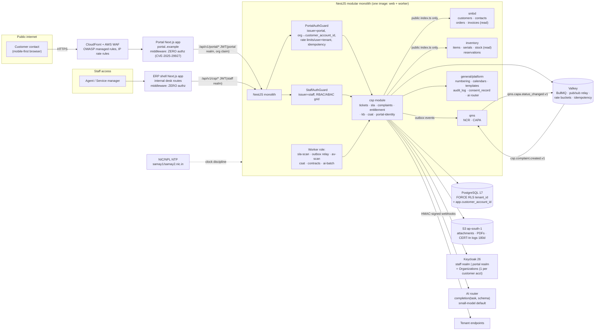
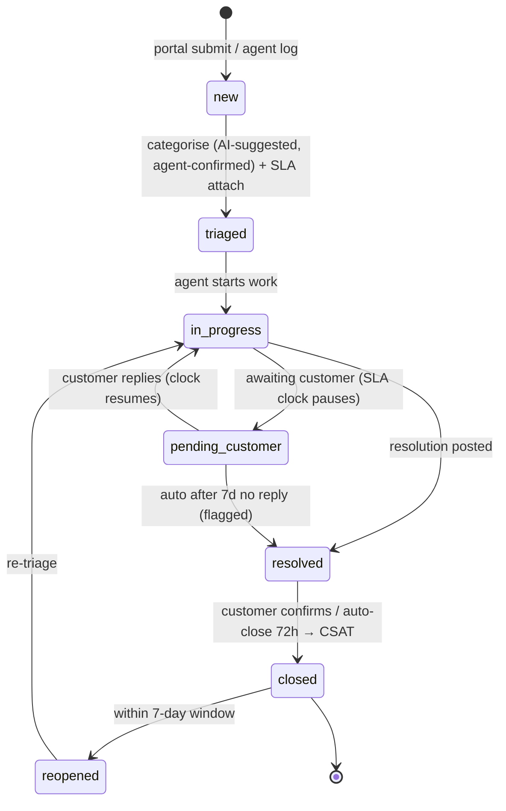

# IND-CORE Module 04 — Customer Service Portal

## Engineering Implementation Blueprint

**Product:** IND-CORE Manufacturing ERP — multi-tenant SaaS for Indian SMB/mid-market manufacturers
**Module:** 04 — CSP (Customer Service Portal)
**Plan status:** V2 — MVP implementation plan, investor-demo quality, conformed to DECISIONS-V2 · Author: ERP Engineering · Date: 2026-07-18
**Supersedes:** PLAN-4.md (V1). Where this plan and DECISIONS-V2 conflict, DECISIONS-V2 wins.

This blueprint reorganises the CSP V2 plan into the suite's standard twenty-section engineering format so every IND-CORE module reads consistently. CSP is a **V2 module conformed to DECISIONS-V2** (binding platform decisions) and shares the platform baseline with its sibling V2 modules — **Administration, General, HRM, Expenditure, and Integrations** — consuming their published services (numbering, calendars, templates, audit, consent, notification, AI router) rather than re-implementing them. Nothing in the restructure changes the module's stack, decisions, data, or scope; content has only been moved to its canonical section and, where a structural section was implicit in the source, synthesised from the module's own material (non-functional requirements, navigation, validation, testcase IDs).

---

## 1. Module Overview

CSP is the after-sales nerve centre of the ERP: **one data model rendered as two faces.**

1. **External customer self-service portal** — a branded, internet-facing web app where B2B customer contacts (e.g., a plant engineer at BlueOrbit Pumps) log in by invitation, raise and track tickets and complaints, look up warranty/AMC coverage on their installed machines, request spares, view sales-order and invoice status, search a knowledge base, and rate service on closure.
2. **Internal service desk** — where Trishul Precision's agents and service managers triage queues, work tickets against SLA countdowns, escalate breaches, convert defect tickets into formal complaints handed off to Quality (NCR/CAPA hook), validate warranty entitlement, and govern performance through dashboards.

Every customer interaction becomes a structured, traceable record linked to customer account, contact, product serial, sales order, warranty/AMC contract, and — for confirmed defects — the QMS NCR/CAPA.

CSP is strategically load-bearing beyond its feature list: it is the platform's **only internet-facing surface**, its **reference implementation of dual-dimension row scoping** (tenant + customer account), and — per the competitive research — an attack on an empty quadrant: *"Nobody bundles CSP + OT/integration for SMBs… Indian SMB products stop at billing"* (RES-competitors §Whitespace #4).

### 1.1 Module boundary — touchpoints only, no private copies of masters

Sibling modules are consumed as **touchpoints only**. CSP reads them through each module's public interface and subscribes to their outbox events; it never keeps private copies of masters.

| Owning module | Owns | CSP consumes as |
|---|---|---|
| SMBD | Customers, contacts, sales orders, invoices | Read-only account-scoped views; customer/contact logical references |
| Inventory | Items, serials, stock, reservations | Read for spares availability & installed base; reservation refs |
| QMS | NCR / CAPA | Outbox hand-off (`csp.complaint.created.v1`); consumes NCR/CAPA status events |
| Accounts | Invoice PDFs, warranty cost visibility | Read-only signed invoice downloads |
| General / Administration (platform) | Tenants, numbering, calendars, templates, `audit_log`, `consent_record`, notification service, AI router | Consumed services; CSP links, never duplicates |
| HRM | Employees (agents, authors) | Logical `employee_id` references |

Cross-module references (customer, contact, item, serial, order, NCR) are **logical references validated through owning-module services — no hard FK across module boundaries.** Audit and consent live in **platform tables** (`audit_log` hash-chained, `consent_record`, `ai_action_log`, `outbox_event`, `dsr_request`) — CSP links to them, never duplicates them.

### 1.2 System context

Two trust zones over one boundary-enforced modular monolith and one database.



### 1.3 Published & consumed services (events)

| Direction | Topic | Meaning |
|---|---|---|
| Publishes | `csp.ticket.created.v1` | New ticket registered |
| Publishes | `csp.ticket.closed.v1` | Ticket closed |
| Publishes | `csp.complaint.created.v1` | Defect complaint handed off to QMS (full traceability payload) |
| Publishes | `csp.amc.expiring.v1` | AMC renewal lead to SMBD (T-60 days) |
| Publishes | `csp.csat.received.v1` | CSAT response captured |
| Consumes | `smbd.dispatch.serial_shipped.v1` | Auto-seed warranty record (serial + invoice date + term) |
| Consumes | `smbd.customer.updated.v1` | Customer master change |
| Consumes | `qms.ncr.created.v1` | NCR raised for a complaint |
| Consumes | `qms.capa.status_changed.v1` | CAPA milestone streamed back to ticket timeline |

Events are written to `outbox_event` in the business transaction, relayed via Valkey pub/sub; consumers are idempotent (event-UUID dedupe). Outbound tenant **webhooks are HMAC-SHA256 signed** (`t=<ts>,v1=<sig>`, 5-minute tolerance, rotatable secrets, replay-rejected).

### 1.4 Business problem

Discrete manufacturers like the demo tenant **Trishul Precision Components Pvt Ltd** (CNC auto components, Pune-Chakan + Coimbatore) sell machined parts and assemblies to OEMs, then support them for years — yet after-sales typically runs on email, phone calls and spreadsheets. The consequences:

- **Invisible revenue leak.** Spares, AMC renewals and chargeable service are high-margin recurring revenue, but without a system they are unquoted, unbilled, or given away free under unverified "warranty".
- **Untracked warranty exposure.** Claims are honoured on goodwill without validating serial, purchase date, or contract terms — a silent P&L drain Finance cannot accrue for.
- **Open-loop quality.** Field failures — the richest quality signal a manufacturer gets — die in an inbox instead of becoming NCR → CAPA in QMS. The same defect ships again.
- **No SLA accountability.** OEM customers (Ashvamedha Motors) contractually expect 4-hour response on line-down complaints. Without clocks, escalation tiers, and evidence, penalties and relationship damage follow.
- **High cost-to-serve.** "Where is my ticket?", "Send me invoice INV-2627-00087 again", "Is this pump shaft under warranty?" — routine queries consume agent hours that self-service could deflect.
- **Compliance risk on customer data.** A customer-facing portal processes personal data of Indian data principals and is an internet-reachable ICT system. Two regimes apply on different clocks: **CERT-In directions are live today** (6-hour incident reporting, 180-day India-jurisdiction logs, NIC/NPL time sync — [CERT-In directions](https://www.cert-in.org.in/Directions70B.jsp)), while **DPDP obligations phase in to May 2027** (notice, consent, rights, breach notification to the DPB and affected principals, penalties to ₹250 crore — DPDP Rules 2025). Neither is manageable over ad-hoc email.
- **Competitive whitespace.** Incumbent Indian SMB products (Tally/Busy/Marg) stop at billing; customer portals are enterprise features (IFS/Epicor, [Salesforce Service Cloud](https://help.salesforce.com/s/products/service-cloud), [Dynamics 365 Customer Service](https://learn.microsoft.com/en-us/dynamics365/customer-service/)). A bundled, compliance-native CSP at SMB price points attacks an empty quadrant (RES-competitors §Whitespace #4).

CSP fixes this with a single governed record shared by customer and agent, SLA discipline, warranty gate-keeping, and a structured complaint-to-quality hand-off.

### 1.5 What changed in V2

| # | Area | V1 | V2 | Why (binding source) |
|---|---|---|---|---|
| 1 | ORM | Prisma | **Drizzle ORM v1** + drizzle-kit; raw SQL for reports | RLS ergonomics — Prisma wraps every query in an interactive transaction for `SET LOCAL` ([prisma#12735](https://github.com/prisma/prisma/issues/12735)); SQL-first fit (DECISIONS-V2 §2) |
| 2 | Cache/queue | Redis | **Valkey (ElastiCache) + BullMQ**, versions pinned | BSD licence, ~20–30% cheaper, BullMQ CI passes on Valkey; near-zero revert cost (DECISIONS-V2 §2) |
| 3 | Database | PostgreSQL 16 | **PostgreSQL 17**, FORCE RLS + hardened acceptance criteria, UUIDv7 PKs | Current major; RLS criteria now normative incl. CI leak probes (DECISIONS-V2 §1, §5) |
| 4 | Portal identity | Two hand-rolled Keycloak realms + custom customer-mapping | **Keycloak 26 Organizations** for customer-account identity separation; org membership mints the `customer_account_id` claim | Purpose-built B2B feature replaces bespoke invite/mapping code ([Keycloak Organizations](https://www.keycloak.org/docs/latest/server_admin/index.html#_managing_organizations)); DECISIONS-V2 §1 |
| 5 | Next.js security posture | Middleware did some auth gating | **Zero authorization in Next.js middleware**; authz lives only in NestJS guards + RLS | CVE-2025-29927 middleware-bypass lesson ([NVD](https://nvd.nist.gov/vuln/detail/CVE-2025-29927), [Next.js advisory](https://nextjs.org/blog/cve-2025-29927)); DECISIONS-V2 §2 |
| 6 | AI backbone | Anthropic Claude API direct | **Provider-agnostic thin router** `completion(task, schema)`, small-model default (GPT-5 nano/mini, Gemini Flash class); Claude = routed premium | Residency + pricing-concentration hedge; triage is a cheap-classification task (RES-ai §3d; DECISIONS-V2 §1) |
| 7 | AI scope | 4 CSP AI features incl. customer-facing KB RAG chatbot in MVP | **#3 ticket auto-triage + sentiment = COMMITTED (suggested, not forced); #6 reply drafting + thread summarization = stretch (agent-assist, never autonomous)**; KB RAG chatbot deferred to fast-follow | Evidence audit: triage/drafting are the shipped-and-stuck patterns; RAG is only as good as a curated KB, which won't exist at MVP (RES-ai §2 M4; DECISIONS-V2 §4) |
| 8 | Compliance clock discipline | Not addressed | SLA/audit timestamps disciplined to **NIC/NPL NTP (`samay1/samay2.nic.in`) or documented traceability**; CERT-In 6-h reporting + 180-day India-jurisdiction logs live now | CERT-In directions are live with no MSME carve-out (DECISIONS-V2 §3) |
| 9 | DPDP posture | "DPDP-compliant from day one" | **"DPDP-ready, aligned to DPDP Rules 2025 phase-in (May 2027)"**; consent via platform `consent_record`; Consent-Manager regime (Nov 2026) tracked for portal consent flows; dual breach clocks (CERT-In 6 h now + DPB/principals May 2027) | Corrected legal facts are normative (DECISIONS-V2 §3) |
| 10 | Events & APIs | Unversioned events, RFC 7807 errors | Versioned outbox events (`csp.ticket.created.v1` …), platform error envelope, cursor pagination only, HMAC-signed webhooks, idempotency on ticket creation | Platform conventions normative (DECISIONS-V2 §5) |
| 11 | Channels | WhatsApp vaguely post-MVP | **WhatsApp BSP = named fast-follow** with adapter port stubbed in MVP | Notification stack decision + open work item (f) (DECISIONS-V2 §1, §6); Indian B2B buyers live on WhatsApp (RES-competitors) |
| 12 | Plan structure | No edge-case or testing sections; 10-week roadmap; Terraform + MinIO dev | NEW **Edge Cases** and **Testing Strategy** sections; ~9-week roadmap with a **pen-test-style security gate before portal exposure**; OpenTofu; MinIO dropped for Garage/SeaweedFS/LocalStack in dev | Deep-research due-diligence engagement; DECISIONS-V2 §1–§2 |

---

## 2. Objectives

### 2.A Product objectives (from Goals)

1. **One record, two faces.** Customer and agent see the same live ticket — status, SLA countdown, replies — eliminating "where's my ticket?" chatter. Target: ≥30% deflection of status-inquiry contacts in the demo narrative.
2. **SLA discipline.** Every ticket carries first-response and resolution clocks from a policy matrix (priority × category × contract), computed in business time, pausing on `pending_customer`, with a two-tier escalation matrix on BullMQ. Demo shows met, at-risk, paused and breached tickets.
3. **Closed-loop quality hook.** Any defect ticket becomes a Complaint in ≤3 clicks, publishing `csp.complaint.created.v1` with the full traceability payload (serial, batch, symptom, in-service date); QMS creates an NCR and CAPA status streams back to the ticket timeline.
4. **Warranty as a gate, not a gift.** Entitlement check against serial + purchase date + warranty/AMC terms before any free-of-charge promise; the result is recorded on the ticket.
5. **Self-service commerce transparency.** Portal users see their sales-order status, deliveries, and GST invoices (their own customer account only) via read-only SMBD/Accounts views with audited, short-lived signed downloads.
6. **Deflection with dignity — search-first.** A curated KB with public/internal visibility, Postgres FTS search, and a wizard deflection panel. The customer-facing RAG chatbot is a **fast-follow**, gated on a curated KB and a mandatory human-escalation path (RES-ai §2 M4).
7. **Assistive AI that earns its keep.** Auto-triage + sentiment on every inbound ticket — **suggested, never forced** — with override rate measured as the feature's honesty metric. Reply drafting/summarization is stretch, agent-assist only, never autonomous (the Klarna lesson, RES-ai §2 M4).
8. **Secure public surface.** The portal is the ERP's only internet-facing surface; ship it OWASP-ASVS-hardened, rate-limited per tenant *and* per portal user, dual-scoped (tenant + customer account) on every query, with **zero authorization in Next.js middleware** (CVE-2025-29927 lesson) and a pen-test-style gate before exposure.
9. **Compliance-honest.** CERT-In obligations met now (logs, clocks, 6-h reporting); **"DPDP-ready, aligned to DPDP Rules 2025 phase-in (May 2027)"** — consent capture, rights intake and breach playbook built now, enforcement tightened at phase-in; Consent-Manager interoperability tracked for Nov 2026.
10. **Investor-demo polish.** Seeded, internally consistent dataset (Trishul tenant, Ashvamedha/BlueOrbit/Deccan customer accounts, TKT-2627 series) telling a coherent 15-minute story.

### 2.B Engineering objectives

- **Separate portal surface, shared core.** The portal is its own Next.js deployment/origin behind CloudFront + WAF; the internal desk lives in the ERP shell; both hit one monolith on disjoint route prefixes with disjoint guards — no shared session surface.
- **Dual-dimension row scoping as reference implementation.** FORCE RLS on `tenant_id` plus a mandatory `customer_account_id` predicate for portal principals, verified by automated cross-tenant *and* cross-customer leak probes on every migration.
- **Zero authorization in Next.js middleware** on both apps (CVE-2025-29927); authz enforced only in NestJS guards + RLS.
- **SLA timers on BullMQ/Valkey** with business-time math derivable from event history — timer state derivable, never authoritative-in-Redis.
- **Transactional outbox with versioned event names**; idempotent consumers; HMAC-signed webhooks.
- **Provider-agnostic AI router**, small-model default, Zod-validated outputs, per-tenant kill switch, golden-set ship gate.
- **Compliance-native clocks & logs**: NIC/NPL NTP discipline, 180-day ap-south-1 ICT logs, dual-clock breach playbook.

---

## 3. User Personas

CSP serves two identity worlds. **Internal staff** authenticate through the Keycloak staff realm and reach the internal desk; **external customer contacts** authenticate through the Keycloak portal realm as members of a Keycloak Organization mapped 1:1 to their SMBD customer account. Touchpoint personas work primarily in a sibling module and only read/receive CSP records.

| User group | Surface | Identity | Primary jobs (MVP) |
|---|---|---|---|
| Customer service agent (L1) | Internal desk | Employee (Keycloak staff realm) | Work the queue, first response, accept/override AI triage, reply with canned templates, resolve, raise complaint/spares request |
| Service manager | Internal desk | Employee | SLA/escalation config, assignment, warranty entitlement approval, dashboards, KB publishing, portal-user invites |
| Quality engineer (touchpoint) | QMS module | Employee | Receives complaint→NCR; CAPA status flows back — works in QMS, reads CSP complaint |
| Spares/warehouse staff (touchpoint) | Inventory module | Employee | Sees reserved spare requests; fulfils from Inventory |
| Finance/AR (touchpoint) | Accounts module | Employee | Invoice PDFs served read-only into portal; warranty cost visibility |
| Customer contact (e.g., BlueOrbit plant engineer) | External portal | **Portal user — member of a Keycloak Organization mapped 1:1 to the SMBD customer account** | Raise/track tickets & complaints, warranty lookup, spares request, orders & invoices, KB, CSAT |
| Customer admin contact | External portal | Portal user (`customer_admin` org role) | Same + company-wide ticket visibility, manage their organization's portal contacts (invite request, deactivation request) |
| Management | Internal dashboards | Employee | Executive after-sales snapshot: SLA %, CSAT, complaint trend, warranty claims |

### 3.1 Persona detail

**P1 — Customer service agent (L1), internal desk.**
- *Goals:* clear the queue within SLA; give a correct first response fast; convert defects to complaints cleanly.
- *Pain points:* context-hunting across email/spreadsheets; unclear warranty status; duplicate/duplicated tickets from flaky mobile connections.
- *Primary screens:* Service Desk queues, Ticket workspace (3-pane), Triage suggestion chip row, Complaint register.

**P2 — Service manager, internal desk.**
- *Goals:* keep SLA compliance high; staff queues; publish trustworthy KB; govern the AI feature's honesty.
- *Pain points:* no visibility into breaches until too late; ad-hoc entitlement approvals; portal-user lifecycle chaos.
- *Primary screens:* SLA & escalation config, Manager dashboard, KB authoring, Portal user admin, Warranty & AMC admin.

**P3 — Quality engineer (touchpoint), QMS.**
- *Goals:* receive a fully-traceable defect and drive NCR → CAPA.
- *Pain points:* field failures arriving as unstructured prose without serial/batch/in-service date.
- *Primary screens:* works in QMS; reads the CSP complaint traceability block; CAPA status flows back to the ticket timeline.

**P4 — Spares/warehouse staff (touchpoint), Inventory.**
- *Goals:* fulfil reserved spare requests accurately.
- *Pain points:* unclear whether a part is warranty-covered or chargeable.
- *Primary screens:* Inventory reservation views seeded from CSP spare requests.

**P5 — Finance/AR (touchpoint), Accounts.**
- *Goals:* control who sees which GST invoice; understand warranty cost exposure.
- *Pain points:* invoices re-sent by email with no audit; warranty given away un-costed.
- *Primary screens:* read-only invoice PDFs served into the portal via audited signed URLs.

**P6 — Customer contact (external portal user).**
- *Goals:* raise a request from the shop floor in seconds, track it with a real SLA countdown, check warranty on a machine, request a spare, pull an invoice, self-serve answers.
- *Pain points:* "where's my ticket?"; not knowing if a machine is covered; chasing invoices by phone; slow 3G on a mid-range Android.
- *Primary screens:* Home dashboard, Raise a Request wizard (serial-first), Track My Requests, Ticket detail, Warranty & AMC, Orders & Invoices, Knowledge Base, CSAT.

**P7 — Customer admin contact (external portal user, `customer_admin`).**
- *Goals:* company-wide visibility of their org's tickets; manage which colleagues have portal access.
- *Pain points:* no oversight of what the plant filed; onboarding/offboarding colleagues.
- *Primary screens:* all P6 screens with company-wide ticket scope + contact-management requests.

**P8 — Management (internal dashboards).**
- *Goals:* an executive after-sales snapshot in one glance.
- *Pain points:* no single source for SLA %, CSAT, complaint trend, warranty claims.
- *Primary screens:* Manager/exec dashboard with drill-downs.

### 3.2 Hard identity rules (unchanged in spirit, upgraded in mechanism)

- Customer-contact identity is **structurally separated** from employee identity: portal users live in a dedicated Keycloak realm whose Organizations map one-to-one to SMBD customer accounts. Different issuer, different audience — a portal JWT can never authenticate to an internal endpoint, and vice versa.
- The `customer_account_id` scoping claim is minted server-side from **organization membership at login** — never from client input.
- No authorization decision is ever made in Next.js middleware on either surface (CVE-2025-29927 lesson); middleware may do redirects-for-UX only, with NestJS guards + RLS as the sole enforcement points.

---

## 4. Functional Requirements

The CSP functional set spans eleven areas: portal identity (4.A), ticket lifecycle (4.B), the SLA engine (4.C), the complaint→QMS hook (4.D), warranty/AMC (4.E), spares (4.F), read-only commerce (4.G), the knowledge base (4.H), CSAT (4.I), the internal desk & audit (4.J), and cross-cutting portal security & compliance (4.K). Every requirement below is preserved from the source FR set; grouping is for structural consistency only.

#### 4.A Portal identity & access (invite-based, Keycloak Organizations) — FR-1

- **FR-1.1** Service manager invites a contact (picked from the SMBD contact master) → Keycloak Organization invitation: time-boxed (72 h), single-use link by email. Each SMBD customer account has exactly one Organization per tenant; creating the first invite for a customer auto-provisions the Organization via the Keycloak admin API.
- **FR-1.2** Invite acceptance: set password (zxcvbn strength ≥3), accept Terms + **DPDP consent notice** (purpose-specific, English + Hindi), optional TOTP enrolment. Acceptance writes an immutable row to the platform `consent_record` table (notice version, language, timestamp, principal) — CSP stores only the linkage, not its own consent columns.
- **FR-1.3** Portal login: email + password (+ TOTP if enrolled) via Keycloak; brute-force detection and lockout are Keycloak-native (CAPTCHA after 3 failures, lock after 8, timed or manager unlock); additional per-IP and per-account rate limits at the API edge (Valkey token buckets).
- **FR-1.4** Portal roles: `customer_user` (own + company records they raised), `customer_admin` (company-wide read, contact management requests). Every portal query is filtered by `tenant_id` **and** `customer_account_id` server-side, both derived from the JWT; out-of-scope access returns 404 (existence-hiding).
- **FR-1.5** Self-service: profile edit, password reset (email token), session list + revoke, download-my-data (DPDP data-principal access request), erasure request — both queued as rights-request tickets (special category, 90-day SLA), fulfilled per the retention policy in §9.
- **FR-1.6** Departure handling: suspending a portal user revokes Keycloak sessions within 60 s and disables org membership; moving a contact between customer accounts requires deactivate-and-reinvite (see §15 — no in-place `customer_account_id` mutation, ever).

#### 4.B Ticket lifecycle — FR-2

- **FR-2.1** Channels (MVP): portal form and internal manual entry (agent logs a phone call). Email-to-ticket is a feature-flagged stretch; **WhatsApp BSP is a named fast-follow** with the channel enum and adapter port reserved now.
- **FR-2.2** Numbering `TKT-2627-00001` (tenant FY series from the General numbering service). Fields: subject, description, category/sub-category, priority (low/medium/high/urgent), channel, customer account, contact, optional product serial, attachments (≤10 files, ≤25 MB each, MIME allow-listed, AV-scanned before visibility).
- **FR-2.3** Lifecycle with guarded transitions; every change appends a `csp_ticket_event` row and the platform hash-chained audit log.



- **FR-2.4** Transition guards: only staff set `triaged/in_progress/resolved`; only the customer (or auto-close job) moves `resolved → closed`; `reopened` allowed once per window from the portal, unlimited by manager. Reopen after CSAT keeps the original survey response (see §15).
- **FR-2.5** Threaded comments: public (customer-visible) vs internal notes; attachments per comment; canned response templates. Stretch (AI #6): "Suggest reply" and "Summarize thread" buttons render editable drafts — the agent must review and explicitly send; the system never sends autonomously.
- **FR-2.6** Assignment: team (queue) + owner agent; claim-from-queue with optimistic-lock conflict handling (see §15); bulk assign; manager reassign.
- **FR-2.7 AI auto-triage (committed AI #3):** on create, the platform AI router classifies `{suggested_category, suggested_priority, sentiment, confidence}` via a small-model call (GPT-5 nano/Gemini Flash-Lite class). The suggestion renders as an accept/edit chip on the triage screen — **never auto-applied**; acceptance, edits and dismissals are logged (`ai_action_log` + `ai_triage.accepted_by/overridden_fields`) so override rate is a first-class metric. Runs under the calling user's JWT; PII-minimised; per-tenant flag + kill switch; graceful no-op if the router is down (guardrails per DECISIONS-V2 §4).
- **FR-2.8** Idempotent creation: portal ticket creation requires an `Idempotency-Key`; replays within 24 h return the original ticket (409 on payload-hash mismatch) — double-taps on flaky shop-floor mobile connections must not create duplicate tickets.

#### 4.C SLA engine & escalation — FR-3

- **FR-3.1** SLA policy: match on priority (MVP) with optional category/contract override (precedence: contract > category > priority); defines `response_mins`, `resolution_mins`, business calendar (e.g., Mon–Sat 09:00–18:00 IST + tenant holiday list from General), `pause_on_pending`, JSONB escalation matrix.
- **FR-3.2** On create/triage, compute `first_response_due` and `resolution_due` in business time; recompute on priority change (elapsed business time preserved); pause/resume on `pending_customer` transitions with pause windows stored as `tstzrange[]` so elapsed time is recomputable and auditable.
- **FR-3.3** Escalation matrix tiers, e.g. 80% of response clock → notify owner; 100% → notify service manager + badge `breached_response`; resolution breach → notify management. A 1-minute BullMQ repeatable job evaluates due states and fires tiers exactly once (tier-fired markers on the ticket).
- **FR-3.4** SLA state (`on_track / at_risk / paused / breached_response / breached_resolution / met`) visible on both faces — the customer sees the same countdown the agent does.
- **FR-3.5 Clock discipline:** all SLA and audit timestamps derive from DB/server time on hosts synchronised to **NIC/NPL NTP (`samay1.nic.in` / `samay2.nic.in`) or with documented traceability** — AWS Time Sync alone is insufficient per CERT-In ([directions](https://www.cert-in.org.in/Directions70B.jsp)). Drift monitoring alerts at >100 ms; SLA math never reads client clocks.

#### 4.D Complaints & QMS hook — FR-4

- **FR-4.1** "Raise complaint" from a ticket (or portal wizard with type=Complaint): mandatory failure symptom, serial/batch, in-service date, severity.
- **FR-4.2** On submit, CSP writes `csp.complaint.created.v1` to the transactional outbox (same DB transaction as the complaint row) → Valkey pub/sub relay; QMS consumes idempotently, creates an NCR and returns `ncr_ref` (stored on the complaint). Demo mode: a QMS stub consumer acknowledges and simulates CAPA milestones.
- **FR-4.3** Complaint states: `open → investigation → corrective_action → closed`; QMS status events (`qms.ncr.created.v1`, `qms.capa.status_changed.v1`) append to the ticket timeline; the customer sees a sanitised subset ("Under investigation by Quality").
- **FR-4.4** Complaint cannot close while the linked NCR/CAPA is open (manager override with reason, audited).

#### 4.E Warranty & AMC registry — FR-5

- **FR-5.1** Warranty records auto-seeded from `smbd.dispatch.serial_shipped.v1` events (serial + invoice date + standard term) and manually maintainable by the service manager.
- **FR-5.2** AMC contracts: header (coverage type, entitlements JSONB, start/end, renewal date) + covered-serial link table; states `draft/active/expiring/expired/renewed/cancelled`; nightly job flags `expiring` at T-60 days and emits `csp.amc.expiring.v1` as a renewal lead to SMBD.
- **FR-5.3** Entitlement check service: serial + date → `covered_warranty / covered_amc / partial / not_covered` with reasons; invoked from the ticket panel and portal warranty lookup; result cached on the ticket. Deterministic serial/date anomaly rules (serial reuse, impossible dates) run here — warranty-fraud ML stays deferred (RES-ai §2 M4).
- **FR-5.4** Portal "Warranty & AMC" page: my machines with coverage status, expiry, certificate PDF (Gotenberg-rendered, signed short-lived URL).

#### 4.F Spare-part requests — FR-6

- **FR-6.1** From portal or ticket: pick part (Inventory item search filtered to spares, e.g., TPC-BRG-HSG-004), qty, ship-to; live availability (Inventory read) and warranty-vs-chargeable determination via entitlement check.
- **FR-6.2** States: `requested → quoted → reserved → closed/cancelled` (fulfilment executes in Inventory/SMBD; CSP stores reservation/fulfilment refs). No pricing engine in CSP — indicative price read from SMBD price list; quote approval is a manager action.

#### 4.G Orders & invoices (read-only) — FR-7

- **FR-7.1** Portal lists the logged-in customer account's sales orders and invoices via SMBD/Accounts read interfaces — strictly `customer_account_id`-scoped. A customer with multiple GSTINs/ship-tos sees all documents of the account, with GSTIN/ship-to shown per document (see §15).
- **FR-7.2** Invoice PDF download: signed, short-lived (15-min) S3 URL bound to the requesting portal user; e-invoice copy exposed only when the IRN-registered final PDF exists; every download audit-logged (who/when/IP) — invoices are financial documents under GST record rules.

#### 4.H Knowledge base — FR-8

- **FR-8.1** Articles: title, Markdown body, category, product-model tags, visibility (`internal/public`), version, states `draft → in_review → published → archived`; only service managers publish.
- **FR-8.2** Search: **Postgres 17 FTS + pg_trgm** behind the platform `SearchPort` (`websearch_to_tsquery` + trigram for part-number fuzzies like "BRG HSG"); portal sees published+public only; internal sees published incl. internal. **Meilisearch pull-forward trigger: Indic-script search** — the day a tenant needs Hindi/Marathi/Tamil KB search, Postgres FTS has no Indic stemmers and the port swaps to Meilisearch without API change.
- **FR-8.3** Deflection: the "Raise a Request" wizard live-suggests top-3 matching public articles from subject text before submit; "Did this help?" feedback increments counters; deflection rate is a dashboard KPI.
- **FR-8.4** KB RAG chatbot: **fast-follow, not MVP** (RES-ai §2 M4 — RAG is only as good as a curated KB). pgvector embedding columns and the escalate-to-ticket UX contract are designed now; the chatbot ships only after the KB passes a curation bar and with a mandatory human-escalation path and citations.

#### 4.I CSAT — FR-9

- **FR-9.1** On `resolved → closed` (or auto-close after 72 h), send CSAT email + portal banner: 1–5 stars + optional comment; single response per ticket; 14-day window; single-use hashed token.
- **FR-9.2** Scores feed the manager dashboard; score ≤2 auto-creates a service-manager follow-up task. Comment sentiment tagging reuses the committed triage/sentiment capability in a nightly batch (batch-API pricing).

#### 4.J Internal desk, dashboards & audit — FR-10

- **FR-10.1** Queue views: My Tickets, Team Queue, Unassigned, Breached/At-risk, Pending Customer; saved filters; keyboard-first triage; AI-suggestion chips inline in the queue.
- **FR-10.2** Manager dashboard: open vs breached, SLA compliance % (first-response, resolution), agent load, CSAT trend, complaint trend by product model, backlog ageing, warranty claims snapshot, **AI acceptance/override rate**.
- **FR-10.3** Hash-chained platform audit log on all CSP records (MCA audit-trail pattern: append-only, tamper-evident, no off-switch, 8-year retention); activity timeline per record.
- **FR-10.4** Notifications: in-app (Socket.IO) + email (SES) on assignment, customer reply, SLA warnings, escalations, CSAT received; templates from the General notification service. Outbound webhooks (tenant integrations) HMAC-SHA256 signed per platform convention.

#### 4.K Security & compliance (portal-specific, cross-cutting) — FR-11

- **FR-11.1** OWASP ASVS L2 posture on the portal surface: security headers (CSP/HSTS/frame/referrer), CSRF protection, output encoding, SSRF-safe file handling, dependency + secret scanning in CI, Next.js **CVE pin/patch policy** with middleware treated as convenience-only.
- **FR-11.2** Rate limits (Valkey token buckets), enforced **per tenant AND per portal user**: login 5/min/IP, ticket create 10/hr/user, search 30/min/user, attachment upload 20/hr/user, global per-IP ceiling; CAPTCHA on login-after-failures; all limit events recorded in `csp_abuse_event`.
- **FR-11.3** CERT-In (live now): 180-day rolling ICT logs in ap-south-1 S3 (lifecycle-managed), NIC/NPL-disciplined clocks, 6-hour incident-reporting runbook wired to the same evidence pack as DPDP breach handling.
- **FR-11.4** DPDP-ready: consent notice at invite acceptance → platform `consent_record`; purpose limitation; data-principal rights intake (access/correction/erasure) as a ticket category with SLA; **dual-clock breach playbook** (CERT-In 6 h now; DPB immediate/72 h + affected principals "without delay" at May 2027) — one playbook, two timers, single evidence pack; all customer PII in ap-south-1; AI calls PII-minimised and logged; Consent-Manager (Nov 2026) interoperability tracked for portal consent flows.
- **FR-11.5** Row scoping enforced twice: Postgres **FORCE RLS** on `tenant_id` (fail-closed backstop) plus a mandatory `customer_account_id` predicate for portal principals (RLS session variable `app.customer_account_id` set for portal requests as defence-in-depth); automated leak probes assert cross-customer access returns 404 on every migration.

---

## 5. Non-functional Requirements

Synthesised from the module's engineering goals, System Architecture decisions, and the rate-limit/compliance requirements. These are the quality attributes CI and the week-7 security gate assert against.

| ID | Category | Requirement |
|---|---|---|
| NFR-01 | Performance (portal) | Portal is phone-first and **fully usable at 360 px**; App Router + RSC deliver fast first paint on mid-range Android over 3G-class latency; skeleton loaders tuned for patchy shop-floor networks. |
| NFR-02 | Performance (SLA engine) | 1-minute BullMQ repeatable scan evaluates due states; escalation tiers fire idempotently; SLA verdicts derive from DB timestamps, never worker-local clocks — a drifting worker delays a notification by seconds, never corrupts a verdict. |
| NFR-03 | Performance (RLS overhead) | Week-1 RLS-overhead benchmark applies; if dual-dimension scoping adds >15–20% query overhead, the documented mitigation/flip trigger engages (DECISIONS-V2 §5). |
| NFR-04 | Availability | Portal **kill switch (maintenance mode)** decouples the portal from ERP core; self-hosted Keycloak on the public path is health-checked, ap-south-1, session-resilient (or managed Keycloak per platform decision) — login outage must not take the ERP core down. |
| NFR-05 | Data residency (India) | All customer PII, attachments, invoice PDFs and CERT-In ICT logs reside in **AWS ap-south-1**; no India-processed Claude inference on any channel; AI calls PII-minimised. |
| NFR-06 | Compliance clocks & logs | SLA/audit timestamps on **NIC/NPL NTP (`samay1/samay2.nic.in`) or documented traceability**; drift alarm >100 ms; **180-day rolling ICT logs** in ap-south-1 S3, lifecycle-enforced; CERT-In 6-hour incident reporting live. |
| NFR-07 | DPDP / privacy | "DPDP-ready, aligned to DPDP Rules 2025 phase-in (May 2027)": consent captured at invite → platform `consent_record`; purpose limitation; data-principal rights intake with SLA; dual-clock breach playbook; Consent-Manager (Nov 2026) interoperability tracked. |
| NFR-08 | Security posture | OWASP ASVS L2 on the portal surface; security headers (CSP/HSTS/frame/referrer), CSRF protection, output encoding, SSRF-safe file handling; **zero authorization in Next.js middleware**; separate origin + realm; WAF managed rules in blocking mode; pen-test-style gate before any internet exposure. |
| NFR-09 | Rate limiting & abuse | Valkey token buckets **per tenant AND per portal user** plus per-IP ceilings: login 5/min/IP, ticket create 10/hr/user, search 30/min/user, upload 20/hr/user; 429 + `Retry-After`; every trip logged to `csp_abuse_event`; CAPTCHA + Keycloak lockout on login-after-failures. |
| NFR-10 | Isolation | Dual-dimension row scoping (tenant + customer account) enforced by FORCE RLS + service predicate; out-of-scope access returns 404 (existence-hiding); automated cross-tenant AND cross-customer leak probes run per migration in CI. |
| NFR-11 | Auditability | Hash-chained platform `audit_log` (`row_hash = SHA256(prev_hash ‖ canonical_payload)` per tenant), INSERT-only grant, verify job, no off-switch, 8-year retention; per-record activity timeline. |
| NFR-12 | Reliability of events | Transactional outbox (same DB transaction as the business row); at-least-once relay via Valkey pub/sub; idempotent consumers (event-UUID dedupe); HMAC-SHA256 signed webhooks with 5-min tolerance, replay-rejected, delivery ledger. |
| NFR-13 | File safety | Uploads stream through the API to S3 as `pending_scan`; ClamAV promotes to `clean` or quarantines `blocked`; customer-visible only when clean; scanner outage fails closed; all reads via 15-min signed URLs. |
| NFR-14 | Observability | Portal endpoints emit dedicated metrics (login failures, 404 scope denials, rate-limit hits, AV quarantines, webhook failures) to Grafana with alerts from day one; OTel traces span portal → guard → RLS-scoped query; Sentry on both apps. |
| NFR-15 | Accessibility & i18n | WCAG AA contrast on both faces; INR lakh/crore formats; DD-MMM-YYYY dates; English MVP with an i18n scaffold (Indic i18n is a named platform work item, DECISIONS-V2 §6g). |
| NFR-16 | AI guardrails | AI outputs Zod-validated and never executed; per-tenant opt-out, daily token budgets, kill switch; golden-set eval gate before ship; override rate is a monitored drift signal. |
| NFR-17 | Retention | Tickets/complaints 8-year retention (MCA/GST horizons); attachments lifecycle-tied to parent, >2-year objects to S3 IA; CSAT/invite token hashes purged at 90 days; erasure pseudonymises PII while business records survive. |

---

## 6. UI/UX Flow

**Binding context:** the platform's mobile/offline phase is a named top strategic gap that must land **before the CSP UX freeze** (DECISIONS-V2 §2, §6a). The portal is designed phone-first from wireframe one — Indian plant engineers will file tickets from the shop floor on mid-range Android devices over patchy networks.

CSP presents two surfaces over one data model:

- **Surface 1 — Customer portal** (`portal.*`, separate Next.js app). Design language: tenant-branded (Trishul logo/colours), light, spacious, trust-signalling; INR lakh/crore formats; DD-MMM-YYYY dates; **fully usable at 360 px**; large tap targets; camera-first attachment capture; skeleton loaders tuned for 3G-class latency; English MVP with an i18n scaffold (Indic i18n is a named platform work item, DECISIONS-V2 §6g).
- **Surface 2 — Internal service desk** (routes in the ERP shell). Design language: dense, keyboard-first, shadcn/ui dark-compatible, consistent with sibling modules; responsive but desktop-optimised.

### 6.1 Primary customer loop — raise & track a request

1. Portal login (email + password, TOTP step-up, CAPTCHA after failures) → **Home dashboard** with SLA chips, registered machines, warranty/AMC alerts, recent invoices.
2. **Raise a Request wizard, serial-first:** Step 1 pick machine from installed-base cards (coverage badge) or "not machine-specific"; Step 2 type + category; Step 3 describe + attach (drag-drop, camera capture on mobile) with a **live KB deflection panel** suggesting top-3 public articles as the user types; Step 4 review → submit (idempotency-key-safe) → ticket number + explicit SLA promise ("First response within 4 business hours").
3. **Track My Requests** → card list (mobile) / table (desktop) with sanitised status chips and **the same SLA/ETA countdown the agent sees** → row → **Ticket detail** (public timeline, attachments, status stepper, SLA clock; comment, attach, reopen-in-window, rate-when-closed).
4. On closure/auto-close → **CSAT** (5-star, optional comment) via email deep-link or portal banner.

### 6.2 Self-service commerce & coverage loop

Warranty & AMC page (machine coverage badges, serial lookup, AMC entitlements, certificate download) · Orders & Invoices tabs (SO status; invoice list with per-document GSTIN/ship-to, paid/due badge, 15-min signed download) · Knowledge Base search-first with helpful votes · My Profile (contact, password/MFA, sessions + revoke, consent record view, download-my-data, deletion request).

### 6.3 Primary agent loop — triage & work a ticket

1. **Service Desk queues** (data grid): SLA countdown chips green/amber/pulsing red; saved views rail; bulk assign/claim with conflict toasts; `/` search, `j/k` nav.
2. **Triage suggestion UX (suggested, not forced):** on `new` tickets an "AI suggests" chip row shows category, priority, sentiment badge, confidence %. **Accept all** (one click), per-field edit, or **Dismiss** — nothing applies until the agent acts; provenance and overrides are logged and feed the dashboard override-rate widget; low-confidence (<0.6) suggestions render collapsed; if the router is down or the tenant opted out, the triage form is just the ordinary form.
3. **Ticket workspace** (3-pane): left = customer & machine context (contact, serial, entitlement badge, warranty/AMC, past tickets); centre = thread (public/internal toggle, canned responses, attachment strip); right = properties + SLA timers with pause history + linked records (complaint w/ NCR/CAPA, spares, sales order). Sticky action bar.
4. Convert defect → **Complaint** (traceability block, QMS status timeline; close guarded by CAPA state); run **entitlement check**; raise **spare request**; resolve → CSAT.

### 6.4 Manager loop

SLA & escalation config (policy editor) · KB authoring pipeline · Portal user admin (invite/resend/suspend/deactivate-and-reinvite) · **Manager dashboard** (SLA gauges, open-vs-breached, backlog ageing, agent load, CSAT trend + low-score list, complaint Pareto, AMC renewal pipeline, AI acceptance/override widget) — every chart drills to a filtered queue.

**Shared UX rules:** optimistic updates with rollback toasts; empty states with a call to action; CSV export internal-only; WCAG AA contrast; portal fully usable at 360 px; **no authorization decisions client-side — the UI only hides what the API already denies.**

**WhatsApp BSP (named fast-follow, per DECISIONS-V2):** the UX contract is designed now — ticket-created/status-changed/CSAT template messages, inbound "reply to update your ticket", opt-in captured at invite acceptance alongside DPDP consent. The channel enum, adapter port and template registry ship in MVP so the BSP integration (MSG91/Twilio-class BSP) is an adapter drop-in, not a redesign.

---

## 7. Screen-by-Screen Design

### 7.A Customer portal (`portal.*`, separate Next.js app)

#### 7.A.1 Login / Invite accept
Branded card: email+password, TOTP step-up, CAPTCHA after failures, forgot-password. Invite flow: password strength meter (zxcvbn ≥3), versioned DPDP consent notice (EN + HI), terms. *Empty/error:* generic constant-time 401s (no user enumeration); lockout messaging neutral; expired invite → re-request path.

#### 7.A.2 Home dashboard
Cards: My open requests (SLA chips), Registered machines, Warranty/AMC alerts ("AMC-2627-0002 expires in 21 days"), Recent invoices, quick actions. *Empty:* first-run CTA to raise a request or register interest.

#### 7.A.3 Raise a Request (wizard)
Step 1 pick machine (installed-base cards with coverage badge) or "not machine-specific"; Step 2 type + category; Step 3 describe + attach (drag-drop, **camera capture on mobile**); **live KB deflection panel** as the user types; Step 4 review → submit → ticket number + explicit SLA promise ("First response within 4 business hours"). Double-submit safe (idempotency key). *Error:* upload rejected (MIME/size) inline; offline submit retried with the same key.

#### 7.A.4 Track My Requests
Card list (mobile) / table (desktop): request no., type, sanitised status chip, **SLA/ETA countdown**, last update; filters; row → detail. *Empty:* "No requests yet".

#### 7.A.5 Ticket detail
Public-comment timeline, attachments (`clean` only), status stepper, SLA clock, actions: comment, attach, reopen (in window), rate (when closed). Complaint tickets show sanitised quality status ("Under investigation by Quality"). *Error:* reopen after window → `REOPEN_WINDOW_ELAPSED` with a "create linked ticket" path.

#### 7.A.6 Orders & Invoices
Tabs. Orders: SO no., date, status, expected delivery. Invoices: no., date, GSTIN/ship-to, taxable/GST/total, paid-due badge, signed download. *Error:* PDF only when IRN-registered final PDF exists.

#### 7.A.7 Warranty & AMC
Machine list with coverage badges, serial lookup, AMC cards with entitlements, certificate download (Gotenberg-rendered, signed URL).

#### 7.A.8 Knowledge Base
Search-first, category chips, Markdown article view, helpful votes. (RAG assistant drawer ships as fast-follow behind a flag.)

#### 7.A.9 CSAT
Email deep-link or portal banner: 5-star tap targets, optional comment, thank-you state. Single-use hashed token; 14-day window.

#### 7.A.10 My profile
Contact details, password/MFA, sessions + revoke, consent record view, download-my-data, deletion request (DPDP).

### 7.B Internal service desk (routes in ERP shell)

#### 7.B.1 Service Desk queues
Data grid (platform wrapper): ticket no., subject, customer, serial, category, priority, status, **SLA countdown chip** (green/amber/pulsing red), owner, age. Saved views rail; bulk assign/claim with conflict toasts; `/` search, `j/k` nav.

#### 7.B.2 Ticket workspace
3-pane. Left: customer & machine context (contact, serial, entitlement badge, warranty/AMC panel, past tickets). Centre: thread (public/internal toggle, canned responses, attachment strip). Right: properties + SLA timers with pause history + linked records (complaint w/ NCR/CAPA status, spares, sales order). Sticky action bar.

#### 7.B.3 Triage suggestion UX — suggested, not forced
On `new` tickets, an **"AI suggests"** chip row: category, priority, sentiment badge (e.g., *negative — frustrated*), confidence %. Buttons: **Accept all** (one click), per-field edit, **Dismiss**. Nothing applies until the agent acts; the field's provenance shows "set by AI suggestion, accepted by Priya D." in the timeline; overrides are logged and feed the dashboard override-rate widget. Low-confidence (<0.6) suggestions render collapsed. If the AI router is down or the tenant opted out, the triage form is simply the ordinary form — no degradation.

#### 7.B.4 AI reply draft (stretch #6)
"Suggest reply" / "Summarize thread" buttons render an editable draft in the composer with a visible `AI draft — review before sending` banner; send is always an explicit human action; drafts are logged as `author_type=ai_draft` until sent.

#### 7.B.5 Complaint register/detail
Register table; detail with traceability block + QMS status timeline; close guarded by CAPA state.

#### 7.B.6 Warranty & AMC admin
Registries + AMC editor (entitlement JSON form, covered-serial picker, expiring-soon view).

#### 7.B.7 Spare requests
Queue with live availability badge, warranty/chargeable flag, quote field, Reserve action.

#### 7.B.8 SLA & escalation config
Policy editor: response/resolution minutes, calendar picker, pause toggle, escalation tier builder. Manager-only.

#### 7.B.9 KB authoring
Status-pipeline list; Markdown editor with preview, tags, visibility toggle, review→publish; per-article analytics.

#### 7.B.10 Portal user admin
Per-customer contact list (mirrors Keycloak Organizations), invite/resend/suspend/deactivate-and-reinvite, consent + last-login columns.

#### 7.B.11 Manager dashboard
Recharts grid: SLA gauges, open-vs-breached by team, backlog ageing, agent load, CSAT trend + low-score list, complaint Pareto, AMC renewal pipeline, **AI acceptance/override widget**. Every chart drills to a filtered queue.

---

## 8. Navigation

### 8.1 Customer portal nav tree (`portal.<tenant>.example`)

```
Portal (branded shell)
├── Home                         (dashboard cards)
├── Requests
│   ├── Raise a Request          (wizard, serial-first)
│   └── Track My Requests        → Ticket detail /:ticket_no
├── Warranty & AMC               (installed base, lookup, certificates)
├── Orders & Invoices            (tabs: Orders | Invoices → /pdf signed URL)
├── Knowledge Base               (search-first) [+ RAG assistant drawer — flagged fast-follow]
└── My Profile                   (contact, MFA, sessions, consent, DPDP rights)
```

- **Deep links:** `/requests/:ticket_no`, `/invoices/:inv_no`, CSAT `/csat/:survey_token`, invite `/auth/invite/accept?token=…`.
- **Breadcrumbs:** Home / Requests / TKT-2627-00031.
- **Permission-gated visibility:** `customer_admin` additionally sees company-wide ticket scope and contact-management requests; `customer_user` sees own + company records they raised. The UI only *hides* what the API already *denies* — scope is enforced server-side by `customer_account_id`.

### 8.2 Internal desk nav (routes in ERP shell)

```
ERP Shell › Customer Service (CSP)
├── Service Desk
│   ├── My Tickets · Team Queue · Unassigned · Breached/At-risk · Pending Customer  (saved filters)
│   └── Ticket workspace /:id
├── Complaints                   (register → detail with NCR/CAPA timeline)
├── Warranty & AMC admin         (warranty registry · AMC contracts)
├── Spare Requests               (review · quote · reserve)
├── Knowledge Base               (authoring pipeline)
├── Configuration
│   ├── SLA & Escalation policies (manager)
│   ├── Portal Users              (invite/suspend/deactivate-reinvite)
│   └── Webhooks                  (subscriptions · rotate secret)
└── Dashboards & Reports         (service dashboard · SLA/CSAT/complaint reports · audit trail)
```

- **Breadcrumbs:** Customer Service / Service Desk / Team Queue / TKT-2627-00031.
- **Permission-gated visibility:** SLA config, portal-user admin, webhook config, KB publish and warranty-entitlement approval are **manager-only**; agents see queues, workspace, complaints, spares, KB authoring (draft/review). Every nav item is RBAC/ABAC-gated in the staff realm; hidden items are also API-denied.
- **Cross-surface rule:** the two apps share no session; a staff token can never reach `/api/v1/portal/*` and a portal token can never reach `/api/v1/csp/*` (disjoint issuers/audiences, disjoint guards).

---

## 9. Database Schema (PostgreSQL 17)

**Conventions (platform-normative, DECISIONS-V2 §5):** UUIDv7 PKs; every tenant-scoped table carries `tenant_id` (FORCE RLS), `created_at/by`, `updated_at/by`, `is_active` soft delete; no hard DELETE on masters or financial-linked documents; composite indexes lead with `tenant_id`; monetary `numeric(14,2)`; time `timestamptz`. **CSP addition:** portal-reachable tables also carry `customer_account_id` (the second scoping dimension). Cross-module references (customer, contact, item, serial, order, NCR) are logical references validated through owning-module services — no hard FK across module boundaries. Audit and consent live in **platform tables** (`audit_log` hash-chained, `consent_record`, `ai_action_log`, `outbox_event`, `dsr_request`) — CSP links to them, never duplicates them. Prefix: `csp_`. Modelled in Drizzle ORM v1 (drizzle-kit migrations); reports use raw SQL.

### 9.1 MVP tables

| Table | Purpose | Key columns (beyond conventions) | References |
|---|---|---|---|
| `csp_portal_user` | Portal identity record (mirror of Keycloak portal-realm principal + org membership) | `id uuidv7 PK`, `customer_account_id`, `email citext` (unique per tenant), `phone`, `role` (`customer_user/customer_admin`), `status` (`invited/active/suspended/locked/deactivated`), `keycloak_sub`, `keycloak_org_id`, `consent_record_id` → **platform `consent_record`** (DPDP notice acceptance; re-consent appends new rows), `last_login_at` | `customer_account_id`, `contact_id` → SMBD |
| `csp_portal_invite` | Invite audit trail (token lifecycle lives in Keycloak; this is the business record) | `token_hash`, `expires_at`, `accepted_at`, `invited_role`, `keycloak_org_id` | `contact_id` → SMBD; `invited_by` → employee |
| `csp_team` / `csp_team_member` | Agent queues/teams | `name`, `email_alias` | `employee_id` → HRM |
| `csp_ticket_category` | Category/sub-category taxonomy | `parent_id` (self), `name`, `default_team_id`, `default_priority`, `is_portal_visible` | `default_team_id` → `csp_team` |
| `csp_sla_policy` | SLA definitions | `name`, `applies_to` (`priority/category/contract`), `match_value`, `response_mins`, `resolution_mins`, `business_calendar_id` → General, `pause_on_pending bool`, `escalation_matrix jsonb`, `active` | — |
| `csp_ticket` | Core case record | see §9.2 detail | — |
| `csp_ticket_comment` | Threaded replies/notes | `body`, `visibility` (`public/internal`), `author_type` (`staff/portal/system/ai_draft`), `author_id` | `ticket_id` |
| `csp_ticket_attachment` | Files on tickets/comments | `file_name`, `mime_type`, `size_bytes`, `s3_key`, `scan_status` (`pending/clean/blocked`), `uploaded_by_type/id` | `ticket_id`; `comment_id?` |
| `csp_ticket_event` | Status/assignment/SLA/AI event history (timeline + reports + SLA recompute) | `event_type`, `from_value`, `to_value`, `actor_type/id`, `occurred_at` | `ticket_id` |
| `csp_complaint` | Defect complaint + QMS hand-off | `complaint_no` (`CMP-2627-#####`), `failure_symptom`, `in_service_date`, `severity`, `disposition`, `status`, `qms_sync_status`, `ncr_ref`, `capa_ref` (logical) | `ticket_id`; `customer_account_id`; serial/batch → Inventory |
| `csp_warranty` | Warranty registry per serial | `warranty_type`, `start_date`, `end_date`, `coverage_terms`, `status`, `source` (`auto_dispatch/manual`) | serial → Inventory; `customer_account_id`, `sales_order_id` → SMBD |
| `csp_amc_contract` / `csp_amc_contract_asset` | AMC header + covered serials | `contract_no`, `coverage_type`, `entitlements jsonb`, `start/end/renewal_date`, `annual_value`, `status` | `customer_account_id` → SMBD; serials → Inventory |
| `csp_spare_request` | Spare-part request | `request_no`, `qty numeric(12,3)`, `is_warranty`, `unit_price`, `ship_to_gstin`, `ship_to_address`, `status`, `reservation_ref`, `fulfilment_ref` | `ticket_id?`; `customer_account_id`; `item_id` → Inventory |
| `csp_kb_article` | Knowledge base | `title`, `body_md`, `category`, `product_model_tags text[]`, `visibility` (`internal/public`), `version`, `status`, `view/helpful/not_helpful_count`, `published_at`, `search_tsv tsvector` (generated), `embedding vector` (provisioned for fast-follow RAG) | `author_employee_id` → HRM |
| `csp_csat_survey` / `csp_csat_response` | Survey issuance + response | `token_hash`, `sent_at`, `expires_at`, `responded_at`; `csat_score smallint`, `comment`, `sentiment` (AI, nullable), `followup_task_created` | `ticket_id`; `portal_user_id` |
| `csp_abuse_event` | Rate-limit/abuse telemetry (lockouts, CAPTCHA triggers, scope-denial 404s, limit saturation, AV quarantines) | `event_type`, `principal_type/ref`, `ip inet`, `user_agent`, `details jsonb`, `occurred_at` — feeds the portal security dashboard and CERT-In evidence pack | — |
| `csp_webhook_subscription` / `csp_webhook_delivery` | Tenant webhook endpoints + delivery/replay ledger | `url`, `secret_ref` (rotatable), `event_types text[]`, `active`; delivery: `event_id`, `attempt`, `status`, `signature_ts`, `response_code` | platform `outbox_event` |

### 9.2 Core table detail — `csp_ticket`

| Column | Type | Notes |
|---|---|---|
| id | uuid (UUIDv7) | PK |
| tenant_id | uuid | FORCE RLS scope |
| customer_account_id | uuid | second scoping dimension; logical ref → SMBD customer |
| ticket_no | varchar(20) | unique per tenant, `TKT-2627-#####` from General numbering |
| contact_id / portal_user_id | uuid | contact mandatory; portal_user null for phone/manual channel |
| product_serial_id | uuid | logical ref → Inventory serial, nullable ("not machine-specific") |
| channel | varchar(20) | `portal / phone / email / whatsapp` (email flag-gated; whatsapp reserved for BSP fast-follow) |
| subject / description | varchar(255) / text | FTS-indexed |
| category_id / priority / severity | uuid / varchar(20) | priority drives SLA match |
| status | varchar(30) | lifecycle enum, guarded transitions |
| sla_policy_id / sla_state | uuid / varchar(30) | matched policy snapshotted; `on_track/at_risk/paused/breached_response/breached_resolution/met` |
| first_response_due/at · resolution_due · resolved_at · closed_at | timestamptz | business-time computed, NTP-disciplined source |
| sla_pause_windows | tstzrange[] | pending-customer intervals; recompute-auditable |
| escalation_fired | jsonb | per-tier fired markers (idempotent escalations) |
| team_id / owner_employee_id | uuid | queue + assignee; `assigned_version int` for optimistic-lock claim race |
| complaint_id / entitlement_result | uuid / varchar(20) | nullable; cached entitlement verdict |
| ai_triage | jsonb | `{suggested_category, suggested_priority, sentiment, confidence, model, accepted_by?, overridden_fields?[]}` — suggestion never auto-applied |
| reopen_count / reopened_after_csat | smallint / bool | window-guarded; CSAT interplay per §15 |
| idempotency_key_hash | varchar(64) | creation replay guard (paired with Valkey window) |

### 9.3 Row-level security — dual-dimension scoping (DDL)

Platform pattern (DECISIONS-V2 §5) plus CSP's second dimension. App-layer scoping is primary; RLS is the fail-closed backstop.

```sql
ALTER TABLE csp_ticket ENABLE ROW LEVEL SECURITY;
ALTER TABLE csp_ticket FORCE ROW LEVEL SECURITY;
CREATE POLICY tenant_isolation ON csp_ticket
  USING (tenant_id = current_setting('app.tenant_id')::uuid)
  WITH CHECK (tenant_id = current_setting('app.tenant_id')::uuid);
-- Portal-facing tables add the customer-account dimension (fail-closed for portal sessions):
CREATE POLICY customer_account_isolation ON csp_ticket AS RESTRICTIVE
  USING (current_setting('app.customer_account_id', true) IS NULL
         OR customer_account_id = current_setting('app.customer_account_id')::uuid);
-- App connects ONLY as non-owner app_user (NOBYPASSRLS); per request:
-- BEGIN; SET LOCAL app.tenant_id = '<jwt>'; SET LOCAL app.customer_account_id = '<jwt, portal only>'; …; COMMIT;
```

CI runs two-tenant **and** two-customer leak probes on every migration; week-1 RLS overhead benchmark applies (flip trigger >15–20%).

### 9.4 Indexing highlights (DDL)

```sql
-- queue query
CREATE INDEX ix_ticket_queue        ON csp_ticket (tenant_id, status, team_id);
-- portal account-scoped list
CREATE INDEX ix_ticket_portal_list  ON csp_ticket (tenant_id, customer_account_id, created_at DESC);
-- SLA scanner hot path
CREATE INDEX ix_ticket_sla_scan     ON csp_ticket (sla_state)
  WHERE sla_state IN ('at_risk','breached_response');
-- KB search
CREATE INDEX ix_kb_tsv              ON csp_kb_article USING GIN (search_tsv);
CREATE INDEX ix_kb_title_trgm       ON csp_kb_article USING GIN (title gin_trgm_ops);
CREATE INDEX ix_kb_embedding        ON csp_kb_article USING hnsw (embedding vector_cosine_ops); -- provisioned
-- abuse telemetry
CREATE INDEX ix_abuse_time          ON csp_abuse_event (tenant_id, occurred_at);
```

### 9.5 Retention & lifecycle

- Tickets/complaints: default 8-year retention (aligned to MCA/GST record horizons for linked financial references); purge only by retention job.
- Portal-user PII: on approved DPDP erasure, personal fields pseudonymised (`erased-user-<id>`) while ticket business records survive — legal basis (contract performance + statutory retention) documented in the consent notice; the `consent_record` row is retained as evidence.
- Attachments: lifecycle-tied to parent; >2-year objects to S3 IA. CSAT/invite token hashes purged at 90 days. CERT-In ICT logs: 180-day rolling, ap-south-1, lifecycle-enforced.
- Audit: platform hash-chained `audit_log` (`row_hash = SHA256(prev_hash ‖ canonical_payload)` per tenant), INSERT-only grant, verify job, no off-switch, 8-year retention.

### 9.6 Post-MVP tables (designed, not built)

`csp_service_request`/`csp_service_order` (field service), `csp_rma`, `csp_warranty_claim` (formal register with GL posting ref), `csp_field_campaign` (recalls), `csp_channel_config` + `csp_channel_message` (WhatsApp BSP fast-follow, email-to-ticket), `csp_dp_rights_request` (dedicated table when ticket-category volumes justify).

---

## 10. API Design

REST `/api/v1`, OpenAPI-generated per zone (portal spec excludes internal schemas entirely). **Two prefixes, two trust zones, disjoint guards.** Keycloak OIDC JWT (staff or portal realm); scoped hashed API keys for machine integrations (internal zone only).

### 10.1 Conventions (platform-normative)

- **Error envelope** (replaces V1's RFC 7807):
```json
{ "error": { "code": "SLA_POLICY_NOT_FOUND", "message": "…", "details": [],
             "request_id": "req_01J…", "doc_url": "https://docs.3s-erp.in/errors/SLA_POLICY_NOT_FOUND" } }
```
- **Cursor pagination only** (`?cursor=&limit=`, max 50 portal / 200 internal); internal queue lists include `facet_counts`.
- **Rate limits: per tenant AND per portal user** (Valkey token buckets) — 429 + `Retry-After`; portal auth endpoints additionally per-IP; every trip logged to `csp_abuse_event`.
- **Idempotency:** `Idempotency-Key` **required** on ticket creation (P6) and honoured on P8, P14, P17, I2, I9 — 24-h dedupe window in Valkey; replay returns the original resource; 409 `IDEMPOTENCY_PAYLOAD_MISMATCH` on hash mismatch.
- **Portal zone:** 404 for any out-of-scope resource (existence-hiding); generic 401s (no user-enumeration hints, constant-time comparisons); serialisers whitelist customer-visible fields via dedicated DTOs (no owner names, internal notes, cost fields) — enforced by snapshot contract tests.

### 10.2 Portal-facing (`/api/v1/portal`) — portal-realm JWT; auth endpoints public + rate-limited + CAPTCHA

| # | Method | Path | Purpose |
|---|---|---|---|
| P1 | POST | `/auth/invite/accept` | Accept org invitation, set password, record DPDP consent (`consent_record` write), optional TOTP enrol |
| P2 | POST | `/auth/login` | Login (Keycloak token exchange); lockout + CAPTCHA hooks |
| P3 | POST | `/auth/password-reset` | Request + confirm reset (two-step, constant-time) |
| P4 | GET | `/me` | Profile + company + sessions + consent status |
| P5 | POST | `/me/rights-request` | DPDP data-principal request (access/correction/erasure) → special-category ticket |
| P6 | POST | `/tickets` | Raise a request (wizard; **Idempotency-Key required**) → `{ticket_no, suggested_articles[]}` |
| P7 | GET | `/tickets` | My/company tickets (admin sees company-wide); status/date/serial filters; SLA countdown fields |
| P8 | POST | `/tickets/{ticket_no}/comments` | Add comment/attachment (resumes SLA clock if `pending_customer`) |
| P9 | GET | `/tickets/{ticket_no}` | Detail: public timeline, attachments (`clean` only), sanitised status, SLA `{due, state}`, linked complaint status subset |
| P10 | POST | `/tickets/{ticket_no}/reopen` | Reopen within 7-day window (409 `REOPEN_WINDOW_ELAPSED` after) |
| P11 | GET | `/installed-base` | My machines: serial, item, dispatch date, coverage badge |
| P12 | GET | `/warranty/lookup?serial_no=` | Entitlement check (own serials only) → result + reasons + expiry |
| P13 | GET | `/contracts` | My AMC contracts + covered assets |
| P14 | POST | `/spare-requests` | Request spare part → availability + warranty/chargeable determination |
| P15 | GET | `/orders` | Sales-order status (SMBD read, account-scoped) |
| P16 | GET | `/invoices` | Invoice list (Accounts read; shows per-document GSTIN/ship-to) |
| P17 | GET | `/invoices/{inv_no}/pdf` | 15-min signed URL, bound to portal user, audit-logged |
| P18 | GET | `/kb/search?q=` | FTS over published+public articles |
| P19 | GET/POST | `/kb/articles/{id}` · `/feedback` | Read article (+view count); helpful vote |
| P20 | POST | `/csat/{survey_token}` | Submit CSAT (single-use hashed token) |

*(Fast-follow, reserved: `POST /kb/assistant` — RAG chat, ships only with curated KB + human-escalation path.)*

**Sample — P6 raise a request (portal):**
```http
POST /api/v1/portal/tickets
Idempotency-Key: 5f8c...e21
Authorization: Bearer <portal-realm JWT (org→customer_account_id)>
{
  "product_serial_id": "SR-SFT-26-0452", "type": "complaint",
  "category": "Product defect", "subject": "Oil leak at pump-shaft seal",
  "description": "Seal weeping on TPC-SFT-001 batch B-2627-114", "attachments": ["s3://pending/…"]
}
→ 201 { "ticket_no": "TKT-2627-00031",
        "sla": { "first_response_due": "2026-07-18T13:00:00+05:30", "state": "on_track" },
        "suggested_articles": [{ "id": "KB-002", "title": "Pump-shaft seal installation torque & seating guide" }] }
```

### 10.3 Internal (`/api/v1/csp`) — staff-realm JWT + RBAC/ABAC grid

| # | Method | Path | Purpose |
|---|---|---|---|
| I1 | GET | `/tickets` | Queue query (team/owner/status/SLA-state/age; saved views; `facet_counts`) |
| I2 | POST | `/tickets` | Create ticket (phone/manual channel; idempotency honoured) |
| I3 | GET | `/tickets/{id}` | Full workspace payload: comments (all), events, entitlement, links, `ai_triage` |
| I4 | PATCH | `/tickets/{id}` | Guarded transitions + priority/category/owner/team; returns `sla_recomputed`; `If-Match` version for assignment race |
| I5 | POST | `/tickets/{id}/comments` | Public reply or internal note; `?send_email=`; canned template |
| I6 | POST | `/tickets/{id}/triage/accept` | Accept/override AI triage suggestion (records `accepted_by` / `overridden_fields` → override-rate metric) |
| I7 | POST | `/tickets/{id}/ai/suggest-reply` | **Stretch AI #6:** reply draft + thread summary — editable, never auto-sent |
| I8 | POST | `/tickets/bulk/assign` | Bulk assign/claim (per-ticket optimistic-lock results) |
| I9 | POST | `/tickets/{id}/complaints` | Raise complaint → outbox `csp.complaint.created.v1` (idempotent) |
| I10 | GET/PATCH | `/complaints` · `/complaints/{id}` | Register + detail with NCR/CAPA timeline; close guarded while CAPA open (manager override audited) |
| I11 | POST | `/tickets/{id}/entitlement-check` | Run/refresh warranty-AMC determination |
| I12 | GET/POST/PATCH | `/warranties` | Warranty registry CRUD (manager) |
| I13 | GET/POST/PATCH | `/contracts` · `/contracts/{id}/assets` | AMC CRUD + covered serials |
| I14 | GET/PATCH | `/spare-requests` | Review, quote, reserve (Inventory reservation call) |
| I15 | GET/POST/PUT | `/sla-policies` | SLA + escalation matrix config (manager only) |
| I16 | GET/POST/PATCH | `/kb/articles` | Author/review/publish/archive; publish triggers search-index + embedding jobs |
| I17 | GET/POST/PATCH | `/portal-users` | Invite (org auto-provision), suspend, deactivate-and-reinvite, resend |
| I18 | GET/POST | `/webhooks` · `/webhooks/{id}/rotate-secret` | Tenant webhook subscriptions; HMAC secret rotation |
| I19 | GET | `/dashboards/service` | Manager aggregate: SLA %, backlog age, agent load, CSAT, complaint Pareto, AI override rate |
| I20 | GET | `/reports/sla-compliance` · `/reports/csat` · `/reports/complaints` | Drill-down rows (CSV export) |
| I21 | GET | `/audit/{entity}/{id}` | Hash-chained audit trail (via platform audit service) |

### 10.4 Events / outbox (bus, not HTTP)

**Publishes:** `csp.ticket.created.v1`, `csp.ticket.closed.v1`, `csp.complaint.created.v1`, `csp.amc.expiring.v1`, `csp.csat.received.v1`.
**Consumes:** `smbd.dispatch.serial_shipped.v1`, `smbd.customer.updated.v1`, `qms.ncr.created.v1`, `qms.capa.status_changed.v1`.

Events are written to `outbox_event` in the business transaction, relayed via Valkey pub/sub; consumers are idempotent (event-UUID dedupe). **Outbound tenant webhooks:** HMAC-SHA256 `t=<unix_ts>,v1=<hex>` header, 5-minute tolerance, rotatable secrets, at-least-once with a delivery ledger; replay-rejected; secret rotation keeps old + new valid for a 24-h overlap.

---

## 11. Backend Logic

CSP is `apps/api/src/modules/csp` — a boundary-enforced set of sub-domains (`tickets`, `sla`, `complaints`, `entitlement`, `kb`, `csat`, `portal-identity`) inside the NestJS modular monolith. Cross-module access is **only** via sibling modules' public `index.ts` or outbox events, gated by dependency-cruiser in CI. The monolith exposes two guarded route prefixes; one image runs both web and worker roles (the SLA scanner and outbox relay run as worker-role instances of the same image).

### 11.1 Ticket creation (idempotent, serial-first)

```text
POST /portal/tickets  (Idempotency-Key required)
  key_hash = sha256(idempotency_key)
  if Valkey has key_hash within 24h:
      if payload_hash matches -> return original ticket (replay-safe)
      else -> 409 IDEMPOTENCY_PAYLOAD_MISMATCH
  BEGIN; SET LOCAL app.tenant_id; SET LOCAL app.customer_account_id;
     ticket_no = general.numbering.next('TKT', fy)          # tenant FY series
     insert csp_ticket(status='new', channel='portal', idempotency_key_hash)
     insert csp_ticket_event(event='created')
     write outbox_event('csp.ticket.created.v1')            # same txn
  COMMIT
  enqueue ai-triage job (small-model classify)              # never blocks create
  return { ticket_no, suggested_articles = kb.deflect(subject) }
```

### 11.2 AI auto-triage (committed AI #3 — suggested, never forced)

```text
on ticket.created:
  payload = pii_minimise({subject, description, category_hint})
  out = aiRouter.completion(task='csp.triage', schema=TriageSchema, input=payload)
        # small tier (GPT-5 nano / Gemini Flash-Lite class), Zod-validated
  ticket.ai_triage = { suggested_category, suggested_priority, sentiment, confidence, model }
  log ai_action_log(user_jwt, model, tokens)
  # NOTHING applied. Agent must Accept/Edit/Dismiss on the triage screen.
  # confidence < 0.6 -> render collapsed. Router down / tenant opted out -> no-op (ordinary form).

on POST /csp/tickets/{id}/triage/accept:
  record accepted_by / overridden_fields[]  -> override-rate metric
  if accepted: apply category+priority; SLA engine attaches policy (11.3)
```

### 11.3 SLA engine — business-time compute + BullMQ scan (with clock-drift note)

Due timestamps are computed once, in business time, at triage and on priority change; a 1-minute BullMQ repeatable scan transitions SLA states and fires escalation tiers idempotently (per-tier fired markers). Pause windows are `tstzrange[]`, so elapsed business time is recomputable from history — the timer state is derivable, never authoritative-in-Redis.

```text
computeDue(ticket, policy):                     # single business-time library, no ad-hoc date math
  cal = general.calendar(policy.business_calendar_id)   # e.g. Mon–Sat 09:00–18:00 IST + holidays
  first_response_due = addBusinessMinutes(now, policy.response_mins, cal)
  resolution_due     = addBusinessMinutes(now, policy.resolution_mins, cal)

onPriorityChange:                               # elapsed business time preserved
  consumed = businessMinutesBetween(created, now, cal) - pausedBusinessMinutes(pause_windows, cal)
  recompute due from remaining = newPolicy.mins - consumed

onPending(ticket):  append open tstzrange to sla_pause_windows; sla_state='paused'
onResume(ticket):   close range; recompute due from remaining business minutes

# 1-minute repeatable scan (worker role):
for t in tickets where sla_state in ('on_track','at_risk'):
  elapsed = businessMinutesElapsed(t, cal)      # DB timestamps only (NIC/NPL-disciplined)
  if elapsed >= 0.8*response and not fired['t80']:  notify(owner);            mark fired['t80']
  if elapsed >= response       and not fired['t100']: notify(manager); badge 'breached_response'; mark fired['t100']
  if elapsed >= resolution     and not fired['res']:  notify(management);   badge 'breached_resolution'; mark fired['res']
```

**Clock drift:** BullMQ delayed jobs fire on worker clocks; SLA truth derives from DB timestamps on NTP-disciplined hosts (**NIC/NPL `samay1/samay2.nic.in` or documented traceability, per CERT-In**), so a drifting worker can at worst delay a notification by seconds, never corrupt an SLA verdict. Drift alarms at >100 ms; the demo-clock utility compresses timers via an injected clock, not by touching the system clock.

### 11.4 Complaint → QMS hand-off (transactional outbox)

```text
POST /csp/tickets/{id}/complaints  (idempotent):
  BEGIN;
    insert csp_complaint(complaint_no='CMP-2627-#####', failure_symptom, serial/batch,
                         in_service_date, severity, status='open')
    write outbox_event('csp.complaint.created.v1', traceability_payload)   # same DB txn
  COMMIT
  relay -> Valkey pub/sub -> QMS consumer (idempotent, event-UUID dedupe)
  QMS returns ncr_ref -> stored on complaint
on qms.ncr.created.v1 / qms.capa.status_changed.v1:
  append to ticket timeline; customer sees sanitised subset ("Under investigation by Quality")
guard: complaint cannot close while linked NCR/CAPA open (manager override + reason, audited)
```

### 11.5 Entitlement check

```text
entitlementCheck(serial, date):
  w = warranty(serial); a = amc(serial)
  anomaly = deterministicRules(serial, date)   # serial reuse, impossible dates (fraud-ML stays deferred)
  if anomaly: flag on ticket
  return one of covered_warranty | covered_amc | partial | not_covered  (+ reasons + expiry)
  cache verdict on ticket.entitlement_result
```

Invoked from the ticket panel and portal warranty lookup. Warranty records auto-seed from `smbd.dispatch.serial_shipped.v1`; a nightly job flags AMC `expiring` at T-60 days and emits `csp.amc.expiring.v1`.

### 11.6 Concurrent claim race (optimistic lock)

```text
POST /csp/tickets/bulk/assign  or  claim:
  UPDATE csp_ticket SET owner_employee_id=$me, assigned_version=assigned_version+1
   WHERE id=$id AND owner_employee_id IS NULL   -- conditional; If-Match on PATCH
  if 0 rows: 409 TICKET_ALREADY_CLAIMED + refreshed row   # exactly one winner, one 'assigned' event
```

### 11.7 File pipeline

Uploads stream through the API to S3 as `pending_scan`; a ClamAV worker promotes to `clean` or quarantines as `blocked`; objects are customer-visible only when `clean`. All reads via 15-min signed URLs; invoice downloads additionally audit-logged per principal + IP. Scanner outage fails **closed** — files stay pending; ticket text still flows.

### 11.8 Worker-role jobs (BullMQ over Valkey)

`sla-scan` (1-min repeatable) · per-ticket delayed escalation jobs · notification fan-out (SES + Socket.IO) · outbox relay · `av-scan` (ClamAV) · CSAT issuance/auto-close · contract-expiry nightly · AI-batch (CSAT-comment sentiment at batch pricing). Valkey also holds rate-limit token buckets and idempotency-key dedupe windows. (Temporal remains the platform's workflow trigger for day-spanning sagas; CSP's SLA timers are simple enough for the custom W1/BullMQ pattern.)

---

## 12. Frontend Components

Stack: **Next.js 15 (React 19) + TypeScript**, App Router + RSC; **shadcn/ui + Tailwind**; **TanStack Table/Query**; **React Hook Form + Zod**; Recharts; Socket.IO client. CSP uniquely ships **two frontends** — the internal desk as routes in the shared ERP shell, the customer portal as a **separate Next.js app** (own origin, own cookies, own branding layer, minimal bundle). Zod schemas are shared into NestJS DTO validation. **Binding rule: Next.js middleware performs zero authorization on either app** — it is cosmetic (locale, redirect-to-login UX) only; the UI hides only what the API already denies.

### 12.1 Portal app (`portal.*`) components

| Component | Role |
|---|---|
| `BrandedShell` | Tenant logo/colours layer, INR + DD-MMM-YYYY formatting, 360-px-first layout |
| `InviteAcceptForm` (RHF+Zod) | Password strength meter (zxcvbn ≥3), versioned DPDP consent (EN/HI), TOTP enrol |
| `LoginCard` | Email/password, TOTP step-up, CAPTCHA-after-failures |
| `HomeDashboardCards` | Open requests (SLA chips), machines, warranty/AMC alerts, recent invoices |
| `RaiseRequestWizard` (multi-step RHF) | Serial-first machine picker → type/category → describe + **camera-capture** attach → review; idempotency-key-safe submit |
| `KbDeflectionPanel` | Live top-3 public-article suggestions from subject text |
| `RequestList` (TanStack Table/cards) | Sanitised status chips + SLA/ETA countdown |
| `TicketTimeline` | Public comments, attachments (`clean` only), status stepper, SLA clock, reopen/rate actions |
| `SlaCountdownChip` | Shared component; renders the same countdown the agent sees |
| `OrdersInvoicesTabs` | SO status; invoice list with per-document GSTIN/ship-to; signed-URL download |
| `WarrantyAmcView` | Coverage badges, serial lookup, AMC entitlements, certificate download |
| `KbSearch` / `ArticleView` | FTS search, category chips, Markdown render, helpful vote (RAG drawer flagged) |
| `CsatWidget` | 5-star tap targets + optional comment, thank-you state |
| `ProfilePanel` | Contact, MFA, sessions + revoke, consent view, download-my-data, deletion request |

### 12.2 Internal desk components (ERP shell routes)

| Component | Role |
|---|---|
| `ServiceDeskGrid` (platform data-grid wrapper over TanStack Table) | Queue with SLA chips (green/amber/pulsing red), saved views, bulk assign/claim, `/` search + `j/k` nav |
| `TicketWorkspace3Pane` | Context / thread / properties+SLA+links panes; sticky action bar |
| `TriageChipRow` | "AI suggests" category/priority/sentiment/confidence; Accept-all / edit / Dismiss; collapsed <0.6; provenance chip |
| `AiReplyDraftComposer` (stretch #6) | "Suggest reply"/"Summarize thread"; `AI draft — review before sending` banner; explicit send |
| `CannedResponsePicker` · `AttachmentStrip` | Template insertion; attachment thumbnails/scan-status |
| `ComplaintRegister` / `ComplaintDetail` | Traceability block + QMS/CAPA status timeline; CAPA-guarded close |
| `WarrantyAmcAdmin` | Registry tables + AMC editor (entitlement JSON form, covered-serial picker) |
| `SpareRequestQueue` | Live availability badge, warranty/chargeable flag, quote field, Reserve |
| `SlaPolicyEditor` | Response/resolution minutes, calendar picker, pause toggle, escalation tier builder (manager) |
| `KbAuthoringPipeline` | Markdown editor + preview, tags, visibility toggle, review→publish, per-article analytics |
| `PortalUserAdmin` | Per-customer contact list, invite/resend/suspend/deactivate-reinvite, consent + last-login |
| `ManagerDashboard` (Recharts) | SLA gauges, open-vs-breached, backlog ageing, agent load, CSAT trend, complaint Pareto, AMC pipeline, AI override widget — all drill to filtered queues |

**Shared behaviours:** optimistic updates with rollback toasts (TanStack Query); empty states with a CTA; CSV export internal-only; WCAG AA contrast; Socket.IO for real-time notifications on both faces. *Runner-up noted in stack:* AntD stays the platform bail-out if shadcn data-grid velocity fails by module 3.

---

## 13. AI Features

All CSP AI goes through the platform **`completion(task, schema)` router — no direct vendor SDK anywhere in the module.** Small-model default; Claude is a routed premium option, not the foundation (**no India-processed Claude inference on any channel** — DECISIONS-V2 §2). Outputs are **Zod-validated and never executed**; calls run under the calling user's JWT; logged to the hash-chained `ai_action_log`; per-tenant opt-out, daily token budgets, kill switch; **golden-set eval gate before ship** (DECISIONS-V2 §4). The module deliberately limits its AI to what the evidence supports — triage/drafting are the shipped-and-stuck patterns; RAG is only as good as a curated KB (RES-ai §2 M4).

### 13.1 Committed — AI #3: ticket auto-triage + sentiment (suggested, not forced)

On create, the router classifies `{suggested_category, suggested_priority, sentiment, confidence}` via a small-model call (GPT-5 nano at $0.05/$0.40 per 1M tokens, Gemini Flash-Lite class — [pricing survey](https://benchlm.ai/llm-pricing); rupees per month at demo volumes). The suggestion renders as an accept/edit chip — **never auto-applied**. Acceptance, edits and dismissals are logged (`ai_action_log` + `ai_triage.accepted_by/overridden_fields`) so **override rate is a first-class honesty metric** on the manager dashboard, doubling as the golden-set drift monitor. Confidence <0.6 renders collapsed; router-down or tenant-opt-out degrades gracefully to the ordinary form. CSAT-comment sentiment reuses the same capability in a nightly batch (batch-API pricing).

### 13.2 Stretch — AI #6: reply drafting + thread summarization (agent-assist, never autonomous)

"Suggest reply" / "Summarize thread" on the mini tier render an **editable draft** with a visible `AI draft — review before sending` banner; **send is always an explicit human action**; drafts are logged as `author_type=ai_draft` until sent. Graduates from stretch only when triage override rate proves the model tier on the tenant mix and the golden-set drafting eval passes (the Klarna lesson: assistive drafting is where the evidence is good; autonomy is where it broke — RES-ai §2 M4).

### 13.3 Deferred — KB RAG chatbot (fast-follow, not MVP)

RAG is only as good as a curated KB, which won't exist at MVP. pgvector embedding columns (HNSW) and the escalate-to-ticket UX contract are **designed now**; the chatbot ships only after the KB passes a curation bar and **with a mandatory human-escalation path and citations**, tenant-scoped retrieval over published-public articles only. Qdrant is the documented successor at >5M vectors / OLTP impact.

### 13.4 Guardrails (cross-cutting)

Provider-agnostic routing; PII-minimised inputs; Zod-validated, never-executed outputs; per-tenant flag + kill switch + daily token budget; hash-chained `ai_action_log`; **prompt-injection cases** in the eval set (ticket text attempting instruction override must remain schema-valid and is never executed — [OWASP LLM01](https://genai.owasp.org/llmrisk/llm01-prompt-injection/)); **ship gate: routed small model must beat the deterministic baseline on macro-F1**; production override-rate alert when it degrades >10 pts from eval performance.

---

## 14. Security

CSP is the platform's **only internet-facing surface** and its reference implementation of dual-dimension scoping. Security is defence-in-depth so that any single failure yields nothing.

### 14.1 Architectural security decisions

1. **Zero authorization in Next.js middleware — on both apps.** CVE-2025-29927 demonstrated that a crafted `x-middleware-subrequest` header could bypass Next.js middleware entirely ([NVD](https://nvd.nist.gov/vuln/detail/CVE-2025-29927), [advisory](https://nextjs.org/blog/cve-2025-29927)). Middleware does UX-only work (redirect unauthenticated users to login, locale). Every authorization decision is made in NestJS guards, and Postgres RLS backstops the guards. A middleware bypass therefore yields nothing: the API still demands a valid realm-correct JWT and the DB still refuses out-of-scope rows. Next.js versions are pinned with a CVE patch policy in CI.
2. **Separate portal surface, shared core.** The portal front end is its own Next.js deployment and origin (own cookies, own headers, WAF in front); the internal desk lives in the ERP shell. Both hit the same monolith on **disjoint route prefixes with disjoint guards**. One data model, two faces — no sync gap, no shared session surface; CSRF/session-bleed classes die by construction.
3. **Identity separation via Keycloak Organizations.** Portal realm ≠ staff realm (disjoint issuers/audiences). Within the portal realm, each SMBD customer account is one Organization; `PortalAuthGuard` verifies issuer + audience, resolves org membership, and injects `{tenant_id, customer_account_id, portal_user_id}` into request context. Every portal repository call composes `WHERE tenant_id = $ctx AND customer_account_id = $ctx`; scoping comes from the session, never request params; violations return 404 (existence-hiding).
4. **FORCE RLS with additional customer-account scoping** (see §9.3 DDL). App-layer scoping is primary; RLS is the fail-closed backstop. CI runs two-tenant **and** two-customer leak probes on every migration.
5. **Files.** Uploads stream through the API to S3 as `pending_scan`; ClamAV worker promotes/quarantines; customer-visible only when `clean`. All reads via 15-min signed URLs; invoice downloads additionally audit-logged per principal + IP.
6. **Eventing integrity.** Transactional outbox; idempotent consumers (event-UUID dedupe); outbound tenant webhooks HMAC-SHA256 signed (`t=<ts>,v1=<sig>`, 5-min tolerance, rotatable secrets, replay-rejected).

### 14.2 Role / permission matrix

Legend: ✔ full · R read-only · S self/own-account-scoped · — none.

| Capability | customer_user | customer_admin | Agent (L1) | Service manager | Management |
|---|---|---|---|---|---|
| Raise/track own tickets | S | S | ✔ | ✔ | R |
| Company-wide ticket view | — | ✔ (own account) | ✔ (tenant) | ✔ | R |
| Set triaged/in_progress/resolved | — | — | ✔ | ✔ | — |
| Move resolved → closed | S (own) | S | via customer/auto | ✔ (unlimited reopen) | — |
| Accept/override AI triage | — | — | ✔ | ✔ | — |
| Raise complaint / QMS hand-off | request | request | ✔ | ✔ | — |
| Close complaint w/ open CAPA | — | — | — | ✔ (override, audited) | — |
| Warranty entitlement approval | — | — | run check | ✔ | R |
| Warranty/AMC registry CRUD | R (own) | R (own) | R | ✔ | R |
| Spare request | S | S | ✔ | ✔ (quote approval) | R |
| Orders/invoices | R (own account) | R (own account) | R | R | R |
| KB read | public only | public only | published incl. internal | ✔ + publish | R |
| SLA/escalation config | — | — | — | ✔ | — |
| Portal-user invite/suspend | — | request | — | ✔ | — |
| Webhook config / secret rotation | — | — | — | ✔ | — |
| Dashboards & reports (CSV) | — | — | R (own load) | ✔ | ✔ |
| Audit trail view | — | — | R | ✔ | ✔ |
| DPDP rights request | S | S | fulfil | fulfil | — |

Every portal query is dual-scoped by `tenant_id` AND `customer_account_id`; internal RBAC/ABAC grid maps this matrix in the staff realm; a new endpoint without an authz-matrix entry fails CI.

### 14.3 Controls (FR-11, cross-cutting)

- **OWASP ASVS L2** on the portal: security headers (CSP/HSTS/frame/referrer), CSRF protection, output encoding, SSRF-safe file handling, dependency + secret scanning in CI, Next.js CVE pin/patch policy (middleware convenience-only).
- **Rate limits** (Valkey token buckets), **per tenant AND per portal user**: login 5/min/IP, ticket create 10/hr/user, search 30/min/user, upload 20/hr/user, global per-IP ceiling; CAPTCHA on login-after-failures; Keycloak-native brute-force lockout; all limit events → `csp_abuse_event`.
- **CERT-In (live now):** 180-day rolling ICT logs in ap-south-1 S3 (lifecycle-managed), NIC/NPL-disciplined clocks, 6-hour incident-reporting runbook wired to the same evidence pack as DPDP breach handling.
- **DPDP-ready:** consent notice at invite acceptance → platform `consent_record`; purpose limitation; data-principal rights intake (access/correction/erasure) as a ticket category with SLA; **dual-clock breach playbook** (CERT-In 6 h now; DPB immediate/72 h + affected principals "without delay" at May 2027) — one playbook, two timers, single evidence pack; all customer PII in ap-south-1; AI calls PII-minimised and logged; Consent-Manager (Nov 2026) interoperability tracked.
- **Audit:** hash-chained platform `audit_log` on all CSP records (MCA pattern: append-only, tamper-evident, no off-switch, 8-year retention).
- **Observability:** portal endpoints emit dedicated metrics (login failures, 404 scope denials, rate-limit hits, AV quarantines, webhook failures) to Grafana with alerts from day one; OTel traces span portal → guard → RLS-scoped query; Sentry on both apps.

---

## 15. Validation

Numbered validation rules per entity/document, synthesised from the functional requirements and the V2 edge-case rules. Where an edge case names a binding rule, it appears here as the enforced invariant.

### 15.A Portal identity & consent
- **VAL-ID-01** Invite link is time-boxed (72 h) and single-use; expiry → re-request, never silent reuse.
- **VAL-ID-02** Password must pass zxcvbn strength ≥3; TOTP optional at enrol.
- **VAL-ID-03** Consent acceptance MUST write an immutable `consent_record` row (notice version, language EN/HI, timestamp, principal) before any portal access is granted; CSP stores only the linkage.
- **VAL-ID-04** `customer_account_id` is derived from org membership at login only — **never** from client input; it is **never mutated in place** (Edge Case 3: moving companies = deactivate-and-reinvite creating a new portal-user row, new org membership, new consent record; authored tickets remain the original account's records with a frozen author reference).
- **VAL-ID-05** Suspension revokes Keycloak sessions within 60 s and disables org membership.
- **VAL-ID-06** Out-of-scope access (wrong tenant or wrong customer account) returns **404** (existence-hiding), never 403.

### 15.B Ticket
- **VAL-TKT-01** `ticket_no` unique per tenant, `TKT-2627-#####` from General numbering.
- **VAL-TKT-02** Contact is mandatory; `product_serial_id` nullable ("not machine-specific"); channel ∈ {portal, phone, email(flag), whatsapp(reserved)}.
- **VAL-TKT-03** Attachments: ≤10 files, ≤25 MB each, MIME allow-listed + magic-byte checked; invisible to the other party until `scan_status=clean`.
- **VAL-TKT-04** Transition guards: only staff set `triaged/in_progress/resolved`; only the customer or auto-close job moves `resolved → closed`; `reopened` once per 7-day window from the portal, unlimited by manager.
- **VAL-TKT-05** Portal creation requires `Idempotency-Key`; replay within 24 h returns the original ticket; payload-hash mismatch → 409 `IDEMPOTENCY_PAYLOAD_MISMATCH` (Edge Case: no duplicate on flaky mobile double-tap).
- **VAL-TKT-06** Claim is a conditional update (`WHERE owner_employee_id IS NULL`, version bump, `If-Match`); exactly one winner, loser gets 409 `TICKET_ALREADY_CLAIMED` + refreshed row; one `assigned` timeline event (Edge Case 6).
- **VAL-TKT-07** AI triage suggestion is never auto-applied; category/priority change only after an explicit agent Accept/Edit; provenance + overrides logged.
- **VAL-TKT-08** Reopen after the 7-day window → 409 `REOPEN_WINDOW_ELAPSED`; a fresh ticket links to the old one.

### 15.C SLA
- **VAL-SLA-01** Policy precedence: contract > category > priority.
- **VAL-SLA-02** Due timestamps computed in **business time** over the matched calendar (e.g., Mon–Sat 09:00–18:00 IST + tenant holidays); never from client clocks.
- **VAL-SLA-03** Pause windows recorded in wall-clock `tstzrange[]` but **elapsed SLA is computed only over business time**; resume at next business opening; holiday/off-hours pause "costs" zero business minutes (Edge Case 1).
- **VAL-SLA-04** Priority change mid-flight (even mid-pause) re-matches policy and recomputes remaining minutes **without losing consumed time**.
- **VAL-SLA-05** Escalation tiers fire **exactly once** (per-tier fired markers); scanner is idempotent (double scan → identical state, single notification — Edge Case 10).
- **VAL-SLA-06** SLA verdicts derive from DB timestamps on NIC/NPL-disciplined hosts; drift alarms >100 ms; a late/duplicate scan can delay a notification by seconds, never corrupt a verdict.

### 15.D Complaint
- **VAL-CMP-01** Mandatory on raise: failure symptom, serial/batch, in-service date, severity.
- **VAL-CMP-02** `csp.complaint.created.v1` written to the outbox in the **same DB transaction** as the complaint row.
- **VAL-CMP-03** Complaint cannot close while the linked NCR/CAPA is open — manager override requires a reason and is audited.
- **VAL-CMP-04** Customer sees only the sanitised status subset ("Under investigation by Quality").

### 15.E Warranty & AMC
- **VAL-WTY-01** Entitlement verdict ∈ {covered_warranty, covered_amc, partial, not_covered} with reasons + expiry; cached on the ticket.
- **VAL-WTY-02** Deterministic serial/date anomaly rules (serial reuse, impossible dates) flag the ticket; fraud-ML stays deferred.
- **VAL-WTY-03** AMC states `draft/active/expiring/expired/renewed/cancelled`; `expiring` flagged at T-60 days emitting `csp.amc.expiring.v1`.
- **VAL-WTY-04** Certificate PDF served only via Gotenberg-rendered signed short-lived URL.

### 15.F Spare request
- **VAL-SPR-01** States `requested → quoted → reserved → closed/cancelled`; fulfilment refs stored, executed in Inventory/SMBD.
- **VAL-SPR-02** No pricing engine in CSP — indicative price from SMBD price list; quote approval is a manager action.
- **VAL-SPR-03** `ship_to_gstin` picked explicitly from the account's registered ship-tos — load-bearing because the Aug-2026 GSTN change makes ship-to GSTIN mandatory on downstream e-invoices (Edge Case 4).

### 15.G Orders & invoices (read-only)
- **VAL-INV-01** All order/invoice reads strictly `customer_account_id`-scoped; a multi-GSTIN account sees all its documents, each showing its **own** GSTIN + ship-to; the ticket stores the document reference, never a GSTIN guess (Edge Case 4).
- **VAL-INV-02** Invoice PDF via 15-min signed URL bound to the requesting portal user; exposed only when the IRN-registered final PDF exists; every download audit-logged (who/when/IP).
- **VAL-INV-03** Separate customer accounts per GSTIN get separate Organizations and separate portal users — no cross-account view in MVP.

### 15.H Knowledge base
- **VAL-KB-01** States `draft → in_review → published → archived`; only service managers publish.
- **VAL-KB-02** Portal sees `published + public` only; internal sees `published` incl. internal (visibility predicate + serialiser whitelist; Edge Case 8).
- **VAL-KB-03** IDOR-style direct `article_id` from the wrong tenant returns 404 even if an app predicate is dropped — FORCE RLS returns zero rows (Edge Case 8).

### 15.I CSAT
- **VAL-CSAT-01** Single response per ticket; 14-day window; single-use hashed token.
- **VAL-CSAT-02** Score ≤2 auto-creates a service-manager follow-up task.
- **VAL-CSAT-03** Reopen after CSAT keeps the **original immutable** response (`reopened_after_csat=true`); no second survey inside the same 14-day window (Edge Case 2).

### 15.J Files
- **VAL-FILE-01** Upload lands `scan_status=pending`, invisible to the other party; ClamAV promotes to `clean` or quarantines `blocked` (quarantine bucket, never signed-URL-servable); uploader notified neutrally; `csp_abuse_event` logged; repeated hits escalate to account review.
- **VAL-FILE-02** Scanner outage fails **closed** — files stay pending, ticket text still flows (Edge Case 5).

### 15.K Webhooks & events
- **VAL-WH-01** HMAC-SHA256 signature covers `t=<timestamp>` + body; receivers reject >5-minute skew and dedupe on `event_id`.
- **VAL-WH-02** Delivery ledger never re-sends a delivered event except via explicit redelivery with a fresh timestamp/signature; secret rotation keeps old + new valid for a 24-h overlap (Edge Case 7).

### 15.L Breach handling (dual clocks)
- **VAL-BR-01** A confirmed portal-PII breach triggers **one playbook, two statutory timers, single evidence pack**: CERT-In report within **6 hours** now; DPB (immediate/72-h pattern) + affected principals "without delay" at May 2027 phase-in (Edge Case 9).

---

## 16. Testing

The pyramid: unit (business-time math, guards, serialisers) → integration (RLS, queues, outbox) → contract (portal DTOs, events, webhooks) → E2E (Playwright, both faces) → security (authz matrix, abuse) → AI eval. Security and leak suites run **per migration/PR**, not just pre-release.

### 16.A Authz matrix tests — portal vs internal
- **TC-AZ-01** Generated from the two OpenAPI specs so coverage cannot silently lag: every internal endpoint × portal-realm JWT → 401/403.
- **TC-AZ-02** Every portal endpoint × staff JWT → 401/403; expired/garbage/absent tokens → 401 with the generic envelope.
- **TC-AZ-03** Role matrix within each zone (agent vs manager vs `customer_user` vs `customer_admin`) asserted against the permission grid; a new endpoint without a matrix entry fails CI.
- **TC-AZ-04** Middleware-bypass probe: CVE-2025-29927-style `x-middleware-subrequest` headers behave identically to normal requests on both apps.

### 16.B RLS + customer-account leak probes
- **TC-RLS-01** Seed two tenants (**Trishul, Kaveri ElectroFab**) × two customer accounts (Ashvamedha, BlueOrbit) and probe every `csp_*` table three ways — (a) ORM repositories, (b) raw SQL with app predicates deliberately removed (proving FORCE RLS as the backstop, not just app code), (c) HTTP with forged IDs (expect 404).
- **TC-RLS-02** Policy-coverage check asserts every `csp_*` table has RLS enabled **and forced**; runs on every migration.
- **TC-RLS-03** Moved-companies case (Edge Case 3): a moved user must never see the old account's tickets from her new login.
- **TC-RLS-04** Portal-vs-internal KB visibility probe (Edge Case 8): portal session never sees `internal` articles even within its own tenant.

### 16.C SLA timer time-travel tests
- **TC-SLA-01** Deterministic clock injection, no sleeps: scenario matrix crosses {create near close-of-business, weekend span, tenant holiday, pause→resume, pause spanning holiday, priority upgrade mid-flight, reopen} × {response, resolution}, asserting due timestamps, `sla_state` transitions and escalation firings to the minute.
- **TC-SLA-02** Property-based invariant: for any generated event history, recomputing elapsed business time from `csp_ticket_event` + `sla_pause_windows` equals the stored verdict (event-sourced recompute).
- **TC-SLA-03** Scanner idempotency: run the scan twice at the same instant → identical state, single notification (Edge Case 10).

### 16.D Rate-limit & abuse tests
- **TC-ABUSE-01** Per-portal-user, per-tenant and per-IP buckets tripped independently → 429 + `Retry-After` + `csp_abuse_event` row.
- **TC-ABUSE-02** Credential-stuffing simulation hits Keycloak lockout + CAPTCHA; enumeration checks assert constant-shape 401s and statistically indistinguishable timings for known vs unknown emails.
- **TC-ABUSE-03** Upload gauntlet (polyglot, oversize, EICAR) in CI; quarantined keys unservable via signed URL (Edge Case 5).
- **TC-ABUSE-04** Idempotency: same-key replay returns the original ticket; mutated payload → 409 `IDEMPOTENCY_PAYLOAD_MISMATCH`.

### 16.E Triage-model eval (AI ship gate)
- **TC-AI-01** Golden set of 100–200 manufacturing tickets (Indian English + Hinglish subjects, part numbers, line-down phrasing) hand-labelled for category/priority/sentiment.
- **TC-AI-02 (binding, DECISIONS-V2 §4):** the routed small model must **beat the deterministic baseline** (keyword/category-default rules) on macro-F1; regression-run on any model or prompt change.
- **TC-AI-03** Production override rate feeds back as the drift signal — alert when it degrades >10 pts from eval performance.
- **TC-AI-04** Prompt-injection cases (ticket text attempting instruction override): outputs must remain schema-valid (Zod) and are never executed ([OWASP LLM01](https://genai.owasp.org/llmrisk/llm01-prompt-injection/)).

### 16.F Webhook signature tests
- **TC-WH-01** Valid signature verifies; tampered body fails; stale timestamp (>5 min) fails; replayed `event_id` deduped at the reference consumer.
- **TC-WH-02** Secret rotation honours the 24-h dual-validity overlap; delivery ledger records every attempt.
- **TC-WH-03** The reference verifier snippet shipped in tenant docs is itself under test.

### 16.G Contract & E2E
- **TC-CT-01** Snapshot contract tests on portal serialisers: no internal field (owner names, internal notes, costs) can ever appear — the build fails on additive leaks.
- **TC-CT-02** Event-schema contract tests on all `.v1` topics; the QMS stub consumes real payloads so the contract is exercised, not assumed.
- **TC-E2E-01** Playwright E2E covers the 15-minute demo spine on desktop and 360-px mobile viewports, including the AI-triage accept and override paths with the router both mocked and live.

### 16.H Week-7 pen-test-style security gate (must pass before any internet exposure — demo, pilot, or otherwise)
- [ ] OWASP ZAP full scan on portal origin: zero high/critical
- [ ] Authz matrix suite green: every portal endpoint × staff token → 401/403; every internal endpoint × portal token → 401/403
- [ ] Middleware-bypass probe (`x-middleware-subrequest` and variants) has zero authz effect on both apps ([CVE-2025-29927](https://nvd.nist.gov/vuln/detail/CVE-2025-29927))
- [ ] Cross-tenant AND cross-customer-account leak probes green (runs per migration in CI, re-run against staging data)
- [ ] Credential stuffing simulation blocked (rate limit + lockout + CAPTCHA); no user enumeration via timing or error text
- [ ] File-upload gauntlet: polyglots, oversized payloads, EICAR — rejected/quarantined; quarantined files unreachable via signed URLs
- [ ] Signed-URL tests: expired/forged/replayed rejected; invoice downloads audit-logged with principal + IP
- [ ] Webhook signature suite: bad signature, stale timestamp (>5 min), replayed delivery — all rejected
- [ ] Security headers verified; secrets scan clean; dependency audit zero known-critical; WAF managed rules in blocking mode
- [ ] CERT-In evidence: 180-day log pipeline to ap-south-1 verified; NTP traceability to NIC/NPL documented; 6-h incident runbook + contacts on file
- [ ] DPDP-ready artefacts: consent notice EN/HI versioned in `consent_record`; rights-request flow demoed; dual-clock breach playbook signed off; data-flow map shows all portal PII in ap-south-1
- [ ] Portal kill switch (maintenance mode) tested; rollback procedure documented

---

## 17. MVP Scope

### 17.1 In MVP vs deferred (must / should / deferred)

| In MVP (must/should) | Deferred (post-MVP / fast-follow) |
|---|---|
| Invite-based portal identity via Keycloak Organizations (separate from employee identity) | Self-registration, social login, distributor white-label |
| Ticket lifecycle with SLA timers, pause-on-pending, two-tier escalation matrix | SLA breach *prediction*, route optimisation |
| AI ticket auto-triage + sentiment (suggested, not forced) — committed AI #3 | AI reply drafting + thread summarization (stretch AI #6, agent-assist only) |
| Complaint intake with QMS NCR hand-off (outbox, idempotent) | Full 8D workspace (lives in QMS), recall campaigns |
| Warranty + AMC registry and entitlement lookup | Pro-rata/tiered entitlement engine, warranty-fraud ML (deterministic serial/date rules first) |
| Spare-part request with live stock check (Inventory read) | Spares e-commerce cart, checkout, payments |
| Read-only order & invoice status (SMBD/Accounts reads) | Billing-query workflow, online invoice payment |
| KB with Postgres FTS search + wizard deflection panel (public/internal visibility) | Customer-facing KB RAG chatbot (fast-follow once KB is curated), Meilisearch (pull-forward: Indic-script search), video KB |
| CSAT survey on close + manager dashboard | NPS driver NLP, churn scoring |
| Internal agent desk: queues, assignment, canned replies, dashboards | **WhatsApp BSP channel (named fast-follow)**, live chat, telephony/CTI, field-service dispatch, technician mobile app, RMA depot repair |

### 17.2 Build phases with acceptance criteria

Nine weeks, two developers + shared platform team. Assumes platform scaffolding (tenancy + FORCE RLS harness, Keycloak, outbox/event bus, numbering, audit, consent, notification, AI router) exists from General; CSP consumes, never re-implements. The **mobile/offline design pass (DECISIONS-V2 §6a) runs weeks 1–2 in parallel — the portal UX does not freeze until it lands.**

| Week | Phase | Milestone (exit criteria) |
|---|---|---|
| 1–2 | 1. Identity & portal shell | Keycloak Organizations provisioned per customer; invite→consent→login live; **cross-customer probe returns 404; middleware-bypass probe (CVE-2025-29927 style header) changes nothing**; rate limiter demonstrably trips |
| 3–4 | 2. Ticketing core + SLA | End-to-end ticket flow both faces; SLA business-time engine + pause/resume + escalations firing on BullMQ; time-travel test suite green |
| 5 | 3. Complaints + warranty/AMC + spares | `csp.complaint.created.v1` round-trip vs QMS stub; entitlement checks; order/invoice reads with audited signed downloads |
| 6 | 4. KB + CSAT + AI triage | FTS search + wizard deflection; CSAT loop incl. sentiment batch; **AI triage suggest/accept/override live with `ai_action_log` + override metric; golden-set eval ≥ deterministic baseline (ship gate)** |
| 7 | 5. **Security hardening gate — blocks any portal exposure** | Pen-test-style checklist (§16.H) executed and signed off; ZAP full scan zero high/critical; authz matrix + leak-probe suites green in CI |
| 8 | 6. Dashboards & reports | Manager/exec dashboards with drill-downs, CSV exports, AI override widget |
| 9 | 7. Demo polish | Idempotent full seed + demo-clock utility; 360-px + WCAG AA sweep; rehearsed 15-minute walkthrough; clean-machine `docker compose up` |

**Phase detail**

- **Phase 1 (wk 1–2) — Identity & portal shell.** Drizzle schema + migrations for portal-identity/ticket-core tables with FORCE RLS + restrictive customer-account policies; Keycloak portal realm + Organizations auto-provisioning via admin API; invite→consent (`consent_record`)→login flow; portal Next.js scaffold (branding layer, zero-authz middleware) + internal desk route group; `PortalAuthGuard`/`StaffAuthGuard` + Valkey rate-limit interceptor; portal-user admin screen; seed 4 demo portal users. *Parallel: mobile/offline design pass (§6a) — portal UX freeze gated on it.*
- **Phase 2 (wk 3–4) — Ticketing + SLA.** Ticket CRUD both faces; serial-first wizard with idempotent create; comments public/internal; attachment pipeline (S3 `pending_scan` → ClamAV); lifecycle state machine + `csp_ticket_event`; SLA business-time library + policies + pause/resume + 1-min BullMQ scanner + escalation tiers; queue views with SLA chips; SES + Socket.IO notifications.
- **Phase 3 (wk 5) — Complaints, warranty/AMC, spares, commerce reads.** Outbox publisher + QMS stub consumer; warranty auto-seed from `smbd.dispatch.serial_shipped.v1`; AMC contracts + expiry job; entitlement service + portal lookup + Gotenberg certificates; spares with Inventory reservation; orders/invoices reads + audited signed PDFs.
- **Phase 4 (wk 6) — KB, CSAT, AI triage.** KB pipeline + FTS/trigram behind SearchPort + wizard deflection; CSAT loop (auto-close, tokens, follow-up tasks, sentiment batch); AI triage via platform router with accept/override UX, `ai_action_log`, canned fallbacks; golden-set eval run — **ship gate: beats deterministic baseline**.
- **Phase 5 (wk 7) — security gate** (checklist §16.H): no portal exposure of any kind until sign-off.
- **Phases 6–7 (wk 8–9) — dashboards, polish, rehearsal.** Recharts dashboards + drill-downs; exec snapshot; full idempotent seed + demo-clock; responsive/accessibility sweep; Sentry + Grafana portal dashboards live; two full demo rehearsals.

### 17.3 Demo beats (15-minute walkthrough — V1 spine, V2 beats)

Portal login (Harshad, phone-width viewport) → serial-first wizard with KB-002 deflection panel → TKT-2627-00031 lands in queue in real time → **AI triage chip accepted in one click; then TKT-2627-00035 shows the override path** → entitlement check → complaint → NCR-2627-0044 echo on timeline → spares reserved with live stock → invoice PDF via signed URL → demo-clock compresses TKT-2627-00015 to breach (red chip, manager escalation) → resolve → CSAT → dashboard closes on SLA %, CSAT trend and the AI override-rate widget.

### 17.4 Anti-goals (explicit MVP limitations)

- Portal + manual channels only; email-to-ticket flag-gated stretch; **WhatsApp BSP is the named fast-follow**, not MVP.
- No field-service dispatch, technician app, RMA/depot repair, or warranty-claim GL settlement — entitlement results are recorded, not financially posted.
- Spares stop at reservation; no cart/checkout/payments.
- KB RAG chatbot deferred to fast-follow (curated-KB precondition); search + deflection ship in MVP.
- QMS loop runs against a stub until QMS endpoints land; the event contract is the interface.
- English UI (Indic i18n is a platform work item); two-tier escalation matrix.

### 17.5 Risks & mitigations

| Risk | Impact | Mitigation |
|---|---|---|
| **Public attack surface** — CSP is the platform's only internet-facing module: credential stuffing, scraping, injection, upload malware, framework CVEs | Breach on the flagship trust surface; DPDP penalties (to ₹250 crore at phase-in); reputational kill for an ERP vendor | WAF + per-user/tenant/IP rate limits + CAPTCHA + Keycloak lockout; separate origin + realm; zero-authz middleware + guards + FORCE RLS (defence-in-depth so any single failure yields nothing); AV pipeline; signed short-lived URLs; week-7 gate blocks exposure; CVE pin/patch policy; portal security telemetry + alerts |
| **Cross-customer leakage** (BlueOrbit sees Ashvamedha tickets) | Instant loss of B2B trust; breach | `customer_account_id` from org-membership claim only; dual-layer scoping (service predicate + restrictive RLS); 404 existence-hiding; leak probes per migration incl. moved-user case |
| **Compliance timing errors** — treating DPDP as fully in force, or missing live CERT-In duties | Marketing overclaim or real regulatory exposure | Binding phrasing: **"DPDP-ready, aligned to DPDP Rules 2025 phase-in (May 2027)"** — build now, enforce at phase-in; **Consent-Manager regime (Nov 2026)** tracked as a design input for portal consent flows (consent records interoperable, notice versioned in `consent_record`); CERT-In duties (6-h, 180-day logs, NIC/NPL clocks) treated as live obligations today; dual-clock breach playbook rehearsed |
| **SLA math wrong** (calendars, pauses, repriority) | Headline feature loses credibility in the demo | Event-sourced recompute invariant; time-travel matrix; NTP-disciplined clocks; demo-clock via injected time only |
| **AI triage erodes trust** (bad suggestions, or the perception of automation) | Agents ignore the feature; demo backfires | Suggested-never-forced UX; confidence-gated rendering; override rate on the dashboard; golden-set ship gate vs deterministic baseline; per-tenant opt-out + kill switch; graceful no-op degradation |
| **Sibling-module dependency slip** (SMBD/Inventory/QMS late) | Blocks portal reads and complaint loop | Contract-first interfaces + stubs from week 1; demo runs fully on stubs; event schemas are the contract |
| **Invoice exposure errors** (wrong account's GST invoice) | Financial-data breach | Reads resolved via session `customer_account_id`; per-download audit (principal + IP); signed URL bound to portal user; multi-GSTIN display rules per Edge Case 4 |
| **Keycloak ops burden** (self-hosted IdP on the public path) | Login outage = portal outage | Platform ops budget line or managed Keycloak (DECISIONS-V2 §1); health-checked, ap-south-1, session-resilient UX; portal kill switch decouples ERP core |

---

## 18. Future Roadmap

### 18.1 Suggested improvements (recommended for MVP or fast-follow — kept demo-cheap)

1. **Transparent SLA clock for customers** — promoted to MVP (FR-3.4); the single most demo-worthy trust feature, nearly free once the SLA engine exists.
2. **Deflection-before-submit** (FR-8.3) — KB suggestions inside the wizard produce a measurable deflection-rate KPI for the investor story, without waiting for the RAG chatbot.
3. **Override rate as the AI honesty metric** — surfacing triage acceptance/override on the manager dashboard turns the committed AI feature into a self-evaluating one, and doubles as the golden-set drift monitor (RES-ai §8.7).
4. **DPDP rights-request as a ticket category** — reuses the ticket engine for compliance workflow instead of a parallel system; auditable by design; graduates to a dedicated table only at volume.
5. **Serial-first ticket form** — portal user picks the machine first (installed base); category, warranty status and KB suggestions auto-contextualise ("serial-first, not ticket-first").
6. **Auto-close with reopen window** — resolved tickets auto-close after 72 h, triggering CSAT; keeps queues clean and mirrors industry practice.
7. **Sanitised customer status map** — internal states map to a customer-friendly subset; one data model, no internal-process leakage.
8. **Channel port reserved for WhatsApp BSP** — the channel enum, message-adapter port and template-approval data model ship in MVP so the named fast-follow is an adapter, not a refactor (DECISIONS-V2 §6f).
9. **Feature-flagged AI everywhere** — triage/sentiment (and stretch drafting) behind per-tenant flags with canned fallbacks, so the demo runs with or without live model calls and the per-tenant opt-out guardrail is structural.

### 18.2 Deferred / future enhancements (sequenced, with documented triggers)

1. **WhatsApp BSP channel — named fast-follow (first in line, DECISIONS-V2).** *Trigger:* MVP shipped + BSP account. Inbound ticket creation, status/CSAT template messages, opt-in captured at invite; adapter drops into the channel port shipped in MVP; then email-to-ticket GA.
2. **KB RAG assistant (fast-follow).** *Trigger:* KB passes the curation bar. Citations mandatory, human-escalation path mandatory, tenant-scoped retrieval over published-public articles only (pgvector, HNSW).
3. **Reply drafting + thread summarization — stretch AI #6 (agent-assist, never autonomous).** *Trigger:* triage override rate proves the model tier on this tenant mix and the golden-set drafting eval passes; drafts always human-sent (the Klarna lesson — RES-ai §2 M4).
4. **Live chat** on the portal (agent-desk presence model first; same thread data model).
5. **Field service:** service requests → dispatch board (skills, geo), technician mobile app (offline-first, part scan, photo, signature), first-time-fix analytics — *trigger:* sequenced after the platform mobile/offline phase.
6. **RMA & depot repair; warranty-claim settlement** with GL accrual/posting to Accounts; deterministic serial/date anomaly rules graduate to fraud analytics only with claim volume.
7. **IoT / telemetry-triggered tickets:** condition-monitoring ingestion → predictive service requests; digital-twin diagnostics later.
8. **Spares e-commerce, distributor white-label fleet views, recall/field campaigns, multilingual portal** (Meilisearch pull-forward pairs with Indic i18n)**, SLA-breach prediction and churn scoring** — in that order, each gated on accumulated data or a paying pull.

### 18.3 Documented pull-forward triggers (from the stack)

- **Meilisearch** replaces Postgres FTS the day a tenant curates an **Indic-language KB** (Hindi/Marathi/Tamil) — Postgres has no Indic stemmers; port swaps with zero API change.
- **Qdrant** succeeds pgvector at **>5M vectors / OLTP impact**.
- **AntD** is the platform bail-out if shadcn data-grid velocity fails by module 3.
- **Redis 8** is a config-swap revert if Valkey compatibility ever regresses (near-zero cost).
- **RLS overhead >15–20%** (week-1 benchmark) triggers the documented scoping mitigation / silo-tier exit.

---

## 19. Technology Stack & Rationale

Per DECISIONS-V2 §1 (binding) and aligned to the **IND-CORE shared platform baseline**. CSP consumes the platform's General/Administration services (numbering, calendars, templates, audit, consent, notification, AI router) rather than re-implementing them. Justifications are CSP-specific; runner-ups noted with rejection grounds.

| Layer | Choice (V2) | CSP-specific rationale | Runner-up (rejection) |
|---|---|---|---|
| **Frontend** | **Next.js 15 (React 19) + TypeScript**; shadcn/ui + Tailwind; TanStack Table/Query; RHF + Zod | Two frontends: internal desk in the shared ERP shell; customer portal a **separate Next.js app** (own origin/cookies/branding, minimal bundle). App Router + RSC give fast first paint on mid-range Android — the device class of Indian plant engineers. **Binding: middleware performs zero authorization on either app** (CVE-2025-29927). | AntD — platform bail-out if shadcn data-grid velocity fails by module 3; rejected as default for bundle weight and branded-portal theming friction |
| **Backend** | **NestJS (Node 22/24 LTS)** boundary-enforced modular monolith | `apps/api/src/modules/csp` with sub-domains (`tickets`, `sla`, `complaints`, `entitlement`, `kb`, `csat`, `portal-identity`); cross-module access only via public `index.ts` or outbox events (dependency-cruiser in CI). **Two guarded route prefixes** (`/api/v1/portal/*`, `/api/v1/csp/*`) — one deployment, two trust zones, disjoint guards; one image, web + worker roles. | Spring Boot Modulith — rejected platform-wide for TS end-to-end type sharing and team skills |
| **Database** | **PostgreSQL 17** (RDS ap-south-1), pooled shared schema, **FORCE RLS** | Reference case for **dual-dimension scoping**: RLS enforces `tenant_id` fail-closed; portal principals add `customer_account_id`. JSONB fits escalation matrices/AMC entitlements; `tstzrange[]` makes SLA pause windows exact; relational FKs to serials/orders/NCRs are the whole point of a manufacturing CSP; UUIDv7 keeps index locality under multi-tenant insert load. | Silo tier for premium tenants — documented exit, not needed at MVP |
| **ORM** | **Drizzle ORM v1** + drizzle-kit; raw SQL for reports | RLS ergonomics: every request runs `BEGIN; SET LOCAL app.tenant_id=…; SET LOCAL app.customer_account_id=…;` on a non-owner pooled connection — Drizzle composes this as plain SQL; Prisma requires wrapping every query in an interactive transaction ([prisma#12735](https://github.com/prisma/prisma/issues/12735)). SLA/backlog reports (window functions over `csp_ticket_event`) stay raw SQL. | Kysely + Atlas — seam kept; rejected as default to avoid a second migration toolchain. Prisma-7 weight/perf arguments explicitly not relied on |
| **Cache/queue** | **Valkey (ElastiCache) + BullMQ**, pinned | The SLA engine — CSP's hardest real-time requirement — runs entirely on BullMQ over Valkey: 1-min repeatable scan, delayed escalation jobs, notification fan-out, outbox relay, AV-scan, CSAT, contract-expiry, AI-batch. Valkey is BSD-licensed, ~20–30% cheaper on ElastiCache, BullMQ CI passes on it; also holds rate-limit token buckets and idempotency dedupe. | Redis 8 — a config swap if Valkey regresses; near-zero revert. (Temporal stays the platform workflow trigger for day-spanning sagas.) |
| **Search** | **Postgres FTS + pg_trgm** behind `SearchPort` | KB/ticket search on `tsvector` + `websearch_to_tsquery`, trigram for part-number fuzzies ("BRG HSG" → TPC-BRG-HSG-004). One less system at MVP. **Pull-forward trigger (binding): Indic-script search** flips `SearchPort` to Meilisearch with zero API change. pgvector (HNSW) provisioned for the fast-follow RAG assistant. | Meilisearch-from-day-one — rejected: extra stateful service before any tenant needs it. Qdrant is the documented pgvector successor at >5M vectors |
| **Auth** | **Keycloak 26** self-hosted (ap-south-1) + **Organizations** | Defining auth decision: portal users in a dedicated realm where **each SMBD customer account maps 1:1 to a Keycloak Organization** ([docs](https://www.keycloak.org/docs/latest/server_admin/index.html#_managing_organizations)); org membership drives the `customer_account_id` claim. Keycloak natively supplies org invitations, brute-force lockout, password policy, TOTP, session management. Staff realm serves the internal desk (SSO/LDAP-ready). Disjoint issuers/audiences; guards reject cross-realm tokens. | Zitadel (revisit only if zero LDAP asks in 20 deals); Auth.js — rejected: cannot carry orgs/SAML/LDAP/residency or hardened lockout/session machinery |
| **AI** | **Provider-agnostic thin router**, small-model default | All CSP AI via `completion(task, schema)` — no vendor SDK in the module. **Committed #3:** triage + sentiment on the small tier (GPT-5 nano ~$0.05/$0.40 per 1M tokens, Gemini Flash-Lite class — [pricing](https://benchlm.ai/llm-pricing)); rupees/month at demo volumes. **Stretch #6:** drafting/summarization on the mini tier, agent-assist only. Claude routed premium (no India-processed Claude inference — DECISIONS-V2 §2). Zod-validated, never executed; JWT-scoped; `ai_action_log`; per-tenant opt-out, budgets, kill switch; golden-set gate. | Hard-wired Anthropic API (V1) — rejected for residency + pricing concentration |
| **Storage & PDF** | **S3 ap-south-1**; **Gotenberg** sidecar; dev: Garage/SeaweedFS/LocalStack | Attachments (pump-shaft-seal photos), warranty certificates, invoice PDFs. Uploads stream through the API to S3 as `pending_scan`; ClamAV promotes to `clean`; reads via 15-min signed URLs; certificates render via Gotenberg from HTML templates. **MinIO dropped for dev** (community edition in maintenance mode). | @react-pdf for simple docs; Typst at volume |
| **Notifications** | **SES + MSG91/Twilio + Socket.IO + signed webhooks**; **WhatsApp BSP = named fast-follow** | Email (invites/updates/CSAT/escalations; MJML templates from General), in-app real-time both faces via Socket.IO, SMS reserved for OTP/escalation (flag-off in demo). Outbound tenant webhooks HMAC-SHA256 signed (`t=…,v1=…`, 5-min tolerance, rotatable). WhatsApp BSP adapter is the named fast-follow behind the channel port shipped in MVP. | — |
| **Infra/CI/Obs** | **AWS ap-south-1, OpenTofu, GitHub Actions, OTel + Grafana Cloud + Sentry** | ECS Fargate (one image, web + worker), RDS PG 17, ElastiCache Valkey, S3, SES, CloudFront. **Portal is a separate origin behind CloudFront + AWS WAF** (managed OWASP rules, IP rate rules, geo); internal desk on the corporate path. IaC in OpenTofu (native encrypted state; Terraform documented fallback). CI: lint, tests, dependency + secret scan, dependency-cruiser boundaries, RLS leak probes per migration, ZAP baseline on portal routes. CERT-In logs to ap-south-1 S3 with 180-day lifecycle; portal security telemetry gets its own Grafana dashboard + alerts from day one. | Terraform — documented fallback |

---

## 20. Demo Data (Seed)

Reuses the shared demo universe **verbatim** (DECISIONS-V2 §7): tenant **Trishul Precision Components Pvt Ltd**, customers **Ashvamedha Motors** (Chennai) / **BlueOrbit Pumps** (Ahmedabad) / **Deccan Agrotech** (Hyderabad), TKT-2627 series, FY 26-27, "today" = 18-Jul-2026. A second tenant, **Kaveri ElectroFab**, is seeded alongside Trishul so the CI harness can run cross-tenant isolation probes (§16.B) — it does not appear in the demo narrative.

### 20.1 Portal users (Keycloak Organizations seeded per customer account)

| Email | Name | Organization (customer account) | Role | Status |
|---|---|---|---|---|
| pradeep.sharma@ashvamedha.example | Pradeep Sharma (SQA Manager) | Ashvamedha Motors Ltd | customer_admin | Active |
| lakshmi.venkat@ashvamedha.example | Lakshmi Venkatesan (Line Maint.) | Ashvamedha Motors Ltd | customer_user | Active |
| harshad.mehta@blueorbit.example | Harshad Mehta (Plant Engineer) | BlueOrbit Pumps Pvt Ltd | customer_admin | Active |
| farida.ansari@deccanagro.example | Farida Ansari (Service Coord.) | Deccan Agrotech Machinery | customer_user | Invited (pending) |

### 20.2 Tickets (TKT-2627 series, SLA states)

| Ticket | Customer | Subject | Category | Priority | Status | SLA state |
|---|---|---|---|---|---|---|
| TKT-2627-00031 | BlueOrbit | Oil leak at pump-shaft seal — TPC-SFT-001 batch B-2627-114 | Complaint / Product defect | Urgent | In progress | Response met; resolution **at risk** (due 19-Jul 13:00) |
| TKT-2627-00032 | BlueOrbit | Spare needed: bearing housing TPC-BRG-HSG-004 ×6 | Spares request | High | In progress | On track (SPR-2627-0007 reserved) |
| TKT-2627-00027 | Ashvamedha | Flange coupling TPC-FLG-010 dimensional query vs drawing rev C | Technical query | Medium | Pending customer | **Paused** (clock stopped 16-Jul) |
| TKT-2627-00024 | Ashvamedha | Line-down: input shaft lot rejected at GRN — urgent disposition | Complaint / Quality | Urgent | Resolved | Response + resolution met (CSAT sent) |
| TKT-2627-00019 | Deccan | Request duplicate invoice INV-2627-00087 | Billing query | Low | Closed | Met (self-served via portal thereafter) |
| TKT-2627-00035 | Ashvamedha | AMC visit scheduling for Chennai line-2 fixtures | Service query | Medium | New (unassigned) | First response due 18-Jul 16:30 |
| TKT-2627-00021 | BlueOrbit | Warranty check: shaft serial SR-SFT-26-0452 | Warranty query | Medium | Closed | Met (covered_warranty till 12-Mar-2027) |
| TKT-2627-00015 | Deccan | Surface rust on stored flanges — storage guidance | Support | Low | Closed → **Reopened** 17-Jul | **breached_response** (due 18-Jul 12:00) |

### 20.3 AI-triage examples (committed AI #3, suggested-not-forced on display)

| Ticket | AI suggestion (`ai_triage`) | Agent action | What the demo shows |
|---|---|---|---|
| TKT-2627-00031 | `{suggested_category: "Product defect", suggested_priority: "urgent", sentiment: "negative — line-stoppage risk", confidence: 0.91}` | **Accepted all** (one click, agent Priya D.; provenance chip on timeline) | Happy path: small model reads "oil leak… batch…" and nails the triage; SLA policy attaches instantly |
| TKT-2627-00035 | `{suggested_category: "Complaint / Product defect", suggested_priority: "high", sentiment: "neutral", confidence: 0.48}` | **Overridden** → Service query / Medium; `overridden_fields: ["category","priority"]` logged | Honest path: low-confidence suggestion rendered collapsed, agent corrects it; dashboard override-rate widget ticks — the metric that gates the feature (RES-ai eval gate) |

**CSAT comment sentiment (batch, same model class):** TKT-2627-00015's 2★ "reopened twice…" tagged `negative`; Pradeep's 5★ verbatim tagged `positive`.

### 20.4 Complaints

| Complaint | Ticket | Serial/Batch | NCR | Status |
|---|---|---|---|---|
| CMP-2627-0009 | TKT-2627-00031 | SR-SFT-26-0452 / B-2627-114 | NCR-2627-0044 | Investigation (containment note streamed back to timeline) |
| CMP-2627-0006 | TKT-2627-00024 | Lot L-2627-098 | NCR-2627-0037 | Corrective action (CAPA-2627-0012, 60%) |

### 20.5 Warranty / AMC contracts

| Ref | Customer | Coverage | Assets | Period | Status |
|---|---|---|---|---|---|
| WTY registry | BlueOrbit Pumps | Standard 12-month on shafts, SO-2627-00042 | 8 serials incl. SR-SFT-26-0452 | 12-Mar-2026 → 12-Mar-2027 | Active |
| AMC-2627-0002 | Ashvamedha Motors | Comprehensive: 4 visits/yr, 240-min response, parts included | 12 fixture serials (Chennai line-2) | 01-Sep-2025 → 31-Aug-2026 | **Expiring** (T-44 days; `csp.amc.expiring.v1` renewal lead emitted) |
| AMC-2627-0005 | Deccan Agrotech | Non-comprehensive: 2 visits/yr, parts chargeable | 5 serials | 01-Apr-2026 → 31-Mar-2027 | Active |

### 20.6 Knowledge-base articles

| ID | Title | Visibility | Tags | Helpful % |
|---|---|---|---|---|
| KB-001 | Storage & rust prevention for machined components | Public | TPC-FLG-010, TPC-SFT-001 | 92% (highest views) |
| KB-002 | Pump-shaft seal installation torque & seating guide | Public | TPC-SFT-001 | 88% |
| KB-003 | How to read your Trishul warranty certificate | Public | — | 95% |
| KB-004 | Bearing housing TPC-BRG-HSG-004 fitment checklist | Public | TPC-BRG-HSG-004 | 81% |
| KB-005 | Internal: complaint→NCR hand-off SOP (agent checklist) | Internal | — | n/a |

### 20.7 Spare-part requests

| Request | Ticket | Customer | Item | Qty | Warranty? | Status |
|---|---|---|---|---|---|---|
| SPR-2627-0007 | TKT-2627-00032 | BlueOrbit | TPC-BRG-HSG-004 Bearing Housing | 6 | Yes (covered) | Reserved (Inventory ref RSV-2627-0113) |
| SPR-2627-0005 | — (direct portal) | Deccan | TPC-FLG-010 Flange Coupling | 12 | No — quoted ₹1,08,000 | Quoted (awaiting acceptance) |
| SPR-2627-0003 | TKT-2627-00024 | Ashvamedha | TPC-SFT-001 Input Shaft | 40 | Partial (replacement lot) | Closed (fulfilled 02-Jul) |

### 20.8 CSAT snapshot — last 90 days (with sentiment tags)

| Metric | Value |
|---|---|
| Surveys sent / responded | 14 / 9 (64%) |
| Average CSAT | 4.2 / 5 |
| Score distribution | 5★×4 · 4★×3 · 3★×1 · 2★×1 |
| Low-score follow-up | TKT-2627-00015 (2★ — "reopened twice", manager task open; sentiment `negative`) |
| Sample verbatim (sentiment `positive`) | "Portal SLA timer meant no chasing calls — Pradeep S." |

### 20.9 Portal-visible alerts & AI-summary examples (as seeded)

- **Home-dashboard alert (BlueOrbit):** "AMC-2627-0002 expires in 21 days" (renewal-lead surface).
- **SLA promise on submit (portal):** "First response within 4 business hours" (TKT-2627-00031).
- **Sanitised complaint status (customer view):** "Under investigation by Quality" (CMP-2627-0009 ← NCR-2627-0044).
- **AI triage summary (agent view):** *negative — line-stoppage risk*, confidence 0.91, accepted by Priya D. (provenance on timeline).

The full **15-minute walkthrough** stitching this data is in §17.3.

---

## Appendix A — Research findings & key sources

**Provenance:** DECISIONS-V2.md is the binding source; where this plan and DECISIONS-V2 conflict, DECISIONS-V2 wins. RES-* are the deep-research due-diligence notes cited inline.

- **DECISIONS-V2.md** (binding) — platform decisions referenced throughout: §1 (stack, Keycloak Organizations, AI router, WhatsApp fast-follow, managed-Keycloak option), §2 (Drizzle/Valkey, zero-authz middleware, mobile/offline phase, dev storage), §3 (CERT-In/DPDP legal facts, Aug-2026 GSTN ship-to-GSTIN change), §4 (AI guardrails + golden-set ship gate), §5 (RLS acceptance criteria, events/errors/pagination conventions), §6 (open work items incl. §6a mobile/offline, §6f WhatsApp BSP, §6g Indic i18n), §7 (shared demo universe).
- **RES-ai.md** — evidence audit behind the AI scope: §2 M4 (triage/drafting are shipped-and-stuck; RAG needs a curated KB; the Klarna lesson), §3d (residency + pricing-concentration hedge), §8.7 (override rate as drift monitor / eval gate).
- **RES-competitors.md** — §Whitespace #4 ("Nobody bundles CSP + OT/integration for SMBs… Indian SMB products stop at billing"); Indian B2B buyers live on WhatsApp.
- **CVE-2025-29927** — Next.js middleware bypass via `x-middleware-subrequest`: [NVD](https://nvd.nist.gov/vuln/detail/CVE-2025-29927) · [Next.js advisory](https://nextjs.org/blog/cve-2025-29927).
- **CERT-In directions** — 6-hour incident reporting, 180-day India-jurisdiction logs, NIC/NPL time sync: [cert-in.org.in](https://www.cert-in.org.in/Directions70B.jsp).
- **Keycloak Organizations** — B2B identity separation / org invitations: [server admin docs](https://www.keycloak.org/docs/latest/server_admin/index.html#_managing_organizations).
- **prisma#12735** — interactive-transaction requirement for `SET LOCAL` (RLS ergonomics): [github.com/prisma/prisma/issues/12735](https://github.com/prisma/prisma/issues/12735).
- **Meilisearch docs** — Indic-script tokenization / typo tolerance (pull-forward target): [meilisearch.com/docs](https://www.meilisearch.com/docs).
- **OWASP LLM01** — prompt injection (eval-set inclusion): [genai.owasp.org/llmrisk/llm01-prompt-injection](https://genai.owasp.org/llmrisk/llm01-prompt-injection/).
- **LLM pricing survey** — small-tier economics (GPT-5 nano / Gemini Flash-Lite class): [benchlm.ai/llm-pricing](https://benchlm.ai/llm-pricing).
- **Competitive/enterprise references** — [Salesforce Service Cloud](https://help.salesforce.com/s/products/service-cloud) · [Dynamics 365 Customer Service](https://learn.microsoft.com/en-us/dynamics365/customer-service/) · [NetSuite AI features](https://docs.oracle.com/en/cloud/saas/netsuite/ns-online-help/article_5101751849.html).

---

## Appendix B — Open questions, assumptions & documented triggers

### B.1 Assumptions
- Platform scaffolding (tenancy + FORCE RLS harness, Keycloak, outbox/event bus, numbering, audit, consent, notification, AI router) is delivered by General/Administration; CSP consumes, never re-implements.
- Sibling modules (SMBD, Inventory, QMS, Accounts) expose contract-first interfaces + stubs from week 1; the demo runs fully on stubs; event schemas are the interface of record.
- Managed vs self-hosted Keycloak on the public path is a platform ops decision (budget line); either satisfies the availability NFR.

### B.2 Open work items tracked (from DECISIONS-V2 §6)
- **§6a Mobile/offline design pass** — runs weeks 1–2 in parallel; the portal UX **must not freeze** until it lands.
- **§6f WhatsApp BSP** — named fast-follow; channel enum, adapter port and template registry ship in MVP so the integration is an adapter drop-in.
- **§6g Indic i18n** — English MVP with i18n scaffold; pairs with the Meilisearch pull-forward.

### B.3 Documented triggers (decision → condition)
- **Meilisearch** (search port swap) ← first tenant curates a Hindi/Marathi/Tamil KB.
- **Qdrant** (vector store) ← >5M vectors or measurable OLTP impact from pgvector.
- **RLS scoping mitigation / silo-tier exit** ← week-1 RLS-overhead benchmark >15–20%.
- **AntD bail-out** ← shadcn data-grid velocity fails by module 3.
- **Redis 8 revert** ← Valkey/BullMQ compatibility regression (config swap, near-zero cost).
- **KB RAG chatbot ship** ← KB passes the curation bar + human-escalation path + citations in place.
- **Stretch AI #6 graduation** ← triage override rate proves the tier on the tenant mix + golden-set drafting eval passes.
- **DPDP enforcement tightening** ← May 2027 phase-in; **Consent-Manager interoperability** ← Nov 2026 regime.

### B.4 Open questions for pilot
- Exact per-tenant SLA calendar/holiday sources beyond the demo Mon–Sat 09:00–18:00 IST default (General calendar service).
- WhatsApp BSP vendor selection (MSG91 vs Twilio-class) and template-approval lead time.
- Managed-Keycloak vendor vs self-host TCO on the public path at pilot scale.
