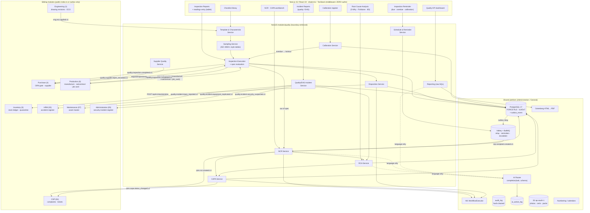

# IND-CORE Module 08 — Inspection and Quality Management

## Engineering Implementation Blueprint

**Product:** IND-CORE Manufacturing ERP — multi-tenant SaaS for Indian SMB/mid-market manufacturers
**Module:** 08 — Inspection & Quality (QMS) — inspection templates & characteristics → sampling & execution → disposition → NCR → RCA → CAPA → effectiveness; plus quality/EHS incidents, calibration register, supplier quality and quality KPIs
**Plan status:** V2 — MVP implementation blueprint, investor-demo quality, conformed to **DECISIONS-V2** · Date: 2026-07-21

This blueprint renders Module 08 in the suite's standard twenty-section engineering format so it reads identically to its siblings. Module 08 is a **V2 module conformed to DECISIONS-V2** (binding platform decisions) and shares the platform baseline with the rest of the suite — **General (Module 01)**, **HRM & Attendance (02)**, **Expenditure (03)**, **CSP (04)**, **Administration (05)**, **Integrations (06)** on the platform track, and **Engineering/PLM (1)**, **SMBD (2)**, **Planning/MRP (3)**, **Purchase (4)**, **Inventory/Stores (5)**, **Production (6)**, **Maintenance (07)** on the operations track. It consumes their published services (numbering, calendars, W1 workflow, hash-chained audit, notification, AI router, stock ledger) rather than re-implementing them, and it never keeps private copies of masters.

Two commitments are load-bearing and are stated up front because they constrain every later section:

1. **Module 08 is the system of record and the template authority for inspection.** Purchase's GRN gate and Production's QI hooks at Manufacture / subcontract receipt / job card **keep their gates**; Module 08 owns the *definition* (templates, characteristics, spec limits, sampling plans, checklists) and the *record* (readings, defects, disposition, evidence). The migration path from the shared `quality_inspections` doctype is specified explicitly in §1.2 and §9.9 — it is a consumption change, not a rewrite of the gates.
2. **Module 08 fulfils CSP's already-published contract byte-for-byte.** CSP.md §1.3 publishes `csp.complaint.created.v1` "Defect complaint handed off to QMS" and consumes `qms.ncr.created.v1` / `qms.capa.status_changed.v1`. Module 08 implements the consumer, creates the NCR, returns `ncr_ref`, and streams CAPA milestones back. The topic-name reconciliation is documented in §10.4 — the contract does not change; the consumer conforms to it.

Everything conforms to the binding platform decisions in **DECISIONS-V2** (§1 stack, §2 modular-monolith boundaries, §4 AI guardrails, §5 tenancy/RLS/outbox conventions, §7 demo universe): Next.js 15 / React 19 + shadcn/ui + Tailwind + TanStack Query/Table on the front end; a NestJS (Node 22/24 LTS) boundary-enforced modular monolith on the back; PostgreSQL 17 with **FORCE RLS** and UUIDv7 PKs; **Drizzle ORM v1**; Keycloak 26 OIDC; Valkey + BullMQ; Gotenberg for PDF; OpenTofu on AWS `ap-south-1`; and a provider-agnostic AI router. Demo universe unchanged: **Trishul Precision Components Pvt Ltd** (Pune-Chakan `27AABCT1234F1Z5`, Coimbatore `33AABCT1234F1Z9`), with **Kaveri ElectroFab Industries** as the second tenant for RLS leak probes. Fiscal year style **FY 2627**.

---

## 1. Module Overview

**Module 08 — Inspection & Quality (QMS)** is the quality system of record for the platform. It answers four questions no sibling module can answer on its own:

1. **What "good" means for this part** — the characteristic masters, spec limits and tolerances, the inspection template bound to a drawing revision, the sampling plan, and the reusable checklist library.
2. **What was actually measured** — the inspection record: who inspected, against which template version, with which gauge, what the readings were, which defects were found, and what evidence exists.
3. **What happens when it is not good** — disposition (accept / reject / rework / scrap / use-as-is under a concession / return-to-supplier / 100% sort), the NCR that formalises a non-conformance, the RCA that finds the cause, and the CAPA that fixes it and proves the fix held.
4. **Whether the measuring system itself can be trusted** — the calibration register for gauges and instruments, its due clock, its overdue lockout, and the back-trace when an instrument is found out of tolerance.

Around that spine sit three supporting capabilities: **scheduled inspections and reminders** (periodic audits, calibration due, recurring checks), **quality & EHS incidents** (defect escapes, near-misses, injuries, machine-safety events), and **quality reporting** (FPY, defect rate and Pareto, NCR ageing, CAPA on-time closure, cost of poor quality, supplier quality).

The customer's own navigation names five entries — **Inspection Reports**, **Inspection Reminder**, **Incident Reports**, **Checklist**, **Root Cause Analysis**. Those are the front doors. Behind them the module ships the machinery an ISO 9001-aligned manufacturer actually needs to make those five screens mean something: templates and characteristics, sampling plans, dispositions and concessions, NCR and CAPA lifecycles, the calibration register, supplier quality feedback, and a controlled-document shelf for QMS procedures.

### 1.1 Module boundary — touchpoints only, no private copies of masters

Sibling modules are consumed as **touchpoints only**, read through each module's public `index.ts` or subscribed via outbox events. Cross-module references (item, batch, serial, warehouse, supplier, customer, employee, work order, GRN, asset, drawing revision) are **logical references validated through owning-module services — no hard FK across module boundaries.** Audit, consent, AI action logging, workflow and outbox live in **platform tables** owned by Administration — Module 08 links to them, never duplicates them.

| Owning module | Owns | Module 08 consumes as | Module 08 gives back |
|---|---|---|---|
| **Engineering / PLM (1)** | Items, drawings, revisions, specs, ECO lifecycle | Drawing-revision reference on templates; characteristic nominal/tolerance sourced from the released drawing; `eng.eco.applied` triggers a template-review task | Quality is an ECO gate approver (`eng.eco.approve.quality`); FAI requirement on rev change |
| **SMBD (2)** | Customers, sales orders, dispatch, serials at customer | Customer reference on external NCRs; pre-dispatch inspection linkage to the sales order | `quality.inspection.completed.v1` for pre-dispatch clearance |
| **Purchase (4)** | Supplier master, PO, **GRN + the QC gate**, supplier OTD/rejection stats | Supplier logical reference; GRN line reference on incoming inspections | Inspection verdict releases the GRN gate; `quality.supplier.reject_recorded.v1` feeds Purchase's rejection %; SCARs |
| **Inventory / Stores (5)** | Warehouses (incl. `rejected`/quarantine and `scrap` types), batches, stock ledger, valuation | Batch/serial/warehouse logical references; quarantine state read for context | **Disposition drives an Inventory movement through `POST /api/v1/stock/entries` — Quality never writes the stock ledger** |
| **Production (6)** | Work orders, manufacture entries, subcontract receipts, job cards, rework orders | WO / manufacture-entry / job-card references on in-process and final inspections | Inspection verdict releases the produce gate; reject disposition triggers Production's rework-or-scrap decision; FPY numerator |
| **Maintenance / CMMS (07)** | Asset master, maintenance work orders, breakdown/PM | Logical `asset_ref` on a gauge that is also a maintainable asset; consumes `maintenance.mwo.safety_flagged.v1` | `quality.incident.equipment_implicated.v1` raises a maintenance request. **Reciprocal and agreed:** Module 07 defers calibration management to Module 08, and Module 08 owns the safety/EHS incident record, investigation and closure while Module 07 owns the machine's work order |
| **CSP (04)** | Tickets, complaints, warranty/AMC, portal | **`csp.complaint.created.v1`** — the defect complaint with full traceability payload | **`qms.ncr.created.v1`** (NCR raised, carries `ncr_ref`) and **`qms.capa.status_changed.v1`** (CAPA milestones streamed to the ticket timeline) |
| **HRM & Attendance (02)** | Employee master, grades, reporting hierarchy, **Factories Act registers** | Inspector/owner/approver employee references; shift context on an incident | `quality.incident.injury_reported.v1` — the minimum data set for HRM's statutory accident register; **Module 08 does not keep that register** |
| **Expenditure (03)** | Budgets, spend, cost centres | Cost-centre reference for COPQ attribution and external calibration spend | COPQ figures are reported here, posted nowhere — Accounts owns the ledger |
| **General (01)** | Companies/GSTINs, plants, UoM, fiscal calendar, naming series, holiday calendars | Number series (`INS-`, `NCR-`, `CAPA-`, `RCA-`, `QIN-`, `CAL-`), UoM on characteristics, business calendars for due-date math | Audit events |
| **Administration (05)** | Keycloak identity, RBAC/ABAC, **W1 workflow via `WorkflowExecutor`**, hash-chained `audit_log`, `ai_action_log`, `outbox_event`, AI governance, **the security/breach `incident` register** | All approvals, all authorization, all audit, all AI governance | `quality.incident.security_suspected.v1` — one-way referral when a quality incident turns out to have a personal-data or security dimension |
| **Integrations (06)** | External adapters, tenant webhooks | Outbound quality events bridged to customer/OEM endpoints (HMAC-signed) | Event payloads |

### 1.2 Boundary note 1 — QI ownership: the gates stay, the definition moves

This is the most important boundary in the module, and it is deliberately *not* a land grab.

**Today**, two modules ship an inline Quality Inspection doctype:

- **Purchase (Module 4, must-have M6)** — `quality_inspection` keyed to `grn_line_id`, with `qi_reading` rows (parameter, spec_min, spec_max, reading, passed) and a verdict split (`verdict_accepted_qty` / `verdict_rejected_qty`). FR-PUR-034 makes it a **hard gate**: if `item.inspection_required`, the GRN cannot be submitted until a linked QI is completed, and the verdict pre-fills the accepted/rejected split (V-PUR-07, TC-GRN-03).
- **Production (Module 6, must-have M9)** — `quality_inspections` polymorphic on `ref_type ∈ {grn, manufacture, subcontract_receipt, job_card}` + `ref_id`, with `readings JSONB`, `qi_templates`, `UNIQUE(ref_type, ref_id)` preventing double gates, and a partial index on `result = 'pending'`. FR-PRD-076 holds FG in quarantine until the QI resolves; FR-PRD-077 makes QI results the **FPY numerator**.

**The rule Module 08 adopts:** *the transactional gate belongs to the module that owns the transaction; the inspection definition and the inspection record belong to Quality.*

| Concern | Owner after Module 08 lands | Why |
|---|---|---|
| "Can this GRN submit?" / "Can this FG leave quarantine?" | **Purchase / Production** (unchanged) | The gate is a property of the receiving/producing transaction. Moving it would break V-PUR-07, V-PRD-10 and their test cases for no benefit. |
| Template, characteristics, spec limits, tolerances, defect classes, sampling plan, checklist | **Module 08** | One vocabulary, one revision-controlled definition, one place where a drawing-revision change forces a template review. |
| The inspection record: readings, gauge used, defects, evidence, inspector, disposition | **Module 08** | ISO 9001 clause 7.5 record control, calibration back-trace, and FPY/Pareto all need one table. |
| Disposition beyond accept/reject (rework, scrap, concession, RTS, 100% sort) | **Module 08** | Purchase/Production only ever modelled a two-way verdict. |
| NCR, RCA, CAPA, concessions, SCARs | **Module 08** | No sibling has them. |
| The resulting stock movement | **Inventory (5)** | Segregation is always a ledger transaction, never an edit (INVENTORY §1, FR-INV-022). |

**Consumption path (explicit, so nothing churns):**

1. Module 08 ships `qms_inspection` + `qms_inspection_reading` + `qms_inspection_defect` as the record of truth, and `qms_inspection_template` / `qms_characteristic` / `qms_sampling_plan` / `qms_checklist` as the definition.
2. Purchase and Production **stop writing** `quality_inspection` / `quality_inspections` directly and instead call the module's public interface:
   `QualityModule.requestInspection({ ref_type, ref_id, item_id, batch_ref, lot_qty, plant_id, trigger })` → returns `{ inspection_id, inspection_no, status }`.
   Their gate check becomes `QualityModule.gateStatus(ref_type, ref_id)` → `{ required, state: 'none' | 'pending' | 'in_progress' | 'completed', result, qty_accepted, qty_rejected }`.
3. For zero-churn during the transition, Module 08 ships a **read-only compatibility view** named `quality_inspections` projecting `(ref_type, ref_id, item_id, batch_id, template_id, sample_size, readings, result, inspector, inspected_at)` off `qms_inspection` + `qms_inspection_reading`, preserving the `UNIQUE(ref_type, ref_id)` semantics as a unique index on the base table. Existing Purchase/Production gate queries keep compiling; writes are redirected at the service layer, not the SQL layer. The view is dropped when both modules' adapters are cut over (tracked as a build-phase acceptance criterion, §17.2).
4. `ref_type` gains the values Module 08 needs beyond the original four: `standalone`, `pre_dispatch`, `customer_return`, `first_article`, `layered_audit`, `gauge_verification`. The original four are preserved unchanged so the existing gates never see a new enum value they don't understand.
5. `item.inspection_required` stays where it is — an **item purchase/production flag** owned by Purchase (FR-PUR-003) and read by both gates. Module 08 adds `inspection_plan_id` resolution on top: given `(item, ref_type, supplier?, customer?)`, which template applies. The flag says *whether*; Module 08 says *what*.

### 1.3 Boundary note 2 — "Incident Reports" means quality & EHS here, never security

"Incident" is overloaded across the suite, and getting this wrong would put a shop-floor near-miss into a CERT-In reporting queue. The disambiguation is normative:

| Register | Owner | Table | Scope | Clock |
|---|---|---|---|---|
| **Security / breach incident** | **Administration (05)** | `incident` (ADMINISTRATION.md §9.6) | The 20 CERT-In-reportable categories; personal-data breach; unauthorised access; ransomware | **CERT-In 6-hour** reporting live now; DPDP Board immediate + 72-hour armed for May 2027 |
| **Quality & EHS incident** | **Module 08** | **`quality_incident`** | Defect escape to customer or next process, near-miss, injury, property damage, environmental release, dangerous occurrence, machine-safety event | Internal SLA by severity; statutory injury reporting is **HRM's** obligation, surfaced here as a banner and a hand-off |

Three rules follow, and they are enforced in code and in CI:

- **Module 08 never writes to `incident`.** A dependency-cruiser rule forbids the import; a CI grep forbids the table name in `modules/quality`.
- **The Module 08 table is named `quality_incident` — spelled out, not prefixed `qms_` like its siblings.** That is deliberate: every other Module 08 table carries the `qms_` prefix, and this one carries `quality_` precisely so that no reader, query, or migration ever mistakes it for Administration's `incident`.
- **When a quality/EHS incident develops a security or personal-data dimension** — say, an injury investigation that pulls medical records, or a defect escape traced to a tampered inspection record — Module 08 emits `quality.incident.security_suspected.v1` as a **one-way referral**. Administration opens its own incident, owns the CERT-In/DPDP clocks, and Module 08 shows a read-only cross-link. Module 08 never starts, stops, or reports on a statutory security clock.

**And the third register:** a workplace-injury `quality_incident` also touches **HRM (02)**, which owns the Factories Act accident register and the statutory notice (§88 of the Factories Act, 1948 requires the factory manager to notify the prescribed authority of accidents causing death or preventing the injured person from working for 48 hours or more — [Section 88](https://indiankanoon.org/doc/384202/); the prescribed form is generally Form 18 with state-specific rules — [Delhi Labour Department Form 18](https://labour.delhi.gov.in/it/form-no18)). Module 08 owns the **investigation** (RCA + CAPA + evidence) and emits `quality.incident.injury_reported.v1` carrying the minimum data set HRM's register needs. It does **not** absorb that register, does not generate Form 18, and does not run the statutory notice clock — it displays a non-authoritative "statutory notification may apply — HRM owns filing" banner with the incident's lost-time flag. HRM's safety/EHS tables (`safety_incident`, `ppe_issue`) are post-MVP in HRM's own plan; until they land, Module 08's hand-off event queues and the banner is the honest state of the integration. *(Exact notice deadlines are state-rule dependent — see §5 NFR-14 and Appendix B; treated as `[needs verification]`.)*

Similarly, when a `quality_incident` implicates equipment, Module 08 emits `quality.incident.equipment_implicated.v1` so **Maintenance (07)** raises a maintenance/breakdown request against its asset. Module 08 does not own equipment condition, PM schedules, or breakdown history.

### 1.4 Boundary note 3 — rejected stock is Inventory's, always

A reject / scrap / return-to-supplier disposition does **not** move stock by writing rows. It calls Inventory's single write path:

```
POST /api/v1/stock/entries        { purpose: "transfer", ... }
POST /api/v1/stock/entries/{id}/submit
```

…targeting a `rejected`-type (quarantine) or `scrap`-type warehouse, exactly as Purchase's GRN does today (INVENTORY FR-INV-022; V-INV-12). The returned `se_no` is stored on `qms_disposition.inventory_movement_ref` and is the audit link. If the Inventory call fails, the disposition stays `pending_movement` and is retried — **the disposition is never marked executed without a submitted stock entry**. Quality has no `INSERT` grant on any Inventory table; the RLS leak-probe harness asserts it.

### 1.5 Business problem

Trishul Precision Components machines shafts, bearing housings and flange couplings for OEM customers who audit their suppliers. Quality is simultaneously their contractual obligation, their margin leak, and their least-instrumented process:

1. **Inspection lives on paper and dies in a file.** Readings are written on a printed format at the receiving bay and on the machine, filed in a lever-arch folder, and never aggregated. FPY is a guess. Nobody can answer "how many bore-diameter rejections did we have on TPC-BRG-HSG-004 last quarter, and on which supplier's castings?" without a two-day file hunt.
2. **Sampling is arbitrary.** "Check 5 pieces" is the rule regardless of lot size, characteristic criticality, or supplier history. There is no defensible link between lot size and sample size, so an OEM auditor's first question — "what sampling standard do you apply?" — has no good answer. ISO 2859-1 / ANSI-ASQ Z1.4 style AQL schemes map lot size and inspection level to a sample-size code letter and then to sample size with accept/reject numbers; that is a table lookup a system should own, not a supervisor's habit ([ISO 2859-1](https://www.iso.org/standard/1141.html); [inspection levels explained](https://qualityinspection.org/inspection-level/)).
3. **Non-conformance has no lifecycle.** A rejection is a red entry in a register. There is no containment record, no owner, no due date, no root cause, no corrective action, and no proof the action worked. ISO 9001:2015 clause 8.7 requires nonconforming outputs to be identified and controlled with a defined set of actions (correction, segregation/containment, informing the customer, or acceptance under concession with authorisation), and clause 10.2 requires the cause to be determined and the effectiveness of corrective action reviewed ([clause 8.7](https://www.isms.online/iso-9001/clause-8-7-control-of-nonconforming-outputs/); [8.7 and 10.2 together](https://qms-certification.com/8-7-control-of-non-conforming-outputs-and-10-2-non-conformity-and-corrective-action-iso-9001/)). A register cannot satisfy either.
4. **The same defect ships twice.** A field failure at BlueOrbit becomes a phone call, a replacement, and an apology — and never becomes a corrective action, so the next lot repeats it. CSP already captures the complaint; without a QMS consumer, the loop stays open by construction.
5. **Gauges drift silently.** Micrometers and bore gauges are calibrated "when someone remembers". ISO 9001 clause 7.1.5.2 requires measuring equipment to be calibrated or verified at specified intervals against traceable standards, identified so its status is determinable, safeguarded, and — critically — requires the organisation to **determine whether previous measurement results were adversely affected** when equipment is found unfit ([clause 7.1.5.2](https://blog.auditortrainingonline.com/blog/iso-9001-7-1-5-2-measurement-traceability)). Nobody can do that back-trace from a paper file. ISO 10012 frames the same idea as metrological confirmation — calibration plus verification plus fitness-for-intended-use, documented ([ISO 10012:2003](https://www.iso.org/standard/26033.html)).
6. **Supplier quality is invisible.** Purchase computes a rejection percentage from GRN quantities. That is a useful number and Module 08 does not duplicate it — but it cannot tell you *which defect*, *which characteristic*, *which of the supplier's lots*, or whether the supplier ever responded to a corrective-action request.
7. **Safety incidents are told, not recorded.** Near-misses are mentioned in the shift handover and forgotten. When an injury does occur, the statutory notice becomes an emergency because there is no investigation discipline behind it.
8. **The cost is unmeasured.** Scrap, rework hours, sorting labour, freight on returns and concession give-backs are absorbed into "manufacturing overhead". Cost of poor quality is never a number on a screen, so quality improvement never gets a budget.

Module 08 closes this with revision-controlled templates and characteristics, defensible sampling, a disposition that always produces a real stock movement, an NCR → RCA → CAPA loop with an effectiveness gate, a calibration register that locks out overdue gauges and back-traces affected inspections, and quality KPIs computed deterministically from the records that already exist.

### 1.6 System context



### 1.7 What this module deliberately is not

It is not an SPC package, an APQP/PPAP document system, an audit-management suite, or a customer 8D portal. Each of those is named in §17.5 (Anti-goals) and §18 (Roadmap) with an adoption trigger. The MVP boundary is: **make every inspection defensible, every non-conformance closable, and every gauge trustworthy** — and prove it on the Trishul demo tenant.

---

## 2. Objectives

### 2.1 Product objectives (MVP, investor-demo quality — ~9 weeks)

1. **Definition layer that survives an OEM audit.** Characteristic masters with nominal/USL/LSL/tolerance and a criticality class (critical / major / minor), inspection templates versioned and bound to a drawing revision, a reusable checklist library, and sampling plans (ISO 2859-1-style AQL tables, fixed-n, percentage, 100%, and c=0) — all revision-controlled, all approved through W1, all effective-dated.
2. **Inspection execution on the surface where inspection happens.** A tablet-first readings screen with per-characteristic pass/fail evaluated live against spec limits, gauge selection with a hard **calibration-validity check**, defect coding with photo evidence, and a mandatory disposition. Incoming, in-process, final, pre-dispatch, first-article, subcontract-receipt and customer-return types all use the same record.
3. **Disposition that actually moves material.** Accept / reject / rework / scrap / use-as-is under concession / return-to-supplier / 100% sort — each with the approval level it deserves via W1, and each producing an Inventory stock entry through Inventory's public interface, or explicitly none for `accept`.
4. **The full non-conformance loop.** NCR (with containment and its own clock) → RCA (5-Why, Fishbone/6M, or 8D) → CAPA (action plan, owners, due dates, implementation evidence) → **effectiveness check** scheduled after a defined observation window, with a CAPA that cannot close until effectiveness passes or is explicitly failed and re-opened.
5. **Fulfil CSP's contract end to end.** Consume `csp.complaint.created.v1`, create the NCR idempotently, emit `qms.ncr.created.v1` with `ncr_ref`, and stream CAPA milestones as `qms.capa.status_changed.v1` — so a BlueOrbit ticket timeline shows "Under investigation by Quality" and then a real CAPA percentage, with no CSP change whatsoever.
6. **Quality & EHS incidents with hand-offs, not absorption.** Near-miss, injury, defect escape, property damage, environmental and dangerous-occurrence classes; investigation via the same RCA/CAPA machinery; explicit one-way hand-offs to HRM (accident register), Maintenance (equipment) and Administration (security).
7. **Calibration register with teeth.** Gauge master, calibration frequency, due computation, an **overdue lockout** that blocks the gauge from being selected on a new inspection, and an out-of-tolerance **back-trace** listing every inspection that used the gauge since its last good calibration — the ISO 9001 7.1.5.2 obligation made operable.
8. **Scheduled inspections and reminders.** Periodic layered audits, recurring checks, calibration due, and ECO-triggered first-article requirements, generated by a BullMQ repeatable job with escalation on overdue.
9. **Supplier quality feedback that complements Purchase, not duplicates it.** Defect-coded PPM by supplier and lot, SCAR issue/response/closure discipline, and an event back to Purchase so its supplier card's rejection percentage stays the single number of record.
10. **Quality KPIs computed deterministically.** FPY, defect rate and Pareto, NCR ageing, CAPA on-time closure, calibration compliance, and cost of poor quality — every tile drilling to the rows that produced it, every rate from effective-dated COPQ config rather than a constant in code.

### 2.2 Engineering objectives

- **The gate contract is a port, not a copy.** `requestInspection` / `gateStatus` are the only two surfaces Purchase and Production use; both are contract-tested against a fake and the real service from week 2, and the `quality_inspections` compatibility view is deleted only when both adapters are green.
- **Spec evaluation is deterministic, total, and unit-tested to the boundary.** A reading exactly on USL is in-spec (`≤`), a reading with fewer significant digits than the characteristic's precision is rounded per the characteristic's stated rule, and a missing mandatory reading blocks completion. No characteristic is ever evaluated by an LLM.
- **The NCR → CAPA → RCA state machines execute only through W1** behind `WorkflowExecutor`. There are no direct status writes anywhere in the module; every transition appends to the hash-chained audit.
- **Records are immutable once completed.** A completed inspection, a closed NCR and a closed CAPA are terminal: corrections are new documents with supersession links, never edits. This is the ISO 9001 record-control property and the MCA audit-trail property at the same time.
- **Idempotency everywhere the module is event-driven.** The CSP complaint consumer, the GRN/manufacture inspection auto-creation, the reminder generator and the disposition→stock-entry call are all keyed and replay-safe.
- **Boundary-enforced modular monolith.** `modules/quality` exposes cross-module functionality only through its public `index.ts` or outbox events; dependency-cruiser gates CI from sprint 1, including the rule that forbids importing Administration's `incident` model.
- **Numbers deterministic, language optional.** Every KPI, every PPM, every Pareto rank and every sampling decision is SQL. The AI router only ever writes prose over a numeric pack it did not compute.

### 2.3 Non-goals for MVP

SPC control charts with live Cp/Cpk capability studies and rule-based out-of-control alarms; MSA / Gage R&R studies; full APQP/PPAP packs (PSW, control plans as first-class documents, submission levels); an audit-management suite (audit programme, auditor competency, finding-to-CAR automation across audit types); a customer-facing 8D portal; destructive/lab test management with instrument integration; certificate-of-analysis generation; supplier portals for SCAR response. Each is carried into §17.5 and §18 with an adoption trigger.

### 2.4 Demo success criteria

An investor watches an inspector at the receiving bay open INS-2627-00218 on a tablet, sees the sampling plan resolve *automatically* from lot size 200 at AQL 1.0 Level II to a sample of 32 with Ac 1 / Re 2, enters readings that trip a spec limit live, watches the accept/reject decision compute itself, sees the reject disposition post a real quarantine movement in Inventory, sees NCR-2627-0041 raised with a containment clock — and then watches the same machinery run from the other direction: a BlueOrbit complaint arriving from CSP as NCR-2627-0044, a 5-Why RCA whose candidate causes were *drafted* from defect history and *chosen* by a human, a CAPA at 60% streaming its percentage back onto the CSP ticket timeline, and an overdue micrometer that refuses to be selected and shows exactly which 14 inspections need re-verification.

---

## 3. User Personas

All personas act within the demo universe — **Trishul Precision Components Pvt Ltd** (Pune-Chakan and Coimbatore), with **Kaveri ElectroFab Industries** as the second tenant used only for RLS leak probes. Permissions follow the platform RBAC + ABAC engine: a role grants actions, JSONB scope conditions constrain them (own-plant, own-work-centre, own-supplier-portfolio, approval bands for disposition value). **AI calls always execute under the calling user's JWT** (binding guardrail, DECISIONS-V2 §4).

| Persona | Demo actor | Primary use in this module |
|---|---|---|
| **Quality Inspector** | **Nilesh Bhosale** (Pune-Chakan, incoming + in-process), **Ranjith Kumar** (Coimbatore, in-process + final) | Execute inspections on a tablet; enter readings; pick gauges; code defects with photos; propose disposition |
| **QA Manager** | **Aparna Joshi** (Trishul QA head, Pune) | Own templates and characteristics; approve dispositions and concessions; run the NCR → CAPA → RCA loop; sign effectiveness checks; own the KPI dashboard |
| **Production Supervisor** | **Santosh Gaikwad** (Pune machining), **M. Thangaraj** (Coimbatore shift) | Consume the gate: see what is held in quarantine, trigger in-process checks, act on rework dispositions, watch FPY on his cell |
| **Stores / Receiving In-charge** | **Poonam Salunkhe** (Pune-Chakan stores) | See incoming inspections due against received GRNs; execute the quarantine/return movements the disposition instructs; chase ageing quarantine |
| **Supplier Quality Engineer** | **Vivek Ranade** | Supplier defect Pareto and PPM; raise and chase SCARs; incoming-inspection severity switching (normal/tightened/reduced) by supplier history |
| **EHS Officer** | **Farhan Qureshi** (Safety Officer, both plants) | Log and investigate near-misses, injuries, environmental and machine-safety incidents; drive EHS CAPAs; own the safety-walkthrough checklists |
| **Plant Head** | **Rajesh Kulkarni** | Approve high-value dispositions and concessions; review NCR ageing and CAPA on-time closure; own COPQ |
| **Calibration Coordinator** | **Poonam Salunkhe** (dual-hatted; typical for SMB) | Gauge register, calibration schedule, external agency certificates, overdue escalation, out-of-tolerance back-trace |
| **CSP Service Manager** (touchpoint) | CSP module | Raises the complaint; reads NCR/CAPA status on the ticket timeline; never operates Module 08 |
| **Auditor / Customer Auditor** | read-only role | Trace any inspection to its template version, gauge calibration certificate, disposition approval, NCR, RCA and CAPA evidence; export the audit pack |
| **System Admin** | IT role | W1 ladders for disposition/NCR/CAPA, defect-code catalogue, COPQ rate config, per-tenant AI opt-out and token budget |

### 3.1 Persona goals, pain points & primary screens

- **Quality Inspector — Nilesh, Ranjith.** *Goals:* finish an inspection at the bay or the machine without walking to a desk; be told the sample size rather than guessing it; never be blamed for a reading taken with a bad gauge. *Pain points:* paper formats, illegible readings, "check 5 pieces" for every lot, gauges whose calibration status is unknown until an auditor asks. *Primary screens:* Inspection Reports list (§7.1), Inspection Execution / readings (§7.2), My Due Inspections (§7.4).
- **QA Manager — Aparna Joshi.** *Goals:* one place where every non-conformance has an owner and a due date; proof that a corrective action worked; a defensible answer to "show me your control of nonconforming output". *Pain points:* NCRs that are red rows in a register, CAPAs that close because someone got tired, no way to see repeat defects. *Primary screens:* NCR Workbench (§7.6), CAPA Workbench (§7.7), RCA workspace (§7.8), Templates & Characteristics (§7.9), Quality KPI Dashboard (§7.12).
- **Production Supervisor — Santosh, Thangaraj.** *Goals:* know instantly what is held and why; get rework instructions that are specific; see FPY for his own cell. *Pain points:* FG sitting in quarantine with no visible owner; rework decided verbally; scrap discovered at month-end. *Primary screens:* Inspection Reports filtered to his work centres, quarantine/held view, Rework disposition detail, KPI dashboard (cell view).
- **Stores / Receiving — Poonam Salunkhe.** *Goals:* clear the receiving bay; know which lots are waiting on QC; execute the movement the disposition dictates without ambiguity. *Pain points:* quarantine ageing invisibly, no link between the QC verdict and the physical move. *Primary screens:* Inspection Reminder / due list (§7.4), Disposition detail (§7.5), Calibration Register (§7.10).
- **Supplier Quality Engineer — Vivek Ranade.** *Goals:* walk into a supplier review with defect-level evidence, not just a rejection percentage; make SCARs get answered. *Pain points:* rejection % without cause codes; corrective-action requests sent by email and never chased. *Primary screens:* Supplier Quality (§7.11), NCR Workbench filtered to `source_type=supplier`, defect Pareto.
- **EHS Officer — Farhan Qureshi.** *Goals:* every near-miss recorded within the shift; injuries investigated properly and handed to HR cleanly; safety walkthroughs run from a checklist, not memory. *Pain points:* near-misses told and forgotten; statutory notice becoming a panic; no link between an incident and a fix. *Primary screens:* Incident Reports (§7.3), Checklist library (§7.9b), RCA workspace (§7.8), CAPA Workbench (§7.7).
- **Plant Head — Rajesh Kulkarni.** *Goals:* approve the expensive decisions with context; see whether quality is trending; know what poor quality costs. *Primary screens:* Approval inbox (Administration's W1 surface), KPI Dashboard (§7.12), NCR ageing.
- **Calibration Coordinator — Poonam (dual-hatted).** *Goals:* nothing overdue; certificates filed against the gauge; a clean answer when a gauge comes back out of tolerance. *Primary screens:* Calibration Register (§7.10), Inspection Reminder (§7.4).
- **Auditor.** *Goals:* pick any part, walk backwards to its inspection, its template version, its gauge certificate, its disposition approval, and its NCR/CAPA — in one session, exportable. *Primary screens:* every document's Audit-trail tab; Traceability drawer; Gotenberg audit pack.
- **System Admin.** *Goals:* configure W1 ladders, defect catalogues, COPQ rates, and AI governance without a release. *Primary screens:* Settings (§7.13).

**DPDP note:** injury and medical-treatment fields on `quality_incident` are **personal data of an identifiable data principal**. They are field-masked by default, purpose-limited by ABAC to the EHS officer / HR hand-off role / plant head, access-logged, and **never sent to any AI provider** (§13.4, §14.4). The product's compliance phrasing is, as everywhere in the suite, **"DPDP-ready, aligned to DPDP Rules 2025 phase-in (May 2027)"** — never "DPDP compliant".

---

## 4. Functional Requirements

Priorities: **M** = MVP, **S** = should-have (ships if capacity), **P** = post-MVP. Requirements are numbered **FR-QMS-xxx** and grouped in lettered sub-areas. Every lifecycle transition in §4.D–§4.G executes exclusively through the platform **W1 engine behind the `WorkflowExecutor` port** — there is no approval logic in module code.

### 4.A Templates, characteristics & checklists

- **FR-QMS-001 (M):** **Characteristic master.** Code, name, item reference (optional — a characteristic may be item-specific or generic), `char_type` (`variable` | `attribute`), UoM (from General), nominal/target, USL, LSL, symmetric or asymmetric tolerance (`tol_plus`, `tol_minus`), decimal precision and rounding rule, `defect_class` (`critical` | `major` | `minor`), gauge-type hint, and `spec_source` (free text or a logical reference to an Engineering drawing revision). Effective-dated: a spec change is a new row with `effective_from`, never an update.
- **FR-QMS-002 (M):** **Inspection template.** Header: code, name, `inspection_type` (`incoming` | `in_process` | `final` | `pre_dispatch` | `first_article` | `subcontract_receipt` | `customer_return` | `layered_audit`), item or item-group scope, optional supplier/customer scope, drawing-revision reference, default sampling plan, `version_no`, `status` (`draft` → `under_review` → `active` → `superseded` → `obsolete`), `effective_from`, approver. Lines: ordered characteristics with per-template spec overrides, mandatory flag, per-characteristic sample rule, required gauge type, and defect class.
- **FR-QMS-003 (M):** **Template versioning is immutable.** An `active` template is never edited. "Revise" clones to a new `version_no` in `draft`; activation supersedes the prior version and sets its `effective_to`. **Every completed inspection stores the template id *and* the version number it ran against** — so an audit two years later reproduces exactly what was checked.
- **FR-QMS-004 (M):** **Template resolution.** Given `(item, inspection_type, supplier?, customer?, as_of_date)`, the resolver returns exactly one active template by specificity: item+supplier > item > item-group+supplier > item-group > type-default. Ambiguity (two equally specific active templates) is a hard configuration error surfaced at activation, not at inspection time.
- **FR-QMS-005 (M):** **Checklist library** — reusable, versioned checklists with `purpose` (`inspection` | `internal_audit` | `layered_process_audit` | `ehs_walkthrough` | `calibration_verification` | `5s`), items with `response_type` (`boolean` | `enum` | `numeric` | `text` | `photo`), expected value, criticality, and guidance markdown. A checklist can be attached to an inspection template (as a qualitative section), to a scheduled audit, or to an EHS walkthrough. **This is the "Checklist" nav entry.**
- **FR-QMS-006 (M):** **Defect-code catalogue.** Code, name, `category` (`dimensional` | `visual_surface` | `material` | `process` | `assembly` | `documentation` | `packaging` | `functional`), severity class, default disposition hint, and an `is_active` flag. Defect codes are the join key for every Pareto in §4.J — free-text defect descriptions are captured as a remark, never as the analysable field.
- **FR-QMS-007 (S):** **QMS controlled documents.** A modest document shelf for quality *procedures, work instructions and formats*: doc number, title, type, revision, status (`draft` → `under_review` → `approved` → `issued` → `superseded` → `withdrawn`), effective-from, review-due date, owner, approver, distribution list, file attachment, supersession link, and per-employee acknowledgement. **Boundary: Engineering (Module 1) owns drawings, specifications and the ECO lifecycle. Module 08 owns QMS procedure documents only.** Full DMS (check-in/check-out, watermarked controlled copies, training-matrix linkage) is deferred (§18).
- **FR-QMS-008 (S):** **ECO-triggered template review.** On `eng.eco.applied.v1`, every active template whose drawing-revision reference is affected is flagged `review_required`, a review task is created for the template owner, and a **first-article inspection** requirement is raised against the first work order on the new revision.
- **FR-QMS-009 (P):** Characteristic import from a drawing/ballooned PDF; control-plan documents as first-class objects; measurement-system (Gage R&R) linkage per characteristic.

### 4.B Inspection execution & sampling

- **FR-QMS-020 (M):** **Sampling-plan master.** `standard` ∈ `iso_2859_1_style` | `fixed_n` | `percentage` | `hundred_percent` | `c_equals_zero`; for the AQL style: inspection level (S-1…S-4, I, II, III), AQL value, severity (`normal` | `tightened` | `reduced`), and a JSONB table mapping lot-size bands → sample-size code letter → sample size → accept (Ac) / reject (Re) numbers. The seeded table follows the ISO 2859-1 / ANSI-ASQ Z1.4 single-sampling structure for normal inspection ([ISO 2859-1](https://www.iso.org/standard/1141.html); [levels](https://qualityinspection.org/inspection-level/)). **The table is seeded configuration, not code** — a tenant can load its customer's mandated plan.
- **FR-QMS-021 (M):** **Sample-size resolution is automatic and explained.** Given `(sampling_plan, lot_qty, severity)` the service returns `{ code_letter, sample_size, accept_number, reject_number, rationale }` and the rationale string is rendered on the inspection screen ("Lot 200 · Level II · AQL 1.0 · normal → code letter G → n=32, Ac=1, Re=2"). No inspector ever types a sample size for an AQL plan; for `fixed_n` and `percentage` plans the computed value is shown and may be increased (never decreased) with a logged reason.
- **FR-QMS-022 (M):** **Severity switching.** Normal → tightened after a configured count of consecutive rejected lots from the same supplier+item; tightened → normal after a configured count of consecutive accepted lots; reduced requires explicit QA-manager grant. Switching is computed deterministically from `qms_supplier_quality_event` history, proposed to the supplier-quality engineer, and applied on acceptance — never silently.
- **FR-QMS-023 (M):** **Inspection record.** Header: number (`INS-2627-#####`), template + version, type, `ref_type`/`ref_id` (`grn` | `manufacture` | `subcontract_receipt` | `job_card` | `standalone` | `pre_dispatch` | `customer_return` | `first_article` | `layered_audit` | `gauge_verification`), item, batch/lot/serial references (logical → Inventory), lot quantity, plant, work centre, inspector, sampling plan + resolved sample size, start/complete timestamps, result, quantity split, status. Lines: one reading row per (characteristic × sample number).
- **FR-QMS-024 (M):** **Readings entry, tablet-first.** Numeric keypad, per-characteristic live pass/fail against the resolved spec limits, running defect count against Ac/Re, characteristic-by-characteristic or piece-by-piece entry modes, attribute characteristics as pass/fail chips, photo capture per defect. Autosave every reading; the screen survives a lost connection by queueing locally and reconciling on reconnect (last-write-wins per reading cell, with a conflict banner if the server value changed).
- **FR-QMS-025 (M):** **Gauge selection with calibration validity check.** A reading for a characteristic requiring a gauge type must name a gauge from the register. **A gauge whose `next_due_on` is past is not selectable** (`CALIBRATION_OVERDUE`, hard block). A gauge due within the configured warning window is selectable with an amber warning. The gauge id is stored on the reading — this is what makes the back-trace of FR-QMS-084 possible.
- **FR-QMS-026 (M):** **Automatic evaluation and verdict proposal.** Each reading is evaluated `LSL ≤ x ≤ USL` (inclusive) at the characteristic's precision. Defect counts roll up by defect class. The verdict engine proposes `accepted` / `rejected` per §11.4 rules (Ac/Re for AQL plans; any-critical-defect → reject regardless of Ac; configurable major/minor weighting). **The proposal is always shown with its arithmetic; a human confirms.** Overriding a proposed reject to accept is only possible through the concession path (FR-QMS-041), never by editing the verdict.
- **FR-QMS-027 (M):** **Completion is terminal.** On complete, the record locks: readings, verdict, quantities, gauge references and evidence become immutable; a correction is a **new inspection** with `supersedes_inspection_id` and a mandatory reason, and the superseded record stays visible. `quality.inspection.completed.v1` is written to the outbox in the same transaction.
- **FR-QMS-028 (M):** **The gate interface.** `requestInspection()` and `gateStatus()` (§1.2) are the module's only inspection-facing public surface. Auto-creation: on `purchase.grn.submitted.v1` for `inspection_required` items, and on Production's manufacture / subcontract-receipt / job-card triggers, a `pending` inspection is created idempotently keyed on `(tenant, ref_type, ref_id)`.
- **FR-QMS-029 (M):** **Partial and re-inspection.** A rejected lot that is sorted or reworked is re-inspected as a linked inspection (`parent_inspection_id`, `attempt_no`). **FPY counts only `attempt_no = 1` acceptances** — reworked units are excluded from the numerator by definition, matching Production's FR-PRD-077 intent.
- **FR-QMS-030 (S):** **First-article inspection (FAI).** A template flavour requiring 100% of characteristics on a defined number of first pieces, with a mandatory QA-manager sign-off before the work order may continue. Triggered by ECO application (FR-QMS-008), new supplier, or new tooling.
- **FR-QMS-031 (P):** Direct gauge/CMM data capture; barcode/QR piece identification; multi-inspector parallel entry on one lot.

### 4.C Dispositions & concessions

- **FR-QMS-040 (M):** **Disposition is mandatory** on any inspection whose result is not a clean `accepted`, and on every NCR. Types: `accept`, `accept_with_concession`, `rework`, `sort_100pct`, `regrade`, `return_to_supplier`, `scrap`, `hold_pending_decision`. Each carries quantity, reason (defect-code linked), target warehouse where applicable, cost estimate, and the W1 approval band it triggers.
- **FR-QMS-041 (M):** **Concession / deviation permit.** `accept_with_concession` requires a concession record: the characteristic(s) deviating and by how much, the quantity and validity window, the internal approver (band by value and defect class), and — for a customer-visible characteristic — a recorded **customer approval reference** (document number, date, contact). A concession on a `critical` characteristic is blocked without a customer approval reference. This is the ISO 9001 8.7 "acceptance under concession" branch, made auditable rather than verbal.
- **FR-QMS-042 (M):** **Every non-accept disposition produces a stock movement through Inventory** (§1.4): `reject`/`return_to_supplier` → `rejected`-type quarantine warehouse; `scrap` → `scrap` warehouse at scrap value; `rework` → the rework/WIP warehouse Production nominates; `sort_100pct` → stays in quarantine until the sort inspection completes. `accept` and `accept_with_concession` produce no Quality-initiated movement — the owning transaction (GRN submit, manufacture entry) posts as it always did.
- **FR-QMS-043 (M):** **Approval bands via W1.** Disposition approval ladders are configured per tenant on `(disposition_type, defect_class, estimated_value)`. Seeded for Trishul: inspector proposes; QA manager approves rework/sort and reject up to a value band; plant head approves scrap and concession above a band; concession on a critical characteristic additionally requires the customer approval reference to be present before the ladder starts.
- **FR-QMS-044 (M):** **Disposition execution is two-phase and idempotent.** `decided` (approved, movement not yet posted) → `pending_movement` → `executed` (Inventory `se_no` recorded) or `movement_failed` (retried, alerted). A disposition is never `executed` without a submitted stock entry.
- **FR-QMS-045 (S):** Rework instructions as a structured field with a link to the Production rework order created from it; scrap value defaulted from the item's scrap rate.
- **FR-QMS-046 (P):** Multi-line partial dispositions (different dispositions for different sub-lots within one inspection beyond the accept/reject split).

### 4.D NCR — non-conformance report

- **FR-QMS-050 (M):** **NCR sources.** `inspection` (auto-proposed on a reject), `customer_complaint` (**from CSP**, §4.D.1), `internal_audit`, `supplier`, `incident`, `process`, `manual`. Every NCR carries `source_type` + `source_ref_type`/`source_ref_id`, and for CSP-originated NCRs the `source_complaint_no` and `source_ticket_no` verbatim.
- **FR-QMS-051 (M):** **NCR content.** Number (`NCR-2627-####`), title, description, item/batch/serial, supplier or customer reference, quantity affected and quantity suspect, defect code(s), severity, detection point (`incoming` | `in_process` | `final` | `customer` | `field`), owner, raised-by, raised-at, target closure date, linked disposition, linked RCA, linked CAPA, and a COPQ estimate.
- **FR-QMS-052 (M):** **Containment is a first-class, clocked step.** On raise, a containment action is required within a severity-driven SLA (seeded: critical 4 business hours, major 24, minor 72). Containment records what was done (100% sort, stop-ship, quarantine of stock at N locations, customer notification) and its completion time. **An NCR cannot leave `containment` until a containment action is recorded** — this is the ISO 9001 8.7 segregation/containment obligation, enforced.
- **FR-QMS-053 (M):** **NCR state machine** (W1): `open` → `containment` → `investigation` → `disposition` → `corrective_action` → `verification` → `closed`; plus `cancelled` (with reason, from any pre-`corrective_action` state). Regression is allowed only backwards from `verification` to `investigation` with a reason.
- **FR-QMS-054 (M):** **Closure preconditions (hard).** An NCR closes only when: (a) disposition is `executed` (or explicitly `accept`), (b) if severity ≥ major, an RCA exists in state `verified`, (c) a linked CAPA is in `closed` or `effectiveness_check` **and** the closing user holds `qms.ncr.close_before_capa` if it is the latter, (d) all containment actions are complete, (e) a closure statement is recorded. Violations return `NCR_CLOSURE_BLOCKED` listing exactly which precondition failed.
- **FR-QMS-055 (M):** **NCR ageing and escalation.** A nightly job ages open NCRs against their severity SLA and escalates via the notification service: owner at 80% of clock, QA manager at 100%, plant head at 150%. Ageing buckets feed the KPI dashboard.
- **FR-QMS-056 (S):** Repeat-NCR detection: a deterministic match on `(item, defect_code, detection_point)` within a rolling window flags "repeat — see NCR-xxxx" and forces the RCA to acknowledge the prior CAPA's effectiveness result.

#### 4.D.1 The CSP complaint contract (normative — fulfils an already-published contract)

CSP.md §1.3 publishes `csp.complaint.created.v1` ("Defect complaint handed off to QMS (full traceability payload)") and consumes `qms.ncr.created.v1` ("NCR raised for a complaint") and `qms.capa.status_changed.v1` ("CAPA milestone streamed back to ticket timeline"). CSP.md §4.D and §11.4 further specify: the complaint row and the outbox event are written **in the same DB transaction**; the QMS consumer is **idempotent with event-UUID dedupe**; **"QMS returns `ncr_ref` → stored on complaint"**; and the complaint **cannot close while the linked NCR/CAPA is open** (manager override with reason, audited). CSP's `csp_complaint` row carries `qms_sync_status`, `ncr_ref` and `capa_ref` as logical references.

Module 08 implements exactly that, and changes nothing on CSP's side:

- **FR-QMS-057 (M):** **Consume `csp.complaint.created.v1`** through the platform `consumer_inbox` (event-UUID dedupe, at-least-once safe). The consumer maps the traceability payload — `complaint_no`, ticket reference, `failure_symptom`, serial/batch, `in_service_date`, `severity`, customer account — onto a new NCR with `source_type = 'customer_complaint'`, `detection_point = 'customer'`, severity mapped by a configured table, and the customer reference resolved through SMBD. Idempotency key: the event UUID; a replay returns the existing `ncr_no` without creating a second NCR.
- **FR-QMS-058 (M):** **Emit `qms.ncr.created.v1`** in the same transaction as the NCR insert, carrying `{ ncr_no, ncr_id, source_complaint_no, source_ticket_no, status, severity, owner, target_closure_date, raised_at }` — this is the `ncr_ref` CSP stores on the complaint. The topic name is CSP's published name; see §10.4 for the namespace reconciliation.
- **FR-QMS-059 (M):** **Emit `qms.capa.status_changed.v1`** on every CAPA milestone (created, approved, in-progress with `percent_complete`, implemented, effectiveness-check scheduled, closed, closed-ineffective) for any CAPA whose NCR chain reaches a CSP complaint. Payload carries `{ capa_no, ncr_no, source_complaint_no, status, percent_complete, sanitised_summary }`. The `sanitised_summary` is the only field CSP is expected to show a customer; internal cause detail is not in it.
- **FR-QMS-060 (M):** **Containment notes stream back.** CSP's demo seed shows CMP-2627-0009 in "Investigation (containment note streamed back to timeline)". Module 08 emits `qms.ncr.status_changed.v1` on containment completion carrying a customer-safe containment statement, which CSP appends to the ticket timeline as the sanitised "Under investigation by Quality" state.
- **FR-QMS-061 (M):** **Reconciliation surface.** `GET /quality/ncrs?source_complaint_no=CMP-2627-0009` lets CSP (or an operator) confirm the linkage without an event replay, and a nightly reconciliation job reports any CSP complaint older than N hours with no NCR — the honest detector for a dropped relay.

### 4.E CAPA — corrective & preventive action

- **FR-QMS-070 (M):** **CAPA record.** Number (`CAPA-2627-####`), type (`corrective` | `preventive`), source NCR and/or `quality_incident`, problem statement, linked RCA, root-cause summary, owner, target date, action plan (ordered actions with type `containment` | `corrective` | `preventive` | `systemic`, owner, due date, evidence attachment, status), `percent_complete` (computed from completed actions weighted equally unless weights are set — deterministic, never estimated), and cost estimate.
- **FR-QMS-071 (M):** **CAPA state machine** (W1): `draft` → `approved` → `in_progress` → `implemented` → `effectiveness_check` → `closed` | `closed_ineffective`; plus `cancelled`. `closed_ineffective` automatically raises a follow-on CAPA pre-linked to the same RCA with a mandatory "why the first action failed" field.
- **FR-QMS-072 (M):** **The effectiveness gate is the point of the module.** On reaching `implemented`, the service schedules an **effectiveness check** at `implemented_at + observation_window` where the window is per-CAPA (default from config by severity; seeded 30 / 60 / 90 days). The check declares its **method** and **criteria up front** (at approval, not at check time): e.g. "zero recurrences of defect DEF-DIM-BORE on TPC-BRG-HSG-004 across ≥3 lots in 60 days", "FPY on WC-VMC-02 ≥ 97% for 4 consecutive weeks". At the due date, the deterministic evaluator computes the criterion from the records and presents `pass` / `fail` with the underlying rows; a human confirms. **A CAPA cannot reach `closed` without a `pass`** (`CAPA_EFFECTIVENESS_PENDING` / `CAPA_EFFECTIVENESS_FAILED`).
- **FR-QMS-073 (M):** **Verification of implementation is separate from verification of effectiveness.** `implemented` requires evidence per action (attachment or a reference to a document/training/tooling change); `effectiveness_check` requires observed data. Conflating them is the single most common CAPA failure mode and the system refuses to.
- **FR-QMS-074 (M):** **CAPA milestones stream to CSP** for customer-originated chains (FR-QMS-059) and to the originating incident/NCR timeline for internal chains.
- **FR-QMS-075 (S):** Standing preventive CAPAs raised from a Pareto trend rather than a single NCR, with the same effectiveness discipline.
- **FR-QMS-076 (P):** Cross-plant CAPA read-across ("this action applies to Coimbatore too") as a first-class propagation object.

### 4.F Root cause analysis

- **FR-QMS-080 (M):** **RCA record** (`RCA-2627-####`) with `method` ∈ `five_why` | `fishbone` | `eight_d` | `fault_tree(P)`, linked NCR and/or `quality_incident`, problem statement (5W2H prompts), team members (HRM employee references), facilitator, status (`draft` → `in_progress` → `verified` → `closed`), and a mandatory **escape point** field — *why did the existing controls not catch this?* — separate from the root cause itself.
- **FR-QMS-081 (M):** **5-Why** as a linked chain: each node is a statement with a parent, a level, an `is_verified` flag and a verification note. A node may not be marked `is_root_cause` unless `is_verified` is true — "verified or proved, not determined by fuzzy brainstorming" is the discipline the 8D literature insists on ([ASQ 8D](https://asq.org/quality-resources/eight-disciplines-8d); [Quality-One 8D](https://quality-one.com/8d/)). Multiple branches are allowed (a why can have several answers).
- **FR-QMS-082 (M):** **Fishbone / Ishikawa** over the 6M categories (`man`, `machine`, `material`, `method`, `measurement`, `environment`) using the same node table with `category` set — one storage model, two renderings. Causes carry the same verification requirement.
- **FR-QMS-083 (M):** **8D** as a structured eight-discipline workspace mapped onto the module's existing objects rather than a parallel schema: **D1** team (RCA team), **D2** problem description (RCA problem statement), **D3** interim containment (the NCR containment record), **D4** root causes **and escape point** (RCA nodes), **D5** chosen permanent corrective actions (CAPA plan, pre-implementation), **D6** implement + validate (CAPA `implemented` with evidence), **D7** prevent recurrence (CAPA preventive/systemic actions + template or control update), **D8** close & recognise (CAPA closure + team acknowledgement). The 8D report renders from those objects via Gotenberg — **there is no separate 8D data model to drift** ([Ford/Global 8D structure](https://en.wikipedia.org/wiki/Eight_disciplines_problem_solving)).
- **FR-QMS-084 (M):** **RCA verification is required before an NCR of severity ≥ major may close** (FR-QMS-054b) and before a CAPA may be `approved` when the CAPA claims a root cause.
- **FR-QMS-085 (S):** **AI-assisted RCA drafting** — candidate "why" statements and fishbone bones proposed from a deterministic defect-history pack, presented as suggestions the facilitator accepts, edits or discards; never auto-inserted, never verified by the model (§13.2).
- **FR-QMS-086 (P):** Fault-tree analysis with probabilities; RCA knowledge base with similarity search across historical RCAs.

### 4.G Incidents — quality & EHS (the "Incident Reports" nav entry)

- **FR-QMS-090 (M):** **`quality_incident` record.** Number (`QIN-2627-####`), `incident_class` ∈ `quality_escape` | `near_miss` | `injury` | `property_damage` | `environmental` | `process_safety` | `dangerous_occurrence`, title, occurred-at, reported-at (and the gap between them as a reported KPI), reporter, plant, location / work-centre reference, description, immediate action taken, severity, and the linked objects (item/batch for escapes, asset for equipment, NCR/RCA/CAPA for the fix).
- **FR-QMS-091 (M):** **Report-it-fast intake.** A deliberately short mobile form — class, what happened, where, when, photo, and one "immediate action" line — submittable in under 45 seconds by any employee with the `qms.incident.report` permission, with everything else filled in later by the EHS officer. Near-misses that are hard to report do not get reported.
- **FR-QMS-092 (M):** **Injury / personal-data handling.** Person reference (HRM `employee_id` or a contractor label), body part, injury nature, medical treatment given, lost-time flag and estimated lost hours — **field-masked by default, ABAC-restricted, access-logged, and excluded from every AI prompt** (§13.4). The record's non-personal fields remain visible to the wider quality audience so the *lesson* travels without the *identity*.
- **FR-QMS-093 (M):** **Three hand-offs, no absorption** (§1.3):
  - Injury or dangerous-occurrence class → `quality.incident.injury_reported.v1` to **HRM (02)** with the minimum data set for the Factories Act accident register; a non-authoritative banner notes that statutory notification may apply and that **HRM owns the filing**, with the lost-time flag surfaced as the trigger indicator. The 48-hour lost-time threshold under §88 is displayed as informational; exact prescribed deadlines and forms are state-rule dependent and are **not** computed by this module (§5 NFR-14, Appendix B).
  - Equipment implicated → `quality.incident.equipment_implicated.v1` to **Maintenance (07)** with the asset reference, so a maintenance/breakdown request is raised there.
  - Personal-data or security dimension suspected → `quality.incident.security_suspected.v1` to **Administration (05)**, which opens its own `incident` and owns the CERT-In / DPDP clocks. One-way, referral only.
- **FR-QMS-094 (M):** **Incident state machine** (W1): `reported` → `triaged` → `investigation` → `action` → `verification` → `closed`; `duplicate` and `not_an_incident` are terminal with a reason. Investigation reuses the RCA machinery (§4.F) and actions reuse CAPA (§4.E) — an EHS CAPA is a CAPA.
- **FR-QMS-095 (M):** **Near-miss reporting is a KPI, not an embarrassment.** The dashboard reports near-miss count as a *positive* leading indicator alongside the injury count, and reports the median report-lag (occurred → reported). Both are seeded so the demo can make the point.
- **FR-QMS-096 (S):** EHS walkthrough scheduling from the checklist library, with findings that create incidents or CAPAs directly.
- **FR-QMS-097 (P):** Full EHS suite — permit-to-work, hazard register with risk scoring, JSA/HIRA, PPE issue tracking (HRM's `ppe_issue` when it lands), statutory EHS return generation.

### 4.H Reminders, scheduling & calibration (the "Inspection Reminder" nav entry)

- **FR-QMS-100 (M):** **Inspection schedule master.** `schedule_type` ∈ `periodic` (every N days/weeks/months) | `calendar` (specific days) | `event_driven` (on ECO / new supplier / new tooling) | `usage_based`(S) (every N pieces or N hours); target (`item` | `work_centre` | `plant` | `supplier` | `gauge` | `process`); the template or checklist to run; owner; lead days for the reminder; escalation-after days and escalation target; active/paused/ended.
- **FR-QMS-101 (M):** **Reminder generation.** A BullMQ repeatable job materialises `qms_reminder` rows at `due_at − lead_days`, assigns them, notifies through the platform notification service, and ages them to `overdue`. Reminders are `pending` → `acknowledged` → `completed` (carrying the id of the inspection or calibration record that satisfied it) → or `overdue` → `escalated`, with `waived` available to the QA manager with a mandatory reason (logged).
- **FR-QMS-102 (M):** **Due list is the inspector's home.** "My due inspections" aggregates schedule-generated reminders, gate-generated pending inspections (from GRN / manufacture), overdue calibrations, and CAPA actions due — one prioritised list, filterable by plant and work centre.
- **FR-QMS-103 (M):** **Gauge / instrument register.** Gauge number (`GAU-####`), name, type, range, least count, maximum permissible error, make/model/serial, location, custodian, calibration frequency (months), last-calibrated-on, **`next_due_on` as a generated column**, calibration agency, traceability reference (external certificate / national standard), and status ∈ `active` | `under_calibration` | `overdue` | `quarantined` | `condemned`. Where the gauge is also a maintainable asset, a **logical `asset_id` reference to Maintenance (07)** links the two — calibration stays here, preventive maintenance stays there.
- **FR-QMS-104 (M):** **Calibration record.** Number (`CAL-2627-####`), gauge, calibrated-on, due-on, agency, external certificate number and attachment, **as-found** status (`in_tolerance` | `out_of_tolerance` | `not_assessed`), **as-left** status, per-point readings JSONB, result (`pass` | `adjusted` | `limited_use` | `fail`), verified-by, and next-due date. The as-found/as-left distinction is what makes ISO 10012 metrological confirmation meaningful ([ISO 10012:2003](https://www.iso.org/standard/26033.html)).
- **FR-QMS-105 (M):** **Overdue lockout.** `next_due_on < today` sets the gauge `overdue`; an overdue gauge **cannot be selected on a new inspection reading** (hard `CALIBRATION_OVERDUE` error, no override — the override, if a tenant insists, is to record a verification calibration). Inspections already completed with that gauge are untouched; they are what the back-trace is for.
- **FR-QMS-106 (M):** **Out-of-tolerance back-trace.** When a calibration records `as_found = out_of_tolerance`, the service computes **every inspection that used that gauge since its last `in_tolerance` calibration**, presents them as an impact list with the affected items/batches and their downstream dispositions, and offers one-click NCR creation covering the set. This is the operable form of ISO 9001 7.1.5.2's requirement to determine whether the validity of previous measurement results was adversely affected ([7.1.5.2](https://blog.auditortrainingonline.com/blog/iso-9001-7-1-5-2-measurement-traceability)).
- **FR-QMS-107 (M):** **Calibration compliance KPI** — % of gauges within calibration, count overdue, days-overdue distribution, and the value of inspections performed with a gauge later found out of tolerance.
- **FR-QMS-108 (S):** Calibration cost tracking with a cost-centre reference for the Expenditure touchpoint; recall of a gauge from the floor when it enters `under_calibration`.
- **FR-QMS-109 (P):** In-house calibration procedures with uncertainty budgets; automatic frequency adjustment from as-found history; gauge issue/return to operators.

### 4.I Supplier quality

- **FR-QMS-115 (M):** **Supplier quality events.** Every incoming rejection, line rejection traced to a supplier lot, and customer escape traced to a supplier lot writes a `qms_supplier_quality_event` with supplier, item, lot, quantities, defect code and date. This is the defect-level detail Purchase's rejection percentage does not carry.
- **FR-QMS-116 (M):** **Boundary with Purchase, stated.** Purchase (FR-PUR-006) owns the supplier card's **OTD % and rejection %** computed from GRN quantities — Module 08 does **not** recompute or override those. Module 08 owns **defect-level analytics**: PPM by defect code, Pareto by supplier × defect, lot-level traceability, severity switching input, and SCAR discipline. Module 08 emits `quality.supplier.reject_recorded.v1` so Purchase's nightly stats recompute has a quality-side trigger; the numbers on the supplier card remain Purchase's.
- **FR-QMS-117 (M):** **SCAR — supplier corrective action request.** Number, supplier, source NCR, issued-on, response-due-on, response received (summary + attachment), acceptance decision, closed-on, status. Overdue SCARs escalate to the supplier-quality engineer and appear on the supplier's card as a chip.
- **FR-QMS-118 (S):** Incoming-inspection severity recommendation per supplier × item from consecutive-lot history (FR-QMS-022), surfaced for acceptance.
- **FR-QMS-119 (P):** Supplier portal for SCAR response; supplier PPAP/PSW document tracking; approved-supplier list with quality-driven status changes that block POs.

### 4.J Reports & KPIs

- **FR-QMS-125 (M):** **FPY (first-pass yield)** = accepted quantity on `attempt_no = 1` inspections ÷ total quantity inspected on `attempt_no = 1`, by item / work centre / plant / period. Reworked units are excluded from the numerator by construction (FR-QMS-029).
- **FR-QMS-126 (M):** **Defect rate and PPM** = rejected quantity ÷ inspected quantity (× 1,000,000), sliceable by item, supplier, work centre, defect code and detection point; **defect Pareto** by code with cumulative %.
- **FR-QMS-127 (M):** **NCR ageing** by severity and state, with the SLA-breach count; **CAPA on-time closure %** and **CAPA effectiveness pass rate** — the second is the honest one and is displayed next to the first.
- **FR-QMS-128 (M):** **COPQ — cost of poor quality**, built from effective-dated rate configuration (`qms_copq_config`: internal failure / external failure / appraisal / prevention categories with per-unit or per-hour rates) applied to scrap quantity, rework hours, sorting hours, return freight, and concession give-back recorded on dispositions and NCRs. **Every COPQ figure is arithmetic over recorded rows against effective-dated rates — there is no estimation model.** Module 08 reports COPQ; it posts nothing to the ledger.
- **FR-QMS-129 (M):** **Calibration compliance** (FR-QMS-107) and **quality-incident indicators** (injury count, near-miss count, median report-lag, incident-to-CAPA conversion rate).
- **FR-QMS-130 (M):** Every tile and chart drills to its underlying rows; every report exports CSV and Gotenberg-rendered PDF; the **audit pack** export bundles a chosen inspection or NCR with its template version, gauge certificates, disposition approvals, RCA and CAPA evidence, and the chain-verified audit extract.
- **FR-QMS-131 (S):** Trend charts with period-over-period deltas; supplier and customer scorecards as PDF.
- **FR-QMS-132 (P):** SPC control charts (X̄-R, p, np) with live Cp/Cpk; natural-language quality queries (rejected on the same grounds as every other module — text-to-SQL fails enterprise benchmarks).

### 4.K Document state models (MVP)

| Document | States |
|---|---|
| Characteristic / template / checklist | Draft → Under-review → Active → Superseded → Obsolete (revise = new version) |
| Inspection | Draft → Pending → In-progress → Completed (terminal, immutable) / Cancelled |
| Disposition | Proposed → In-approval → Decided → Pending-movement → Executed / Movement-failed / Rejected |
| Concession | Draft → In-approval → Approved (valid until) → Consumed / Expired / Rejected |
| NCR | Open → Containment → Investigation → Disposition → Corrective-action → Verification → Closed / Cancelled |
| RCA | Draft → In-progress → Verified → Closed |
| CAPA | Draft → Approved → In-progress → Implemented → Effectiveness-check → Closed / Closed-ineffective / Cancelled |
| Quality incident | Reported → Triaged → Investigation → Action → Verification → Closed / Duplicate / Not-an-incident |
| Gauge | Active ⇄ Under-calibration → Overdue → Quarantined → Condemned |
| Reminder | Pending → Acknowledged → Completed / Overdue → Escalated / Waived |
| SCAR | Draft → Issued → Response-received → Accepted / Rejected → Closed / Overdue |

All transitions execute through **W1 behind `WorkflowExecutor`**; there are no direct status writes; every transition appends to the hash-chained `audit_log`; terminal states are immutable.

---

## 5. Non-functional Requirements

Each is verifiable in CI or staging.

| # | Category | Requirement |
|---|---|---|
| **NFR-01** | Performance — readings entry | A reading save (validate + evaluate + persist) round-trips p95 **< 120 ms** on plant Wi-Fi; the readings grid renders 200 reading cells without virtualisation jank on a mid-range Android tablet. |
| **NFR-02** | Performance — gate check | `gateStatus(ref_type, ref_id)` p95 **< 80 ms** — it sits inside Purchase's GRN submit and Production's manufacture transaction and must never be the reason a submit feels slow. |
| **NFR-03** | Performance — lists & dashboard | Inspection Reports list and NCR workbench p95 **< 300 ms** under seeded 50-tenant load (cursor pagination, tenant-leading indexes); KPI dashboard p95 **< 1.2 s** with materialised aggregates refreshed on write and nightly. |
| **NFR-04** | Offline tolerance | The readings screen queues locally and reconciles on reconnect; a lost connection never loses an entered reading. Conflicts surface as a banner with both values — never a silent overwrite. |
| **NFR-05** | Correctness — spec evaluation | Spec evaluation is deterministic, total, and property-tested: inclusive bounds, characteristic-precision rounding applied before comparison, `NULL` reading on a mandatory characteristic blocks completion, no floating-point drift (all specs and readings are `NUMERIC`, never `float`). |
| **NFR-06** | Correctness — sampling | Sample-size resolution is a pure function of `(plan, lot_qty, severity)` with golden-fixture coverage across every lot-size band boundary; the rationale string is generated from the same computation that produced the number. |
| **NFR-07** | Record immutability (ISO evidence) | Completed inspections, closed NCRs, closed CAPAs, verified RCAs and calibration records are **insert-only thereafter**: no `UPDATE` grant on the immutable columns, a guard trigger rejects mutation, corrections are new superseding rows. This is simultaneously the ISO 9001 clause 7.5 record property and the MCA audit-trail property. |
| **NFR-08** | Auditability (MCA) | Hash-chained, insert-only `audit_log` (`row_hash = SHA256(prev_hash ‖ canonical_payload)` per tenant) on every document mutation, workflow action, disposition, calibration and AI action; no off-switch; no hard deletes; 8-year retention; auditor export via Gotenberg. |
| **NFR-09** | Retention | Quality records retained 8 years by default (aligned to the platform's statutory floor), configurable upward per tenant for customer-mandated retention; evidence photos and calibration certificates on the same lifecycle in S3 `ap-south-1`. |
| **NFR-10** | Tenancy isolation | Every tenant-scoped table under **FORCE RLS** with one simple `tenant_id` policy; app connects only as non-owner `app_user` (NOBYPASSRLS); `SET LOCAL app.tenant_id` per request; CI two-tenant leak probes on every migration; missing-`SET LOCAL` fails closed (zero rows). |
| **NFR-11** | Data residency | All quality records, evidence photos, calibration certificates and logs in `ap-south-1` (DR `ap-south-2` — still India); short-lived pre-signed URLs only; no public object URLs. |
| **NFR-12** | Availability & DR | ECS Fargate stateless web/worker roles; RDS + ElastiCache managed. The gate interface degrades safely: if the Quality service is unavailable, `gateStatus` returns an explicit `unavailable` and Purchase/Production **block** rather than pass — a gate that fails open is not a gate. |
| **NFR-13** | DPDP — injury & personal data | Injury/medical fields are purpose-limited, ABAC-scoped, field-masked by default, access-logged ≥1 year, excluded from all AI egress, and covered by data-principal export hooks. Positioning is **"DPDP-ready, aligned to DPDP Rules 2025 phase-in (May 2027)"**. |
| **NFR-14** | Statutory boundaries stated, not computed | Module 08 does **not** compute or run any statutory clock: Factories Act injury notification is HRM's, CERT-In/DPDP breach clocks are Administration's. Where a statutory threshold is displayed (e.g. the 48-hour lost-time indicator), it is informational, sourced, and flagged as state-rule dependent. |
| **NFR-15** | Idempotency | `Idempotency-Key` required on inspection completion, disposition execution, NCR raise, CAPA closure and calibration recording; the CSP complaint consumer, GRN/manufacture auto-creation and reminder generation are keyed and replay-safe; payload-hash mismatch → 409. |
| **NFR-16** | Configurability | Sampling tables, severity-switch thresholds, containment SLAs, effectiveness observation windows, COPQ rates and approval bands are **effective-dated configuration rows**, never constants in code. |
| **NFR-17** | Observability | OTel traces + Grafana Cloud + Sentry; module SLOs (NFR-01/02/03) instrumented; dedicated alerts on outbox relay lag for the CSP topics, on disposition `movement_failed`, and on reminder-generation staleness. Clocks NIC/NPL-disciplined (`chrony → samay1/samay2.nic.in`). |
| **NFR-18** | AI governance | Per-tenant AI opt-out, daily token budget and kill switch enforced at the router; `ai_action_log` hash-chained; every AI surface is additive and degrades to a plain form; **no AI output ever sets a verdict, a disposition, a root cause or a KPI**. |

---

## 6. UI/UX Flow

Design language: shadcn/ui, dense-but-calm ERP tables, tabular numerals, INR lakh/crore formatting where money appears, and the shared status-chip palette used across the suite. Two device profiles matter: a **tablet** (the inspector at the bay or the machine, the EHS officer on a walkthrough) and a **desktop workbench** (QA manager, supplier-quality engineer, plant head). Every table collapses to cards below 768 px.

### 6.1 Primary loop — the inspector (tablet)

The inspector opens **My Due Inspections** and taps a pending item. The header already knows what to do: template + version resolved, lot size read from the GRN or manufacture entry, sampling plan resolved with its rationale visible ("Lot 200 · Level II · AQL 1.0 · normal → G → n=32, Ac=1, Re=2"). The readings grid opens with characteristics down the left and sample numbers across the top. Each cell evaluates as it is typed: green tick in spec, red with the deviation shown out of spec. A characteristic requiring a micrometer asks for the gauge; **an overdue gauge is simply not in the list, with an explanatory chip** ("GAU-0007 overdue since 30-Jun — record a calibration to re-enable"). Out-of-spec cells prompt for a defect code and a photo. A running "defects so far: 2 of Re 2" strip stays visible.

On **Complete**, the verdict engine shows its arithmetic — sample 32, major defects 3, Ac 1, Re 2 → **reject** — and asks for a disposition. The inspector proposes `return_to_supplier`; the screen shows which approval band that triggers and who is in it. Submitting locks the record, starts W1, and (on approval) posts the quarantine movement to Inventory and offers the NCR pre-filled.

### 6.2 Primary loop — the QA manager's NCR → RCA → CAPA loop (desktop)

The **NCR Workbench** is Aparna's home: a dense table with severity, source (an icon distinguishes an inspection-origin NCR from a CSP customer complaint), age against SLA, containment state, owner, and the linked RCA/CAPA chips. She opens NCR-2627-0037 (source: CSP complaint CMP-2627-0006, Ashvamedha) into a three-pane detail: left = traceability (item, batch, supplier lot, originating ticket, affected quantity), centre = the lifecycle tabs (Containment · Investigation · Disposition · Corrective action · Verification · Audit trail), right = linked objects and evidence.

**Containment** has its own clock, visible as a countdown; recording the containment action stops it and streams a customer-safe note back to the CSP ticket. **Investigation** opens the **RCA workspace**: she picks 5-Why, and the panel offers AI-drafted candidate "why" statements built from a deterministic pack (this item's defect history, the characteristic involved, the work centre's recent Pareto) — each rendered as a suggestion chip with its provenance, each accepted, edited or dismissed by her, each edit logged. She marks a node verified only after attaching the evidence. The escape point is a separate, mandatory field: *the final inspection template checked groove diameter but not surface roughness*.

**Corrective action** creates the CAPA with the root cause carried across, an action plan with owners and dates, and — required at approval, not later — the **effectiveness method and criterion**. As actions complete, `percent_complete` moves and `qms.capa.status_changed.v1` streams onto the CSP ticket timeline; the customer sees a percentage, not a cause analysis. At `implemented + 60 days` the effectiveness check appears in her due list with the criterion already evaluated from the data; she confirms the pass and the CAPA closes. Only then does the NCR's closure precondition go green.

### 6.3 Primary loop — the EHS incident (mobile → desktop)

Anyone with `qms.incident.report` taps **Report an incident** on their phone: class chips (near-miss / injury / property damage / environmental / quality escape), a sentence, a location, a photo, one immediate action, submit. Under 45 seconds. Farhan (EHS) sees it in his triage queue within the shift.

He triages: sets severity, adds the equipment reference (which fires the Maintenance hand-off), and — if there is an injury — opens the **restricted personal-data section**, which is masked for everyone else and carries an explicit "this section is personal data; access is logged" notice. Selecting `injury` with a lost-time flag surfaces the **statutory banner**: *"Lost-time injury — Factories Act notification may apply. HRM owns filing; details have been handed to HRM."* It is a banner, not a countdown, because the clock is not this module's to run. The investigation uses the same RCA workspace and the fix is a CAPA. Closing the incident requires the CAPA to be at least `implemented`.

### 6.4 Supporting loop — reminders & calibration

The **Inspection Reminder** screen is one list with four sources colour-coded — scheduled inspections, gate-pending inspections, calibration due, and CAPA actions due — sorted by due date with overdue at the top in red. Poonam's calibration view shows the gauge register with a due-date heat strip; recording a calibration with `as_found = out_of_tolerance` immediately opens the **back-trace drawer**: "GAU-0007 was last in tolerance on 28-Dec-2025. 14 inspections used it since. 3 lots were dispatched." with a "Raise NCR covering these" button. That drawer is the demo's most persuasive 20 seconds.

---

## 7. Screen-by-Screen Design

Base path `/quality`. Every screen exposes an **Audit trail** tab as a stable sub-route and a **Traceability** drawer where the record has cross-module links.

### 7.1 Inspection Reports — register (`/quality/inspections`)

- **Layout:** filter rail (type, result, plant, work centre, item, supplier, batch, date range, template, inspector, attempt) + dense server-paginated TanStack Table: `INS no · type icon · item + batch · ref doc chip (GRN-… / MFG-… / SCO-… / CMP-…) · lot / sample · result chip · defects · disposition chip · inspector · completed at`.
- **Key components:** `InspectionRegisterTable`, `ResultChip`, `RefDocChip` (deep-links into Purchase/Production/CSP), saved views ("Rejected this week", "Awaiting disposition", "Incoming — supplier X").
- **Actions:** New standalone inspection · Open · Export CSV / PDF (Gotenberg) · Bulk export audit pack.
- **Empty/error states:** no inspections for the filter → prompt with the three most likely filters cleared; a `pending` row older than its plant's SLA renders with an amber age badge and a "who is blocked by this" tooltip naming the GRN or work order held.

### 7.2 Inspection Execution — readings (`/quality/inspections/{id}`) — tablet-first

- **Layout:** sticky header (item, batch, ref doc, template + **version**, plant/work centre) → **sampling banner** with the resolution rationale → readings grid (characteristics × sample numbers; toggle "by characteristic" / "by piece") → defect strip → checklist section (if the template carries one) → footer with the live verdict proposal.
- **Key components:** `ReadingsGrid` (numeric keypad, per-cell live evaluation, tab/enter navigation, virtualised columns), `GaugePicker` (calibration-status filtered; overdue gauges shown greyed with the reason), `DefectCapture` (code picker + qty + photo), `SamplingBanner`, `VerdictPanel` (shows the arithmetic), `DispositionSheet`.
- **Actions:** Save (autosave) · Add sample (increase n with reason) · Complete · Cancel with reason · Attach evidence · Propose disposition.
- **Empty/error states:** mandatory characteristic unfilled → row highlighted, Complete disabled with the count ("3 mandatory readings missing"); **overdue gauge selected → `CALIBRATION_OVERDUE` inline with a link to the calibration register, no override**; connection lost → offline banner with the queued-reading count; server value changed under an offline edit → conflict banner showing both values and a pick-one control.

### 7.3 Incident Reports — quality & EHS (`/quality/incidents`)

- **Layout:** register (class icon, title, severity, plant/location, occurred-at, report-lag chip, status, linked NCR/CAPA chips) + a prominent **"Report an incident"** button. Detail is three-pane: left = context (class, location, asset, item/batch), centre = tabs (Description & immediate action · **Personal data (restricted)** · Investigation (RCA) · Actions (CAPA) · Hand-offs · Audit trail), right = evidence and linked objects.
- **Key components:** `IncidentIntakeSheet` (the 45-second mobile form), `RestrictedPanel` (masked by default, unmask is an audited action with a purpose selector), `HandoffStatusStrip` (HRM · Maintenance · Administration, each with sent/acked state), `StatutoryBanner`.
- **Actions:** Report · Triage · Assign · Open RCA · Create CAPA · Close (blocked until CAPA ≥ implemented) · Mark duplicate / not-an-incident with reason.
- **Empty/error states:** empty register prompts "the first near-miss is the cheapest one you will ever record"; unmask attempt without permission → `PII_ACCESS_DENIED` with the roles that can; hand-off event undelivered → amber chip with retry (and an explicit note that Module 08 is not the filer of record).
- **Explicit banner on every incident detail:** *"Quality & EHS incident register. Security and personal-data breaches are recorded in Administration → Compliance → Incidents."* with a deep link.

### 7.4 Inspection Reminder — due & overdue (`/quality/reminders`)

- **Layout:** one prioritised list with four colour-coded sources (scheduled inspection · gate-pending inspection · calibration due · CAPA action due), overdue pinned to the top; a compact calendar strip for the next 30 days; a schedule-management tab for the masters.
- **Key components:** `DueList` (source chip, target, due date, days-over, owner, one-tap "Start"), `ScheduleEditor` (frequency builder, lead days, escalation), `EscalationTrail`.
- **Actions:** Start (opens the right execution screen) · Acknowledge · Waive with reason (QA manager only, logged) · Snooze (bounded, logged) · Create schedule · Pause/resume.
- **Empty/error states:** all-clear state is celebrated, not blank; a schedule whose template has been obsoleted shows a red "template obsolete — pick a replacement" row and stops generating.

### 7.5 Disposition detail (`/quality/dispositions/{id}`)

- **Layout:** what was decided, on how many pieces, why (defect codes), by whom, through which W1 ladder; then the **movement panel** — target warehouse, the Inventory stock-entry number once posted, and its status.
- **Actions:** Approve / reject / return (W1) · Execute movement (system, retryable) · Attach concession · Create rework order (hands to Production) · Raise NCR.
- **Empty/error states:** `movement_failed` renders a red panel with the Inventory error envelope verbatim and a retry that is idempotent; a concession without a customer approval reference on a critical characteristic blocks submit with `CONCESSION_CUSTOMER_APPROVAL_REQUIRED`.

### 7.6 NCR Workbench (`/quality/ncrs`)

- **Layout:** register (NCR no, source icon, item/batch, severity, age vs SLA with a countdown, containment state, owner, RCA/CAPA chips, COPQ) + three-pane detail as described in §6.2.
- **Key components:** `NcrTable`, `ContainmentClock`, `LifecycleTabs`, `TraceabilityPanel` (originating ticket/complaint, GRN, work order, supplier lot, dispatched sales orders), `ClosurePreconditionChecklist` (five green/red rows — this is what makes closure discipline visible), `CopqPanel`.
- **Actions:** Raise · Record containment · Open RCA · Create CAPA · Decide disposition · Verify · Close · Cancel with reason · Export 8D/NCR PDF.
- **Empty/error states:** closure attempt with unmet preconditions → `NCR_CLOSURE_BLOCKED` rendering the checklist with the failing rows expanded; a CSP-sourced NCR shows a persistent "linked to CMP-… on TKT-…" strip with a live sync-status chip.

### 7.7 CAPA Workbench (`/quality/capas`)

- **Layout:** register (CAPA no, type, source NCR/incident, owner, target date, `percent_complete` bar, status, **effectiveness chip**) + detail with the action plan as an editable ordered list, an evidence column, and a dedicated **Effectiveness** tab.
- **Key components:** `ActionPlanEditor` (type, owner, due, evidence upload, status), `PercentCompleteBar` (computed, never typed), `EffectivenessPanel` (method, criterion stated at approval, the evaluator's computed result with its rows, confirm/fail control), `CapaTimeline`.
- **Actions:** Approve · Start · Complete action (evidence required) · Mark implemented · Run effectiveness check · Close · Close-ineffective (spawns a follow-on CAPA).
- **Empty/error states:** attempting `closed` before effectiveness → `CAPA_EFFECTIVENESS_PENDING` with the due date; a failed check renders red with the observed data and a pre-filled follow-on CAPA draft; approval without a stated effectiveness criterion is blocked.

### 7.8 Root Cause Analysis workspace (`/quality/rca/{id}`)

- **Layout:** method tabs — **5-Why** (an indented, branchable chain), **Fishbone** (six 6M spines with cause cards), **8D** (eight discipline panels, each showing the object it maps to per FR-QMS-083). Shared header: problem statement (5W2H prompts), team, facilitator, status. Shared footer: **root causes** and the mandatory **escape point**.
- **Key components:** `WhyChain` (add/branch/reorder nodes; verify toggle with a required verification note), `FishboneCanvas` (SVG, same node data), `EightDPanels`, `AiSuggestionRail` (candidate causes as dismissible chips with a "why this was suggested" popover naming the deterministic evidence), `EvidenceAttach`.
- **Actions:** Add why / bone · Verify node (note required) · Mark root cause (blocked unless verified) · Set escape point · Mark RCA verified · Generate 8D report (Gotenberg).
- **Empty/error states:** marking a root cause on an unverified node → inline block with the reason; empty escape point blocks `verified`; AI rail hidden entirely under per-tenant opt-out, with no functional loss.

### 7.9 Templates, Characteristics & Sampling (`/quality/templates`, `/quality/characteristics`, `/quality/sampling-plans`)

- **Layout:** three sibling masters. Template detail = header + characteristic lines grid + attached checklist + resolution preview ("this template will be selected for item X from supplier Y on incoming inspections from 01-Aug-2026").
- **Key components:** `CharacteristicGrid` (nominal / USL / LSL / tolerance / class / gauge type, with a live tolerance visualiser), `TemplateVersionBar` (v3 active, v2 superseded, v4 draft — with a diff view), `SamplingPlanTable` (lot-size bands → code letter → n, Ac, Re — editable JSONB rendered as a table), `ResolutionPreview`.
- **Actions:** Create · Revise (clone to new version) · Submit for review (W1) · Activate (supersedes prior) · Obsolete · Duplicate to another item · Export PDF.
- **Empty/error states:** activation that would create an ambiguous resolution → hard error naming the conflicting template; a characteristic whose USL < LSL, or a tolerance that contradicts USL/LSL, is rejected at save.

### 7.9b Checklist library (`/quality/checklists`) — the "Checklist" nav entry

- **Layout:** library grid by purpose with version and usage count; editor with drag-ordered items, response types, expected values, criticality and guidance markdown; a "used by" panel listing templates and schedules that reference it.
- **Actions:** Create · Revise · Activate · Attach to template / schedule · Preview as it will appear on a tablet · Export PDF (the paper fallback a plant will still want).
- **Empty/error states:** attempting to obsolete a checklist referenced by an active schedule → blocked with the referencing list.

### 7.10 Calibration Register (`/quality/calibration`)

- **Layout:** gauge grid with a **due-date heat strip** (green / amber within warning window / red overdue), status, custodian, location, last/next calibration, asset link chip where the gauge is a Maintenance asset. Detail = gauge card + calibration history + certificates + usage (which inspections used it).
- **Key components:** `GaugeGrid`, `DueHeatStrip`, `CalibrationRecordForm` (as-found / as-left, per-point readings, agency, certificate upload), **`BackTraceDrawer`**, `AssetLinkChip`.
- **Actions:** Record calibration · Send for calibration (status → under-calibration, gauge withdrawn from selection) · Condemn · Print gauge label (QR) · Run back-trace · Raise NCR from back-trace.
- **Empty/error states:** overdue gauges pinned to the top with a count badge that also appears on the nav item; `as_found = out_of_tolerance` **immediately** opens the back-trace drawer rather than waiting to be asked.

### 7.11 Supplier Quality (`/quality/suppliers`)

- **Layout:** supplier list with defect PPM, NCR count, open SCARs, current inspection severity (normal/tightened/reduced) and a "switch recommended" chip; detail with a defect Pareto, lot-level rejection history, SCAR list, and a link out to Purchase's supplier card.
- **Key components:** `SupplierQualityTable`, `DefectPareto` (bars + cumulative line), `ScarList`, `SeveritySwitchProposal`.
- **Actions:** Issue SCAR · Record response · Accept/reject response · Close SCAR · Apply severity switch (accept the proposal).
- **Empty/error states:** a persistent note — *"OTD % and rejection % are Purchase's numbers, shown here for context; defect-level analytics are Quality's."* — with a deep link, so nobody thinks two systems disagree.

### 7.12 Quality KPI Dashboard (`/quality/dashboard`)

- **KPI row:** FPY (period, with trend), defect rate PPM, open NCRs + oldest age, CAPA on-time closure %, **CAPA effectiveness pass %**, calibration compliance %, COPQ (period), near-miss count.
- **Charts (Recharts):** FPY trend by plant/work centre, defect Pareto by code, NCR ageing stacked by severity, CAPA funnel (draft→closed), COPQ split by internal/external/appraisal/prevention, incident class mix.
- **Every tile drills to rows.** Exports CSV and Gotenberg PDF.
- **Empty/error states:** insufficient data for a trend renders the honest "3 of 12 periods have data" rather than a misleading line.

### 7.13 Settings (`/quality/settings`)

Defect-code catalogue · sampling-plan tables (effective-dated) · severity-switch thresholds · containment SLAs by severity · effectiveness observation windows · COPQ rate configuration (effective-dated) · disposition approval bands · W1 ladder designer for the module's five workflows · QMS controlled-document types · per-tenant AI settings (opt-out, token budget, kill switch — admin only).

### 7.14 Interaction standards (cross-screen)

| Concern | Standard |
|---|---|
| Status chips | Gray Draft/Pending · Blue In-progress/In-approval · Green Accepted/Closed/Executed · Red Rejected/Overdue/Failed · Amber Concession/At-risk/Warn · Purple Superseded — shared suite palette |
| Numbers | Tabular numerals everywhere; measurements shown at the characteristic's declared precision, never more; PPM as integers; INR in lakh/crore format |
| AI presentation | Suggestions only, always labelled with provenance and dismissible; never pre-selected; hidden entirely under tenant opt-out with zero functional loss |
| Errors | Canonical error envelope drives the copy; `CALIBRATION_OVERDUE`, `NCR_CLOSURE_BLOCKED`, `CAPA_EFFECTIVENESS_PENDING` and `CONCESSION_CUSTOMER_APPROVAL_REQUIRED` each render a purposeful panel, never a toast |
| Loading | Skeleton rows; optimistic approve/reject with rollback; readings never optimistic (a reading is evidence) |
| Audit access | Every document detail has an Audit-trail tab: chronological W1 actions, field diffs, AI actions, with actor and timestamp |
| Accessibility | Tablet targets ≥ 44 px; readings grid fully keyboard-navigable; camera via `capture=environment`; WCAG AA contrast; Hindi/Marathi/Tamil labels available on the tablet surfaces (inspector, operator, EHS intake) |

---

## 8. Navigation

### 8.1 Navigation tree (mirrors the customer's nav, expanded)

```
Quality  (/quality)
├── Inspection Reports        /quality/inspections              [qms.inspection.read]
│     ├── Execution / readings  /quality/inspections/{id}       [qms.inspection.execute]
│     └── Dispositions          /quality/dispositions           [qms.disposition.read]
├── Inspection Reminder       /quality/reminders                [qms.reminder.read]
│     └── Schedules             /quality/reminders/schedules    [qms.schedule.manage]
├── Incident Reports          /quality/incidents                [qms.incident.read]
│     └── Report an incident    /quality/incidents/new          [qms.incident.report]
├── Checklist                 /quality/checklists               [qms.checklist.read]
├── Root Cause Analysis       /quality/rca                      [qms.rca.read]
│
├── Non-Conformance (NCR)     /quality/ncrs                     [qms.ncr.read]
├── CAPA                      /quality/capas                    [qms.capa.read]
├── Templates & Specs         /quality/templates                [qms.template.read]
│     ├── Characteristics      /quality/characteristics         [qms.characteristic.read]
│     └── Sampling plans       /quality/sampling-plans          [qms.sampling.read]
├── Calibration Register      /quality/calibration              [qms.gauge.read]
├── Supplier Quality          /quality/suppliers                [qms.supplier_quality.read]
├── Documents (QMS)           /quality/documents                [qms.document.read]
├── Dashboard & Reports       /quality/dashboard                [qms.report.read]
└── Settings                  /quality/settings                 [qms.admin]
```

The five entries above the divider are the customer's own navigation labels, kept verbatim and kept first. Everything below is the machinery those five need, and is collapsed by default for roles that do not use it.

### 8.2 Breadcrumbs & deep links

- Breadcrumbs follow the tree: `Quality › Inspection Reports › INS-2627-00218 › Readings`; `Quality › Non-Conformance › NCR-2627-0037 › Corrective action`.
- Documents are addressable by number as well as id: `/quality/inspections?doc=INS-2627-00218`, `/quality/ncrs?doc=NCR-2627-0037`, `/quality/ncrs?source_complaint_no=CMP-2627-0009`, `/quality/calibration/{gauge}?tab=backtrace`.
- **Cross-module deep links are two-way:** a GRN in Purchase links to its inspection; an inspection links back to the GRN. A CSP ticket links to its NCR (permission-gated — a CSP agent sees status, not cause detail); an NCR links to the ticket.
- Every document detail exposes `/audit` as a stable sub-route.

### 8.3 Permission-gated visibility

Nav nodes render only when the RBAC action **and** ABAC scope allow them, from server-provided capabilities. Inspectors see Inspection Reports, Inspection Reminder, Checklist and Incident Reports (own plant); production supervisors additionally see inspections and dispositions for their work centres, read-only; the EHS officer sees Incident Reports across plants plus RCA and CAPA; the supplier-quality engineer sees Supplier Quality and supplier-sourced NCRs; the QA manager sees everything except Settings; Settings is admin-only. **Middleware performs zero authorization** (CVE-2025-29927 lesson) — every gate is a NestJS guard plus RLS, and the nav tree merely reflects what the server already decided.

---

## 9. Database Schema (PostgreSQL 17)

**Platform conventions (normative, DECISIONS-V2 §5):** UUIDv7 PKs; every tenant-scoped table carries `tenant_id` + `created_at/by`, `updated_at/by`, `is_active`; composite indexes **lead with `tenant_id`**; no hard `DELETE` on records or masters; monetary `NUMERIC(14,2)`; **all measurements `NUMERIC`, never `float`**; time `timestamptz`; statutory/config masters are effective-dated INSERT-new-row. Schema is defined in **Drizzle ORM v1** (drizzle-kit migrations) with raw SQL for reporting views and the guard triggers. Prefix: **`qms_`** — with one deliberate exception (§9.5). Cross-module references are **logical** (no FK across module boundaries) and validated through the owning module's service. Repeated convention columns are omitted from the DDL below for readability.

### 9.1 The FORCE RLS pattern (applied to every table in this module)

```sql
ALTER TABLE qms_inspection ENABLE ROW LEVEL SECURITY;
ALTER TABLE qms_inspection FORCE ROW LEVEL SECURITY;
CREATE POLICY tenant_isolation ON qms_inspection
  USING      (tenant_id = current_setting('app.tenant_id')::uuid)
  WITH CHECK (tenant_id = current_setting('app.tenant_id')::uuid);
-- App connects ONLY as non-owner app_user (NOBYPASSRLS); per request:
--   BEGIN; SET LOCAL app.tenant_id = '<uuid from JWT>'; ... ; COMMIT;
```

The CI harness asserts policy presence on every new table and runs two-tenant leak probes (Trishul × Kaveri ElectroFab) on every migration. A missing `SET LOCAL` returns zero rows, never all rows.

### 9.2 Definition layer — characteristics, templates, checklists, sampling

```sql
-- ── Characteristic master (effective-dated spec) ───────────────────────────────
CREATE TABLE qms_characteristic (
  id             uuid PRIMARY KEY DEFAULT uuidv7(),
  tenant_id      uuid NOT NULL REFERENCES tenant(id),
  code           text NOT NULL,
  name           text NOT NULL,
  item_ref       uuid,                              -- logical → Engineering/Inventory item; NULL = generic
  char_type      text NOT NULL CHECK (char_type IN ('variable','attribute')),
  uom_ref        uuid,                              -- logical → General UoM
  nominal        numeric(18,6),
  usl            numeric(18,6),
  lsl            numeric(18,6),
  tol_plus       numeric(18,6),
  tol_minus      numeric(18,6),
  precision_dp   smallint NOT NULL DEFAULT 3,
  rounding_rule  text NOT NULL DEFAULT 'half_up'    CHECK (rounding_rule IN ('half_up','half_even','truncate')),
  defect_class   text NOT NULL DEFAULT 'major'      CHECK (defect_class IN ('critical','major','minor')),
  gauge_type     text,                              -- 'micrometer_od' | 'bore_gauge' | 'vernier' | 'surface_roughness' | ...
  spec_source    text,                              -- free text or 'DRG:TPC-SFT-001 Rev C'
  drawing_rev_ref uuid,                             -- logical → Engineering revision
  effective_from date NOT NULL,
  effective_to   date,
  UNIQUE (tenant_id, code, effective_from),
  CONSTRAINT ck_char_limits CHECK (usl IS NULL OR lsl IS NULL OR usl >= lsl),
  CONSTRAINT ck_char_variable_has_limits
    CHECK (char_type <> 'variable' OR usl IS NOT NULL OR lsl IS NOT NULL)
);
COMMENT ON TABLE qms_characteristic IS
  'Spec master. Effective-dated: a spec change is a NEW ROW, never an UPDATE, so a two-year-old '
  'inspection still resolves the spec that applied on its inspection date.';

-- ── Sampling plans (ISO 2859-1 style tables as configuration) ──────────────────
CREATE TABLE qms_sampling_plan (
  id               uuid PRIMARY KEY DEFAULT uuidv7(),
  tenant_id        uuid NOT NULL REFERENCES tenant(id),
  code             text NOT NULL,
  name             text NOT NULL,
  standard         text NOT NULL CHECK (standard IN
                     ('iso_2859_1_style','fixed_n','percentage','hundred_percent','c_equals_zero')),
  inspection_level text,                            -- 'S-1'..'S-4','I','II','III'
  aql              numeric(6,3),                    -- e.g. 0.65, 1.0, 2.5
  severity         text NOT NULL DEFAULT 'normal'   CHECK (severity IN ('normal','tightened','reduced')),
  fixed_n          integer,
  percentage       numeric(6,3),
  plan_table       jsonb NOT NULL DEFAULT '[]',     -- [{lot_from,lot_to,code_letter,n,ac,re}]
  effective_from   date NOT NULL,
  effective_to     date,
  UNIQUE (tenant_id, code, severity, effective_from),
  CONSTRAINT ck_plan_shape CHECK (
    (standard = 'iso_2859_1_style' AND aql IS NOT NULL AND jsonb_array_length(plan_table) > 0) OR
    (standard = 'fixed_n'          AND fixed_n > 0) OR
    (standard = 'percentage'       AND percentage > 0) OR
    (standard IN ('hundred_percent','c_equals_zero'))
  )
);
COMMENT ON TABLE qms_sampling_plan IS
  'Sampling tables are CONFIGURATION, not code — a tenant can load a customer-mandated plan '
  'without a release. plan_table rows are lot-size bands to (code letter, n, Ac, Re).';

-- ── Inspection template (versioned, immutable once active) ────────────────────
CREATE TABLE qms_inspection_template (
  id               uuid PRIMARY KEY DEFAULT uuidv7(),
  tenant_id        uuid NOT NULL REFERENCES tenant(id),
  code             text NOT NULL,
  name             text NOT NULL,
  inspection_type  text NOT NULL CHECK (inspection_type IN
                     ('incoming','in_process','final','pre_dispatch','first_article',
                      'subcontract_receipt','customer_return','layered_audit')),
  item_ref         uuid,                            -- logical
  item_group_ref   uuid,                            -- logical
  supplier_ref     uuid,                            -- logical → Purchase
  customer_ref     uuid,                            -- logical → SMBD
  drawing_rev_ref  uuid,                            -- logical → Engineering
  sampling_plan_id uuid REFERENCES qms_sampling_plan(id),
  checklist_id     uuid,                            -- → qms_checklist
  version_no       integer NOT NULL DEFAULT 1,
  status           text NOT NULL DEFAULT 'draft' CHECK (status IN
                     ('draft','under_review','active','superseded','obsolete')),
  review_required  boolean NOT NULL DEFAULT false,  -- set by eng.eco.applied.v1
  effective_from   date,
  effective_to     date,
  supersedes_id    uuid REFERENCES qms_inspection_template(id),
  approved_by      uuid,
  approved_at      timestamptz,
  workflow_instance_id uuid,                        -- platform W1
  UNIQUE (tenant_id, code, version_no)
);
CREATE UNIQUE INDEX uq_tmpl_active_scope ON qms_inspection_template
  (tenant_id, inspection_type, coalesce(item_ref,'00000000-0000-0000-0000-000000000000'::uuid),
   coalesce(supplier_ref,'00000000-0000-0000-0000-000000000000'::uuid))
  WHERE status = 'active';
COMMENT ON INDEX uq_tmpl_active_scope IS
  'Makes template-resolution ambiguity a CONSTRAINT VIOLATION AT ACTIVATION TIME rather than a '
  'surprise at the inspection bay (FR-QMS-004).';

```

Four further definition tables carry no load-bearing constraint beyond the conventions and are given in column form:

| Table | Purpose | Key columns (beyond conventions) |
|---|---|---|
| `qms_template_characteristic` | Template line | `template_id` (CASCADE), `characteristic_id`, `seq`, `override_usl/lsl/class`, `is_mandatory`, `sample_rule` (`plan\|first_piece\|all\|fixed`), `sample_fixed_n`, `required_gauge_type`; `UNIQUE(tenant_id, template_id, seq)` |
| `qms_checklist` | Reusable checklist (the "Checklist" nav entry) | `code`, `name`, `purpose` (`inspection\|internal_audit\|layered_process_audit\|ehs_walkthrough\|calibration_verification\|5s`), `version_no`, `status` (draft→…→obsolete), `supersedes_id`; `UNIQUE(tenant_id, code, version_no)` |
| `qms_checklist_item` | Checklist line | `checklist_id` (CASCADE), `seq`, `prompt`, `response_type` (`boolean\|enum\|numeric\|text\|photo`), `enum_options` JSONB, `expected_value`, `is_critical`, `guidance_md` |
| `qms_defect_code` | Defect catalogue — the join key for every Pareto | `code`, `name`, `category` (`dimensional\|visual_surface\|material\|process\|assembly\|documentation\|packaging\|functional`), `severity_class`, `default_disposition`; `UNIQUE(tenant_id, code)` |

### 9.3 Execution layer — inspections, readings, defects, dispositions, concessions

```sql
CREATE TABLE qms_inspection (
  id                uuid PRIMARY KEY DEFAULT uuidv7(),
  tenant_id         uuid NOT NULL REFERENCES tenant(id),
  inspection_no     text NOT NULL,                        -- INS-2627-00218 (General numbering)
  template_id       uuid REFERENCES qms_inspection_template(id),
  template_version  integer,                              -- pinned at completion, never re-resolved
  inspection_type   text NOT NULL,
  ref_type          text NOT NULL CHECK (ref_type IN
                      ('grn','manufacture','subcontract_receipt','job_card',      -- the original four
                       'standalone','pre_dispatch','customer_return','first_article',
                       'layered_audit','gauge_verification')),
  ref_id            text,                                 -- logical id in the owning module
  ref_doc_no        text,                                 -- 'GRN-2627-00470'
  item_ref          uuid,
  batch_ref         text,
  serial_ref        text,
  supplier_ref      uuid,
  customer_ref      uuid,
  plant_ref         uuid,
  work_centre_ref   uuid,
  lot_qty           numeric(18,4),
  sampling_plan_id  uuid REFERENCES qms_sampling_plan(id),
  severity_applied  text,                                 -- normal | tightened | reduced at run time
  sample_size       integer,
  accept_number     integer,
  reject_number     integer,
  sampling_rationale text,                                -- the human-readable derivation, stored
  inspector_ref     uuid,
  started_at        timestamptz,
  completed_at      timestamptz,
  result            text NOT NULL DEFAULT 'pending' CHECK (result IN
                      ('pending','accepted','rejected','accepted_with_concession','cancelled')),
  qty_inspected     numeric(18,4),
  qty_accepted      numeric(18,4),
  qty_rejected      numeric(18,4),
  qty_rework        numeric(18,4),
  status            text NOT NULL DEFAULT 'pending' CHECK (status IN
                      ('draft','pending','in_progress','completed','cancelled')),
  attempt_no        smallint NOT NULL DEFAULT 1,
  parent_inspection_id uuid REFERENCES qms_inspection(id),
  supersedes_inspection_id uuid REFERENCES qms_inspection(id),
  supersede_reason  text,
  disposition_id    uuid,
  workflow_instance_id uuid,
  idempotency_key   text,
  UNIQUE (tenant_id, inspection_no),
  CONSTRAINT ck_qty_split CHECK (
    qty_accepted IS NULL OR qty_rejected IS NULL OR qty_inspected IS NULL
    OR (qty_accepted + qty_rejected) <= qty_inspected + 0.0001)
);

-- The gate anchor: preserves Production's UNIQUE(ref_type, ref_id) semantics.
CREATE UNIQUE INDEX uq_insp_gate ON qms_inspection (tenant_id, ref_type, ref_id, attempt_no)
  WHERE ref_type IN ('grn','manufacture','subcontract_receipt','job_card');
CREATE INDEX idx_insp_pending   ON qms_inspection (tenant_id, plant_ref, status) WHERE status IN ('pending','in_progress');
CREATE INDEX idx_insp_item_date ON qms_inspection (tenant_id, item_ref, completed_at DESC);
CREATE INDEX idx_insp_supplier  ON qms_inspection (tenant_id, supplier_ref, result, completed_at DESC);
CREATE INDEX idx_insp_batch     ON qms_inspection (tenant_id, batch_ref);
COMMENT ON TABLE qms_inspection IS
  'System of record for every inspection in the suite. Purchase (GRN gate) and Production '
  '(manufacture/subcontract/job_card) KEEP their transactional gates and call requestInspection()/'
  'gateStatus() — they no longer write inspection rows. A read-only compat view named '
  'quality_inspections projects this table during cut-over (see 9.9).';

CREATE TABLE qms_inspection_reading (
  id                uuid PRIMARY KEY DEFAULT uuidv7(),
  tenant_id         uuid NOT NULL REFERENCES tenant(id),
  inspection_id     uuid NOT NULL REFERENCES qms_inspection(id) ON DELETE CASCADE,
  template_char_id  uuid REFERENCES qms_template_characteristic(id),
  characteristic_id uuid NOT NULL REFERENCES qms_characteristic(id),
  sample_no         integer NOT NULL,
  reading_numeric   numeric(18,6),
  reading_bool      boolean,
  reading_text      text,
  applied_usl       numeric(18,6),          -- SNAPSHOT of the limit used, not a join at read time
  applied_lsl       numeric(18,6),
  is_within_spec    boolean,
  deviation         numeric(18,6),          -- signed distance outside the nearer limit; 0 when in spec
  gauge_id          uuid,                   -- → qms_gauge; the back-trace key
  recorded_by       uuid,
  recorded_at       timestamptz NOT NULL DEFAULT now(),
  attachment_ref    uuid,
  UNIQUE (tenant_id, inspection_id, characteristic_id, sample_no)
);
CREATE INDEX idx_reading_gauge ON qms_inspection_reading (tenant_id, gauge_id, recorded_at);
COMMENT ON COLUMN qms_inspection_reading.applied_usl IS
  'Spec limits are SNAPSHOTTED onto the reading. A later spec revision must never silently '
  'change the pass/fail verdict of a historical inspection.';

-- qms_inspection_checklist_response: (inspection_id CASCADE, checklist_item_id, response_bool/
--   _text/_numeric, is_conforming, remark, attachment_ref) UNIQUE(tenant_id, inspection_id, checklist_item_id)
-- qms_inspection_defect: (inspection_id CASCADE, defect_code_id, characteristic_id?, sample_no,
--   qty numeric(18,4), severity_class, remark, attachment_ref)
CREATE INDEX idx_defect_pareto ON qms_inspection_defect (tenant_id, defect_code_id);

CREATE TABLE qms_disposition (
  id                 uuid PRIMARY KEY DEFAULT uuidv7(),
  tenant_id          uuid NOT NULL REFERENCES tenant(id),
  disposition_no     text NOT NULL,
  inspection_id      uuid REFERENCES qms_inspection(id),
  ncr_id             uuid,                                 -- → qms_ncr
  disposition_type   text NOT NULL CHECK (disposition_type IN
                       ('accept','accept_with_concession','rework','sort_100pct','regrade',
                        'return_to_supplier','scrap','hold_pending_decision')),
  qty                numeric(18,4) NOT NULL,
  reason             text NOT NULL,
  defect_code_id     uuid REFERENCES qms_defect_code(id),
  target_warehouse_ref uuid,                                -- logical → Inventory
  concession_id      uuid,
  estimated_cost     numeric(14,2),
  rework_instruction text,
  production_rework_ref text,                               -- logical → Production rework WO
  status             text NOT NULL DEFAULT 'proposed' CHECK (status IN
                       ('proposed','in_approval','decided','pending_movement','executed',
                        'movement_failed','rejected','cancelled')),
  inventory_movement_ref text,                              -- Inventory stock-entry no (STE-…)
  movement_attempts  smallint NOT NULL DEFAULT 0,
  movement_error     jsonb,
  approved_by        uuid,
  approved_at        timestamptz,
  workflow_instance_id uuid,
  idempotency_key    text,
  UNIQUE (tenant_id, disposition_no),
  UNIQUE (tenant_id, idempotency_key)
);
COMMENT ON COLUMN qms_disposition.inventory_movement_ref IS
  'Quality NEVER writes the stock ledger. This is the stock-entry number returned by Inventory''s '
  'POST /api/v1/stock/entries. status=executed is impossible without it (enforced in service + test).';

CREATE TABLE qms_concession (
  id               uuid PRIMARY KEY DEFAULT uuidv7(),
  tenant_id        uuid NOT NULL REFERENCES tenant(id),
  concession_no    text NOT NULL,
  item_ref         uuid,
  batch_ref        text,
  deviations       jsonb NOT NULL,          -- [{characteristic_id, spec, observed, delta}]
  qty              numeric(18,4) NOT NULL,
  valid_from       date NOT NULL,
  valid_to         date NOT NULL,
  has_critical_char boolean NOT NULL DEFAULT false,
  customer_approval_ref text,               -- document no / email ref / date+contact
  customer_approved_on  date,
  internal_approver_ref uuid,
  status           text NOT NULL DEFAULT 'draft' CHECK (status IN
                     ('draft','in_approval','approved','consumed','expired','rejected')),
  workflow_instance_id uuid,
  UNIQUE (tenant_id, concession_no),
  CONSTRAINT ck_concession_critical_needs_customer
    CHECK (has_critical_char = false OR customer_approval_ref IS NOT NULL)
);
```

### 9.4 NCR · RCA · CAPA · SCAR

```sql
CREATE TABLE qms_ncr (
  id                 uuid PRIMARY KEY DEFAULT uuidv7(),
  tenant_id          uuid NOT NULL REFERENCES tenant(id),
  ncr_no             text NOT NULL,                        -- NCR-2627-0044
  title              text NOT NULL,
  description        text,
  source_type        text NOT NULL CHECK (source_type IN
                       ('inspection','customer_complaint','internal_audit','supplier',
                        'incident','process','manual')),
  source_ref_type    text,
  source_ref_id      text,
  source_complaint_no text,                                -- CSP CMP-2627-#### (verbatim)
  source_ticket_no   text,                                 -- CSP TKT-2627-#####
  source_event_uuid  uuid,                                 -- consumer_inbox dedupe key
  item_ref           uuid,
  batch_ref          text,
  serial_ref         text,
  supplier_ref       uuid,
  customer_ref       uuid,
  qty_affected       numeric(18,4),
  qty_suspect        numeric(18,4),
  primary_defect_code_id uuid REFERENCES qms_defect_code(id),
  severity           text NOT NULL CHECK (severity IN ('critical','major','minor')),
  detection_point    text NOT NULL CHECK (detection_point IN
                       ('incoming','in_process','final','pre_dispatch','customer','field','audit')),
  containment_required_by timestamptz,                     -- raised_at + SLA(severity)
  containment_action text,
  containment_done_at timestamptz,
  containment_by     uuid,
  disposition_id     uuid REFERENCES qms_disposition(id),
  rca_id             uuid,
  capa_id            uuid,
  owner_ref          uuid,
  raised_by          uuid,
  raised_at          timestamptz NOT NULL DEFAULT now(),
  target_closure_date date,
  status             text NOT NULL DEFAULT 'open' CHECK (status IN
                       ('open','containment','investigation','disposition','corrective_action',
                        'verification','closed','cancelled')),
  closure_statement  text,
  closed_by          uuid,
  closed_at          timestamptz,
  copq_amount        numeric(14,2),
  repeat_of_ncr_id   uuid REFERENCES qms_ncr(id),
  workflow_instance_id uuid,
  UNIQUE (tenant_id, ncr_no),
  UNIQUE (tenant_id, source_event_uuid)                    -- CSP replay safety
);
CREATE INDEX idx_ncr_open_age ON qms_ncr (tenant_id, status, severity, raised_at)
  WHERE status NOT IN ('closed','cancelled');
CREATE INDEX idx_ncr_complaint ON qms_ncr (tenant_id, source_complaint_no)
  WHERE source_complaint_no IS NOT NULL;
CREATE INDEX idx_ncr_supplier ON qms_ncr (tenant_id, supplier_ref, raised_at DESC);

CREATE TABLE qms_rca (
  id                uuid PRIMARY KEY DEFAULT uuidv7(),
  tenant_id         uuid NOT NULL REFERENCES tenant(id),
  rca_no            text NOT NULL,                         -- RCA-2627-0005
  method            text NOT NULL CHECK (method IN ('five_why','fishbone','eight_d','fault_tree')),
  ncr_id            uuid REFERENCES qms_ncr(id),
  incident_id       uuid,                                  -- → quality_incident
  problem_statement text NOT NULL,
  problem_5w2h      jsonb,                                 -- {who,what,where,when,why,how,how_many}
  team_refs         jsonb NOT NULL DEFAULT '[]',           -- HRM employee refs (D1)
  facilitator_ref   uuid,
  root_cause_summary text,
  escape_point      text,                                  -- WHY DID CONTROLS NOT CATCH IT (D4)
  status            text NOT NULL DEFAULT 'draft' CHECK (status IN
                      ('draft','in_progress','verified','closed')),
  verified_by       uuid,
  verified_at       timestamptz,
  ai_assist_used    boolean NOT NULL DEFAULT false,
  workflow_instance_id uuid,
  UNIQUE (tenant_id, rca_no),
  CONSTRAINT ck_rca_verified_needs_escape
    CHECK (status <> 'verified' OR (escape_point IS NOT NULL AND root_cause_summary IS NOT NULL))
);

CREATE TABLE qms_rca_node (
  id             uuid PRIMARY KEY DEFAULT uuidv7(),
  tenant_id      uuid NOT NULL REFERENCES tenant(id),
  rca_id         uuid NOT NULL REFERENCES qms_rca(id) ON DELETE CASCADE,
  parent_id      uuid REFERENCES qms_rca_node(id),
  level          smallint NOT NULL DEFAULT 1,              -- why-1 .. why-n
  category       text CHECK (category IN
                   ('man','machine','material','method','measurement','environment')),  -- 6M for fishbone
  statement      text NOT NULL,
  is_verified    boolean NOT NULL DEFAULT false,
  verification_note text,
  evidence_ref   uuid,
  is_root_cause  boolean NOT NULL DEFAULT false,
  source         text NOT NULL DEFAULT 'human' CHECK (source IN ('human','ai_suggested')),
  ai_accepted    boolean,
  seq            smallint NOT NULL DEFAULT 1,
  CONSTRAINT ck_root_cause_verified CHECK (is_root_cause = false OR is_verified = true)
);
COMMENT ON CONSTRAINT ck_root_cause_verified ON qms_rca_node IS
  'A node cannot be declared a root cause unless it has been verified. 8D discipline D4: causes '
  'are verified or proved, not brainstormed.';

CREATE TABLE qms_capa (
  id                    uuid PRIMARY KEY DEFAULT uuidv7(),
  tenant_id             uuid NOT NULL REFERENCES tenant(id),
  capa_no               text NOT NULL,                     -- CAPA-2627-0012
  capa_type             text NOT NULL CHECK (capa_type IN ('corrective','preventive')),
  ncr_id                uuid REFERENCES qms_ncr(id),
  incident_id           uuid,
  rca_id                uuid REFERENCES qms_rca(id),
  problem_statement     text NOT NULL,
  root_cause_summary    text,
  owner_ref             uuid NOT NULL,
  target_date           date,
  percent_complete      smallint NOT NULL DEFAULT 0,       -- COMPUTED from actions, never typed
  status                text NOT NULL DEFAULT 'draft' CHECK (status IN
                          ('draft','approved','in_progress','implemented','effectiveness_check',
                           'closed','closed_ineffective','cancelled')),
  approved_by           uuid,
  approved_at           timestamptz,
  implemented_at        timestamptz,
  observation_window_days integer NOT NULL DEFAULT 60,
  effectiveness_method  text,                              -- REQUIRED at approval
  effectiveness_criterion jsonb,                           -- machine-evaluable: {metric,scope,threshold,window}
  effectiveness_due_at  timestamptz,
  effectiveness_result  text CHECK (effectiveness_result IN ('pending','pass','fail')),
  effectiveness_evidence jsonb,                            -- the computed rows behind the verdict
  effectiveness_verified_by uuid,
  effectiveness_verified_at timestamptz,
  follow_on_capa_id     uuid REFERENCES qms_capa(id),
  closed_at             timestamptz,
  copq_amount           numeric(14,2),
  csp_stream_enabled    boolean NOT NULL DEFAULT false,    -- true when the chain reaches a CSP complaint
  workflow_instance_id  uuid,
  UNIQUE (tenant_id, capa_no),
  CONSTRAINT ck_capa_approval_needs_criterion
    CHECK (status IN ('draft','cancelled') OR effectiveness_method IS NOT NULL),
  CONSTRAINT ck_capa_close_needs_pass
    CHECK (status <> 'closed' OR effectiveness_result = 'pass')
);
CREATE INDEX idx_capa_eff_due ON qms_capa (tenant_id, effectiveness_due_at)
  WHERE status = 'effectiveness_check';

CREATE TABLE qms_capa_action (
  id            uuid PRIMARY KEY DEFAULT uuidv7(),
  tenant_id     uuid NOT NULL REFERENCES tenant(id),
  capa_id       uuid NOT NULL REFERENCES qms_capa(id) ON DELETE CASCADE,
  seq           smallint NOT NULL,
  action_type   text NOT NULL CHECK (action_type IN ('containment','corrective','preventive','systemic')),
  description   text NOT NULL,
  owner_ref     uuid NOT NULL,
  due_date      date,
  weight        smallint NOT NULL DEFAULT 1,
  status        text NOT NULL DEFAULT 'open' CHECK (status IN ('open','in_progress','completed','cancelled')),
  completed_at  timestamptz,
  evidence_ref  uuid,
  CONSTRAINT ck_action_completed_needs_evidence
    CHECK (status <> 'completed' OR evidence_ref IS NOT NULL),
  UNIQUE (tenant_id, capa_id, seq)
);

-- qms_scar: (scar_no UNIQUE/tenant, supplier_ref, ncr_id, issued_on, response_due_on,
--   response_received_on, response_summary, response_attachment_ref, acceptance
--   (accepted|rejected|partial), closed_on, status draft|issued|response_received|accepted|
--   rejected|closed|overdue)
-- qms_supplier_quality_event: (supplier_ref, item_ref, batch_ref, event_type (incoming_reject|
--   incoming_accept|line_reject|customer_escape|scar_issued|scar_closed), inspection_id, ncr_id,
--   qty_received, qty_rejected, defect_code_id, occurred_on, copq_amount)
CREATE INDEX idx_sqe_supplier ON qms_supplier_quality_event (tenant_id, supplier_ref, occurred_on DESC);
```

### 9.5 Quality & EHS incidents — the deliberately-named table

```sql
-- ══════════════════════════════════════════════════════════════════════════════
-- quality_incident — QUALITY & EHS incidents ONLY.
-- Named with the `quality_` prefix rather than this module's usual `qms_` prefix
-- ON PURPOSE: the unqualified table `incident` is ADMINISTRATION's CERT-In / DPDP
-- security-breach register (ADMINISTRATION.md §9.6). Module 08 has no grant on it,
-- never writes to it, and never runs a statutory security clock. A dependency-cruiser
-- rule and a CI grep enforce this.
-- ══════════════════════════════════════════════════════════════════════════════
CREATE TABLE quality_incident (
  id                 uuid PRIMARY KEY DEFAULT uuidv7(),
  tenant_id          uuid NOT NULL REFERENCES tenant(id),
  incident_no        text NOT NULL,                        -- QIN-2627-0011
  incident_class     text NOT NULL CHECK (incident_class IN
                       ('quality_escape','near_miss','injury','property_damage',
                        'environmental','process_safety','dangerous_occurrence')),
  title              text NOT NULL,
  description        text,
  immediate_action   text,
  occurred_at        timestamptz NOT NULL,
  reported_at        timestamptz NOT NULL DEFAULT now(),
  report_lag_minutes integer GENERATED ALWAYS AS
                       (EXTRACT(EPOCH FROM (reported_at - occurred_at))/60)::integer STORED,
  reported_by        uuid,
  plant_ref          uuid,
  location_text      text,
  work_centre_ref    uuid,
  severity           text NOT NULL DEFAULT 'minor' CHECK (severity IN
                       ('minor','moderate','serious','critical')),
  -- quality-escape linkage
  item_ref           uuid,
  batch_ref          text,
  -- equipment linkage (Maintenance, Module 07 — LOGICAL reference, no FK)
  asset_ref          uuid,
  -- ── restricted personal-data block (DPDP; field-masked, ABAC-gated, never to AI) ──
  person_employee_ref uuid,
  person_label       text,                                 -- contractor/visitor when not an employee
  injury_nature      text,
  body_part          text,
  medical_treatment  text,
  lost_time_flag     boolean NOT NULL DEFAULT false,
  lost_time_hours_est numeric(8,2),
  -- ── hand-offs (one-way; Module 08 is never the register of record) ──
  hrm_handoff_status text NOT NULL DEFAULT 'not_applicable' CHECK (hrm_handoff_status IN
                       ('not_applicable','pending','sent','acked','failed')),
  maintenance_handoff_status text NOT NULL DEFAULT 'not_applicable' CHECK (maintenance_handoff_status IN
                       ('not_applicable','pending','sent','acked','failed')),
  security_referral_status text NOT NULL DEFAULT 'not_applicable' CHECK (security_referral_status IN
                       ('not_applicable','pending','sent','acked')),
  admin_incident_ref uuid,                                 -- Administration's incident id, read-only
  -- ── investigation & fix reuse the module's own machinery ──
  ncr_id             uuid REFERENCES qms_ncr(id),
  rca_id             uuid REFERENCES qms_rca(id),
  capa_id            uuid REFERENCES qms_capa(id),
  status             text NOT NULL DEFAULT 'reported' CHECK (status IN
                       ('reported','triaged','investigation','action','verification',
                        'closed','duplicate','not_an_incident')),
  closure_statement  text,
  closed_at          timestamptz,
  workflow_instance_id uuid,
  UNIQUE (tenant_id, incident_no),
  CONSTRAINT ck_injury_needs_person
    CHECK (incident_class <> 'injury' OR person_employee_ref IS NOT NULL OR person_label IS NOT NULL)
);
CREATE INDEX idx_qincident_open ON quality_incident (tenant_id, status, severity, occurred_at DESC)
  WHERE status NOT IN ('closed','duplicate','not_an_incident');
CREATE INDEX idx_qincident_class ON quality_incident (tenant_id, incident_class, occurred_at DESC);
COMMENT ON COLUMN quality_incident.lost_time_flag IS
  'Indicator only. Factories Act s.88 notification (48-hour lost-time threshold) is HRM''s '
  'statutory obligation; Module 08 displays a banner and hands off, it does not file or time it.';

-- quality_incident_action: (incident_id CASCADE, seq, action_text, owner_ref, due_date,
--   completed_at, evidence_ref) UNIQUE(tenant_id, incident_id, seq)
```

### 9.6 Calibration & scheduling

```sql
CREATE TABLE qms_gauge (
  id                  uuid PRIMARY KEY DEFAULT uuidv7(),
  tenant_id           uuid NOT NULL REFERENCES tenant(id),
  gauge_no            text NOT NULL,                       -- GAU-0007
  name                text NOT NULL,
  gauge_type          text NOT NULL,                       -- matches qms_characteristic.gauge_type
  range_text          text,                                -- '25-50 mm'
  least_count         numeric(18,6),
  max_permissible_error numeric(18,6),
  make                text,
  model               text,
  serial_no           text,
  location_text       text,
  custodian_ref       uuid,
  plant_ref           uuid,
  asset_ref           uuid,                                -- LOGICAL → Maintenance (07) asset master
  calibration_freq_months smallint NOT NULL DEFAULT 12,
  last_calibrated_on  date,
  next_due_on         date GENERATED ALWAYS AS
                        (last_calibrated_on + (calibration_freq_months || ' months')::interval)::date STORED,
  calibration_agency  text,
  traceability_ref    text,                                -- external certificate / national standard ref
  status              text NOT NULL DEFAULT 'active' CHECK (status IN
                        ('active','under_calibration','overdue','quarantined','condemned')),
  UNIQUE (tenant_id, gauge_no)
);
CREATE INDEX idx_gauge_due ON qms_gauge (tenant_id, next_due_on) WHERE status IN ('active','overdue');
COMMENT ON COLUMN qms_gauge.asset_ref IS
  'Logical reference only. Calibration (metrological confirmation) lives here; preventive '
  'maintenance on the same physical item lives in Maintenance (Module 07). No FK across modules.';

CREATE TABLE qms_calibration_record (
  id               uuid PRIMARY KEY DEFAULT uuidv7(),
  tenant_id        uuid NOT NULL REFERENCES tenant(id),
  calibration_no   text NOT NULL,                          -- CAL-2627-0031
  gauge_id         uuid NOT NULL REFERENCES qms_gauge(id),
  calibrated_on    date NOT NULL,
  due_on           date NOT NULL,
  agency           text,
  certificate_no   text,
  certificate_ref  uuid,                                   -- attachment
  as_found_status  text NOT NULL CHECK (as_found_status IN
                     ('in_tolerance','out_of_tolerance','not_assessed')),
  as_left_status   text CHECK (as_left_status IN ('in_tolerance','out_of_tolerance','not_assessed')),
  point_readings   jsonb NOT NULL DEFAULT '[]',            -- [{nominal, observed, error, mpe, ok}]
  result           text NOT NULL CHECK (result IN ('pass','adjusted','limited_use','fail')),
  verified_by      uuid,
  back_trace_run_at timestamptz,
  back_trace_ncr_id uuid REFERENCES qms_ncr(id),
  back_trace_inspection_count integer,
  idempotency_key  text,
  UNIQUE (tenant_id, calibration_no),
  UNIQUE (tenant_id, idempotency_key)
);
CREATE INDEX idx_cal_gauge ON qms_calibration_record (tenant_id, gauge_id, calibrated_on DESC);

-- qms_inspection_schedule: (code UNIQUE/tenant, name, schedule_type (periodic|calendar|
--   event_driven|usage_based), target_type (item|work_centre|plant|supplier|gauge|process),
--   target_ref, template_id, checklist_id, frequency JSONB {every,unit,on,tz:'Asia/Kolkata'},
--   lead_days, owner_ref, escalate_after_days, escalate_to_ref, next_due_at,
--   status active|paused|ended)
-- qms_reminder: (schedule_id?, source (schedule|gate_pending|calibration_due|capa_action_due),
--   target_ref, due_at, assigned_to_ref, status pending|acknowledged|completed|overdue|escalated|
--   waived, completed_ref_type/_id, notified_at, escalated_at, waived_reason/_by,
--   generation_key)  UNIQUE(tenant_id, generation_key) ← idempotent generation
CREATE INDEX idx_reminder_due ON qms_reminder (tenant_id, assigned_to_ref, status, due_at);
```

### 9.7 Config, COPQ & controlled documents

```sql
CREATE TABLE qms_config (
  id             uuid PRIMARY KEY DEFAULT uuidv7(),
  tenant_id      uuid NOT NULL REFERENCES tenant(id),
  config_key     text NOT NULL,      -- 'containment_sla_hours.critical' | 'severity_switch.tighten_after'
                                     -- | 'effectiveness_window_days.major' | 'calibration_warn_days'
  config_value   jsonb NOT NULL,
  effective_from date NOT NULL,
  effective_to   date,
  UNIQUE (tenant_id, config_key, effective_from)
);
COMMENT ON TABLE qms_config IS
  'Containment SLAs, severity-switch thresholds, effectiveness windows, calibration warning window '
  'and approval bands are effective-dated CONFIG. No quality threshold is ever a constant in code.';

-- qms_copq_config: effective-dated COPQ rates — (cost_category (internal_failure|external_failure|
--   appraisal|prevention), driver (scrap_qty|rework_hours|sort_hours|return_freight|
--   concession_giveback|inspection_hours), rate numeric(14,4), rate_uom (per_unit|per_hour|
--   per_event), item_ref?, cost_centre_ref?, effective_from, effective_to)
--   UNIQUE(tenant_id, cost_category, driver, coalesce(item_ref, nil-uuid), effective_from)
-- qms_controlled_document: (doc_no + revision UNIQUE/tenant, title, doc_type (quality_manual|
--   policy|procedure|work_instruction|format|plan), status draft|under_review|approved|issued|
--   superseded|withdrawn, effective_from, review_due_on, owner_ref, approver_ref,
--   distribution JSONB, file_ref, supersedes_id, workflow_instance_id)
-- qms_document_ack: (document_id CASCADE, employee_ref, acknowledged_at)
--   UNIQUE(tenant_id, document_id, employee_ref)
```

### 9.8 Immutability guards & reporting views

```sql
-- Completed inspections / closed NCRs / closed CAPAs / calibration records are insert-only
-- thereafter. This is simultaneously the ISO 9001 clause 7.5 record property and the MCA
-- audit-trail property. Corrections are NEW superseding rows.
CREATE OR REPLACE FUNCTION qms_guard_immutable() RETURNS trigger AS $$
BEGIN
  IF TG_OP = 'DELETE' THEN
    RAISE EXCEPTION 'QMS_IMMUTABLE: hard delete forbidden on %', TG_TABLE_NAME;
  END IF;
  IF OLD.status IN ('completed','closed','closed_ineffective','executed','verified') THEN
    RAISE EXCEPTION 'QMS_IMMUTABLE: % % is terminal; create a superseding record instead',
      TG_TABLE_NAME, OLD.id;
  END IF;
  RETURN NEW;
END; $$ LANGUAGE plpgsql;

CREATE TRIGGER trg_insp_immutable  BEFORE UPDATE OR DELETE ON qms_inspection
  FOR EACH ROW EXECUTE FUNCTION qms_guard_immutable();
CREATE TRIGGER trg_ncr_immutable   BEFORE UPDATE OR DELETE ON qms_ncr
  FOR EACH ROW EXECUTE FUNCTION qms_guard_immutable();
CREATE TRIGGER trg_capa_immutable  BEFORE UPDATE OR DELETE ON qms_capa
  FOR EACH ROW EXECUTE FUNCTION qms_guard_immutable();
CREATE TRIGGER trg_disp_immutable  BEFORE UPDATE OR DELETE ON qms_disposition
  FOR EACH ROW EXECUTE FUNCTION qms_guard_immutable();
-- Calibration records are strictly insert-only: no UPDATE grant to app_user at all.

-- FPY: attempt_no = 1 only. Reworked units are excluded from the numerator BY CONSTRUCTION.
CREATE VIEW v_qms_fpy AS
SELECT tenant_id, plant_ref, work_centre_ref, item_ref,
       date_trunc('month', completed_at) AS period,
       SUM(qty_accepted)  AS qty_accepted_first_pass,
       SUM(qty_inspected) AS qty_inspected_first_pass,
       CASE WHEN SUM(qty_inspected) > 0
            THEN ROUND(100.0 * SUM(qty_accepted) / SUM(qty_inspected), 2) END AS fpy_pct
FROM qms_inspection
WHERE status = 'completed' AND attempt_no = 1
GROUP BY 1,2,3,4,5;

CREATE VIEW v_qms_defect_pareto AS
SELECT d.tenant_id, dc.code AS defect_code, dc.name, dc.category, dc.severity_class,
       i.item_ref, i.supplier_ref, i.work_centre_ref,
       date_trunc('month', i.completed_at) AS period,
       SUM(d.qty) AS defect_qty, COUNT(*) AS occurrences
FROM qms_inspection_defect d
JOIN qms_inspection i  ON i.id = d.inspection_id AND i.tenant_id = d.tenant_id
JOIN qms_defect_code dc ON dc.id = d.defect_code_id AND dc.tenant_id = d.tenant_id
WHERE i.status = 'completed'
GROUP BY 1,2,3,4,5,6,7,8,9;

CREATE VIEW v_qms_ncr_ageing AS
SELECT tenant_id, severity, status, ncr_no, raised_at, target_closure_date,
       (now()::date - raised_at::date) AS age_days,
       CASE WHEN target_closure_date IS NOT NULL AND now()::date > target_closure_date
            THEN true ELSE false END AS sla_breached
FROM qms_ncr WHERE status NOT IN ('closed','cancelled');

CREATE VIEW v_qms_capa_performance AS
SELECT tenant_id,
       COUNT(*) FILTER (WHERE status = 'closed')                                   AS closed_count,
       COUNT(*) FILTER (WHERE status = 'closed' AND closed_at::date <= target_date) AS closed_on_time,
       COUNT(*) FILTER (WHERE effectiveness_result = 'pass')                        AS effective_count,
       COUNT(*) FILTER (WHERE effectiveness_result = 'fail')                        AS ineffective_count
FROM qms_capa GROUP BY 1;
```

### 9.9 The `quality_inspections` compatibility view (transitional)

```sql
-- Purchase (Module 4) and Production (Module 6) shipped inline QI doctypes. Their GATES stay;
-- their WRITES are redirected to QualityModule.requestInspection(). This read-only view keeps
-- their existing gate SELECTs compiling during cut-over and is DROPPED when both adapters are
-- green (build-phase acceptance criterion, §17.2). It is deliberately NOT writable.
CREATE VIEW quality_inspections AS
SELECT i.id            AS qi_id,
       i.tenant_id,
       i.inspection_no AS qi_no,
       i.ref_type, i.ref_id,
       i.item_ref      AS item_id,
       i.batch_ref     AS batch_id,
       i.template_id,
       i.sample_size,
       COALESCE(jsonb_agg(jsonb_build_object(
          'param', c.name, 'min', r.applied_lsl, 'max', r.applied_usl,
          'reading', r.reading_numeric, 'ok', r.is_within_spec)
        ) FILTER (WHERE r.id IS NOT NULL), '[]'::jsonb) AS readings,
       CASE i.result WHEN 'accepted' THEN 'accepted'
                     WHEN 'accepted_with_concession' THEN 'accepted'
                     WHEN 'rejected' THEN 'rejected' ELSE 'pending' END AS result,
       i.qty_accepted AS verdict_accepted_qty,
       i.qty_rejected AS verdict_rejected_qty,
       i.inspector_ref AS inspector,
       i.completed_at  AS inspected_at
FROM qms_inspection i
LEFT JOIN qms_inspection_reading r ON r.inspection_id = i.id AND r.tenant_id = i.tenant_id
LEFT JOIN qms_characteristic c     ON c.id = r.characteristic_id AND c.tenant_id = i.tenant_id
GROUP BY i.id;
```

### 9.10 Index strategy & volumes

Every composite index leads with `tenant_id` (shown above). Hot paths: pending-inspection queue (`idx_insp_pending`, partial), gate lookup (`uq_insp_gate`), gauge back-trace (`idx_reading_gauge`), open-NCR ageing (`idx_ncr_open_age`, partial), CSP complaint lookup (`idx_ncr_complaint`, partial), effectiveness-check due (`idx_capa_eff_due`, partial), calibration due (`idx_gauge_due`, partial), reminder due list (`idx_reminder_due`). `pg_trgm` GIN on `qms_ncr.title/description` and `qms_rca_node.statement` for search. SME envelope per tenant per year: inspections ~25k, readings ~600k, defects ~15k, NCRs ~250, CAPAs ~80, RCAs ~90, incidents ~120, gauges ~150, calibrations ~200, reminders ~6k — comfortable for PostgreSQL 17 with the indexes above.

---

## 10. API Design

Base: `/api/v1/quality`. Keycloak OIDC JWT (browser) + scoped hashed API keys (machines); tenant from token; **cursor pagination only**; per-tenant rate limits (429 + `Retry-After`); **`Idempotency-Key` required** on inspection completion, disposition execution, NCR raise, CAPA closure and calibration recording (replay-safe; 409 on payload-hash mismatch).

### 10.1 Canonical error envelope (platform-wide)

```json
{ "error": { "code": "CALIBRATION_OVERDUE",
             "message": "Gauge GAU-0007 is overdue for calibration since 2026-06-30",
             "details": [{ "gauge_no": "GAU-0007", "next_due_on": "2026-06-30",
                           "days_overdue": 21, "remedy": "record a calibration to re-enable" }],
             "request_id": "req_01J…",
             "doc_url": "https://docs.ind-core.in/errors/CALIBRATION_OVERDUE" } }
```

Module-specific codes: `CALIBRATION_OVERDUE`, `TEMPLATE_AMBIGUOUS`, `TEMPLATE_OBSOLETE`, `MANDATORY_READING_MISSING`, `INSPECTION_TERMINAL`, `DISPOSITION_REQUIRED`, `CONCESSION_CUSTOMER_APPROVAL_REQUIRED`, `NCR_CLOSURE_BLOCKED`, `CONTAINMENT_REQUIRED`, `RCA_ROOT_CAUSE_UNVERIFIED`, `RCA_ESCAPE_POINT_REQUIRED`, `CAPA_EFFECTIVENESS_PENDING`, `CAPA_EFFECTIVENESS_FAILED`, `CAPA_CRITERION_REQUIRED`, `INVENTORY_MOVEMENT_FAILED`, `PII_ACCESS_DENIED`, `GATE_SERVICE_UNAVAILABLE`.

### 10.2 Endpoints by resource

| # | Method | Path | Purpose / notes |
|---|---|---|---|
| 1 | GET/POST | `/characteristics` | List / create spec masters (effective-dated; POST-new-row, no PATCH of past rows) |
| 2 | GET/POST | `/templates` · `POST /templates/{id}/revise` · `POST /templates/{id}/activate` | Template CRUD + versioning; activate returns `409 TEMPLATE_AMBIGUOUS` if resolution would collide |
| 3 | GET | `/templates/resolve?item=&type=&supplier=&as_of=` | The resolver, exposed for previews and for Purchase/Production diagnostics |
| 4 | GET/POST | `/checklists` · `POST /checklists/{id}/revise` | Checklist library (the nav entry) |
| 5 | GET/POST | `/sampling-plans` | Effective-dated plan tables |
| 6 | POST | `/sampling/resolve` | `{plan_id, lot_qty, severity}` → `{code_letter, sample_size, accept_number, reject_number, rationale}` — pure function, cacheable |
| 7 | GET/POST | `/inspections` | ABAC-scoped register / create standalone inspection |
| 8 | **POST** | **`/inspections/request`** | **The gate interface.** `{ref_type, ref_id, item_ref, batch_ref, lot_qty, plant_ref, trigger}` → `{inspection_id, inspection_no, status}`. Idempotent on `(tenant, ref_type, ref_id)`. Called by Purchase and Production (also exposed internally via `index.ts`) |
| 9 | **GET** | **`/inspections/gate?ref_type=&ref_id=`** | `{required, state, result, qty_accepted, qty_rejected}` — p95 < 80 ms; returns `GATE_SERVICE_UNAVAILABLE` rather than a false pass |
| 10 | PUT | `/inspections/{id}/readings` | Bulk upsert readings (offline reconcile); validates gauge calibration, snapshots limits, evaluates spec |
| 11 | POST | `/inspections/{id}/defects` | Record defect with code, qty, sample, photo |
| 12 | POST | `/inspections/{id}/complete` | **Idempotency-Key.** Verdict computed + returned with arithmetic; requires a disposition when not a clean accept; locks the record; writes `quality.inspection.completed.v1` in the same transaction |
| 13 | POST | `/inspections/{id}/supersede` | Create a correcting inspection with a mandatory reason |
| 14 | GET/POST | `/dispositions` · `POST /dispositions/{id}/approve` · `/execute` | Disposition lifecycle; `/execute` (**Idempotency-Key**) posts to Inventory and stores `se_no` |
| 15 | GET/POST | `/concessions` | Deviation permits; blocked without customer approval on a critical characteristic |
| 16 | GET/POST | `/ncrs` | Register / raise (**Idempotency-Key**). `?source_complaint_no=` supports CSP reconciliation |
| 17 | POST | `/ncrs/{id}/containment` | Record containment; stops the clock; emits the customer-safe status event |
| 18 | POST | `/ncrs/{id}/close` | Runs the five closure preconditions; `422 NCR_CLOSURE_BLOCKED` lists which failed |
| 19 | GET/POST | `/rca` · `POST /rca/{id}/nodes` · `POST /rca/{id}/verify` | RCA workspace; node verify; `verify` requires escape point + root-cause summary |
| 20 | POST | `/rca/{id}/ai-draft` | Candidate causes from a deterministic evidence pack (403 `AI_DISABLED`, 429 `AI_BUDGET_EXCEEDED`) |
| 21 | GET | `/rca/{id}/report?format=8d` | Gotenberg-rendered 8D / RCA report from the mapped objects |
| 22 | GET/POST | `/capas` · `POST /capas/{id}/approve` · `/implement` · `/effectiveness-check` · `/close` | CAPA lifecycle; approve requires an effectiveness criterion; close requires `pass` |
| 23 | GET/POST | `/incidents` | Quality/EHS register + the 45-second intake. Restricted block returned masked unless the caller holds `qms.incident.pii_view` (unmask is itself an audited action) |
| 24 | POST | `/incidents/{id}/triage` · `/handoff` | Triage; explicit re-fire of HRM / Maintenance / Administration hand-offs |
| 25 | GET/POST | `/gauges` | Gauge register; `GET /gauges?status=overdue` powers the nav badge |
| 26 | POST | `/gauges/{id}/calibrations` | **Idempotency-Key.** Record calibration; `as_found=out_of_tolerance` returns the back-trace payload inline |
| 27 | GET | `/gauges/{id}/back-trace` | Inspections using this gauge since its last in-tolerance calibration, with downstream dispositions and dispatches |
| 28 | POST | `/gauges/{id}/back-trace/raise-ncr` | One-click NCR covering the affected set |
| 29 | GET/POST | `/schedules` · `GET /reminders` · `POST /reminders/{id}/ack` · `/waive` | Scheduling and the due list (the "Inspection Reminder" nav entry) |
| 30 | GET/POST | `/suppliers/{ref}/quality` · `/scars` | Supplier defect analytics; SCAR issue / response / close |
| 31 | GET/POST | `/documents` | QMS controlled documents + acknowledgements |
| 32 | GET | `/reports/fpy` · `/defect-pareto` · `/ncr-ageing` · `/capa-performance` · `/copq` · `/calibration-compliance` · `/incident-indicators` | Dashboard data; `?format=pdf` routes through Gotenberg |
| 33 | GET | `/audit-pack/{doc_type}/{doc_id}` | Bundled evidence export (template version, gauge certificates, approvals, RCA/CAPA evidence, chain-verified audit extract) |

### 10.3 Sample payloads

**Sampling resolution — the number nobody types:**

```http
POST /api/v1/quality/sampling/resolve
{ "plan_code": "AQL-1.0-L2", "lot_qty": 200, "severity": "normal" }

200 {
  "code_letter": "G", "sample_size": 32, "accept_number": 1, "reject_number": 2,
  "rationale": "Lot 200 (band 151–280) · General Inspection Level II · AQL 1.0 · normal → code letter G → n=32, Ac=1, Re=2",
  "plan_version": "AQL-1.0-L2 eff. 2026-04-01"
}
```

**Completing an inspection that rejects:**

```http
POST /api/v1/quality/inspections/{id}/complete
Idempotency-Key: 018f9a7c-…
{ "qty_inspected": 32, "disposition": { "type": "return_to_supplier", "qty": 200,
    "reason": "Casting porosity on bore face", "defect_code": "DEF-MAT-POR",
    "target_warehouse_ref": "WH-QC-QTN" } }

200 {
  "inspection_no": "INS-2627-00218", "result": "rejected",
  "verdict": { "sample_size": 32, "defects": { "critical": 0, "major": 3, "minor": 1 },
               "accept_number": 1, "reject_number": 2,
               "rule": "major defects (3) >= Re (2) → reject", "computed_by": "deterministic" },
  "disposition": { "disposition_no": "DSP-2627-00161", "status": "in_approval",
                   "approval_ladder": ["qa_manager"], "movement_pending": true },
  "ncr_suggested": true
}
```

**Disposition execution — the Inventory hand-off (Quality never writes the ledger):**

```http
POST /api/v1/quality/dispositions/{id}/execute
Idempotency-Key: 018f9a80-…

→ Quality calls Inventory's single write path:
   POST /api/v1/stock/entries        { purpose:"transfer", target_wh:"WH-QC-QTN",
                                       voucher_ref:{type:"QMS_DISPOSITION", no:"DSP-2627-00161"}, lines:[…] }
   POST /api/v1/stock/entries/{id}/submit

200 { "status": "executed", "inventory_movement_ref": "STE-2627-00914" }
422 { "error": { "code": "INVENTORY_MOVEMENT_FAILED",
                 "message": "Inventory rejected the transfer",
                 "details": [{ "inventory_error": { "code": "NEGATIVE_STOCK", "…": "…" } }] } }
```

**Calibration with an out-of-tolerance as-found — the back-trace, inline:**

```http
POST /api/v1/quality/gauges/{id}/calibrations
Idempotency-Key: 018f9a83-…
{ "calibrated_on": "2026-07-21", "agency": "Pune Metrology Services",
  "certificate_no": "PMS/2026/4471", "as_found_status": "out_of_tolerance",
  "as_left_status": "in_tolerance", "result": "adjusted",
  "point_readings": [ {"nominal": 25.000, "observed": 25.014, "error": 0.014, "mpe": 0.004, "ok": false } ] }

200 {
  "calibration_no": "CAL-2627-0031", "next_due_on": "2027-07-21", "gauge_status": "active",
  "back_trace": {
    "last_in_tolerance_on": "2025-12-28",
    "inspection_count": 14,
    "items_affected": ["TPC-SFT-001", "TPC-BRG-HSG-004"],
    "batches_affected": ["B-2627-114", "B-2627-131", "B-2627-140"],
    "dispatched_lots": 3,
    "suggested_action": "raise_ncr"
  }
}
```

### 10.4 Events, outbox & the CSP contract

All domain events are written to `outbox_event` **in the same DB transaction** as the state change and relayed via Valkey pub/sub. Consumers dedupe on event UUID through the platform `consumer_inbox`. Gate-critical reads (`/inspections/gate`) are synchronous calls, never events.

**Emitted (canonical `quality.*` namespace):**

| Topic | Fired when | Principal consumers |
|---|---|---|
| `quality.inspection.created.v1` | Inspection created (gate or schedule) | Purchase, Production (queue visibility) |
| `quality.inspection.completed.v1` | Inspection completed with a verdict | **Purchase (GRN gate release)**, **Production (produce gate release)**, SMBD (pre-dispatch) |
| `quality.disposition.decided.v1` | Disposition approved | Production (rework decision), Inventory (expected movement) |
| `quality.ncr.raised.v1` | NCR created | CSP (as `qms.ncr.created.v1`), Purchase (supplier context) |
| `quality.ncr.status_changed.v1` | NCR state transition incl. containment complete | CSP (sanitised timeline note) |
| `quality.ncr.closed.v1` | NCR closed | CSP (complaint close-guard release), reporting |
| `quality.capa.status_changed.v1` | Every CAPA milestone with `percent_complete` | CSP (as `qms.capa.status_changed.v1`) |
| `quality.capa.closed.v1` | CAPA closed (effective) or closed-ineffective | CSP, reporting, Administration audit |
| `quality.incident.reported.v1` | Quality/EHS incident reported | Notification, reporting |
| `quality.incident.injury_reported.v1` | Injury / dangerous occurrence | **HRM (accident register)** |
| `quality.incident.equipment_implicated.v1` | Asset implicated | **Maintenance (07)** |
| `quality.incident.security_suspected.v1` | Personal-data / security dimension suspected | **Administration (05)** — one-way referral |
| `quality.calibration.overdue.v1` | Gauge crosses due date | Notification, plant head digest |
| `quality.calibration.out_of_tolerance.v1` | As-found out of tolerance with back-trace summary | Production, Purchase, SMBD (dispatched lots) |
| `quality.supplier.reject_recorded.v1` | Incoming rejection recorded | **Purchase** (triggers its supplier-stat recompute) |
| `quality.scar.issued.v1` / `quality.scar.closed.v1` | SCAR lifecycle | Purchase |

**Consumed:**

| Topic | Effect |
|---|---|
| **`csp.complaint.created.v1`** | **Create NCR (`source_type='customer_complaint'`), idempotent on event UUID; emit `qms.ncr.created.v1` with `ncr_ref`** |
| `purchase.grn.submitted.v1` | Auto-create pending incoming inspections for `inspection_required` lines |
| `production.manufacture.posted.v1` · `production.subcontract.received.v1` · `production.jobcard.completed.v1` | Auto-create pending in-process / final / subcontract inspections |
| `eng.eco.applied.v1` | Flag affected templates `review_required`; raise a first-article requirement |
| `maintenance.mwo.safety_flagged.v1` | **Maintenance (07)'s reciprocal hand-off** — a breakdown that injures a person raises the maintenance work order there and a `quality_incident` here; Module 08 owns the incident record, investigation and closure |
| `inventory.stock_entry.posted.v1` | Ack a disposition movement (`pending_movement` → `executed`) |
| `smbd.dispatch.serial_shipped.v1` | Record the dispatch link used by the calibration back-trace's "dispatched lots" figure |

#### Topic-namespace reconciliation (why CSP's names appear unchanged)

CSP.md §1.3 was published against the module slug `qms`; this module's canonical slug under the platform convention `module.entity.verb.vN` is `quality`. **CSP's contract does not change.** The module emits its canonical topics and the platform relay's topic registry carries a two-line, versioned **alias map** for exactly the two topics CSP already subscribes to:

```
quality.ncr.raised.v1           →  qms.ncr.created.v1          (alias, CSP contract of record)
quality.capa.status_changed.v1  →  qms.capa.status_changed.v1  (alias, CSP contract of record)
```

An alias is a registry entry, not a duplicate emission: one outbox row, delivered under both names to their respective subscriber sets, with the same event UUID so a consumer subscribing to both still dedupes. `quality.ncr.status_changed.v1` also aliases to `qms.ncr.created.v1`'s subscriber group for the containment note CSP's demo seed expects. The aliases are removed only by a coordinated `.v2` migration agreed with CSP; the open item is tracked in Appendix B. The same mechanism covers the ops-track siblings that still publish unversioned names (`purchase.grn.submitted` → `purchase.grn.submitted.v1`).

#### The CSP payloads, concretely

```jsonc
// CONSUMED — csp.complaint.created.v1 (shape per CSP.md §4.D / §11.4)
{ "event_id": "018f9a10-…", "tenant_id": "…",
  "complaint_no": "CMP-2627-0009", "ticket_no": "TKT-2627-00031",
  "customer_account_id": "…", "customer_name": "BlueOrbit Pumps Pvt Ltd",
  "failure_symptom": "Oil leak at pump-shaft seal",
  "serial_ref": "SR-SFT-26-0452", "batch_ref": "B-2627-114",
  "item_ref": "TPC-SFT-001", "in_service_date": "2026-03-20", "severity": "urgent" }

// EMITTED — qms.ncr.created.v1  (this is the ncr_ref CSP stores on csp_complaint)
{ "event_id": "018f9a11-…", "tenant_id": "…",
  "ncr_no": "NCR-2627-0044", "ncr_id": "…",
  "source_complaint_no": "CMP-2627-0009", "source_ticket_no": "TKT-2627-00031",
  "status": "containment", "severity": "critical",
  "owner": "Aparna Joshi", "target_closure_date": "2026-08-14",
  "raised_at": "2026-07-18T11:42:10+05:30" }

// EMITTED — qms.capa.status_changed.v1  (streamed to the ticket timeline)
{ "event_id": "018f9a12-…", "tenant_id": "…",
  "capa_no": "CAPA-2627-0012", "ncr_no": "NCR-2627-0037",
  "source_complaint_no": "CMP-2627-0006", "status": "in_progress",
  "percent_complete": 60,
  "sanitised_summary": "Corrective action in progress: revised final-inspection plan and operator re-training; 3 of 5 actions complete.",
  "changed_at": "2026-07-20T16:05:00+05:30" }
```

`sanitised_summary` is the **only** free-text field CSP is expected to surface to a customer; internal cause detail, supplier identity and cost figures are never in it (enforced by the emitter's projection function, tested in TC-16-05).

---

## 11. Backend Logic

### 11.1 Service components

| Component | Responsibility |
|---|---|
| **Template & Characteristic Service** | Master CRUD, versioning, activation with ambiguity check, resolution by specificity, ECO-driven review flagging |
| **Sampling Service** | Pure resolution of `(plan, lot_qty, severity)` → `(code letter, n, Ac, Re, rationale)`; severity-switch computation |
| **Inspection Execution Service** | `requestInspection` / `gateStatus`, readings upsert with limit snapshotting and gauge validation, spec evaluation, verdict proposal, completion + locking |
| **Disposition Service** | Disposition lifecycle via W1, concession handling, and the **two-phase Inventory movement** |
| **NCR Service** | Raise (incl. the CSP consumer), containment clock, state machine, closure preconditions, ageing/escalation |
| **RCA Service** | Node graph for 5-Why / fishbone, verification rules, 8D projection, evidence-pack assembly for AI drafting |
| **CAPA Service** | Action plan, computed `percent_complete`, implementation evidence, **effectiveness scheduling and evaluation**, CSP milestone streaming |
| **Quality Incident Service** | Intake, triage, restricted-field access control, the three one-way hand-offs |
| **Calibration Service** | Gauge register, due computation, overdue lockout, calibration recording, **out-of-tolerance back-trace** |
| **Schedule & Reminder Service** | Schedule masters, BullMQ generation, escalation, the unified due list |
| **Supplier Quality Service** | Event capture, PPM/Pareto, SCAR lifecycle, severity-switch proposals, Purchase notification |
| **Reporting** | Raw-SQL aggregations over the views in §9.8; Gotenberg exports; audit-pack assembly |
| **W1 / WorkflowExecutor (platform)** | All approval ladders, SLA timers, delegation, escalation, transition execution |

### 11.2 Module flow — inspection to disposition to stock

```mermaid
sequenceDiagram
  participant P as Purchase (GRN submit)
  participant Q as Quality — Execution
  participant S as Sampling Service
  participant C as Calibration Service
  participant W as W1 (WorkflowExecutor)
  participant I as Inventory (/stock/entries)
  participant N as NCR Service

  P->>Q: gateStatus(grn, 4471)
  Q-->>P: {required:true, state:'none'}
  P->>Q: requestInspection(grn, 4471, item, lot_qty=200)  [idempotent]
  Q->>Q: resolve template (item+supplier > item > group)
  Q->>S: resolve(plan=AQL-1.0-L2, lot=200, severity=normal)
  S-->>Q: {G, n=32, Ac=1, Re=2, rationale}
  Q-->>P: {INS-2627-00218, status:'pending'}
  Note over P: GRN CANNOT SUBMIT — gate held (unchanged behaviour, V-PUR-07)

  Q->>C: validateGauge(GAU-0012) on first reading
  C-->>Q: ok (next_due 2026-11-14)
  Q->>Q: snapshot applied_usl/lsl onto each reading; evaluate LSL <= x <= USL
  Q->>Q: verdict: major defects 3 >= Re 2 → REJECT (arithmetic returned to UI)
  Q->>W: start disposition ladder (return_to_supplier, value band)
  W-->>Q: approved (QA manager)
  Q->>I: POST /stock/entries {transfer → WH-QC-QTN} ; POST /submit
  I-->>Q: STE-2627-00914
  Q->>Q: disposition status = executed (impossible without STE ref)
  Q->>N: suggest NCR (pre-filled from inspection)
  Q-->>P: quality.inspection.completed.v1 {result:'rejected', accepted 0 / rejected 200}
  Note over P: GRN gate releases with the verdict split (unchanged behaviour)
```

### 11.3 Sampling-plan selection

```
resolveSample(plan, lot_qty, severity, tenant, as_of):
  plan := SELECT * FROM qms_sampling_plan
          WHERE code = plan.code AND severity = severity
            AND as_of BETWEEN effective_from AND coalesce(effective_to, 'infinity')
  IF NOT FOUND: raise SAMPLING_PLAN_NOT_EFFECTIVE

  SWITCH plan.standard:
    hundred_percent -> return { n: lot_qty, ac: 0, re: 1,
                                rationale: "100% inspection — every piece checked" }
    fixed_n         -> n := LEAST(plan.fixed_n, lot_qty)
                       return { n, ac: 0, re: 1, rationale: "Fixed sample of {plan.fixed_n}" }
    percentage      -> n := CEIL(lot_qty * plan.percentage / 100)
                       return { n, ac: 0, re: 1, rationale: "{plan.percentage}% of lot {lot_qty}" }
    c_equals_zero   -> row := band lookup; return { n: row.n, ac: 0, re: 1,
                                rationale: "c=0 plan — a single defect rejects the lot" }
    iso_2859_1_style->
       row := SELECT * FROM jsonb_to_recordset(plan.plan_table)
              WHERE lot_qty BETWEEN lot_from AND lot_to          -- exactly one band by construction
       IF NOT FOUND: raise SAMPLING_BAND_MISSING{lot_qty}        -- config error, not a guess
       n := LEAST(row.n, lot_qty)                                -- n can never exceed the lot
       IF n = lot_qty: note := " (sample >= lot → 100% inspection)"
       return { code_letter: row.code_letter, n, ac: row.ac, re: row.re,
                rationale: "Lot {lot_qty} (band {row.lot_from}–{row.lot_to}) · Level {plan.inspection_level}"
                         + " · AQL {plan.aql} · {severity} → code letter {row.code_letter}"
                         + " → n={n}, Ac={row.ac}, Re={row.re}" + note }
```

The rationale string is generated **by the same code path that produced the numbers** — it cannot drift from the decision, and it is persisted on the inspection (`sampling_rationale`) so an auditor reads the derivation years later without re-running anything.

**Severity switching** (deterministic, proposed not applied):

```
proposeSeverity(supplier, item, tenant):
  cfg  := config('severity_switch')            -- {tighten_after: 2, normal_after: 5, allow_reduced: false}
  hist := last N incoming inspections for (supplier, item), newest first
  IF current = 'normal'    AND first cfg.tighten_after are all 'rejected' -> propose 'tightened'
  IF current = 'tightened' AND first cfg.normal_after  are all 'accepted' -> propose 'normal'
  IF current = 'normal' AND cfg.allow_reduced AND long clean run          -> propose 'reduced' (QA grant only)
  -- never auto-applied: the supplier-quality engineer accepts, and the acceptance is audited
```

### 11.4 Spec-limit evaluation & disposition rules

```
evaluateReading(char, template_char, raw_value):
  usl := coalesce(template_char.override_usl, char.usl)      -- snapshot, not a join at read time
  lsl := coalesce(template_char.override_lsl, char.lsl)
  x   := round(raw_value, char.precision_dp, char.rounding_rule)
  in_spec := (lsl IS NULL OR x >= lsl) AND (usl IS NULL OR x <= usl)   -- INCLUSIVE both ends
  deviation := CASE WHEN in_spec THEN 0
                    WHEN usl IS NOT NULL AND x > usl THEN x - usl
                    ELSE lsl - x END
  persist { applied_usl: usl, applied_lsl: lsl, reading_numeric: x, is_within_spec, deviation }

computeVerdict(inspection):
  IF any mandatory (characteristic × required sample) has no reading:
     raise MANDATORY_READING_MISSING{ missing: [...] }          -- completion blocked

  d := defect counts by class from qms_inspection_defect
     + implicit defects: every out-of-spec reading contributes one defect of the
       characteristic's effective class, deduplicated per (sample_no, characteristic)

  -- Rule 1 — a critical defect is absolute, whatever the plan says
  IF d.critical > 0: return { result: 'rejected', rule: 'critical defect present → reject' }

  -- Rule 2 — attribute plans: compare against the resolved accept/reject numbers
  weighted := d.major + (d.minor * config('minor_weight'))     -- default 0 → minors do not reject
  IF weighted >= inspection.reject_number:
     return { result: 'rejected',
              rule: 'weighted defects ({weighted}) >= Re ({re}) → reject' }
  IF weighted <= inspection.accept_number:
     return { result: 'accepted',
              rule: 'weighted defects ({weighted}) <= Ac ({ac}) → accept' }

  -- Rule 3 — the gap between Ac and Re on a single-sampling plan is a decision, not a default
  return { result: 'undecided', rule: 'between Ac and Re — inspector must escalate or resample' }
```

Three properties are deliberate. **The verdict is proposed with its arithmetic and confirmed by a human** — the string in `rule` is what the UI shows. **A reject is never overridden to accept by editing the verdict**; the only path is `accept_with_concession`, which creates a concession record and a distinct approval ladder. **No LLM is anywhere in this path.**

```
decideDisposition(inspection, proposed_type, qty, reason, actor):
  IF inspection.result <> 'accepted' AND proposed_type IS NULL:
     raise DISPOSITION_REQUIRED
  IF proposed_type = 'accept_with_concession':
     concession := requireConcession(inspection)
     IF concession.has_critical_char AND concession.customer_approval_ref IS NULL:
        raise CONCESSION_CUSTOMER_APPROVAL_REQUIRED
  ladder := W1.resolveLadder('quality_disposition',
              { type: proposed_type, defect_class, estimated_value, plant })
  W1.start(ladder)                                             -- SAME transaction as the disposition row
  -- on approval:
  IF proposed_type IN ('accept','accept_with_concession'):
     status := 'executed'                                      -- no Quality-initiated movement
  ELSE:
     status := 'pending_movement'; enqueue disposition-movement job
```

### 11.5 Disposition → Inventory movement (two-phase, idempotent)

```
executeMovement(disposition):
  IF disposition.status <> 'pending_movement': return (idempotent no-op)
  key := 'qms:disp:' + disposition.id + ':' + disposition.version
  target := CASE disposition.disposition_type
              WHEN 'reject' | 'return_to_supplier' | 'sort_100pct' THEN quarantine_wh(plant)
              WHEN 'scrap'                                          THEN scrap_wh(plant)
              WHEN 'rework'                                         THEN production_rework_wh(plant)
            END
  try:
     se := Inventory.createStockEntry({ purpose:'transfer', target_wh: target,
             voucher_ref: {type:'QMS_DISPOSITION', no: disposition.disposition_no},
             lines: [...] }, IdempotencyKey: key)
     Inventory.submitStockEntry(se.id, IdempotencyKey: key)
     UPDATE disposition SET status='executed', inventory_movement_ref = se.se_no
  catch InventoryError e:
     UPDATE disposition SET status='movement_failed',
            movement_error = e.envelope, movement_attempts = movement_attempts + 1
     alert('disposition_movement_failed')                       -- Grafana alert, NFR-17
     -- retried with backoff; the disposition NEVER reaches 'executed' without a stock-entry ref
```

### 11.6 NCR → RCA → CAPA state machines (all through W1)

```
raiseNCR(source, payload, idempotency_key):
  BEGIN; SET LOCAL app.tenant_id = tenant
    IF source = 'csp_complaint':
       IF EXISTS(SELECT 1 FROM qms_ncr WHERE source_event_uuid = payload.event_id):
          COMMIT; return existing ncr_no                        -- replay-safe (UNIQUE constraint backs this)
    ncr := INSERT qms_ncr(..., status='open',
             containment_required_by = now() + config('containment_sla_hours.' || severity))
    W1.start('quality_ncr', ncr.id)
    outbox('quality.ncr.raised.v1', {...})                      -- alias → qms.ncr.created.v1
  COMMIT

NCR transitions (W1-enforced):
  open ──record containment──▶ containment ──containment complete──▶ investigation
       └── (containment overdue) → escalate owner@80% / QA@100% / plant head@150%
  investigation ──RCA verified (required when severity >= major)──▶ disposition
  disposition   ──disposition executed──▶ corrective_action
  corrective_action ──CAPA approved──▶ verification
  verification  ──closurePreconditions() all pass──▶ closed
  any pre-corrective_action ──reason──▶ cancelled

closurePreconditions(ncr) -> [{name, ok, detail}]:
  1. disposition_executed  := ncr.disposition.status IN ('executed')        OR type = 'accept'
  2. rca_verified          := severity = 'minor' OR ncr.rca.status = 'verified'
  3. capa_state            := ncr.capa.status = 'closed'
                              OR (ncr.capa.status = 'effectiveness_check'
                                  AND actor HAS 'qms.ncr.close_before_capa')
  4. containment_complete  := ncr.containment_done_at IS NOT NULL
  5. closure_statement     := ncr.closure_statement IS NOT NULL
  IF any not ok: raise NCR_CLOSURE_BLOCKED{ failed: [...] }     -- the UI renders this as a checklist

RCA transitions:
  draft ──first node──▶ in_progress
  in_progress ──verify(): every is_root_cause node is_verified
                          AND escape_point IS NOT NULL
                          AND root_cause_summary IS NOT NULL──▶ verified
  verified ──NCR/incident closed──▶ closed
  (ck_root_cause_verified enforces the node rule in the DATABASE as well as the service)

CAPA transitions:
  draft ──approve(): effectiveness_method AND effectiveness_criterion REQUIRED──▶ approved
  approved ──first action started──▶ in_progress
  in_progress ──all actions completed WITH evidence──▶ implemented
     on implemented: effectiveness_due_at := implemented_at + observation_window_days
                     schedule 'capa-effectiveness' job at that instant
                     status := 'effectiveness_check'
  effectiveness_check ──evaluator returns pass AND human confirms──▶ closed
  effectiveness_check ──fail──▶ closed_ineffective
     on closed_ineffective: create follow-on CAPA (same RCA, mandatory
                            "why the first action failed"), link both ways
  -- ck_capa_close_needs_pass makes 'closed' without a pass IMPOSSIBLE at the database level
```

### 11.7 Effectiveness-check scheduling & evaluation

The point of the effectiveness gate is that the criterion is **declared before the work starts and evaluated from data afterwards** — never a subjective "looks fixed".

```
-- Declared at CAPA approval, stored as machine-evaluable JSON:
effectiveness_criterion = {
  "metric": "defect_recurrence",          -- | "fpy" | "ncr_count" | "ppm"
  "scope":  { "item_ref": "TPC-SFT-001", "defect_code": "DEF-SUR-RA",
              "detection_point": ["final","customer"] },
  "threshold": { "op": "==", "value": 0 },
  "min_observations": { "lots": 3 },
  "window_days": 60
}

evaluateEffectiveness(capa):
  window := [capa.implemented_at, capa.implemented_at + capa.observation_window_days]
  obs    := deterministic SQL over qms_inspection / qms_inspection_defect / qms_ncr for scope+window
  IF obs.lots < criterion.min_observations.lots:
     return { result: 'pending', reason: 'insufficient observations',
              observed: obs, next_check_at: window.end + config('recheck_extension_days') }
  ok := compare(obs.metric_value, criterion.threshold)
  return { result: ok ? 'pass' : 'fail', observed: obs, rows: obs.drill_rows }

-- The evaluator computes; a human confirms. Confirmation is a W1 action by a role with
-- 'qms.capa.verify_effectiveness'. The observed rows are persisted on effectiveness_evidence
-- so the verdict is reproducible.
```

**Insufficient observations is a first-class outcome**, not a pass. A CAPA whose criterion cannot yet be evaluated stays in `effectiveness_check` with an extended date and appears on the QA manager's due list — which is the honest behaviour and, in a demo, a good moment.

### 11.8 Calibration-due computation & the out-of-tolerance back-trace

```
-- next_due_on is a GENERATED column: last_calibrated_on + calibration_freq_months.
-- A nightly job flips status, a repeatable job generates reminders, and the gauge picker
-- filters on the same predicate — one definition of "overdue", three consumers.

nightly calibrationSweep(tenant):
  UPDATE qms_gauge SET status = 'overdue'
   WHERE status = 'active' AND next_due_on < current_date
  outbox('quality.calibration.overdue.v1', each newly overdue gauge)
  upsert qms_reminder(source='calibration_due', due_at=next_due_on, …)  -- generation_key idempotent

validateGaugeForReading(gauge_id, at):
  g := SELECT * FROM qms_gauge WHERE id = gauge_id
  IF g.status IN ('overdue','condemned','quarantined')
     OR g.next_due_on < at::date:
       raise CALIBRATION_OVERDUE{ gauge_no, next_due_on, days_overdue }   -- NO OVERRIDE PATH
  IF g.next_due_on < at::date + config('calibration_warn_days'):
       warn CALIBRATION_DUE_SOON                                          -- amber, selectable
  IF g.status = 'under_calibration':
       raise GAUGE_UNAVAILABLE

backTrace(gauge_id, calibration):
  -- ISO 9001 7.1.5.2: determine whether the validity of PREVIOUS measurement results
  -- was adversely affected when equipment is found unfit for its intended purpose.
  last_good := SELECT max(calibrated_on) FROM qms_calibration_record
                WHERE gauge_id = gauge_id AND as_found_status = 'in_tolerance'
                  AND calibrated_on < calibration.calibrated_on
  affected  := SELECT DISTINCT i.*
                FROM qms_inspection_reading r
                JOIN qms_inspection i ON i.id = r.inspection_id
               WHERE r.gauge_id = gauge_id
                 AND r.recorded_at >= coalesce(last_good, '-infinity')
                 AND i.status = 'completed'
  downstream := for each affected inspection: its disposition, its batch, and — via
                smbd.dispatch.serial_shipped.v1 records — whether that batch was DISPATCHED
  persist { back_trace_run_at, back_trace_inspection_count }
  return { last_in_tolerance_on: last_good, inspections: affected,
           items, batches, dispatched_lots, suggested_action: 'raise_ncr' }
```

The back-trace is computed, not estimated, and it is the module's strongest audit artefact: it turns "we found a bad micrometer" into "these 14 inspections, these 3 batches, one of which shipped."

### 11.9 FPY, defect rate & COPQ aggregation

```
-- FPY: attempt_no = 1 ONLY. Rework is excluded from the numerator by construction,
-- which is exactly what Production's FR-PRD-077 means by "accepted first time".
fpy(scope, period) = 100 * SUM(qty_accepted) / NULLIF(SUM(qty_inspected),0)
                     over qms_inspection WHERE status='completed' AND attempt_no=1

ppm(scope, period) = 1e6 * SUM(qty_rejected) / NULLIF(SUM(qty_inspected),0)

pareto(scope, period):
  SELECT defect_code, SUM(defect_qty) q,
         100.0 * SUM(SUM(defect_qty)) OVER (ORDER BY SUM(defect_qty) DESC)
              / SUM(SUM(defect_qty)) OVER () AS cumulative_pct
  FROM v_qms_defect_pareto WHERE … GROUP BY defect_code ORDER BY q DESC

-- COPQ: arithmetic over recorded quantities against EFFECTIVE-DATED rates. No model.
copq(scope, period):
  internal_failure := Σ scrap_qty      × rate('internal_failure','scrap_qty',   item, as_of)
                    + Σ rework_hours   × rate('internal_failure','rework_hours', item, as_of)
                    + Σ sort_hours     × rate('internal_failure','sort_hours',   item, as_of)
  external_failure := Σ return_freight × rate('external_failure','return_freight', …)
                    + Σ concession_giveback_amount
                    + Σ customer_ncr.copq_amount                        -- recorded, not inferred
  appraisal        := Σ inspection_hours × rate('appraisal','inspection_hours', …)
                    + Σ external calibration cost recorded on qms_calibration_record
  prevention       := Σ CAPA action costs recorded on qms_capa.copq_amount
  return { internal_failure, external_failure, appraisal, prevention, total }
  -- rate() resolves the qms_copq_config row effective on the TRANSACTION date,
  -- never on the report date, so re-running last quarter's report reproduces last quarter's number.
```

### 11.10 The CSP complaint consumer, end to end

```mermaid
sequenceDiagram
  participant CSP as CSP (04)
  participant OB as outbox_event (CSP txn)
  participant VK as Valkey relay
  participant IN as consumer_inbox (dedupe)
  participant NCR as Quality — NCR Service
  participant RCA as RCA Service
  participant CAPA as CAPA Service

  Note over CSP,OB: CSP writes csp_complaint + outbox row in ONE transaction (CSP.md §11.4)
  CSP->>OB: csp.complaint.created.v1 {CMP-2627-0009, TKT-…, serial, batch, symptom, in-service date, severity}
  OB->>VK: relay
  VK->>IN: deliver (at-least-once)
  IN->>NCR: consume (event_id dedupe; UNIQUE(tenant_id, source_event_uuid) is the second net)
  NCR->>NCR: map severity, resolve customer via SMBD, resolve item/batch via Inventory
  NCR->>NCR: INSERT qms_ncr {source_type:'customer_complaint', detection_point:'customer',<br/>source_complaint_no, source_ticket_no, containment_required_by = now + SLA}
  NCR->>OB: qms.ncr.created.v1 {ncr_no, source_complaint_no, status, owner, target_closure_date}
  OB->>CSP: CSP stores ncr_ref on csp_complaint; qms_sync_status = synced
  NCR->>NCR: containment recorded (100% sort + stop-ship)
  NCR->>CSP: qms.ncr.created.v1 subscriber group — sanitised containment note<br/>("Under investigation by Quality")
  NCR->>RCA: open RCA (5-Why)
  RCA->>CAPA: verified root cause + escape point
  loop each milestone
    CAPA->>CSP: qms.capa.status_changed.v1 {capa_no, percent_complete, sanitised_summary}
  end
  CAPA->>CSP: qms.capa.status_changed.v1 {status:'closed'}
  Note over CSP: CSP's guard releases — complaint may now close (CSP FR-4.4)
```

Failure behaviour is explicit: relay lag alarms at the platform threshold (NFR-17); a nightly reconciliation job (FR-QMS-061) reports CSP complaints with no NCR after N hours; and a manual `POST /ncrs` with `source_complaint_no` set is always available as the operator escape hatch, taking the same idempotency path.

### 11.11 Background workers (BullMQ on Valkey)

`reminder-generate` (repeatable — materialises due reminders from schedules), `calibration-sweep` (nightly — overdue flip + events + reminders), `ncr-ageing` (nightly — SLA escalation tiers), `capa-effectiveness` (delayed job per CAPA, fired at `effectiveness_due_at`), `disposition-movement` (retrying Inventory poster with backoff + dead-letter), `outbox-relay` (platform), `supplier-quality-rollup` (nightly PPM/Pareto materialisation + severity-switch proposals), `report-export` (Gotenberg), `scar-overdue` (daily). All jobs are tenant-scoped and re-establish `SET LOCAL app.tenant_id` before touching data; all are idempotent by generation key.

---

## 12. Frontend Components

Stack: **Next.js 15 (React 19, App Router) + TypeScript; shadcn/ui + Tailwind; TanStack Table + TanStack Query; React Hook Form + Zod.** Zod schemas are shared with the API via `packages/contracts`. Middleware performs **zero authorization** (CVE-2025-29927). Module 08's two grid stress-tests are the **readings grid** (dense, editable, live-evaluating, tablet-touch) and the **NCR workbench**; both must be prototyped against the platform's single chosen data-grid wrapper in week 1, not retrofitted.

| Component | Type / stack mapping | Used in |
|---|---|---|
| `InspectionRegisterTable` | Dense server-paginated TanStack Table with saved views, result chips, cross-module ref chips | §7.1 |
| `ReadingsGrid` | The flagship surface: characteristics × samples, numeric keypad, per-cell live spec evaluation, tab/enter navigation, virtualised columns, offline queue with conflict banner | §7.2 |
| `SamplingBanner` | Renders the persisted `sampling_rationale` — the derivation, not just the number | §7.2 |
| `GaugePicker` | Combobox filtered by gauge type; overdue gauges rendered greyed **with the reason**, never silently hidden | §7.2 |
| `DefectCapture` | Defect-code picker + qty + `capture=environment` photo; attaches to sample/characteristic | §7.2, §7.3 |
| `VerdictPanel` | Shows the computed verdict **with its arithmetic string**; disposition sheet launcher | §7.2 |
| `DispositionSheet` / `DispositionMovementPanel` | Type, qty, reason, target warehouse; movement status with the Inventory `STE-…` ref and retry | §7.2, §7.5 |
| `ConcessionForm` | Deviation rows, validity window, customer-approval reference (required for critical) | §7.5 |
| `NcrTable` / `NcrDetail` | Register + three-pane detail with lifecycle tabs | §7.6 |
| `ContainmentClock` | Countdown against the severity SLA; turns red on breach; stops on record | §7.6 |
| `ClosurePreconditionChecklist` | Five green/red rows driven by the API's `NCR_CLOSURE_BLOCKED` payload — closure discipline made visible | §7.6 |
| `TraceabilityPanel` | Originating ticket/complaint, GRN, WO, supplier lot, dispatched SOs — with permission-gated deep links | §7.6, §7.3 |
| `WhyChain` | Indented branchable 5-Why editor; verify toggle requiring a note; root-cause flag blocked unless verified | §7.8 |
| `FishboneCanvas` | SVG 6M spines rendering the *same* `qms_rca_node` rows as `WhyChain` | §7.8 |
| `EightDPanels` | Eight discipline panels bound to the existing objects (NCR containment, RCA nodes, CAPA plan) — no parallel form | §7.8 |
| `AiSuggestionRail` | Dismissible candidate-cause chips with a "why this was suggested" popover naming the deterministic evidence; hidden entirely under tenant opt-out | §7.8 |
| `ActionPlanEditor` | Ordered CAPA actions with type/owner/due/evidence; completion blocked without evidence | §7.7 |
| `EffectivenessPanel` | Criterion (stated at approval, read-only afterwards), the evaluator's computed result with drill rows, confirm/fail control | §7.7 |
| `IncidentIntakeSheet` | The 45-second mobile form: class chips, one sentence, location, photo, immediate action | §7.3 |
| `RestrictedPanel` | Masked personal-data block; unmask is an audited action with a purpose selector | §7.3 |
| `HandoffStatusStrip` / `StatutoryBanner` | HRM · Maintenance · Administration hand-off states; the non-authoritative Factories Act banner | §7.3 |
| `DueList` | Unified reminder list with four colour-coded sources, overdue pinned, one-tap Start | §7.4 |
| `ScheduleEditor` | Frequency builder, lead days, escalation target | §7.4 |
| `GaugeGrid` / `DueHeatStrip` | Calibration register with due-date heat strip and overdue badge that also drives the nav count | §7.10 |
| `CalibrationRecordForm` | As-found / as-left, per-point readings, agency, certificate upload | §7.10 |
| **`BackTraceDrawer`** | Opens automatically on `as_found = out_of_tolerance`; affected inspections, batches, dispatched lots, one-click NCR | §7.10 |
| `CharacteristicGrid` | Nominal / USL / LSL / tolerance / class with a live tolerance visualiser; rejects USL < LSL at save | §7.9 |
| `TemplateVersionBar` | v3 active · v2 superseded · v4 draft, with a version diff view | §7.9 |
| `SamplingPlanTable` | JSONB lot-size bands rendered as an editable table (never raw JSON in the UI) | §7.9 |
| `ChecklistEditor` | Drag-ordered items, response types, guidance markdown, tablet preview, PDF export | §7.9b |
| `SupplierQualityTable` / `DefectPareto` / `ScarList` | Supplier analytics with the "Purchase owns OTD/rejection %" note | §7.11 |
| `QualityKpiRow` / `FpyTrend` / `NcrAgeingStack` / `CapaFunnel` / `CopqSplit` | Recharts dashboard; every element drills to rows | §7.12 |
| `AuditTrailTab` | Chronological W1 actions, field diffs, AI actions with actor and timestamp | every detail |

Shared conventions: tabular numerals; measurements rendered at the characteristic's declared precision and never more; the suite status-chip palette; skeleton-row loading; card-collapse below 768 px; Hindi/Marathi/Tamil label sets on the inspector, operator and EHS-intake surfaces.

---

## 13. AI Features

The module follows the platform doctrine exactly (DECISIONS-V2 §4): **numbers come from deterministic models; language comes from the LLM; the LLM never invents a quantity.** Everything runs behind the provider-agnostic thin router `completion(task, schema)` in `platform/ai` with a small-model default, under Administration's AI governance substrate (`ai_action_log` hash-chained, per-tenant opt-out, daily token budget, kill switch). Module 08 has **no committed flagship** — the platform's flagship lives in Expenditure — and it says so plainly rather than inventing one.

Three assistive surfaces ship, all Tier-1/Tier-2 (suggest and summarise; never decide):

### 13.1 NCR narrative summarisation

**Input pack (deterministic, assembled by the service):** the NCR's structured fields, the linked inspection's out-of-spec characteristics with their measured deviations, the defect codes and counts, the containment actions and timestamps, the disposition and its quantity, and the prior-NCR match if any. **Output:** a two-paragraph narrative for the NCR PDF and the 8D D2 section, in English or Hindi/Marathi, **citing each number it uses**. The prompt instructs the model that every quantity, date and measurement must be quoted from the pack and that it must not compute, estimate or extrapolate. A post-generation validator extracts every numeral from the output and asserts it appears in the pack; a mismatch fails the generation and the UI shows the deterministic field summary instead. The narrative is a **draft the QA manager edits**; the edit diff is stored and drives the acceptance metric.

### 13.2 RCA drafting assistance (candidate causes)

**The clustering is deterministic; only the explanation is generated.** When a facilitator opens a 5-Why or fishbone, the service assembles an evidence pack with plain SQL: this item's defect history by code over the trailing 12 months; the characteristic involved and its recent deviation distribution; the work centre's Pareto; the supplier's lot history; the operator/shift distribution of the same defect; any prior RCA on the same `(item, defect_code)` with its root cause and its CAPA's effectiveness result; and any recent ECO or tooling change on the item. The LLM's job is to turn that pack into **candidate "why" statements and fishbone bones phrased as questions**, each tagged with the pack element that prompted it.

Guardrails:

- Suggestions render in a **dismissible rail**, never inserted into the chain. Accepting one writes a node with `source='ai_suggested'`, `ai_accepted=true`.
- **A suggested node can never be `is_verified` or `is_root_cause`** — the database constraint `ck_root_cause_verified` plus a service rule mean a human must verify with a note before it can be a root cause. This is the 8D D4 discipline enforced against the model, not by it.
- Every suggestion carries a "why this was suggested" popover naming the deterministic evidence, so a facilitator can dismiss it on the evidence rather than on vibes.
- Acceptance/edit/dismissal rates are the honest metric on the dashboard.

### 13.3 Defect-pattern clustering, explained

**The clustering is arithmetic — the LLM only writes the paragraph.** A nightly deterministic job computes, per plant: defect Pareto with cumulative %, co-occurrence of `(defect_code, supplier_lot)`, `(defect_code, work_centre)` and `(defect_code, shift)` against their base rates, and run-length of consecutive rejected lots. Concentrations above a configured ratio are flagged. The LLM receives the flagged table and writes a short plain-language paragraph naming what concentrates where and suggesting a **human next step**, in the same register Production's shift summary uses:

> "Bore-diameter rejections this month are **not spread evenly**: 71% of them (17 of 24) sit on castings from **Sahyadri lot SC-2627-0341**, across two work centres. Castings from other lots machined on the same VMCs rejected at 3.2% — inside the normal band. That points at the casting lot rather than the machines or the operators. Suggested next step (human decision): put the remaining 140 castings of SC-2627-0341 on tightened incoming inspection and raise it with Sahyadri. *[Pareto and co-occurrence tables attached — deterministic; I computed no new numbers.]*"

### 13.4 Binding guardrails (wired here)

- **User-JWT execution.** Every router call re-establishes the calling user's tenant/JWT context; the AI sees exactly what that user can see, nothing more.
- **Never executed, never decisive.** Outputs are Zod-validated **data or prose**, never instructions and never a verdict. No AI output sets an inspection result, a disposition, a root cause, a CAPA effectiveness verdict, a sampling decision, or any KPI.
- **Numeral validator.** Generated narratives are scanned for numerals; any number not present in the deterministic pack fails the generation.
- **PII exclusion is absolute.** The `quality_incident` restricted block — person reference, injury nature, body part, medical treatment — is **never** placed in any prompt. Incident-related AI operates on the de-identified description only, and the redactor is unit-tested with adversarial fixtures.
- **Prompt-injection defence.** Free-text fields (defect remarks, supplier response summaries, customer complaint text arriving from CSP) are treated as untrusted content, delimited, and the model has no tool access from these calls (OWASP LLM01 posture, consistent with the platform's extraction hardening).
- **Auditability.** Every call is logged to the hash-chained `ai_action_log` with input/output digests; accepted suggestions are tagged on the row they created; edit diffs are persisted.
- **Tenant controls.** Per-tenant opt-out hides all three surfaces (`403 AI_DISABLED`) with **zero functional loss** — an RCA facilitator types their own whys, a QA manager writes their own narrative, and the deterministic Pareto still renders with its own caption.
- **Measured honestly.** Suggestion acceptance rate, narrative edit rate and dismissal rate are shown on the dashboard. If acceptance is low, the feature is *not* working and the dashboard says so.

### 13.5 Explicitly out of scope for AI in this module

Automated defect classification from inspection photos (no labelled corpus exists for this tenant's parts; would be a Tier-3 claim on a Tier-1 evidence base — deferred with a trigger in §18). Predictive quality / failure prediction. Auto-approval of any disposition or CAPA. Free-form natural-language quality queries (rejected on the same grounds as every other module — enterprise text-to-SQL benchmarks do not support it; any future NL surface is tool-calling over predefined report endpoints only). Automatic root-cause determination — the model proposes; a human verifies; the database refuses the shortcut.

---

## 14. Security

### 14.1 Tenancy & security spine

Every request: a NestJS guard validates the Keycloak 26 JWT → opens a transaction as non-owner `app_user` → `SET LOCAL app.tenant_id = '<uuid>'` → all queries run under **FORCE RLS** (one simple policy per table). App-layer scoping is primary; RLS is the fail-closed backstop. Missing `SET LOCAL` yields zero rows. AI calls inherit the same context. Middleware performs **zero authorization** (CVE-2025-29927); all authz lives in NestJS guards + RLS.

### 14.2 Role / permission matrix

Roles grant actions; JSONB ABAC scope conditions constrain them (own-plant, own-work-centre, own-supplier-portfolio, disposition value bands).

| Role | Read scope | Key actions | Approval band | Restricted PII | AI posture |
|---|---|---|---|---|---|
| **Quality Inspector** | Own plant; own work centres | Execute inspections, record readings/defects, propose disposition, report incidents | — | No | Sees no AI surface |
| **QA Manager** (Aparna) | Company-wide quality | Own templates/characteristics/checklists, approve dispositions & concessions (band), raise/close NCRs, verify RCAs, approve & close CAPAs, verify effectiveness, waive reminders | Disposition ≤ band B; concession non-critical | Aggregate only | Uses all three surfaces; owns the acceptance metrics |
| **Production Supervisor** | Own work centres | Read inspections & dispositions, trigger in-process checks, act on rework, report incidents | — | No | Read-only |
| **Stores / Receiving** | Own plant | Read due inspections, execute movement instructions, manage the gauge register | — | No | Read-only |
| **Supplier Quality Engineer** | Own supplier portfolio | Supplier analytics, raise/close SCARs, accept severity switches, raise supplier NCRs | Disposition ≤ band A on incoming | No | Uses defect-pattern explanation |
| **EHS Officer** (Farhan) | Company-wide incidents | Full incident lifecycle, triage, hand-offs, EHS RCAs and CAPAs | — | **Yes — the only routine holder of `qms.incident.pii_view`** | Incident AI runs de-identified only |
| **Plant Head** (Rajesh) | Own plant, all quality | Approve high-value dispositions, scrap, critical concessions; review KPIs and COPQ | Disposition > band B; scrap; critical concession | Aggregate only | Read-only |
| **Calibration Coordinator** | Own plant gauges | Gauge register, record calibrations, run back-trace, raise back-trace NCR | — | No | — |
| **HR hand-off role** | Injury incidents only | Receive the HRM hand-off payload; owns the statutory register **in HRM** | — | Yes (scoped to injury records) | — |
| **Auditor** | Company-wide, read-only | Trace everything; export audit packs | — | No (masked, with an audited break-glass) | Read-only |
| **System Admin** | Config | W1 ladders, defect catalogue, sampling tables, SLAs, COPQ rates, AI settings | — | No | Configures governance |
| Grant: `qms.ncr.close_before_capa` | — | Close an NCR while its CAPA is in `effectiveness_check` (reason mandatory, logged) | — | — | — |
| Grant: `qms.incident.pii_view` | — | Unmask the restricted incident block (per-access purpose + audit entry) | — | — | — |
| Grant: `qms.reminder.waive` | — | Waive a due reminder with a mandatory reason | — | — | — |

### 14.3 Segregation of duties

The inspector who recorded the readings **cannot approve the disposition arising from them** (W1 skips actor = recorder to the next step). The CAPA owner **cannot verify its own effectiveness** — verification requires a distinct holder of `qms.capa.verify_effectiveness`. The person who raised an NCR cannot be its sole closer when severity ≥ major. Template activation and inspection execution are separate permissions. Calibration recording and gauge condemnation are separate from inspection execution. Every one of these has a test in §16.

### 14.4 Controls

- **MCA-grade audit:** hash-chained, insert-only `audit_log` on every mutation, workflow action, disposition, calibration record and AI call; no off-switch; no hard deletes; 8-year retention; auditor export via Gotenberg.
- **Record immutability:** guard triggers (§9.8) reject `UPDATE`/`DELETE` on terminal records; calibration records have no `UPDATE` grant at all. Corrections are superseding rows with a mandatory reason.
- **Evidence integrity:** photos and certificates stored in S3 `ap-south-1` with SHA-256 recorded on the attachment row; short-lived pre-signed GETs only, permission-checked; no public URLs; 8-year lifecycle.
- **Restricted personal data:** the `quality_incident` injury block is masked at the API projection layer (not just the UI), unmasking requires `qms.incident.pii_view` **and** records a purpose-tagged access entry, access logs retained ≥1 year, and the fields are excluded from every AI prompt by a tested redactor.
- **No cross-module writes:** Quality has no `INSERT`/`UPDATE` grant on any Inventory, Purchase, Production, HRM or Administration table. Movement happens through Inventory's API; hand-offs happen through events. The RLS/grant probe asserts this on every migration.
- **Gate fail-closed:** if the Quality service is unavailable, `gateStatus` returns `GATE_SERVICE_UNAVAILABLE` and the calling module blocks. A quality gate that fails open is not a gate (NFR-12).
- **CERT-In:** module logs flow to the platform pipeline — `ap-south-1` S3, 180-day lifecycle, NIC/NPL-traceable clocks (`chrony → samay1/samay2.nic.in`).
- **DPDP-ready safeguards:** purpose-limited ABAC on injury data, ≥1-year access logs, India-region storage, PII-free AI egress, data-principal export hooks — built now, enforced at the DPDP Rules 2025 phase-in (May 2027).
- **Auth infra:** Keycloak 26 (self-hosted `ap-south-1`); MFA required for the roles that can approve scrap, critical concessions or close NCRs.

---

## 15. Validation

Numbered rules per entity. Failing a **hard** rule blocks the transition and returns the canonical error envelope; **soft** rules surface as flags on the record.

### 15.1 Characteristics, templates & sampling

- **V-CHR-01 (hard):** `usl >= lsl` when both are present. A `variable` characteristic must carry at least one of `usl`/`lsl`. `precision_dp` between 0 and 6.
- **V-CHR-02 (hard):** Where both tolerance and limits are given, `nominal + tol_plus = usl` and `nominal − tol_minus = lsl` within the characteristic's precision; a contradiction is rejected at save rather than silently preferring one.
- **V-CHR-03 (hard):** A spec change is a **new effective-dated row**. `UPDATE` of `usl`/`lsl`/`nominal` on a row already referenced by a completed inspection is rejected.
- **V-TPL-01 (hard):** Activating a template that would make resolution ambiguous for any `(inspection_type, item, supplier)` fails with `TEMPLATE_AMBIGUOUS` naming the conflicting template — enforced both in the service and by `uq_tmpl_active_scope`.
- **V-TPL-02 (hard):** An `active` template is immutable. Changes go through Revise → new `version_no` → W1 review → Activate (which supersedes and stamps `effective_to` on the prior version).
- **V-TPL-03 (hard):** An inspection stores `template_id` **and** `template_version`; the version is pinned at creation and never re-resolved, so a later revision cannot rewrite history.
- **V-TPL-04 (soft):** A template flagged `review_required` by an ECO can still be used, but every inspection run against it is flagged "template pending review after ECO-xxxx" on the record and on the register.
- **V-SMP-01 (hard):** For an `iso_2859_1_style` plan, `lot_qty` must fall in exactly one band; a gap or overlap in `plan_table` is a configuration error surfaced at plan save, not at the bay.
- **V-SMP-02 (hard):** Resolved `sample_size` is capped at `lot_qty`; when equal, the rationale states "sample ≥ lot → 100% inspection".
- **V-SMP-03 (hard):** An inspector may **increase** the sample size with a logged reason; decreasing it is not possible. `Ac`/`Re` are never editable.
- **V-SMP-04 (hard):** Severity switches are never applied automatically — they are proposed and accepted, and the acceptance is audited.

### 15.2 Inspection execution

- **V-INS-01 (hard):** Completion is blocked while any mandatory `(characteristic × required sample)` has no reading → `MANDATORY_READING_MISSING` with the exact list.
- **V-INS-02 (hard):** **Spec evaluation is inclusive at both bounds** (`lsl ≤ x ≤ usl`), applied after rounding to the characteristic's `precision_dp` using its declared rounding rule. A value exactly on a limit is **in spec**.
- **V-INS-03 (hard):** Every reading snapshots `applied_usl` / `applied_lsl`. A later spec revision must never change a historical verdict.
- **V-INS-04 (hard):** A reading for a characteristic with a `required_gauge_type` must name a gauge of that type. **A gauge whose `next_due_on` is past, or whose status is `overdue`/`condemned`/`quarantined`, cannot be selected — `CALIBRATION_OVERDUE`, with no override path.** (The remedy is to record a calibration, not to bypass the rule.)
- **V-INS-05 (hard):** A completed inspection is terminal: readings, verdict, quantities and gauge references are immutable (guard trigger). A correction is a new inspection with `supersedes_inspection_id` and a mandatory reason; the superseded record stays visible.
- **V-INS-06 (hard):** `qty_accepted + qty_rejected ≤ qty_inspected`; for gate-bearing `ref_type`s the split must reconcile to the owning document's receipt/produce quantity, exactly as Purchase's V-PUR-10 requires today.
- **V-INS-07 (hard):** A result other than `accepted` requires a disposition before completion → `DISPOSITION_REQUIRED`.
- **V-INS-08 (hard):** A verdict is never edited. Converting a computed `rejected` into an acceptance is possible **only** via `accept_with_concession`, which creates a concession and its own approval ladder.
- **V-INS-09 (hard):** An `undecided` verdict (weighted defects strictly between Ac and Re on a single-sampling plan) blocks completion until the inspector escalates or the sample is increased — the system does not silently round in either direction.
- **V-INS-10 (soft):** Re-inspections carry `parent_inspection_id` and `attempt_no > 1`; only `attempt_no = 1` contributes to FPY.

### 15.3 Dispositions & concessions

- **V-DSP-01 (hard):** A disposition reaches `executed` **only** with a non-null `inventory_movement_ref` returned by Inventory. `accept` and `accept_with_concession` execute with no movement by design; every other type requires one.
- **V-DSP-02 (hard):** The approval ladder is resolved from `(type, defect_class, estimated_value, plant)` config; the actor who recorded the readings cannot be the approver (SoD, §14.3).
- **V-DSP-03 (hard):** `scrap` requires a scrap reason and a scrap-value basis; `return_to_supplier` requires a supplier reference; `rework` requires a rework instruction.
- **V-CON-01 (hard):** A concession touching a `critical` characteristic requires a `customer_approval_ref` → `CONCESSION_CUSTOMER_APPROVAL_REQUIRED` (also enforced by `ck_concession_critical_needs_customer`).
- **V-CON-02 (hard):** A concession has a bounded validity window and a quantity; consumption beyond either is blocked. Expiry is automatic and does not extend on request.

### 15.4 NCR

- **V-NCR-01 (hard):** Raise requires `Idempotency-Key`; a CSP-sourced raise additionally dedupes on `source_event_uuid` (`UNIQUE` constraint).
- **V-NCR-02 (hard):** An NCR cannot leave `containment` until a containment action and its completion timestamp are recorded → `CONTAINMENT_REQUIRED`. The containment clock is `raised_at + config('containment_sla_hours.<severity>')`, resolved as-of the raise date.
- **V-NCR-03 (hard):** **Closure preconditions (all five):** disposition executed (or type `accept`); RCA `verified` when severity ≥ major; CAPA `closed` (or `effectiveness_check` with the `qms.ncr.close_before_capa` grant and a logged reason); containment complete; closure statement present. Failure returns `NCR_CLOSURE_BLOCKED` with the failing rows.
- **V-NCR-04 (hard):** A closed NCR is immutable; reopening is a **new** NCR linked as `repeat_of_ncr_id`, not a status rewrite.
- **V-NCR-05 (soft):** A match on `(item, defect_code, detection_point)` within the configured window flags "repeat"; the RCA must then record whether the earlier CAPA's effectiveness check passed — a repeat after a "passed" effectiveness check is itself a finding.
- **V-NCR-06 (hard):** A CSP-sourced NCR always carries `source_complaint_no` and `source_ticket_no` verbatim; they are never derived or reformatted.

### 15.5 RCA

- **V-RCA-01 (hard):** A node cannot be marked `is_root_cause` unless `is_verified = true` with a verification note — enforced in the service *and* by `ck_root_cause_verified` in the database.
- **V-RCA-02 (hard):** `status = 'verified'` requires a non-null `escape_point` **and** a `root_cause_summary` (`ck_rca_verified_needs_escape`). "Why did it happen" and "why did we not catch it" are separate answers and the system demands both.
- **V-RCA-03 (hard):** An AI-suggested node (`source='ai_suggested'`) may never be created already-verified; verification is always a distinct human action, recorded with the actor.
- **V-RCA-04 (soft):** A 5-Why chain shallower than 3 levels on a `critical` NCR raises a "shallow analysis" flag for the QA manager — advisory, never blocking.

### 15.6 CAPA

- **V-CPA-01 (hard):** `approved` requires `effectiveness_method` and a machine-evaluable `effectiveness_criterion` → `CAPA_CRITERION_REQUIRED` (`ck_capa_approval_needs_criterion`). The criterion is read-only after approval.
- **V-CPA-02 (hard):** An action reaches `completed` only with an `evidence_ref` (`ck_action_completed_needs_evidence`).
- **V-CPA-03 (hard):** `implemented` requires every non-cancelled action `completed`; it schedules the effectiveness check at `implemented_at + observation_window_days` and moves to `effectiveness_check`.
- **V-CPA-04 (hard):** **`closed` requires `effectiveness_result = 'pass'`** (`ck_capa_close_needs_pass`) confirmed by a holder of `qms.capa.verify_effectiveness` who is **not** the CAPA owner → `CAPA_EFFECTIVENESS_PENDING` / `CAPA_EFFECTIVENESS_FAILED`.
- **V-CPA-05 (hard):** Insufficient observations is `pending`, never `pass`; the check re-schedules and stays visible.
- **V-CPA-06 (hard):** `closed_ineffective` automatically creates a follow-on CAPA on the same RCA with a mandatory "why the first action failed" field; both are linked.
- **V-CPA-07 (hard):** `percent_complete` is computed from weighted completed actions and is never writable through the API.

### 15.7 Quality & EHS incidents

- **V-QIN-01 (hard):** `incident_class = 'injury'` requires a person reference (employee or contractor label) — `ck_injury_needs_person`.
- **V-QIN-02 (hard):** The restricted personal-data block is masked at the API projection layer unless the caller holds `qms.incident.pii_view`; each unmask records a purpose-tagged access entry → `PII_ACCESS_DENIED` otherwise.
- **V-QIN-03 (hard):** Restricted fields are excluded from every AI prompt by the redactor; a redactor unit test with adversarial fixtures is a merge gate.
- **V-QIN-04 (hard):** Closure requires the linked CAPA to be at least `implemented` and a closure statement.
- **V-QIN-05 (hard):** Module 08 **never writes** Administration's `incident` table; a security referral is an event and a read-only `admin_incident_ref`. Enforced by grant, dependency-cruiser rule and CI grep.
- **V-QIN-06 (soft):** `report_lag_minutes` above the configured threshold flags the record for the EHS officer; it is reported as a KPI, never used to penalise a reporter.

### 15.8 Calibration & reminders

- **V-CAL-01 (hard):** `next_due_on` is generated from `last_calibrated_on + calibration_freq_months` — it is never typed. Recording a calibration is the only way to move it.
- **V-CAL-02 (hard):** Calibration records are strictly insert-only (no `UPDATE` grant); a correction is a new record referencing the prior one.
- **V-CAL-03 (hard):** `as_found_status = 'out_of_tolerance'` **must** trigger the back-trace, and the run is persisted (`back_trace_run_at`, `back_trace_inspection_count`). The record cannot be saved with the back-trace skipped.
- **V-CAL-04 (hard):** A gauge in `under_calibration` is unavailable for selection; a `condemned` gauge is permanently unavailable and cannot be revived (a replacement is a new gauge).
- **V-REM-01 (hard):** Reminder generation is idempotent on `generation_key`; a rerun of the job never duplicates a reminder.
- **V-REM-02 (hard):** Waiving a reminder requires `qms.reminder.waive` and a reason; the waiver is audited and counts against calibration/audit compliance rather than disappearing.
- **V-REM-03 (hard):** A schedule whose template has been obsoleted stops generating and raises a configuration alert rather than generating against a dead template.

### 15.9 Gate & cross-module

- **V-GATE-01 (hard):** `requestInspection` is idempotent on `(tenant, ref_type, ref_id)` for gate-bearing types (`uq_insp_gate`); a duplicate call returns the existing inspection.
- **V-GATE-02 (hard):** `gateStatus` never returns a permissive answer it cannot substantiate; on internal failure it returns `GATE_SERVICE_UNAVAILABLE` and the caller blocks.
- **V-GATE-03 (hard):** Module 08 holds no write grant on Inventory, Purchase, Production, HRM or Administration tables; verified by a grant probe on every migration.

---

## 16. Testing

CI-gated. The platform harness runs RLS policy coverage + two-tenant leak probes on **every migration** (DECISIONS-V2 §5). Golden fixtures below are **ship gates**, not samples.

### 16.1 TC-16-01 — Sampling-plan selection (golden fixtures, deterministic)

Table-driven across every lot-size band boundary of the seeded ISO 2859-1-style plan at AQL 0.65 / 1.0 / 2.5 and levels I / II / III, in `normal` / `tightened` / `reduced`:

- **TC-16-01a:** Band edges — `lot = 150` and `lot = 151` resolve to different code letters and different `n`; `lot = 280` and `lot = 281` likewise. Off-by-one in a band boundary is the classic bug and it is asserted at both edges of every band.
- **TC-16-01b:** `lot = 8` with a plan whose band `n` exceeds the lot → `n = lot`, rationale contains "sample ≥ lot → 100% inspection".
- **TC-16-01c:** A `plan_table` with a gap (band 51–90 and 121–200) rejects at **plan save**, not at inspection; a plan with overlapping bands likewise.
- **TC-16-01d:** The `rationale` string is asserted character-for-character against the resolved numbers — proving the explanation and the computation come from one code path.
- **TC-16-01e:** `c_equals_zero` and `percentage` plans resolve correctly; `percentage` rounds **up**.

### 16.2 TC-16-02 — Out-of-spec auto-reject & verdict arithmetic (golden fixtures)

- **TC-16-02a (boundary):** Reading exactly equal to USL → **in spec**; USL + 1 ULP at the characteristic's precision → out of spec. Same at LSL. Asserted for `precision_dp` 2 and 3 and for each rounding rule.
- **TC-16-02b (critical override):** A single `critical` defect rejects a lot even when weighted defects ≤ Ac; the `rule` string reads "critical defect present → reject".
- **TC-16-02c (Ac/Re):** n=32, Ac=1, Re=2 — 1 major → accept; 2 majors → reject; the `undecided` band is exercised on a plan where Re > Ac + 1 and blocks completion.
- **TC-16-02d (snapshotting):** Complete an inspection; then insert a new effective-dated characteristic row widening the tolerance; re-read the inspection — **the historical verdict and limits are unchanged**.
- **TC-16-02e (mandatory readings):** Completion with one mandatory reading missing → `MANDATORY_READING_MISSING` listing exactly that characteristic and sample.
- **TC-16-02f (no float):** Property test over random decimals asserting no floating-point drift — all arithmetic on `NUMERIC`.

### 16.3 TC-16-03 — Calibration-overdue lockout & out-of-tolerance back-trace (ship gate)

- **TC-16-03a (lockout):** Gauge GAU-0007 with `next_due_on = today − 1` — selection on a new reading returns `CALIBRATION_OVERDUE` with `days_overdue`; **no request shape, permission, or flag makes it succeed** (the test asserts the absence of an override path, including for admin roles).
- **TC-16-03b (boundary):** `next_due_on = today` is **allowed**; `today + 1` allowed; `today − 1` blocked. Timezone-fixed to `Asia/Kolkata`.
- **TC-16-03c (warning window):** Due within `calibration_warn_days` returns a warning and still permits selection.
- **TC-16-03d (back-trace correctness):** Seed a gauge with calibrations on 28-Dec-2025 (`in_tolerance`) and 12-Apr-2026 (`in_tolerance`), 14 inspections spread across the period, then record a 21-Jul-2026 calibration with `as_found = out_of_tolerance`. The back-trace returns **exactly the inspections since 12-Apr-2026** (the last in-tolerance calibration), not since the first; the item/batch sets and `dispatched_lots` match the fixture; `back_trace_inspection_count` is persisted.
- **TC-16-03e (already-completed records untouched):** The overdue flip does not alter any completed inspection's verdict — the lockout is prospective, the back-trace is retrospective.
- **TC-16-03f (one-click NCR):** `raise-ncr` from the back-trace creates a single NCR covering the affected set with `qty_suspect` summed from the fixture, idempotent on re-click.

### 16.4 TC-16-04 — CSP complaint → NCR round trip (ship gate, contract test)

Run against a **CSP stub consumer/publisher that emits and consumes the real payload shapes from CSP.md** — the contract is exercised, not assumed (mirroring CSP's own TC-CT-02 discipline).

- **TC-16-04a (happy path):** Publish `csp.complaint.created.v1` for CMP-2627-0009 → an NCR is created with `source_type='customer_complaint'`, `detection_point='customer'`, `source_complaint_no`/`source_ticket_no` verbatim → `qms.ncr.created.v1` is emitted **in the same transaction as the NCR insert** (crash-injection between insert and emit leaves neither) → the stub stores `ncr_ref`.
- **TC-16-04b (idempotency, both nets):** Redeliver the same event 5× → exactly one NCR; the `consumer_inbox` dedupe is disabled in a variant run to prove the `UNIQUE(tenant_id, source_event_uuid)` constraint catches it independently.
- **TC-16-04c (containment note):** Recording containment emits the sanitised status event; the stub asserts the note contains no supplier name, no cost figure and no internal cause text (projection-function test).
- **TC-16-04d (CAPA streaming):** CAPA milestones emit `qms.capa.status_changed.v1` with monotonic `percent_complete`; the `sanitised_summary` passes the same projection assertions; the closed milestone releases CSP's complaint-close guard.
- **TC-16-04e (topic alias):** The relay delivers one outbox row under both `quality.ncr.raised.v1` and `qms.ncr.created.v1` with the **same event UUID**; a consumer subscribed to both receives it once after dedupe.
- **TC-16-04f (reconciliation):** A complaint whose relay delivery is dropped is reported by the nightly reconciliation job; the manual `POST /ncrs` escape hatch with `source_complaint_no` takes the same idempotency path and does not create a duplicate when the event later arrives.
- **TC-16-04g (schema contract):** Event-schema contract tests on every emitted `.v1` topic; a breaking payload change fails CI.

### 16.5 TC-16-05 — NCR / CAPA / RCA lifecycle gates

- **TC-16-05a:** Each of the five NCR closure preconditions is violated in isolation → `NCR_CLOSURE_BLOCKED` naming exactly that precondition; all five satisfied → closes.
- **TC-16-05b:** `qms.ncr.close_before_capa` grant permits closure with the CAPA in `effectiveness_check` and logs the reason; without the grant it is refused.
- **TC-16-05c:** Marking an unverified RCA node as root cause is refused by the **service** and, with the service check stubbed out, by the **database constraint** — both layers asserted.
- **TC-16-05d:** `rca.verify()` without an escape point is refused; with an escape point and root-cause summary it succeeds.
- **TC-16-05e:** CAPA approval without an effectiveness criterion is refused; closing without a `pass` is refused at service and database layers; `closed_ineffective` creates the follow-on CAPA with the mandatory field.
- **TC-16-05f (effectiveness evaluator):** Fixture with 2 observed lots against `min_observations.lots = 3` → `pending` with a re-scheduled date, **not** a pass; with 3 clean lots → `pass` and the drill rows are persisted; with a recurrence → `fail`.
- **TC-16-05g (SoD):** The CAPA owner cannot verify effectiveness; the reading-recorder cannot approve the disposition; the NCR raiser cannot be the sole closer at severity ≥ major.

### 16.6 TC-16-06 — Disposition → Inventory movement

- **TC-16-06a:** A reject disposition posts a transfer to the quarantine warehouse through Inventory's API and stores `STE-…`; the disposition is `executed` only after the submit succeeds.
- **TC-16-06b (failure):** Inventory returns `NEGATIVE_STOCK` → disposition `movement_failed` with the envelope preserved, an alert raised, and a retry that is idempotent (no second stock entry).
- **TC-16-06c (grant probe):** Quality's `app_user` role is asserted to hold **no** write grant on any Inventory table.
- **TC-16-06d:** `accept` and `accept_with_concession` produce **no** Quality-initiated movement.

### 16.7 TC-16-07 — Gate contract with Purchase & Production

- **TC-16-07a:** `requestInspection` for the same `(ref_type, ref_id)` twice returns the same inspection (idempotent) and never violates `uq_insp_gate`.
- **TC-16-07b:** Purchase's GRN submit is blocked while the inspection is `pending`/`in_progress` and releases on `completed` with the verdict split — reproducing TC-GRN-03's expectations against the new owner.
- **TC-16-07c:** Production's manufacture entry holds FG in quarantine until the inspection resolves (V-PRD-10 preserved).
- **TC-16-07d:** With the Quality service down, `gateStatus` returns `GATE_SERVICE_UNAVAILABLE` and both callers **block** (fail-closed assertion).
- **TC-16-07e (compat view):** The `quality_inspections` view returns rows matching the legacy column contract for all four original `ref_type`s, and is **not writable** (INSERT/UPDATE against it fails).
- **TC-16-07f:** `ref_type` values added by Module 08 never appear in a query the legacy gates make.

### 16.8 TC-16-08 — Incident disambiguation & PII

- **TC-16-08a:** Module 08's role has no grant on `incident`; an attempted write fails. A CI grep asserts the identifier does not appear in `modules/quality`; a dependency-cruiser rule forbids the import.
- **TC-16-08b:** A security-suspected referral emits the event and stores a read-only `admin_incident_ref`; Module 08 runs no clock and exposes no CERT-In field.
- **TC-16-08c:** The restricted block is masked in the API response (not just the UI) without `qms.incident.pii_view`; unmasking records a purpose-tagged access entry.
- **TC-16-08d (AI redaction):** Adversarial fixtures — injury detail embedded in the free-text description, a person's name in a defect remark — are stripped by the redactor before any prompt is assembled; the test fails the build on leakage.
- **TC-16-08e:** An injury incident emits `quality.incident.injury_reported.v1` with the agreed minimum data set and **no** attempt to compute a statutory deadline.

### 16.9 TC-16-09 — RLS leak probes (two-tenant: Trishul + Kaveri ElectroFab)

Every Module 08 table probed for cross-tenant `SELECT`/`INSERT`/`UPDATE` under `app_user` with the wrong `app.tenant_id`; missing `SET LOCAL` returns zero rows; the policy-coverage check fails CI if any new table lacks FORCE RLS; pre-signed URL scope tests (a Kaveri token cannot fetch a Trishul calibration certificate or defect photo). Runs on every migration.

### 16.10 TC-16-10 — Immutability, audit & idempotency

- **TC-16-10a:** `UPDATE`/`DELETE` on a completed inspection, closed NCR, closed CAPA or any calibration record is rejected by the guard trigger.
- **TC-16-10b:** Audit-chain verification (`row_hash` recompute) over a full lifecycle — inspection → disposition → NCR → RCA → CAPA → closure — is intact; a tampered row is detected at the exact sequence.
- **TC-16-10c:** Duplicate `Idempotency-Key` replays return the original result; payload-hash mismatch → 409, on all five idempotent endpoints.
- **TC-16-10d:** Outbox rows are written **iff** the business transaction commits (crash injection at three points).

### 16.11 TC-16-11 — E2E, performance & AI honesty

- **Playwright:** receiving bay → sampling resolves → readings with a spec trip → reject verdict → disposition → quarantine movement → NCR → RCA (with AI suggestions dismissed *and* accepted) → CAPA → effectiveness check → NCR close; plus the CSP-originated arc and the calibration-overdue lockout.
- **Performance:** readings save p95 < 120 ms; `gateStatus` p95 < 80 ms; register p95 < 300 ms; dashboard p95 < 1.2 s — under seeded 50-tenant load. Week-1 RLS overhead benchmark tracked (>15–20% flips the platform mitigation trigger).
- **AI honesty gates:** the numeral validator rejects any generated narrative containing a number absent from the deterministic pack (adversarial fixture: a pack with 3 defects, a model output claiming 5); an AI-suggested RCA node can never be created verified; with the tenant AI opt-out on, every screen renders and every workflow completes with **zero** functional loss (asserted by running the full E2E suite with AI disabled).

### 16.12 Edge-case regression coverage

Each designed-for edge case carries a test hook: band-boundary sampling (TC-16-01a), reading exactly on a limit (TC-16-02a), spec revised after completion (TC-16-02d), the `undecided` Ac/Re gap (TC-16-02c), gauge overdue by one day / due today (TC-16-03b), back-trace spanning two calibrations (TC-16-03d), CSP event redelivery and dropped delivery (TC-16-04b/f), effectiveness check with insufficient data (TC-16-05f), Inventory movement failure and retry (TC-16-06b), gate service down (TC-16-07d), concession on a critical characteristic without customer approval (V-CON-01), waived reminder still counting against compliance (V-REM-02), and a repeat NCR after a passed effectiveness check (V-NCR-05).

---

## 17. MVP Scope

Nine weeks, one full-stack squad (2 FE, 2 BE, 1 QA/devops shared), on the platform skeleton (auth, tenancy/FORCE-RLS harness, W1, outbox relay, AI router, notification service). **Week-1 platform gates landing in this module:** the data-grid wrapper decision proven against the **readings grid** (the hardest grid in the suite after the budget matrix), and the RLS overhead benchmark.

### 17.1 Must / Should / Deferred

| Tier | Item | Justification |
|---|---|---|
| **Must** | Characteristic & template masters with versioning and resolution | Nothing else in the module means anything without a defensible definition of "good" |
| **Must** | Sampling plans incl. an ISO 2859-1-style AQL table, resolution with rationale | The first question every OEM auditor asks; also the demo's best "the system knows this" moment |
| **Must** | Checklist library | A named customer nav entry; also the qualitative half of real inspections |
| **Must** | Inspection execution (readings, gauges, defects, evidence) with live spec evaluation | The record of truth; the FPY numerator; the calibration back-trace's source data |
| **Must** | The gate interface + Purchase/Production adapters + compat view | Without it the module is a parallel system and the inline QI hooks stay authoritative |
| **Must** | Disposition + concession with W1 bands and the Inventory movement | ISO 9001 8.7's whole point; and the boundary rule that keeps the stock ledger single-writer |
| **Must** | NCR with containment clock, state machine and closure preconditions | The difference between a register and a quality system |
| **Must** | **CSP complaint consumer + `qms.ncr.created.v1` + `qms.capa.status_changed.v1`** | A contract CSP has already published and shipped against; not fulfilling it leaves a known-open loop |
| **Must** | RCA (5-Why + Fishbone + 8D projection) with verification and escape point | Feeds CAPA; required by the NCR closure gate |
| **Must** | CAPA with action plan, computed progress, and the **effectiveness gate** | The single feature that distinguishes this from a spreadsheet |
| **Must** | `quality_incident` (quality + EHS) with the three hand-offs | A named customer nav entry; and the disambiguation is a correctness requirement, not a nicety |
| **Must** | Calibration register with overdue lockout and out-of-tolerance back-trace | ISO 9001 7.1.5.2 made operable; the strongest audit artefact in the module |
| **Must** | Schedules & reminders (the unified due list) | A named customer nav entry; the delivery mechanism for periodic audits and calibration |
| **Must** | KPI dashboard: FPY, defect rate & Pareto, NCR ageing, CAPA on-time + effectiveness, calibration compliance, COPQ | All computable from MVP data; COPQ from effective-dated config |
| **Must** | Supplier quality events + SCAR + the Purchase boundary note | Cheap given the data already captured; high credibility with a supplier-quality audience |
| **Should** | AI: NCR narrative, RCA drafting, defect-pattern explanation | Additive; ships behind opt-out with zero functional loss if it slips |
| **Should** | First-article inspection flavour; ECO-triggered template review | Depends on Engineering's `eng.eco.applied` landing |
| **Should** | QMS controlled documents + acknowledgement | Modest ISO 9001 document-control shelf; deliberately not a DMS |
| **Should** | Severity switching (tightened/normal) proposals | Needs a few months of history to be interesting; the mechanism ships, the data grows |
| **Deferred** | SPC control charts + Cp/Cpk capability studies | Needs stable, high-volume variable data and MSA first; a chart on unstable data is worse than none. **Trigger:** ≥3 months of ≥30 readings/characteristic/month on ≥5 characteristics, plus a completed Gage R&R |
| **Deferred** | MSA / Gage R&R | Prerequisite for SPC, not for MVP inspection. **Trigger:** first customer PPAP requirement or the SPC trigger above |
| **Deferred** | Full APQP/PPAP packs | Only meaningful for tenants supplying automotive OEMs under IATF-style requirements. **Trigger:** two pilot tenants with a PPAP submission obligation |
| **Deferred** | Audit-management suite (programme, auditor competency, finding workflows across audit types) | Layered process audits ship as scheduled checklists — that covers the SMB need. **Trigger:** a tenant running ≥20 internal audits/year or an ISO surveillance cycle in-product |
| **Deferred** | Customer 8D portal | The 8D **report** ships as a PDF now. **Trigger:** ≥2 customers demanding portal submission, or a CSP portal extension already funded |
| **Deferred** | Photo-based defect classification | No labelled corpus; would be a Tier-3 claim on Tier-1 evidence. **Trigger:** ≥5,000 labelled defect photos accumulated from production use |
| **Deferred** | Lab/test management, CoA generation, destructive testing | Different domain (sample management, instrument integration). **Trigger:** a tenant with an in-house test lab |

### 17.2 Build phases with acceptance criteria

- **Week 1 — Foundations, masters & the grid decision.** Drizzle schema + migrations for the definition layer (`qms_characteristic`, `qms_inspection_template`, `qms_template_characteristic`, `qms_checklist(+item)`, `qms_sampling_plan`, `qms_defect_code`, `qms_config`) with FORCE-RLS policies and CI leak probes; numbering series from General; **data-grid wrapper proven against a readings-grid prototype**; RLS overhead benchmarked. *Acceptance:* characteristic and template CRUD with versioning; leak probes green; readings-grid prototype hits NFR-01 on a real tablet.
- **Week 2 — Sampling + the gate contract.** Sampling service with the golden-fixture suite (TC-16-01) green; `requestInspection`/`gateStatus` public interface; the `quality_inspections` compatibility view; contract tests against Purchase and Production fakes. *Acceptance:* every band boundary asserted; both siblings' gate tests pass against the new owner.
- **Weeks 3–4 — Inspection execution & disposition.** Readings entry (tablet, offline queue), limit snapshotting, spec evaluation, defect capture with photos, verdict engine with arithmetic, completion locking + immutability triggers; disposition with W1 bands, concessions, and the two-phase Inventory movement. *Acceptance:* receiving-bay flow end to end; TC-16-02 and TC-16-06 green; a reject produces a real `STE-…`.
- **Week 5 — Calibration register.** Gauge master, generated `next_due_on`, calibration recording with as-found/as-left, the overdue lockout wired into `GaugePicker`, and the **back-trace** with its one-click NCR. *Acceptance:* TC-16-03 green including the "no override path exists" assertion; the back-trace drawer demoable.
- **Week 6 — NCR + RCA.** NCR lifecycle with containment clock and the five closure preconditions; ageing/escalation job; RCA node graph with 5-Why, fishbone rendering, verification rules, escape point, and the 8D projection + Gotenberg report. *Acceptance:* TC-16-05a–d green; an 8D PDF renders from real objects.
- **Week 7 — CAPA + the CSP loop.** CAPA plan, computed progress, implementation evidence, effectiveness scheduling and the deterministic evaluator; **the CSP complaint consumer, `qms.ncr.created.v1`, `qms.capa.status_changed.v1`, the topic alias, and the reconciliation job** — all against a CSP stub emitting real payloads. *Acceptance:* TC-16-04 green end to end including redelivery, dropped-delivery reconciliation and the sanitisation projection; TC-16-05e–g green.
- **Week 8 — Incidents, reminders, supplier quality, reporting.** `quality_incident` with the 45-second intake, restricted-field masking, the three hand-offs and the CI disambiguation gates; schedules and the unified due list; supplier quality events + SCAR; KPI views, dashboard, COPQ config, Gotenberg exports and the audit pack. *Acceptance:* TC-16-08 green; every KPI tile matches a hand-computed fixture; audit pack exports for a seeded NCR.
- **Week 9 — AI, polish & hardening.** The three AI surfaces behind the router with the numeral validator, the redactor and the acceptance metrics; **full E2E suite re-run with AI disabled to prove zero functional loss**; demo seed; performance pass; security review (ABAC scope tests, pre-signed URL expiry, two-tenant RLS probes, grant probes, DPDP checklist); Sentry triage; runbooks and the demo-reset script. *Acceptance:* the 7-minute script rehearsed on the seeded Trishul tenant; AI-off suite green.

### 17.3 Milestones

| End of week | Milestone | Demo checkpoint |
|---|---|---|
| W1 | Masters + RLS harness + grid decision | Template with characteristics browsable; leak probes green |
| W2 | Sampling + gate contract | "Lot 200 → n=32, Ac=1, Re=2" with its rationale; Purchase/Production gate tests pass |
| W4 | Execution + disposition | Receiving-bay reject → quarantine movement `STE-…` posted by Inventory |
| **W5** | **Calibration lockout + back-trace** | **Overdue micrometer refuses selection; back-trace names 14 inspections and 3 batches** |
| W6 | NCR + RCA | Containment clock; 5-Why with verified root cause and escape point; 8D PDF |
| **W7** | **CAPA + the CSP loop closed** | **BlueOrbit complaint → NCR-2627-0044 → CAPA percentage on the CSP ticket timeline** |
| W8 | Incidents, reminders, supplier quality, KPIs | Near-miss reported in 40 s; due list; FPY / Pareto / COPQ tiles |
| W9 | Demo-ready | Full 7-minute script; AI-off run identical minus prose |

### 17.4 Investor demo beats (7 minutes)

**(0:00)** Nilesh at the receiving bay: GRN-2627-00470, 200 castings from Sahyadri. The sampling banner resolves itself — *"Lot 200 · Level II · AQL 1.0 · normal → G → n=32, Ac=1, Re=2"*. He enters readings; a bore reading trips the limit and turns red with its deviation; he codes DEF-MAT-POR with a photo.
**(1:15)** Complete: the verdict panel shows its arithmetic — *3 majors ≥ Re 2 → reject*. Disposition `return_to_supplier` → QA approval → **Inventory posts STE-2627-00914 into WH-QC-QTN**. The Inventory screen shows the quarantine balance move. "Quality never writes the stock ledger."
**(2:00)** Poonam records a calibration on GAU-0007: **as-found out of tolerance**. The back-trace drawer opens itself: *last in tolerance 12-Apr-2026 · 14 inspections · 3 batches · 1 dispatched lot.* One click raises the covering NCR.
**(3:00)** Aparna's NCR workbench. NCR-2627-0044 arrived **from a CSP customer complaint** — the traceability strip shows CMP-2627-0009 on TKT-2627-00031, BlueOrbit, serial SR-SFT-26-0452. Containment clock at 4 hours for a critical; she records the 100% sort and stop-ship; the CSP ticket timeline updates live to *"Under investigation by Quality"*.
**(4:15)** The RCA on NCR-2627-0037: 5-Why. The AI rail proposes candidate whys with "why this was suggested" popovers built from the deterministic defect history; she accepts one, edits one, dismisses two. She verifies a node with evidence and marks it root cause — then fills the **escape point**: *the final-inspection template checked groove diameter but not surface roughness*. Marking root cause on an unverified node is refused, on stage.
**(5:15)** CAPA-2627-0012 at 60%, with the effectiveness criterion **stated at approval**: zero recurrences of DEF-SUR-RA on TPC-SFT-001 across ≥3 lots in 60 days. The CSP ticket timeline shows 60%. A second CAPA hits its effectiveness date with only 2 lots observed — the system returns **pending, not pass**, and re-schedules. "This is the feature that makes CAPA mean something."
**(6:00)** Farhan reports a near-miss on his phone in 38 seconds. Selecting `injury` on a different record surfaces the statutory banner and the HRM hand-off strip — *"HRM owns filing"* — and a note that security incidents live in Administration.
**(6:30)** Dashboard: FPY 93.4%, defect Pareto, NCR ageing, CAPA on-time **next to** CAPA effectiveness, calibration compliance 92%, COPQ split. Every tile drills. Then the AI toggle goes off and the whole thing still works.

**Exit criteria:** all Must FRs demoable; TC-16-01/02/03/04 green; zero P0/P1; the CSP round trip proven against a stub emitting real payloads; the AI-off E2E run identical minus prose.

### 17.5 Anti-goals (deliberate MVP limitations)

| Limitation | Rationale / mitigation |
|---|---|
| **No SPC control charts or Cp/Cpk** | Capability numbers on an unstable, un-MSA'd process are actively misleading. The readings data model is built to feed SPC later (`NUMERIC`, per-sample rows, characteristic-keyed) so the deferral is additive, not a rewrite. Trigger in §17.1. |
| **No MSA / Gage R&R** | The honest prerequisite for SPC. Calibration ships instead — it is the control an SMB actually lacks. |
| **No APQP/PPAP pack** | Only automotive-tier tenants need it; building it speculatively bloats the schema. FAI ships as the useful subset. |
| **No audit-management suite** | Layered process audits ship as scheduled checklists, which covers the SMB need at a fraction of the cost. |
| **No customer 8D portal** | The 8D report ships as a PDF generated from real objects — the content is the deliverable, the portal is packaging. |
| **Quality does not own the transactional gate** | Deliberate. Purchase's GRN gate and Production's produce gate stay where the transaction is; moving them would break tested behaviour for no user benefit. |
| **Quality does not own the stock ledger, the accident register, or the security incident register** | Three explicit boundaries (§1.3, §1.4). Each is a hand-off with an event, not an absorption. |
| **COPQ is reported, not posted** | Accounts owns the ledger. COPQ is a management number computed from effective-dated rates, drillable to its rows, and never a journal entry from this module. |
| **AI is assistive only, with no committed flagship here** | The platform's flagship is Expenditure's extraction. Claiming a second flagship would be dishonest; the three surfaces here are measured by acceptance rate and can be switched off entirely. |

### 17.6 Risks

| Risk | Impact | Mitigation |
|---|---|---|
| **Sibling adapter slip** — Purchase and Production do not cut over from their inline QI doctypes in time | Two inspection systems coexist; FPY computed twice and disagreeing | The compatibility view (§9.9) means nothing breaks on day one; the cut-over is a build-phase acceptance criterion with contract tests from week 2; the view's deletion is the explicit done-signal |
| **Sampling table correctness** — a wrong band or Ac/Re would be a credibility disaster in front of a quality audience | Wrong accept/reject decisions | Tables are seeded configuration reviewed against the published standard structure, with band-boundary golden fixtures at both edges of every band (TC-16-01) and the rationale string asserted against the computation |
| **Calibration lockout too rigid for a real plant** — an overdue gauge on a Friday evening blocks a dispatch | Operational friction, pressure to add an override | Deliberate and defended: the remedy is a recorded verification calibration, which takes minutes and creates the evidence. The warning window (configurable, seeded 30 days) exists precisely so this is never a surprise. A tenant that insists gets a *documented* verification workflow, never a bypass flag |
| **CSP contract drift** — a payload or topic change on either side | The customer-complaint loop silently breaks | Event-schema contract tests on every `.v1` topic (TC-16-04g) run in both modules' CI; the stub consumes real payloads; the alias map is versioned and its removal requires a coordinated `.v2` |
| **Effectiveness checks become rubber stamps** | The module's differentiating feature becomes theatre | The criterion is machine-evaluable and declared at approval; the evaluator computes it; "insufficient observations" is a first-class outcome; the CAPA owner cannot verify their own; the **effectiveness pass rate is displayed next to on-time closure** so gaming one shows up in the other |
| **Readings grid performance on cheap tablets** | The primary surface feels bad; inspectors go back to paper | The grid is the week-1 platform gate, prototyped on real hardware; virtualised columns; offline queue; NFR-01 is a merge criterion, not an aspiration |
| **PII exposure via incidents** — injury data in a quality module | DPDP exposure with a ₹250 crore ceiling from May 2027 | Masked at the API projection layer, ABAC-gated, purpose-logged, excluded from AI by a tested redactor, and explicitly not the register of record — HRM owns that |
| **Incident-name confusion in the field** — a support engineer files a breach in the wrong register | Statutory clock missed | Table named `quality_incident`, a permanent banner on every incident screen, no grant on Administration's table, a dependency-cruiser rule and a CI grep |
| **AI suggestions anchoring a facilitator toward a wrong cause** | Bad RCA, wasted CAPA | Suggestions are questions, never assertions; each carries its evidence; a suggested node can never be verified or a root cause without a human note; dismissal rate is on the dashboard |
| **Live-demo dependency on an AI provider** | Stage stumble | All three surfaces are additive; the demo script includes deliberately toggling AI off to show the module unchanged |

---

## 18. Future Roadmap

### 18.1 Design improvements baked into MVP (over a conventional QMS build)

1. **The template version is pinned on the record, and the spec limits are snapshotted on the reading.** A spec revision can never rewrite a historical verdict. Most QMS implementations join to the current spec at read time and quietly falsify their own history.
2. **The sampling rationale is generated by the code that produced the number.** Explanation and computation cannot diverge, and the string is persisted for the auditor.
3. **The calibration back-trace is a first-class feature, not a procedure.** ISO 9001 7.1.5.2's "determine whether previous results were affected" becomes a query, an impact list, and a one-click NCR.
4. **The effectiveness criterion is declared before the work and evaluated from data after it**, with "insufficient observations" as a real outcome. This is the difference between a CAPA system and a CAPA folder.
5. **RCA has one node model and three renderings** (5-Why chain, fishbone spines, 8D D4), and 8D is a projection over existing objects rather than a parallel schema — so nothing drifts.
6. **The escape point is mandatory and separate from the root cause.** "Why did it happen" and "why did our controls not catch it" are different questions and the second is where the template change comes from.
7. **Verified-before-root-cause is enforced in the database**, not only in the service — the one RCA discipline that everything downstream depends on.
8. **Disposition cannot be `executed` without a stock-entry reference.** The boundary with Inventory is a data constraint, not a convention.
9. **The gate stays with the transaction; the definition and the record move to Quality**, with a compatibility view making the cut-over incremental and reversible.
10. **Three named hand-offs instead of three absorbed registers** — HRM's accident register, Maintenance's asset condition, Administration's security incidents. The module is smaller and the suite is correct.

### 18.2 Post-MVP roadmap (staged, each with an adoption trigger)

1. **SPC & capability.** X̄-R, p and np charts with Western Electric rule alarms, live Cp/Cpk by characteristic, and control-plan linkage. *Trigger:* ≥3 months of ≥30 readings per characteristic per month on ≥5 characteristics **and** a completed Gage R&R on those gauges — capability on un-MSA'd, unstable data is a misleading number and we will not ship one.
2. **MSA / Gage R&R.** Crossed and nested studies, %GRR and ndc, per-characteristic measurement-system status feeding the SPC gate. *Trigger:* the SPC trigger above, or the first customer PPAP requirement.
3. **APQP / PPAP.** Control plans as first-class documents linked to templates and characteristics, PFMEA, PSW generation, submission levels, customer-specific requirement sets. *Trigger:* two pilot tenants with an active PPAP obligation.
4. **Audit management.** Audit programme and calendar, auditor competency and independence rules, finding-to-CAR automation across internal/customer/certification audits, ISO surveillance-cycle tracking. *Trigger:* a tenant running ≥20 internal audits per year, or an in-product surveillance cycle.
5. **Customer 8D portal.** Structured 8D submission and status exchange with OEM customers, riding CSP's existing portal identity (Keycloak Organizations) rather than a new surface. *Trigger:* ≥2 customers demanding portal-based 8D submission.
6. **EHS depth.** Hazard register with risk scoring, JSA/HIRA, permit-to-work, PPE issue (once HRM's `ppe_issue` lands), statutory EHS returns — built **with** HRM, not around it. *Trigger:* HRM's safety/EHS module entering its own build, so the two are designed together rather than duplicated.
7. **Lab & test management.** Sample login, test methods, instrument result capture, certificate of analysis. *Trigger:* a tenant with an in-house test lab or a material-certification obligation.
8. **Supplier depth.** Supplier portal for SCAR response and PPAP submission; approved-supplier list with quality-driven status that can block a PO in Purchase; incoming-inspection skip-lot programmes. *Trigger:* ≥10 active suppliers per pilot tenant with recurring SCAR traffic.
9. **Quality AI, if and only if the evidence arrives.** Photo-based defect classification (*trigger:* ≥5,000 labelled defect photos from production use, plus a golden-set eval that beats a deterministic baseline); similarity search over historical RCAs (*trigger:* ≥200 closed RCAs in a tenant); read-only MCP tool surface (`get_open_ncrs`, `get_calibration_due`, `get_fpy`) per the platform agent roadmap. Free-form natural-language quality queries stay rejected.
10. **Traceability depth.** Full genealogy walk from a customer serial back through dispatch, final inspection, work order, in-process inspections, incoming inspection and supplier lot — as one rendered graph. *Trigger:* the first customer recall-simulation exercise, which is also the best reason to build it.

**Documented platform triggers inherited by this module:** Temporal (day-spanning sagas, or >2–3 bespoke recovery mechanisms creeping into W1 — the CAPA effectiveness delay is the one long-lived timer here and is deliberately a BullMQ delayed job, not a saga); RLS overhead mitigation (>15–20% at the week-1 benchmark); AntD grid bail-out (if shadcn/Tailwind grid velocity fails — the readings grid is the module's canary); Meilisearch (Indic-script search demand); Redis 8 (config-swap revert from Valkey).

---

## 19. Technology Stack & Rationale

Conforms to DECISIONS-V2 §1 (binding) and aligns to the **IND-CORE shared platform baseline** — the same stack every sibling module ships on. Nothing below is a Module-08-specific technology choice; the rationale column explains why the shared choice suits *this* module's hot spots, which are the readings grid, the gate call, the back-trace query and the KPI aggregations.

| Layer | Choice (platform baseline) | Rationale (Module-08-specific) | Runner-up / exit |
|---|---|---|---|
| **Frontend** | Next.js 15 (React 19, App Router) + TypeScript; shadcn/ui + Tailwind; TanStack Table + TanStack Query; React Hook Form + Zod | The **readings grid** is the suite's second-hardest grid after Expenditure's budget matrix: dense, editable, live-evaluating, touch-first, offline-tolerant — and it is the module's canary for the platform's single data-grid decision in week 1. Zod schemas shared via `packages/contracts` keep spec-limit validation identical on client and server. Fishbone is plain SVG over the same node rows the 5-Why editor uses. Middleware does **zero authz** (CVE-2025-29927). | AntD grid — the named platform bail-out if shadcn/Tailwind grid velocity fails; the readings grid is where that call gets made |
| **Backend** | NestJS (Node 22/24 LTS), boundary-enforced modular monolith | `modules/quality` providers: `TemplateService`, `SamplingService`, `InspectionExecutionService`, `DispositionService`, `NcrService`, `RcaService`, `CapaService`, `QualityIncidentService`, `CalibrationService`, `ScheduleService`, `SupplierQualityService`. Cross-module access only via public `index.ts` or outbox; dependency-cruiser gates CI from sprint 1 **including the rule forbidding Administration's `incident` model**. One image, web + worker roles. | Spring Boot Modulith — rejected for team TS depth and shared Zod contracts |
| **Database** | PostgreSQL 17 (RDS `ap-south-1`), pooled shared schema + `tenant_id` + **FORCE RLS**, UUIDv7 PKs | Quality is an *evidence* module, so the database does the enforcing: `CHECK` constraints make "root cause without verification" and "CAPA closed without an effectiveness pass" impossible at the storage layer, guard triggers make completed records immutable, partial indexes back the pending-inspection queue and the gauge back-trace, and generated columns own `next_due_on` and `report_lag_minutes` so no service can compute them differently. All measurements are `NUMERIC` — a float would make a spec-limit comparison non-deterministic. | Per-tenant silo schema — premium-tier exit, not MVP |
| **ORM** | Drizzle ORM v1 + drizzle-kit; raw SQL for reports and views | Every request runs `BEGIN; SET LOCAL app.tenant_id = …`; Drizzle's SQL-first transactions make that idiomatic (Prisma wraps every query in an interactive transaction — [prisma#12735](https://github.com/prisma/prisma/issues/12735)). FPY, Pareto with window functions, COPQ against effective-dated rates, and the back-trace join are raw SQL by choice. | Kysely + Atlas — seam kept via repository wrapping |
| **Cache & queue** | Valkey (ElastiCache) + BullMQ, versions pinned | Queues: `reminder-generate` (repeatable), `calibration-sweep` (nightly), `ncr-ageing` (nightly escalation tiers), **`capa-effectiveness`** (a delayed job fired weeks later — the module's one long-lived timer, deliberately a delayed job rather than a saga so W1 stays thin), `disposition-movement` (retrying Inventory poster with dead-letter), `supplier-quality-rollup`, `outbox-relay`, `report-export`, `scar-overdue`. | Redis 8 — documented config-swap revert |
| **Workflow** | Custom **W1** engine (states/transitions/approvers/SLA timers only) behind `WorkflowExecutor` | Five ladders — disposition, concession, NCR, CAPA, template activation — are exactly W1's shape: linear, amount/class-banded, SLA-timed, delegable. Nothing here needs branching or compensation. | Temporal — adopt at the documented triggers; the effectiveness delay is explicitly *not* one |
| **Storage & PDF** | S3 `ap-south-1` (defect photos, calibration certificates, evidence keyed `tenant/{id}/qms/{doc}/{uuid}`, pre-signed URLs, 8-year lifecycle); Gotenberg sidecar | Gotenberg renders the inspection report, the 8D/RCA report, NCR and CAPA PDFs, the gauge calibration status list and the **audit pack** from the same HTML templates the UI uses — the artefacts a customer auditor asks for, pixel-faithful and cheap to maintain. Evidence photos carry a SHA-256 on the attachment row. | @react-pdf for simple docs; Typst at volume |
| **Search** | Postgres FTS + `pg_trgm` behind `SearchPort` | NCR title/description and RCA statement search; defect-remark similarity for the deterministic repeat-detection flag. | Meilisearch — Indic-script demand is the pull-forward trigger |
| **AI** | Provider-agnostic router `completion(task, schema)` in `platform/ai`; small-model default; Claude as routed premium | Three assistive tasks only — NCR narrative, RCA candidate causes, defect-pattern explanation — all **language over a deterministic numeric pack**, all behind the numeral validator, the redactor and per-tenant opt-out, all logged to the hash-chained `ai_action_log`. No committed flagship in this module, stated plainly. | Rejected: hard-wired single provider (residency + concentration); any model in a decision path |
| **Auth / infra / observability** | Keycloak 26 (self-hosted `ap-south-1`), RBAC+ABAC in-app, MFA on scrap/critical-concession/NCR-close roles. AWS `ap-south-1` (DR `ap-south-2`): ECS Fargate, RDS, ElastiCache, S3, SES, CloudFront. OpenTofu (encrypted state) + GitHub Actions. OTel + Grafana Cloud + Sentry; CERT-In logs `ap-south-1`, 180-day lifecycle; chrony → `samay1/samay2.nic.in` | Module SLOs instrumented: readings save p95 < 120 ms, `gateStatus` p95 < 80 ms (it sits inside two siblings' transactions), register p95 < 300 ms, dashboard p95 < 1.2 s. Dedicated alerts on CSP-topic relay lag, disposition `movement_failed`, and reminder-generation staleness. | Zitadel; DO BLR1 cost fallback; Terraform (rejected for OpenTofu's native state encryption) |

---

## 20. Demo Data (Seed)

Tenant: **Trishul Precision Components Pvt Ltd** — Pune-Chakan (GSTIN `27AABCT1234F1Z5`) and Coimbatore (GSTIN `33AABCT1234F1Z9`), **FY 2627**, INR. Second tenant **Kaveri ElectroFab Industries** seeded minimally to power the RLS leak-probe demo. Demo "today" is **21-Jul-2026**.

**Every number in this section is a seeded demo fixture, not an industry statistic.** KPI tiles are computed by the module's own SQL from the rows below and are asserted against hand-computed values in TC-16-11.

Items reused verbatim from the CSP seed so the cross-module story is one story: **TPC-SFT-001** (pump shaft), **TPC-BRG-HSG-004** (bearing housing), **TPC-FLG-010** (flange coupling). Raw material: **RM-CI-CAST-BRG** (CI casting for bearing housing), **RM-EN8D-BAR-32** (EN8D bright bar Ø32). Suppliers: **Sahyadri Castings Pvt Ltd** (Kolhapur), **Bhagirathi Alloys** (Pune), **Vaigai Surface Treatments** (Coimbatore, plating subcontractor), **OmTek Tooling Solutions** (Rajkot, tooling). Customers: **BlueOrbit Pumps Pvt Ltd**, **Ashvamedha Motors Ltd**, **Deccan Agrotech Machinery**.

### 20.1 People (module roles on the Trishul tenant)

| Person | Role | Plant |
|---|---|---|
| Aparna Joshi | QA Manager | Pune-Chakan (company-wide quality) |
| Nilesh Bhosale | Quality Inspector (incoming + in-process) | Pune-Chakan |
| Ranjith Kumar | Quality Inspector (in-process + final) | Coimbatore |
| Vivek Ranade | Supplier Quality Engineer | Company-wide |
| Farhan Qureshi | EHS Officer | Both plants |
| Poonam Salunkhe | Stores In-charge / Calibration Coordinator | Pune-Chakan |
| Santosh Gaikwad | Production Supervisor (machining) | Pune-Chakan |
| M. Thangaraj | Shift Supervisor | Coimbatore |
| Rajesh Kulkarni | Plant Head | Both plants |

### 20.2 Characteristics (excerpt)

| Code | Name | Item | Type | Nominal | LSL | USL | Class | Gauge type |
|---|---|---|---|---|---|---|---|---|
| CHR-SFT-OD-J1 | Journal diameter | TPC-SFT-001 | variable | 25.000 mm | 24.979 | 25.000 | critical | micrometer_od |
| CHR-SFT-GRV-D | Seal-groove diameter | TPC-SFT-001 | variable | 22.000 mm | 21.950 | 22.050 | major | bore_gauge |
| **CHR-SFT-RA** | **Seal-groove surface roughness Ra** | TPC-SFT-001 | variable | — | — | **1.60 µm** | **critical** | surface_roughness |
| CHR-SFT-LEN | Overall length | TPC-SFT-001 | variable | 186.00 mm | 185.80 | 186.20 | minor | vernier |
| CHR-BRG-BORE | Housing bore diameter | TPC-BRG-HSG-004 | variable | 52.000 mm | 52.000 | 52.030 | major | bore_gauge |
| CHR-BRG-POR | Casting porosity (visual, bore face) | RM-CI-CAST-BRG | attribute | — | — | — | major | — |
| CHR-FLG-PCD | Bolt-circle diameter | TPC-FLG-010 | variable | 100.00 mm | 99.90 | 100.10 | major | vernier |
| CHR-PLT-THK | Plating thickness | TPC-SFT-001 | variable | 11.5 µm | 8.0 | 15.0 | major | coating_gauge |

**CHR-SFT-RA is effective from 21-Jul-2026** — it is the characteristic that did not exist when the escape happened, and its arrival is the visible outcome of CAPA-2627-0012.

### 20.3 Templates & sampling plans

| Template | Type | Scope | Version | Status | Sampling plan | Characteristics |
|---|---|---|---|---|---|---|
| QT-BRG-INC | incoming | RM-CI-CAST-BRG, supplier Sahyadri | v1 | active (01-Apr-2026) | AQL-1.0-L2 | CHR-BRG-POR, CHR-BRG-BORE + checklist CHK-INC-DOC |
| QT-SFT-FIN | final | TPC-SFT-001 | **v2** | **superseded 20-Jul-2026** | AQL-0.65-L2 | CHR-SFT-OD-J1, CHR-SFT-GRV-D, CHR-SFT-LEN |
| **QT-SFT-FIN** | final | TPC-SFT-001 | **v3** | **active from 21-Jul-2026** | AQL-0.65-L2 | v2 + **CHR-SFT-RA** — *the CAPA-2627-0012 outcome* |
| QT-FLG-PDI | pre_dispatch | TPC-FLG-010 | v1 | active | PDI-10PCT | CHR-FLG-PCD + checklist CHK-PDI-PACK |
| QT-SUB-PLT | subcontract_receipt | TPC-SFT-001, supplier Vaigai | v1 | active | AQL-1.0-L2 | CHR-PLT-THK + visual |
| QT-BRG-INP | in_process | TPC-BRG-HSG-004 | v2 | active | FIRST-PIECE + AQL-2.5-L2 | CHR-BRG-BORE |

| Sampling plan | Standard | Level | AQL | Severity | Seeded bands (excerpt) |
|---|---|---|---|---|---|
| **AQL-1.0-L2** | iso_2859_1_style | II | 1.0 | normal | 91–150 → F, n=20, Ac=0, Re=1 · **151–280 → G, n=32, Ac=1, Re=2** · 281–500 → H, n=50, Ac=1, Re=2 |
| AQL-1.0-L2-T | iso_2859_1_style | II | 1.0 | tightened | 151–280 → G, n=32, Ac=0, Re=1 |
| AQL-0.65-L2 | iso_2859_1_style | II | 0.65 | normal | 151–280 → G, n=32, Ac=0, Re=1 |
| AQL-2.5-L2 | iso_2859_1_style | II | 2.5 | normal | 151–280 → G, n=32, Ac=2, Re=3 |
| FIRST-PIECE | fixed_n | — | — | — | n=1, all characteristics |
| PDI-10PCT | percentage | — | — | — | 10% of lot, rounded up |
| CRIT-100 | hundred_percent | — | — | — | every piece |

*(Band values are seeded configuration modelled on the ISO 2859-1 / ANSI-ASQ Z1.4 single-sampling structure for normal inspection; a tenant loads its customer's mandated table without a release.)*

### 20.4 Checklists

| Code | Purpose | Items | Used by |
|---|---|---|---|
| CHK-INC-DOC | inspection | 6 — material test certificate present, heat number legible, lot identity matches challan, packaging intact, rust/oil condition, quantity tally | QT-BRG-INC |
| CHK-PDI-PACK | inspection | 8 — part marking, rust-preventive applied, VCI bag, box labelling, packing list, drawing rev on label, count, seal | QT-FLG-PDI |
| CHK-EHS-01 | ehs_walkthrough | 12 — guarding in place, emergency stops functional, coolant/oil spills, aisle clearance, PPE compliance, fire extinguisher due dates, first-aid box, chip disposal, lighting, noise, electrical panel closure, MSDS displayed | Weekly EHS walkthrough schedule |
| CHK-LPA-MACH | layered_process_audit | 10 — setup sheet at machine, current drawing rev, gauge calibration labels valid, first-piece record present, WIP identification, tool-change log, coolant concentration, 5S at station, operator training record, scrap bin segregation | Monthly LPA schedule |

### 20.5 Defect codes (excerpt)

| Code | Name | Category | Class |
|---|---|---|---|
| DEF-MAT-POR | Casting porosity | material | major |
| DEF-DIM-BORE | Bore diameter out of tolerance | dimensional | major |
| **DEF-SUR-RA** | **Surface roughness above limit** | visual_surface | **critical** |
| DEF-DIM-LEN | Length out of tolerance | dimensional | minor |
| DEF-PLT-BLI | Plating blister / peel | process | major |
| DEF-DOC-CERT | Material test certificate missing | documentation | major |

### 20.6 Inspection records (INS-2627 series)

| Doc | Type | Ref doc | Item / lot | Lot | Plan → n, Ac, Re | Findings | Result | Disposition |
|---|---|---|---|---|---|---|---|---|
| **INS-2627-00218** | incoming | GRN-2627-00470 | RM-CI-CAST-BRG · Sahyadri lot **SC-2627-0341** | 200 | AQL-1.0-L2 normal → **G, n=32, Ac=1, Re=2** | 3 × DEF-MAT-POR (major), 1 × DEF-DIM-LEN (minor) | **rejected** ("3 majors ≥ Re 2") | DSP-2627-00161 `return_to_supplier` 200 → WH-QC-QTN, **STE-2627-00914** → NCR-2627-0041 |
| INS-2627-00224 | in_process | WO-2627-00312 | TPC-BRG-HSG-004 | 120 | AQL-2.5-L2 → n=32, Ac=2, Re=3 | 1 × DEF-DIM-BORE | accepted | — |
| INS-2627-00231 | final | WO-2627-00298 | TPC-SFT-001 · batch B-2627-140 | 180 | AQL-0.65-L2 → n=32, Ac=0, Re=1 | 12 pcs at 185.74 mm (LSL 185.80) — DEF-DIM-LEN, minor | **accepted_with_concession** | CON-2627-0003, Deccan Agrotech approval ref `DAM/QA/2026/118` dated 14-Jul |
| INS-2627-00237 | subcontract_receipt | SCO-2627-0061 (Vaigai) | TPC-SFT-001 plated | 95 | AQL-1.0-L2 → n=32, Ac=1, Re=2 | 4 × DEF-PLT-BLI | rejected | DSP-2627-00164 `rework` 4 pcs → rework WO (Production) |
| INS-2627-00244 | pre_dispatch | SO-2627-00051 | TPC-FLG-010 | 60 | PDI-10PCT → n=6 | none; checklist all conforming | accepted | — |
| **INS-2627-00251** | final (**attempt 2**) | parent INS-2627-00229 | TPC-SFT-001 · batch **B-2627-114** (sorted) | 240 | CRIT-100 → n=240 | 9 pcs Ra > 1.60 µm removed | accepted | Sorted stock released; **excluded from FPY numerator** (`attempt_no = 2`) |
| INS-2627-00256 | incoming | GRN-2627-00481 | RM-EN8D-BAR-32 · Bhagirathi | 1,200 kg | AQL-1.0-L2 → H, n=50, Ac=1, Re=2 | — | **pending** (gate held) | — |

### 20.7 The NCR → RCA → CAPA story arc, traced from a CSP customer complaint

**Arc 1 — the customer rejection that became the corrective action (the complete loop).**

| Object | Detail |
|---|---|
| Origin | **CSP** `csp.complaint.created.v1` → **CMP-2627-0006** on **TKT-2627-00024** (Ashvamedha Motors — *"Line-down: input shaft lot rejected at GRN — urgent disposition"*), lot **L-2627-098**, item TPC-SFT-001 |
| **NCR-2627-0037** | `source_type = customer_complaint`, `detection_point = customer`, severity **major**, qty affected 320, primary defect **DEF-SUR-RA**, owner Aparna Joshi, raised 26-Jun-2026, target closure 10-Aug-2026, status **corrective_action**. `qms.ncr.created.v1` returned `ncr_ref` to CSP, which stored it on `csp_complaint` |
| Containment | 100% Ra check on the 210 shafts remaining in FG + stop-ship on lot L-2627-098 + replacement lot expedited. Recorded 26-Jun 18:40, **inside the 24-hour major SLA**. Sanitised note streamed to the ticket timeline |
| Disposition | DSP-2627-00151 `sort_100pct` → 38 pcs scrapped (DSP-2627-00152, STE-2627-00871 → WH-SCRAP), remainder released |
| **RCA-2627-0005** | Method **five_why**, facilitator Aparna Joshi, team: Santosh Gaikwad, Nilesh Bhosale, tooling-store in-charge. Status **verified** 02-Jul-2026 |
| 5-Why chain | *Why did the customer reject?* Seal-groove Ra measured 2.4 µm against a 1.6 µm drawing limit → *Why was Ra high?* Finish-turning pass left a rougher surface → *Why?* The finish insert grade was substituted with a nominally equivalent grade by the tooling store → *Why?* The substitution list was maintained informally and had no QA gate → **root cause (verified 30-Jun with the tooling-store issue register as evidence): consumable substitution was not a controlled change** |
| **Escape point** (separate, mandatory) | *Final-inspection template **QT-SFT-FIN v2** contained groove **diameter** but **no surface-roughness characteristic** — the plant could not have detected it.* This is why v3 exists |
| **CAPA-2627-0012** | Type corrective, owner Aparna Joshi, approved 03-Jul-2026, target 20-Aug-2026, status **in_progress**, **`percent_complete` = 60** (3 of 5 equally-weighted actions complete) |
| Action plan | 1. Add CHR-SFT-RA to QT-SFT-FIN and release **v3** — *complete 21-Jul, evidence: template v3 activation record* · 2. Procure/assign surface-roughness tester GAU-0021 to the final-inspection station — *complete 08-Jul, evidence: gauge register entry + calibration certificate* · 3. Restrict consumable substitution to a QA-approved list with a change gate — *complete 15-Jul, evidence: revised procedure QP-08-04 rev 3* · 4. 100% Ra check on the next 3 shaft lots — **due 26-Jul, open** · 5. Read-across to Coimbatore final inspection — **due 12-Aug, open** |
| **Effectiveness criterion** (declared at approval, read-only since) | `{ metric: "defect_recurrence", scope: { item: TPC-SFT-001, defect_code: DEF-SUR-RA, detection_point: ["final","customer"] }, threshold: "== 0", min_observations: { lots: 3 }, window_days: 60 }` — check due **02-Sep-2026** |
| CSP stream | `qms.capa.status_changed.v1` emitted at approval, at each action completion, and at 60%, with `sanitised_summary` = *"Corrective action in progress: revised final-inspection plan and operator re-training; 3 of 5 actions complete."* CSP shows 60% on TKT-2627-00024's timeline |

**Arc 2 — the field failure that arrived while the fix was only 60% done (the repeat).**

| Object | Detail |
|---|---|
| Origin | **CSP** `csp.complaint.created.v1` → **CMP-2627-0009** on **TKT-2627-00031** (BlueOrbit Pumps — *"Oil leak at pump-shaft seal"*), serial **SR-SFT-26-0452**, batch **B-2627-114**, in-service 20-Mar-2026, severity urgent |
| **NCR-2627-0044** | severity **critical**, `detection_point = field`, qty affected 8 (installed) + 240 suspect (batch in FG), defect DEF-SUR-RA, **`repeat_of_ncr_id = NCR-2627-0037`** — the repeat flag fires because `(item, defect_code, detection_point)` matched inside the window, and the RCA is forced to acknowledge that CAPA-2627-0012's effectiveness check has **not yet run**. Raised 18-Jul-2026 11:42, status **investigation** |
| Containment | Critical severity → **4-business-hour** clock. 100% Ra sort of the 240 shafts of B-2627-114 in FG, stop-ship, BlueOrbit notified, 8 field units scheduled for replacement. Recorded 18-Jul 14:55 — **inside the clock**. The sanitised note streamed to the ticket, which now reads *"Under investigation by Quality"* — matching CSP's seeded state exactly |
| Sort outcome | **INS-2627-00251** (attempt 2, 100% inspection of 240): 9 pcs above 1.60 µm removed; remainder released |
| **RCA-2627-0007** | Method **eight_d**, in progress. D3 is NCR-2627-0044's containment record; D4 nodes carry forward RCA-2627-0005's verified root cause plus a new branch under `measurement` — *why did the 100% sort of the earlier lot not cover B-2627-114?* |
| Linked incident | **QIN-2627-0014** (`quality_escape`) — batch B-2627-114 shipped while QT-SFT-FIN was still at v2 |

**Arc 3 — the internal loop (supplier).**

**NCR-2627-0041** from INS-2627-00218 — Sahyadri casting porosity, lot SC-2627-0341, qty 200, severity major, raised 17-Jul, status **investigation**. **SCAR-2627-0004** issued to Sahyadri 17-Jul, response due 31-Jul, status `issued`. Severity-switch proposal pending Vivek Ranade's acceptance: *normal → tightened for RM-CI-CAST-BRG × Sahyadri (2 consecutive rejected lots: SC-2627-0327, SC-2627-0341)*.

**Arc 4 — the calibration back-trace (raised 21-Jul).**

**NCR-2627-0043** — raised from the GAU-0007 back-trace, qty suspect 14 inspections / 3 batches / 1 dispatched lot, severity major, status **containment**, owner Poonam Salunkhe. Origin is CAL-2627-0031 (below).

### 20.8 Calibration register (gauges)

| Gauge | Description | LC / MPE | Last calibrated | Freq | **Next due** | Status | Notes |
|---|---|---|---|---|---|---|---|
| GAU-0003 | Vernier caliper 0–150 mm | 0.02 / 0.03 mm | 12-Oct-2025 | 12 m | 12-Oct-2026 | active | — |
| **GAU-0007** | **Digital outside micrometer 25–50 mm** | **0.001 / 0.004 mm** | 30-Jun-2025 | 12 m | **30-Jun-2026** | **overdue (21 days)** | Custodian Nilesh Bhosale. **The lockout demo.** |
| GAU-0012 | Bore gauge 18–35 mm | 0.001 / 0.003 mm | 14-Nov-2025 | 12 m | 14-Nov-2026 | active | — |
| GAU-0018 | Height gauge 0–300 mm | 0.01 / 0.02 mm | 09-Aug-2025 | 12 m | 09-Aug-2026 | active (**amber** — 19 days) | Inside the 30-day warning window |
| GAU-0021 | Surface roughness tester | 0.01 / 0.05 µm | 03-Feb-2026 | 12 m | 03-Feb-2027 | active | `asset_ref` → Maintenance asset **AST-PNQ-0044** (logical link) |
| GAU-0026 | Plug gauge Ø25 H7 GO/NO-GO | — / 0.002 mm | 22-Jul-2025 | 12 m | **22-Jul-2026** | active (**due tomorrow**) | Reminder generated 19-Jul |
| GAU-0031 | Micrometer 0–25 mm (Coimbatore) | 0.001 mm | 18-Mar-2025 | 12 m | 18-Mar-2026 | **condemned** | Anvil damage; replaced by GAU-0034 |

**CAL-2627-0031 — the out-of-tolerance record (recorded 21-Jul-2026 on GAU-0007):**

| Field | Value |
|---|---|
| Agency / certificate | Pune Metrology Services · `PMS/2026/4471` (PDF attached, SHA-256 recorded) |
| Point readings | nominal 25.000 → observed **25.014**, error **+0.014 mm** against MPE 0.004 → **fail**; nominal 40.000 → observed 40.009, error +0.009 → fail |
| **As-found** | **out_of_tolerance** · **As-left**: in_tolerance · Result: **adjusted** · Next due 21-Jul-2027 |
| **Back-trace** | Last in-tolerance calibration **12-Apr-2026** → **14 inspections** used GAU-0007 since · items TPC-SFT-001, TPC-BRG-HSG-004 · batches **B-2627-114, B-2627-131, B-2627-140** · **1 dispatched lot** → **NCR-2627-0043** raised in one click |

### 20.9 Quality & EHS incidents (QIN-2627 series)

| Doc | Class | What / where | Occurred → reported | Severity | Outcome |
|---|---|---|---|---|---|
| **QIN-2627-0011** | **near_miss** | Coolant hose split on **VMC-02**, Pune-Chakan machining bay; spill across the operator walkway; no injury | 16-Jul 14:20 → 14:58 (**lag 38 min**) | moderate | Area cordoned, absorbent applied. **Equipment hand-off sent + acked to Maintenance (07)** against asset AST-PNQ-0031. RCA-2627-0006 (fishbone, `machine` + `method`) → **CAPA-2627-0015**: drip tray + hose-condition item added to CHK-EHS-01 rev 2. Status: verification |
| QIN-2627-0009 | **injury** | Minor laceration, deburring bench, Coimbatore; first aid only, **no lost time** | 09-Jul 10:05 → 10:20 (lag 15 min) | minor | **Restricted personal-data block masked by default** — unmasking on stage records a purpose-tagged access entry. `quality.incident.injury_reported.v1` **sent to HRM**; the statutory banner notes lost-time = false and that **HRM owns any filing**. Guard added to the bench (CAPA-2627-0016). Status: closed |
| QIN-2627-0014 | **quality_escape** | Batch B-2627-114 shipped while QT-SFT-FIN was still at v2 (no Ra characteristic) | 18-Jul (discovered) | serious | Linked to NCR-2627-0044 and RCA-2627-0007. Status: investigation |
| QIN-2627-0008 | near_miss | Stacked pallet leaning in the despatch aisle | 03-Jul → same shift | minor | Closed; racking discipline item added to CHK-LPA-MACH |

**Deliberate demo note rendered on every incident screen:** *"Quality & EHS incident register. Security and personal-data breaches are recorded in Administration → Compliance → Incidents."*

### 20.10 Schedules & the due list (as of 21-Jul-2026)

| Source | Item | Due | State |
|---|---|---|---|
| calibration_due | **GAU-0007** micrometer 25–50 mm | 30-Jun-2026 | **overdue 21 d — escalated to Aparna Joshi** |
| calibration_due | GAU-0026 plug gauge Ø25 H7 | 22-Jul-2026 | pending (tomorrow) |
| calibration_due | GAU-0018 height gauge | 09-Aug-2026 | pending (amber) |
| gate_pending | INS-2627-00256 — GRN-2627-00481 bar stock, Bhagirathi | 21-Jul-2026 | pending — **GRN cannot submit** |
| schedule | LPA-PNQ-MACH — monthly layered process audit (CHK-LPA-MACH), Pune machining | 25-Jul-2026 | pending, owner Aparna Joshi |
| schedule | EHS-WALK-PNQ — weekly walkthrough (CHK-EHS-01) | 24-Jul-2026 | pending, owner Farhan Qureshi |
| capa_action_due | CAPA-2627-0012 action 4 — 100% Ra check on next 3 lots | 26-Jul-2026 | pending, owner Nilesh Bhosale |
| schedule (event_driven) | FAI on TPC-BRG-HSG-004 after `eng.eco.applied` ECO-2627-0019 | 23-Jul-2026 | pending — template QT-BRG-INP flagged `review_required` |

### 20.11 Supplier quality (FY 2627 to date)

| Supplier | Received (pcs) | Rejected (pcs) | **PPM** | Open NCRs | SCARs | Current severity |
|---|---|---|---|---|---|---|
| Sahyadri Castings | 6,430 | 268 | **41,680** | 1 (NCR-2627-0041) | SCAR-2627-0004 (issued 17-Jul, due 31-Jul) | normal → **tightened proposed** |
| Bhagirathi Alloys | 12,900 | 40 | 3,101 | 0 | — | normal |
| Vaigai Surface Treatments | 1,840 | 22 | 11,957 | 0 | SCAR-2627-0002 (closed 08-Jul, accepted) | normal |
| OmTek Tooling Solutions | 310 | 0 | 0 | 0 | — | reduced (QA-granted) |

Defect Pareto (Jul MTD, all sources): DEF-MAT-POR 41% · DEF-SUR-RA 27% (cum 68%) · DEF-DIM-BORE 14% (cum 82%) · DEF-PLT-BLI 9% · DEF-DIM-LEN 6% · DEF-DOC-CERT 3%.

**Persistent note on this screen:** *"OTD % and rejection % on the supplier card are Purchase's numbers. Defect-level PPM, Pareto and SCAR discipline are Quality's."*

### 20.12 COPQ configuration & the July figure

| Category | Driver | Rate | Effective from |
|---|---|---|---|
| internal_failure | scrap_qty (TPC-SFT-001) | ₹1,840.00 per unit | 01-Apr-2026 |
| internal_failure | scrap_qty (RM-CI-CAST-BRG) | ₹610.00 per unit | 01-Apr-2026 |
| internal_failure | rework_hours | ₹520.00 per hour | 01-Apr-2026 |
| internal_failure | sort_hours | ₹310.00 per hour | 01-Apr-2026 |
| external_failure | return_freight | ₹4,200.00 per event | 01-Apr-2026 |
| appraisal | inspection_hours | ₹360.00 per hour | 01-Apr-2026 |
| prevention | (recorded on CAPA) | as recorded | — |

**COPQ, Jul-2026 MTD (computed by the module from the rows above): ₹4,86,200** — internal failure ₹2,71,400 (scrap 38 shafts + 200 castings, 84 sort hours, 26 rework hours) · external failure ₹1,58,000 (2 return-freight events, BlueOrbit field replacements, concession give-back) · appraisal ₹42,800 (119 inspection hours + external calibration) · prevention ₹14,000 (CAPA-2627-0012 tooling and training costs). Every figure drills to its rows; every rate resolves **as of the transaction date**, so re-running June reproduces June.

### 20.13 KPI tiles (seeded fixtures, computed by the module's own SQL)

| Tile | Value | Basis |
|---|---|---|
| **FPY — Jul MTD, Pune-Chakan** | **93.4%** | 4,502 accepted of 4,820 first-pass units (`attempt_no = 1` only; the 240 sorted shafts of INS-2627-00251 are excluded) |
| FPY — Jul MTD, Coimbatore | 95.1% | 1,842 of 1,937 |
| **Defect rate** | **6.6%** (65,975 PPM) | 318 rejected of 4,820 — the same number in both conventions, shown together so nobody mis-reads a PPM |
| **NCR ageing** | **7 open** — 2 critical, 3 major, 2 minor; oldest **34 days** (NCR-2627-0029) | 2 breaching their severity SLA |
| **CAPA on-time closure** | **71%** (5 of 7 closed by target) | Trailing 12 months |
| **CAPA effectiveness pass rate** | **60%** (3 pass, 1 fail, 1 pending) | Deliberately shown **next to** on-time closure — the honest pair |
| **Calibration compliance** | **92.3%** | 24 of 26 gauges in calibration; 1 overdue (GAU-0007), 1 condemned pending replacement |
| **COPQ — Jul MTD** | **₹4,86,200** | §20.12 |
| Near-misses reported — Jul | 4 | Reported as a **positive** leading indicator |
| Injuries — Jul | 1 (first aid, no lost time) | — |
| Median incident report-lag | 47 min | From `report_lag_minutes` |
| Repeat-NCR rate | 14% (1 of 7) | NCR-2627-0044 repeating NCR-2627-0037 |

### 20.14 Live alerts surfaced in the demo

- **Red nav badge on Calibration Register:** *"1 gauge overdue"* — GAU-0007, 21 days.
- **Hard block at the readings screen:** *"GAU-0007 is overdue for calibration since 30-Jun-2026 (21 days). Record a calibration to re-enable."* — with no override control anywhere on the screen.
- **Back-trace drawer, opening itself** on the out-of-tolerance as-found: *"Last in tolerance 12-Apr-2026 · 14 inspections · 3 batches · 1 dispatched lot."*
- **Containment countdown** on NCR-2627-0044: *"Critical — containment due in 1 h 12 m"* turning green when recorded at 14:55.
- **Repeat flag** on NCR-2627-0044: *"Repeat of NCR-2627-0037. CAPA-2627-0012 effectiveness check has not yet run (due 02-Sep-2026)."*
- **Closure blocked panel** when Aparna tries to close NCR-2627-0037: three green rows, two red — *CAPA not closed*, *action 4 outstanding*.
- **Effectiveness pending, not passed:** a second CAPA reaches its check date with 2 observed lots against `min_observations.lots = 3` → *"Insufficient observations — rescheduled to 16-Aug-2026."*
- **Severity-switch proposal:** *"Sahyadri × RM-CI-CAST-BRG: 2 consecutive rejected lots → propose tightened inspection. Accept?"*
- **CSP sync chip** on both customer-sourced NCRs: *"synced — ncr_ref stored on CMP-2627-0006 / CMP-2627-0009."*
- **Statutory banner** on QIN-2627-0009: *"Injury recorded. Factories Act notification obligations are assessed and filed by HR — details handed to HRM. This module does not file or time statutory notices."*

### 20.15 AI output examples (verbatim, all three surfaces)

Each example is generated from a deterministic pack; the numeral validator asserted every number below appears in that pack. All three degrade to the plain deterministic view under tenant AI opt-out.

**(1) NCR narrative summarisation — NCR-2627-0037 (for the NCR PDF and 8D section D2):**

> "On 26-Jun-2026, Ashvamedha Motors rejected lot **L-2627-098** of pump shaft **TPC-SFT-001** at their incoming inspection. **320** pieces were affected. The recorded non-conformance is **DEF-SUR-RA — surface roughness above limit**: seal-groove roughness measured **2.4 µm** against a drawing limit of **1.60 µm**. Containment was completed the same day at **18:40**, inside the **24-hour** major-severity requirement: a 100% roughness check was applied to the **210** shafts remaining in finished goods, lot L-2627-098 was placed on stop-ship, and a replacement lot was expedited.
>
> Disposition **DSP-2627-00151** sorted the lot 100%; **38** pieces were scrapped under **DSP-2627-00152** and the remainder released. Root-cause analysis **RCA-2627-0005** was verified on **02-Jul-2026**. Corrective action **CAPA-2627-0012** was approved on **03-Jul-2026** and is **60%** complete, with **3** of **5** actions closed. *[All figures quoted from the NCR, disposition and CAPA records; I computed no new numbers.]*"

**(2) RCA drafting assistance — candidate whys offered on RCA-2627-0007 (D4), shown as dismissible suggestions:**

> **Suggested lines of enquiry — accept, edit or dismiss. None of these is a finding until you verify it.**
>
> - *"Did the 100% roughness sort applied to lot L-2627-098 cover batch B-2627-114?"* — **why this was suggested:** B-2627-114 was produced on 11-Jun-2026, before the 26-Jun containment, and does not appear in the DSP-2627-00151 sort scope.
> - *"Was the finish-turning insert substitution still in effect on the 11-Jun run?"* — **why:** the controlled-substitution procedure QP-08-04 rev 3 became effective 15-Jul-2026, after this batch.
> - *"Could the shafts have passed final inspection because QT-SFT-FIN v2 had no roughness characteristic?"* — **why:** INS-2627-00229 ran template QT-SFT-FIN **v2**; CHR-SFT-RA became effective 21-Jul-2026.
> - *"Is the measurement itself in doubt?"* — **why:** GAU-0007 was found out of tolerance on 21-Jul-2026 and 14 inspections since 12-Apr-2026 used it, including two on batch B-2627-114.
>
> *(Aparna accepted the first and third, edited the second, dismissed the fourth after checking that GAU-0007 was not used for roughness. Each accepted node was written with `source='ai_suggested'` and could not be marked a root cause until she verified it with evidence.)*

**(3) Defect-pattern explanation — nightly, over a deterministic clustering job:**

> "Two concentrations stand out this month, and neither is spread evenly across the shop.
>
> **Casting porosity (DEF-MAT-POR)** accounts for **41%** of July's defects, and **all 268** rejected castings came from **Sahyadri Castings**. Within Sahyadri, **two consecutive lots** — SC-2627-0327 and SC-2627-0341 — carry the rejections; earlier Sahyadri lots this financial year rejected at **3,101 PPM**, in line with Bhagirathi Alloys. That pattern points at those two lots rather than at the supplier's process as a whole, and the system has already proposed switching Sahyadri to tightened inspection on this item.
>
> **Surface roughness (DEF-SUR-RA)** accounts for a further **27%**, and every occurrence is on **TPC-SFT-001** shafts produced before template QT-SFT-FIN reached **v3** on 21-Jul-2026. There are no DEF-SUR-RA records on shafts inspected under v3 — but only **one** lot has been inspected under v3 so far, which is **below** the **3-lot** minimum that CAPA-2627-0012's effectiveness criterion requires. It is too early to call the corrective action effective.
>
> Suggested next step (human decision): confirm the tightened-inspection switch for Sahyadri, and hold CAPA-2627-0012's effectiveness verdict until the third lot is inspected. *[Pareto, lot co-occurrence and PPM tables attached — deterministic; I computed no new numbers.]*"

### 20.16 Second tenant (isolation probes)

**Kaveri ElectroFab Industries** is seeded with 1 template, 3 characteristics, 4 inspections, 1 NCR, 2 gauges (one overdue) and 1 near-miss incident — enough for the two-tenant leak-probe suite (TC-16-09) to prove that a Kaveri token cannot read a Trishul inspection, NCR, calibration certificate or defect photo, and that a missing `SET LOCAL app.tenant_id` returns zero rows rather than everything.

---

## Appendix A — Research findings & key sources

Provenance for this module's standards and statutory claims. Everything not sourced below is either a platform decision inherited from **DECISIONS-V2**, a design choice stated as such, or a seeded demo fixture. **No statistic, benchmark, price or vendor claim in this blueprint is presented as sourced unless it appears here.**

| Topic / claim | Source |
|---|---|
| Acceptance sampling by attributes: sampling schemes indexed by AQL for lot-by-lot inspection; single/double/multiple plans; lot size + inspection level → sample-size code letter → n, Ac, Re | [ISO 2859-1 (ISO catalogue)](https://www.iso.org/standard/1141.html) |
| Inspection levels I / II / III, with **Level II the default for normal inspection**; higher levels increase sample size and rigour | [Inspection levels in ISO 2859-1 — QualityInspection.org](https://qualityinspection.org/inspection-level/) |
| ISO 2859-1 and ANSI/ASQ Z1.4 relationship (equivalent single-sampling structure under normal inspection) | [ISO 2859-1 vs ANSI Z1.4 — ECQA](https://ecqa.com/iso-2859-1-vs-ansi-z1-4/) |
| ISO 9001:2015 **clause 8.7** — nonconforming outputs must be identified and controlled; permitted actions include correction, segregation/containment/return/suspension, informing the customer, and **acceptance under concession with authorisation** | [ISO 9001 clause 8.7 — ISMS.online](https://www.isms.online/iso-9001/clause-8-7-control-of-nonconforming-outputs/) |
| ISO 9001:2015 **clause 10.2** — determine the cause of a nonconformity, evaluate the need for action to prevent recurrence, and **review the effectiveness** of corrective action | [Clauses 8.7 and 10.2 — QMS Certification](https://qms-certification.com/8-7-control-of-non-conforming-outputs-and-10-2-non-conformity-and-corrective-action-iso-9001/) |
| ISO 9001:2015 **clause 7.1.5.2** — measuring equipment calibrated/verified at specified intervals against traceable standards, **identified to determine its status**, safeguarded, and — when found unfit — the organisation must **determine whether the validity of previous measurement results was adversely affected** (the basis for this module's back-trace) | [Clause 7.1.5.2 measurement traceability — Auditor Training Online](https://blog.auditortrainingonline.com/blog/iso-9001-7-1-5-2-measurement-traceability) |
| **ISO 10012:2003** — measurement management systems; **metrological confirmation** = calibration + verification + any adjustment/repair and recalibration, compared against the metrological requirements for intended use, documented (the as-found / as-left model used here) | [ISO 10012:2003 (ISO catalogue)](https://www.iso.org/standard/26033.html) |
| **8D / Global 8D** disciplines D1–D8 (team · problem description · interim containment · root causes **and escape points** · verify permanent corrections · implement · prevent recurrence · recognise the team); causes must be **verified or proved, not brainstormed** | [ASQ — Eight Disciplines (8D)](https://asq.org/quality-resources/eight-disciplines-8d) · [Quality-One — 8D](https://quality-one.com/8d/) · [Eight disciplines problem solving — Wikipedia](https://en.wikipedia.org/wiki/Eight_disciplines_problem_solving) |
| **Factories Act, 1948 §88** — the factory manager must send notice of accidents causing death, or bodily injury preventing the person from working **for 48 hours or more**, to the prescribed authority in the prescribed form and time | [Section 88, Factories Act 1948 — Indian Kanoon](https://indiankanoon.org/doc/384202/) |
| Form 18 as the prescribed accident-notice form (state rules vary) | [Form No. 18 — Delhi Labour Department](https://labour.delhi.gov.in/it/form-no18) |
| Prisma `SET LOCAL` / interactive-transaction limitation (platform ORM rationale) | [prisma#12735](https://github.com/prisma/prisma/issues/12735) |
| Next.js middleware authorization-bypass lesson (zero authz in middleware) | [CVE-2025-29927](https://nvd.nist.gov/vuln/detail/CVE-2025-29927) |

**Explicitly not sourced, and therefore not claimed:** industry-average FPY, defect-rate, PPM, COPQ-as-%-of-revenue or CAPA-cycle-time benchmarks. Several such figures circulate in vendor marketing; none is used in this blueprint. Every quality number in §20 is a seeded demo fixture computed by the module's own SQL from the seeded rows, and is labelled as such.

**`[needs verification]` items:**

1. **Exact statutory deadline and form for accident notification.** §88 establishes the obligation and the 48-hour lost-time threshold; the *deadline* (commonly cited as "forthwith" for fatal accidents and a longer window for others) and the *form number* are set by **state** factories rules and vary by state. Trishul operates in Maharashtra and Tamil Nadu, i.e. two rule sets. The module therefore **displays an informational banner and hands off to HRM**, and computes no deadline. `[needs verification — state rules, per plant]`
2. **Whether ISO 2859-1's current edition changes any band, code letter or Ac/Re value used in the seed.** The seeded tables are modelled on the widely-published single-sampling structure for normal inspection; before a customer-facing claim of conformance, the tables must be reconciled against the licensed current edition of the standard. The design treats them as **tenant-loadable configuration** precisely so this is a data task, not a code change. `[needs verification — licensed standard text]`
3. **The retention period for Factories Act accident records** (commonly cited as 3 years from submission) versus the platform's 8-year default. The module retains 8 years by platform convention, which is the safe superset, but the authoritative period belongs to HRM's register. `[needs verification]`
4. **`eng.eco.applied` event versioning.** Engineering's plan publishes the unversioned name; this module consumes `eng.eco.applied.v1` through the relay's alias map (§10.4). Confirm with the Engineering track whether they will publish versioned names directly. `[needs verification — cross-module]`

---

## Appendix B — Open questions, assumptions & documented triggers

### B.1 Assumptions

- The platform skeleton (Keycloak auth, tenancy/FORCE-RLS harness, W1 `WorkflowExecutor`, outbox relay + `consumer_inbox`, notification service, AI router, Gotenberg, numbering from General) is delivered by the platform track before or alongside the 9-week module build.
- Sibling modules expose what this module consumes: **Purchase** (supplier master, GRN line references, `purchase.grn.submitted`, `item.inspection_required`), **Production** (work orders, manufacture entries, subcontract receipts, job cards, rework orders), **Inventory** (`POST /api/v1/stock/entries` + `/submit`, warehouse types incl. `rejected` and `scrap`, batches), **SMBD** (customers, sales orders, dispatch/serial events), **Engineering** (items, drawing revisions, `eng.eco.applied`), **HRM** (employee master; the Factories Act accident register when it lands), **Maintenance (07)** (asset master), **Administration** (RBAC/ABAC, W1, audit, AI governance, the security `incident` register), **CSP** (`csp.complaint.created.v1` and the two consumed QMS topics).
- **CSP's published contract is treated as frozen.** Module 08 conforms to it; CSP changes nothing. The topic-alias mechanism (§10.4) is the reconciliation.
- Purchase and Production will cut their write path over to `requestInspection()` within the MVP window; the compatibility view (§9.9) makes the interim safe and its deletion is the done-signal.
- Demo universe fixed to **Trishul Precision Components** (primary) + **Kaveri ElectroFab Industries** (RLS-probe secondary); **FY 2627**; INR; demo "today" 21-Jul-2026.
- Persona note: **Meera Iyer** appears as Finance Controller in the platform-track modules and as a quality actor in some operations-track drafts. To avoid an ambiguous cast, Module 08's quality personas are named independently (Aparna Joshi, Nilesh Bhosale, Ranjith Kumar, Vivek Ranade, Farhan Qureshi), reusing only the demo actors whose roles are unambiguous across the suite (Rajesh Kulkarni as Plant Head, Poonam Salunkhe in stores).

### B.2 Open questions

- **Event-namespace convergence.** Module 08 emits canonical `quality.*` topics with a registry alias to CSP's published `qms.*` names. The open question is whether the suite converges on `quality.*` (and CSP migrates at `.v2`) or standardises on `qms.*` as the module slug. Until decided, the alias map is the contract and its removal requires a coordinated `.v2` on both sides.
- **Where the `item.inspection_required` flag ultimately lives.** It is a Purchase item-extension field today (FR-PUR-003) read by both gates. Module 08 adds plan resolution on top rather than moving the flag. If a tenant needs inspection to be required for *production* but not *purchase* of the same item, the flag must become type-scoped — a small change, but it belongs to Purchase's schema and needs their agreement.
- **Whether the calibration lockout ever needs a documented bypass.** The design position is no: the remedy is a recorded verification calibration. If a pilot tenant hits an operational wall (a Friday-night dispatch behind an overdue gauge), the answer is a *fast verification workflow* with its own record, never a bypass flag. Revisit only with a real incident, and never by adding an override boolean.
- **Effectiveness observation windows for low-volume parts.** For an item that runs three lots a year, a 60-day, 3-lot criterion cannot resolve. The `pending` outcome handles this correctly but leaves CAPAs open for months. Open question: whether a low-volume tenant needs a distinct criterion vocabulary (e.g. "next 3 lots, whenever they occur") rather than a time window. The criterion JSON already supports it; the UI does not yet expose it.
- **Depth of the QMS controlled-document shelf.** FR-QMS-007 ships procedures, formats and acknowledgement. Whether tenants will expect watermarked controlled copies, training-matrix linkage and withdrawal-from-point-of-use is unproven; the trigger is two pilot tenants asking during an ISO surveillance audit.
- **HRM safety/EHS overlap.** HRM's `safety_incident` and `ppe_issue` tables are post-MVP in HRM's own plan. When they land, the boundary must be re-agreed **once**, jointly: this module keeps investigation (RCA/CAPA), HRM keeps the statutory register and PPE. The risk is that whichever module ships second quietly duplicates the other.

### B.3 Documented adoption / mitigation triggers

- **SPC + capability:** ≥3 months of ≥30 readings per characteristic per month on ≥5 characteristics **and** a completed Gage R&R on the relevant gauges. Capability numbers on unstable, un-MSA'd data will not ship.
- **MSA / Gage R&R:** the SPC trigger above, or the first customer PPAP obligation.
- **APQP / PPAP packs:** two pilot tenants with an active PPAP submission obligation.
- **Audit-management suite:** a tenant running ≥20 internal audits per year, or an in-product ISO surveillance cycle.
- **Customer 8D portal:** ≥2 customers demanding portal-based 8D submission (rides CSP's existing portal identity).
- **Photo-based defect classification:** ≥5,000 labelled defect photos from production use **and** a golden-set eval that beats a deterministic baseline. Until then it is not offered, not roadmapped as committed, and not demoed.
- **RCA similarity search:** ≥200 closed RCAs within a tenant.
- **Traceability genealogy graph:** the first customer recall-simulation exercise.
- **Temporal (platform):** day-spanning sagas, or >2–3 bespoke recovery mechanisms creeping into W1. The CAPA effectiveness delay is explicitly **not** such a trigger — it is a BullMQ delayed job.
- **RLS overhead mitigation (platform):** week-1 benchmark exceeding **15–20%**.
- **AntD grid bail-out (platform):** if shadcn/Tailwind grid velocity fails — the **readings grid** is this module's canary and the week-1 gate where the call is made.
- **Meilisearch (platform):** Indic-script search demand on NCR/RCA free text.
- **Redis 8 (platform):** config-swap revert from Valkey, near-zero cost, if ever required.
