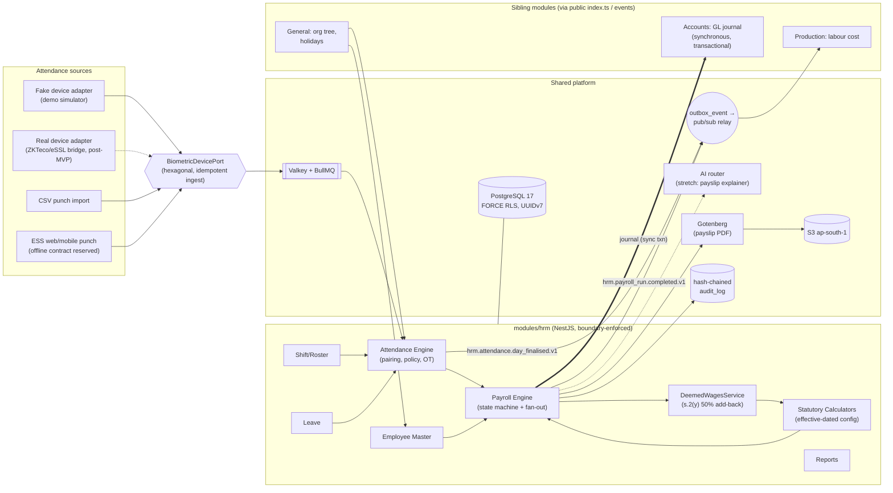
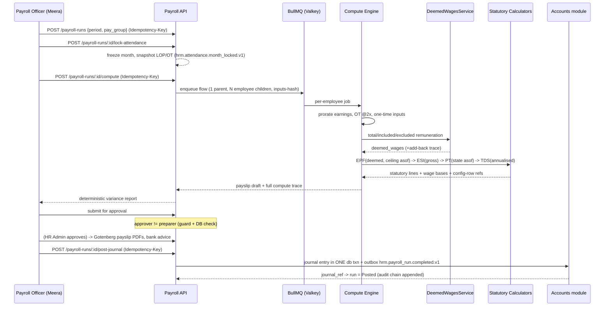

# IND-CORE Module 02 — HRM and Attendance

## Engineering Implementation Blueprint

> **Product:** IND-CORE Manufacturing ERP — a multi-tenant SaaS platform for Indian SMB/mid-market manufacturers.
> **Module:** 02 — HRM & Attendance (V2). The people-and-pay backbone: system of record for every worker, their time, and their pay.
> **Lineage:** This blueprint is a full V2 rewrite after the deep-research due-diligence engagement and conforms to **DECISIONS-V2** (binding). It carries the largest V1→V2 compliance delta of any module because the four Labour Codes have been **in force since 21 Nov 2025**, which changes the wage base the payroll engine computes on.
> **Sibling V2 modules (referenced, never re-implemented):** cross-module access is only via each module's public `index.ts` or versioned outbox events, enforced by dependency-cruiser in CI. HRM references **General (Module 01)** for the organisation tree, holiday calendars, number series, and users/roles; **Accounts (Module 03)** for the payroll GL journal; **Expenditure (Module 04)** for reimbursements/advances as payroll inputs; and **Production (Module 05)** for labour hours/cost per work centre. HRM holds FKs only and re-implements none of these. The module sits inside the shared IND-CORE platform baseline (FORCE RLS, UUIDv7, outbox, hash-chained audit, hexagonal ports) established in DECISIONS-V2.

---

## 1. Module Overview

**Module 02 — HRM & Attendance (V2)** is the people-and-pay backbone of the IND-CORE Manufacturing ERP. It is the system of record for every worker (permanent, probation, trainee, fixed-term/contract, apprentice), their time, and their pay — from the employee master through shift rosters, attendance capture, leave, monthly Indian-statutory payroll, and payslip delivery.

The module fixes the core money pipeline — **punch → attendance day → payable days/OT → deemed wages → payroll → payslip → GL** — as one auditable flow, with every statutory rate held as effective-dated configuration rather than tribal Excel knowledge. It conforms to DECISIONS-V2 and corrects the module's compliance model to the post-Labour-Codes world: **all four Labour Codes have been in force since 21 Nov 2025** ([Ministry of Labour official FAQs, 16 Mar 2026](https://www.labour.gov.in/static/uploads/2026/03/a4ccf4c6d97c4f1f36a6d83f8c64213d.pdf)), which changes the very wage base payroll computes on.

### 1.1 Component responsibilities

| Component (`modules/hrm/*`) | Responsibility |
|---|---|
| `employees` | Employee master CRUD, effective-dated job history, documents, purpose/notice registry, lifecycle states |
| `shifts` | Shift master, roster assignment/publish/lock, weekly-off patterns |
| `attendance` | Punch ingestion (via `BiometricDevicePort`), CSV import, processing engine (pairing, policy, OT), regularisation workflow, muster/lock |
| `leave` | Leave types/rules, accrual job, applications & approvals, balances |
| `payroll` | Components/structures/assignments, run state machine, compute orchestration (incl. `DeemedWagesService`), payslips, bank advice |
| `statutory` | Effective-dated config resolution, per-statute calculators (EPF/ESI/PT/TDS), export file generators, filing tracker |
| `ess` | Self-scoped facade over the above for employee endpoints |
| `hrm-reports` | SQL-view-backed report and dashboard aggregates |
| Workers (BullMQ/Valkey) | `punch-ingest`, `attendance-process`, `leave-accrual`, `payroll-compute` flow, `payslip-pdf` (Gotenberg), `statutory-export`, reminders, `fake-device-feed` (demo) |
| Outbox relay | `outbox_event` → Valkey pub/sub → consumers in Accounts/Production |

### 1.2 Integration / services touchpoints

Cross-module access is **only** via each module's public `index.ts` or outbox events, enforced by dependency-cruiser in CI. HRM holds FKs only and re-implements nothing.

| Sibling module | Direction | Contract | Notes |
|---|---|---|---|
| **General (Module 01)** | HRM reads | Read-only service interfaces via public `index.ts` | Organisation tree (company → plant/location → department → designation → grade → cost centre), holiday calendars, number series, users/roles. HRM holds FKs only. |
| **Accounts (Module 03)** | HRM writes | Synchronous GL journal in one DB transaction + `hrm.payroll_run.completed.v1` outbox | Payroll run posts a costed GL journal (salary expense by cost centre, statutory liabilities, net-pay payable). Ledger-critical → the journal call is synchronous; the event notifies, it does not post. |
| **Production (Module 05)** | HRM emits/serves | `hrm.attendance.day_finalised.v1` outbox + `GET /internal/labour-cost/daily` internal read API | Attendance day carries optional `work_centre_id`; labour hours and fully-loaded cost flow to work-order costing. |
| **Expenditure (Module 04)** | HRM reads | Reimbursements/advances appear as payroll input lines (manual in MVP) | `payroll_input` rows. |

### 1.3 Module boundary note

`apps/api/src/modules/hrm` imports from `general`/`accounts` only via their public `index.ts`; there are **no cross-module table reads**; dependency-cruiser fails CI on violation. Statutory rates live in `packages/statutory-config` (data + loaders + golden vectors) so Finance/Accounts can reference the same effective-dated tables without importing HRM internals. All roles resolve through Keycloak 26 (Organizations for tenancy); record-scope and field-level rules evaluate in the in-app RBAC+ABAC engine — **never in Next.js middleware** (CVE-2025-29927 rule: middleware performs zero authorization).

### 1.4 What changed in V2

| # | Area | V1 | V2 (binding) |
|---|---|---|---|
| 1 | PF/gratuity wage base | 12% of **Basic (+DA)** | **s.2(y) deemed wages**: excluded components >50% of total remuneration add back to "wages"; engine computes `deemed_wages = max(included, 50% × total remuneration)` per period — never raw Basic+DA |
| 2 | Fixed-term gratuity | Implicit 5-year vesting | **Gratuity at 1 year for fixed-term employees**; F&F and provision logic branch on employment type |
| 3 | Labour Codes status | Treated as "guardrail" (Basic ≥ 50% warning) | Codes **in force since 21 Nov 2025**; wage-definition math is live law, not a validation hint; state rules transitional → config, not code |
| 4 | EPF ceiling | Constant ₹15,000 in rule pack | Effective-dated statutory config row; ₹15,000 **re-notified 29 May 2026** ([SCC Online](https://www.scconline.com/blog/post/2026/06/01/15000-wage-ceiling-epf-coverage-membership-contributions/)); ₹21k/₹25k hike speculation handled as a future config insert |
| 5 | Statutory rates storage | JSONB "rule packs" (semi-structured) | Normalised **effective-dated statutory config tables** in `packages/statutory-config` (EPF/ESI/PT/TDS slabs); INSERT-new-row with `effective_from`; **no statutory constant in code, ever** |
| 6 | §87A / TDS pack | "Rebate for taxable income ≤ ₹12L" (imprecise) | FY 2026-27 new regime: rebate **₹60,000 where income ≤ ₹12L**, SD ₹75,000, 4% cess; **Income-tax Act 2025 renumbering** (from 1 Apr 2026) flagged for TDS artefacts ([ClearTax](https://cleartax.in/s/income-tax-slabs)) |
| 7 | ORM | Prisma + raw SQL | **Drizzle ORM v1** — RLS ergonomics (`SET LOCAL` without interactive-transaction wrapping; Prisma #12735) + SQL-first payroll reporting |
| 8 | Queue/cache | Redis + BullMQ | **Valkey (ElastiCache) + BullMQ**, versions pinned; payroll compute/attendance jobs unchanged in shape |
| 9 | Payslip PDF | Puppeteer render | **Gotenberg sidecar** (HTML→PDF) — pixel-faithful statutory payslip/muster formats from the same web templates |
| 10 | AI scope | 2 MVP AI features (anomaly summary + payslip explainer) | **Payslip explainer only, STRETCH** (read-only tool-calling, guardrailed, via provider-agnostic router); variance/anomaly detection stays **deterministic rules**; all other V1 AI ideas → future |
| 11 | Tenancy/RLS | "tenant_id + RLS" | **FORCE RLS** + non-owner `app_user` + `SET LOCAL app.tenant_id` per request + **UUIDv7 PKs** + tenant-leading composite indexes + CI two-tenant leak probes on every migration |
| 12 | Events | `payroll.posted` ad-hoc pub/sub | Transactional **outbox** with versioned names: `hrm.payroll_run.completed.v1`, `hrm.attendance.day_finalised.v1`, `hrm.employee.changed.v1`; idempotent consumers |
| 13 | Biometric ingest | Mock endpoint + "simulator job" | Hexagonal **`BiometricDevicePort`** with real (ZKTeco/eSSL bridge, post-MVP) and **fake (demo-mode) adapters** behind one contract; CSV import shares the port |
| 14 | Mobile/ESS sequencing | "Mobile-responsive ESS" as a UX rule | **Disproof finding (binding):** mobile/offline shop-floor phase must land **before HRM UX freeze**; attendance kiosk + offline punch capture explicitly flagged as freeze-gating inputs |
| 15 | Ops/compliance posture | DPDP mentioned generically | **CERT-In obligations LIVE NOW**: 6-hour incident reporting, 180-day ICT logs in India, NIC/NPL NTP traceability (punch/audit timestamps); DPDP wording fixed to **"DPDP-ready, aligned to DPDP Rules 2025 phase-in (May 2027)"** |

### 1.5 MVP scope (in vs deferred)

MVP scope remains deliberately sharp:

| In MVP | Deferred (post-MVP) |
|---|---|
| Employee master (effective-dated job history, statutory IDs, bank) | Recruitment (requisition → offer), onboarding workflows |
| Shift master + roster (A/B/C + General, cross-midnight, rotational offs) | Appraisal / goals, training & skills matrix, safety/EHS |
| Attendance capture: manual, CSV import, punch ingest via device port (fake adapter in demo) | Real device SDK integrations (ZKTeco/eSSL/Matrix), face/geofence punch, **offline mobile attendance** |
| Regularisation workflow, holiday calendars (via General) | Contract-labour management, piece-rate/incentive pay |
| Leave types, accrual, balances, apply/approve, LOP | Comp-off automation, hourly leave, encashment payout |
| Monthly payroll: salary structures, **deemed-wages engine**, EPF/ESI/PT/TDS, OT at 2× | Retro/arrears engine, FBP, loans/advances, LWF, bonus |
| Payslip PDF (Gotenberg), muster roll, salary register, payroll GL journal to Accounts | F&F automation, Form 16/24Q e-filing, EPFO/ESIC API filing, bank host-to-host |
| ESS basics: punch (web/mobile), leave apply, payslip view/download | Full ESS/MSS (tax declarations, helpdesk, surveys) |

### 1.6 Business problem

Indian SMB manufacturers like the demo tenant **Trishul Precision Components Pvt Ltd** (~120 employees, plants at Pune-Chakan MH and Coimbatore TN) run people operations on a patchwork that breaks in predictable — and now legally sharpened — ways:

1. **Attendance lives in the biometric vendor's silo.** Punch logs sit in a desktop utility next to the turnstile; HR re-keys "payable days" into Excel each month. Missing punches, cross-midnight C-shift, and rotational weekly-offs are hand-adjusted, so payroll disputes are routine.
2. **Payroll is a spreadsheet computing on the wrong wage base.** Since **21 Nov 2025** the four Labour Codes are in force, and the Code on Wages s.2(y) definition means that when excluded components (HRA, OT, conveyance, bonus, etc.) exceed 50% of total remuneration, **the excess is added back to "wages" for PF and gratuity** ([Labour Ministry FAQs](https://www.labour.gov.in/static/uploads/2026/03/a4ccf4c6d97c4f1f36a6d83f8c64213d.pdf)). Every SMB spreadsheet — and most legacy payroll tools — still computes PF on Basic+DA. That is systematic underpayment from day one: interest, damages under EPF §14B, and gratuity shortfalls at exit.
3. **Multi-state statutory complexity in one company.** EPF (12% against the ₹15,000 ceiling, re-notified 29 May 2026), ESI (0.75%/3.25% at gross ≤ ₹21,000 with contribution-period lock-in), Maharashtra monthly PT (₹200, ₹300 in February) vs Tamil Nadu half-yearly PT, and FY 2026-27 new-regime TDS — one wrong slab means an unhappy inspector, and every one of these numbers is now in flux under the Codes' transitional rules.
4. **Overtime is a compliance blind spot.** The Factories Act requires OT beyond 9 hours/day or 48 hours/week at **twice the ordinary rate**, with an auditable overtime register. Most SMBs pay ad-hoc "OT allowance" — which, ironically, inflates excluded components and can trigger the very 50% add-back they don't compute.
5. **Fixed-term workers are mis-provisioned.** Fixed-term employees now earn **gratuity at 1 year, not 5** — a liability most SMBs are not accruing at all.
6. **Labour cost never reaches the work order.** Production quotes job costs on standard rates; actual wages + OT + employer statutory never reconcile back, so per-work-order margins are fiction.
7. **Employee PII is unprotected.** Aadhaar/PAN/bank details in shared spreadsheets. Employment data is a DPDP "legitimate use" (no consent needed), but **security safeguards, breach notification, and rights handling still apply** when substantive obligations land 12/13 May 2027 — with penalties to ₹250 crore. Meanwhile **CERT-In obligations bind the vendor today** (6-hour incident reporting, 180-day India-resident logs).
8. **Leave is verbal.** No balances, no accrual rules, no LOP linkage to payroll — attendance, leave, and pay disagree every month.

### 1.7 High-level architecture (module context)



---

## 2. Objectives

Objectives are drawn directly from the module's Goals. Product objectives describe the business outcome; engineering objectives describe the technical guarantee that delivers it. (Non-goals and out-of-scope items are enumerated in §17.)

### 2.A Product objectives

1. **Single employee system of record.** One effective-dated employee master (org placement from General; statutory IDs UAN/ESIC/PAN/Aadhaar encrypted) that every other module references.
2. **Shift-native attendance engine.** A/B/C rotating shifts with cross-midnight handling, grace/half-day rules, rotational weekly-offs, and OT at the Factories-Act double rate — factory and office share one model.
3. **Labour-Codes-correct monthly payroll.** Attendance-locked payroll runs computing earnings, LOP, OT, then **deemed wages under s.2(y)**, then EPF/ESI/PT/TDS from effective-dated statutory config; preparer ≠ approver; every payslip line traceable to its formula and wage base — including the deemed-wages add-back shown explicitly on the compute trace.
4. **Compliance artefacts on demand.** Muster roll (Form 25 style), overtime register, salary register, PF ECR-format export (on deemed-wage PF bases), ESI return export, PT summary by state, TDS register, gratuity provision note (deemed wages, 1-year fixed-term vesting) — generated, not assembled.
5. **Closed loop with Accounts and Production.** One-click payroll GL journal (expense by cost centre, liabilities by statute) and labour hours/cost per work centre available to Production costing.
6. **Demo-quality UX in ~11 weeks.** An investor can watch: punch import → exception fixed → leave approved → payroll run computed (deemed-wages trace visible) → payslip PDF → GL journal, on believable Trishul data, in under 10 minutes.

### 2.B Engineering objectives

7. **DPDP-ready and CERT-In-compliant by construction.** Field-level encryption for PAN/Aadhaar/bank, masked display with access-audited reveal, India-region residency, 180-day log posture, NTP-traceable timestamps. Marketing wording: **"DPDP-ready, aligned to DPDP Rules 2025 phase-in (May 2027)"** — never "DPDP compliant" in 2026.
8. **Statutory math provably right.** A golden-test-vector suite (published, hand-verified fixtures for PF/ESI/PT/TDS/deemed wages) is a first-class deliverable and demo asset, not an internal test detail.
9. **Statutory rates are data, never code.** Every rate/slab/ceiling is an INSERT-new-row `effective_from` record in `packages/statutory-config`, resolved as-of the payroll period; historical payslips recompute against the rates in force for their period.
10. **Deterministic, replayable engines.** Attendance processing and payroll compute are pure functions of their inputs (punches/roster/policy; attendance snapshot/assignments/config), idempotent per inputs-hash, and safe to replay.

---

## 3. User Personas

All personas resolve through Keycloak 26 (Organizations for tenancy). Record-scope and field-level rules evaluate in the in-app RBAC+ABAC engine — never in Next.js middleware. Post-MVP personas (Recruiter, EHS Officer, Trainer) are designed into the role model but ship no screens in MVP.

### 3.1 HR Admin / HR Manager — *Priya Deshmukh*
- **Scope:** Company-wide, full.
- **Goals:** Own the employee master (CRUD, effective-dated job history), configure leave policy, oversee statutory config (effective-dated inserts), act as run-approval fallback, and hold the DPDP posture (masked-PII reveal is her audited privilege).
- **Pain points solved:** PII scattered in spreadsheets; no purpose/notice registry; leave rules that live in people's heads; statutory numbers hard-coded and untraceable.
- **Primary screens:** Employee list & 360 profile, Leave types/balances, Statutory config viewer, HR/Payroll dashboard, audited PII reveal.

### 3.2 Payroll Officer — *Meera Iyer* (doubles as Finance Controller)
- **Scope:** Company-wide payroll; employee master read-only.
- **Goals:** Build salary structures, run payroll (compute/review/approve within SoD), generate statutory exports, and post the GL journal to Accounts.
- **Pain points solved:** Spreadsheet payroll computing on the wrong wage base; ad-hoc OT; no month-over-month variance gate; manual re-keying into statutory portals.
- **Primary screens:** Salary structure builder, Payroll run workspace, Variance review, Payslip detail, Statutory console & exports.

### 3.3 Line Manager / Supervisor — *Rajesh Kulkarni* (Plant Head)
- **Scope:** Own team/plant records.
- **Goals:** Approve leave and regularisation, publish shift rosters, monitor team attendance muster and OT-cap exposure.
- **Pain points solved:** No structured approval routing; roster is a whiteboard; cross-midnight shifts hand-adjusted; no visibility of Factories-Act OT breaches.
- **Primary screens:** Team attendance muster, Roster planner, Regularisation inbox, Leave approval inbox, Manager dashboard.

### 3.4 Factory / Shift Supervisor — *Shift A/B/C supervisors*
- **Scope:** Own line/shift.
- **Goals:** Assign rosters, mark OT, triage attendance exceptions on the shop floor.
- **Pain points solved:** Missing/duplicate punches with no triage path; OT paid ad-hoc rather than marked and computed at 2×.
- **Primary screens:** Roster planner (line), Muster day drawer, Regularisation queue.

### 3.5 Employee (ESS) — *Sanjay Patil*, *Kavita Rao*, et al.
- **Scope:** Own records only.
- **Goals:** Punch in/out (web/mobile), apply for leave and view balances, view and download payslips, see holidays and profile.
- **Pain points solved:** No visibility of balances or payslips; leave requested verbally; payslip numbers unexplained (stretch AI explainer grounds every figure).
- **Primary screens:** ESS "My Space" — Punch In/Out, My Attendance, My Leave, My Payslips, Holidays.

### 3.6 Finance / Accounts (consumer)
- **Scope:** Read via Accounts module.
- **Goals:** Consume the payroll GL journal and statutory-liability report; reconcile.
- **Pain points solved:** Actual labour cost and statutory liabilities never reach the ledger cleanly.
- **Primary screens:** (In Accounts) journal + liability report fed by `hrm.payroll_run.completed.v1`.

### 3.7 CXO / Plant Head — *Rajesh Kulkarni*
- **Scope:** Company-wide, read.
- **Goals:** Watch headcount, absenteeism %, OT cost, and payroll-cost trends.
- **Pain points solved:** No consolidated people-cost view; OT-heavy months and their deemed-wages add-backs invisible.
- **Primary screens:** CXO headcount/cost dashboard (Recharts).

---
## 4. Functional Requirements

Requirements are numbered `HR-xx` for traceability into the roadmap. Priority: **M** = MVP, **P** = post-MVP. Deltas from V1 are marked **[V2]**. The set is grouped into six lettered sub-areas: **4.A** Employee master & organisation, **4.B** Shifts & roster, **4.C** Attendance, **4.D** Leave, **4.E** Payroll (India — Labour-Codes-correct), **4.F** ESS, reports & cross-cutting.

### 4.A Employee master & organisation

| ID | Requirement | Pri |
|---|---|---|
| HR-01 | Create/edit employee with personal, contact, job (FKs to General: company, plant, department, designation, grade, cost centre), statutory (PAN, Aadhaar, UAN/PF no., ESIC no. — encrypted at rest, masked in UI), bank details, employment type (permanent/probation/trainee/**fixed_term**/contract/apprentice), DOJ, probation end. **[V2]** `employment_type = fixed_term` drives 1-year gratuity vesting. | M |
| HR-02 | Effective-dated job history: every transfer/promotion/comp change writes an `employee_job_history` row with `effective_from` and change type; profile timeline view. | M |
| HR-03 | Employee lifecycle states: Draft → Active → On Probation → Confirmed → On Notice → Relieved; probation-due list. | M |
| HR-04 | Reporting-manager hierarchy (self-FK) driving approval routing and team scoping. | M |
| HR-05 | Document uploads (ID proof, contracts) to S3 ap-south-1 with type + expiry; expiry alert job. | M (basic) |
| HR-06 | DPDP-ready plumbing per employee: purpose registry entry tagged **"employment — legitimate use (Act s.7), no consent required"**, notice version, PII access audit log on reveal of masked fields, erasure workflow honouring 8-year payroll retention override. **[V2]** wording and legal basis corrected. | M |
| HR-07 | Recruitment (requisition → candidate → interview → offer) and onboarding checklists. | P |

### 4.B Shifts & roster

| ID | Requirement | Pri |
|---|---|---|
| HR-10 | Shift master: name, start/end time, break minutes, grace minutes, `is_night` (cross-midnight), `ot_after_minutes`. Seed A (06:00–14:00), B (14:00–22:00), C (22:00–06:00, night), General (09:00–17:30). | M |
| HR-11 | Roster: assign employee×date×shift; weekly pattern bulk-assign; copy previous week; publish/lock states; unique (tenant, employee, date). | M |
| HR-12 | Rotational weekly-off support: off-day is a roster entry type, not a global Sunday assumption. | M |
| HR-13 | Shift-swap requests with approval; roster optimisation; skills-gated assignment vs Production work centres. | P |

### 4.C Attendance

| ID | Requirement | Pri |
|---|---|---|
| HR-20 | Punch ingestion through the hexagonal **`BiometricDevicePort`**: `POST /attendance/punches` accepting `{device_id, emp_code, punch_time, direction, source}` — device-agnostic, idempotent (dedupe on tenant+device+emp+timestamp), append-only raw store. **[V2]** Demo runs the **fake adapter** (deterministic simulator implementing the same port as the future ZKTeco/eSSL real adapter). Punch timestamps validated against NTP-traceable server clock (CERT-In: chrony → `samay1/samay2.nic.in` or documented traceability). | M |
| HR-21 | CSV punch import (device log dumps) with validation report and row-level error download; import files retained in S3 for audit. | M |
| HR-22 | Manual attendance marking / bulk marking by HR or supervisor (audited). | M |
| HR-23 | Nightly + on-demand **attendance processing job** (BullMQ on Valkey): pair punches into first-in/last-out per rostered shift (cross-midnight aware: a C-shift out-punch at 06:10 next day belongs to the prior attendance date), apply grace, compute worked hours, half-day threshold, break deduction, OT hours beyond `ot_after_minutes` and beyond 9h/day, and set day status: Present / Absent / Half-Day / Leave / Holiday / Weekly-Off / OD / Pending-Regularisation. Deterministic and replayable. | M |
| HR-24 | Regularisation workflow: employee requests corrected in/out with reason; manager approves → attendance reprocessed; audit trail retained. | M |
| HR-25 | Holiday calendar per location consumed from General; holiday and weekly-off days auto-statused. | M |
| HR-26 | Attendance muster (month × employee grid) with exception filters (missing punch, late, short hours); export CSV/PDF; **lock for payroll** per month. Finalised days emit `hrm.attendance.day_finalised.v1` via outbox. | M |
| HR-27 | Factories Act guardrails: warn when weekly hours > 48 or daily > 9 without OT marking; quarterly OT cap watch-list (configurable, default 75 h/quarter, state-configurable — Codes' state rules transitional). | M (warnings) |
| HR-28 | Mobile GPS/geofence punch, face/selfie match, gate/turnstile controllers, real device SDK adapters, **offline kiosk punch capture with store-and-forward sync**. **[V2]** Contract requirements (client-generated punch UUIDv7, offline batch endpoint, conflict rules) are specified in MVP so the ingest API doesn't need breaking changes when the mobile/offline phase lands. | P (contract fixed in MVP) |

### 4.D Leave

| ID | Requirement | Pri |
|---|---|---|
| HR-30 | Leave types with rules: paid flag, accrual (monthly/annual/on-join), annual quota, carry-forward cap, encashable flag, negative-balance allowed flag. Seed: PL/EL, CL, SL, Maternity, Comp-Off (manual grant), LOP. | M |
| HR-31 | Monthly accrual job maintains `leave_balance` (opening/accrued/used/closing per type per year). | M |
| HR-32 | Leave application: date range, half-day flag, balance check, holiday/weekly-off exclusion per type rule, approver routing to reporting manager; states Applied → Approved/Rejected/Cancelled. | M |
| HR-33 | Approved leave writes attendance day status; LOP days flow to payroll as `lop_units`. | M |
| HR-34 | Team leave calendar for managers; balance view in ESS. | M |
| HR-35 | Encashment payout, hourly leave, comp-off auto-credit from extra hours with expiry. | P |

### 4.E Payroll (India — Labour-Codes-correct)

| ID | Requirement | Pri |
|---|---|---|
| HR-40 | Salary components (earning/deduction, fixed/percentage/formula, taxable flag, **`wage_class` = included / excluded per s.2(y)**) and salary structures (grade-linkable, versioned Draft → Active → Superseded) with child component lines; test-calculate preview showing the deemed-wages computation. **[V2]** every component is classified for the wage definition. | M |
| HR-41 | Employee salary assignment (structure + CTC, effective-dated). Structure validation surfaces the s.2(y) consequence: if excluded components > 50% of remuneration, the builder shows the projected add-back (informational — the engine computes it regardless; this is **law, not a guardrail**). **[V2]** | M |
| HR-42 | Payroll run per company × month × pay group: Draft → Attendance Locked → Computed → Under Review → Approved → Paid → Posted → Closed. Preparer ≠ approver enforced (service guard + DB check). | M |
| HR-43 | Compute engine (BullMQ flow, per-employee fan-out): prorate earnings by payable days (calendar-days basis, configurable), add OT pay at **2× ordinary rate** (`gross/26/8 × 2 × OT hours`, rate basis configurable), apply one-time inputs, then **compute deemed wages**, then statutory in order EPF → ESI → PT → TDS. Compute is **idempotent per (run, employee, inputs-hash)** — re-triggering with the same `Idempotency-Key` never double-computes. | M |
| HR-44 | **Deemed wages (s.2(y) Code on Wages): [V2, new]** per payslip compute `total_remuneration`, `included_wages` (Basic + DA + retaining allowance), `excluded_wages` (HRA, OT, conveyance, bonus, commission, special allowances classified excluded); if `excluded_wages > 50% × total_remuneration`, `addback = excluded_wages − 0.5 × total_remuneration`; `deemed_wages = included_wages + addback` (equivalently `max(included, 50% × total)`). Persist all five figures on the payslip. **Deemed wages is the wage base for PF and gratuity.** ([Labour Ministry FAQs 16.03.2026](https://www.labour.gov.in/static/uploads/2026/03/a4ccf4c6d97c4f1f36a6d83f8c64213d.pdf)) | M |
| HR-45 | **EPF:** employee 12% of PF wages = `min(deemed_wages, ceiling)` under default `capped_at_15000` policy (or `actual` per employee); employer 12% split EPS 8.33% (on wages capped at ceiling) + EPF balance; admin 0.5%, EDLI 0.5% (capped). Ceiling read from effective-dated config (**₹15,000, re-notified 29 May 2026**). Stored per payslip in `statutory_contribution` with wage base and config-row reference. | M |
| HR-46 | **ESI:** applicable while monthly gross ≤ ₹21,000 (config) at contribution-period start (Apr–Sep / Oct–Mar lock-in honoured); employee 0.75%, employer 3.25% of gross incl. OT; round up to next rupee. ESI base is gross remuneration — **not** deemed wages. | M |
| HR-47 | **Professional Tax:** state-wise effective-dated slab tables keyed to the employee's work-location state. Seed **Maharashtra** (monthly: ≤₹7,500 nil; ₹7,501–10,000 ₹175, women exempt — exemption threshold itself a config value pending MH-notification verification, see Risks; >₹10,000 ₹200/month and **₹300 in February**; ₹2,500/yr cap) and **Tamil Nadu** (half-yearly slabs per municipality, max ₹1,250/half-year at >₹75,000 half-yearly gross; deducted monthly as 1/6 with sixth-month true-up). ([Zoho Payroll state table](https://www.zoho.com/in/payroll/academy/taxes-and-compliance/professional-tax-rules.html)) | M |
| HR-48 | **TDS (new regime default, FY 2026-27 config):** annualise taxable earnings, standard deduction ₹75,000, slabs 0–4L nil / 4–8L 5% / 8–12L 10% / 12–16L 15% / 16–20L 20% / 20–24L 25% / >24L 30%; **§87A rebate ₹60,000 where income ≤ ₹12L**; 4% cess; divide remaining annual tax across remaining months. TDS register labels map to **Income-tax Act 2025** section numbering (effective 1 Apr 2026), with old-section cross-reference until CBDT form guidance settles. Old-regime + declarations deferred. **[V2]** | M |
| HR-49 | Payslip generation with lines per component + deemed-wages block + statutory block + LOP/paid days + YTD; **payslip PDF via Gotenberg** (immutable, content-addressed S3 key) published to ESS; email notification with deep-link, never attachment. | M |
| HR-50 | Variance review screen: month-over-month per-employee net/gross/statutory deltas beyond threshold flagged before approval — **deterministic rules only** (V1's AI anomaly narrative dropped per DECISIONS-V2 AI scope). | M |
| HR-51 | **GL journal to Accounts** on Posted: Dr salary expense by cost centre, Dr employer EPF/ESI expense; Cr net-pay payable, Cr EPF/ESI/PT/TDS payable. Synchronous, transactional, idempotent; `hrm.payroll_run.completed.v1` outbox event emitted in the same transaction. | M |
| HR-52 | **Gratuity accrual note: [V2 corrected]** monthly provision report = 15/26 × latest monthly **deemed wages** × service fraction; vesting horizon = **1 year for fixed-term employees, 5 years otherwise** (provision accrues from month 1 for reporting either way; tax-exempt cap ₹20L noted). Report-only in MVP. | M (report) |
| HR-53 | Statutory exports: PF ECR text file (EPFO format, deemed-wage PF bases), ESI monthly contribution CSV, PT payment summary by state, TDS monthly register. Marked Generated → Filed manually with acknowledgement number capture. | M |
| HR-54 | Bank advice file (generic CSV: account, IFSC, amount, narration) per run. | M |
| HR-55 | Retro/arrears (with statutory recomputation incl. arrears PF), loans/advances with recovery schedules, LWF, bonus (Code on Wages thresholds config-driven), Form 16/24Q e-filing, F&F settlement automation. | P |

### 4.F ESS, reports & cross-cutting

| ID | Requirement | Pri |
|---|---|---|
| HR-60 | ESS (mobile-first): web punch in/out, my attendance, apply leave + balances, payslip list/PDF, holiday list, profile view. **[V2]** ESS layout freeze waits for the mobile/offline shop-floor design phase (see §6). | M |
| HR-61 | Reports: daily muster, monthly muster roll, overtime register (Factories Act format), leave ledger & liability, salary register, statutory registers, headcount/joiners/exits, gratuity provision (deemed wages). | M |
| HR-62 | Role-based dashboards: HR/Payroll ops dashboard; manager team dashboard; CXO headcount/cost dashboard. | M |
| HR-63 | Every payroll-affecting mutation lands in the **hash-chained, append-only audit log** (`row_hash = SHA256(prev_hash ‖ canonical_payload)` per tenant, INSERT-only grant, verify job, no off-switch, 8-year retention — MCA Rule 3(1)/11(g) posture since payroll postings touch the books); sensitive-field reveals separately audited (DPDP Rule 6 access logs ≥ 1 year). | M |
| HR-64 | All records tenant-scoped: `tenant_id` + **FORCE RLS** with `SET LOCAL app.tenant_id`, app connects as non-owner `app_user` (NOBYPASSRLS); demo tenant seeding behind feature flag. | M |
| HR-65 | **[V2 STRETCH]** AI **payslip explainer** in ESS: read-only tool-calling grounded strictly on the viewer's own payslip lines + statutory config text, via the provider-agnostic AI router; guardrails per platform (calling user's JWT, Tier-3 advisory-only, `ai_action_log` hash-chained, PII minimised, per-tenant opt-out + kill switch, golden-set eval gate before ship). | Stretch |

---

## 5. Non-functional Requirements

Synthesised from the module's engineering goals, System Architecture conventions, and Testing/load targets. NFRs are numbered `NFR-xx`.

| ID | Category | Requirement |
|---|---|---|
| NFR-01 | Correctness (payroll) | A run computing ~120 payslips × ~18 lines must commit atomically or not at all. Statutory math is validated by ~120 published, hand-verified, CA-reviewed golden vectors; the six demo payslips are among them. No payroll code merges after M5 without green golden vectors. |
| NFR-02 | Idempotency | Payroll compute is idempotent per `(run, employee, inputs_hash)`; `Idempotency-Key` on all run transitions (409 on payload-hash mismatch); unchanged `inputs_hash` recompute is byte-identical; `post-journal` replay yields exactly one GL journal. |
| NFR-03 | Determinism / replayability | Attendance processing is a pure function of `(punches, roster, holiday calendar, policy)`; reprocessing any day is safe; regularisations add corrective punches and replay to the same result set regardless of arrival order. |
| NFR-04 | Performance | 500-employee synthetic tenant: compute run < 5 min; muster grid p95 < 1.5 s; ingest 50 punches/s sustained. RLS overhead within the week-1 benchmark envelope; >15–20% triggers the platform mitigation review. |
| NFR-05 | Availability / DR | AWS ap-south-1 primary, ap-south-2 DR; ECS Fargate (one image, web + worker roles) with payroll worker CPU-isolated from the web role; RDS PITR (payroll is the least re-creatable data). |
| NFR-06 | Multi-tenancy & isolation | `tenant_id` + **FORCE RLS**, single `tenant_isolation` policy per tenant-scoped table on `current_setting('app.tenant_id')::uuid`; app connects only as non-owner `app_user` (NOBYPASSRLS). CI runs policy coverage + two-tenant leak probes on **every** migration; 100% policy coverage of tenant-scoped tables enforced. |
| NFR-07 | Data residency | All data and ICT logs resident in India (ap-south-1); S3 with 180-day log lifecycle; pre-signed short-lived download URLs; payslip PDFs immutable, content-addressed, object-locked in production. |
| NFR-08 | Privacy (DPDP) for employee PII | Field-level encryption for PAN/Aadhaar/bank; masked display by default; audited click-to-reveal writing `pii_access_log` (≥1-year retention, DPDP Rule 6); erasure workflow honours 8-year payroll retention override; legal basis = s.7 "legitimate use" (no consent theatre). Wording is always "DPDP-ready", never "DPDP-compliant" in 2026. |
| NFR-09 | Security / SoD | `payroll_run.approved_by <> created_by` as a DB CHECK plus service guard; MFA/TOTP enforced for Payroll Officer and HR Admin; authorization never runs in Next.js middleware (CVE-2025-29927). |
| NFR-10 | Auditability | Hash-chained append-only `audit_log` on all payroll/attendance/PII mutations; INSERT-only grant; nightly chain-verify job; no off-switch; 8-year retention on payroll-posting-related entries (MCA Rule 3(1)/11(g)). |
| NFR-11 | Time traceability (CERT-In) | Punch and audit timestamps NTP-traceable: chrony synced to `samay1/samay2.nic.in` (or documented traceability; AWS Time Sync alone insufficient); 6-hour incident-reporting runbook wired to on-call; 180-day ICT logs in-region. |
| NFR-12 | Kiosk / offline tolerance (contract-forward) | MVP ships web/mobile-responsive ESS (no offline), but every capture contract — client-generated `client_punch_id` (UUIDv7), offline batch-sync endpoint, conflict rules — is already shaped so the post-MVP kiosk/offline app is additive, not a breaking change. |
| NFR-13 | Extensibility (statutory) | Statutory rate/slab/ceiling changes are config inserts (`effective_from`) + new golden vectors + a regression run — never code edits; calculators resolve as-of the payroll period. |
| NFR-14 | Observability | OTel + Grafana Cloud + Sentry; compute progress streamed via Socket.IO; Sentry-clean and OpenAPI-documented as a release gate. |
| NFR-15 | Accessibility & i18n readiness | WCAG AA contrast; status colours always paired with letter codes; INR lakh/crore grouping (`₹1,14,875`), dates `DD-MMM-YYYY`, FY Apr–Mar everywhere; vernacular/low-literacy readiness reserved for the ESS/kiosk phase. |

---

## 6. UI/UX Flow

### 6.1 Binding sequencing constraint (disproof finding)

DECISIONS-V2 §2/§6 names mobile/offline shop-floor capability the platform's **top strategic gap**, and mandates that the **mobile/offline shop-floor design phase completes before the HRM UX freeze**. Concretely for this module:

- The **ESS surface (punch, leave, payslips)** and the **attendance kiosk / offline punch capture** concept are designed together in that phase — screen inventory, offline punch-queue UX (store-and-forward with `client_punch_id`), low-literacy iconography, and vernacular-readiness are inputs to, not afterthoughts of, the HRM screens.
- HRM desktop screens (muster, payroll workspace) may proceed earlier, but **no ESS/attendance-capture layout is frozen** until the mobile/offline phase signs off. The roadmap (§17) schedules this as a named gate in week 3.
- The MVP still ships web/mobile-responsive ESS (no offline), but every capture contract (punch ids, batch sync endpoint, conflict rules) is already shaped for the offline client, so the post-MVP kiosk/offline app is additive.

### 6.2 Primary loops

- **Attendance capture loop (shop floor / kiosk / ESS).** Worker punches (fake device / CSV / ESS web-mobile) → `BiometricDevicePort` idempotent ingest → append-only raw store → nightly/on-demand processing pairs punches per rostered shift (cross-midnight aware), applies grace/half-day/OT, sets day status → exceptions (missing punch, late, >9h no-OT) surface as chips on the muster. The offline contract (client-generated `client_punch_id`, batch sync, conflict rules) is reserved so a kiosk can queue-and-forward without an API change.
- **Exception → regularisation loop.** Employee raises a regularisation (corrected in/out + reason) → manager reviews before/after punch preview → approve triggers a deterministic reprocess of the day → muster cell flips; every step audited.
- **Leave loop.** Employee applies (live balance-after preview, holiday-overlap notice) → routes to reporting manager inbox → approve writes the attendance day status and, if unpaid, `lop_units` that flow into payroll.
- **Roster loop.** Supervisor builds a week grid (team × day), bulk-assigns a pattern or copies last week, marks weekly-offs, then publishes/locks the period.
- **Payroll loop (the demo spine).** Payroll Officer creates a run → locks attendance (freezes month, snapshots LOP/OT) → computes (per-employee fan-out; deemed wages then EPF→ESI→PT→TDS) → reviews deterministic variance → submits → a *different* approver approves (SoD) → payslip PDFs (Gotenberg) + bank advice generate → post journal (synchronous, transactional) to Accounts → run = Posted, audit chain appended.
- **ESS self-service loop.** Employee punches, views this-week attendance, applies leave, and opens payslips (with per-line "how was this computed?" trace and the stretch "Explain my payslip" drawer).

### 6.3 UX rules

- ESS pages single-column and thumb-first; muster/payroll screens desktop-optimised with responsive fallback.
- Tables: sticky headers, pinned employee column, server-side cursor pagination/sort, saved filters — all via the platform's week-1 data-grid wrapper.
- Forms: RHF + Zod, inline errors, optimistic updates with rollback (TanStack Query).
- Money in INR lakh/crore grouping (`₹1,14,875`); dates `DD-MMM-YYYY`; FY Apr–Mar everywhere.
- Destructive/statutory actions get confirm dialogs with consequence text; statutory-config inserts show "this affects runs from `<effective_from>`".
- Accessibility: WCAG AA contrast; status colours always paired with letter codes.

---

## 7. Screen-by-Screen Design

Each screen lists its purpose, key components, primary actions, and empty/error states. Layout for ESS and attendance-capture screens is frozen only after the mobile/offline phase (§6.1).

### 7.1 HR / Payroll Dashboard
- **Layout / components:** Tiles — headcount; today present/absent/on-leave; pending approvals; run status; statutory due-dates (PF 15th, ESI 15th, TDS 7th, PT per state); OT-cap watch-list; absenteeism trend (Recharts).
- **Actions:** Drill into approvals, runs, or OT-cap watch-list.
- **Empty/error:** No run in progress → "No active payroll run"; due-date tiles grey when nothing is due.

### 7.2 Employee list
- **Layout / components:** Data-grid — emp code, name, designation, dept, plant, shift, status; trigram search; filters; CSV export.
- **Actions:** Open 360 profile, create employee, export.
- **Empty/error:** No matches → empty-state with "Add employee" CTA; export disabled when the filter set is empty.

### 7.3 Employee 360 profile
- **Layout / components:** Tabs — Overview (masked PII with audited reveal), Job History timeline, Documents, Salary (role-gated), Attendance snapshot, Leave.
- **Actions:** Effective-dated edit, transfer/promote, audited PII reveal (`{field, reason}` → `pii_access_log`), document upload (pre-signed S3).
- **Empty/error:** Salary tab shows "Access restricted" for non-payroll roles; reveal requires a reason or the action is blocked.

### 7.4 Attendance Muster (demo centrepiece)
- **Layout / components:** Virtualised month × employee grid; colour-coded day cells (P/A/½/L/H/WO/OD/pending) with **letter codes for WCAG**; exception chips (missing punch, late, >9h no-OT); cell click → day drawer (punch pairs, hours, OT, regularise).
- **Actions:** Filter by exception; open day drawer; **Lock for payroll** (with guard summary — blocked while regularisations are pending).
- **Empty/error:** Unprocessed month → "Run processing"; lock blocked → guard summary listing pending regularisations.

### 7.5 Punch import
- **Layout / components:** Dropzone → validation summary → error-CSV download → commit; batch history.
- **Actions:** Upload CSV (multipart) → async validation → download row-level error report → commit.
- **Empty/error:** Rows with unknown emp codes / bad timestamps are itemised in the error CSV; every rejected row is accounted for.

### 7.6 Roster planner
- **Layout / components:** Week grid team × day; weekly-off marking; wage-class-agnostic shift cells.
- **Actions:** Bulk-assign patterns; copy-last-week; publish/lock.
- **Empty/error:** A B→C same-day double roster is rejected (uq tenant, employee, date); unpublished periods flagged.

### 7.7 Regularisation inbox
- **Layout / components:** Manager queue with before/after punch preview.
- **Actions:** One-click approve/reject → triggers deterministic day replay.
- **Empty/error:** Empty queue → "No pending regularisations".

### 7.8 Leave application
- **Layout / components:** Form with live balance-after preview, holiday-overlap notice, team calendar strip.
- **Actions:** Apply (balance check); manager decide (writes attendance days).
- **Empty/error:** Insufficient balance → LOP warning or block per `allow_negative`; holiday/weekly-off overlap noticed per type rule.

### 7.9 Salary structure builder
- **Layout / components:** Component rows with **wage-class badges (included/excluded)**; formula editor (Zod-validated); live test-calculate panel.
- **Actions:** Add/reorder component lines; `POST /salary-structures/:id/test` → preview payslip **including the deemed-wages computation and projected add-back** when exclusions exceed 50%.
- **Empty/error:** Invalid formula → inline Zod error; exclusions >50% → informational add-back projection (law, not a block).

### 7.10 Statutory config viewer
- **Layout / components:** Per statute — timeline of effective-dated rows (who inserted, when, source note/URL); "as-of" date picker; new-row insert form (HR Admin).
- **Actions:** Read config as-of a date; insert a new effective-dated row — **visibly append-only** (never UPDATE).
- **Empty/error:** Insert form shows "this affects runs from `<effective_from>`"; no edit/delete affordance exists.

### 7.11 Payroll run workspace
- **Layout / components:** Stepper across the state machine; compute progress (Socket.IO); deterministic variance table; payslip list; export buttons (ECR/ESI/PT/TDS/bank advice).
- **Actions:** Create → lock-attendance → compute → submit → approve → mark-paid → post-journal.
- **Empty/error:** SoD notice if the preparer attempts approve; invalid-state transitions return the standard error envelope (e.g. `PAYROLL_RUN_INVALID_STATE`).

### 7.12 Payslip detail
- **Layout / components:** Earnings/deductions two-column; **deemed-wages panel** (total → included/excluded → add-back → deemed wages → PF base); statutory block with wage bases + config-row provenance; LOP/paid days; YTD; per-line "how was this computed?" popover; PDF download; **[stretch]** "Explain my payslip" chat drawer.
- **Actions:** Open trace popover; download Gotenberg PDF (pre-signed); (stretch) ask the AI explainer.
- **Empty/error:** PDF not yet rendered → "Generating"; stretch explainer hidden if the feature is dark/opted-out.

### 7.13 Statutory console
- **Layout / components:** Filing tracker per statute×period — liability, due date, generated?, ack no.; overdue highlighted.
- **Actions:** Generate export; capture acknowledgement number (Generated → Filed).
- **Empty/error:** Overdue periods highlighted; nothing due → clean state.

### 7.14 ESS — My Space
- **Layout / components (layout frozen only after mobile/offline phase):** Mobile-first; large Punch In/Out button with time + shift; this-week strip; leave-balance cards; payslip list with PDF; holiday list. Single-column, thumb-reachable, acceptable at 360 px.
- **Actions:** Punch in/out; apply leave; open payslip; view holidays.
- **Empty/error:** No payslips yet → "No payslips available"; punch outside rostered window handled per policy.

---

## 8. Navigation

### 8.1 Sidebar / nav tree (role-filtered)

Left nav lives under the module section **"People"**; every node is permission-gated (a node renders only if the in-app RBAC+ABAC engine grants it — the UI hides only what NestJS guards + RLS already deny).

```
People
├── Dashboard            (role-adaptive: HR / Manager / CXO)
├── Employees            (list → 360 profile)
├── Attendance
│   ├── Muster           (month grid)
│   ├── Punch Imports
│   └── Regularisations
├── Shifts & Roster
├── Leave
│   ├── Applications     (my / team inbox)
│   └── Balances & Types
├── Payroll
│   ├── Runs
│   ├── Salary Structures
│   └── Statutory & Filings   (incl. effective-dated config viewer)
└── Reports
My Space (ESS — all roles)
├── Punch In/Out · My Attendance · My Leave · My Payslips · Holidays
```

### 8.2 Permission-gated visibility

| Node | Employee | Manager | Factory Supervisor | Payroll Officer | HR Admin |
|---|---|---|---|---|---|
| Dashboard | own | team | line | pay | all |
| Employees | — | — | — | R | ✔ |
| Attendance › Muster | own | team | line | R (company) | ✔ |
| Attendance › Regularisations | raise own | approve team | approve line | — | ✔ |
| Shifts & Roster | R | R | ✔ (line) | — | ✔ |
| Leave | own | team | line | R | ✔ |
| Payroll › Runs / Structures / Statutory | — | — | — | ✔ | ✔ |
| Reports | own | team | line | pay | all |
| My Space (ESS) | ✔ | ✔ | ✔ | ✔ | ✔ |

### 8.3 Breadcrumbs & deep links

- **Breadcrumbs:** `People › Attendance › Muster › Jun-2026`, `People › Payroll › Runs › PRUN-2627-0003 › Payslip (Sanjay Patil)`.
- **Deep links:** each payroll run, payslip, employee profile, and statutory-config timeline is directly addressable; payslip email carries a **deep-link, never an attachment**; muster cell → day drawer is a linkable state.

---
## 9. Database Schema (PostgreSQL 17)

**Platform conventions (normative):** **UUIDv7 PKs** on every table; every tenant-scoped table carries `tenant_id, created_at/by, updated_at/by, is_active` (soft delete; no hard DELETE on masters or payroll documents); **composite indexes lead with `tenant_id`** (e.g. `(tenant_id, employee_id, att_date)`, `(tenant_id, payroll_run_id)`); FORCE RLS + a single `tenant_isolation` policy per table; org masters live in General and are FK-referenced only.

```sql
-- Applied to every tenant-scoped table in modules/hrm:
ALTER TABLE <table> ENABLE ROW LEVEL SECURITY;
ALTER TABLE <table> FORCE ROW LEVEL SECURITY;
CREATE POLICY tenant_isolation ON <table>
  USING (tenant_id = current_setting('app.tenant_id')::uuid)
  WITH CHECK (tenant_id = current_setting('app.tenant_id')::uuid);
-- App connects only as non-owner app_user (NOBYPASSRLS).
-- Per request: BEGIN; SET LOCAL app.tenant_id = '<uuid from JWT>'; …; COMMIT;
```

### 9.1 Statutory config — effective-dated tables, never constants

The V1 JSONB "rule packs" are replaced by normalised, effective-dated config tables in `packages/statutory-config`. **No statutory number exists in code.** Corrections/changes are INSERT-new-row with `effective_from` (and `effective_to` closed on the prior row); calculators resolve as-of the payroll period; historical payslips always recompute against the rates in force for their period. These tables are **platform-global** (not tenant-scoped) with optional per-tenant overrides where law permits choice (e.g. `epf_ceiling_policy` per employee, PT municipality per plant).

| Table | Purpose | Key columns |
|---|---|---|
| `stat_epf_config` | EPF parameters | `effective_from/to`, `wage_ceiling` (**15000**, re-notified 29 May 2026), `employee_pct` 12, `eps_pct` 8.33, `epf_employer_pct` 3.67, `admin_pct` 0.5, `edli_pct` 0.5, `rounding_rule` |
| `stat_esi_config` | ESI parameters | `effective_from/to`, `gross_threshold` (**21000**), `employee_pct` 0.75, `employer_pct` 3.25, `contribution_periods` (Apr–Sep/Oct–Mar), `round_up` |
| `stat_pt_slab` | PT slabs per state | `state` (MH/TN/…), `effective_from/to`, `period_basis` (monthly/half_yearly), `slab_from`, `slab_to`, `amount`, `amount_february` (MH ₹300), `women_exempt_upto` (MH — pending notification verification), `annual_cap` 2500, `municipality` (TN nullable) |
| `stat_tds_slab` | Income-tax slabs per FY/regime | `fy` (2026-27), `regime` (new), `slab_from`, `slab_to`, `rate_pct`; plus `stat_tds_config`: `standard_deduction` 75000, `rebate_87a_amount` **60000**, `rebate_87a_income_limit` 1200000, `cess_pct` 4, `act_reference` (IT Act 2025 section map) |
| `stat_wage_definition` | s.2(y) parameters | `effective_from` (**2025-11-21**), `addback_threshold_pct` 50, `included_classes[]`, `excluded_classes[]` |
| `stat_gratuity_config` | Gratuity factors | `effective_from`, `factor_num` 15, `factor_den` 26, `vesting_years_default` 5, `vesting_years_fixed_term` **1**, `tax_exempt_cap` 2000000, `wage_base` = 'deemed_wages' |
| `stat_ot_config` | OT rules | `effective_from`, `multiplier` 2.0, `rate_basis` (gross/26/8 default), `daily_hours_cap` 9, `weekly_hours_cap` 48, `quarterly_ot_cap_hours` 75 (state-overridable) |

### 9.2 MVP tables (tenant-scoped, RLS-forced)

| Table | Purpose | Key columns (beyond platform columns) | FKs / constraints |
|---|---|---|---|
| `employee` | Worker system of record | `id` uuidv7, `emp_code` uq(tenant), names, `dob`, `gender`, `employment_type` (permanent/probation/trainee/**fixed_term**/contract/apprentice), `fixed_term_end_date`, `date_of_joining`, `probation_end_date`, `confirmation_date`, `status`, `pan_enc`, `aadhaar_enc`, `uan`, `pf_number`, `esic_number`, `pt_state`, `pt_municipality`, `epf_ceiling_policy` (capped_at_15000/actual), `default_shift_id` | → General.company/location/department/designation/grade/cost_centre; `reporting_manager_id` self-FK |
| `employee_job_history` | Effective-dated job/comp changes | `effective_from`, `change_type` (hire/promotion/transfer/comp/exit), snapshot FKs, `ctc` | → employee |
| `employee_bank_detail` | Salary credit account | `account_no_enc`, `ifsc`, `bank_name`, `is_primary` | → employee |
| `employee_document` | Uploaded docs | `doc_type`, `s3_key`, `expiry_date`, `verified` | → employee |
| `employee_purpose_record` | DPDP purpose/notice registry | `legal_basis` ('legitimate_use_employment' default), `purpose`, `notice_version`, `recorded_at`, `withdrawn_at` (for optional-consent items only) | → employee |
| `pii_access_log` | Audited unmask events (≥1-year retention) | `field`, `viewed_by`, `viewed_at`, `reason` | → employee, → user |
| `shift` | Shift definitions | `name`, `start_time`, `end_time`, `break_minutes`, `grace_minutes`, `is_night`, `ot_after_minutes`, `half_day_threshold_minutes` | — |
| `shift_roster` | Employee-day assignment | `roster_date`, `entry_type` (shift/weekly_off), `status` (draft/published/locked), `is_ot_planned`; **uq(tenant_id, employee_id, roster_date)** | → employee, → shift; `work_centre_id` → Production (nullable) |
| `biometric_punch` | Raw punches, append-only | `device_id`, `emp_code`, `punch_time` (NTP-traceable), `direction` (in/out/auto), `source` (device/csv/mobile/web/manual), `client_punch_id` uuidv7 (offline-sync reservation), `processed`, `import_batch_id`; **uq(tenant_id, device_id, emp_code, punch_time)** | matched → employee |
| `punch_import_batch` | CSV import audit | `file_s3_key`, `row_count`, `ok_count`, `error_report_s3_key`, `status` | → user |
| `attendance_day` | One row per employee-day (computed) | `att_date`, `first_in`, `last_out`, `worked_hours`, `ot_hours`, `late_minutes`, `status` (present/absent/half/leave/holiday/off/od/pending_reg), `lop_units`, `locked`; **uq(tenant_id, employee_id, att_date)**; index `(tenant_id, att_date)` | → employee, → shift, → leave_application (nullable), `work_centre_id` |
| `regularisation_request` | Punch-fix workflow | `att_date`, `requested_in`, `requested_out`, `reason`, `status` | → employee, `approver_id` |
| `leave_type` | Leave rules | `code` (PL/CL/SL/ML/CO/LOP), `is_paid`, `accrual_rule`, `annual_quota`, `carry_forward_cap`, `encashable`, `allow_negative`, `count_holidays` | — |
| `leave_application` | Applications | `from_date`, `to_date`, `half_day`, `days`, `reason`, `status` | → employee, → leave_type, `approver_id` |
| `leave_balance` | Per-type per-year ledger | `period_year`, `opening`, `accrued`, `used`, `encashed`, `closing`; **uq(tenant_id, employee_id, leave_type_id, period_year)** | → employee, → leave_type |
| `salary_component` | Reusable components | `code`, `type` (earning/deduction), `calc_type` (fixed/percentage/formula), `formula`, `is_taxable`, **`wage_class` (included/excluded per s.2(y))**, `gl_account_map` | — |
| `salary_structure` (+ `salary_structure_component`) | Versioned structures | `effective_from`, `status` (draft/active/superseded); child: `amount_or_formula`, `sequence` | `grade_id` → General (nullable) |
| `employee_salary_assignment` | Structure + CTC per employee | `ctc`, `monthly_gross`, `effective_from`, `status` | → employee, → salary_structure |
| `pay_group` | Run grouping | `name`, `pay_day` | → General.company |
| `payroll_run` | Run header + state machine | `period_month`, `status`, `total_gross/deduction/net`, `inputs_hash` (idempotency), `created_by`, `approved_by` **CHECK (approved_by <> created_by)**, `gl_journal_ref` | → pay_group; → Accounts.journal_entry |
| `payslip` | Per-employee result | `paid_days`, `lop_days`, `ot_hours`, `gross`, **deemed-wages block: `total_remuneration`, `included_wages`, `excluded_wages`, `deemed_wages_addback`, `deemed_wages`, `pf_wage_base`, `gratuity_wage_base`**, `total_deduction`, `net_pay`, `ytd_gross`, `ytd_tax`, `pdf_s3_key`, `status`; **uq(tenant_id, payroll_run_id, employee_id)** | → payroll_run, → employee |
| `payslip_line` | Component lines with trace | `amount`, `base_for_calc`, `formula_snapshot`, `wage_class_snapshot`, `sequence` | → payslip, → salary_component |
| `statutory_contribution` | EPF/ESI/PT/TDS per payslip | `statute`, `employee_amount`, `employer_amount`, `wage_base`, `config_table`, `config_row_id` (audit link to the effective-dated row used), `challan_ref`, `filing_status` | → payslip |
| `statutory_filing` | Export/filing tracker | `statute`, `period`, `liability_total`, `export_s3_key`, `due_date`, `status` (pending/generated/filed/reconciled), `ack_no` | → payroll_run |
| `payroll_input` | One-time inputs | `input_type` (incentive/deduction/reimbursement), `amount`, `remarks` | → payroll_run, → employee |

### 9.3 Representative DDL (core money pipeline)

DDL below is derived directly from the column/constraint specifications above; the same shape applies to the remaining tables.

```sql
CREATE TABLE employee (
  id                    uuid PRIMARY KEY DEFAULT uuidv7(),
  tenant_id             uuid NOT NULL,
  emp_code              text NOT NULL,
  first_name            text NOT NULL,
  last_name             text,
  dob                   date,
  gender                text,
  employment_type       text NOT NULL
                          CHECK (employment_type IN ('permanent','probation','trainee',
                                 'fixed_term','contract','apprentice')),
  fixed_term_end_date   date,
  date_of_joining       date NOT NULL,
  probation_end_date    date,
  confirmation_date     date,
  status                text NOT NULL DEFAULT 'draft',
  pan_enc               bytea,          -- field-level encrypted, masked in UI
  aadhaar_enc           bytea,          -- field-level encrypted, masked in UI
  uan                   text,
  pf_number             text,
  esic_number           text,
  pt_state              text,           -- drives PT slab resolution
  pt_municipality       text,           -- TN half-yearly per-municipality
  epf_ceiling_policy    text NOT NULL DEFAULT 'capped_at_15000'
                          CHECK (epf_ceiling_policy IN ('capped_at_15000','actual')),
  company_id            uuid NOT NULL,  -- FK → General
  location_id           uuid NOT NULL,  -- FK → General (plant)
  department_id         uuid,           -- FK → General
  designation_id        uuid,           -- FK → General
  grade_id              uuid,           -- FK → General
  cost_centre_id        uuid,           -- FK → General
  default_shift_id      uuid REFERENCES shift(id),
  reporting_manager_id  uuid REFERENCES employee(id),
  is_active             boolean NOT NULL DEFAULT true,
  created_at            timestamptz NOT NULL DEFAULT now(),
  created_by            uuid, updated_at timestamptz, updated_by uuid,
  CONSTRAINT uq_employee_code UNIQUE (tenant_id, emp_code)
);
CREATE INDEX ix_employee_tenant ON employee (tenant_id, status);

CREATE TABLE attendance_day (
  id             uuid PRIMARY KEY DEFAULT uuidv7(),
  tenant_id      uuid NOT NULL,
  employee_id    uuid NOT NULL REFERENCES employee(id),
  att_date       date NOT NULL,
  shift_id       uuid REFERENCES shift(id),
  first_in       timestamptz,
  last_out       timestamptz,
  worked_hours   numeric(6,2),
  ot_hours       numeric(6,2) NOT NULL DEFAULT 0,
  late_minutes   integer NOT NULL DEFAULT 0,
  status         text NOT NULL
                   CHECK (status IN ('present','absent','half','leave','holiday',
                          'off','od','pending_reg')),
  lop_units      numeric(4,2) NOT NULL DEFAULT 0,
  leave_application_id uuid REFERENCES leave_application(id),
  work_centre_id uuid,     -- optional, flows to Production costing
  locked         boolean NOT NULL DEFAULT false,
  -- platform columns …
  CONSTRAINT uq_attendance_day UNIQUE (tenant_id, employee_id, att_date)
);
CREATE INDEX ix_attendance_day_date ON attendance_day (tenant_id, att_date);

CREATE TABLE payroll_run (
  id               uuid PRIMARY KEY DEFAULT uuidv7(),
  tenant_id        uuid NOT NULL,
  pay_group_id     uuid NOT NULL REFERENCES pay_group(id),
  period_month     date NOT NULL,      -- first-of-month
  status           text NOT NULL DEFAULT 'draft',
  total_gross      numeric(14,2), total_deduction numeric(14,2), total_net numeric(14,2),
  inputs_hash      text,               -- SHA256(attendance snapshot, assignments, config rows, inputs)
  created_by       uuid NOT NULL,
  approved_by      uuid,
  gl_journal_ref   text,               -- → Accounts.journal_entry
  -- platform columns …
  CONSTRAINT ck_sod CHECK (approved_by IS NULL OR approved_by <> created_by)
);

CREATE TABLE payslip (
  id                    uuid PRIMARY KEY DEFAULT uuidv7(),
  tenant_id             uuid NOT NULL,
  payroll_run_id        uuid NOT NULL REFERENCES payroll_run(id),
  employee_id           uuid NOT NULL REFERENCES employee(id),
  paid_days             numeric(4,2), lop_days numeric(4,2), ot_hours numeric(6,2),
  gross                 numeric(12,2),
  -- deemed-wages block (s.2(y)):
  total_remuneration    numeric(12,2),
  included_wages        numeric(12,2),
  excluded_wages        numeric(12,2),
  deemed_wages_addback  numeric(12,2),
  deemed_wages          numeric(12,2),   -- PF & gratuity base
  pf_wage_base          numeric(12,2),
  gratuity_wage_base    numeric(12,2),
  total_deduction       numeric(12,2), net_pay numeric(12,2),
  ytd_gross             numeric(14,2), ytd_tax numeric(14,2),
  pdf_s3_key            text, status text NOT NULL DEFAULT 'draft',
  -- platform columns …
  CONSTRAINT uq_payslip UNIQUE (tenant_id, payroll_run_id, employee_id)
);
```

### 9.4 Audit & idempotency on payroll mutations

- Every mutation on `payroll_run`, `payslip`, `statutory_contribution`, `employee_salary_assignment`, `attendance_day` (manual/regularised), and statutory config appends to the platform `audit_log`: `row_hash = SHA256(prev_hash ‖ canonical_payload)` per tenant, INSERT-only DB grant, nightly chain-verify job, no admin off-switch, 8-year retention (MCA posture — payroll postings affect books).
- `payroll_run.inputs_hash` = SHA256 of (attendance snapshot ids, salary assignments as-of, statutory config row ids, payroll inputs). Compute with an unchanged hash is a no-op replay; a changed hash requires an explicit re-compute transition. This is what the idempotency tests assert.
- `idempotency_key` platform table backs the API-level `Idempotency-Key` header (409 on payload-hash mismatch).

### 9.5 Post-MVP tables (designed, not built)

| Table group | Tables | Notes |
|---|---|---|
| Recruitment | `job_requisition`, `candidate`, `interview`, `offer` | Per spec §8 |
| Onboarding | `onboarding_task` | Checklist templates by role |
| Performance | `appraisal`, `appraisal_cycle`, `goal_kpi` | Feeds increment → payroll |
| Training/skills | `training`, `training_attendance`, `skill`, `employee_skill`, `certification` | Skills-gated rostering |
| Safety/EHS | `safety_incident`, `ppe_issue` | ISO/audit evidence |
| Exit & F&F | `exit_clearance`, `clearance_item`, `full_and_final` | Gratuity on **deemed wages**, 1-yr fixed-term vesting; recoveries incl. pending advances |
| Retro/arrears | `payroll_adjustment_run`, `arrears_line` | Statutory recomputation incl. arrears PF (see §15) |
| Loans & FBP | `employee_loan`, `loan_schedule`, `tax_declaration`, `fbp_election` | Recovery lines into payroll |
| Contract labour | `contractor`, `contract_deployment` | Same punch pipeline, separate costing |

**Key relationships.** `employee` is the hub; the money pipeline is `biometric_punch → attendance_day → payslip(payroll_run) [deemed-wages block] → statutory_contribution → statutory_filing / GL`. `leave_application` writes `attendance_day.status`; `attendance_day.lop_units` drives `payslip.paid_days`.

---

## 10. API Design

Base path `/api/v1/hrm`. Keycloak OIDC JWT (browser) + scoped hashed API keys (machines). All list endpoints use **cursor pagination** (`?cursor=&limit=`) — no offset pagination anywhere. Mutating integration endpoints and **all payroll-run transitions accept `Idempotency-Key`** (replay-safe; 409 on payload-hash mismatch). Per-tenant rate limits (429 + `Retry-After`).

**Error envelope (platform-standard):**

```json
{ "error": { "code": "PAYROLL_RUN_INVALID_STATE", "message": "Run PRUN-2627-0003 is Posted; compute is not allowed.",
             "details": [], "request_id": "req_01J…", "doc_url": "https://docs.3s-erp.in/errors/PAYROLL_RUN_INVALID_STATE" } }
```

### 10.A Employees

| # | Method | Path | Purpose / notes |
|---|---|---|---|
| 1 | GET | `/employees` | List/search (q, dept, plant, status); cursor-paginated employee cards |
| 2 | POST | `/employees` | Create employee (PII masked in response) |
| 3 | GET | `/employees/:id` | 360 profile: current job + masked PII + docs |
| 4 | PATCH | `/employees/:id` | Effective-dated update `{effective_from, change_type, changes}` → history row |
| 5 | GET | `/employees/:id/history` | Job/comp timeline |
| 6 | POST | `/employees/:id/reveal` | Audited PII unmask `{field, reason}` → writes `pii_access_log` |
| 7 | POST | `/employees/:id/documents` | Pre-signed S3 upload `{doc_type, expiry}` |
| 8 | POST | `/employees/:id/salary-assignment` | Assign structure + CTC; response includes projected deemed-wages add-back |

### 10.B Shifts & roster

| # | Method | Path | Purpose / notes |
|---|---|---|---|
| 9 | GET/POST | `/shifts` | Shift master |
| 10 | GET | `/roster?from&to&team` | Roster grid (employee×date matrix) |
| 11 | POST | `/roster/bulk` | Bulk pattern assign `{employee_ids, pattern, date_range}` |
| 12 | POST | `/roster/publish` | Publish/lock roster period |

### 10.C Attendance

| # | Method | Path | Purpose / notes |
|---|---|---|---|
| 13 | POST | `/attendance/punches` | **Device-agnostic punch ingest** (BiometricDevicePort contract); `Idempotency-Key` supported; body `{device_id, emp_code, punch_time, direction, source, client_punch_id?}` → accepted/duplicate |
| 14 | POST | `/attendance/imports` | CSV punch import (multipart) → batch id; async validation |
| 15 | GET | `/attendance/imports/:batchId` | Import result: ok/error counts, error-report URL |
| 16 | POST | `/attendance/process` | Reprocess day(s) `{date_from, date_to, employee_ids?}` → job id (idempotent replay) |
| 17 | GET | `/attendance/muster?month&dept` | Muster grid + exception flags; cursor-paginated by employee |
| 18 | POST | `/attendance/lock` | Lock month for payroll (guard: no pending regularisations); emits `hrm.attendance.month_locked.v1` |
| 19 | POST | `/attendance/manual` | Manual/bulk mark (audited) |
| 20 | POST | `/regularisations` · POST `/regularisations/:id/decide` | Raise / approve-reject (triggers replay) |

**Sample — punch ingest (13):**
```json
POST /api/v1/hrm/attendance/punches
Idempotency-Key: 018f-…-punch
{ "device_id": "PUNE-GATE-01", "emp_code": "TPC-0008",
  "punch_time": "2026-06-15T06:04:00+05:30", "direction": "in",
  "source": "device", "client_punch_id": "018fa1c2-…" }
→ 200 { "status": "accepted" }   // or { "status": "duplicate" }
```

### 10.D Leave

| # | Method | Path | Purpose / notes |
|---|---|---|---|
| 21 | GET/POST | `/leave-types` | Leave rules CRUD |
| 22 | GET | `/leave-balances?employee_id&year` | Per-type opening/accrued/used/closing |
| 23 | POST | `/leave-applications` · POST `/leave-applications/:id/decide` | Apply (balance check) / decide (writes attendance days) |
| 24 | GET | `/leave-applications?scope=team&status=pending` | Manager approval inbox |

### 10.E Payroll & statutory

| # | Method | Path | Purpose / notes |
|---|---|---|---|
| 25 | GET/POST | `/salary-components`, `/salary-structures` | CRUD + versioning; `POST /salary-structures/:id/test` → preview payslip incl. deemed-wages trace |
| 26 | GET | `/statutory-config/:statute?asof=` | Read effective config (EPF/ESI/PT/TDS) as-of a date; POST (HR Admin) inserts a new effective-dated row — never updates |
| 27 | POST | `/payroll-runs` | Create run `{period_month, pay_group_id}` (**Idempotency-Key required**) |
| 28 | POST | `/payroll-runs/:id/lock-attendance` | Transition; role + SoD guarded |
| 29 | POST | `/payroll-runs/:id/compute` | **Idempotency-Key required**; no-op replay on unchanged `inputs_hash`; returns job id; progress via Socket.IO |
| 30 | POST | `/payroll-runs/:id/submit` · `/approve` · `/mark-paid` · `/post-journal` | Remaining transitions; `/approve` rejects preparer; `/post-journal` posts synchronously to Accounts (Idempotency-Key) → journal ref |
| 31 | GET | `/payroll-runs/:id/variance` | Deterministic MoM deltas beyond threshold (no AI) |
| 32 | GET | `/payroll-runs/:id/payslips` | Run payslips (cursor-paginated) |
| 33 | GET | `/payslips/:id` · `/payslips/:id/pdf` | Payslip detail incl. deemed-wages block + per-line trace / pre-signed Gotenberg PDF URL |
| 34 | GET | `/payroll-runs/:id/exports/:type` | `epf-ecr` \| `esi` \| `pt` \| `tds-register` \| `bank-advice` → file |
| 35 | GET | `/reports/:name` | muster-roll, ot-register, salary-register, leave-liability, headcount, gratuity-provision (deemed-wages basis) |

### 10.F ESS & internal

| # | Method | Path | Purpose / notes |
|---|---|---|---|
| 36 | GET/POST | `/ess/me/...` | Self-scoped facade: `punch` (POST), `attendance`, `leave-balances`, `payslips`, `holidays` |
| 37 | POST | `/ess/me/payslips/:id/explain` | **[Stretch]** AI payslip explainer — read-only tool-calling under the caller's JWT; logged to `ai_action_log` |
| 38 | GET | `/internal/labour-cost/daily?date&work_centre` | Internal read API for Production (service-to-service key) |

### 10.G Events (transactional outbox, versioned)

Written in the business transaction to `outbox_event`, relayed via Valkey pub/sub, consumed idempotently. Ledger-critical GL posting stays **synchronous** in one DB transaction — the event notifies, it does not post.

| Event | Emitted when | Consumers |
|---|---|---|
| `hrm.employee.changed.v1` | Employee create/effective-dated change | Interested modules |
| `hrm.attendance.day_finalised.v1` | Attendance day finalised | Production (labour cost) |
| `hrm.attendance.month_locked.v1` | Month locked for payroll | Payroll/reporting |
| `hrm.payroll_run.completed.v1` | Journal posted (same txn as GL post) | Accounts |
| `hrm.payslip.published.v1` | Payslip PDF published to ESS | Notifications/ESS |

---

## 11. Backend Logic

### 11.1 Platform conventions applied (normative)

- **FORCE RLS everywhere:** every tenant-scoped table gets `ENABLE` + `FORCE ROW LEVEL SECURITY` with the single `tenant_isolation` policy on `current_setting('app.tenant_id')::uuid`; app connects only as non-owner `app_user` (NOBYPASSRLS); per request `BEGIN; SET LOCAL app.tenant_id = '<uuid from JWT>'; …; COMMIT`. App-layer scoping is primary; RLS is the fail-closed backstop. CI runs policy coverage + two-tenant leak probes on every migration.
- **Outbox events, versioned:** written in the business transaction to `outbox_event`, relayed via Valkey pub/sub, idempotent consumers. Ledger-critical GL posting stays synchronous in one DB transaction; the event notifies, it does not post.
- **Hexagonal ports:** every external system behind a port with real + fake adapters — **`BiometricDevicePort`** (fake: deterministic demo simulator; real: ZKTeco/eSSL/Matrix push bridge, post-MVP), `PdfRenderPort` (Gotenberg / stub), `EmailPort` (SES / log), `SmsPort` (MSG91 / log), `StoragePort` (S3 / Garage), `AiPort` (router / canned), `BankFilePort` (generic CSV / bank templates later).
- **Module boundaries:** `apps/api/src/modules/hrm` imports from `general`/`accounts` only via their public `index.ts`; no cross-module table reads; dependency-cruiser fails CI on violation. Statutory rates live in `packages/statutory-config` (data + loaders + golden vectors).
- **Audit:** hash-chained append-only log on all payroll/attendance/PII mutations; no off-switch; 8-year retention on payroll-posting-related entries.

### 11.2 Attendance processing (deterministic, replayable — HR-23)

```
processAttendanceDay(employee, date, punches, roster, holidayCal, policy):
  shift        = roster.shiftFor(employee, date)          # or weekly_off / holiday
  if roster.isWeeklyOff(employee, date):     return day(status = 'off')
  if holidayCal.isHoliday(employee.location, date): return day(status = 'holiday')
  if leave.approvedFor(employee, date):      return day(status='leave',
                                                        lop_units = leave.isPaid ? 0 : 1)

  window   = shift.windowFor(date)                        # cross-midnight aware:
                                                          #   C-shift out at 06:10 next day
                                                          #   attaches to prior att_date
  paired   = pairPunches(punches ∩ window)                # first-in / last-out;
                                                          #   'auto' resolved by alternation
  if paired.count < 2:                       return day(status='pending_reg')  # never auto-present

  worked   = (paired.lastOut − paired.firstIn) − shift.break_minutes
  late     = max(0, paired.firstIn − (shift.start + shift.grace_minutes))
  status   = worked >= shift.half_day_threshold ? 'present' : 'half'
  ot_hours = max(0, worked − shift.ot_after_minutes/60)   # and beyond 9h/day cap → Factories-Act watch
  return day(first_in, last_out, worked, late, status, ot_hours)
# Pure function of (punches, roster, holidayCal, policy) → replaying any day is idempotent.
# Regularisation appends corrective punch rows and re-invokes this function.
```

### 11.3 Deemed wages — s.2(y) Code on Wages (HR-44, `DeemedWagesService`)

```
deemedWages(components):
  total    = sum(all earning components for the period)          # total_remuneration
  included = sum(components where wage_class = 'included')        # Basic + DA + retaining allowance
  excluded = total − included                                    # HRA, OT, conveyance, bonus, special…
  threshold = 0.50 * total                                       # stat_wage_definition.addback_threshold_pct
  addback  = max(0, excluded − threshold)                        # only the EXCESS over 50%
  deemed   = included + addback                                  # == max(included, 0.50 * total)
  return { total, included, excluded, addback, deemed }
# Persist all five figures on the payslip. deemed is the wage base for PF and gratuity.
# Boundary: excluded == 50% exactly → addback == 0 (banker's-rounding discipline; no ±1 artefacts).
```

### 11.4 Payroll compute engine (BullMQ fan-out, idempotent — HR-43)

```
computeRun(run):                                          # parent job
  assert run.status == 'attendance_locked'
  inputs_hash = sha256(attendanceSnapshotIds, assignmentsAsOf, statutoryConfigRowIds, payrollInputs)
  if run.inputs_hash == inputs_hash and run.computed:  return NOOP  # idempotent replay
  fanOut(run.employees):                                 # N child jobs, transactional finalisation
    computeEmployee(run, employee, inputs_hash)

computeEmployee(run, emp, inputs_hash):
  earned   = prorate(structure, paid_days)               # calendar-days basis, configurable
  ot_pay   = (gross / 26 / 8) * 2.0 * ot_hours            # Factories-Act 2× (rate_basis configurable)
  earned  += ot_pay + oneTimeInputs(emp)
  dw       = deemedWages(earned.components)               # §11.3
  epf      = EPF(min(dw.deemed, ceilingAsOf(period)), policy=emp.epf_ceiling_policy)
  esi      = ESI(gross_incl_ot) if eligibleAtPeriodStart(emp, period) else none   # base = gross, NOT deemed
  pt       = PT(state = emp.pt_state, gross, period)      # MH monthly (+Feb ₹300) / TN half-yearly
  tds      = TDS(annualise(taxable), SD=75000, slabsFY2627, rebate87A=60000 if income<=12L, cess=4%)
  persist(payslip with dw block + lines + statutory_contribution{wage_base, config_row_id})
# Order is fixed: earnings → OT → one-time → DEEMED WAGES → EPF → ESI → PT → TDS.
# Each statutory line stores its wage base and the effective-dated config row it used.
```

### 11.5 Leave accrual & balance (HR-31)

```
monthlyAccrualJob(tenant, period):                        # BullMQ leave-accrual, monthly
  for (employee, leave_type) where accrual_rule = 'monthly':
     bal = leave_balance(employee, leave_type, period.year)
     bal.accrued += leave_type.monthly_rate               # e.g. PL 1.5/month
     bal.closing  = bal.opening + bal.accrued − bal.used − bal.encashed
  # 'on_join' types credited at hire (e.g. CL 7); negatives netted first;
  # carry_forward_cap applied at year rollover; unearned negatives recovered at F&F.
```

### 11.6 Roster logic (HR-11/12)

- Assignment is `employee × date × shift` with `entry_type ∈ {shift, weekly_off}`; **uq(tenant, employee, roster_date)** rejects a same-day double roster (e.g. B→C).
- Bulk-assign applies a weekly pattern over a date range; copy-last-week clones the prior week; publish/lock transitions `draft → published → locked`.
- Weekly-off is a first-class roster entry (rotational), never a global Sunday assumption; the attendance engine reads roster context to bound each shift's pairing window.

### 11.7 Payroll run state machine & SoD

`Draft → Attendance Locked → Computed → Under Review → Approved → Paid → Posted → Closed`. Preparer ≠ approver is enforced both as a service guard and a DB CHECK (`approved_by <> created_by`). Illegal transitions and preparer-approve attempts return the standard error envelope. `lock-attendance` freezes the month and snapshots LOP/OT (emits `hrm.attendance.month_locked.v1`); a changed attendance after lock requires an explicit, audited unlock → new `inputs_hash` → full recompute.

### 11.8 GL posting & register generation

- **GL journal (HR-51):** on Posted, in **one DB transaction** — Dr salary expense by cost centre, Dr employer EPF/ESI expense; Cr net-pay payable, Cr EPF/ESI/PT/TDS payable — and the `hrm.payroll_run.completed.v1` outbox row is written in the same transaction. Synchronous, transactional, idempotent (`Idempotency-Key`); replay yields exactly one journal.
- **Register/report generation:** muster roll (Form 25 style), overtime register (Factories Act format), salary register, leave ledger & liability, gratuity provision (deemed wages, dual vesting horizons), and the statutory exports (PF ECR on deemed-wage bases, ESI CSV, PT summary by state, TDS register with IT Act 2025 labels) are SQL-view-backed and rendered via `PdfRenderPort` (Gotenberg) — generated, not assembled.

### 11.9 Payroll run runtime sequence



### 11.10 Integrations (MVP treatment → production path)

| Integration | MVP treatment | Production path |
|---|---|---|
| Biometric devices | Fake adapter (simulator) + CSV import through the real `BiometricDevicePort` contract | Real adapters: ZKTeco/eSSL/Matrix push bridge or LAN poller posting the same endpoint |
| EPFO | ECR text file (deemed-wage bases); manual challan; ack capture | ECR upload automation, UAN APIs (post-MVP) |
| ESIC | Monthly contribution CSV export | Portal return upload / API filing (post-MVP) |
| PT (MH/TN) | State-wise payment summary + challan register | State portal e-payment |
| Income Tax / TRACES | Monthly TDS register (IT Act 2025 section labels) | 24Q e-filing, Form 16 (post-MVP) |
| Banks | Generic salary-advice CSV via `BankFilePort` | Bank-template files / host-to-host API |
| Accounts (internal) | Synchronous journal in one txn + `hrm.payroll_run.completed.v1` | unchanged |
| Production (internal) | `GET /internal/labour-cost/daily` + `hrm.attendance.day_finalised.v1` | roster-vs-demand planning, skills gating |
| General (internal) | Read-only service interfaces via public `index.ts` | unchanged |

---
## 12. Frontend Components

Stack: **Next.js 15 (React 19, App Router) + TypeScript; shadcn/ui + Tailwind; TanStack Table + TanStack Query; React Hook Form + Zod.** HRM is the most grid-and-form-dense module — the muster grid, roster grid, and salary-structure builder exercise the platform's week-1 data-grid wrapper hardest. Authorization never runs in Next.js middleware; the UI only hides what NestJS guards + RLS already deny.

| Component | Type / library | Backs screen(s) | Notes |
|---|---|---|---|
| `MusterGrid` | Virtualised data-grid (TanStack Table) | Attendance Muster (7.4) | 31 columns × hundreds of rows; column pinning (employee), colour + letter-code cells (WCAG), exception chips; cell → day drawer |
| `AttendanceDayDrawer` | Sheet/drawer | Muster (7.4) | Punch pairs, worked hours, OT, regularise action |
| `RosterGrid` | Editable week grid | Roster planner (7.6) | Bulk-assign pattern, copy-last-week, weekly-off marking, publish/lock |
| `EmployeeTable` | Data-grid + trigram search | Employee list (7.2) | Server-side cursor pagination/sort, saved filters, CSV export |
| `Employee360Tabs` | Tabbed layout | Employee 360 (7.3) | Overview/Job History/Documents/Salary(role-gated)/Attendance/Leave; masked PII + audited reveal |
| `SalaryStructureBuilder` | Dynamic form array (`useFieldArray` + Zod) | Salary structure builder (7.9) | Wage-class badges (included/excluded); Zod-validated formula editor; live test-calculate incl. deemed-wages add-back projection |
| `DeemedWagesPanel` | Read-only computation panel | Payslip detail (7.12) | total → included/excluded → add-back → deemed wages → PF base |
| `PayslipDetail` | Two-column + trace popovers | Payslip detail (7.12) | Per-line "how was this computed?"; PDF download; stretch "Explain my payslip" drawer |
| `PayrollRunStepper` | Stepper + Socket.IO progress | Payroll run workspace (7.11) | State-machine steps; compute progress; SoD notice; export buttons |
| `VarianceTable` | Data table | Payroll run workspace (7.11) | Deterministic MoM deltas beyond threshold (no AI) |
| `StatutoryConfigTimeline` | Append-only timeline + as-of picker | Statutory config viewer (7.10) | Effective-dated rows with inserter/source; new-row insert form (HR Admin); no edit/delete affordance |
| `LeaveApplicationForm` | RHF + Zod form | Leave application (7.8) | Live balance-after preview, holiday-overlap notice, team calendar strip |
| `RegularisationInbox` | Queue with before/after preview | Regularisation inbox (7.7) | One-click approve/reject → replay |
| `PunchImportDropzone` | Upload + validation summary | Punch import (7.5) | Error-CSV download; batch history |
| `EssMySpace` | Mobile-first single-column | ESS My Space (7.14) | Large Punch In/Out (time + shift), this-week strip, balance cards, payslip list, holidays; 360 px thumb-reachable; layout frozen after mobile/offline phase |
| `Dashboards` (`HrOps`, `ManagerTeam`, `CxoCost`) | Tiles + Recharts | HR/Payroll dashboard (7.1) | Headcount, present/absent/on-leave, pending approvals, statutory due-dates, OT-cap watch-list, absenteeism trend |
| `PiiRevealDialog` | Confirm dialog + reason capture | Employee 360 (7.3) | Writes `pii_access_log`; reason mandatory |

**Cross-cutting FE rules:** RHF + Zod with inline errors; optimistic updates with rollback (TanStack Query); INR lakh/crore grouping (`₹1,14,875`); dates `DD-MMM-YYYY`; confirm dialogs with consequence text on destructive/statutory actions; WCAG-AA status colours always paired with letter codes.

---

## 13. AI Features

AI scope is deliberately minimal and honest to DECISIONS-V2 §4. **Variance/anomaly detection stays deterministic rules — it is not AI.** The only MVP-window AI item is a single stretch feature; everything else from V1/spec is dropped to the future roadmap.

### 13.1 Payslip explainer — **[V2 STRETCH]** (HR-65)
- **What it is:** an ESS read-only **tool-calling** assistant grounded strictly on the viewer's **own** payslip lines + statutory config text, via the provider-agnostic AI router (`completion(task, schema)`; small-model default — GPT-5 mini / Gemini Flash class; Claude routed premium). No India-processed Claude inference is assumed on any channel.
- **Why it costs almost nothing extra:** the payslip already stores each line's formula, inputs, and wage base (the compute trace). That trace **is** the grounding corpus, so the explainer reads what already exists.
- **Guardrails (per platform):** calling user's JWT; **Tier-3 advisory-only** (never writes records); `ai_action_log` hash-chained; PII minimised; per-tenant opt-out + kill switch; **golden-set eval gate before ship** — the explainer must ground every number in the payslip trace (exact-match check on figures, no hallucinated amounts) and beat a deterministic template baseline; failures keep the feature dark without blocking the release.
- **Endpoint:** `POST /ess/me/payslips/:id/explain`.

### 13.2 Explicitly NOT AI (deterministic by design)
- **Variance review (HR-50):** month-over-month per-employee net/gross/statutory deltas beyond threshold are **deterministic rules** — V1's AI anomaly narrative was dropped per DECISIONS-V2 AI scope.

### 13.3 Deferred AI (future only — see §18)
Attrition-risk drivers, absenteeism forecasting, buddy-punch anomaly detection, roster optimisation, resume parsing, and conversational ESS are all **future**, gated behind platform guardrails (read-only or draft-record pattern, HITL, logged to `ai_action_log`), and only after the payslip explainer's eval gate holds.

---

## 14. Security

### 14.1 Authentication & authorization
- **Identity:** Keycloak 26 self-hosted (ap-south-1) + Organizations for tenancy; ESS and back-office share one IdP. MFA/TOTP enforced for **Payroll Officer** and **HR Admin**.
- **Authorization engine:** roles come from Keycloak; the in-app **RBAC+ABAC** engine evaluates record-scope and field-level rules per request and per field. **Authorization never runs in Next.js middleware** (CVE-2025-29927: middleware performs zero authorization). App-layer scoping is primary; RLS is the fail-closed backstop.

### 14.2 Role / permission matrix (MVP)

✔ full · R read · — none; scope in parentheses.

| Capability | Employee | Manager | Factory Supervisor | Payroll Officer | HR Admin |
|---|---|---|---|---|---|
| View own profile / payslip | ✔ | ✔ | ✔ | ✔ | ✔ |
| Punch / apply leave / regularise | ✔ | ✔ | ✔ | ✔ | ✔ |
| View team attendance & leave | — | ✔ (team) | ✔ (line) | R (company) | ✔ |
| Approve leave / regularisation | — | ✔ (team) | ✔ (line) | — | ✔ |
| Manage shift roster | — | R | ✔ (line) | — | ✔ |
| Employee master edit | — | — | — | R | ✔ |
| Salary structure / CTC | — | — | — | ✔ | ✔ |
| Statutory config (rates/slabs) | — | — | — | R | ✔ (effective-dated insert only) |
| Run payroll / statutory exports | — | — | — | ✔ | ✔ |
| Approve payroll run | — | — | — | ✔ (if not preparer) | ✔ (if not preparer) |
| Post payroll journal | — | — | — | ✔ | ✔ |
| Reveal masked PII (audited) | own | — | — | — | ✔ |
| Reports & dashboards | own | team | line | pay | all |

### 14.3 Controls

- **Record scopes** evaluated per request in NestJS guards (**never** in Next.js middleware): `own`, `team` (reporting chain), `line/plant`, `company`.
- **Field-level policy:** `pan`, `aadhaar`, `bank_account`, and salary figures masked by default; `REVEAL` writes `pii_access_log` (audited unmask, reason mandatory, ≥1-year retention — DPDP Rule 6).
- **Separation of duties (SoD):** `payroll_run.approved_by <> created_by` as a DB CHECK plus service guard.
- **Statutory config is append-only even for HR Admin:** corrections are new effective-dated rows, never UPDATEs.
- **Tenant isolation:** `tenant_id` + FORCE RLS with `SET LOCAL app.tenant_id`; app connects as non-owner `app_user` (NOBYPASSRLS); CI two-tenant leak probes on every migration; 100% policy coverage of tenant-scoped tables.
- **Audit:** hash-chained append-only `audit_log` on all payroll/attendance/PII mutations (`row_hash = SHA256(prev_hash ‖ canonical_payload)` per tenant), INSERT-only grant, nightly chain-verify job, no off-switch, 8-year retention on payroll-posting entries (MCA Rule 3(1)/11(g)).

### 14.4 DPDP & CERT-In posture (employee PII)
- **Legal basis:** employment data is processed under DPDP s.7 **"legitimate use"** (no consent theatre); the purpose/notice registry (`employee_purpose_record`) records legal basis + notice version. Safeguards, breach notification, and rights handling still apply when substantive obligations land 12/13 May 2027.
- **Encryption & masking:** field-level encryption for PAN/Aadhaar/bank; masked display with click-to-reveal writing a live-visible audit row.
- **Residency & logs:** India-region (ap-south-1); 180-day ICT logs; pre-signed short-lived download URLs; payslip PDFs immutable, content-addressed, object-locked.
- **Time traceability:** chrony synced to `samay1/samay2.nic.in` (or documented traceability) so punch and audit timestamps are defensible; **CERT-In 6-hour incident reporting** runbook wired to on-call.
- **Breach playbook — dual clocks:** CERT-In 6h now; DPB immediate/72h + users "without delay" from May 2027 — one playbook, two timers, single evidence pack.
- **Marketing wording:** always **"DPDP-ready, aligned to DPDP Rules 2025 phase-in (May 2027)"** — never "DPDP-compliant" in 2026.

---

## 15. Validation

Numbered validation rules per entity/document, synthesised from the FRs and Edge Cases. Each has at least one automated test (§16); starred (★) items are published golden vectors.

### 15.1 Employee & PII
1. `emp_code` unique per tenant; `employment_type` in the allowed enum; `fixed_term_end_date` required when `employment_type = fixed_term`.
2. PAN/Aadhaar/bank stored encrypted, masked by default; reveal requires a non-empty reason and writes `pii_access_log`.
3. Every employee carries an `employee_purpose_record` with legal basis `legitimate_use_employment` and a notice version; erasure honours the 8-year payroll retention override.
4. Effective-dated edits write an `employee_job_history` row with `effective_from` + `change_type`; no in-place overwrite of historical placement.

### 15.2 Shift & roster
5. `shift_roster` unique per `(tenant, employee, roster_date)` — a B→C same-day double roster is rejected.
6. Weekly-off is a roster `entry_type`, never inferred from Sunday.
7. Cross-midnight (`is_night`) shift out-punch on the next calendar day attaches to the prior attendance date; pairing window is bounded by roster context so back-to-back C shifts don't steal each other's punches.

### 15.3 Attendance
8. Punch ingest is idempotent on `(tenant, device, emp, punch_time)`; exact duplicates dropped; near-duplicates (<60 s, config) collapsed with the original retained append-only.
9. Single-punch days → **Pending-Regularisation**, never auto-Present.
10. Direction-less (`auto`) punches resolved by alternation within the rostered window.
11. CSV import produces a row-level error report accounting for **every** rejected row (unknown emp code, bad timestamp, etc.); source files retained in S3.
12. Month lock is blocked while any regularisation is pending; lock emits `hrm.attendance.month_locked.v1`.
13. Factories-Act warnings fire when weekly hours > 48 or daily > 9 without OT marking; quarterly OT cap watch-list (default 75 h/quarter, state-overridable).
14. Half-Day + OT on the same day is legal: status Half-Day with `ot_hours > 0`; 0.5 payable day and OT pay coexist; daily-hours warning evaluates on actual worked hours.

### 15.4 Leave
15. Leave application checks balance; approved leave beyond balance books LOP for the excess unless `allow_negative`; accrual job nets negatives first.
16. Holiday/weekly-off exclusion applied per leave-type rule (`count_holidays`).
17. Approved leave writes `attendance_day.status`; unpaid days produce `lop_units` that flow to payroll.
18. `leave_balance` unique per `(tenant, employee, leave_type, period_year)`; carry-forward capped at year rollover.

### 15.5 Payroll & statutory
19. Every salary component carries a `wage_class` (included/excluded per s.2(y)); formulas Zod-validated.
20. **★ Deemed wages:** `addback = max(0, excluded − 0.5 × total)`; `deemed = included + addback = max(included, 0.5 × total)`; all five figures persisted. Boundary at exactly 50% → add-back **zero**, not a rounding artefact (banker's-rounding discipline; paise totals like 30,769/15,385 must not produce ±1).
21. **★ Deemed wages triggered by OT:** OT is excluded, so an OT-heavy month can push a compliant 50/50 structure past threshold mid-year — PF varies month to month even on a fixed structure; the trace must show why.
22. **EPF:** employee 12% of `min(deemed_wages, ceiling)` under `capped_at_15000` (or `actual`); EPS 8.33% on capped wages; ceiling read from effective-dated config; base + `config_row_id` stored per payslip.
23. **ESI:** base is **gross incl. OT**, not deemed wages; applicable while gross ≤ ₹21,000 at contribution-period start; Apr–Sep/Oct–Mar lock-in honoured both directions; round up to next rupee.
24. **★ PT:** state-keyed slab; MH monthly (>₹10,000 → ₹200, **₹300 in February**, ₹2,500/yr cap; women's exemption threshold a config value pending MH-notification verification); TN half-yearly per municipality (max ₹1,250/half-year), deducted 1/6 monthly with sixth-month true-up.
25. **TDS (new regime FY 26-27):** annualise, SD ₹75,000, slabs 0–4L nil … >24L 30%, **§87A rebate ₹60,000 where income ≤ ₹12L**, 4% cess, remaining-months division; register labels map to IT Act 2025 with old-section cross-reference.
26. **SoD:** run cannot move to Approved by its creator (DB CHECK + service guard); illegal state transitions return the standard error envelope.
27. **Idempotency:** `/compute` and all run transitions honour `Idempotency-Key` (409 on payload-hash mismatch); unchanged `inputs_hash` recompute is a no-op; changed attendance after lock requires an explicit audited unlock.
28. **GL journal:** posted synchronously in one txn; `/post-journal` replay yields exactly one journal; `hrm.payroll_run.completed.v1` emitted in the same transaction.
29. **★ Gratuity:** provision = 15/26 × latest monthly **deemed wages** × service fraction; vesting horizon 1 year for fixed-term, 5 years otherwise; tax-exempt cap ₹20L noted.
30. **Proration:** mid-month joiner/leaver prorates earnings by payable days; deemed wages computed on prorated remuneration; ESI eligibility judged on full-month-equivalent gross at period start; proration is monotonic and split-months sum to the full-month value.
31. **Arrears PF (post-MVP engine):** PF on arrears computed against each origin month's deemed wages and ceiling as-of that month; corrections are new documents (`payroll_adjustment_run`), never mutations of closed payslips.

---

## 16. Testing

Testing is a first-class deliverable — payroll trust is the product. All suites run in CI; the statutory suites **gate merges after M5**. Test cases are grouped by suite as `TC-<suite>-nn`.

### 16.A Statutory golden tests — `TC-GOLD-*` (published vectors, CI gate)
Hand-computed, CA-reviewed input/expected-output fixtures in `packages/statutory-config/golden/` (~120 total; the six demo payslips are among them). Vectors are versioned with the config rows they exercise — a rate change **adds** vectors, never edits them. Cross-checked once against greytHR/Keka for identical inputs before the investor demo.

| TC | Coverage |
|---|---|
| TC-GOLD-01 | **Deemed wages** below / at / above 50%, OT-triggered, prorated months |
| TC-GOLD-02 | **EPF** under/at/over ₹15,000 ceiling, `capped_at_15000` vs `actual`, EPS split rounding, arrears attribution |
| TC-GOLD-03 | **ESI** eligibility at period start, lock-in both directions, round-up rule, OT-inclusive gross |
| TC-GOLD-04 | **PT** MH all slabs + February ₹300 + annual cap + women's-exemption config; TN half-yearly with monthly apportionment + true-up |
| TC-GOLD-05 | **TDS** FY26-27 slab walk, §87A ₹60,000 at/over the ₹12L income limit, SD, cess, remaining-months division, mid-year joiner |
| TC-GOLD-06 | The six demo payslips (Sanjay add-back, Kavita 50% boundary + §87A, Imran ceiling cap + LOP proration, Priya slab walk, Lakshmi TN PT, Vikram fixed-term gratuity) |

### 16.B Payroll idempotency — `TC-IDEM-*`
Same `Idempotency-Key` replay → single run row, single compute; concurrent duplicate compute → one winner, one 409/no-op; unchanged `inputs_hash` recompute → byte-identical payslips (hash-compared); crash-injection mid-fan-out → resume produces exactly one payslip per employee; `post-journal` replay → exactly one GL journal in Accounts.

### 16.C RLS leak probes — `TC-RLS-*` (every migration)
Two-tenant harness (Trishul + Kaveri): for each tenant-scoped table, attempt cross-tenant SELECT/INSERT/UPDATE via `app_user` with the wrong `app.tenant_id`, and with no setting at all (fail-closed expected); verify FORCE RLS holds for the owner path used by jobs; assert policy coverage = 100% (a new table without a policy fails CI).

### 16.D Attendance import fuzz — `TC-FUZZ-*`
Generated CSV/punch streams with duplicates, out-of-order timestamps, clock skew (±NTP tolerance), missing directions, unknown emp codes, cross-midnight interleavings, 10k-row batches; assert: append-only store never loses rows, processing converges to the same `attendance_day` set regardless of arrival order (replay determinism), and error reports account for every rejected row.

### 16.E Proration property tests — `TC-PROP-*` (fast-check)
For random (gross, structure split, LOP days, join/leave dates): earnings proration sums correctly across month splits; `deemed_wages = max(included, 0.5 × total)` holds; net pay non-negative and gross ≥ net; statutory amounts monotonic non-decreasing in wage base; rounding never moves a value by more than the statutory rounding unit.

### 16.F Attendance engine unit pack — `TC-ATT-*`
30+ scenario tests: C-shift pairing, grace boundaries, half-day thresholds, weekly-off/holiday precedence, regularisation replay equivalence (regularised day ≡ day rebuilt from corrected punches from scratch).

### 16.G SoD & state machine — `TC-SOD-*`
Every illegal transition and preparer-approves attempt returns the standard error envelope; DB CHECK backstop verified by attempting a direct service-layer bypass.

### 16.H Audit-chain verification — `TC-AUD-*`
Nightly-job test: recompute `row_hash` chain per tenant over payroll mutations; an injected tamper is detected and alerts; INSERT-only grant verified by attempted UPDATE/DELETE as `app_user`.

### 16.I PDF snapshot — `TC-PDF-*`
Gotenberg payslip render compared against approved snapshots (structure, not pixels) so template drift is caught before employees see it.

### 16.J Load sanity — `TC-LOAD-*`
500-employee synthetic tenant: compute run < 5 min, muster grid p95 < 1.5 s, ingest 50 punches/s sustained; RLS overhead within the week-1 benchmark envelope (>15–20% triggers the platform mitigation review).

### 16.K [Stretch] AI explainer eval gate — `TC-AI-*`
Golden Q&A set over the demo payslips; the explainer must ground every number in the payslip trace (no hallucinated amounts — exact-match on figures) and beat a deterministic template baseline before it ships; failures keep the feature dark without blocking the release.

### 16.L Edge-case coverage map
Every §15/Edge-Case item has ≥1 automated test; starred cases (deemed-wages 50% boundary, OT-triggered add-back, fixed-term gratuity at 1 year, February PT) are golden vectors. Additional designed cases: mid-month joiner/leaver proration; overlapping/night-shift crossing midnight; half-day + OT same day; retro salary revision with statutory recomputation; arrears PF per origin month; negative leave balance; F&F with pending advances; biometric duplicate/missed punches; ESI contribution-period lock-in vs threshold crossing; payroll-run replay.

---
## 17. MVP Scope

### 17.1 Must / Should / Deferred

- **Must (MVP):** employee master (effective-dated history, statutory IDs, bank); shift master + roster (A/B/C + General, cross-midnight, rotational offs); attendance capture (manual, CSV import, punch ingest via device port with fake adapter); regularisation; holiday calendars (via General); leave (types, accrual, balances, apply/approve, LOP); monthly payroll (salary structures, **deemed-wages engine**, EPF/ESI/PT/TDS, OT at 2×); payslip PDF (Gotenberg), muster roll, salary register, payroll GL journal to Accounts; ESS basics (punch web/mobile, leave apply, payslip view/download).
- **Should (MVP, if slack allows):** deterministic variance gate; Factories-Act OT warnings + quarterly cap watch-list; gratuity provision report (dual vesting horizons); statutory exports (ECR/ESI/PT/TDS/bank advice) with filing tracker; HR/manager/CXO dashboards.
- **Stretch:** AI payslip explainer (behind guardrails + eval gate).
- **Deferred (post-MVP):** recruitment/onboarding; appraisal/goals; training & skills; safety/EHS; real device SDKs, face/geofence, **offline mobile attendance**; contract-labour, piece-rate/incentive; comp-off automation, hourly leave, encashment payout; retro/arrears, FBP, loans/advances, LWF, bonus; F&F automation, Form 16/24Q e-filing, EPFO/ESIC API filing, bank host-to-host; full ESS/MSS (tax declarations, helpdesk, surveys).

### 17.2 Build phases (11 weeks, ~2-person-equivalent) with acceptance criteria

Platform scaffold (Keycloak auth, tenancy + FORCE RLS harness, outbox, audit chain, General-module masters, data-grid wrapper decision) is assumed available from Module 01 by week 1.

| Milestone | Weeks | Scope | Acceptance / exit demo |
|---|---|---|---|
| **M1 — Scaffold, employee master, statutory config** | 1–2 | `modules/hrm` skeleton; Drizzle MVP schema (UUIDv7, tenant-leading indexes); FORCE RLS + CI leak probes; dependency-cruiser rules; **`packages/statutory-config` effective-dated tables + as-of resolvers + seed rows** (built first — everything downstream reads it); employee CRUD + job history + lifecycle (HR-01…04, fixed-term); PII encryption/masking/audited reveal/purpose registry (HR-06); document upload (HR-05); list + 360 screens; trigram search; seed 10 Trishul employees | Create/transfer an employee; reveal masked PAN → live audit row; browse the EPF config timeline |
| **M2 — Shifts, roster, punch ingestion + mobile/offline gate** | 3–4 | Shift master + roster with publish/lock + weekly-off (HR-10…12); `BiometricDevicePort` + fake adapter; idempotent ingest + raw store (HR-20); CSV import with validation report (HR-21); **Gate (week 3): mobile/offline shop-floor design phase output reviewed — ESS/kiosk inventory + offline punch contract signed off before any ESS layout freezes**; roster planner + import UI | Publish a week's A/B/C roster; simulator punches stream in live |
| **M3 — Attendance engine & muster** | 4–6 | Processing job: pairing, cross-midnight, grace/half-day, OT hours, day statuses (HR-23); holiday/weekly-off (HR-25); manual marking (HR-22); regularisation + reprocess (HR-24); muster grid UI with exceptions + month lock (HR-26); Factories-Act warnings (HR-27); `hrm.attendance.day_finalised.v1` outbox; attendance test pack (30+ incl. C-shift + fuzz) | June muster renders; fix a missing punch via regularisation; lock the month |
| **M4 — Leave** | 6–7 | Leave types/rules, accrual job, balances (HR-30, HR-31); apply/approve with balance checks; attendance write-back; LOP derivation (HR-32, HR-33); ESS leave + manager inbox (HR-34) | Sanjay applies CL on mobile ESS; supervisor approves; muster cell flips to L |
| **M5 — Payroll engine, deemed wages & golden vectors** | 7–9 | Components with wage-class, structures, assignments, test-calculate incl. deemed-wages preview (HR-40, HR-41); run state machine with SoD guard (HR-42); compute flow with fan-out + `inputs_hash` idempotency (HR-43); **`DeemedWagesService` (HR-44)** + calculators EPF/ESI/PT/TDS (HR-45…48); **★ statutory golden-test vectors published** (six fixtures, CA-reviewed, wired as a CI gate — no payroll code merges after this without green vectors); one-time inputs; deterministic variance (HR-50); GL posting with idempotency (HR-51) | Compute June run; open Sanjay's deemed-wages trace; variance review; approve as HR Admin (SoD shown); journal in Accounts |
| **M6 — Payslips, reports, ESS polish, hardening** | 9–11 | Gotenberg payslip PDF + ESS publish + email deep-link (HR-49); **[stretch]** AI payslip explainer + eval gate (HR-65); statutory exports (ECR/ESI/PT/TDS/bank advice) + filing tracker (HR-53, HR-54); reports (muster roll, OT register, salary register, leave liability, **gratuity provision on deemed wages, dual horizons**, headcount) (HR-61, HR-52); dashboards (HR-62); full demo-script seed; RLS leak-probe demo vs Kaveri; load sanity (500 synthetic), Sentry clean, OpenAPI docs, demo runbook; CERT-In runbook check (log lifecycle, NTP traceability) | The 10-minute investor script end-to-end without console errors |

Buffer: ~15% slack inside M5/M6 for statutory-math iteration — historically the overrun area; the golden-vector gate keeps that iteration honest.

### 17.3 Demo beats (the 10-minute investor script)
Punch import → exception fixed (regularisation) → leave approved → payroll run computed with **deemed-wages trace visible** (Sanjay's OT-triggered ₹750 add-back; EPF ₹1,260 not ₹1,170) → SoD approval (preparer ≠ approver) → payslip PDF → GL journal in Accounts → RLS leak-probe against the Kaveri tenant — on believable Trishul data.

### 17.4 Anti-goals (explicitly out of MVP)
- Not filing-grade for every statutory case: new-regime TDS only, no declarations, no LWF/bonus, PT for **MH + TN only**, no arrears engine.
- No real device SDK (fake adapter + CSV only); **no offline capture** yet.
- Statutory exports are **files, not e-filings** (ack captured manually).
- Gratuity is a **provision report, not an auto-journal**; F&F manual.
- ESS excludes tax declarations, helpdesk, surveys.

### 17.5 MVP limitations & risks (deliberate)

| Limitation | Impact | Mitigation / honesty in demo |
|---|---|---|
| Simplified statutory surface (new-regime TDS only; PT MH+TN; no LWF/bonus; no arrears) | Not filing-grade for every case | Effective-dated config shown as the extension path; console labelled "statutory config v1 (MH, TN)"; golden vectors document exactly what's covered |
| Fake biometric adapter — no real device SDK | Real deployments need a bridge per device family | Port contract is production-shaped; CSV import covers day-1 real usage; real adapter is an adapter, and the demo says so |
| Statutory exports are files, not e-filings | Manual portal step remains | Matches how most SMBs file today; API filing on the post-MVP roadmap |
| No retro/arrears engine in MVP | Back-dated changes need a manual adjustment input | `payroll_input` + audit note; `payroll_adjustment_run` designed (§15.5 / Edge Cases 7–8) as the first post-MVP payroll item |
| Gratuity is a provision report, not an auto-journal; F&F manual | Month-end accrual is a suggested entry | Computed on the correct deemed-wages base with dual vesting horizons; F&F automation post-MVP |
| ESS excludes tax declarations, helpdesk; no offline capture yet | Employees view but don't self-manage tax; gate kiosks wait | New-regime default makes declarations non-blocking; offline contract already reserved in the ingest API |

**Compliance & delivery risks** (with mitigations) are carried in §18.3.

---

## 18. Future Roadmap

Deferred capability, staged, with documented triggers. Everything below is designed-not-built where a table or contract already exists (see §9.5), so each item is additive.

### 18.1 Suggested improvements (already reflected in the MVP design)
These are the design bets that differentiate the module and are, where marked, already built in MVP:
1. **Deemed wages as a first-class, visible computation** — five-figure trace persisted, printed on the payslip, feeding PF **and** gratuity (built).
2. **Statutory rates as effective-dated config tables, never constants** — compliance-as-configuration (built).
3. **Single hexagonal ingestion contract for all punch sources** — offline-capable mobile contract specified now (built/reserved).
4. **Deterministic, replayable attendance processing** (built).
5. **Payroll compute trace** — doubles as the AI explainer's grounding corpus (built).
6. **Preparer ≠ approver + variance gate as workflow, not policy doc** (built).
7. **Golden vectors as a product artefact** — published, CA-reviewed (built).
8. **DPDP-ready by construction, honestly worded** (built).
9. **Labour-cost hooks from day one** — `attendance.work_centre_id` + `labour-cost/daily` internal API (built).
10. **OT compliance telemetry** — Factories-Act breaches surfaced; OT-heavy months connected to deemed-wages add-backs (built).
11. **Contribution-period-aware ESI** — Apr–Sep/Oct–Mar lock-in (built).
12. **Demo-script-first seeding** — seed guarantees interesting states (built).

### 18.2 Post-MVP roadmap (staged)

| Stage | Theme | Contents | Trigger |
|---|---|---|---|
| 1 | **Payroll depth** | Retro/arrears engine with per-origin-month statutory recomputation (arrears PF); loans/advances with recovery schedules; bonus & LWF as config-driven statutes; old-regime TDS with declarations + proof workflow; FBP; **Form 16 + 24Q e-TDS filing**; bank-template library + host-to-host disbursement | First back-dated-increment customer; first customer needing old-regime declarations |
| 2 | **Statutory API filing** | EPFO ECR upload/UAN APIs; ESIC return filing via API; PT state-portal e-payment — extending the same `statutory_filing` tracker from files to acknowledged e-filings | Portal API access secured; volume makes manual filing costly |
| 3 | **Hire-to-retire completion** | Recruitment (requisition → kanban → interviews → offer e-sign); onboarding checklists; appraisal cycles feeding increments; training & ISO-linked skills matrix with work-centre gating; exit workflow with automated F&F (encashment + gratuity on deemed wages, 1-yr fixed-term vesting, recoveries incl. advances) + GL posting | Customer demand beyond core payroll; skills-gated rostering need |
| 4 | **Attendance hardware & offline** | Real device adapters (ZKTeco, eSSL, Matrix, Biomax) behind `BiometricDevicePort`; gate/turnstile controllers; **offline mobile attendance + shop-floor kiosk** (store-and-forward with `client_punch_id`, per the reserved contract); GPS geofence + face/liveness punch; vernacular low-literacy UI | Mobile/offline design-phase sign-off (the freeze gate); first shop-floor kiosk deployment |
| 5 | **Manufacturing HR** | Contract-labour management (contractor master, deployment registers, contractor PF/ESI compliance, separate billing); piece-rate & production-linked incentives with minimum-wage floor; roster optimisation vs production demand and skills | Contract-labour-heavy tenant; Production planning integration |
| 6 | **AI expansion** (per platform guardrails, post-MVP only) | Graduate the payslip explainer from stretch → committed once the eval gate holds; then attrition-risk drivers, absenteeism forecasting, buddy-punch anomaly detection, conversational ESS — all read-only or draft-record, HITL, logged to `ai_action_log` | Explainer eval gate passes; data volume supports models |
| 7 | **Platform** | Multi-state PT config library (all states); multi-PF/ESI registrations per plant; compliance calendar with pre-filled returns; DPDP rights-request automation ahead of May 2027; earned-wage access exploration | Multi-state/multi-registration tenants; DPDP phase-in approaching |

### 18.3 Compliance & delivery risks (documented triggers)

| Risk | Likelihood | Mitigation / trigger |
|---|---|---|
| **Labour-Codes state-rules flux** — codes in force since 21 Nov 2025 but central/state rules transitional; OT multipliers, bonus thresholds, gratuity operational details may shift when final rules notify ([Labour Ministry FAQs](https://www.labour.gov.in/static/uploads/2026/03/a4ccf4c6d97c4f1f36a6d83f8c64213d.pdf)) | High | Everything effective-dated config; rule change = config insert + new golden vectors + regression run; subscribe-and-review SOP per state |
| EPF ceiling hike (₹21k/₹25k persistently reported, not notified; ₹15,000 re-notified 29 May 2026 — [SCC Online](https://www.scconline.com/blog/post/2026/06/01/15000-wage-ceiling-epf-coverage-membership-contributions/), [HR Katha](https://www.hrkatha.com/news/epf-wage-ceiling-remains-below-centres-minimum-salary-under-new-epf-scheme-2026/)) | Medium | One config row when it lands; ceiling-sensitive golden vectors parameterised |
| **MH PT women's-exemption threshold conflict** (Zoho says ≤₹10,000; 2023 MH amendment reportedly ≤₹25,000) | Medium | Config value + explicit verification task against the MH notification **before shipping MH payroll**; flagged in the statutory console |
| Wrong statutory math shipped | Medium | Golden vectors CA-reviewed; cross-check vs greytHR/Keka; CI gate from M5; compute trace makes errors inspectable |
| IT Act 2025 renumbering breaks TDS artefact labels (24Q/Form 16 mappings under the new Act unverified) | Medium | Section map in `stat_tds_config` with old↔new cross-reference; verify against CBDT notifications before any e-filing work |
| **DPDP timeline** — substantive obligations (safeguards, breach, rights; penalties to ₹250cr) enforceable **12/13 May 2027**; employee data is s.7 "legitimate use" (no consent) but safeguards/breach/rights still apply | Certain (date known) | Build now, enforce at phase-in; marketing says only **"DPDP-ready, aligned to DPDP Rules 2025 phase-in (May 2027)"**; breach playbook with dual clocks (CERT-In 6h now; DPB immediate/72h + users "without delay" from May 2027) — one playbook, two timers, single evidence pack |
| CERT-In obligations are live **today** | Certain | 180-day ICT logs in ap-south-1, NIC/NPL NTP traceability (punch timestamps depend on it), 6-hour reporting runbook wired to on-call — verified in M6 hardening |
| Cross-midnight / edge-case attendance bugs eroding trust | Medium | Deterministic replayable engine + fuzz suite; muster shows raw punch pairs so HR always sees "why" |
| SoD bypass via role misconfiguration | Low | DB CHECK `approved_by <> created_by` in addition to service guard |
| Demo fragility (async jobs mid-demo) | Medium | Demo tenant pre-computed to "Under Review" with a scripted re-compute; fake adapter rate-limited and deterministic |

---

## 19. Technology Stack & Rationale

Per **DECISIONS-V2 §1 (binding)**, aligned to the IND-CORE shared platform baseline. Justifications are specific to HRM & Attendance; runner-ups and rejection grounds per row. The V2 stack is kept exactly.

| Layer | Choice (V2) | Rationale (HRM-specific) | Runner-up / rejection |
|---|---|---|---|
| **Frontend** | **Next.js 15 (React 19, App Router) + TypeScript; shadcn/ui + Tailwind; TanStack Table + TanStack Query; RHF + Zod** | Most grid-and-form-dense module: virtualised month × employee muster (column pinning, 31 cols × hundreds of rows), roster week grid, salary-structure dynamic form array (`useFieldArray` + Zod formula validation). Authorization never in Next.js middleware (CVE-2025-29927); the UI only hides what NestJS guards + RLS already deny | Ant Design (richer grid) — rejected to keep one design system across modules, with a bail-out checkpoint at module 3 if the wrapped grid can't carry the muster |
| **Backend** | **NestJS (Node 22/24 LTS), boundary-enforced modular monolith** — `modules/hrm` with `employees`, `attendance`, `shifts`, `leave`, `payroll`, `statutory`, `ess` | DI isolates the payroll compute engine as injectable, exhaustively unit-testable domain services (`PayrollComputeService`, `DeemedWagesService`, one `StatutoryCalculator` per statute); cross-module access only via public `index.ts` or outbox; dependency-cruiser gates CI from sprint 1. One image, web + worker roles | Spring Boot Modulith — rejected because a single TypeScript codebase reuses Zod DTOs edge-to-jobs and keeps one language |
| **Database** | **PostgreSQL 17 (RDS ap-south-1), pooled shared schema, `tenant_id` + FORCE RLS, bridge-ready** | Payroll demands transactional exactness (120 payslips × ~18 lines commit atomically or not at all); unique constraints enforce one attendance row per (tenant, employee, day) and one roster per (tenant, employee, date); effective-dated config resolves with as-of range queries; `biometric_punch` monthly partitioning is a later optimisation | Silo-schema tier for premium tenants — documented exit, not MVP |
| **ORM** | **Drizzle ORM v1 + drizzle-kit; raw SQL for reports** | RLS ergonomics: every request runs `BEGIN; SET LOCAL app.tenant_id = …` on a pooled connection (Drizzle natural; Prisma wraps in an interactive transaction, issue #12735 — unacceptable on the hottest OLTP module); SQL-first fits payroll reporting (salary register, muster aggregates, leave liability as window-function SQL) | Kysely + Atlas — kept as a seam; rejected as primary because Drizzle unifies schema, migrations, typed queries |
| **Cache & queues** | **Valkey (ElastiCache) + BullMQ, versions pinned** | Heaviest jobs consumer: `punch-ingest`, `attendance-process` (02:00 IST + on-demand replay), `leave-accrual` (monthly), `payroll-compute` (parent flow fanning out per-employee children, Socket.IO progress, idempotent per inputs-hash), `payslip-pdf` (Gotenberg), `statutory-export`, `doc-expiry`/`probation-due`, demo-only `fake-device-feed`. BullMQ CI passes on Valkey; BSD licence, ~20–30% cheaper ElastiCache | Redis 8 — near-zero-cost config swap if Valkey diverges |
| **Auth** | **Keycloak 26 self-hosted (ap-south-1) + Organizations; in-app RBAC+ABAC engine** | Hardest authorization problem: record scopes (own/team/plant/company), field-level masking (PAN, Aadhaar, bank, salary), SoD (preparer ≠ approver); roles from Keycloak, in-app engine per request and per field; MFA/TOTP for Payroll Officer + HR Admin; ESS uses the same IdP | Zitadel (only if zero LDAP asks); Auth.js rejected platform-wide (can't carry orgs/SAML/LDAP/residency) |
| **Storage & PDF** | **S3 ap-south-1 (dev: Garage/SeaweedFS/LocalStack — MinIO dropped); Gotenberg sidecar for HTML→PDF** | Payslips/muster/registers are pixel-faithful renders of the same HTML the UI shows — Gotenberg gives print-grade output without a Puppeteer farm; payslip PDFs immutable, content-addressed, object-locked; punch-import files retained; pre-signed short-lived URLs | @react-pdf for simple docs; Typst at 10k+/month volume later |
| **Search** | **Postgres FTS + pg_trgm behind `SearchPort`** | Employee lookup by name/emp-code/phone with typo tolerance covers 120–5,000 employees | Meilisearch — pull-forward trigger is Indic-script search (vernacular ESS) or post-MVP resume search |
| **AI** | **Provider-agnostic thin router `completion(task, schema)`; small-model default (GPT-5 mini / Gemini Flash class); Claude routed premium. No India-processed Claude inference assumed** | Only MVP-window AI item is the **stretch payslip explainer** (read-only tool-calling over the viewer's own payslip trace + statutory config text); all other V1/spec AI dropped to future per DECISIONS-V2 §4; variance detection stays deterministic | None needed for this module; Azure Document Intelligence is Expenditure's extraction fallback, not HRM |
| **Infra & observability** | **AWS ap-south-1 (ap-south-2 DR): ECS Fargate (one image, web + worker roles), RDS Postgres 17, ElastiCache Valkey, S3, SES, CloudFront; OpenTofu (encrypted state) + GitHub Actions; OTel + Grafana Cloud + Sentry** | Payroll worker CPU-isolated from web role; RDS PITR matters most here (payroll least re-creatable); **CERT-In posture live now** — ICT logs to ap-south-1 S3 with 180-day lifecycle, chrony synced to `samay1/samay2.nic.in` (AWS Time Sync alone insufficient), 6-hour incident-reporting runbook | Terraform (retired on licence-governance grounds — OpenTofu chosen for native state encryption + MPL); self-hosted LGTM/SigNoz in-region if Grafana Cloud residency terms fail review |

---

## 20. Demo Data (Seed)

Demo tenant: **Trishul Precision Components Pvt Ltd** (FY 26-27). Plants: Pune-Chakan, MH (GSTIN 27AABCT1234F1Z5) and Coimbatore, TN (33AABCT1234F1Z9). Second tenant **Kaveri ElectroFab Industries** (Bengaluru) seeded sparsely for multi-tenant optics and RLS leak-probe demos. Employees reused verbatim from the shared universe. Seeding is behind a feature flag.

### 20.1 Employees (10)

| Emp code | Name | Designation | Dept | Plant | Type | Shift | Monthly gross (₹) | PT state |
|---|---|---|---|---|---|---|---|---|
| TPC-0001 | Rajesh Kulkarni | Plant Head | Operations | Pune | Permanent | General | 2,20,000 | MH |
| TPC-0002 | Meera Iyer | Finance Controller | Finance | Pune | Permanent | General | 1,80,000 | MH |
| TPC-0003 | Priya Deshmukh | HR Manager | HR | Pune | Permanent | General | 1,25,000 | MH |
| TPC-0004 | Kavita Rao | Quality Engineer | Quality | Pune | Permanent | General | 60,000 | MH |
| TPC-0005 | Deepa Menon | Purchase Officer | Purchase | Pune | Permanent | General | 55,000 | MH |
| TPC-0006 | Arun Nair | Stores In-charge | Stores | Pune | Permanent | General | 45,000 | MH |
| TPC-0007 | Imran Shaikh | Maintenance Technician | Maintenance | Pune | Permanent | Shift B | 32,000 | MH |
| TPC-0008 | Sanjay Patil | CNC Operator | Production | Pune | Permanent | **Shift A** | 19,500 | MH |
| TPC-0009 | Vikram Jadhav | CNC Operator | Production | Pune | **Fixed-term (1-yr, DOJ 01-Apr-2026)** | Shift B | 18,200 | MH |
| TPC-0010 | Lakshmi Subramanian | Machine Operator | Production | Coimbatore | Permanent | Shift A | 20,500 | TN |

**[V2]** Vikram Jadhav is seeded as a **fixed-term employee** so the demo shows gratuity accruing on a 1-year vesting horizon — the corrected Labour-Codes rule — alongside permanent employees on the 5-year horizon.

### 20.2 Shifts

| Shift | Timing | Break | Grace | Night | OT after |
|---|---|---|---|---|---|
| Shift A | 06:00–14:00 | 30 min | 10 min | No | 480 min |
| Shift B | 14:00–22:00 | 30 min | 10 min | No | 480 min |
| Shift C | 22:00–06:00 | 30 min | 10 min | **Yes** (cross-midnight) | 480 min |
| General | 09:00–17:30 | 60 min | 15 min | No | 510 min |

### 20.3 Attendance summary — June 2026 (26 working days, 4 weekly-offs; no MH/TN holidays in June)

| Employee | Present | Half-day | Leave (paid) | LOP | OT hrs | Exceptions handled |
|---|---|---|---|---|---|---|
| Sanjay Patil | 25 | 0 | 1 (CL) | 0 | 8 | 1 missing out-punch → regularised |
| Vikram Jadhav | 24 | 1 | 1 (SL) | 0 | 4 | 1 late > grace |
| Lakshmi Subramanian | 26 | 0 | 0 | 0 | 6 | — |
| Imran Shaikh | 23 | 0 | 2 (PL) | **1** | 0 | LOP: absent, no leave balance used |
| Kavita Rao | 24 | 0 | 2 (PL) | 0 | 0 | — |
| Priya Deshmukh | 26 | 0 | 0 | 0 | 0 | — |
| Others (4) | 25–26 | — | 0–1 | 0 | 0 | — |

Leave types & balances carry over unchanged (PL 1.5/month accrual, CL 7 on-join, SL 7, ML statutory, CO manual, LOP unpaid).

### 20.4 Worked payslip — Sanjay Patil, June 2026 (the golden vector)

Structure "TPC Operator O2", monthly gross ₹19,500: Basic ₹9,750 (wage_class **included**) · HRA ₹3,900 (**excluded**) · Special Allowance ₹5,850 (**excluded**). June adds 8 OT hours at 2×: `19,500/26/8 × 2 × 8 = ₹1,500` (OT is **excluded** for s.2(y)).

**Step 1 — Earnings (paid days 26/26, LOP 0):**

| Line | ₹ |
|---|---|
| Basic | 9,750 |
| HRA | 3,900 |
| Special Allowance | 5,850 |
| OT (2× rate, 8 h) | 1,500 |
| **Gross earned (total remuneration)** | **21,000** |

**Step 2 — Deemed wages (s.2(y)):**

| Figure | ₹ | Derivation |
|---|---|---|
| Total remuneration | 21,000 | sum above |
| Included wages | 9,750 | Basic (no DA in structure) |
| Excluded components | 11,250 | 3,900 + 5,850 + 1,500 = **53.57%** of total > 50% |
| 50% of total remuneration | 10,500 | 0.5 × 21,000 |
| **Add-back (excess over 50%)** | **750** | 11,250 − 10,500 |
| **Deemed wages (PF & gratuity base)** | **10,500** | 9,750 + 750 |

A Basic+DA engine (V1) would have used ₹9,750 — an **₹8/month-per-₹100-of-base underpayment** made visible on the payslip. The OT month is exactly when the add-back triggers.

**Step 3 — Statutory:**

| Line | ₹ | Derivation (config rows as-of Jun-2026) |
|---|---|---|
| EPF employee | **1,260** | 12% × min(10,500, ceiling **15,000**) = 12% × 10,500 |
| EPF employer — EPS | 875 | 8.33% × 10,500 = 874.65 → 875 |
| EPF employer — EPF | 385 | 1,260 − 875 |
| EPF admin (employer) | 53 | 0.5% × 10,500 = 52.50 → 53 (establishment minimum applies at aggregate) |
| EDLI (employer) | 53 | 0.5% × 10,500 (capped base) |
| ESI employee | **158** | 0.75% × gross 21,000 = 157.50 → round up 158 (eligible: gross ₹19,500 ≤ ₹21,000 at Apr contribution-period start; lock-in holds through Sep even though June earned gross = ₹21,000) |
| ESI employer | 683 | 3.25% × 21,000 = 682.50 → 683 |
| PT (Maharashtra) | **200** | slab >₹10,000 → ₹200/month (**₹300 in February**) |
| TDS (new regime FY 26-27) | **0** | annualised ≈ ₹2.34L − SD ₹75,000 < ₹4L slab floor |

**Step 4 — Net:**

| | ₹ |
|---|---|
| Gross earned | 21,000 |
| Deductions (1,260 + 158 + 200 + 0) | **1,618** |
| **Net pay** | **19,382** |
| Employer statutory cost (1,260 + 53 + 53 + 683) | 2,049 |
| Gratuity provision this month (permanent, 5-yr vesting horizon) | 15/26 × 10,500 × 1/12 ≈ **505** (on deemed wages) |

Check: 9,750 + 3,900 + 5,850 + 1,500 = 21,000 ✓ · 11,250 = 21,000 − 9,750 ✓ · 1,260 + 158 + 200 = 1,618 ✓ · 21,000 − 1,618 = 19,382 ✓.

### 20.5 Run summary and comparison payslips — June 2026 (run `PRUN-2627-0003`, Posted)

| Payslip line | Sanjay Patil | Imran Shaikh | Kavita Rao | Priya Deshmukh |
|---|---|---|---|---|
| Paid days / LOP | 26 / 0 | 25 / 1 | 26 / 0 | 26 / 0 |
| Gross earned | 21,000 | 30,769 | 60,000 | 1,25,000 |
| Excluded % of remuneration | **53.57% → add-back ₹750** | 50.0% (prorated 15,385/15,384 split) — no material add-back | 50.0% exactly — **no add-back** (boundary case) | 50.0% exactly — no add-back |
| Deemed wages | **10,500** | 15,385 | 30,000 | 62,500 |
| PF wage base (ceiling ₹15,000) | 10,500 | **15,000 (capped)** | **15,000 (capped)** | **15,000 (capped)** |
| EPF employee | **1,260** | 1,800 | 1,800 | 1,800 |
| ESI employee (0.75%) | 158 | — (gross > ₹21k) | — | — |
| PT (MH) | 200 | 200 | 200 | 200 |
| TDS (new regime) | 0 | 0 | **0 (§87A: tax ₹12,250 < rebate ₹60,000; income ≤ ₹12L)** | 8,125 |
| Total deductions | **1,618** | 2,000 | 2,000 | 10,125 |
| **Net pay (₹)** | **19,382** | 28,769 | 58,000 | **1,14,875** |

**Payslip notes rendered in the demo (alerts / AI-summary examples):**
- **Sanjay:** OT pushed exclusions past 50% → ₹750 added back; EPF ₹1,260 not ₹1,170 — the payslip trace shows why. ESI continues (Apr–Sep lock-in).
- **Kavita:** Basic exactly 50% → zero add-back (the golden boundary vector). Annual tax: (₹7,20,000 − ₹75,000) = ₹6,45,000 → 5% × ₹2,45,000 = ₹12,250, fully covered by the ₹60,000 §87A rebate (income ≤ ₹12L) → TDS nil.
- **Priya:** taxable ₹14,25,000 → ₹20,000 + ₹40,000 + 15% × ₹2,25,000 = ₹93,750; income > ₹12L so no §87A; +4% cess = ₹97,500/yr → ₹8,125/month. (Check: 93,750 × 1.04 = 97,500 ✓.)
- **Lakshmi (not shown):** TN PT half-yearly — H1 gross ₹1,23,000 > ₹75,000 → ₹1,250/half-year, deducted ₹208/month with sixth-month true-up ₹210; slab per municipality kept in config.
- **Vikram (fixed-term):** gratuity provision accrues against a **1-year vesting horizon** (vests 01-Apr-2027) — shown on the gratuity provision report next to permanent employees' 5-year horizon.

| Run field | Value |
|---|---|
| Period / status | Jun-2026 · **Posted** |
| Employees / payslips | 10 / 10 |
| Total gross | ₹7,78,969 |
| Total deductions | **₹52,394** (V1 fixture ₹52,304 + ₹90 deemed-wages EPF correction on Sanjay) |
| Total net pay | **₹7,26,575** |
| Employer EPF+ESI | ₹19,396 (+ admin/EDLI per ECR) |
| GL journal | JV-2627-00214 (Accounts) |

These four payslips (plus Lakshmi's TN PT case and Vikram's fixed-term gratuity case) **are the published golden-test vectors** — hand-verified, CA-reviewed before the investor demo, and shipped in `packages/statutory-config/golden/`.

---

## Appendix A — Research findings & key sources

Provenance for the V2 compliance corrections and stack decisions. Citations are preserved verbatim from the module's research.

| Ref | Claim / decision it supports | Source |
|---|---|---|
| RES-01 | All four Labour Codes in force since 21 Nov 2025; s.2(y) deemed-wages 50% add-back is live law (the wage base for PF and gratuity) | Ministry of Labour official FAQs, 16 Mar 2026 — https://www.labour.gov.in/static/uploads/2026/03/a4ccf4c6d97c4f1f36a6d83f8c64213d.pdf |
| RES-02 | EPF wage ceiling ₹15,000 re-notified 29 May 2026; ₹21k/₹25k hike reported but not notified | SCC Online, 01 Jun 2026 — https://www.scconline.com/blog/post/2026/06/01/15000-wage-ceiling-epf-coverage-membership-contributions/ ; HR Katha — https://www.hrkatha.com/news/epf-wage-ceiling-remains-below-centres-minimum-salary-under-new-epf-scheme-2026/ |
| RES-03 | FY 2026-27 new-regime TDS: SD ₹75,000, slabs, §87A rebate ₹60,000 where income ≤ ₹12L, 4% cess; Income-tax Act 2025 renumbering from 1 Apr 2026 | ClearTax — https://cleartax.in/s/income-tax-slabs |
| RES-04 | Professional Tax state tables (Maharashtra monthly incl. ₹300 February + ₹2,500/yr cap; Tamil Nadu half-yearly per municipality) | Zoho Payroll academy — https://www.zoho.com/in/payroll/academy/taxes-and-compliance/professional-tax-rules.html |
| RES-05 | Drizzle chosen over Prisma for RLS ergonomics (`SET LOCAL` without interactive-transaction wrapping) | Prisma open issue #12735 |
| RES-06 | Authorization must not run in Next.js middleware | CVE-2025-29927 |
| RES-07 | CERT-In obligations live now: 6-hour incident reporting, 180-day India-resident ICT logs, NIC/NPL NTP traceability (`samay1/samay2.nic.in`) | CERT-In directions (referenced in DECISIONS-V2 ops posture) |
| RES-08 | DPDP substantive obligations (safeguards, breach, rights; penalties to ₹250 crore) enforceable 12/13 May 2027; employment data = s.7 "legitimate use" | DPDP Act / DPDP Rules 2025 phase-in (May 2027) |
| RES-09 | Cross-check of statutory outputs before the investor demo | greytHR / Keka output comparison for identical inputs |

---

## Appendix B — Open questions, assumptions & documented triggers

### B.1 Open questions / items pending verification
1. **MH PT women's-exemption threshold conflict.** Zoho states ≤₹10,000; a 2023 MH amendment reportedly ≤₹25,000. Held as a config value (`stat_pt_slab.women_exempt_upto`) with an explicit verification task against the MH notification **before shipping MH payroll**; flagged in the statutory console.
2. **EPF ceiling hike.** ₹21k/₹25k persistently reported but not notified; ₹15,000 re-notified 29 May 2026. Handled as a future single config-row insert; ceiling-sensitive golden vectors parameterised.
3. **IT Act 2025 renumbering.** 24Q/Form 16 section mappings under the new Act unverified; `stat_tds_config.act_reference` carries an old↔new cross-reference to verify against CBDT notifications before any e-filing work.
4. **Labour-Codes state-rules flux.** OT multipliers, bonus thresholds, and gratuity operational details may shift when final state rules notify — all held as effective-dated config.

### B.2 Assumptions
- Platform scaffold (Keycloak auth, tenancy + FORCE RLS harness, outbox, audit chain, General-module masters, data-grid wrapper decision) is available from Module 01 by week 1.
- Demo scale ~120 employees; `biometric_punch` monthly partitioning is deferred (not needed at MVP scale). Load sanity validated at 500 synthetic employees.
- No India-processed Claude inference is assumed on any channel; the AI router defaults to small models with Claude routed premium.
- The mobile/offline shop-floor design phase completes before any ESS/attendance-capture layout freezes (binding disproof finding).

### B.3 Documented triggers (when deferred work activates)
- **Statutory rate/slab change** → config insert (`effective_from`) + new golden vectors + regression run; never a code edit.
- **First back-dated-increment or old-regime-declaration customer** → activate the retro/arrears engine + old-regime TDS (§18.2 stage 1).
- **Portal API access secured / manual-filing cost** → statutory API filing (stage 2).
- **Mobile/offline design-phase sign-off / first kiosk deployment** → offline mobile attendance + real device adapters (stage 4); the ingest contract (`client_punch_id`, batch sync, conflict rules) is already reserved so this is additive.
- **AI explainer eval gate passes** → graduate the payslip explainer from stretch to committed, then expand AI per platform guardrails (stage 6).
- **Grafana Cloud residency terms fail review** → self-hosted LGTM/SigNoz in-region.
- **Wrapped data-grid can't carry the muster (module-3 checkpoint)** → Ant Design bail-out for grid-heavy screens.


