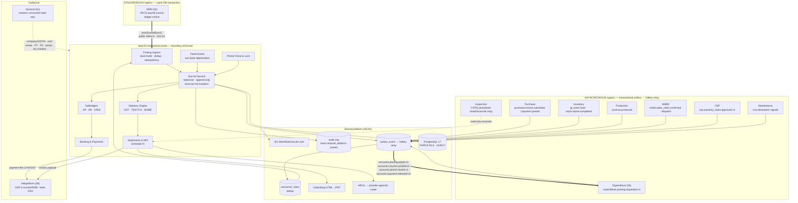

# IND-CORE Module 10 — Accounts and General Ledger

## Engineering Implementation Blueprint

> **Product:** IND-CORE Manufacturing ERP — a multi-tenant SaaS platform for Indian SMB/mid-market manufacturers.
> **Module:** 10 — Accounts (Finance & General Ledger). The ledger of record: chart of accounts, the double-entry journal, AP and AR subledgers, GRNI clearing, statutory ledgers (GST/TDS/TCS), banking and reconciliation, fixed assets and depreciation, period close, and the Schedule III financial statements.
> **Department:** **RASP (People & Money)** — this file sits alongside `HRM-ATTENDANCE.md` and `EXPENDITURE.md` per `NAME.md` §2. Its absence is `NAME.md` Open Item #1: *"Nine modules emit posting events to an 'Accounts stub' that has no blueprint."* This document closes that item.
> **Lineage:** Conforms to **DECISIONS-V2** (binding) — §1 stack, §2 modular-monolith boundaries, §4 AI guardrails, §5 tenancy/RLS/outbox conventions, §6 open critical-path items, §7 demo universe. The V2 baseline is normative, not aspirational: Next.js 15 / React 19, NestJS (Node 22/24 LTS) boundary-enforced modular monolith, PostgreSQL 17 with FORCE RLS and UUIDv7 PKs, Drizzle ORM v1, Keycloak 26 OIDC, Valkey + BullMQ, Gotenberg PDF, OpenTofu IaC, AWS `ap-south-1`, OTel/Grafana/Sentry, and the provider-agnostic AI router behind `AiPort`.
> **Sibling V2 modules (referenced, never re-implemented):** cross-module access is **only** via each module's public `index.ts` or versioned outbox events, enforced by dependency-cruiser in CI. Accounts references **General (01)** for company/GSTIN, cost-centre hierarchy, fiscal calendar, currency/FX, number series and tax masters; **HRM (02)** for the payroll journal; **Expenditure (03/04)** for posting instructions; **CSP (04)** for the warranty-claim register; **Administration (05)** for identity, RBAC/ABAC, W1 workflow, hash-chained audit and the AI governance substrate; **Integrations (06)** for the GSP e-invoice/e-way pipe and bank host-to-host transport; **Purchase**, **Inventory**, **Production**, **SMBD**, **Maintenance** and **Inspection** for the business events that become value in the ledger. Accounts holds logical references only — **no hard FK crosses a module boundary**.

---

## 1. Module Overview

**Module 10 — Accounts** is the system of record for **value in the ledger**. It is not the system of record for any business event. Nine sibling modules decide *what happened* and *what it is worth*; Accounts decides *which accounts move, by how much, in which period, and whether the books balance*. That distinction is the whole design.

The module owns the double-entry general ledger with cost-centre dimensions, the AP and AR subledgers, the GRNI (Goods Received Not Invoiced) clearing account and its reconciliation, the statutory ledgers (GST input/output/RCM, TDS/TCS payable), TDS/TCS deduction **at payment**, bank reconciliation, payment rails, the fixed-asset register with two-book depreciation, period close and fiscal-year lock, FX revaluation, and the **Schedule III Companies Act 2013** financial statements. Around that spine sit the compliance workbenches an Indian SMB actually lives in: a GSTR-1/3B return workbench with **GSTR-2B** reconciliation, a TDS workbench with per-vendor FY accumulators and challan/return tracking, an MSME **43B(h)** ageing clock, and an auditor's read-only trace that satisfies **MCA Rule 11(g)** by inheriting the platform's hash-chained audit log rather than re-implementing it.

### 1.1 The business problem

The demo tenant, **Trishul Precision Components Pvt Ltd**, is the archetype: two plants (Pune-Chakan `27AABCT1234F1Z5`, Coimbatore `33AABCT1234F1Z9`), two GSTINs under one PAN, ~₹28 crore turnover, a part-time CA, and a finance function that survives on Tally plus eleven spreadsheets. The specific failures this module exists to fix:

1. **The ledger is disconnected from the operations that create it.** Stock moves in one system, payroll in another, purchases in a third; the GL is re-keyed monthly from printouts. Every re-key is an error and, since 1 Apr 2023, an **audit-trail gap** under the MCA rules ([ICAI Implementation Guide, 2024](https://eirc-icai.org/uploads/background_materials/Revised%202024_Implementation%20Guide%20on%20Reporting%20of%20Audit%20Trail%20(1)_1712114860.pdf)).
2. **GRNI is an unmanaged black hole.** Goods received but not invoiced accumulate for months. Nobody owns the account, nobody ages it, and at year-end the auditor finds a balance nobody can explain line by line.
3. **ITC leaks in both directions.** Credit is claimed on invoices the supplier never filed — inadmissible under **s.16(2)(aa)** because the invoice never reached GSTR-2B ([ClearTax on s.16(2)(aa)](https://cleartax.in/s/gst-section-162aa-avail-itc)) — and credit is *forgone* because nobody reconciles 2B against the purchase register before the **s.16(4)** window closes (the earlier of 30 November following the FY or the annual-return date, [ClearTax on s.16(4)](https://cleartax.in/s/section-16-4-of-cgst-act)). Since the **July 2025** tax period, the auto-populated liability in GSTR-3B is **hard-locked and non-editable** — corrections must be made in GSTR-1/GSTR-1A *before* filing, which means the reconciliation has to happen upstream of the return, not inside it ([GSTN advisory, hard-locking](https://taxreply.com/gst/GSTN_Advisory_-_Hard_Locking__Non-editable__Auto-populated_liability_in_GSTR-3B_from_July_2025-1563.html)).
4. **TDS is discovered in March.** Thresholds cross mid-year unnoticed; the per-vendor per-section FY accumulator lives in someone's head. Then interest and penalty.
5. **43B(h) turns late payment into a tax cost.** Dues to micro and small enterprises unpaid beyond 15 days (no written agreement) or 45 days (with one) are deductible only on actual payment ([TaxGuru on 43B(h)](https://taxguru.in/income-tax/finance-ministry-clarifies-section-43bh-45-day-msme-payment-rule.html)). Without a live clock on the AP ageing, the deduction is lost silently.
6. **Two depreciation books, one spreadsheet.** Companies Act **Schedule II** useful lives with a 5% residual cap ([CAIRR — Schedule II](https://ca2013.com/schedule/schedule-ii/)) and Income-tax **block-of-assets** WDV rates with the 180-day rule ([ClearTax — depreciation under the Income-tax Act](https://cleartax.in/s/depreciation-income-tax-act)) diverge every single year, and the divergence is the deferred-tax working. Most SMB systems keep one book and reconstruct the other by hand.
7. **Period close is a ritual, not a control.** There is no lock. Prior-period entries appear after the CA has signed. Meanwhile Inventory legitimately reposts FIFO valuation backwards when a backdated entry lands (`INVENTORY.md` FR-INV-015), and nobody has decided what that means for a closed month.

### 1.2 The nine inbound contracts (already specified by the siblings)

These are not proposals. Every row below is quoted from a sibling blueprint that shipped before this one; Accounts implements what they already committed to. They are enumerated again in **§10.4** as wire contracts and tested individually in **§16.2**.

| # | Sibling | Contract as the sibling wrote it | Mode | Accounts' obligation |
|---|---|---|---|---|
| 1 | **Expenditure (03)** | *"Expenditure never keeps a ledger — it emits **posting instructions** (Expense Dr / GST ITC Dr / TDS Payable Cr / AP–Employee-Payable–Advance Cr) via the outbox that Accounts posts"* (§1.1); FR-42: journal-shaped payload written to `outbox_event` in the same transaction, relayed as `expenditure.posting.requested.v1`, *"Accounts acks with a voucher ref (`accounts.posting.acked.v1`)"* | **Async** (outbox) | Consume, validate, post, ack with `voucher_ref`. Honour the instruction lifecycle Pending→Sent→Acked/Failed→dead-letter. TDS section/rate/base **arrive on the instruction**; the **deduction executes at payment, in Accounts** (FR-34) |
| 2 | **HRM (02)** | HR-51: *"GL journal to Accounts on Posted: Dr salary expense by cost centre, Dr employer EPF/ESI expense; Cr net-pay payable, Cr EPF/ESI/PT/TDS payable. **Synchronous, transactional, idempotent**"*; §11.8: *"in **one DB transaction** … the event notifies, it does not post"*; NFR-02: *"`post-journal` replay yields exactly one GL journal"* | **Sync** (in-transaction) | Expose a synchronous, same-transaction posting port. Idempotent on `Idempotency-Key`; replay returns the original voucher, never a second one |
| 3 | **Inventory** | *"`gl_event` rows on every submit/cancel (voucher, account, Dr, Cr, reversal on cancel); warehouse → stock-account mapping; reason-coded adjustments carry the **Section 17(5)(h) ITC-reversal flag**"* (§1 touchpoints); FR-INV-017: *"Cancel = reversal, never deletion"*; every voucher's events balance to zero | **Async** (event/feed) | Ingest the `gl_event` feed; map warehouse→stock account; post exact reversals on cancel; compute and post the **17(5)(h) ITC reversal** when the flag is set. **Inventory owns valuation — Accounts receives value and never recomputes it** |
| 4 | **Purchase** | *"GRNI clearing: Inventory emits Dr Stock / Cr GRNI; Purchase clears Dr GRNI / Cr AP at invoice"* (§1 touchpoints); the seeded **12-account GST matrix** (§9.4); **194Q/393(1)** per-vendor FY accumulator with opening balance (§11.4); **MSME 43B(h)** 15/45-day ageing (§11.7); *"commitment / stock / liability three-posting separation"* | **Async** (outbox) | **Accounts owns the GRNI account, its auto-clearing and its ageing.** Adopt the 12-account GST matrix as seeded chart rows. Own the 194Q/393(1) accumulator of record and the MSME clock on the AP subledger |
| 5 | **Production** | *"Quantity-WIP only in MVP; posting **events** emitted at Manufacture (Dr FG / Cr WIP components at valuation) for a future Finance module. **Variance reconciliation deferred** with NetSuite's 3-transaction WIP cycle as the future reference"* (§1 touchpoints) | **Async** (outbox) | Post Dr FG / Cr WIP at Inventory's valuation on `prod.wo.produced`. Variance accounting is **explicitly out of MVP**; the adoption trigger is stated in §18 |
| 6 | **SMBD** | Sales invoices carry *"everything the Accounts module's e-invoice service needs to build the IRP JSON"* (§11); credit gate reads `GET /accounts/customers/{id}/outstanding`; consumes `accounts.payment.received.v1` | **Async** (outbox) + **sync read** | Own the sales-invoice record, revenue recognition, the AR subledger and customer receipts. Serve the outstanding/credit-exposure read API synchronously (< 500 ms per SMBD's budget) |
| 7 | **CSP** | `csp_warranty_claim` is *"a formal register with GL posting ref"* (§9); portal serves *"read-only signed invoice downloads"* from Accounts | **Async** (outbox) + **read** | Post warranty settlements against the warranty provision and return `gl_posting_ref`. Serve read-only, short-lived signed invoice PDFs scoped to one `customer_account_id` |
| 8 | **Maintenance** | *"Asset financial attributes (acquisition cost, depreciation block, disposal) — **deliberately absent**; owned by Accounts/Expenditure. Maintenance stores an `asset_finance_ref` placeholder only"* (FR-MNT-013); external work routes through Expenditure/Purchase | **Async** (event) | Absorb maintenance cost to the asset and cost centre by **re-dimensioning postings that already exist** (Inventory's spares issue, HRM's labour, Expenditure's AMC bill). **Maintenance never books a payable — Accounts never invents one for it.** Bind `asset_finance_ref` to the FA register |
| 9 | **Inspection (QMS)** | *"COPQ figures are reported here, **posted nowhere** — Accounts owns the ledger"* (§1 touchpoints); FR-QMS-128: *"Every COPQ figure is arithmetic over recorded rows against effective-dated rates — there is no estimation model"* | **Read/reconcile** | Aggregate COPQ against the ledger accounts that actually carry the cost (scrap, rework labour, warranty, freight on returns) and publish the **reconciliation delta**. **Accounts posts nothing for Inspection** — the golden fixture asserts zero journal rows |

### 1.3 Ownership boundary (load-bearing — state it once, enforce it everywhere)

**Accounts owns:**

- The chart of accounts (including the seeded 12-account GST matrix and the GRNI clearing account).
- The general ledger / journal — append-only, reversal-not-mutation.
- The AP subledger (vendor balances, ageing, MSME 43B(h) clock) and the AR subledger (customer balances, ageing, credit exposure).
- **GRNI clearing and its reconciliation/ageing.**
- Statutory ledgers: GST input/output/RCM/cess, TDS and TCS payable by section, ITC-unavailed suspense.
- **TDS/TCS deduction at payment**, challans, and return-file assembly (26Q/27Q/27EQ).
- Bank accounts, bank reconciliation, payment runs, and the **content** of payment files.
- The fixed-asset register and two-book depreciation.
- Period close, fiscal-year lock, reopen, and restatement.
- FX revaluation of monetary balances.
- Financial statements (Schedule III Balance Sheet and Statement of Profit and Loss), trial balance and finance MIS.

**Accounts does NOT own:**

| Thing | Owner | Accounts' relationship |
|---|---|---|
| Supplier master | **Purchase** | Logical reference `vendor_id`; AP subledger keys on it |
| Customer master | **SMBD** | Logical reference `customer_id`; AR subledger keys on it |
| Employee master | **HRM** | Logical reference `employee_id` on employee-payable rows |
| Cost-centre hierarchy, fiscal calendar, company/GSTIN, currency, number series, tax masters | **General** | Consumed read-only by FK-equivalent reference; never copied |
| Stock valuation (FIFO/MA, landed cost, repost) | **Inventory** | Accounts **receives value and never recomputes it** |
| Budgets and budgetary control | **Expenditure** | Accounts posts actuals; the `accounts.posting.acked.v1` ack is what flips Expenditure's ledger bucket `committed → actual` |
| GSP e-invoice/e-way connector, bank host-to-host transport | **Integrations** | Accounts owns the **invoice record** and the **payment-file content**; Integrations owns the pipe, the credentials and the retry/DLQ |
| Physical asset master, maintenance history | **Maintenance** | Accounts owns the *financial* asset; `asset_finance_ref` is the binding |
| COPQ measurement | **Inspection** | Accounts reconciles, does not post |

**The one rule that generalises all of the above: never re-post what a sibling already valued.** If Inventory says the FIFO consumption for DN-2627-00227 is ₹4,650, the ledger says ₹4,650. If HRM says the June payroll gross is ₹7,78,969, the ledger says ₹7,78,969. Accounts validates that a journal **balances**, that its period is **open**, that its accounts **exist and are postable**, and that the instruction is **not a duplicate**. It does not second-guess a sibling's arithmetic, and it never silently "corrects" one — a rejected instruction goes to the failed queue with a reason, visible to both sides.

### 1.4 System context



### 1.5 What this module deliberately does not attempt in MVP

Consolidation across multiple legal entities; Ind AS measurement (see §4.J on applicability); cost accounting / standard-cost variance reconciliation (Production's explicit deferral); budgetary control (Expenditure's); a payments gateway of its own (Integrations owns the transport); GST annual return GSTR-9/9C; transfer pricing; and any AI that produces a number. These are carried into §17 (Anti-goals) and §18 (Roadmap) with adoption triggers.

---

## 2. Objectives

### 2.1 Product objectives (MVP — investor-demo quality, ~12 weeks)

1. **Close the nine-contract hole.** Every posting event the suite already emits lands in a balanced, dated, dimensioned journal with a voucher reference the emitting module can see — and the Expenditure↔Accounts reconciliation screen reads **zero variance** on stage.
2. **Ship dual-mode posting ingress honestly.** HRM's ledger-critical payroll journal posts **synchronously inside HRM's own transaction**; everything else posts **asynchronously through the outbox** with inbox dedup, retry and a visible dead-letter queue. Both modes share one journal writer, one validator and one idempotency contract.
3. **Own GRNI end to end** — auto-clear Purchase invoices against Inventory's GRN postings, age the residue, and make the unexplained balance a number on a screen instead of a year-end surprise.
4. **Make GST defensible.** A GSTR-1/3B workbench fed by the ledger, a **GSTR-2B reconciliation** with matched / value-mismatch / missing-in-2B / missing-in-books buckets, s.16(2)(aa) eligibility gating, s.17(5) blocked-credit and 17(5)(h) reversal handling, and an ITC-at-risk ageing against the s.16(4) window.
5. **Make TDS/TCS boring.** Effective-dated section/rate/threshold config, per-vendor × section × FY accumulators with mid-year crossing detection, deduction executed **at payment**, challan tracking, and 26Q/27Q file assembly.
6. **Run a real fixed-asset register** with **two books** — Schedule II useful lives (pro-rata by days, 5% residual cap) and Income-tax block-of-assets WDV (with the 180-day half-rate rule) — and expose the divergence as the deferred-tax working.
7. **Close periods, and mean it.** A period lock that blocks postings, an explicit reopen with maker-checker and audit, and a documented, tested answer to Inventory's backdated FIFO reposts landing in a closed month.
8. **Produce Schedule III statements** (Balance Sheet, Statement of Profit and Loss) and a trial balance that ties, rendered to PDF through Gotenberg, plus an auditor's read-only trace that satisfies Rule 11(g) by inheriting the platform hash chain.

### 2.2 Engineering objectives

- **The journal is append-only; correction is reversal, never mutation.** Enforced in three layers exactly as Inventory enforces its stock ledger (§9.4): service layer exposes no update/delete, a `BEFORE UPDATE OR DELETE` trigger raises, and the app role has `UPDATE`/`DELETE` revoked on the journal tables.
- **One posting path, two front doors.** `JournalService.post()` is the only code that writes a journal row. The synchronous port and the async consumer both call it; there is no second implementation to drift.
- **Idempotency is structural, not conventional.** A unique `(tenant_id, source_module, source_doc_type, source_doc_id, source_version)` constraint on the voucher table makes "replay yields exactly one journal" a database guarantee, not a code promise.
- **Boundary-enforced modular monolith.** `modules/accounts` exposes cross-module functionality only through its public `index.ts` or outbox events; dependency-cruiser gates CI from sprint 1.
- **Effective-dated everything statutory.** TDS rates/thresholds/section labels, GST rates, depreciation useful lives and rates, MSME day counts, FX rates — INSERT-new-row with `effective_from`, resolved as-of the document date. **Zero statutory constants in code.**
- **Deterministic numbers, always.** Every figure on every screen traces to journal rows. The LLM narrates; it never computes (§13).

### 2.3 Non-goals for MVP

Multi-entity consolidation; Ind AS measurement and disclosures; standard costing and WIP variance reconciliation; GSTR-9/9C; e-invoice IRN generation (Integrations owns the connector; Accounts owns the payload); cash-flow statement (Schedule III requires it only for non-small companies — see §4.J); budgeting; project accounting; and any AI feature that emits a quantity.

### 2.4 Demo success criteria

An investor watches nine sibling modules post into one ledger without a human keying anything; sees a GRNI line auto-clear when Purchase's invoice arrives and an aged one flagged; sees a GSTR-2B reconciliation surface a supplier who has not filed, with the ITC parked rather than claimed; sees a TDS threshold cross mid-invoice and the deduction computed on the excess only; sees the same asset depreciate differently in two books; sees a July journal rejected by the period lock and then permitted after a maker-checker reopen; and sees the trial balance tie to the rupee.

---

## 3. User Personas

All personas act within the demo universe — **Trishul Precision Components Pvt Ltd** (primary) and **Kaveri ElectroFab Industries** (second tenant, RLS leak probes). Permissions follow the platform RBAC + ABAC engine published by Administration: a role grants actions; JSONB scope conditions constrain them (own-plant, own-cost-centre, amount bands, read-only). **Segregation of duties is a first-class design constraint in this module** (§14.3): posting, approving and *releasing payment* are three distinct grants and may not collapse into one person.

| Persona | Demo actor | Primary use in this module |
|---|---|---|
| **Finance Controller** | **Meera Iyer** | Owns the ledger. Reviews the posting inbox and dead-letter queue, approves journals, runs period close, signs off the trial balance and statements, approves payment runs within band |
| **CFO** | (demo role) | Approves payment runs above band, approves period reopen, owns the statements and the MIS narrative |
| **Accounts (composite role)** | Trishul's shared finance login | The demo deck's role model carries a single **"Accounts"** user scoped to **"AP/AR · GST · Reports"**. In IND-CORE this is a *composite grant* — the union of the AP, AR and Statutory permission sets, read-only on everything else, and **explicitly excluding `payment.release`** so the deck's convenience role cannot break segregation of duties (§14.3) |
| **Accounts Executive — AP** | **Ganesh Bhosale** | Vendor bills into the AP subledger, GRNI clearing exceptions, AP ageing and the MSME 43B(h) clock, builds payment runs, computes TDS at payment |
| **Accounts Executive — AR** | **Shalini Pethe** | Sales invoices and credit notes, customer receipts and allocation, AR ageing, credit-exposure answers to SMBD, dunning worklist |
| **Statutory / GST Executive** | **Vaishali Joshi** | GSTR-1/3B workbench, GSTR-2B reconciliation, ITC eligibility and 17(5) blocks, RCM self-invoicing, TDS challans and 26Q/27Q, statutory calendar |
| **External Auditor (read-only)** | **CA Ramesh Athavale**, M/s Athavale & Co. | Traces any figure to its source document and its hash-chained audit rows; exports the Rule 11(g) audit-trail pack, the FA register, the 43B(h) ageing and the CARO 2020 supporting schedules. Cannot post, approve or release anything |
| **Plant Controller** | **S. Nandakumar** (Coimbatore) | Plant P&L and cost-centre view, maintenance cost per asset, GRNI at his plant, capital-asset capitalisation requests. Scoped to his plant's cost centres |
| **System Admin** | (IT role) | Chart-of-accounts governance, effective-dated statutory config, W1 ladders for journal/payment approval, bank-account setup, period-close checklist template, per-tenant AI settings |

### 3.1 Persona goals, pain points & primary screens

- **Finance Controller — Meera Iyer.** *Goals:* one ledger that reconciles to nine modules without a war room; a close that finishes in three days; no surprises at audit. *Pain points:* postings that fail silently; GRNI nobody owns; prior-period entries appearing after sign-off; not knowing whether "the numbers are in" until she asks five people. *Primary screens:* Finance Overview (§7.1), Posting Inbox & Dead-letter (§7.5), GL/Journal Explorer (§7.4), Period-Close Console (§7.12), Financial Statements (§7.13).
- **CFO.** *Goals:* release payments confidently; explain the month in three sentences to the board. *Pain points:* payment runs assembled in Excel; MIS that arrives on the 20th. *Primary screens:* Finance Overview (§7.1), Payment Run (§7.7), Financial Statements & MIS (§7.13).
- **Accounts Executive AP — Ganesh Bhosale.** *Goals:* every vendor bill matched, coded, TDS-correct and paid on the right day; the MSME clock never runs out. *Pain points:* GRNI lines that will not clear because the GRN quantity and the invoice quantity disagree; TDS rate arguments; chasing which invoices are on hold. *Primary screens:* Accounts Payable (§7.2), GRNI Clearing & Ageing (§7.6), Payment Run (§7.7), TDS/TCS Workbench (§7.10).
- **Accounts Executive AR — Shalini Pethe.** *Goals:* receipts allocated the day they land; DSO down; SMBD's credit gate answered instantly and correctly. *Pain points:* part-payments across five invoices; TDS deducted *by* customers that nobody books; credit notes for warranty claims arriving as emails. *Primary screens:* Accounts Receivable (§7.3), GL Explorer (§7.4).
- **Statutory / GST Executive — Vaishali Joshi.** *Goals:* file GSTR-1 and 3B without a reconciliation war room; never claim credit that is not in 2B; deposit TDS by the 7th. *Pain points:* the 3B liability is now hard-locked, so every fix has to happen in GSTR-1/1A first; suppliers who file late and blow the s.16(4) window; the Income-tax Act 2025 renumbering breaking every label. *Primary screens:* GST Return Workbench with 2B reconciliation (§7.9), TDS/TCS Workbench (§7.10), Finance Overview → Costs tab GST panel (§7.1).
- **External Auditor — CA Ramesh Athavale.** *Goals:* pick any number in the Balance Sheet and reach the source document in three clicks; confirm the audit trail was preserved for the retention period as Rule 11(g) requires; get the 43B(h) and PPE schedules as exports. *Pain points:* systems where "audit trail" means a `modified_by` column. *Primary screens:* Audit Trace (§7.14), Fixed-Asset Register (§7.11), everything else read-only.
- **Plant Controller — S. Nandakumar.** *Goals:* know his plant's cost line by line and defend it; get assets capitalised on time. *Pain points:* costs booked centrally with no cost-centre attribution; maintenance spend invisible until quarter-end. *Primary screens:* Finance Overview scoped to plant cost centres (§7.1), GL Explorer (§7.4), Fixed-Asset Register (§7.11).
- **System Admin.** *Goals:* change a TDS rate or add a GL account without a release. *Primary screens:* Settings (§7.15).

**DPDP note:** the ledger contains employee payables and customer identifiers. Access is purpose-limited and ABAC-scoped, access is logged, and the product is positioned as **"DPDP-ready, aligned to DPDP Rules 2025 phase-in (May 2027)"** — never "DPDP compliant" in 2026 collateral. Financial records are subject to the 8-year statutory retention floor, which overrides erasure requests (`dsr_request.status = 'refused_statutory_hold'`, Administration §9.2).

---

## 4. Functional Requirements

Priorities: **M** = MVP, **S** = should (MVP if capacity), **P** = post-MVP. Requirements are `FR-ACC-xxx`, grouped in lettered sub-areas. Every statutory rate, threshold, useful life and section label referenced below is an **effective-dated configuration row**, never a constant in code (NFR-13).

### 4.A Chart of accounts & general ledger

- **FR-ACC-001 (M):** **Chart of accounts** as a tree: `account_code` (tenant-unique), name, `account_type` (`asset | liability | equity | income | expense`), `account_subtype` mapped to a **Schedule III** presentation line (see FR-ACC-110), `is_group` vs postable leaf, parent, `normal_balance` (Dr/Cr), currency, and control flags (`is_control_account`, `subledger` ∈ `{ap, ar, grni, bank, fixed_asset, none}`). Group nodes are never postable (enforced by CHECK + service).
- **FR-ACC-002 (M):** **Seeded India chart** shipped as migration data, including the **12-account GST matrix exactly as Purchase seeded it** (`1451/1452/1453/1454` Input CGST/SGST/IGST/Cess; `2451–2454` Output; `2461–2464` RCM Payable — `PURCHASE.md` §9.4), the **GRNI clearing account**, TDS/TCS payable by section, ITC-unavailed suspense, and stock-account rows matching Inventory's warehouse types (`normal / transit / rejected / scrap / subcontractor`; `customer` warehouses are non-valuated and map to no account).
- **FR-ACC-003 (M):** **Account lifecycle governance.** A postable account that has ever carried a journal line can be **disabled but never deleted or re-typed**; changing `account_type` or `normal_balance` on such an account is rejected (`ACCOUNT_IN_USE`). New accounts and disablements route through W1 (`WorkflowExecutor`) with Controller approval.
- **FR-ACC-004 (M):** **The journal is append-only.** A voucher has a header (`voucher_no`, `voucher_type`, `posting_date`, `period_id`, `narration`, source references, `status`) and ≥2 lines (`account_id`, `debit`, `credit`, `cost_center_id`, plus optional analysis dimensions: `plant_id`, `vendor_id`, `customer_id`, `employee_id`, `asset_id`, `item_ref`, `project_ref`). **Correction is reversal, never mutation** — a posted voucher can only be reversed by a linked mirror voucher (FR-ACC-006). Enforced in three layers (§9.4).
- **FR-ACC-005 (M):** **Balanced-journal invariant.** `Σ debit = Σ credit` per voucher, asserted by a **deferred constraint trigger** at transaction end (the same mechanism Inventory uses on `gl_event`), plus an application-layer pre-check that returns a structured error before the write. Exactly one of `debit`/`credit` is non-zero per line (CHECK).
- **FR-ACC-006 (M):** **Reversal.** `POST /vouchers/{id}/reverse` writes an exact mirror voucher (same accounts, same dimensions, sides swapped) at a caller-chosen posting date (default: original date if its period is open, else the earliest open period — see FR-ACC-095), links `reverses_voucher_id`, and requires a reason. Reversing an already-reversed voucher is rejected.
- **FR-ACC-007 (M):** **Cost-centre dimension is mandatory on every P&L line.** Balance-sheet lines may omit it. Cost centres are consumed read-only from General (`cost_center`, hierarchical, postable vs group); posting to a group node is rejected.
- **FR-ACC-008 (M):** **Manual journal entry** with maker-checker: a manual voucher is created `draft`, submitted through W1, and posted only on a **different** user's approval (SoD, §14.3). Manual vouchers are a small minority by design — the ledger is fed by siblings — and the Posting Inbox surfaces the manual-vs-machine ratio as a control metric.
- **FR-ACC-009 (M):** **Document numbering** from General's `naming_series` (atomic `UPDATE … RETURNING`, gap-free, period-derived, fail-closed at exhaustion): `JV-2627-#####` (journal voucher), `BILL-2627-#####` (AP bill), `INV-2627-#####` (sales invoice), `CN-2627-#####` / `DN-2627-#####` (credit/debit note), `PAY-2627-#####`, `RCPT-2627-#####`, `BRS-2627-###`, `FA-2627-####`.
- **FR-ACC-010 (M):** **Opening balances** imported once per company with a dedicated `opening_balance` voucher type that must itself balance; subledger openings (AP/AR per party, FA per asset, TDS accumulator per vendor) are imported with matching control totals and a reconciliation report that must read zero before the tenant goes live.
- **FR-ACC-011 (S):** **Recurring journals** (depreciation-like accruals, prepaid amortisation) as templates generating draft vouchers on a BullMQ repeatable; never auto-posted above a configured ceiling.
- **FR-ACC-012 (P):** Multi-company consolidation, inter-company elimination, and segment reporting.

### 4.B Posting ingress — dual mode & idempotency

**This is the single most important architectural surface in the module.** Two sibling contracts demand opposite delivery semantics, and both are correct for their case.

- **FR-ACC-020 (M):** **Synchronous ingress (HRM, HR-51).** `modules/accounts` exports, from its **public `index.ts`**, `AccountsPostingPort.postJournalSync(instruction, { idempotencyKey })`. The call **joins the caller's existing DB transaction** — it does not open its own, does not enqueue, and does not return until the journal rows are written. HRM's payroll `post-journal` transition therefore commits the payroll run and the GL journal atomically: either both exist or neither does. This honours `HRM-ATTENDANCE.md` §11.8 verbatim — *"Ledger-critical GL posting stays synchronous in one DB transaction — the event notifies, it does not post."* Latency budget NFR-03.
- **FR-ACC-021 (M):** **Asynchronous ingress (everyone else).** A BullMQ consumer on Valkey subscribes to the relayed outbox topics, writes a `consumer_inbox` dedup row keyed on `(tenant_id, event_id)`, materialises a `posting_instruction` row, and posts through the *same* `JournalService.post()`. Delivery is at-least-once; the inbox makes consumption exactly-once.
- **FR-ACC-022 (M):** **One writer, two doors.** Both modes call `JournalService.post()`. There is no second journal-writing code path anywhere in the module; a dependency-cruiser rule and an architecture test assert that `journal_line` inserts occur in exactly one file.
- **FR-ACC-023 (M):** **Idempotency is a database guarantee.** `journal_voucher` carries `UNIQUE (tenant_id, source_module, source_doc_type, source_doc_id, source_version)` where present, plus `UNIQUE (tenant_id, idempotency_key)`. A replay — synchronous retry, redelivered event, or manual re-drive from the dead-letter queue — hits the constraint, and the service returns the **original** voucher reference with `replayed: true`. A payload whose hash differs from the stored hash for the same key returns **409 `IDEMPOTENCY_PAYLOAD_MISMATCH`**.
- **FR-ACC-024 (M):** **Posting-instruction lifecycle**, mirroring Expenditure's `Pending → Sent → Acked / Failed → dead-letter` (`EXPENDITURE.md` §4.G) from the *receiving* side: `received → validating → posted → acked` on the happy path; `failed` with a machine-readable reason on validation failure; retry with exponential backoff (5 attempts, jittered); then `dead_letter` with an alarm. **Dead-letter items are visible, explicable and re-drivable from the UI (§7.5)** — never a silent drop.
- **FR-ACC-025 (M):** **Acknowledgement.** On successful posting of an Expenditure instruction, Accounts writes `accounts.posting.acked.v1` to its own `outbox_event` **in the same transaction as the journal**, carrying `{ instruction_id, source_doc_type, source_doc_id, voucher_no, voucher_id, posted_at, period }`. Expenditure's Posting Service stores the voucher ref and flips its consumption ledger `committed → actual`. On terminal failure Accounts emits `accounts.posting.failed.v1` with the reason code so the emitting module can surface it rather than waiting forever.
- **FR-ACC-026 (M):** **Validation performed on every instruction, in this order** (first failure wins, all reported with a code): (1) tenant/company resolvable; (2) accounts exist, are postable and belong to the tenant; (3) posting date resolves to a period, and that period is **open** (else `PERIOD_CLOSED`, §4.I); (4) `Σ Dr = Σ Cr` to the paisa; (5) no negative debit or credit; (6) cost centre present and postable on every P&L line; (7) currency consistent with the account, and an FX rate resolvable as-of the posting date for non-INR; (8) duplicate check (FR-ACC-023).
- **FR-ACC-027 (M):** **Accounts never recomputes a sibling's value.** Instructions carry amounts; the module validates structure, not business arithmetic. Where an instruction is internally inconsistent (unbalanced, negative tax, cost centre missing) it is **rejected with a reason and surfaced to the emitting module**, never "fixed" locally.
- **FR-ACC-028 (M):** **Backpressure and ordering.** The async consumer is single-flight per `(tenant_id, source_module)` to keep subledger updates ordered; the synchronous port is never queued. A slow consumer never blocks the synchronous path (separate connection pool slice).
- **FR-ACC-029 (S):** **Replay drive.** An operator with `posting.redrive` may re-drive a dead-letter item after the underlying data is fixed; the re-drive carries the original idempotency key so a partially-succeeded post cannot double.

### 4.C Accounts Payable & vendor payments

- **FR-ACC-030 (M):** **AP subledger.** One open-item row per vendor bill: `vendor_id` (logical ref to Purchase's supplier master), bill no/date, PO ref, GRN refs, taxable value, tax split, TDS deducted/deductible, net payable, due date, `msme_class` + `msme_due_date`, status (`open | partly_paid | paid | held | cancelled`), and `voucher_id` of the posting. Balances reconcile to the AP control account continuously (NFR-05).
- **FR-ACC-031 (M):** **GRNI clearing — Accounts owns the account and the match.** Inventory posts `Dr Stock / Cr GRNI` at GRN (`INVENTORY.md` §11.11). When Purchase's invoice arrives, Accounts posts `Dr GRNI / Cr AP` **and auto-clears** the GRNI open items for the referenced GRN lines (§11.4). Quantity or value differences leave a **residual GRNI open item** with a typed reason (`qty_short | qty_excess | rate_diff | not_yet_invoiced | invoice_without_grn`) — never a silent write-off.
- **FR-ACC-032 (M):** **GRNI ageing report** by vendor and by GRN, bucketed (0–30 / 31–60 / 61–90 / 90+ days), with drill to the GRN and the invoice. Items past a configurable age raise `accounts.grni.aged.v1` to the Controller's worklist. Write-off of an aged GRNI residual is a W1-approved manual journal with mandatory reason, never automatic.
- **FR-ACC-033 (M):** **Bill capture paths:** (a) from `purchase.invoice.submitted` (the normal path — Purchase owns entry, duplicate guard and advisory 3-way match); (b) from `expenditure.posting.requested.v1` for indirect/direct expense invoices; (c) a manual AP bill for the rare document with no upstream (W1-approved). No path bypasses the duplicate guard.
- **FR-ACC-034 (M):** **AP ageing** with the **deck's bucket set — Current · 1–15 d · 16–30 d · 30+ d** — plus a **DPO** trend. Buckets are computed on days past due date, and the bucket edges are configuration, not code.
- **FR-ACC-035 (M):** **MSME 43B(h) clock on the AP subledger.** Vendors classed `micro` or `small` (from Purchase's supplier master) carry a due date of acceptance + **15 days** (no written agreement) or **45 days** (with one) — the day counts are effective-dated config (`PURCHASE.md` seeds `msme_days_no_agreement`/`msme_days_agreement`). Alerts at T-7 / T-3 / T-0; MSME-critical rows sort first in the payment proposal; a year-end 43B(h) disclosure export for the tax auditor.
- **FR-ACC-036 (M):** **Payment run** ("**Run today's payment batch**"): select open items by due date / vendor / MSME criticality / hold status → preview with **TDS computed at payment** (§4.F) and advance adjustment → W1 approval (band-based, Controller then CFO) → **release** (a distinct `payment.release` grant) → payment voucher posted (`Dr AP / Dr TDS-adjustments / Cr Bank`) → payment-file **content** generated and handed to Integrations' `BankFilePort`. Accounts owns the file content and the reconciliation of what came back; **Integrations owns the transport, the credentials, and the retry/DLQ.**
- **FR-ACC-037 (M):** **Payment holds.** An open item can be held (reason: quality, dispute, docs missing, finance hold) and is then invisible to the payment proposal; releasing a hold is logged and permission-gated.
- **FR-ACC-038 (M):** **Vendor advances** and their adjustment against bills (oldest-first by default, overridable with reason); advance-outstanding ageing. Expenditure's employee advances settle through the employee-payable subledger by the same machinery.
- **FR-ACC-039 (M):** **Debit notes** on purchase returns (`purchase.return.issued` → reversal pair) with GST reversal on the ITC already claimed.
- **FR-ACC-040 (S):** Vendor ledger statement (Gotenberg PDF) and balance-confirmation letters for audit.

### 4.D Accounts Receivable & receipts

- **FR-ACC-045 (M):** **Sales invoice as the AR document of record.** Accounts owns the invoice record (number, date, customer, place of supply, HSN-wise lines, rate-wise tax splits, IRN/QR fields when applicable, e-way reference) built from SMBD's dispatch/SO payload — *"SMBD stores everything the Accounts module's e-invoice service needs to build the IRP JSON"* (`SMBD.md` §11). Revenue recognition posts `Dr AR / Cr Revenue / Cr Output GST`; COGS was already posted by Inventory at valuation on the Delivery Note (§1.2 contract 3) and is **not re-posted here**.
- **FR-ACC-046 (M):** **AR subledger** open items per invoice with due date from the customer's terms (Net 30 / Net 45), status (`open | partly_paid | paid | overdue | disputed | written_off`), and the receipt allocations against them.
- **FR-ACC-047 (M):** **AR ageing** with the **deck's bucket set — Current · 1–7 d · 8–15 d · 15+ d** (deliberately tighter than AP's, because collection attention decays faster than payment obligation), plus a **DSO** trend and a **Net 30/45 terms mix**.
- **FR-ACC-048 (M):** **Customer receipts.** Capture (NEFT/RTGS/UPI/cheque/cash) with UTR, allocate across one or many open items (auto-suggest oldest-first, fully overridable), record **TDS deducted by the customer** to `TDS Receivable` (e.g. a customer deducting 194Q/393(1) on our supplies), handle short receipts and on-account balances. Posts `Dr Bank / Dr TDS Receivable / Cr AR`.
- **FR-ACC-049 (M):** **Credit and debit notes** with GST effect, including the **CSP warranty settlement path** (§1.2 contract 7): the credit note is posted against the warranty provision and its `voucher_no` is written back as `csp_warranty_claim.gl_posting_ref`.
- **FR-ACC-050 (M):** **Credit-exposure read API** for SMBD's credit gate: `GET /internal/customers/{id}/outstanding` returning `{ outstanding, overdue, oldest_overdue_days, unallocated_receipts, as_of }` in **< 500 ms p95** (SMBD's stated budget), cache-bypassable on confirm.
- **FR-ACC-051 (M):** **Dunning worklist** ("**Draft dunning emails**"): overdue open items grouped by customer with escalation stage (reminder → firm → final), a Gotenberg-rendered statement attachment, and drafts queued for human send. **Nothing is sent automatically**, and the *contents* of the reminder (amounts, invoice list, ageing) are deterministic SQL — the LLM only phrases the covering note (§13.2).
- **FR-ACC-052 (M):** **Read-only signed invoice PDFs for the CSP portal**, scoped strictly to one `customer_account_id`, delivered as short-lived pre-signed URLs, access-logged. No portal token can reach an internal endpoint (CSP's dedicated Keycloak realm, different issuer and audience).
- **FR-ACC-053 (S):** Customer ledger statement and balance confirmations; write-off workflow with W1 approval and bad-debt provisioning.

### 4.E GST compliance & returns

- **FR-ACC-060 (M):** **Tax ledgers by head and GSTIN.** Input CGST/SGST/IGST/Cess, Output CGST/SGST/IGST/Cess, RCM Payable CGST/SGST/IGST/Cess — the seeded 12-account matrix — maintained **per company GSTIN** (Trishul holds two: Pune-Chakan `27AABCT1234F1Z5` and Coimbatore `33AABCT1234F1Z9`). GSTIN is a required dimension on every tax line.
- **FR-ACC-061 (M):** **GSTR-1 assembly** from the ledger: B2B, B2C-large, B2C-small, credit/debit notes, exports, HSN summary, and document series. Rendered as a review workbench with a downloadable JSON/CSV for the GSP; **Integrations submits, Accounts owns the content.**
- **FR-ACC-062 (M):** **GSTR-3B assembly** with the **hard-locking reality built in**: since the **July 2025** period the auto-populated liability tables (3.1, 3.2) are non-editable on the portal, and corrections must be made in **GSTR-1 / GSTR-1A before filing** ([GSTN advisory](https://taxreply.com/gst/GSTN_Advisory_-_Hard_Locking__Non-editable__Auto-populated_liability_in_GSTR-3B_from_July_2025-1563.html)). The workbench therefore runs its **outward** reconciliation *before* GSTR-1 is filed and presents an **amendment list** — not a 3B adjustment column.
- **FR-ACC-063 (M):** **GSTR-2B reconciliation** — the module's compliance centrepiece. Import the 2B for a period (via Integrations' GSP pipeline or a manual JSON/Excel upload), match against the purchase register on `(supplier_gstin, invoice_no normalised, invoice_date, taxable_value, tax_split)` in three deterministic passes (exact → normalised-number/date-tolerant → fuzzy on value within tolerance), and bucket every line as **matched · value-mismatch · missing-in-2B · missing-in-books**. The match is **arithmetic, never AI** (§13).
- **FR-ACC-064 (M):** **ITC eligibility gate, s.16(2)(aa).** Credit is claimable only where the invoice is present in 2B ([ClearTax](https://cleartax.in/s/gst-section-162aa-avail-itc)). Books-only lines are **parked in `ITC Unavailed (2B pending)`** rather than claimed, and released to the input accounts in the period the invoice appears in 2B.
- **FR-ACC-065 (M):** **ITC-at-risk ageing against s.16(4).** Parked ITC is aged against the s.16(4) outer limit — the earlier of 30 November following the FY or the annual-return date ([ClearTax](https://cleartax.in/s/section-16-4-of-cgst-act)) — with amber/red buckets and a supplier-chase worklist. A parked line that will expire in the current quarter is a Controller alert.
- **FR-ACC-066 (M):** **s.17(5) blocked credits.** ITC eligibility carried on the line as the enum Expenditure already defined (`eligible / blocked_17_5_food / blocked_17_5_motor_vehicle / blocked_17_5_personal / blocked_17_5_club / blocked_other / rcm`); blocked tax is **loaded to cost**, and the ITC register shows claimed-vs-blocked **with reason**. Eligibility is never upgraded by any automated process; upgrades need `itc.override` with a logged reason.
- **FR-ACC-067 (M):** **s.17(5)(h) ITC reversal from Inventory.** When an Inventory `gl_event` carries `itc_reversal_flag = true` (goods lost/stolen/destroyed/written-off/gifted — `INVENTORY.md` FR-INV-042), Accounts computes the reversal on the **flagged value at the item's applicable GST rate as-of the original inward document date** and posts `Dr Stock Adjustment / Cr Input CGST+SGST (or IGST)` in the same voucher, tagged `reversal_reason = 's17_5_h'` so the reversal appears as a distinct line in GSTR-3B table 4(B).
- **FR-ACC-068 (M):** **RCM.** Self-assessed tax on notified inward supplies posts `Dr Input GST / Cr RCM Payable` (net-zero at invoice, per `PURCHASE.md` §11.5); the cash discharge of RCM and the corresponding credit availment are separate, period-dated events in the 3B assembly. RCM self-invoices are generated documents with their own number series.
- **FR-ACC-069 (M):** **GST set-off engine** producing the net cash payable per GSTIN per head, following the statutory utilisation order (IGST credit first against IGST, then CGST, then SGST; CGST and SGST credits not cross-utilisable). The order is **config-driven and effective-dated** because the utilisation rules have changed before.
- **FR-ACC-070 (M):** **GST registers** — purchase register (2B-reconcilable, the form the CA actually asks for), sales register, ITC register (claimed / parked / blocked-with-reason / reversed), RCM register — all Gotenberg-exportable.
- **FR-ACC-071 (P):** GSTR-9/9C annual return assembly; IMS (Invoice Management System) accept/reject/pending actions — Integrations already models the `ims_action_log` pipeline, so Accounts' role is to consume the resulting 2B state; e-invoice IRN generation (Integrations owns the connector).

### 4.F TDS / TCS

- **FR-ACC-075 (M):** **Effective-dated statutory config** for every section: rate(s) by deductee type, single-payment threshold, annual/periodic threshold, section label **and its Income-tax Act 2025 mapping**. Purchase already seeds `tds_goods_section_label` as `194Q` until 31-Mar-2026 and **`393(1)` from 01-Apr-2026**; Accounts consumes the same `statutory_param` semantics. Labels render from config so the renumbering is data, not a release.
- **FR-ACC-076 (M):** **Per-vendor × section × FY accumulators**, with an opening balance for mid-year go-live, updated under `SELECT … FOR UPDATE` so two invoices racing a threshold serialise (Purchase's NFR-04 pattern). Accounts is the **accumulator of record**; Purchase and Expenditure read it through the public interface rather than keeping their own.
- **FR-ACC-077 (M):** **Threshold crossing computes on the excess only** where the statute says so (194Q/393(1): 0.1% above ₹50 lakh per seller per FY, on the excess — `PURCHASE.md` §11.4) and **catches up on the FY aggregate** where it says that instead (194C: on first crossing of the ₹1,00,000 annual aggregate, the full aggregate is taxed). The crossing event is flagged on the exact document and raised to the Statutory Executive's worklist rather than silently chosen.
- **FR-ACC-078 (M):** **Deduction executes at payment, in Accounts.** Expenditure and Purchase carry section, rate and base on their instructions (`EXPENDITURE.md` FR-34: *"deduction executes at payment in Accounts, but section/rate/base travel on the posting instruction"*). At invoice time Accounts records the **deductible** amount; at payment time it **deducts**, posts to the section's TDS Payable account, and reduces the vendor remittance. Where a statute requires deduction at credit-or-payment whichever is earlier, the section's config row carries `deduct_at = 'earlier_of_credit_or_payment'` and the deduction posts at invoice — the behaviour is config, not code.
- **FR-ACC-079 (M):** **s.206AA higher-rate flag** when the vendor has no PAN: the payment preview shows a warning and the computed higher rate; Finance resolves and the decision is logged. **[needs verification]** for the exact rate applicable in FY 2026-27 under the Income-tax Act 2025 — held as an effective-dated config row with a review task, not asserted in code or prose.
- **FR-ACC-080 (M):** **Challan tracking.** TDS deposited by the **7th of the following month** ([Tax2win, TDS due dates](https://tax2win.in/guide/threshold-limit-for-tds)) via challan (ITNS 281 lineage); the workbench shows section-wise liability, deposit due date, challan number/BSR/date once recorded, and an unpaid-liability alert as the 7th approaches. Late-deposit interest is computed and shown, not silently absorbed.
- **FR-ACC-081 (M):** **Return files 26Q / 27Q** (payments other than salary, to residents and non-residents respectively) assembled per quarter with deductee-wise annexures and challan mapping; due **31 Jul / 31 Oct / 31 Jan / 31 May** for Q1–Q4. Form 24Q (salary) is **HRM's**, not this module's — Accounts supplies the challan and the 192 liability, HRM assembles the return.
- **FR-ACC-082 (M):** **TCS 206C(1H)** on sale of goods above the per-buyer FY threshold, with its own accumulator and the 194Q/206C(1H) interaction rule (where the buyer deducts 194Q, the seller does not collect 206C(1H)); the rule is an effective-dated config predicate. **[needs verification]** — the sub-section survives into the Income-tax Act 2025 under a renumbered label; the label is config.
- **FR-ACC-083 (S):** Form 16A generation from the deductee annexure (Gotenberg); lower/nil-deduction certificate (s.197) handling as a vendor-level effective-dated override.
- **FR-ACC-084 (P):** Direct e-filing integration for 26Q/27Q (Integrations' pipe once a TRACES/utility route is chosen).

### 4.G Banking & reconciliation

- **FR-ACC-085 (M):** **Bank account master** per company: bank, branch, IFSC, account number (masked in UI, full value permission-gated), account type (current / cash-credit / OD), GL account binding, opening balance and date, and the payment-file format profile.
- **FR-ACC-086 (M):** **Bank statement import** (CSV/MT940-shaped via Integrations' `BankFilePort`, or manual CSV) into `bank_statement_line` with a `sha256` of each line for duplicate protection; re-importing an overlapping range never duplicates lines.
- **FR-ACC-087 (M):** **Deterministic auto-match** of statement lines to ledger bank-account lines in ordered passes: exact `(amount, date, UTR/cheque no)` → `(amount, ±N days, party)` → `(amount, ±N days)` → unmatched. **The match is arithmetic; only the *explanation* of a near-miss may be narrated by the LLM (§13.3).**
- **FR-ACC-088 (M):** **Reconciliation statement** per account per date: book balance → add unpresented cheques → less deposits in transit → less/add unrecorded bank items → bank statement balance, with the unreconciled items itemised. Items requiring a book entry (bank charges, interest, direct debits) generate **draft journals for approval**, never auto-posted.
- **FR-ACC-089 (M):** **Payment-file content generation** (NEFT/RTGS/UPI bulk formats per bank profile) with a checksum and a control total; the file is handed to Integrations. The **released** payment run is the trigger; **generating a file is not the same as releasing a payment** and the two are separate grants.
- **FR-ACC-090 (M):** **Cash-credit / drawing-power context.** Because Inventory already produces the **CARO 2020 3(ii)(b)** bank stock statement from its ledger (`INVENTORY.md` FR-INV-068), Accounts consumes that figure alongside the AR ageing to show drawing-power headroom against the sanctioned limit. Accounts does not recompute stock value.
- **FR-ACC-091 (S):** Cheque printing and cheque-register with stop-payment; petty-cash/imprest float accounting.

### 4.H Fixed assets & depreciation

- **FR-ACC-095 (M):** **Fixed-asset register.** Asset code (`FA-2627-####`), description, class, cost centre, plant/location, `asset_finance_ref` binding back to Maintenance's asset (`MAINTENANCE.md` FR-MNT-013 placeholder), acquisition document (bill/voucher), **capitalisation date**, **put-to-use date** (the two are distinct and both matter), gross cost, capitalised additions, residual value, status (`capitalised | in_cwip | disposed | written_off`), and the two book profiles below.
- **FR-ACC-096 (M):** **Book 1 — Companies Act, Schedule II.** Useful life per asset class from an **effective-dated `depreciation_class` table** seeded with Schedule II Part C lives (e.g. general plant & machinery **15 years**, furniture & fittings **10 years** — [CAIRR Schedule II](https://ca2013.com/schedule/schedule-ii/)); residual capped at **5%** of cost; SLM or WDV per class; **pro-rata by days from the put-to-use date**. A company may adopt a different useful life with technical justification — the table therefore carries `justification_ref` and the deviation is disclosed.
- **FR-ACC-097 (M):** **Book 2 — Income-tax, block of assets.** Assets are grouped into **blocks** by class and rate (WDV method, Rule 5 / Appendix I — e.g. plant & machinery **15%**, computers **40%**); depreciation computes on the **block WDV**, not per asset; an asset put to use for **less than 180 days** in the year of acquisition attracts **half the normal rate** ([ClearTax](https://cleartax.in/s/depreciation-income-tax-act)). Rates and the 180-day rule are effective-dated config.
- **FR-ACC-098 (M):** **Only Book 1 posts to the GL.** The Income-tax book is a parallel computation whose output feeds the tax working and the **deferred-tax timing difference**; it writes no journal. The register shows both books side by side per asset and per block, with the divergence as an explicit column — this is the "two-book problem" made visible rather than reconstructed in a spreadsheet each March.
- **FR-ACC-099 (M):** **Depreciation run** per period: computes both books, posts Book 1 (`Dr Depreciation & Amortisation / Cr Accumulated Depreciation` by class and cost centre) as a single voucher, and is **idempotent per (company, period, book)** — re-running a posted period returns the existing voucher.
- **FR-ACC-100 (M):** **Capitalisation from CWIP.** Expenditure's CapEx-flagged spend and Purchase's capital POs accumulate in CWIP; a capitalisation action moves the balance to the asset with a capitalisation voucher and starts depreciation from the put-to-use date. (Expenditure explicitly defers full AFE/AuC to post-MVP; Accounts ships the receiving end so the schema does not churn.)
- **FR-ACC-101 (M):** **Disposal and write-off** with profit/loss on sale computed per book (Companies Act: proceeds − WDV; Income-tax: proceeds reduce the **block**, with no per-asset gain unless the block empties or goes negative), GST on sale of used assets, and the corresponding journal.
- **FR-ACC-102 (M):** **CARO 2020 support:** the register is the "proper records of PPE" the auditor tests under CARO clause 3(i), and it is the source for the PPE movement schedule in the statements. Physical-verification results are recorded against assets with date, verifier and discrepancy.
- **FR-ACC-103 (P):** Componentisation (Schedule II component accounting), revaluation model, impairment testing, and lease accounting.

### 4.I Period close & controls

- **FR-ACC-105 (M):** **Accounting periods** consumed from General (`fiscal_year`, `accounting_period`) with Accounts owning the **lock state machine**: `open → soft_closed → closed → (reopened → closed)`; a fiscal year additionally has `year_locked` after statutory sign-off.
  - `open` — all postings allowed.
  - `soft_closed` — sibling-originated postings still allowed (so a late GRN does not break operations), manual journals blocked, and a banner tells everyone the period is closing.
  - `closed` — **all** postings rejected with `PERIOD_CLOSED`, including sibling instructions; instructions land in the failed queue with the reason and a suggested alternate date.
  - `year_locked` — reopen requires CFO approval plus a restatement note (FR-ACC-108).
- **FR-ACC-106 (M):** **Close checklist** as a configurable template instantiated per period, with owner, due date, dependency ordering and evidence links: posting inbox drained to zero, dead-letter empty, GRNI reviewed, bank reconciled, depreciation run, FX revaluation run, GST reconciled, TDS deposited, subledger-to-control-account reconciliation zero, trial balance reviewed. **A period cannot move to `closed` while any mandatory item is incomplete.**
- **FR-ACC-107 (M):** **Reopen** requires a distinct `period.reopen` grant, a mandatory reason, maker-checker (the requester may not approve), and emits `accounts.period.reopened.v1`. Every voucher posted into a reopened period is tagged `posted_after_close = true` and appears on a standing restatement report.
- **FR-ACC-108 (M):** **Backdated postings and Inventory's FIFO reposts — the hard case.** Inventory legitimately reposts valuation of *later* rows when a backdated entry lands, and emits `stock.repost.completed` with value deltas (`INVENTORY.md` §11.5, FR-INV-015). Accounts' rule set is explicit and tested (algorithm in §11.9):
  1. **Quantities are never restated.** Inventory freezes identity and quantity columns; only valuation projections are rewritten. Accounts therefore only ever receives **value corrections**, never quantity corrections.
  2. A value delta whose original posting date falls in an **open** period posts as an ordinary correction voucher **at the original date**, keeping the period's stock value as-of-consistent.
  3. A value delta whose original date falls in a **closed** period posts a correction voucher at the **first open period's opening date**, with `original_posting_date` retained on the header, `restatement_reason = 'inventory_repost'`, and a link to Inventory's `stock_repost_log` row. The closed period's reported figures do not move.
  4. If the aggregate of deferred deltas for a closed period exceeds a **configurable materiality threshold** (default 0.5% of that period's closing stock value), the system raises a **restatement decision task** to the Controller instead of quietly deferring — the choice between "adjust in current period" and "reopen and restate" is a judgement call with audit consequences, and the product surfaces it rather than making it.
  5. Inventory's **backdating window is already configurable (default: current + previous open period only)**; Accounts publishes its open-period set to Inventory through the public interface so the two windows agree, which makes case (3) rare by construction rather than by hope.
  6. The **bank stock statement stays as-of-consistent at every past cutoff** because it reads Inventory's ledger, not the GL; the GL and the stock statement are reconciled on the close checklist and their difference — if any — is exactly the deferred-delta balance, shown as a named line.
- **FR-ACC-109 (M):** **FX revaluation** of monetary foreign-currency balances (AP, AR, bank) at period end using General's effective-dated `exchange_rate` as-of the closing date; posts unrealised gain/loss to a dedicated account and **reverses on the first day of the next period** so realised gain/loss at settlement is not double-counted. Realised gain/loss posts at receipt/payment against the rate used at invoice.

### 4.J Financial statements & MIS

- **FR-ACC-110 (M):** **Schedule III mapping.** Every account carries a `schedule_iii_line` mapping to the prescribed presentation lines of **Division I** (Companies (Accounting Standards) Rules, 2021 — the AS-compliant division applicable to a company below the Ind AS thresholds). Balance Sheet groups into Equity & Liabilities / Assets with the non-current vs current split; the Statement of Profit and Loss into Revenue from operations, Other income, Cost of materials consumed, Changes in inventories, Employee benefits expense, Finance costs, Depreciation & amortisation, Other expenses ([ICAI, Schedule III Division I](https://www.icai.org/resource/56994bos46206cp5annex.pdf); [MCA India Code text](https://upload.indiacode.nic.in/schedulefile?aid=AC_CEN_22_29_00008_201318_1517807327856&rid=10)).
- **FR-ACC-111 (M):** **AS vs Ind AS, stated honestly.** IND-CORE's target customer — an unlisted manufacturer well below **₹250 crore net worth** — prepares under the **Companies (Accounting Standards) Rules, 2021**, i.e. Schedule III **Division I**, not Ind AS ([ClearTax, Ind AS applicability](https://cleartax.in/s/applicability-ind-as)). MVP therefore ships Division I only. Division II (Ind AS) is a **presentation-layer mapping** we can add when a tenant crosses the threshold, but **Ind AS *measurement*** — expected credit loss, fair value, lease capitalisation — is a different product and is explicitly out of scope (§17.5, §18).
- **FR-ACC-112 (M):** **Trial balance** as-of any date with opening / period movement / closing columns, group-node roll-up, cost-centre filter, and a hard assertion that debits equal credits. The TB is the demo's proof-of-life.
- **FR-ACC-113 (M):** **Finance Overview** — the executive money picture, three tabs (**Overview · Cashflow · Costs**), matching the shape of the demo deck's `finance` component so the deck is implementable directly from this blueprint:
  - **KPI tiles:** *Cash position* · *Receivables* (with the overdue split) · *Payables* (with the overdue split) · *Gross margin (MTD)*. Every tile is a deterministic SQL aggregate over journal lines with a drill-through to the rows.
  - **Overview tab:** *Cost by head (MTD)* horizontal bars — **Raw material · Payroll · Power & fuel · Maintenance · Logistics · Other** (a `mis_cost_head` mapping over the chart of accounts, config-driven); *Profitability by product* — margin % per product from revenue and COGS tagged with `item_ref`.
  - **Cashflow tab:** *Cash runway* — weekly **inflow vs outflow** bars built from bank ledger actuals plus scheduled AR due dates and the approved payment-run pipeline; *Cash position trend* — end-of-week bank + cash balances.
  - **Costs tab:** *Cost variance vs plan (MTD)* bars with **deterministic driver attribution** — each variance rupee is attributed to a driver by the dimensions already on the journal line (overtime → HRM's OT component on a payroll line; scrap material → Inventory's scrap reason code; spot-buys → Purchase's emergency-PO flag; DG diesel → the fuel expense head with a downtime-window date filter). *Plan* comes from **Expenditure's budget** read through its public interface — Accounts does not own budgets. Plus a **GST & compliance** panel: the GSTR-1 **mismatch list to amend before the 20th 3B filing** (FR-ACC-062), and a **credit-readiness pack** showing *N of M* evidence items green (GST turnover, order book, AR ageing, capacity utilisation, bank statements, ITR/financials, MSME/Udyam, GSTR-3B filing history, DPO/DSO trend, sanctioned-limit utilisation), **export gated on explicit human approval** — nothing leaves the tenant without a click, and the export is audit-logged.
- **FR-ACC-114 (M):** **Finance MIS** beyond the overview: P&L by cost centre and by plant, expense trend, working-capital cycle (DSO + DIO − DPO), GRNI ageing, ITC captured vs blocked vs parked, TDS by section, MSME exposure, maintenance cost per asset (the ledger side of `MAINTENANCE.md` FR-MNT-104), and the **COPQ reconciliation** (§4.K).
- **FR-ACC-115 (M):** **Scheduled reports** through the platform notification/report service, including the deck's **"AR/AP ageing — daily 18:00"**, plus month-end statement pack, GST registers on the 10th, and TDS liability on the 5th. Schedules are tenant-editable configuration; every scheduled report is also available on demand and renders through Gotenberg.
- **FR-ACC-116 (S):** Comparative-period columns and a Schedule III notes-to-accounts skeleton (ageing schedules for trade receivables/payables and CWIP, which the 2021 amendments made mandatory).
- **FR-ACC-117 (P):** Cash-flow statement (Schedule III/AS 3 — not required for a small company), ratio analysis disclosures, and Division II (Ind AS) presentation mapping.

### 4.K Audit & statutory reporting

- **FR-ACC-120 (M):** **Audit trail inherited, never re-implemented.** Every mutation, approval, posting, reversal, period transition and AI action appends to the platform's hash-chained `audit_log` (`row_hash = SHA256(prev_hash ‖ canonical_payload)` per tenant, INSERT-only grant, guard trigger, verify job, 8-year retention) owned by Administration. Accounts writes to it; it does not own it, cannot disable it, and has no local audit table.
- **FR-ACC-121 (M):** **Rule 11(g) evidence pack.** A one-click export for the statutory auditor: audit-trail feature description, the chain-verification job's latest result for the period, a sample of before/after diffs, the retention configuration, and the assertion that the trail has been preserved for the statutory retention period — the specific matter Rule 11(g) requires the auditor to report on, read against s.128(5) ([Taxmann FAQs on the auditor's duty](https://www.taxmann.com/post/blog/faqs-statutory-auditors-duty-to-report-audit-trails)).
- **FR-ACC-122 (M):** **Audit trace by figure.** From any statement line → its accounts → its journal lines → the source document in the originating module → the `audit_log` rows for both. Three clicks, no SQL.
- **FR-ACC-123 (M):** **CARO 2020 reporting hooks** — data exports for the clauses this module can evidence: PPE records and physical verification (3(i)), the bank stock statement vs books comparison (3(ii)(b), sourced from Inventory), statutory-dues arrears with period and forum (3(vii)), and the auditor-facing 43B(h)/MSME schedule. CARO 2020 carries 21 clauses ([ClearTax on CARO 2020](https://cleartax.in/s/caro-companies-auditors-report-order-2020)); Accounts evidences the ones it holds data for and says so plainly for the rest.
- **FR-ACC-124 (M):** **COPQ reconciliation (Inspection's contract).** Inspection computes COPQ as arithmetic over recorded quantities against effective-dated rates and **posts nothing**. Accounts publishes a reconciliation view: Inspection's COPQ by category (internal failure / external failure / appraisal / prevention) beside the ledger accounts that actually carry cost (scrap write-off, rework labour absorbed, warranty settlements, freight on returns, external calibration spend), with the **delta explained** — a rate-based measure and a booked cost are not the same number, and pretending otherwise is how quality metrics lose credibility. **The golden fixture for this contract asserts that zero journal rows are produced.**
- **FR-ACC-125 (M):** **Accounting-package interop, both directions.** The deck's integration marketplace lists **Tally as a two-way voucher sync** ("sales, purchase and journal entries post automatically"), with **Busy** and **Zoho Books** as further accounting connectors. The seam: **Accounts owns the voucher and journal *content* and the canonical `LedgerEntry` shape in `packages/contracts`; Integrations owns the pipe** — connector credentials, scheduling, retries, DLQ and the vendor-specific file/API dialect. Inbound vouchers from a legacy package land in the **same posting ingress** as any sibling (§4.B) — they are validated, deduped by external reference, and either posted or dead-lettered; they get no privileged path. Outbound export ships as the canonical journal plus a Tally-shaped CSV in MVP; two-way sync is staged in §18 with its adoption trigger.
- **FR-ACC-126 (M):** **CERT-In (live now):** module logs flow to the platform pipeline — ap-south-1 S3, 180-day lifecycle, NIC/NPL-traceable clocks (`chrony → samay1/samay2.nic.in`).
- **FR-ACC-127 (M):** **Statutory calendar** with per-obligation due dates (GSTR-1, GSTR-3B, TDS deposit by the 7th, 26Q/27Q quarterlies, advance tax) and completion state, driving the reminder jobs.

### 4.L Document state models (MVP)

| Document | States |
|---|---|
| Journal voucher | Draft → Submitted → Approved → **Posted** → (Reversed by linked voucher) · Posted is immutable |
| Posting instruction (inbound) | Received → Validating → Posted → Acked / Failed → (retry ×5) → Dead-letter → (Re-driven) |
| AP bill (open item) | Open → Partly-paid → Paid / Held ⇄ Open / Cancelled (by reversal) |
| AR invoice (open item) | Open → Partly-paid → Paid / Overdue overlay / Disputed / Written-off |
| GRNI open item | Open → Cleared / Residual (reason-coded) → Written-off (W1-approved) |
| Payment run | Draft → Submitted → Approved → **Released** → File-generated → Acknowledged / Failed |
| Bank reconciliation | Draft → In-progress → Reconciled (locked with the statement) |
| Fixed asset | Draft → In-CWIP → Capitalised → Disposed / Written-off |
| Accounting period | Open → Soft-closed → Closed ⇄ Reopened → Closed → Year-locked |
| GST return period | Draft → Reconciled → Ready-to-file → Filed (ARN recorded) |
| TDS challan | Due → Paid (challan recorded) → Reported (in 26Q/27Q) |

All transitions requiring human judgement execute through the **W1 engine behind `WorkflowExecutor`** — no direct status writes anywhere; every transition appends to the hash-chained audit log; terminal states are immutable.

---

## 5. Non-functional Requirements

Each is verifiable in CI or staging.

| # | Category | Requirement |
|---|---|---|
| **NFR-01** | Posting throughput | Async posting ingress sustains **≥ 200 vouchers/second/tenant** at ≤ 8 lines per voucher on the seeded 50-tenant load, with consumer lag p95 **< 5 s** from outbox write to `posted`. Measured end to end, not at the queue boundary. |
| **NFR-02** | Posting latency (async) | `posting_instruction` received → acked p95 **< 2 s**, p99 **< 8 s** under normal load. |
| **NFR-03** | **Synchronous-posting latency budget (HRM depends on this)** | `AccountsPostingPort.postJournalSync()` p95 **< 120 ms**, p99 **< 300 ms**, for a payroll journal of up to **500 lines**, executing **inside the caller's transaction**. HRM's payroll-run `post-journal` transition holds its transaction open for this duration, so the budget is a hard SLO with an alarm, not an aspiration. A breach does not degrade to async — it fails the transition, because a payroll run that thinks it posted but did not is worse than one that visibly failed. Contract-tested against both the real service and the fake adapter (TC-05-02). |
| **NFR-04** | Statement/report performance | Trial balance for a 12-month FY at 500k journal lines **< 8 s**; Balance Sheet + P&L **< 10 s**; AP/AR ageing at 5,000 open items **< 2 s**; GSTR-2B reconciliation of 2,000 lines vs 2,200 book lines **< 15 s**. Registers stream server-side (cursor + streamed CSV), never materialised in app memory. |
| **NFR-05** | Consistency invariant | For every period and every control account: `Σ subledger open-item balances = control-account closing balance`. Asserted by a nightly reconciliation job across AP, AR, GRNI, bank and fixed assets; any drift raises a P1. Additionally `Σ debit = Σ credit` across the whole ledger at all times. |
| **NFR-06** | **Immutability** | The journal is append-only, enforced in three layers: (a) the service exposes no update/delete on `journal_voucher` / `journal_line`; (b) a `BEFORE UPDATE OR DELETE` trigger raises unconditionally; (c) `UPDATE`/`DELETE` are **revoked** from `app_user` on both tables. All three are tested independently (TC-09-01). Correction is reversal. |
| **NFR-07** | Idempotency | Every mutating financial endpoint requires `Idempotency-Key`; replay returns the original result; payload-hash mismatch → **409**. `postJournalSync` replay yields **exactly one** journal (HRM's NFR-02, mirrored). |
| **NFR-08** | Auditability (MCA) | Hash-chained, insert-only audit on every mutation, approval, posting, reversal, period transition and AI action; no off-switch; no hard deletes on financial tables; chain-verification job runs nightly and its result is exportable as Rule 11(g) evidence. |
| **NFR-09** | **Retention — 8 years** | Journals, subledgers, invoices, statements, statutory returns, bank statements, payment files, FA register and audit rows retained **8 years** per s.128(5) and the tax rules; retention overrides DPDP erasure (`refused_statutory_hold`). CERT-In logs on the separate 180-day lifecycle. |
| **NFR-10** | **Residency** | All financial data, documents and logs in AWS **`ap-south-1`** (DR `ap-south-2`); daily backups physically in India per the MCA books-of-account rule; PDFs and payment files in S3 ap-south-1 with 8-year lifecycle and short-lived pre-signed URLs only. |
| **NFR-11** | Availability | Pilot 99.5% business hours; ECS Fargate stateless web/worker roles; RDS + ElastiCache managed. **Ledger-critical flows never depend on eventual consistency** — the synchronous port is in-transaction, and the async path is at-least-once with an inbox, never fire-and-forget. |
| **NFR-12** | Tenancy isolation | Every tenant-scoped table under **FORCE RLS** with one simple `tenant_id` policy; app connects only as non-owner `app_user` (NOBYPASSRLS); `SET LOCAL app.tenant_id` per request; CI two-tenant leak probes on every migration; missing-`SET LOCAL` fails closed (zero rows). |
| **NFR-13** | Statutory configurability | Every rate, threshold, section label, useful life, depreciation rate, MSME day count, GST utilisation order and FX rate is an **effective-dated row** resolved as-of the document date. **Zero statutory constants in code**, asserted by a lint rule that fails CI on numeric literals in the statutory packages. |
| **NFR-14** | Segregation of duties | The permission model makes **post**, **approve** and **release payment** mutually exclusive by default; a role holding two of the three requires an explicit, logged tenant override that appears on the SoD exception report (§14.3). |
| **NFR-15** | RLS overhead budget | Week-1 RLS overhead benchmark tracked on the journal write path; **>15–20% flips the platform mitigation trigger** (DECISIONS-V2 §5). |
| **NFR-16** | Observability | OTel traces spanning the sibling's transaction into `postJournalSync`; Grafana dashboards for consumer lag, dead-letter depth, unbalanced-instruction rate, subledger drift; Sentry on every failed posting; NIC-traceable clocks. |
| **NFR-17** | Compliance posture | DPDP-ready, aligned to DPDP Rules 2025 phase-in (May 2027); ABAC scope, ≥1-year access logs, data-principal export hooks — built now, enforced at phase-in. |
| **NFR-18** | AI governance | Per-tenant AI opt-out, daily token budget and kill switch enforced at the router; `ai_action_log` hash-chained; **no AI feature may emit a quantity** — asserted by the golden-set harness (§13.4). Unregistered `task` keys are refused by the router with `422 AI_FEATURE_NOT_REGISTERED`. |

---

## 6. UI/UX Flow

Design language: shadcn/ui, dense-but-calm finance tables, INR lakh/crore formatting (₹3,38,250; ₹38.2 L on tiles), **tabular numerals everywhere numbers align**, Dr/Cr columns right-aligned with a fixed decimal, negative values in parentheses in statement views and with a minus sign in ledger views. Status chips share the platform palette. The single data-grid wrapper decided in week 1 for Expenditure is inherited here; the trial balance, the GL explorer and the GSTR-2B reconciliation are this module's three grid stress-tests.

Three journeys drive the design.

### 6.1 The accounts executive's day

Ganesh (AP) opens **Accounts Payable** (§7.2) as his home. The KPI strip tells him the shape of the day — *Payables · Overdue · Due soon · Scheduled* — and the ageing bars tell him where the pressure is. He sorts by MSME days-left; two rows are red. He opens the **GRNI Clearing** tab (§7.6) because three bills would not auto-clear overnight: one is a quantity short-receipt (the GRN says 780 kg, the bill says 800 kg), one is a rate difference within tolerance that clears with one click, and one is an invoice with no GRN at all, which he routes back to Purchase rather than posting into the void. He runs **"Run today's payment batch"** (§7.7): the preview shows TDS computed at payment per section, advances adjusted, MSME-critical rows first, and one vendor greyed out because he has no PAN and the s.206AA warning is unresolved. He submits; Meera approves; the CFO releases. The file content generates; Integrations takes it from there.

Shalini (AR) opens **Accounts Receivable** (§7.3). Bank has credited ₹9.90 L against an invoice of ₹9.91 L — the difference is TDS the customer deducted. The receipt screen suggests the allocation, she confirms the TDS-receivable split, and the open item closes. She then runs **"Draft dunning emails"**: the ageing produced the list, the ledger produced the amounts, and the LLM produced only the covering sentence — which she edits in two of the four drafts before sending.

Vaishali (Statutory) lives in the **GST Return Workbench** (§7.9) for four days a month. She imports 2B, the deterministic matcher buckets everything, and she works the exceptions: one supplier has not filed (ITC parked, chase task raised), one has filed a different value (₹1,080 short, amendment requested), one invoice is in 2B but not in books (probably keyed against the other GSTIN — she checks). Then she confirms the outward side **before** GSTR-1 goes, because the 3B liability will be hard-locked afterwards.

### 6.2 The month-end close run

Meera opens the **Period-Close Console** (§7.12) on the 1st. The checklist is instantiated with owners and due dates and shows a live blocking state. **Posting inbox: 0 pending, 0 dead-letter** — the first item, and the one that most often is not green, because it depends on nine other modules. **GRNI reviewed** — she signs off the ageing with two residuals explained. **Bank reconciled** — four unreconciled items, one of which spawned a draft journal for bank charges that she approves. **Depreciation run** — one voucher, both books computed, only Book 1 posted. **FX revaluation** — no foreign balances this month, item auto-satisfied with evidence. **GST reconciled** and **TDS deposited** — Vaishali's sign-off, with the challan number as evidence. **Subledger-to-control reconciliation: zero drift** — the nightly job's latest result. Then **trial balance reviewed**, and she moves the period to `soft_closed`. Sibling postings still land; manual journals are blocked. Three days later she moves it to `closed`, and `accounts.period.closed.v1` goes out. Expenditure, Purchase and Inventory all learn that their backdating window just narrowed.

Two days after that, a backdated GRN lands in Inventory and reposts eleven later valuation rows. `stock.repost.completed` arrives with a net value delta of ₹4,180 whose original date is in the closed period. It is below the materiality threshold, so it posts at the opening date of the current period with `restatement_reason = 'inventory_repost'` and appears on the standing restatement report. Nobody's closed month moves. **This is the exact case §11.9 implements and §16.6 tests.**

### 6.3 The auditor's trace

CA Ramesh Athavale logs in with a read-only role and no write grant anywhere in the system. He opens **Financial Statements** (§7.13), picks "Trade payables — total outstanding dues of micro and small enterprises", and clicks the figure. He lands on the AP ageing filtered to MSME vendors, sees the 43B(h) clock per row, and clicks one to reach the bill, its GRN, its PO and its payment. From the bill he opens the **Audit Trace** tab (§7.14) and sees the hash-chained rows — who created it, who approved it, when it posted, what the voucher was, and the chain-verification status for that period. He exports the Rule 11(g) evidence pack and the PPE schedule as PDFs. At no point does he need SQL, a screenshare, or Meera.

---

## 7. Screen-by-Screen Design

Screens **7.1–7.3** implement the three Finance components of the investor deck (`MAINDECK.html` left-nav group `["Finance",["finance","ap","ar"]]`) — same tiles, tabs, ageing buckets, table columns and primary actions. **7.4–7.15** are the ledger machinery beneath them. The traceability map is §7.16.

### 7.1 Finance Overview (`/accounts/finance`) — deck component `finance` 💰

*"The money picture — revenue, costs, profit and cash."*

- **Tabs:** **Overview · Cashflow · Costs**.
- **KPI tiles (all four tabs):**

| Tile | Value | Sub-line | Source |
|---|---|---|---|
| **Cash position** | Bank + cash closing balance | movement note (e.g. "post GST payment") | `journal_line` on bank/cash accounts, as-of today |
| **Receivables** | Total open AR | **overdue split** (₹ and count) | `ar_open_item` |
| **Payables** | Total open AP | **overdue split** (₹ and count) | `ap_open_item` |
| **Gross margin (MTD)** | (Revenue − COGS) / Revenue | ▲/▼ points vs prior month | P&L accounts, MTD |

- **Overview tab:**
  - **Cost by head (MTD)** — horizontal bars over the `mis_cost_head` mapping: **Raw material · Payroll · Power & fuel · Maintenance · Logistics · Other**. Every bar drills to its journal lines.
  - **Profitability by product** — margin % per product, from revenue and Inventory-valued COGS carrying `item_ref`. A falling product margin links to the operational cause where one exists (a downtime window, a scrap spike) via the dimensions on the underlying lines — **the link is a join, not an inference**.
- **Cashflow tab:**
  - **Cash runway** — weekly **inflow vs outflow** grouped bars (₹ L). Inflow = bank credits actual + AR due in the week; outflow = bank debits actual + approved payment-run pipeline + scheduled payroll + statutory dues from the calendar. A caption names the driver of any dip (e.g. payroll overlapping the GST payment date) — the driver is picked by the largest-outflow query, not by a model.
  - **Cash position trend** — end-of-week bank + cash balance line.
- **Costs tab:**
  - **Cost variance vs plan (MTD)** — bars per driver with **deterministic attribution** (§4.J FR-ACC-113): overtime, scrap material, spot-buys, DG diesel, and any other configured driver. Plan comes from Expenditure's budget via its public interface. Each bar drills to the contributing journal lines.
  - **GST & compliance panel** — (a) **GSTR-1 mismatch list to amend before the 20th 3B filing**, with the specific invoices and the defect (missing from return / GSTIN typo / value difference) and a jump into §7.9; (b) **credit-readiness pack**, showing *N of M* evidence items green with a freshness timestamp, a **Preview** action, and an **Export** action that is **gated on an explicit approval dialog** and written to `audit_log` — nothing is shared without a human click.
- **Actions:** period/plant/cost-centre scope selector (ABAC-constrained), Export PDF (Gotenberg), ✦ Ask Copilot (§13.2).
- **Empty/error states:** no postings for the period → "Nothing has posted for {period} yet — check the Posting Inbox" with a direct link (a genuinely informative empty state, since an empty ledger in a live tenant means an ingress problem, not a quiet month).

### 7.2 Accounts Payable (`/accounts/ap`) — deck component `ap` 📤

*"Bills you owe to suppliers and when they are due."*

- **KPI strip:** **Payables** (total open, with open-invoice count) · **Overdue** · **Due soon** · **Scheduled**. Each tile is a filter chip that scopes the table below.
- **AP ageing** — bars by bucket: **Current · 1–15 d · 16–30 d · 30+ d** (₹ L), colour-ramped green→red. Bucket edges are configuration.
- **Days payable outstanding (DPO)** — 6-month trend line.
- **Table columns (exactly the deck's):** **Invoice · Vendor · PO · Value · Due · Ageing · Status**. Additional columns available behind a column picker: MSME class, 43B(h) days-left, TDS section, hold reason, GRNI state, voucher no.
- **Row expand:** the bill with its lines, GST split, TDS deductible, the GRN(s) it cleared, the posting voucher, holds, and the payment history.
- **Primary action:** **▶ Run today's payment batch** → opens the Payment Run builder (§7.7) pre-filtered to due-today plus MSME-critical. Secondary: ✦ Ask Copilot ("Which invoices are overdue?").
- **MSME strip:** a persistent banner above the table when any micro/small vendor is inside 7 days of its 43B(h) clock, naming the vendors and the amounts.
- **Empty/error states:** no open payables → "All settled" with a link to the payment history; a bill that failed to post shows a red row linking to the dead-letter item rather than silently disappearing.

### 7.3 Accounts Receivable (`/accounts/ar`) — deck component `ar` 📨

*"Invoices customers owe you and collection status."*

- **KPI strip:** **Receivables** (total open, with open-invoice count) · **Overdue** · **Open (in terms)**.
- **AR ageing** — bars by bucket: **Current · 1–7 d · 8–15 d · 15+ d**. *These buckets are deliberately tighter than AP's* — a receivable seven days late is already a collection problem, whereas a payable seven days out is simply scheduled. The asymmetry is intentional and is called out in the UI copy.
- **Days sales outstanding (DSO)** — 6-month trend line, with the **Net 30 / Net 45 terms mix** shown alongside so DSO is read against the terms that generated it.
- **Table columns (exactly the deck's):** **Invoice · Customer · SO · Value · Due · Ageing · Status**. Column picker adds: dispute flag, credit-limit utilisation, last receipt date, dunning stage, e-invoice IRN status.
- **Row expand:** invoice lines with HSN and rate-wise tax, the dispatch/SO it came from, receipts allocated, credit notes applied, the posting voucher, and the signed-PDF link.
- **Primary action:** **✉ Draft dunning emails** → generates per-customer drafts with a deterministic invoice schedule attached and a **human-review queue**; nothing sends automatically. Secondary: ✦ Cash position.
- **Credit-exposure inline:** each customer row shows utilisation against the SMBD credit limit — the same number SMBD's credit gate reads, from the same query, so the two surfaces can never disagree.
- **Empty/error states:** no overdue → "Nothing overdue — DSO {n} days against Net {terms}"; a receipt that cannot be allocated sits in an **on-account** tray rather than being force-fit.

### 7.4 GL / Journal Explorer (`/accounts/gl`)

- **Layout:** left rail = chart-of-accounts tree (group/postable, balances inline); right = journal lines with server-side cursor pagination.
- **Filters:** date range, period, account (multi), cost centre, plant, source module, voucher type, party, amount range, `posted_after_close`, `has_reversal`.
- **Key components:** `AccountTree`, `JournalLineGrid` (Dr/Cr columns, running balance when a single account is selected), `VoucherDrawer` (header + all lines + source-document deep link + audit-trail tab).
- **Actions:** open voucher, reverse voucher (permission-gated, reason mandatory), export CSV/PDF, "show me the other side" (jumps to the contra lines of the same voucher).
- **Immutability is visible:** posted vouchers render with a lock icon and no edit affordance anywhere; the only mutating action is **Reverse**, and a reversed voucher shows its mirror inline. This is deliberate UI honesty — users learn the model from the interface.
- **Empty/error states:** a filter with no rows explains which predicate excluded everything.

### 7.5 Posting Inbox & Dead-letter Queue (`/accounts/postings`)

The screen that makes the nine contracts visible. **This is the Controller's first stop every morning and the first item on the close checklist.**

- **Layout:** a lane per source module (Expenditure · HRM · Inventory · Purchase · Production · SMBD · CSP · Maintenance) with counts by state, above a unified table.
- **Table columns:** received-at, source module, source doc type + id, mode (**sync** / **async** chip), amount, state, attempts, voucher no (when posted), latency, reason code (when failed).
- **Row expand:** the raw instruction payload, the Dr/Cr preview rendered as a journal, the validation results with the failing rule highlighted, the `consumer_inbox` dedup key, and the ack that went back.
- **Actions:** retry, **re-drive from dead-letter** (`posting.redrive` grant, carries the original idempotency key), open the source document in its own module, copy the correlation ID.
- **Health strip:** consumer lag, dead-letter depth, unbalanced-instruction rate, manual-vs-machine voucher ratio, and **the sync-port p95 latency against the NFR-03 budget** — because HRM's payroll transition is holding a transaction open on that number.
- **Empty/error states:** dead-letter empty is celebrated with a green state; a dead-letter item older than 24 h is red and named in the close checklist's blocking reason.

### 7.6 GRNI Clearing & Ageing (`/accounts/grni`)

- **Layout:** summary tiles (GRNI balance, auto-cleared this period, residual open, > 60 days) → table of open GRNI items.
- **Table columns:** GRN no + date, vendor, PO, item, GRN value, invoiced value, residual, reason code, age, days-to-alert.
- **Key components:** `GrniMatchPanel` showing the Inventory posting and the Purchase invoice side by side with the difference highlighted and its reason classified (`qty_short | qty_excess | rate_diff | not_yet_invoiced | invoice_without_grn`).
- **Actions:** clear (when within tolerance), request invoice from Purchase, route back to Purchase with a note, propose write-off (raises a W1-approved manual journal — never a one-click write-off).
- **Empty/error states:** a GRNI item whose GRN was cancelled shows the reversal pair and closes itself; an invoice-without-GRN is flagged as a **process defect** rather than an accounting one, and links to Purchase.

### 7.7 Payment Run (`/accounts/payments`)

- **Layout:** builder (left: selection criteria — due-by date, vendor, MSME-critical, exclude-held, minimum amount; right: the proposal) → preview → approval → release.
- **Proposal table:** vendor, bank details (masked), open items selected, gross, advance adjusted, **TDS at payment by section**, net remittance, MSME days-left, warnings (no PAN → s.206AA, bank details incomplete, vendor GSTIN invalid).
- **Key components:** `PaymentProposalGrid`, `TdsAtPaymentPanel` (per-section computation with the accumulator state and the threshold-crossing note), `SodGuardBanner` (names who must approve and who must release, and greys the release button for the person who built the run).
- **Actions:** Build proposal · Submit for approval · Approve (band-gated) · **Release** (distinct grant) · Generate file · Download/hand to Integrations · Cancel run.
- **Demo proof-point:** the release button is disabled for the run's own creator, with a tooltip naming the SoD rule — segregation of duties demonstrated, not asserted.
- **Empty/error states:** a proposal that would breach the cash-credit drawing power shows an amber banner with the headroom figure; a vendor with an unresolved s.206AA warning is excluded from the file with the reason on the row.

### 7.8 Bank Reconciliation (`/accounts/bank-rec`)

- **Layout:** account + date selector → three panes: unmatched statement lines · unmatched book lines · matched pairs.
- **Key components:** `AutoMatchRunner` (shows how many matched in each deterministic pass), `ManualMatchTray` (drag or select-both-then-match, many-to-one supported for part-settlements), `ReconStatementPanel` (the formal book→bank reconciliation with each adjusting item itemised).
- **Actions:** import statement, run auto-match, match/unmatch, **create draft journal** from an unrecorded bank item (charges, interest, direct debit) → routes to approval, finalise reconciliation (locks the statement and the matched set).
- **Empty/error states:** a re-imported overlapping statement range reports "N lines already present (sha256 match), M new"; a finalised reconciliation cannot be edited — only superseded by a later one with a reason.

### 7.9 GST Return Workbench (`/accounts/gst`)

- **Layout:** period + GSTIN selector (Trishul has two) → tabs **GSTR-1 · GSTR-3B · 2B Reconciliation · Registers**.
- **GSTR-1 tab:** section-wise summary (B2B, B2CL, B2CS, CDNR, EXP, HSN, DOCS) with drill to invoices; **outward mismatch/amendment list** surfaced *before* filing, because 3B liability is hard-locked afterwards; export JSON/CSV for the GSP.
- **GSTR-3B tab:** liability as it will auto-populate (read-only by design, mirroring the portal), ITC table 4(A) claimed / 4(B) reversed (including the 17(5)(h) line) / ineligible, the **set-off preview** per head, and the **net cash payable**.
- **2B Reconciliation tab (the centrepiece):** four buckets as tabs — **Matched · Value-mismatch · Missing in 2B · Missing in books** — each with counts and ₹ totals that sum to the control totals shown at the top. Per row: our invoice vs the 2B row, field-level differences highlighted, the match pass that produced it (or why no pass matched), and an action set (accept, park ITC, raise supplier chase, book the missing invoice, mark as other-GSTIN).
- **Key components:** `TwoBMatchGrid`, `ItcParkingPanel` (with the **s.16(4) expiry countdown** per parked line), `BlockedCreditRegister` (claimed vs blocked **with reason**), `RcmSelfInvoicePanel`.
- **Actions:** import 2B, run match, bulk-park, generate supplier-chase emails (drafts only), export registers, mark period reconciled → feeds the close checklist.
- **Empty/error states:** 2B not yet available for the period shows the GSTN publication date and blocks the "reconciled" checklist item with that reason.

### 7.10 TDS / TCS Workbench (`/accounts/tds`)

- **Layout:** FY + quarter selector → tabs **Liability · Accumulators · Challans · Returns**.
- **Liability tab:** section-wise deducted this month, deposited, balance, **deposit due date (7th)** with a countdown, and computed late-deposit interest if applicable.
- **Accumulators tab:** per vendor × section × FY — opening, FY-to-date base, threshold, headroom meter (amber at 90%), crossing date and the exact document that crossed it. **Purchase's supplier card reads this same accumulator through the public interface** rather than keeping its own.
- **Challans tab:** challan number, BSR, date, amount, sections covered, and the mapping to deducted rows.
- **Returns tab:** 26Q / 27Q per quarter with the deductee annexure, validation results, and the file export; due dates 31 Jul / 31 Oct / 31 Jan / 31 May shown against completion. **Form 24Q is HRM's** and is linked, not duplicated.
- **Key components:** `SectionLabelChip` (renders `393(1) [erstwhile 194Q]` from effective-dated config — the Income-tax Act 2025 renumbering is data), `ThresholdMeter`, `CrossingExplainer`.
- **Empty/error states:** a vendor without PAN blocks its rows with the s.206AA resolution task rather than guessing a rate.

### 7.11 Fixed-Asset Register (`/accounts/assets`)

- **Layout:** register table with a class/plant/cost-centre filter → asset detail with **two-book tabs**.
- **Table columns:** asset code, description, class, plant/CC, capitalisation date, put-to-use date, gross cost, **Companies Act: accumulated / WDV / current-year charge**, **Income-tax: block, opening WDV, additions, current-year depreciation**, divergence, status.
- **Asset detail:** acquisition documents, capitalisation voucher, depreciation schedule per book side by side (with the pro-rata day count for Book 1 and the 180-day flag for Book 2 shown explicitly), physical-verification history, `asset_finance_ref` link to Maintenance's asset and its cost-per-asset figure, disposal panel.
- **Actions:** capitalise from CWIP, run depreciation for a period (idempotent), record physical verification, dispose/write-off (W1-approved), export PPE schedule (CARO 3(i) evidence) and the block-wise IT depreciation working.
- **Empty/error states:** an asset capitalised but with no put-to-use date blocks the depreciation run with a named exception rather than assuming a date.

### 7.12 Period-Close Console (`/accounts/close`)

- **Layout:** period timeline strip (12 months with lock state colouring) → the checklist for the selected period → the lock-state control.
- **Checklist rows:** item, owner, due, state, evidence link, and — for incomplete mandatory items — **the specific reason it is blocking** ("Dead-letter queue has 2 items older than 24 h").
- **Key components:** `PeriodLockControl` (open → soft-closed → closed, with the reopen path behind maker-checker and a mandatory reason), `RestatementPanel` (vouchers posted into reopened periods, plus deferred inventory-repost deltas with their original dates), `SubledgerDriftPanel` (the nightly reconciliation result per control account).
- **Actions:** instantiate checklist, complete/reopen an item, soft-close, close, reopen (guarded), download the close pack.
- **Empty/error states:** attempting to close with a blocking item shows the ordered list of blockers, not a generic error.

### 7.13 Financial Statements (`/accounts/statements`)

- **Layout:** statement selector (Balance Sheet · Statement of Profit and Loss · Trial Balance · Cost-centre P&L) + as-of/period + comparative toggle.
- **Presentation:** **Schedule III Division I** line order and captions, with the non-current/current split, note references, and the mandated ageing schedules for trade receivables/payables and CWIP where implemented (FR-ACC-116).
- **Interaction:** **every figure is clickable** — line → constituent accounts → journal lines → source document. This is the auditor's path and the Controller's debugging tool, and it is the same path.
- **Actions:** export PDF (Gotenberg, statutory layout), export CSV, snapshot a signed version at close.
- **Empty/error states:** an unmapped account (no `schedule_iii_line`) is surfaced as a **blocking exception** on the statement header — a statement that silently drops a balance is worse than one that refuses to render.

### 7.14 Audit Trace (`/accounts/audit`)

- **Layout:** search by voucher / document / account / party / date → chronological hash-chained rows with actor, action, before/after diff, source (`human | ai_assisted | system`), IP and session.
- **Key components:** `ChainVerificationBadge` (per-tenant chain status and the latest verify-job result for the period), `Rule11gPackBuilder`, `EvidenceExporter`.
- **Actions:** verify chain for a range, export the **Rule 11(g) evidence pack**, export CARO supporting schedules, export the 43B(h) MSME schedule.
- **Read-only by construction:** the auditor role has no write grant anywhere; the screen has no mutating affordances at all.

### 7.15 Settings (`/accounts/settings`)

Chart of accounts (with Schedule III mapping and the `mis_cost_head` mapping) · effective-dated statutory config (GST rates and utilisation order, TDS/TCS sections with rate/threshold/label and IT-Act-2025 mapping, MSME day counts) · depreciation classes (Schedule II lives + IT blocks and rates) · bank accounts and payment-file profiles · number series binding · W1 ladders for journal/payment/reopen approval · close-checklist template · ageing bucket edges · materiality thresholds · scheduled reports (including **AR/AP ageing — daily 18:00**) · per-tenant AI settings (opt-out, token budget, kill switch — admin only). **Effective-dated tables are insert-new-row: history always visible, past rows immutable.**

### 7.16 MAINDECK Finance traceability

| MAINDECK component | id / icon | Deck elements | Implemented in |
|---|---|---|---|
| **Finance Overview** | `finance` 💰 | Tabs Overview/Cashflow/Costs; tiles Cash position, Receivables, Payables, Gross margin MTD; Cost by head; Profitability by product; Cash runway; Cash position trend; Cost variance vs plan; GST & compliance panel (GSTR-1 mismatches, credit-readiness pack) | **§7.1**, FR-ACC-113, §11.11 (deterministic driver attribution), §13.2 (Copilot prompt "Explain cost increases") |
| **Accounts Payable** | `ap` 📤 | KPI strip Payables/Overdue/Due soon/Scheduled; AP ageing Current/1–15/16–30/30+; DPO trend; columns Invoice·Vendor·PO·Value·Due·Ageing·Status; "Run today's payment batch" | **§7.2**, FR-ACC-030…040, §7.7 (batch), §13.2 (prompt "Which invoices are overdue?") |
| **Accounts Receivable** | `ar` 📨 | KPI strip Receivables/Overdue/Open (in terms); AR ageing Current/1–7/8–15/15+; DSO trend + Net 30/45 mix; columns Invoice·Customer·SO·Value·Due·Ageing·Status; "Draft dunning emails" | **§7.3**, FR-ACC-045…053, §13.2 (prompt "Show today's cash position") |
| Deck role **"Accounts — AP/AR · GST · Reports"** | — | Single composite finance login | §3 personas, **§14.2** composite grant (excludes `payment.release`) |
| Deck scheduled report **"AR/AP ageing — Daily 18:00"** | — | Finance-owned scheduled report | FR-ACC-115, §7.15 |
| Deck integrations **Tally (two-way voucher sync) · Busy · Zoho Books** | — | Accounting connectors | FR-ACC-125 (content vs pipe seam), §18 |

### 7.17 Interaction standards (cross-screen)

| Concern | Standard |
|---|---|
| Numbers | Tabular numerals; INR lakh/crore grouping; ₹ L abbreviations on tiles, full rupees in ledgers; Dr/Cr as separate right-aligned columns; negatives in parentheses on statements, minus-signed in ledgers; **every displayed figure has a drill-through** |
| Immutability | Posted documents render with a lock and **no edit affordance**; the only mutating action is a reason-bearing reversal; reversed documents show their mirror inline |
| Period lock | A closed period is a visible, explained state on every date picker; a rejected posting names the period and offers the earliest open alternative |
| Segregation of duties | Buttons the current user may not press are **shown and disabled with a tooltip naming the rule and the role that can** — never hidden, because hidden controls teach nothing |
| AI presentation | ✦ marks every AI surface; narratives render **beside** the deterministic figures they describe, never in place of them; every AI answer carries its source-query links; a "computed by" affordance shows the SQL-derived numbers |
| Status chips | Gray Draft, blue Submitted/In-approval, green Approved/Posted/Paid/Reconciled, red Rejected/Overdue/Dead-letter, amber Returned/Due-soon/Residual — shared palette |
| Errors | Canonical error envelope `code` drives the copy: `PERIOD_CLOSED`, `UNBALANCED_JOURNAL`, `ACCOUNT_NOT_POSTABLE`, `IDEMPOTENCY_PAYLOAD_MISMATCH`, `SOD_VIOLATION`, `ITC_NOT_IN_2B` |
| Loading | Skeleton rows; long reports stream with progress; no optimistic UI on anything that posts |
| Audit access | Every document detail has an **Audit trail** tab as a stable sub-route |
| Accessibility | Tables collapse to cards < 768 px; keyboard-navigable grids with column-header sort; WCAG AA contrast; the ageing colour ramps carry text labels, not colour alone |

---

## 8. Navigation

### 8.1 Navigation tree

```
Finance  (/accounts)                                        [accounts.read]
├── Finance Overview          /accounts/finance             [finance.read]        💰
│     ├── Overview  · Cashflow · Costs (tabs)
│     └── Credit-readiness pack (preview / approved export) [finance.creditpack]
├── Accounts Payable          /accounts/ap                  [ap.read]             📤
│     ├── GRNI Clearing & Ageing      /accounts/grni        [ap.grni]
│     ├── Payment Run                 /accounts/payments    [payment.build | payment.approve | payment.release]
│     └── MSME 43B(h) Ageing          /accounts/ap/msme     [ap.read]
├── Accounts Receivable       /accounts/ar                  [ar.read]             📨
│     ├── Receipts & Allocation       /accounts/ar/receipts [ar.receipt]
│     └── Dunning Worklist            /accounts/ar/dunning  [ar.dunning]
├── General Ledger            /accounts/gl                  [gl.read]
│     ├── Journal Entry (manual)      /accounts/gl/new      [journal.create]
│     └── Voucher detail              /accounts/gl/vouchers/{no}
├── Posting Inbox             /accounts/postings            [posting.read]
│     └── Dead-letter queue           /accounts/postings?state=dead_letter  [posting.redrive]
├── Banking                   /accounts/bank                [bank.read]
│     └── Bank Reconciliation         /accounts/bank-rec    [bank.reconcile]
├── Statutory                 /accounts/statutory           [statutory.read]
│     ├── GST Return Workbench        /accounts/gst         [gst.read | gst.file]
│     │     └── 2B Reconciliation     /accounts/gst/2b
│     ├── TDS / TCS Workbench         /accounts/tds         [tds.read | tds.challan]
│     └── Statutory Calendar          /accounts/statutory/calendar
├── Fixed Assets              /accounts/assets              [asset.read | asset.manage]
├── Period Close              /accounts/close               [close.read | close.execute | period.reopen]
├── Statements & Reports      /accounts/statements          [report.read]
│     ├── Balance Sheet · P&L · Trial Balance · Cost-centre P&L
│     └── Registers (Purchase · Sales · ITC · TDS · MSME · GRNI · PPE)
├── Audit Trace               /accounts/audit               [audit.read]
└── Settings                  /accounts/settings            [admin.accounts]
      ├── Chart of accounts (+ Schedule III & MIS cost-head mapping)
      ├── Statutory config (effective-dated: GST · TDS/TCS · MSME · set-off order)
      ├── Depreciation classes (Schedule II lives · IT blocks & rates)
      ├── Bank accounts & payment-file profiles
      ├── W1 ladders · close-checklist template · ageing buckets · materiality
      ├── Scheduled reports (incl. AR/AP ageing — daily 18:00)
      └── AI settings (opt-out / token budget / kill switch)
```

The three deck components sit at the top of the group in the deck's own order — **Finance Overview · Accounts Payable · Accounts Receivable** — because that is the order of use, not the order of the data model.

### 8.2 Breadcrumbs & deep links

- Breadcrumbs follow the tree: `Finance › Accounts Payable › GRNI Clearing › GRN-2627-00142`.
- Documents are addressable: `/accounts/gl/vouchers/JV-2627-00318`, `/accounts/ap?vendor={id}&bucket=30plus`, `/accounts/gst/2b?period=2026-07&bucket=missing_in_2b`, `/accounts/assets/FA-2627-0007?book=income_tax`.
- Every document detail exposes an **Audit trail** tab as a stable sub-route, and every statement figure exposes a `?drill=` deep link so a Copilot answer or an email can point at the exact rows behind a number.

### 8.3 Permission-gated visibility

Nodes render only when the RBAC action **and** the ABAC scope allow. Ganesh sees AP, GRNI, Payment Run (build only) and the GL read-only. Shalini sees AR and the GL read-only. Vaishali sees Statutory and the registers. Nandakumar sees Finance Overview and the GL **scoped to his plant's cost centres**, and the FA register filtered to his plant. Ramesh (auditor) sees everything read-only and no mutating control anywhere. The deck's composite **"Accounts"** role sees AP ∪ AR ∪ Statutory ∪ Reports, with `payment.release` withheld. **Next.js middleware performs zero authorization** (CVE-2025-29927 lesson); every gate is enforced in NestJS guards + RLS, and the nav tree renders from server-provided capabilities.

---

## 9. Database Schema (PostgreSQL 17)

Platform conventions (normative, DECISIONS-V2 §5, Administration §9): **UUIDv7 PKs**; every tenant-scoped table carries `tenant_id` + FORCE RLS with one simple policy; composite indexes **lead with `tenant_id`**; rows carry `created_at/by`, `updated_at/by`; **no hard DELETE on financial tables**; monetary columns are `numeric(18,2)` (rates `numeric(18,9)`, quantities `numeric(18,4)`); statutory config is effective-dated INSERT-new-row. Schema is defined in **Drizzle ORM v1** (drizzle-kit migrations) with raw SQL for the sharp edges — the deferred balance trigger, the append-only guards, the grant revocations, and the statement/register aggregations. Repeated convention columns are omitted below.

Masters consumed from siblings (`company`, `company_tax_registration`, `cost_center`, `fiscal_year`, `accounting_period`, `currency`, `exchange_rate`, `tax_code`, `naming_series`, supplier, customer, employee, item, asset) are referenced **by id as a logical reference** — **no hard FK crosses a module boundary**, per DECISIONS-V2 §2. Only intra-module FKs are declared.

### 9.1 The FORCE RLS pattern (applied to every Accounts table)

```sql
ALTER TABLE journal_voucher ENABLE ROW LEVEL SECURITY;
ALTER TABLE journal_voucher FORCE ROW LEVEL SECURITY;
CREATE POLICY tenant_isolation ON journal_voucher
  USING      (tenant_id = current_setting('app.tenant_id')::uuid)
  WITH CHECK (tenant_id = current_setting('app.tenant_id')::uuid);
-- The app connects ONLY as non-owner app_user (NOBYPASSRLS). Per request:
--   BEGIN; SET LOCAL app.tenant_id = '<uuid from JWT>'; ...; COMMIT;
-- A forgotten SET LOCAL returns zero rows, never all rows.
```

The CI harness verifies policy presence on every new table and runs **two-tenant leak probes (Trishul × Kaveri ElectroFab) on every migration**.

### 9.2 Chart of accounts & configuration

```sql
CREATE TYPE account_type_e   AS ENUM ('asset','liability','equity','income','expense');
CREATE TYPE subledger_e      AS ENUM ('none','ap','ar','grni','bank','fixed_asset','employee','tax');
CREATE TYPE normal_balance_e AS ENUM ('debit','credit');

CREATE TABLE gl_account (
  id                uuid PRIMARY KEY DEFAULT uuidv7(),
  tenant_id         uuid NOT NULL,
  company_id        uuid NOT NULL,                       -- logical ref: General.company
  account_code      text NOT NULL,
  name              text NOT NULL,
  account_type      account_type_e   NOT NULL,
  account_subtype   text NOT NULL,                       -- 'trade_payable_msme', 'input_cgst', 'grni', ...
  normal_balance    normal_balance_e NOT NULL,
  parent_id         uuid REFERENCES gl_account(id),
  is_group          boolean NOT NULL DEFAULT false,      -- group nodes are NEVER postable
  subledger         subledger_e NOT NULL DEFAULT 'none',
  currency_code     char(3) NOT NULL DEFAULT 'INR',
  gstin_scoped      boolean NOT NULL DEFAULT false,      -- tax accounts are held per company GSTIN
  schedule_iii_line text,                                -- Division I presentation line (FR-ACC-110)
  mis_cost_head     text,                                -- 'raw_material'|'payroll'|'power_fuel'|
                                                         -- 'maintenance'|'logistics'|'other' (§7.1)
  is_active         boolean NOT NULL DEFAULT true,
  CONSTRAINT ck_group_not_postable CHECK (NOT (is_group AND subledger <> 'none'))
);
CREATE UNIQUE INDEX uq_gl_account_code ON gl_account (tenant_id, company_id, account_code);
CREATE INDEX idx_gl_account_tree      ON gl_account (tenant_id, company_id, parent_id);
CREATE INDEX idx_gl_account_sched     ON gl_account (tenant_id, schedule_iii_line) WHERE is_active;
COMMENT ON TABLE gl_account IS
  'Chart of accounts. An account that has ever carried a journal line may be disabled but never
   deleted, re-typed, or have normal_balance changed (FR-ACC-003, enforced in service + trigger).';

-- Effective-dated statutory configuration. NO statutory constant lives in code (NFR-13).
CREATE TABLE acc_statutory_param (
  id             uuid PRIMARY KEY DEFAULT uuidv7(),
  tenant_id      uuid NOT NULL,
  param_code     text NOT NULL,      -- 'tds.194C.rate_other', 'tds.goods.threshold',
                                     -- 'tds.goods.section_label', 'gst.setoff_order',
                                     -- 'msme.days_agreement', 'itc.s16_4_outer_date_rule'
  jurisdiction   text NOT NULL DEFAULT 'IN',
  value_numeric  numeric(18,4),
  value_text     text,
  value_json     jsonb,
  it_act_2025_ref text,              -- renumbering map, e.g. '393(1)' for erstwhile 194Q
  source_ref     text,               -- provenance for the auditor: notification / circular ref
  effective_from date NOT NULL,
  effective_to   date
);
CREATE UNIQUE INDEX uq_stat_param ON acc_statutory_param (tenant_id, param_code, jurisdiction, effective_from);
CREATE INDEX idx_stat_param_asof   ON acc_statutory_param (tenant_id, param_code, effective_from DESC);
COMMENT ON TABLE acc_statutory_param IS
  'INSERT-new-row only. Past rows are immutable. Resolved AS-OF the document date, never "now".
   A rate change is a data insert, not a release. Includes the Income-tax Act 2025 label mapping.';

CREATE TABLE tds_section_config (
  id                        uuid PRIMARY KEY DEFAULT uuidv7(),
  tenant_id                 uuid NOT NULL,
  section_code              text NOT NULL,               -- '194C','194J','194I','194Q','206C1H'
  section_label             text NOT NULL,               -- rendered label, e.g. '393(1)'
  it_act_2025_section       text,
  deductee_type             text NOT NULL,               -- 'individual_huf'|'other'|'any'
  rate_pct                  numeric(6,3) NOT NULL,
  rate_pct_no_pan           numeric(6,3),                -- s.206AA higher rate (config, see FR-ACC-079)
  single_payment_threshold  numeric(18,2),
  periodic_threshold        numeric(18,2),
  periodic_basis            text NOT NULL DEFAULT 'fy',  -- 'fy'|'month'  (194I moved to a monthly test)
  excess_only               boolean NOT NULL DEFAULT false, -- 194Q/393(1): tax the excess only
  catch_up_on_crossing      boolean NOT NULL DEFAULT false, -- 194C: tax the FY aggregate on crossing
  deduct_at                 text NOT NULL DEFAULT 'payment', -- 'payment'|'earlier_of_credit_or_payment'
  payable_account_id        uuid NOT NULL REFERENCES gl_account(id),
  source_ref                text,
  effective_from            date NOT NULL,
  effective_to              date
);
CREATE UNIQUE INDEX uq_tds_cfg ON tds_section_config
  (tenant_id, section_code, deductee_type, effective_from);

CREATE TABLE depreciation_class (
  id                    uuid PRIMARY KEY DEFAULT uuidv7(),
  tenant_id             uuid NOT NULL,
  class_code            text NOT NULL,                   -- 'PM_GENERAL','BUILDING_FACTORY','COMPUTER',...
  name                  text NOT NULL,
  -- Book 1: Companies Act Schedule II
  ca_useful_life_years  numeric(5,2) NOT NULL,
  ca_residual_pct       numeric(5,2) NOT NULL DEFAULT 5.00,   -- Schedule II caps residual at 5%
  ca_method             text NOT NULL DEFAULT 'SLM',          -- 'SLM'|'WDV'
  ca_justification_ref  text,                                 -- required if life deviates from Sch II
  -- Book 2: Income-tax block of assets
  it_block_code         text NOT NULL,                        -- 'PM_15','COMP_40','BLDG_10',...
  it_rate_pct           numeric(6,3) NOT NULL,
  it_half_rate_days     integer NOT NULL DEFAULT 180,         -- <180 days in year of acquisition ⇒ half
  depreciation_account_id     uuid NOT NULL REFERENCES gl_account(id),
  accumulated_account_id      uuid NOT NULL REFERENCES gl_account(id),
  source_ref            text,
  effective_from        date NOT NULL,
  effective_to          date
);
CREATE UNIQUE INDEX uq_dep_class ON depreciation_class (tenant_id, class_code, effective_from);
COMMENT ON TABLE depreciation_class IS
  'The two-book problem made explicit: Schedule II useful life (Book 1, posts to GL) and the
   Income-tax block rate (Book 2, computation only). Both effective-dated.';

CREATE TABLE warehouse_account_map (               -- Inventory contract: warehouse -> stock account
  id            uuid PRIMARY KEY DEFAULT uuidv7(),
  tenant_id     uuid NOT NULL,
  warehouse_ref uuid NOT NULL,                     -- logical ref: Inventory.warehouse
  warehouse_type text NOT NULL,                    -- normal|transit|rejected|scrap|subcontractor
  account_id    uuid NOT NULL REFERENCES gl_account(id),
  effective_from date NOT NULL
);
CREATE UNIQUE INDEX uq_wh_acct ON warehouse_account_map (tenant_id, warehouse_ref, effective_from);
```

### 9.3 Accounting periods & lock

```sql
CREATE TYPE period_state_e AS ENUM ('open','soft_closed','closed','year_locked');

CREATE TABLE acc_period (
  id                 uuid PRIMARY KEY DEFAULT uuidv7(),
  tenant_id          uuid NOT NULL,
  company_id         uuid NOT NULL,
  fiscal_year_ref    uuid NOT NULL,                -- logical ref: General.fiscal_year
  period_no          smallint NOT NULL CHECK (period_no BETWEEN 1 AND 12),
  name               text NOT NULL,                -- 'Jul-2026'
  start_date         date NOT NULL,
  end_date           date NOT NULL,
  state              period_state_e NOT NULL DEFAULT 'open',
  soft_closed_at     timestamptz, closed_at timestamptz,
  closed_by          uuid,
  reopen_count       smallint NOT NULL DEFAULT 0,
  last_reopen_reason text,
  CHECK (end_date >= start_date)
);
CREATE UNIQUE INDEX uq_period ON acc_period (tenant_id, company_id, fiscal_year_ref, period_no);
CREATE INDEX idx_period_date  ON acc_period (tenant_id, company_id, start_date, end_date);
COMMENT ON COLUMN acc_period.state IS
  'open: all postings. soft_closed: sibling instructions allowed, manual journals blocked.
   closed: ALL postings rejected with PERIOD_CLOSED. year_locked: reopen needs CFO + restatement note.';

CREATE TABLE close_checklist_item (
  id            uuid PRIMARY KEY DEFAULT uuidv7(),
  tenant_id     uuid NOT NULL,
  period_id     uuid NOT NULL REFERENCES acc_period(id),
  seq           smallint NOT NULL,
  code          text NOT NULL,        -- 'posting_inbox_drained','grni_reviewed','bank_reconciled',
                                      -- 'depreciation_run','fx_revaluation','gst_reconciled',
                                      -- 'tds_deposited','subledger_drift_zero','tb_reviewed'
  title         text NOT NULL,
  is_mandatory  boolean NOT NULL DEFAULT true,
  owner_user_id uuid,
  due_at        timestamptz,
  state         text NOT NULL DEFAULT 'pending',   -- pending|in_progress|complete|waived
  evidence_ref  jsonb,                             -- {voucher_no|report_id|challan_no|job_run_id}
  waiver_reason text,
  completed_at  timestamptz, completed_by uuid
);
CREATE UNIQUE INDEX uq_ccl ON close_checklist_item (tenant_id, period_id, code);
```

### 9.4 The journal — append-only, reversal-not-mutation

This is the heart of the module and the place where the design is enforced by the database, not by convention. **Accounts adopts, verbatim, the three-layer append-only discipline Inventory applies to `stock_ledger`** (`INVENTORY.md` NFR-INV-01): the service exposes no mutator, a trigger raises on any `UPDATE`/`DELETE`, and the grant is revoked from the application role.

```sql
CREATE TYPE voucher_status_e AS ENUM ('draft','submitted','approved','posted','reversed');
CREATE TYPE posting_mode_e   AS ENUM ('sync','async','manual','system');

CREATE TABLE journal_voucher (
  id                 uuid PRIMARY KEY DEFAULT uuidv7(),
  tenant_id          uuid NOT NULL,
  company_id         uuid NOT NULL,
  gstin_ref          uuid,                              -- logical ref: company_tax_registration
  voucher_no         text NOT NULL,                     -- 'JV-2627-00318' (General naming_series)
  voucher_type       text NOT NULL,                     -- journal|ap_bill|ar_invoice|payment|receipt|
                                                        -- stock|payroll|depreciation|fx_reval|
                                                        -- opening_balance|credit_note|debit_note|reversal
  posting_date       date NOT NULL,
  period_id          uuid NOT NULL REFERENCES acc_period(id),
  narration          text,
  status             voucher_status_e NOT NULL DEFAULT 'posted',
  posting_mode       posting_mode_e NOT NULL,
  -- Provenance: which sibling produced this, and which of its documents
  source_module      text,                              -- 'expenditure'|'hrm'|'inventory'|'purchase'|
                                                        -- 'production'|'smbd'|'csp'|'maintenance'|
                                                        -- 'accounts'|'tally'
  source_doc_type    text,
  source_doc_id      text,
  source_version     integer NOT NULL DEFAULT 1,
  source_event_id    uuid,                              -- outbox event id (async path)
  idempotency_key    text NOT NULL,
  payload_hash       char(64) NOT NULL,                 -- SHA-256 of the canonical instruction
  -- Reversal & restatement
  reverses_voucher_id  uuid REFERENCES journal_voucher(id),
  reversed_by_voucher_id uuid REFERENCES journal_voucher(id),
  reversal_reason      text,
  posted_after_close   boolean NOT NULL DEFAULT false,
  original_posting_date date,                           -- set when a delta is deferred out of a closed period
  restatement_reason   text,                            -- e.g. 'inventory_repost'
  external_ref         jsonb,                           -- {stock_repost_log_id, grn_no, challan_no, ...}
  total_debit        numeric(18,2) NOT NULL,
  total_credit       numeric(18,2) NOT NULL,
  posted_at          timestamptz NOT NULL DEFAULT now(),
  posted_by          uuid NOT NULL,
  CONSTRAINT ck_voucher_balanced CHECK (total_debit = total_credit),
  CONSTRAINT ck_no_self_reverse  CHECK (reverses_voucher_id IS NULL OR reverses_voucher_id <> id)
);
CREATE UNIQUE INDEX uq_voucher_no    ON journal_voucher (tenant_id, company_id, voucher_no);
CREATE UNIQUE INDEX uq_voucher_idem  ON journal_voucher (tenant_id, idempotency_key);
-- The structural idempotency guarantee: one journal per source document version, forever.
CREATE UNIQUE INDEX uq_voucher_source ON journal_voucher
  (tenant_id, source_module, source_doc_type, source_doc_id, source_version)
  WHERE source_module IS NOT NULL;
CREATE INDEX idx_voucher_period  ON journal_voucher (tenant_id, period_id, posting_date);
CREATE INDEX idx_voucher_date    ON journal_voucher USING brin (posting_date);
CREATE INDEX idx_voucher_source_lookup ON journal_voucher (tenant_id, source_module, source_doc_id);
CREATE INDEX idx_voucher_restated ON journal_voucher (tenant_id, period_id)
  WHERE posted_after_close OR restatement_reason IS NOT NULL;

CREATE TABLE journal_line (
  id             uuid PRIMARY KEY DEFAULT uuidv7(),
  tenant_id      uuid NOT NULL,
  voucher_id     uuid NOT NULL REFERENCES journal_voucher(id),
  line_no        smallint NOT NULL,
  account_id     uuid NOT NULL REFERENCES gl_account(id),
  debit          numeric(18,2) NOT NULL DEFAULT 0 CHECK (debit  >= 0),
  credit         numeric(18,2) NOT NULL DEFAULT 0 CHECK (credit >= 0),
  -- dimensions
  cost_center_ref uuid,                                 -- logical ref: General.cost_center
  plant_ref       uuid,
  gstin_ref       uuid,
  vendor_ref      uuid,                                 -- logical ref: Purchase.supplier
  customer_ref    uuid,                                 -- logical ref: SMBD.customer
  employee_ref    uuid,                                 -- logical ref: HRM.employee
  asset_id        uuid,                                 -- intra-module: fixed_asset
  item_ref        text, project_ref text, warehouse_ref uuid,
  -- currency
  currency_code   char(3) NOT NULL DEFAULT 'INR',
  fx_rate         numeric(18,9) NOT NULL DEFAULT 1,
  fc_amount       numeric(18,2),
  -- statutory tagging carried on the line so registers are queries, not reconstructions
  tax_head        text,                                 -- cgst|sgst|igst|cess
  tax_direction   text,                                 -- input|output|rcm
  itc_eligibility text,                                 -- eligible|blocked_17_5_food|...|rcm
  reversal_reason text,                                 -- 's17_5_h' etc.
  tds_section     text,
  hsn_sac         text,
  memo            text,
  CONSTRAINT ck_one_side CHECK ((debit = 0) <> (credit = 0) OR (debit = 0 AND credit = 0))
);
CREATE INDEX idx_jl_voucher ON journal_line (tenant_id, voucher_id);
CREATE INDEX idx_jl_account ON journal_line (tenant_id, account_id);
CREATE INDEX idx_jl_cc      ON journal_line (tenant_id, cost_center_ref) WHERE cost_center_ref IS NOT NULL;
CREATE INDEX idx_jl_vendor  ON journal_line (tenant_id, vendor_ref)      WHERE vendor_ref IS NOT NULL;
CREATE INDEX idx_jl_customer ON journal_line (tenant_id, customer_ref)   WHERE customer_ref IS NOT NULL;
CREATE INDEX idx_jl_asset   ON journal_line (tenant_id, asset_id)        WHERE asset_id IS NOT NULL;
CREATE INDEX idx_jl_tax     ON journal_line (tenant_id, tax_direction, tax_head)
  WHERE tax_direction IS NOT NULL;

-- ---- LAYER (a): the deferred balance assertion, per voucher, at transaction end ----
CREATE CONSTRAINT TRIGGER trg_voucher_balanced
  AFTER INSERT ON journal_line
  DEFERRABLE INITIALLY DEFERRED
  FOR EACH ROW EXECUTE FUNCTION assert_voucher_balanced();
-- assert_voucher_balanced() raises UNBALANCED_JOURNAL unless
--   SUM(debit) = SUM(credit) AND COUNT(*) >= 2 for NEW.voucher_id.

-- ---- LAYER (b): append-only guard. Correction is reversal, never mutation. ----
CREATE OR REPLACE FUNCTION forbid_ledger_mutation() RETURNS trigger AS $$
BEGIN
  RAISE EXCEPTION 'journal is append-only: correct by posting a reversal voucher (FR-ACC-006)';
END; $$ LANGUAGE plpgsql;

CREATE TRIGGER trg_jl_append_only BEFORE UPDATE OR DELETE ON journal_line
  FOR EACH ROW EXECUTE FUNCTION forbid_ledger_mutation();
-- journal_voucher permits UPDATE of exactly two columns via a narrow trigger path
-- (reversed_by_voucher_id, status -> 'reversed'); everything else raises.
CREATE TRIGGER trg_jv_append_only BEFORE UPDATE OR DELETE ON journal_voucher
  FOR EACH ROW EXECUTE FUNCTION forbid_voucher_mutation_except_reversal_link();

-- ---- LAYER (c): the grant. Even a code bug cannot get past this. ----
REVOKE UPDATE, DELETE, TRUNCATE ON journal_voucher, journal_line FROM app_user;
GRANT  SELECT, INSERT                ON journal_voucher, journal_line TO app_user;
```

All three layers are tested independently (TC-09-01): a raw `UPDATE` as `app_user` must fail at the **grant** level, not merely at the trigger.

### 9.5 Posting ingress — instruction inbox & dedup

```sql
CREATE TYPE instruction_state_e AS ENUM
  ('received','validating','posted','acked','failed','dead_letter','redriven');

CREATE TABLE posting_instruction (
  id              uuid PRIMARY KEY DEFAULT uuidv7(),
  tenant_id       uuid NOT NULL,
  company_id      uuid NOT NULL,
  source_module   text NOT NULL,
  source_event    text,                       -- 'expenditure.posting.requested.v1'
  source_event_id uuid,
  source_doc_type text NOT NULL,
  source_doc_id   text NOT NULL,
  source_version  integer NOT NULL DEFAULT 1,
  posting_mode    posting_mode_e NOT NULL,
  idempotency_key text NOT NULL,
  payload         jsonb NOT NULL,             -- the journal-shaped instruction as received
  payload_hash    char(64) NOT NULL,
  state           instruction_state_e NOT NULL DEFAULT 'received',
  attempts        smallint NOT NULL DEFAULT 0,
  next_attempt_at timestamptz,
  error_code      text,                       -- PERIOD_CLOSED|UNBALANCED_JOURNAL|ACCOUNT_NOT_POSTABLE|...
  error_detail    jsonb,
  voucher_id      uuid REFERENCES journal_voucher(id),
  acked_at        timestamptz,
  received_at     timestamptz NOT NULL DEFAULT now(),
  posted_at       timestamptz,
  latency_ms      integer
);
CREATE UNIQUE INDEX uq_pi_idem   ON posting_instruction (tenant_id, idempotency_key);
CREATE INDEX idx_pi_queue        ON posting_instruction (tenant_id, state, next_attempt_at)
  WHERE state IN ('received','validating','failed');
CREATE INDEX idx_pi_dlq          ON posting_instruction (tenant_id, received_at)
  WHERE state = 'dead_letter';
CREATE INDEX idx_pi_source       ON posting_instruction (tenant_id, source_module, source_doc_id);
COMMENT ON TABLE posting_instruction IS
  'The receiving side of Expenditure''s Pending->Sent->Acked/Failed->dead-letter lifecycle.
   Nothing is ever silently dropped: a terminal failure is a dead_letter row with a reason code,
   visible in the UI (§7.5) and re-drivable with the ORIGINAL idempotency key.';

-- Platform-provided dedup for at-least-once delivery (DECISIONS-V2 §5).
-- Owned by the platform; shown here for the Accounts consumer's usage pattern.
-- consumer_inbox (tenant_id, consumer_name, event_id) UNIQUE — insert-then-process;
-- a duplicate insert short-circuits the handler.
```

### 9.6 Subledgers — AP, AR, GRNI

```sql
CREATE TYPE open_item_status_e AS ENUM
  ('open','partly_paid','paid','held','disputed','written_off','cancelled');

CREATE TABLE ap_open_item (
  id                 uuid PRIMARY KEY DEFAULT uuidv7(),
  tenant_id          uuid NOT NULL, company_id uuid NOT NULL,
  vendor_ref         uuid NOT NULL,                     -- logical ref: Purchase.supplier
  vendor_name_cache  text NOT NULL,                     -- display snapshot; never authoritative
  bill_no            text NOT NULL,                     -- our BILL-2627-#####
  vendor_invoice_no  text, vendor_invoice_date date,
  po_ref             text, grn_refs jsonb,
  voucher_id         uuid NOT NULL REFERENCES journal_voucher(id),
  taxable_value      numeric(18,2) NOT NULL,
  tax_cgst numeric(18,2) NOT NULL DEFAULT 0, tax_sgst numeric(18,2) NOT NULL DEFAULT 0,
  tax_igst numeric(18,2) NOT NULL DEFAULT 0, tax_cess numeric(18,2) NOT NULL DEFAULT 0,
  tds_section        text, tds_deductible numeric(18,2) NOT NULL DEFAULT 0,
  tds_deducted       numeric(18,2) NOT NULL DEFAULT 0,
  gross_payable      numeric(18,2) NOT NULL,
  paid_amount        numeric(18,2) NOT NULL DEFAULT 0,
  outstanding        numeric(18,2) GENERATED ALWAYS AS (gross_payable - paid_amount) STORED,
  due_date           date NOT NULL,
  -- MSME 43B(h)
  msme_class         text,                              -- micro|small|medium|none
  msme_udyam_no      text,
  msme_acceptance_date date,
  msme_clock_days    smallint,                          -- 15 or 45, from effective-dated config
  msme_due_date      date,
  status             open_item_status_e NOT NULL DEFAULT 'open',
  hold_reason        text,
  currency_code      char(3) NOT NULL DEFAULT 'INR', fx_rate numeric(18,9) NOT NULL DEFAULT 1
);
CREATE UNIQUE INDEX uq_ap_bill ON ap_open_item (tenant_id, company_id, bill_no);
CREATE INDEX idx_ap_open   ON ap_open_item (tenant_id, vendor_ref, due_date)
  WHERE status IN ('open','partly_paid','held');
CREATE INDEX idx_ap_msme   ON ap_open_item (tenant_id, msme_due_date)
  WHERE msme_class IN ('micro','small') AND status IN ('open','partly_paid');
CREATE UNIQUE INDEX uq_ap_vendor_invoice ON ap_open_item
  (tenant_id, vendor_ref, vendor_invoice_no, vendor_invoice_date)
  WHERE vendor_invoice_no IS NOT NULL;                  -- duplicate-bill guard, ledger side

CREATE TABLE ar_open_item (
  id                uuid PRIMARY KEY DEFAULT uuidv7(),
  tenant_id         uuid NOT NULL, company_id uuid NOT NULL,
  customer_ref      uuid NOT NULL,                      -- logical ref: SMBD.customer
  customer_name_cache text NOT NULL,
  invoice_no        text NOT NULL,                      -- INV-2627-#####
  invoice_date      date NOT NULL,
  so_ref            text, dispatch_ref text,
  voucher_id        uuid NOT NULL REFERENCES journal_voucher(id),
  taxable_value     numeric(18,2) NOT NULL,
  tax_cgst numeric(18,2) NOT NULL DEFAULT 0, tax_sgst numeric(18,2) NOT NULL DEFAULT 0,
  tax_igst numeric(18,2) NOT NULL DEFAULT 0, tax_cess numeric(18,2) NOT NULL DEFAULT 0,
  gross_receivable  numeric(18,2) NOT NULL,
  received_amount   numeric(18,2) NOT NULL DEFAULT 0,
  tds_by_customer   numeric(18,2) NOT NULL DEFAULT 0,   -- e.g. 194Q/393(1) deducted by the buyer
  outstanding       numeric(18,2) GENERATED ALWAYS AS
                    (gross_receivable - received_amount - tds_by_customer) STORED,
  payment_terms_days smallint NOT NULL, due_date date NOT NULL,
  irn text, irn_date timestamptz, signed_qr_ref text,   -- Integrations fills these; Accounts stores them
  eway_bill_no text,
  dunning_stage     smallint NOT NULL DEFAULT 0,
  status            open_item_status_e NOT NULL DEFAULT 'open'
);
CREATE UNIQUE INDEX uq_ar_invoice ON ar_open_item (tenant_id, company_id, invoice_no);
CREATE INDEX idx_ar_open ON ar_open_item (tenant_id, customer_ref, due_date)
  WHERE status IN ('open','partly_paid','disputed');

CREATE TABLE grni_open_item (                            -- Accounts OWNS this account and its clearing
  id              uuid PRIMARY KEY DEFAULT uuidv7(),
  tenant_id       uuid NOT NULL, company_id uuid NOT NULL,
  grn_ref         text NOT NULL,                         -- Inventory's GRN document no
  grn_line_ref    text NOT NULL,
  grn_date        date NOT NULL,
  vendor_ref      uuid NOT NULL, po_ref text, item_ref text,
  grn_qty         numeric(18,4) NOT NULL,
  grn_value       numeric(18,2) NOT NULL,                -- as valued by INVENTORY. Never recomputed.
  invoiced_qty    numeric(18,4) NOT NULL DEFAULT 0,
  invoiced_value  numeric(18,2) NOT NULL DEFAULT 0,
  residual_value  numeric(18,2) GENERATED ALWAYS AS (grn_value - invoiced_value) STORED,
  residual_reason text,   -- qty_short|qty_excess|rate_diff|not_yet_invoiced|invoice_without_grn
  stock_voucher_id  uuid REFERENCES journal_voucher(id), -- the Dr Stock / Cr GRNI posting
  clear_voucher_id  uuid REFERENCES journal_voucher(id), -- the Dr GRNI / Cr AP posting
  ap_open_item_id   uuid REFERENCES ap_open_item(id),
  status          text NOT NULL DEFAULT 'open',          -- open|cleared|residual|written_off
  written_off_voucher_id uuid REFERENCES journal_voucher(id)
);
CREATE UNIQUE INDEX uq_grni_line ON grni_open_item (tenant_id, grn_ref, grn_line_ref);
CREATE INDEX idx_grni_ageing ON grni_open_item (tenant_id, grn_date)
  WHERE status IN ('open','residual');
CREATE INDEX idx_grni_vendor ON grni_open_item (tenant_id, vendor_ref) WHERE status <> 'cleared';

CREATE TABLE settlement (                                -- payments, receipts and their allocations
  id              uuid PRIMARY KEY DEFAULT uuidv7(),
  tenant_id       uuid NOT NULL,
  kind            text NOT NULL,                         -- payment|receipt|advance_adjust|credit_note
  voucher_id      uuid NOT NULL REFERENCES journal_voucher(id),
  ap_open_item_id uuid REFERENCES ap_open_item(id),
  ar_open_item_id uuid REFERENCES ar_open_item(id),
  amount          numeric(18,2) NOT NULL,
  tds_amount      numeric(18,2) NOT NULL DEFAULT 0,
  settled_on      date NOT NULL,
  CONSTRAINT ck_one_side_settled CHECK (num_nonnulls(ap_open_item_id, ar_open_item_id) = 1)
);
CREATE INDEX idx_settlement_ap ON settlement (tenant_id, ap_open_item_id);
CREATE INDEX idx_settlement_ar ON settlement (tenant_id, ar_open_item_id);
```

### 9.7 Tax ledgers — GST, TDS/TCS

```sql
CREATE TABLE gst_return_period (
  id            uuid PRIMARY KEY DEFAULT uuidv7(),
  tenant_id     uuid NOT NULL, company_id uuid NOT NULL,
  gstin_ref     uuid NOT NULL, gstin char(15) NOT NULL,
  period_yyyymm char(6) NOT NULL,
  gstr1_state   text NOT NULL DEFAULT 'draft',   -- draft|reconciled|ready|filed
  gstr1_arn     text, gstr1_filed_at timestamptz,
  gstr3b_state  text NOT NULL DEFAULT 'draft',
  gstr3b_arn    text, gstr3b_filed_at timestamptz,
  twob_imported_at timestamptz, twob_source text, -- 'gsp'|'manual_upload'
  net_cash_cgst numeric(18,2), net_cash_sgst numeric(18,2),
  net_cash_igst numeric(18,2), net_cash_cess numeric(18,2)
);
CREATE UNIQUE INDEX uq_gst_period ON gst_return_period (tenant_id, gstin_ref, period_yyyymm);

CREATE TABLE gstr2b_line (                       -- as published by GSTN; never edited, only matched
  id             uuid PRIMARY KEY DEFAULT uuidv7(),
  tenant_id      uuid NOT NULL,
  gst_return_period_id uuid NOT NULL REFERENCES gst_return_period(id),
  supplier_gstin char(15) NOT NULL, supplier_name text,
  invoice_no     text NOT NULL, invoice_date date NOT NULL, invoice_type text,
  taxable_value  numeric(18,2) NOT NULL,
  cgst numeric(18,2) NOT NULL DEFAULT 0, sgst numeric(18,2) NOT NULL DEFAULT 0,
  igst numeric(18,2) NOT NULL DEFAULT 0, cess numeric(18,2) NOT NULL DEFAULT 0,
  itc_availability text,                         -- as flagged by GSTN
  source_hash    char(64) NOT NULL               -- import idempotency
);
CREATE UNIQUE INDEX uq_2b_line ON gstr2b_line (tenant_id, gst_return_period_id, source_hash);
CREATE INDEX idx_2b_match_key ON gstr2b_line (tenant_id, supplier_gstin, invoice_date, taxable_value);

CREATE TYPE match_bucket_e AS ENUM ('matched','value_mismatch','missing_in_2b','missing_in_books');

CREATE TABLE itc_reconciliation (
  id               uuid PRIMARY KEY DEFAULT uuidv7(),
  tenant_id        uuid NOT NULL,
  gst_return_period_id uuid NOT NULL REFERENCES gst_return_period(id),
  ap_open_item_id  uuid REFERENCES ap_open_item(id),    -- books side (null ⇒ missing_in_books)
  gstr2b_line_id   uuid REFERENCES gstr2b_line(id),     -- 2B side  (null ⇒ missing_in_2b)
  bucket           match_bucket_e NOT NULL,
  match_pass       smallint,                            -- 1 exact | 2 normalised | 3 tolerant
  books_itc        numeric(18,2) NOT NULL DEFAULT 0,
  twob_itc         numeric(18,2) NOT NULL DEFAULT 0,
  delta_itc        numeric(18,2) GENERATED ALWAYS AS (books_itc - twob_itc) STORED,
  action           text,                                -- claim|park|chase_supplier|book_invoice|other_gstin
  parked_voucher_id uuid REFERENCES journal_voucher(id),
  s16_4_outer_date date,                                -- ITC-at-risk expiry (FR-ACC-065)
  resolved_at      timestamptz, resolved_by uuid, note text
);
CREATE INDEX idx_itc_recon_bucket ON itc_reconciliation (tenant_id, gst_return_period_id, bucket);
CREATE INDEX idx_itc_at_risk      ON itc_reconciliation (tenant_id, s16_4_outer_date)
  WHERE action = 'park';

CREATE TABLE tds_accumulator (                   -- Accounts is the accumulator OF RECORD (FR-ACC-076)
  id               uuid PRIMARY KEY DEFAULT uuidv7(),
  tenant_id        uuid NOT NULL, company_id uuid NOT NULL,
  party_ref        uuid NOT NULL,                -- vendor (TDS) or customer (TCS)
  party_kind       text NOT NULL DEFAULT 'vendor',
  section_code     text NOT NULL,
  fy_start_year    smallint NOT NULL,            -- 2026 = FY 2026-27
  opening_base     numeric(18,2) NOT NULL DEFAULT 0,   -- mid-year go-live
  cumulative_base  numeric(18,2) NOT NULL DEFAULT 0,
  tds_deducted     numeric(18,2) NOT NULL DEFAULT 0,
  threshold_crossed_at date,
  crossing_doc_ref text,
  crossing_reviewed_by uuid, crossing_reviewed_at timestamptz
);
CREATE UNIQUE INDEX uq_tds_acc ON tds_accumulator
  (tenant_id, company_id, party_ref, section_code, fy_start_year);
COMMENT ON TABLE tds_accumulator IS
  'Updated under SELECT ... FOR UPDATE inside the payment/invoice transaction so two documents
   racing a threshold serialise (TC-11-04). Purchase and Expenditure READ this through the
   public index.ts rather than keeping private copies.';

CREATE TABLE tds_challan (
  id            uuid PRIMARY KEY DEFAULT uuidv7(),
  tenant_id     uuid NOT NULL, company_id uuid NOT NULL,
  tan           text NOT NULL,
  challan_no    text, bsr_code text, deposit_date date,
  period_yyyymm char(6) NOT NULL,
  amount        numeric(18,2) NOT NULL,
  interest      numeric(18,2) NOT NULL DEFAULT 0,
  sections      jsonb NOT NULL,                  -- [{section, base, tds}]
  due_date      date NOT NULL,                   -- 7th of the following month, from config
  state         text NOT NULL DEFAULT 'due',     -- due|paid|reported
  voucher_id    uuid REFERENCES journal_voucher(id)
);
CREATE INDEX idx_challan_due ON tds_challan (tenant_id, due_date) WHERE state = 'due';
```

### 9.8 Banking

```sql
CREATE TABLE bank_account (
  id             uuid PRIMARY KEY DEFAULT uuidv7(),
  tenant_id      uuid NOT NULL, company_id uuid NOT NULL,
  gl_account_id  uuid NOT NULL REFERENCES gl_account(id),
  bank_name text NOT NULL, branch text, ifsc char(11) NOT NULL,
  account_no_enc bytea NOT NULL,                 -- encrypted at rest; masked in UI, full value gated
  account_no_last4 char(4) NOT NULL,
  account_type   text NOT NULL,                  -- current|cash_credit|od
  sanctioned_limit numeric(18,2),                -- for drawing-power context (FR-ACC-090)
  payment_file_profile text NOT NULL,            -- bank-specific format key, resolved by Integrations
  opening_balance numeric(18,2) NOT NULL DEFAULT 0, opening_date date NOT NULL
);

CREATE TABLE bank_statement_line (
  id             uuid PRIMARY KEY DEFAULT uuidv7(),
  tenant_id      uuid NOT NULL,
  bank_account_id uuid NOT NULL REFERENCES bank_account(id),
  txn_date date NOT NULL, value_date date,
  description text NOT NULL, ref_no text,        -- UTR / cheque no
  debit numeric(18,2) NOT NULL DEFAULT 0, credit numeric(18,2) NOT NULL DEFAULT 0,
  running_balance numeric(18,2),
  line_hash char(64) NOT NULL,                   -- duplicate-import protection
  matched_journal_line_id uuid REFERENCES journal_line(id),
  match_pass smallint, matched_at timestamptz, matched_by uuid
);
CREATE UNIQUE INDEX uq_bsl ON bank_statement_line (tenant_id, bank_account_id, line_hash);
CREATE INDEX idx_bsl_unmatched ON bank_statement_line (tenant_id, bank_account_id, txn_date)
  WHERE matched_journal_line_id IS NULL;

CREATE TABLE bank_reconciliation (
  id              uuid PRIMARY KEY DEFAULT uuidv7(),
  tenant_id       uuid NOT NULL,
  bank_account_id uuid NOT NULL REFERENCES bank_account(id),
  recon_no        text NOT NULL,                 -- BRS-2627-###
  as_of_date      date NOT NULL,
  book_balance    numeric(18,2) NOT NULL,
  bank_balance    numeric(18,2) NOT NULL,
  unpresented_cheques numeric(18,2) NOT NULL DEFAULT 0,
  deposits_in_transit numeric(18,2) NOT NULL DEFAULT 0,
  unrecorded_items    numeric(18,2) NOT NULL DEFAULT 0,
  unreconciled_count  integer NOT NULL DEFAULT 0,
  state           text NOT NULL DEFAULT 'draft', -- draft|in_progress|reconciled
  finalised_at timestamptz, finalised_by uuid
);
CREATE UNIQUE INDEX uq_brs ON bank_reconciliation (tenant_id, recon_no);

CREATE TABLE payment_run (
  id            uuid PRIMARY KEY DEFAULT uuidv7(),
  tenant_id     uuid NOT NULL, company_id uuid NOT NULL,
  run_no        text NOT NULL,                   -- PAY-2627-#####
  bank_account_id uuid NOT NULL REFERENCES bank_account(id),
  value_date    date NOT NULL,
  state         text NOT NULL DEFAULT 'draft',   -- draft|submitted|approved|released|file_generated|
                                                 -- acknowledged|failed|cancelled
  total_gross numeric(18,2) NOT NULL DEFAULT 0,
  total_tds   numeric(18,2) NOT NULL DEFAULT 0,
  total_net   numeric(18,2) NOT NULL DEFAULT 0,
  built_by uuid NOT NULL, approved_by uuid, released_by uuid,
  file_object_key text, file_checksum char(64),
  workflow_instance_id uuid,                     -- W1
  CONSTRAINT ck_sod_build_release CHECK (released_by IS NULL OR released_by <> built_by),
  CONSTRAINT ck_sod_approve_release CHECK (released_by IS NULL OR approved_by IS NULL
                                           OR released_by <> approved_by OR approved_by <> built_by)
);
CREATE UNIQUE INDEX uq_payrun ON payment_run (tenant_id, run_no);

CREATE TABLE payment_run_line (
  id              uuid PRIMARY KEY DEFAULT uuidv7(),
  tenant_id       uuid NOT NULL,
  payment_run_id  uuid NOT NULL REFERENCES payment_run(id),
  ap_open_item_id uuid NOT NULL REFERENCES ap_open_item(id),
  gross numeric(18,2) NOT NULL, advance_adjusted numeric(18,2) NOT NULL DEFAULT 0,
  tds_section text, tds_amount numeric(18,2) NOT NULL DEFAULT 0,
  net numeric(18,2) NOT NULL,
  warning_codes jsonb,                           -- ['NO_PAN_206AA','BANK_DETAILS_INCOMPLETE',...]
  excluded boolean NOT NULL DEFAULT false, exclusion_reason text
);
CREATE UNIQUE INDEX uq_prl ON payment_run_line (tenant_id, payment_run_id, ap_open_item_id);
```

The `ck_sod_*` CHECK constraints are a deliberate belt-and-braces on top of the permission model: **the database itself refuses a payment run built and released by the same person.** Segregation of duties is not left to a guard that someone may one day bypass.

### 9.9 Fixed assets

```sql
CREATE TABLE fixed_asset (
  id                 uuid PRIMARY KEY DEFAULT uuidv7(),
  tenant_id          uuid NOT NULL, company_id uuid NOT NULL,
  asset_code         text NOT NULL,                     -- FA-2627-####
  description        text NOT NULL,
  depreciation_class_id uuid NOT NULL REFERENCES depreciation_class(id),
  cost_center_ref    uuid NOT NULL, plant_ref uuid,
  asset_finance_ref  uuid,                              -- binds Maintenance's asset (FR-MNT-013)
  acquisition_voucher_id uuid REFERENCES journal_voucher(id),
  capitalisation_date date,
  put_to_use_date    date,                              -- distinct from capitalisation; both matter
  gross_cost         numeric(18,2) NOT NULL,
  residual_value     numeric(18,2) NOT NULL,
  gl_asset_account_id uuid NOT NULL REFERENCES gl_account(id),
  status             text NOT NULL DEFAULT 'in_cwip',   -- in_cwip|capitalised|disposed|written_off
  disposal_date date, disposal_proceeds numeric(18,2),
  last_verified_on date, last_verified_by uuid, verification_note text,
  CONSTRAINT ck_residual CHECK (residual_value >= 0 AND residual_value <= gross_cost)
);
CREATE UNIQUE INDEX uq_fa_code ON fixed_asset (tenant_id, company_id, asset_code);
CREATE INDEX idx_fa_class ON fixed_asset (tenant_id, depreciation_class_id) WHERE status = 'capitalised';

CREATE TABLE depreciation_entry (                        -- BOTH books; only book='companies_act' posts
  id            uuid PRIMARY KEY DEFAULT uuidv7(),
  tenant_id     uuid NOT NULL,
  fixed_asset_id uuid NOT NULL REFERENCES fixed_asset(id),
  book          text NOT NULL CHECK (book IN ('companies_act','income_tax')),
  period_id     uuid REFERENCES acc_period(id),          -- null for the annual IT computation
  fy_start_year smallint NOT NULL,
  opening_wdv   numeric(18,2) NOT NULL,
  depreciation  numeric(18,2) NOT NULL,
  closing_wdv   numeric(18,2) NOT NULL,
  days_in_use   integer,                                 -- Book 1 pro-rata basis
  half_rate_applied boolean NOT NULL DEFAULT false,      -- Book 2 <180-day rule
  it_block_code text,                                    -- Book 2 groups by block, not by asset
  voucher_id    uuid REFERENCES journal_voucher(id),     -- NULL for income_tax, always
  computed_at   timestamptz NOT NULL DEFAULT now(),
  CONSTRAINT ck_it_never_posts CHECK (book = 'companies_act' OR voucher_id IS NULL)
);
CREATE UNIQUE INDEX uq_dep_entry ON depreciation_entry
  (tenant_id, fixed_asset_id, book, fy_start_year, COALESCE(period_id, '00000000-0000-0000-0000-000000000000'::uuid));
COMMENT ON CONSTRAINT ck_it_never_posts ON depreciation_entry IS
  'The two-book rule as a database guarantee: the Income-tax book is a computation, not a posting.';
```

### 9.10 Reporting & interop support

```sql
CREATE TABLE fx_revaluation_run (
  id uuid PRIMARY KEY DEFAULT uuidv7(), tenant_id uuid NOT NULL,
  period_id uuid NOT NULL REFERENCES acc_period(id),
  rate_source text NOT NULL, as_of_date date NOT NULL,
  voucher_id uuid REFERENCES journal_voucher(id),
  reversal_voucher_id uuid REFERENCES journal_voucher(id),   -- auto-reverses on day 1 of next period
  gain_loss numeric(18,2) NOT NULL DEFAULT 0
);

CREATE TABLE copq_reconciliation (             -- Inspection contract: reconcile, post NOTHING
  id uuid PRIMARY KEY DEFAULT uuidv7(), tenant_id uuid NOT NULL,
  period_id uuid NOT NULL REFERENCES acc_period(id),
  cost_category text NOT NULL,                 -- internal_failure|external_failure|appraisal|prevention
  qms_reported_amount numeric(18,2) NOT NULL,  -- as computed by Inspection from effective-dated rates
  ledger_booked_amount numeric(18,2) NOT NULL, -- from journal_line on the mapped accounts
  delta numeric(18,2) GENERATED ALWAYS AS (qms_reported_amount - ledger_booked_amount) STORED,
  explanation text
);
CREATE UNIQUE INDEX uq_copq ON copq_reconciliation (tenant_id, period_id, cost_category);

CREATE TABLE ledger_export_job (               -- Tally / Busy / Zoho: CONTENT here, PIPE in Integrations
  id uuid PRIMARY KEY DEFAULT uuidv7(), tenant_id uuid NOT NULL,
  target text NOT NULL,                        -- 'tally'|'busy'|'zoho_books'|'canonical'
  direction text NOT NULL,                     -- 'export'|'import'
  period_id uuid REFERENCES acc_period(id),
  voucher_count integer NOT NULL DEFAULT 0,
  object_key text, checksum char(64),
  state text NOT NULL DEFAULT 'queued',        -- queued|built|handed_off|acknowledged|failed
  handed_off_at timestamptz, external_ref text
);
```

### 9.11 Index strategy summary

Every composite index leads with `tenant_id` so the RLS predicate is index-served. Hot paths and their indexes: posting ingress (`uq_voucher_source`, `uq_voucher_idem`, `idx_pi_queue`), GL explorer (`idx_jl_account`, `idx_voucher_period`, BRIN on `posting_date` for time-range scans over millions of rows), AP/AR ageing (partial indexes on open statuses only), MSME clock (`idx_ap_msme`, partial), GRNI ageing (partial on non-cleared), 2B matching (`idx_2b_match_key` plus a functional index on normalised invoice number), tax registers (`idx_jl_tax`, partial), dead-letter (`idx_pi_dlq`, partial). `pg_trgm` GIN on `journal_voucher.narration` and party name caches for the explorer's free-text search.

### 9.12 Post-MVP tables

| Table | Purpose |
|---|---|
| `consolidation_group` / `intercompany_elimination` | Multi-entity consolidation |
| `cost_variance` / `wip_settlement` | Production's deferred variance reconciliation (NetSuite 3-transaction model) |
| `deferred_tax_working` | Formalised DTA/DTL from the two-book divergence (MVP shows the divergence; the working is manual) |
| `budget_link` | Read-through cache of Expenditure's budget for the variance surface, if the live read proves too slow |
| `asset_component` | Schedule II component accounting |
| `gstr9_working` | Annual return assembly |
| `ecl_provision` | Ind AS expected credit loss, only if a tenant crosses the Ind AS threshold |

---

## 10. API Design

Base: `/api/v1/accounts`. Keycloak 26 OIDC JWT (browser) + scoped hashed API keys (machines); tenant resolved from the token; **cursor pagination only**; per-tenant rate limits (429 + `Retry-After`). **`Idempotency-Key` is required on every mutating financial endpoint** — posting, reversal, payment run transitions, receipt allocation, depreciation run, period transitions, 2B import, challan recording.

### 10.1 Error envelope (platform-wide)

```json
{ "error": { "code": "PERIOD_CLOSED",
             "message": "Jul-2026 is closed; the earliest open period is Sep-2026",
             "details": [{ "posting_date": "2026-07-28", "period": "Jul-2026",
                           "period_state": "closed", "closed_at": "2026-08-06T11:20:00+05:30",
                           "earliest_open_period": "Sep-2026",
                           "earliest_open_date": "2026-09-01",
                           "reopen_roles": ["finance_controller","cfo"] }],
             "request_id": "req_01J…",
             "doc_url": "https://docs.3s-erp.in/errors/PERIOD_CLOSED" } }
```

Canonical Accounts error codes: `PERIOD_CLOSED` · `UNBALANCED_JOURNAL` · `ACCOUNT_NOT_FOUND` · `ACCOUNT_NOT_POSTABLE` · `ACCOUNT_IN_USE` · `COST_CENTER_REQUIRED` · `NEGATIVE_AMOUNT` · `IDEMPOTENCY_PAYLOAD_MISMATCH` · `DUPLICATE_INSTRUCTION` · `SOD_VIOLATION` · `ITC_NOT_IN_2B` · `FX_RATE_NOT_FOUND` · `VOUCHER_ALREADY_REVERSED` · `CHECKLIST_BLOCKING` · `SERIES_EXHAUSTED`.

### 10.2 Endpoints (grouped by resource)

| # | Method | Path | Purpose / notes |
|---|---|---|---|
| 1 | GET/POST | `/accounts-master` | Chart of accounts tree / create (W1-approved). `PATCH /{id}` disables; type/normal-balance changes on a used account → 409 `ACCOUNT_IN_USE` |
| 2 | GET/POST | `/config/statutory` | Effective-dated statutory params (INSERT-new-row; **no PATCH of past rows**) |
| 3 | GET/POST | `/config/tds-sections` · `/config/depreciation-classes` | Effective-dated TDS and depreciation config |
| 4 | GET | `/periods` · POST `/periods/{id}/soft-close` · `/close` · `/reopen` | Period lock state machine. Reopen requires `period.reopen`, a reason, and maker-checker → emits `accounts.period.reopened.v1` |
| 5 | GET | `/periods/{id}/checklist` · PATCH `/checklist/{itemId}` | Close checklist; `POST /periods/{id}/close` returns 409 `CHECKLIST_BLOCKING` with the ordered blocker list |
| 6 | GET/POST | `/vouchers` | Journal explorer (cursor, heavily filtered) / **create manual voucher** (draft → W1 → posted; maker ≠ checker) |
| 7 | GET | `/vouchers/{no}` | Voucher with lines, source-document link, audit-trail sub-resource |
| 8 | POST | `/vouchers/{id}/reverse` | **Idempotency-Key.** Reason mandatory. Writes the mirror voucher; 409 `VOUCHER_ALREADY_REVERSED` on replay of a different key |
| 9 | **POST** | **`/postings/sync`** | **The synchronous ingress (HRM).** See §10.3 |
| 10 | GET | `/postings` | Posting inbox: filter by module, state, mode; includes latency and reason codes |
| 11 | POST | `/postings/{id}/retry` · `/redrive` | **Idempotency-Key.** Re-drive carries the ORIGINAL key so a partial post cannot double |
| 12 | GET/POST | `/ap/bills` | AP subledger list / manual bill (W1-approved). Duplicate guard on `(vendor, vendor_invoice_no, date)` |
| 13 | GET | `/ap/ageing` | Buckets **Current / 1–15 / 16–30 / 30+**, DPO trend, MSME overlay; `?format=pdf` → Gotenberg |
| 14 | GET | `/ap/msme-ageing` | 43B(h) schedule: acceptance date, 15/45 clock, days left, bucket. Auditor export |
| 15 | GET | `/grni` · POST `/grni/{id}/clear` · `/write-off` | GRNI open items, manual clear within tolerance, W1-approved write-off |
| 16 | GET/POST | `/payment-runs` | Build proposal / list. `POST /{id}/submit` · `/approve` · **`/release`** (distinct grant; 403 `SOD_VIOLATION` if the releaser built or approved it) · `/generate-file` |
| 17 | GET/POST | `/ar/invoices` | AR subledger / create invoice from an SMBD dispatch payload |
| 18 | GET | `/ar/ageing` | Buckets **Current / 1–7 / 8–15 / 15+**, DSO trend, terms mix |
| 19 | POST | `/ar/receipts` | **Idempotency-Key.** Receipt + allocations + customer-deducted TDS split; unallocated remainder goes on-account |
| 20 | POST | `/ar/credit-notes` | Credit/debit notes incl. the CSP warranty path; returns `gl_posting_ref` |
| 21 | GET | `/internal/customers/{id}/outstanding` | **SMBD credit gate.** `{ outstanding, overdue, oldest_overdue_days, unallocated_receipts, as_of }`, p95 < 500 ms, `?bypass_cache=true` on confirm |
| 22 | GET | `/gst/periods/{gstin}/{yyyymm}` | Return-period state, control totals |
| 23 | POST | `/gst/periods/{id}/2b-import` | **Idempotency-Key.** From GSP payload or manual upload; per-line `source_hash` dedup |
| 24 | POST | `/gst/periods/{id}/reconcile` | Runs the deterministic 3-pass match → bucket counts and ₹ totals |
| 25 | GET/PATCH | `/gst/reconciliation` | Reconciliation lines by bucket; PATCH sets `action` (claim/park/chase/book/other-GSTIN) |
| 26 | GET | `/gst/gstr1` · `/gstr3b` | Assembled return content + amendment list; `?format=json` for the GSP hand-off |
| 27 | GET | `/gst/registers/{purchase|sales|itc|rcm}` | Registers; `?format=pdf|csv` |
| 28 | GET | `/tds/liability` · `/accumulators` · `/challans` · `/returns/{26Q|27Q}` | TDS workbench. `POST /tds/challans` records deposit (**Idempotency-Key**) |
| 29 | GET/POST | `/bank/accounts` · `/bank/statements/import` · `/bank/auto-match` · `/bank/reconciliations` | Banking. Import is idempotent per line hash; `POST /bank-reconciliations/{id}/finalise` locks it |
| 30 | GET/POST | `/assets` | FA register / capitalise from CWIP. `GET /assets/{id}?book=companies_act\|income_tax` |
| 31 | POST | `/assets/depreciation-runs` | **Idempotency-Key.** `{period_id}` → computes both books, posts Book 1 only; replay returns the existing voucher |
| 32 | POST | `/assets/{id}/dispose` | Disposal with per-book gain/loss and GST on sale of used assets |
| 33 | POST | `/fx-revaluations` | **Idempotency-Key.** Period-end revaluation + the auto-reversal voucher for day 1 of the next period |
| 34 | GET | `/reports/trial-balance` · `/balance-sheet` · `/profit-and-loss` · `/cost-center-pl` | Statements. `?comparative=true`, `?format=pdf` via Gotenberg |
| 35 | GET | `/reports/finance-overview` | **Deck component `finance`.** `?tab=overview\|cashflow\|costs` → tiles + series, all deterministic |
| 36 | GET | `/reports/cost-variance` | Variance vs Expenditure's budget with **deterministic driver attribution** (§11.11) |
| 37 | GET | `/reports/credit-readiness` · POST `/reports/credit-readiness/export` | Evidence-item status; **export requires an explicit approval body field and is audit-logged** |
| 38 | GET | `/reports/copq-reconciliation` | Inspection's COPQ vs booked ledger cost, with the delta |
| 39 | GET | `/audit/trace` · POST `/audit/verify-chain` · GET `/audit/rule-11g-pack` | Auditor surfaces; the pack renders through Gotenberg |
| 40 | GET/POST | `/interop/ledger-exports` | Tally/Busy/Zoho **content** build; hand-off to Integrations. Inbound vouchers arrive at `/postings` like any other source |

### 10.3 The two ingress paths, side by side

**A. Synchronous — `POST /postings/sync` (HRM's HR-51 path).**

The HTTP endpoint exists for contract testing and for out-of-process callers; **the in-process caller uses the exported port directly** so the write truly joins one transaction:

```ts
// apps/api/src/modules/accounts/index.ts  — the ONLY public surface
export interface AccountsPostingPort {
  /**
   * Posts a balanced journal INSIDE the caller's transaction.
   * Does not enqueue. Does not open its own transaction. Does not retry.
   * Throws PeriodClosedError | UnbalancedJournalError | AccountNotPostableError.
   * Idempotent: a replay of the same key returns { replayed: true } with the ORIGINAL voucher.
   */
  postJournalSync(
    tx: DrizzleTransaction,
    instruction: PostingInstruction,
    opts: { idempotencyKey: string },
  ): Promise<{ voucherId: string; voucherNo: string; replayed: boolean }>;

  getCustomerOutstanding(customerId: string): Promise<CustomerExposure>;
  getTdsAccumulator(vendorId: string, section: string, fy: number): Promise<TdsAccumulatorView>;
  getOpenPeriods(companyId: string): Promise<PeriodWindow[]>;   // Inventory reads this (§11.9)
}
```

HRM's usage, verbatim in shape with `HRM-ATTENDANCE.md` §11.8:

```ts
await db.transaction(async (tx) => {
  await payrollRuns.markPosted(tx, runId);
  const { voucherNo } = await accounts.postJournalSync(tx, payrollJournal, {
    idempotencyKey: `hrm:payroll_run:${runId}:v${run.version}`,
  });
  await payrollRuns.setJournalRef(tx, runId, voucherNo);
  await outbox.append(tx, 'hrm.payroll_run.completed.v1', { runId, voucherNo });
});   // one COMMIT: the run, the journal and the notification, or none of them
```

Request/response over HTTP (same semantics, own transaction):

```jsonc
// POST /api/v1/accounts/postings/sync   Idempotency-Key: hrm:payroll_run:PR-2627-004:v1
{
  "source_module": "hrm",
  "source_doc_type": "payroll_run",
  "source_doc_id": "PR-2627-004",
  "source_version": 1,
  "company_id": "…",
  "voucher_type": "payroll",
  "posting_date": "2026-07-03",
  "narration": "Payroll June-2026 — 10 employees",
  "lines": [
    { "account_code": "5110", "debit": 259900.00, "cost_center": "CC-PNQ-PROD" },
    { "account_code": "5110", "debit":  23300.00, "cost_center": "CC-CBE-PROD" },
    { "account_code": "5110", "debit":  30769.00, "cost_center": "CC-PNQ-MNT" },
    { "account_code": "5110", "debit": 410000.00, "cost_center": "CC-ADM" },
    { "account_code": "5110", "debit":  55000.00, "cost_center": "CC-SLS" },
    { "account_code": "5111", "debit":  17504.00, "cost_center": "CC-ADM" },
    { "account_code": "5112", "debit":   1892.00, "cost_center": "CC-ADM" },
    { "account_code": "2211", "credit":  33044.00 },
    { "account_code": "2212", "credit":   2329.00 },
    { "account_code": "2213", "credit":   2008.00 },
    { "account_code": "2214", "credit":  34409.00 },
    { "account_code": "2210", "credit": 726575.00 }
  ]
}
// 201 → { "voucher_no": "JV-2627-00214", "voucher_id": "…", "period": "Jun-2026", "replayed": false }
// replay of the same Idempotency-Key → 200 with the SAME voucher_no and "replayed": true
```

**B. Asynchronous — the outbox consumer (Expenditure and the rest).**

```jsonc
// Relayed event: expenditure.posting.requested.v1
{
  "event_id": "0192f3…",              // dedup key in consumer_inbox
  "event_name": "expenditure.posting.requested.v1",
  "occurred_at": "2026-07-14T11:02:41+05:30",
  "tenant_id": "…",
  "payload": {
    "source_doc_type": "purchase_expense",
    "source_doc_id": "EXP-2627-00021",
    "source_version": 1,
    "idempotency_key": "exp:purchase_expense:EXP-2627-00021:v1",
    "posting_date": "2026-07-14",
    "narration": "Arka Facility Services — housekeeping AMC Jul-2026",
    "party": { "kind": "vendor", "ref": "…", "name": "Arka Facility Services" },
    "lines": [
      { "account_code": "5250", "debit": 40000.00, "cost_center": "CC-ADM",
        "expense_head": "EH-FAC-HKP" },
      { "account_code": "1451", "debit":  3600.00, "tax_head": "cgst",
        "tax_direction": "input", "itc_eligibility": "eligible" },
      { "account_code": "1452", "debit":  3600.00, "tax_head": "sgst",
        "tax_direction": "input", "itc_eligibility": "eligible" },
      { "account_code": "2220", "credit":   400.00, "tds_section": "194C" },
      { "account_code": "2111", "credit": 46800.00, "vendor_ref": "…" }
    ],
    "tds": { "section": "194C", "label": "194C", "rate_pct": 1.0, "base": 40000.00,
             "deduct_at": "payment" }
  }
}
```

```jsonc
// Emitted back in the SAME transaction as the journal: accounts.posting.acked.v1
{
  "event_name": "accounts.posting.acked.v1",
  "payload": {
    "instruction_id": "…",
    "source_module": "expenditure",
    "source_doc_type": "purchase_expense",
    "source_doc_id": "EXP-2627-00021",
    "source_version": 1,
    "voucher_no": "JV-2627-00311",
    "voucher_id": "…",
    "posting_date": "2026-07-14",
    "period": "Jul-2026",
    "posted_at": "2026-07-14T11:02:43+05:30"
  }
}
```

On terminal failure, `accounts.posting.failed.v1` carries `{ …, error_code, error_detail, attempts, state: "dead_letter" }` so Expenditure's Postings screen shows a reason rather than a permanently Pending row.

### 10.4 The nine inbound contracts as wire specifications

| # | Sibling | Trigger | Mode | Journal shape (accounts by role) | Ack |
|---|---|---|---|---|---|
| 1 | Expenditure | `expenditure.posting.requested.v1` | async | Dr Expense (by head + CC) · Dr Input GST (**eligible lines only**) · Cr TDS Payable (by section) · Cr AP / Employee Payable / Advance | `accounts.posting.acked.v1` with `voucher_no` |
| 2 | HRM | `postJournalSync()` on payroll-run Posted | **sync, in caller's txn** | Dr Salary Expense (by CC) · Dr Employer EPF · Dr Employer ESI · Cr Net-Pay Payable · Cr EPF/ESI/PT/TDS-192 Payable | return value `{ voucherNo }`; `hrm.payroll_run.completed.v1` is HRM's own notification |
| 3 | Inventory | `gl_event` feed on submit **and** exact mirror on cancel; `stock.repost.completed` for value deltas | async | GRN → Dr Stock(wh) / Cr GRNI · Issue → Dr Purpose account / Cr Stock · Transfer → Dr target-wh / Cr source-wh · DN → Dr COGS / Cr Stock **at valuation** · Count gain/shortage → Stock ↔ Stock Adjustment, **+ Dr Stock Adjustment / Cr Input GST when `itc_reversal_flag`** | `accounts.voucher.posted.v1` |
| 4 | Purchase | `purchase.invoice.submitted` / `purchase.payment.posted` / `purchase.return.issued` | async | Invoice → **Dr GRNI** / Dr Input GST (12-account matrix) / Cr TDS Payable / Cr AP · Payment → Dr AP / Cr TDS Payable / Cr Bank · Return → exact reversal pair | `accounts.voucher.posted.v1`; GRNI auto-clear result on the response |
| 5 | Production | `prod.wo.produced` | async | Dr Stock in Hand — FG / Cr Stock in Hand — WIP **at Inventory's valuation**. Variance reconciliation deferred (§18 trigger) | `accounts.voucher.posted.v1` |
| 6 | SMBD | `smbd.dispatch.invoiced` (+ `smbd.sales_order.confirmed` for exposure) | async + sync read | Dr AR / Cr Revenue / Cr Output GST. COGS already posted by Inventory at DN — **not re-posted** | `accounts.voucher.posted.v1`; `accounts.payment.received.v1` on receipt |
| 7 | CSP | `csp.warranty_claim.approved.v1` | async | Dr Provision for Warranty / Dr Output GST (credit-note reversal) / Cr AR | `accounts.voucher.posted.v1` carrying `gl_posting_ref` for `csp_warranty_claim` |
| 8 | Maintenance | `maintenance.wo.completed.v1` (cost signal only) | async, **re-dimension only** | **No new payable, ever.** The spares issue was posted by Inventory, the labour by HRM, the external AMC by Expenditure; Accounts stamps `asset_id` + cost centre on those lines and publishes cost-per-asset | `accounts.cost.absorbed.v1` |
| 9 | Inspection | `qms.copq.periodised.v1` | async, **read/reconcile only** | **Zero journal rows.** Populates `copq_reconciliation` against the mapped ledger accounts and publishes the delta | `accounts.copq.reconciled.v1` |

### 10.5 Events & outbox (versioned, outbox-relayed)

All domain events are written to `outbox_event` **in the same DB transaction** as the state change and relayed via Valkey pub/sub; consumers are idempotent; ledger-critical mutations never ride events alone.

**Emitted by Accounts:**

| Event | Payload core | Consumed by |
|---|---|---|
| `accounts.posting.acked.v1` | instruction ref, source doc, `voucher_no`, period | Expenditure (flips `committed → actual`), any async emitter |
| `accounts.posting.failed.v1` | instruction ref, `error_code`, `error_detail`, state | The emitting module's postings screen |
| `accounts.voucher.posted.v1` | `voucher_no`, type, date, period, source doc, totals | Inventory, Purchase, Production, SMBD, CSP, Maintenance, MIS caches |
| `accounts.period.closed.v1` | company, period, closed_at, closed_by | **Inventory (narrows its backdating window)**, Expenditure, Purchase, Production, HRM |
| `accounts.period.reopened.v1` | company, period, reason, approver | Same set; drives the restatement banner |
| `accounts.payment.released.v1` | `run_no`, bank account, value date, totals, line refs | Integrations (file hand-off), Purchase, Expenditure |
| `accounts.payment.paid.v1` | vendor, bill refs, amount, UTR, paid_on | Expenditure (marks claims Paid, settles advances), Purchase (MSME clock closure) |
| `accounts.payment.received.v1` | customer, invoice refs, amount, UTR | **SMBD (credit refresh)** |
| `accounts.grni.aged.v1` | GRN refs, vendor, residual, age bucket | Purchase, Controller worklist |
| `accounts.tds.threshold_crossed.v1` | vendor, section, FY, base before/after, doc that crossed | Purchase, Expenditure, Statutory worklist |
| `accounts.itc.parked.v1` | supplier GSTIN, invoice, ITC, s.16(4) outer date | Purchase (supplier chase), Statutory worklist |
| `accounts.cost.absorbed.v1` | asset ref, cost centre, period, amount by component | Maintenance (cost-per-asset) |
| `accounts.copq.reconciled.v1` | period, category, reported, booked, delta | Inspection |

**Consumed by Accounts:** `expenditure.posting.requested.v1` · `purchase.invoice.submitted` · `purchase.payment.posted` · `purchase.return.issued` · `stock.entry.posted` / `stock.count.posted` / `stock.repost.completed` (the `gl_event` feed) · `prod.wo.produced` · `smbd.dispatch.invoiced` · `csp.warranty_claim.approved.v1` · `maintenance.wo.completed.v1` · `qms.copq.periodised.v1` · `general.fiscal_year.current_changed.v1` · `general.tax_code.updated.v1` · `general.gstin.updated.v1` · `hrm.payroll_run.completed.v1` (notification only — **the journal already posted synchronously**).

---

## 11. Backend Logic

### 11.1 Service components

| Component (`modules/accounts/*`) | Responsibility |
|---|---|
| `PostingIngressService` | The dual-mode front door: sync port + async consumer, dedup, validation orchestration, instruction lifecycle, ack/fail emission, dead-letter and re-drive |
| **`JournalService`** | **The only code that writes `journal_voucher` / `journal_line`.** Balance validation, period resolution, numbering, reversal |
| `SubledgerService` | AP / AR / GRNI open items, allocation, ageing, MSME clock, control-account reconciliation |
| `GrniService` | Auto-clearing, residual classification, ageing, write-off proposals |
| `TaxService` | GST computation routing, ITC eligibility and parking, 17(5)(h) reversal, RCM, set-off engine, GSTR-1/3B assembly, 2B matcher |
| `TdsService` | Effective-dated resolution, accumulators under row lock, threshold crossing, deduction at payment, challans, 26Q/27Q assembly |
| `BankingService` | Statement import, deterministic auto-match, reconciliation statement, payment runs, payment-file content |
| `FixedAssetService` | Register, capitalisation, **two-book depreciation**, disposal, PPE schedule |
| `PeriodService` | Lock state machine, close checklist, reopen, restatement register, **the Inventory-repost interaction** |
| `ReportingService` | Trial balance, Schedule III statements, Finance Overview, cost-variance driver attribution, registers, COPQ reconciliation. Raw SQL with window functions and grouping sets |
| `InteropService` | Tally/Busy/Zoho canonical content build and inbound normalisation (pipe is Integrations') |
| Workers (BullMQ/Valkey) | `posting-consume`, `posting-retry`, `grni-age`, `ap-ar-ageing-snapshot` (daily 18:00 report), `depreciation-run`, `fx-revaluation`, `bank-automatch`, `subledger-recon` (nightly), `statutory-reminder`, `report-export` (Gotenberg), `chain-verify` |

### 11.2 Dual-mode posting ingress

The single most important piece of logic in the module. Both doors converge on `JournalService.post()`.

```
# ---------- DOOR A: SYNCHRONOUS (HRM, HR-51) ----------
# Runs INSIDE the caller's transaction. No queue. No retry. No new transaction.
postJournalSync(tx, instruction, idempotencyKey):
    assert tx.isActive()                          # we join, we never open
    existing := SELECT id, voucher_no, payload_hash
                FROM journal_voucher
                WHERE tenant_id = ctx.tenant AND idempotency_key = idempotencyKey
    IF existing:
        IF existing.payload_hash <> sha256(canonical(instruction)):
            raise IdempotencyPayloadMismatch(409)          # same key, different money
        return { existing.voucher_no, replayed: true }     # HRM NFR-02: exactly one journal
    validated := validateInstruction(tx, instruction)      # §11.3 — raises on failure
    voucher   := JournalService.post(tx, validated, mode='sync', idempotencyKey)
    return { voucher.voucher_no, replayed: false }
    # NOTE: no outbox ack is emitted here. The caller (HRM) writes its OWN outbox row in the
    # same transaction. "The event notifies, it does not post."

# ---------- DOOR B: ASYNCHRONOUS (everyone else) ----------
onRelayedEvent(event):                             # BullMQ worker, Valkey relay
    BEGIN; SET LOCAL app.tenant_id = event.tenant_id
      # exactly-once on top of at-least-once delivery
      inserted := INSERT INTO consumer_inbox (tenant_id, consumer_name, event_id)
                  VALUES (…, 'accounts.posting', event.event_id)
                  ON CONFLICT DO NOTHING RETURNING 1
      IF NOT inserted: COMMIT; return                      # duplicate delivery, already handled

      instr := UPSERT posting_instruction(
                 source_module, source_doc_type, source_doc_id, source_version,
                 idempotency_key := event.payload.idempotency_key,
                 payload, payload_hash := sha256(canonical(event.payload)),
                 posting_mode := 'async', state := 'validating')
      TRY:
          validated := validateInstruction(tx, instr.payload)
          voucher   := JournalService.post(tx, validated, mode='async',
                                           idempotencyKey := instr.idempotency_key)
          applySubledgerEffects(tx, voucher, validated)     # AP/AR/GRNI/TDS/ITC side-effects
          UPDATE posting_instruction SET state='posted', voucher_id=voucher.id,
                 posted_at=now(), latency_ms=…
          outbox.append(tx, ackEventFor(instr), { voucher_no: voucher.voucher_no, … })
          UPDATE posting_instruction SET state='acked', acked_at=now()
      CATCH PermanentError as e:                            # unbalanced, bad account, duplicate
          UPDATE posting_instruction SET state='dead_letter',
                 error_code=e.code, error_detail=e.detail
          outbox.append(tx, 'accounts.posting.failed.v1', {...})
          alert('accounts.dead_letter', instr)
      CATCH TransientError as e:                            # period closed pending reopen, lock timeout
          attempts := instr.attempts + 1
          IF attempts >= 5:
              UPDATE ... SET state='dead_letter', error_code=e.code
              outbox.append(tx, 'accounts.posting.failed.v1', {...})
          ELSE:
              UPDATE ... SET state='failed', attempts=attempts,
                     next_attempt_at = now() + backoff(attempts)   # 30s,2m,10m,1h,6h + jitter
    COMMIT
```

**Why PERIOD_CLOSED is classified transient, not permanent.** A closed period is a state that a human can legitimately change (reopen), so the instruction retries on a slow backoff and then dead-letters with a clear reason. It never silently reposts into a different period on its own — the alternate-date decision belongs to the Controller (§11.9).

**Concurrency.** The async consumer is single-flight per `(tenant_id, source_module)` via a BullMQ group key, so a module's postings apply in emission order and subledger updates for one vendor cannot interleave. The synchronous door uses a separate connection-pool slice so a backed-up consumer can never starve HRM's payroll transaction (NFR-03).

### 11.3 Instruction validation & balanced-journal check

```
validateInstruction(tx, instr) -> ValidatedJournal:
    company := resolveCompany(instr.company_id)                 || raise CompanyNotFound
    period  := SELECT * FROM acc_period
               WHERE company_id = company.id
                 AND instr.posting_date BETWEEN start_date AND end_date
    IF period IS NULL:                 raise PeriodNotDefined
    IF period.state = 'closed' OR period.state = 'year_locked':
        raise PeriodClosed(period, earliestOpenPeriod(company))          # transient
    IF period.state = 'soft_closed' AND instr.source_module = 'accounts' AND instr.mode = 'manual':
        raise PeriodSoftClosed                                            # manual JVs blocked only

    dr := 0; cr := 0
    FOR line IN instr.lines:
        acct := lookupAccount(line.account_code, company)      || raise AccountNotFound
        IF acct.is_group:                                         raise AccountNotPostable
        IF NOT acct.is_active:                                    raise AccountNotPostable
        IF line.debit < 0 OR line.credit < 0:                     raise NegativeAmount
        IF (line.debit > 0) = (line.credit > 0):                  raise LineMustHaveExactlyOneSide
        IF acct.account_type IN ('income','expense')
           AND line.cost_center IS NULL:                          raise CostCenterRequired
        IF resolveCostCenter(line.cost_center).is_group:          raise CostCenterNotPostable
        IF acct.gstin_scoped AND line.gstin_ref IS NULL:          raise GstinRequiredOnTaxLine
        IF line.currency <> 'INR':
            line.fx_rate := fxAsOf(line.currency, 'INR', instr.posting_date) || raise FxRateNotFound
        dr += line.debit; cr += line.credit

    IF round2(dr) <> round2(cr):
        raise UnbalancedJournal({ total_debit: dr, total_credit: cr, difference: dr - cr })
    IF count(instr.lines) < 2:                                    raise DegenerateJournal
    return ValidatedJournal(period, lines, dr, cr)
```

The application check is a fast, explainable failure. The **deferred constraint trigger** (§9.4) is the guarantee: even a bug that bypassed this function could not commit an unbalanced voucher. Two layers, different failure modes, both required.

### 11.4 GRNI auto-clearing & ageing

```
# Inventory posts at GRN:      Dr Stock In Hand (wh account)  / Cr GRNI       [contract 3]
# Purchase posts at invoice:   Dr GRNI                        / Cr AP + taxes [contract 4]
# Accounts owns the GRNI account and reconciles the two.

onInventoryGrnPosting(tx, gl_event_group):
    FOR each stock line:
        acct := warehouse_account_map.resolve(line.warehouse_ref, as_of := posting_date)
        # value comes from Inventory. Never recomputed here.
        INSERT grni_open_item(grn_ref, grn_line_ref, vendor_ref, po_ref, item_ref,
                              grn_qty := line.qty, grn_value := line.value,
                              stock_voucher_id := voucher.id, status := 'open')

onPurchaseInvoice(tx, invoice):
    matched := 0
    FOR il IN invoice.lines WHERE il.grn_line_ref IS NOT NULL:
        g := SELECT * FROM grni_open_item
             WHERE grn_ref = il.grn_ref AND grn_line_ref = il.grn_line_ref
             FOR UPDATE                                    # serialise two invoices on one GRN line
        IF g IS NULL:
            classify(il, 'invoice_without_grn'); routeBackToPurchase(il); continue
        g.invoiced_qty   += il.qty
        g.invoiced_value += il.taxable_value
        matched          += il.taxable_value

        tol := tolerance(as_of := invoice.date)            # effective-dated: ₹ and % bands
        IF abs(g.residual_value) <= tol.absolute
           OR abs(g.residual_value) <= tol.pct * g.grn_value:
            g.status := 'cleared'
            postRoundingDifference(tx, g.residual_value)   # to Purchase Price Variance, if non-zero
        ELSE:
            g.status := 'residual'
            g.residual_reason := (g.invoiced_qty < g.grn_qty) ? 'qty_short'
                               : (g.invoiced_qty > g.grn_qty) ? 'qty_excess'
                               : 'rate_diff'
    # The clearing journal itself:
    JournalService.post(tx, [
        Dr GRNI                     matched,
        Dr Input CGST/SGST/IGST     per the 12-account matrix, ELIGIBLE lines only,
        Dr Expense/Stock            for BLOCKED tax loaded to cost (s.17(5)),
        Cr TDS Payable (section)    tds.deductible_at_invoice_if_config_says_so,
        Cr AP                       balance,
    ], mode='async')

# Nightly worker: age what did not clear.
grniAgeingJob():
    FOR g IN grni_open_item WHERE status IN ('open','residual'):
        age := today - g.grn_date
        IF age > config.grni_alert_days AND NOT g.alerted:
            outbox.append('accounts.grni.aged.v1', { g.grn_ref, g.vendor_ref,
                                                     g.residual_value, bucket(age) })
    # Write-off is NEVER automatic: it raises a W1-approved manual journal proposal.
```

### 11.5 TDS at payment — accumulators, thresholds, crossing

```
computeTdsAtPayment(tx, vendor, section, base, payment_date) -> TdsResult:
    cfg := SELECT * FROM tds_section_config
           WHERE section_code = section
             AND deductee_type IN (vendor.deductee_type, 'any')
             AND payment_date BETWEEN effective_from AND COALESCE(effective_to, 'infinity')
           ORDER BY effective_from DESC LIMIT 1                   || raise TdsConfigNotFound
    fy  := fyOf(payment_date)                                     # Apr–Mar
    acc := SELECT * FROM tds_accumulator
           WHERE party_ref = vendor.id AND section_code = section AND fy_start_year = fy
           FOR UPDATE                                             # two payments racing serialise here
           # ON MISSING: INSERT with opening_base from the go-live import

    before := acc.opening_base + acc.cumulative_base
    after  := before + base
    crossed_now := (before <= cfg.periodic_threshold) AND (after > cfg.periodic_threshold)

    IF cfg.excess_only:                    # 194Q / 393(1): 0.1% on the EXCESS over Rs.50 lakh only
        taxable := max(0, after - cfg.periodic_threshold) - max(0, before - cfg.periodic_threshold)
    ELIF cfg.catch_up_on_crossing AND crossed_now:
        taxable := after                   # 194C: on first crossing of the annual aggregate,
                                           # the WHOLE FY aggregate becomes liable
    ELIF before > cfg.periodic_threshold
         OR (cfg.single_payment_threshold AND base > cfg.single_payment_threshold):
        taxable := base
    ELSE:
        taxable := 0

    rate := vendor.pan IS NULL ? cfg.rate_pct_no_pan : cfg.rate_pct     # s.206AA path
    IF vendor.pan IS NULL: flagForReview(vendor, 'S206AA_NO_PAN')       # never silently applied
    IF vendor.lower_deduction_cert_valid_on(payment_date):              # s.197
        rate := vendor.lower_deduction_rate

    amount := round2(taxable * rate / 100)
    acc.cumulative_base += base
    acc.tds_deducted    += amount
    IF crossed_now:
        acc.threshold_crossed_at := payment_date
        acc.crossing_doc_ref     := ctx.document_ref
        outbox.append(tx, 'accounts.tds.threshold_crossed.v1',
                      { vendor, section, fy, before, after, taxable, cfg.section_label })
        raiseWorklistTask('statutory', 'TDS threshold crossed — confirm treatment')
    return TdsResult(section, cfg.section_label, rate, taxable, amount, crossed_now)
```

Two things this deliberately does **not** do. It does not choose between the catch-up and prospective readings when a statute is ambiguous — it computes per the section's configured `catch_up_on_crossing` flag and **raises a review task** so a human confirms, exactly as Expenditure's V-IND-03 requires. And it does not hard-code a single rupee figure: `periodic_threshold`, `rate_pct`, `single_payment_threshold` and `section_label` all come from the effective-dated row valid on the payment date.

### 11.6 GST return assembly & GSTR-2B matching

```
# ---- Deterministic 3-pass matcher. No model. No fuzzy scoring on money. ----
reconcile2B(period):
    books := SELECT * FROM ap_open_item
             WHERE gstin_ref = period.gstin_ref
               AND vendor_invoice_date BETWEEN period.start AND period.end
    twob  := SELECT * FROM gstr2b_line WHERE gst_return_period_id = period.id

    # Pass 1 — exact: supplier GSTIN + invoice no + date + taxable value + each tax head
    # Pass 2 — normalised: invoice no stripped of separators/leading zeros/case; date +/- 3 days
    # Pass 3 — value-tolerant: GSTIN + normalised no + |taxable delta| <= max(Rs.1, 0.01%)
    FOR pass IN [1, 2, 3]:
        FOR b IN unmatched(books):
            t := findCandidate(twob, b, pass)
            IF t AND unique(t):
                bucket := (taxSplitEqual(b, t)) ? 'matched' : 'value_mismatch'
                INSERT itc_reconciliation(b, t, bucket, match_pass := pass,
                                          books_itc := itcOf(b), twob_itc := itcOf(t))
    FOR b IN unmatched(books):  INSERT itc_reconciliation(b, NULL, 'missing_in_2b')
    FOR t IN unmatched(twob):   INSERT itc_reconciliation(NULL, t, 'missing_in_books')

    # ---- s.16(2)(aa): credit only where the invoice reached 2B ----
    FOR r IN itc_reconciliation WHERE bucket = 'missing_in_2b':
        r.action := 'park'
        r.s16_4_outer_date := s16_4OuterDate(fyOf(r.invoice_date))   # config: earlier of 30-Nov
                                                                     # following FY, or annual return
        JournalService.post([ Dr 'ITC Unavailed (2B pending)'  itcOf(r),
                              Cr 'Input CGST/SGST/IGST'        itcOf(r) ])
        outbox.append('accounts.itc.parked.v1', {...})
    FOR r IN itc_reconciliation WHERE bucket = 'value_mismatch':
        parkTheDifferenceOnly(r)                                     # claim what 2B supports

# ---- Release: when a parked invoice appears in a later 2B ----
onLater2BImport(period_n):
    FOR p IN parked WHERE matchesAny(period_n.lines):
        IF today <= p.s16_4_outer_date:
            JournalService.post([ Dr Input GST  p.itc, Cr 'ITC Unavailed'  p.itc ])
            p.action := 'claim'
        ELSE:
            raiseWorklistTask('statutory', 'ITC lapsed under s.16(4) — write off to cost')

# ---- 3B assembly and set-off. Liability is HARD-LOCKED on the portal from Jul-2025,
#      so the outward reconciliation runs BEFORE GSTR-1 is filed, not inside 3B. ----
assemble3B(period):
    outward := aggregate(journal_line WHERE tax_direction='output' AND period)
    inward  := aggregate(journal_line WHERE tax_direction='input'  AND period
                                        AND itc_eligibility='eligible')
    reversals := aggregate(journal_line WHERE reversal_reason IS NOT NULL AND period)  # 4(B)
    rcm     := aggregate(journal_line WHERE tax_direction='rcm' AND period)
    credit  := inward - reversals
    order   := config('gst.setoff_order', as_of := period.end)   # effective-dated, NOT hard-coded
    net     := applySetOff(outward, credit, order)               # IGST credit -> IGST, then CGST,
                                                                 # then SGST; CGST<->SGST never cross
    return { table_3_1: outward, table_4A: inward, table_4B: reversals, rcm, net_cash: net }
```

### 11.7 The s.17(5)(h) ITC reversal from Inventory

```
onInventoryAdjustment(tx, gl_event_group):
    voucher := JournalService.post(tx, mapStockPairs(gl_event_group))   # Dr/Cr per §11.11 of INVENTORY
    FOR e IN gl_event_group WHERE e.itc_reversal_flag:
        # e.g. BRG-6205-ZZ shortage, reason 'damage', flagged value Rs.380.00
        rate := gstRateAsOf(e.item_ref, inwardDateOf(e.item_ref, e.warehouse_ref))
        rev  := round2(e.value * rate / 100)
        split := (originalInwardWasIntraState) ? { cgst: rev/2, sgst: rev/2 } : { igst: rev }
        JournalService.appendLines(tx, voucher, [
            Dr 'Stock Adjustment'  rev,                     # the reversed credit is a cost
            Cr 'Input CGST'        split.cgst  (reversal_reason='s17_5_h'),
            Cr 'Input SGST'        split.sgst  (reversal_reason='s17_5_h'),
        ])
    # reversal_reason='s17_5_h' is what makes these lines appear in GSTR-3B table 4(B)
    # as a query, not as a manual entry someone remembers to make.
```

### 11.8 Depreciation run — two books

```
runDepreciation(company, period, idempotencyKey):
    existing := SELECT voucher_id FROM depreciation_entry
                WHERE period_id = period.id AND book='companies_act' LIMIT 1
    IF existing: return existing.voucher_id                 # idempotent per (company, period, book)

    ca_lines := []
    FOR a IN fixed_asset WHERE status='capitalised' AND put_to_use_date <= period.end_date:
        c := depreciation_class.asOf(a.depreciation_class_id, period.end_date)

        # ---- BOOK 1 — Companies Act, Schedule II. Posts to the GL. ----
        depreciable := a.gross_cost - a.residual_value      # residual capped at 5% by config
        annual := (c.ca_method = 'SLM')
                  ? depreciable / c.ca_useful_life_years
                  : wdvRateFor(c) * openingWdv(a, 'companies_act')
        days   := overlapDays([max(a.put_to_use_date, period.start_date), period.end_date])
        charge := round2(annual * days / daysInFy(period.fiscal_year))
        charge := min(charge, openingWdv(a,'companies_act') - a.residual_value)   # never below residual
        INSERT depreciation_entry(a, 'companies_act', period, days_in_use := days,
                                  depreciation := charge, ...)
        ca_lines += Dr c.depreciation_account (cost_center := a.cost_center_ref, asset := a.id) charge
        ca_lines += Cr c.accumulated_account                                                     charge

    voucher := JournalService.post(tx, ca_lines, voucher_type='depreciation', mode='system',
                                   idempotencyKey)

    # ---- BOOK 2 — Income-tax, block of assets. Computed ANNUALLY. Posts NOTHING. ----
    IF period.period_no = 12:                               # March: the FY computation
        FOR block IN distinct(it_block_code):
            opening := blockWdvOpening(block, fy)
            additions_full := SUM(cost) WHERE put_to_use_date in fy AND daysInUse >= c.it_half_rate_days
            additions_half := SUM(cost) WHERE put_to_use_date in fy AND daysInUse <  c.it_half_rate_days
            disposals      := SUM(proceeds) WHERE disposal_date in fy
            base := opening + additions_full + additions_half - disposals
            dep  := round2((opening + additions_full - disposals) * rate
                           + additions_half * rate / 2)     # the 180-day half-rate rule
            IF base <= 0: dep := 0                          # block extinguished / negative
            INSERT depreciation_entry(book := 'income_tax', it_block_code := block,
                                      fy_start_year := fy, depreciation := dep,
                                      voucher_id := NULL)   # ck_it_never_posts enforces this
    divergence := SUM(income_tax.dep) - SUM(companies_act.dep)   # -> deferred-tax working
```

**The two-book divergence is the deliberate output**, not a nuisance. Book 1 is what the shareholders see and what posts; Book 2 is what the tax computation uses and posts nothing (`ck_it_never_posts` makes that a database guarantee). The register shows both per asset and per block, and the difference is the timing difference the deferred-tax working consumes.

### 11.9 Period lock, backdated postings, and Inventory's FIFO reposts

This is the interaction the brief called out, and it deserves the space.

**The problem.** Inventory allows backdated entries and, when one lands, **reposts the valuation of all later rows for that item × warehouse** (`INVENTORY.md` §11.5 / FR-INV-015). Quantities and identities are frozen forever; only valuation projections are rewritten. Cancel uses the same machinery — reversal rows are inserted **at the original posting datetime**, and later rows repost. Inventory then emits `stock.repost.completed` with the value deltas and a `stock_repost_log` id. Meanwhile Accounts has closed a period, and closed means closed.

**Why it cannot simply be ignored.** If Accounts drops the deltas, the GL diverges from the stock ledger permanently and the CARO 2020 3(ii)(b) bank stock statement — which reads Inventory's ledger and stays as-of-consistent at every past cutoff — will not agree with the Balance Sheet. If Accounts silently reopens the period, a signed-off month moves without anyone deciding that it should.

**The algorithm.**

```
onStockRepostCompleted(tx, repost):
    deltas := repost.gl_deltas          # VALUE corrections only; quantities are never restated
    grouped := groupBy(deltas, d -> periodOf(d.original_posting_dt))
    deferred_total := 0

    FOR (period, ds) IN grouped:
        SWITCH period.state:

          CASE 'open':
              # Post at the ORIGINAL date. The period's stock value stays as-of-consistent.
              JournalService.post(tx, correctionPairs(ds),
                  voucher_type   = 'stock',
                  posting_date   = min(d.original_posting_dt for d in ds),
                  narration      = "Valuation repost — Inventory stock_repost_log #{repost.log_id}",
                  external_ref   = { stock_repost_log_id: repost.log_id },
                  idempotencyKey = "inv:repost:#{repost.log_id}:#{period.id}")

          CASE 'soft_closed':
              # Sibling instructions are still allowed in soft-close, precisely so a late
              # valuation correction does not force a reopen. Same treatment as 'open',
              # but the voucher is flagged so the close pack lists it.
              post(... , flags = { late_in_soft_close: true })

          CASE 'closed' | 'year_locked':
              # The closed period does NOT move. Post into the first open period at its
              # opening date, retaining the original date on the header for the audit trail.
              target := earliestOpenPeriod(company)
              JournalService.post(tx, correctionPairs(ds),
                  posting_date          = target.start_date,
                  original_posting_date = min(d.original_posting_dt for d in ds),
                  restatement_reason    = 'inventory_repost',
                  posted_after_close    = false,        # it is IN an open period, by design
                  external_ref          = { stock_repost_log_id: repost.log_id,
                                            deferred_from_period: period.name },
                  idempotencyKey        = "inv:repost:#{repost.log_id}:#{period.id}")
              deferred_total += abs(sum(ds.value))

              # ---- MATERIALITY GATE: the judgement call is surfaced, not made ----
              closing_stock := stockValueAtClose(period)
              IF deferred_total > config('restatement.materiality_pct') * closing_stock:
                  raiseDecisionTask('finance_controller',
                      title  = "Material valuation restatement affecting #{period.name}",
                      detail = { deferred_total, closing_stock,
                                 pct: deferred_total / closing_stock,
                                 options: ['accept_in_current_period',
                                           'reopen_and_restate_#{period.name}'] },
                      evidence = repost.log_id)
                  # The correction has ALREADY posted into the open period; the task decides
                  # whether to additionally reopen and restate. Nothing is left unposted.

    # Publish the open-period window back to Inventory so its backdating window agrees with ours.
    # (Inventory's default window is "current + previous open period only" — FR-INV-015 / NFR-INV-05.)
```

**The five rules, stated plainly for the runbook:**

| # | Rule | Consequence |
|---|---|---|
| 1 | Quantities are never restated; Accounts only ever receives **value** deltas | The GL never argues with the stock ledger about *what moved*, only about *what it was worth* |
| 2 | Delta in an **open** period → post at the original date | Period figures stay as-of-consistent; nothing special happens |
| 3 | Delta in a **soft-closed** period → post at the original date, flagged for the close pack | Soft-close exists precisely to absorb late operational corrections without a reopen |
| 4 | Delta in a **closed** period → post at the first open period's opening date, retaining `original_posting_date` and `restatement_reason` | The closed month does not move. The correction is never lost, and the audit trail carries both dates |
| 5 | Aggregate deferred deltas > materiality threshold → **decision task to the Controller**, not an automatic reopen | The choice between "absorb in the current period" and "reopen and restate" is an accounting judgement with audit consequences; the product surfaces it |

**Reconciliation.** The close checklist carries a standing item: *"GL stock accounts vs Inventory ledger at cutoff"*. Their difference must equal exactly the balance of deferred deltas for prior periods — a named, explainable number rather than an unreconciled gap. `accounts.period.closed.v1` narrows Inventory's backdating window, so case 4 is rare **by construction**, not by hope.

### 11.10 Bank reconciliation & payment release

```
autoMatch(bank_account, date_window):
    lines := unmatched bank_statement_line
    book  := unmatched journal_line on bank_account.gl_account_id
    # Pass 1: exact amount + exact date + exact reference (UTR / cheque no)
    # Pass 2: exact amount + date within +/- N days + party match
    # Pass 3: exact amount + date within +/- N days
    # Pass 4: one-to-many (a single credit settling several invoices) with exact sum
    #         -> PROPOSED only; requires human confirmation
    # Anything left is unmatched. There is no pass that guesses an amount.

reconcileStatement(bank_account, as_of):
    book_balance := ledgerBalance(bank_account.gl_account_id, as_of)
    unpresented  := SUM(unmatched book DEBITS  to bank issued on/before as_of)  # cheques not cleared
    in_transit   := SUM(unmatched book CREDITS to bank on/before as_of)         # deposits not credited
    unrecorded   := SUM(unmatched statement lines with no book counterpart)     # charges, interest
    bank_balance := book_balance + unpresented - in_transit - unrecorded
    FOR u IN unrecorded_statement_lines:
        createDraftJournal(u)          # bank charges / interest -> approval queue, NEVER auto-posted
    return ReconStatement(book_balance, unpresented, in_transit, unrecorded, bank_balance,
                          unreconciled_count)

releasePaymentRun(run, actor):
    IF actor.id = run.built_by:     raise SodViolation('builder cannot release')
    IF actor.id = run.approved_by:  raise SodViolation('approver cannot release')
    IF NOT actor.has('payment.release'): raise Forbidden
    # (the same rule is ALSO a CHECK constraint on payment_run — belt and braces)
    FOR l IN run.lines WHERE NOT l.excluded:
        tds := computeTdsAtPayment(tx, l.vendor, l.tds_section, l.taxable_base, run.value_date)
        JournalService.post(tx, [ Dr AP                l.gross,
                                  Cr TDS Payable(sec)  tds.amount,
                                  Cr Bank              l.gross - tds.amount ])
        settleOpenItem(l.ap_open_item_id, l.gross)
        closeMsmeClock(l.ap_open_item_id, run.value_date)
    run.state := 'released'; run.released_by := actor.id
    outbox.append(tx, 'accounts.payment.released.v1', {...})
    outbox.append(tx, 'accounts.payment.paid.v1', {...})     # Expenditure + Purchase consume this
    # File CONTENT is generated next; Integrations owns the transport.
```

### 11.11 Trial balance, statements & deterministic cost-variance attribution

```
trialBalance(company, as_of, cost_center_filter?):
    SELECT a.account_code, a.name, a.account_type,
           SUM(l.debit)  FILTER (WHERE v.posting_date <  fy_start) -
           SUM(l.credit) FILTER (WHERE v.posting_date <  fy_start)          AS opening,
           SUM(l.debit)  FILTER (WHERE v.posting_date BETWEEN fy_start AND as_of) AS period_dr,
           SUM(l.credit) FILTER (WHERE v.posting_date BETWEEN fy_start AND as_of) AS period_cr,
           ...                                                              AS closing
    FROM journal_line l JOIN journal_voucher v ON v.id = l.voucher_id
    JOIN gl_account a ON a.id = l.account_id
    WHERE v.company_id = company AND v.posting_date <= as_of
      AND (cost_center_filter IS NULL OR l.cost_center_ref = ANY(cost_center_filter))
    GROUP BY GROUPING SETS ((a.id), (a.account_type), ())
    -- the grand total row MUST satisfy SUM(debit) = SUM(credit); the API asserts it and
    -- returns 500 with a P1 alert if it ever does not, because that is a corruption signal.

scheduleIIIStatement(company, period, kind):
    -- Every account carries schedule_iii_line. Unmapped accounts are surfaced as a BLOCKING
    -- exception on the statement header -- a statement that silently drops a balance is worse
    -- than one that refuses to render.
    unmapped := SELECT * FROM gl_account WHERE schedule_iii_line IS NULL AND hasBalance(...)
    IF unmapped: return StatementBlocked(unmapped)
    ...

# ---- Cost-variance driver attribution: a JOIN, never an inference (§7.1 Costs tab) ----
costVarianceByDriver(company, period, cost_centers):
    actual := SUM(journal_line.debit) grouped by mis_cost_head
    plan   := Expenditure.getBudget(company, period, cost_centers)     # public index.ts, read-only
    variance := actual - plan
    # Each variance rupee is attributed by dimensions ALREADY ON THE LINE:
    drivers := [
      ('overtime',        journal_line WHERE source_module='hrm'
                                         AND memo->>'component_class' = 'overtime'),
      ('scrap_material',  journal_line WHERE source_module='inventory'
                                         AND memo->>'reason_code' IN ('damage','count_variance')),
      ('spot_buys',       journal_line WHERE source_module='purchase'
                                         AND memo->>'emergency_po' = 'true'),
      ('dg_diesel',       journal_line WHERE account.mis_cost_head='power_fuel'
                                         AND item_ref='DIESEL'
                                         AND posting_date IN downtimeWindows(period)),
    ]
    residual := variance - SUM(drivers)                # named 'unattributed', never hidden
    return { variance, drivers, residual, attribution_pct: SUM(drivers)/variance }
```

The `residual` line matters. A driver attribution that always sums to 100% is lying; this one reports what it could not attribute, and that honesty is what lets the Copilot narrative in §13.2 quote a percentage without inventing one.

### 11.12 Background workers (BullMQ on Valkey)

`posting-consume` (the async ingress, single-flight per module) · `posting-retry` (backoff drive) · `grni-age` (nightly) · `ap-ar-ageing-snapshot` (**daily 18:00**, feeds the deck's scheduled report) · `depreciation-run` (monthly, idempotent) · `fx-revaluation` (period-end + day-1 auto-reversal) · `bank-automatch` (on statement import) · `subledger-recon` (nightly control-account drift check, NFR-05) · `statutory-reminder` (TDS 7th, GSTR-1 11th, 3B 20th, quarterly returns) · `report-export` (Gotenberg) · `chain-verify` (nightly audit-chain walk, its result is Rule 11(g) evidence) · `interop-export` (Tally/Busy/Zoho content build).

---

## 12. Frontend Components

Stack: **Next.js 15 (React 19, App Router) + TypeScript; shadcn/ui + Tailwind; TanStack Table + TanStack Query; React Hook Form + Zod; Recharts.** Zod schemas are shared with the API through `packages/contracts`. **Middleware performs zero authorization** (CVE-2025-29927); all authz lives in NestJS guards + RLS. Accounts is the module the data-grid decision was made *for* — the trial balance, the GL explorer and the 2B reconciliation are its three grid stress-tests, and all three are server-paginated with virtualised rows.

| Component | Type / stack mapping | Used in |
|---|---|---|
| `FinanceKpiRow` | Four tiles (Cash position · Receivables + overdue split · Payables + overdue split · Gross margin MTD) with sparkline and drill-through | §7.1 |
| `CostByHeadBars` | Horizontal bars over `mis_cost_head`; every bar drills to journal lines | §7.1 Overview |
| `ProductMarginBars` | Margin % per product from revenue + Inventory-valued COGS | §7.1 Overview |
| `CashRunwayChart` | Grouped inflow/outflow weekly bars with a deterministic driver caption | §7.1 Cashflow |
| `CashPositionTrend` | End-of-week balance line | §7.1 Cashflow |
| `CostVarianceBars` | Variance vs Expenditure budget with per-driver attribution and a visible `unattributed` bar | §7.1 Costs |
| `GstCompliancePanel` | GSTR-1 amendment list + credit-readiness N-of-M with the **approval-gated** export dialog | §7.1 Costs |
| `ApAgeingBars` / `DpoTrend` | Buckets Current/1–15/16–30/30+; DPO line | §7.2 |
| `ArAgeingBars` / `DsoTrend` | Buckets Current/1–7/8–15/15+; DSO line + terms mix | §7.3 |
| `SubledgerTable` | Dense server-paginated TanStack Table; deck column sets for AP and AR with a column picker for the statutory extras | §7.2, §7.3 |
| `MsmeClockChip` | 43B(h) days-left chip with green/amber/red and the 15-vs-45 basis in the tooltip | §7.2 |
| `PaymentRunBuilder` | Criteria panel + proposal grid + TDS-at-payment panel + `SodGuardBanner` (release disabled for builder/approver, tooltip names the rule) | §7.7 |
| `AccountTree` / `JournalLineGrid` / `VoucherDrawer` | CoA tree with inline balances; Dr/Cr grid with running balance; voucher drawer with source deep link and audit tab | §7.4 |
| `PostingInboxLanes` | Lane per source module with state counts; `mode` chip (**sync**/**async**); latency vs the NFR-03 budget | §7.5 |
| `DeadLetterPanel` | Payload, Dr/Cr preview, failing validation rule, re-drive action | §7.5 |
| `GrniMatchPanel` | Inventory posting vs Purchase invoice side by side, difference classified by reason | §7.6 |
| `TwoBMatchGrid` | Four bucket tabs with control totals that must sum; field-level diff highlighting; per-row action set | §7.9 |
| `ItcParkingPanel` | Parked ITC with the s.16(4) expiry countdown | §7.9 |
| `SectionLabelChip` | Renders `393(1) [erstwhile 194Q]` from effective-dated config | §7.10 |
| `ThresholdMeter` / `CrossingExplainer` | Accumulator headroom; the exact document that crossed and both statutory readings | §7.10 |
| `BankReconPanes` / `AutoMatchRunner` | Three-pane matcher with per-pass counts; many-to-one proposals need confirmation | §7.8 |
| `TwoBookDepreciationTable` | Side-by-side Companies Act / Income-tax schedules with the day count and 180-day flag shown | §7.11 |
| `PeriodLockControl` / `RestatementPanel` | Lock state machine with guarded reopen; deferred-delta and post-close voucher register | §7.12 |
| `ScheduleIIIStatement` | Division I line order with note refs; **every figure clickable**; unmapped-account blocker banner | §7.13 |
| `TrialBalanceGrid` | Opening / movement / closing with grouping-set roll-ups and a footer that asserts Dr = Cr | §7.13 |
| `AuditTraceTimeline` / `ChainVerificationBadge` | Hash-chained rows with before/after diffs; chain status per period | §7.14 |
| `EffectiveDatedConfigTable` | Insert-new-row with `effective_from`; history visible; past rows immutable | §7.15 |
| `AiNarrativePanel` | ✦ narrative rendered **beside** the deterministic figures, with source-query links and a "computed by" affordance | §7.1, §7.13 |

Shared conventions: INR lakh/crore formatting with tabular numerals, Dr/Cr as separate right-aligned columns, the shared status-chip palette, skeleton-row loading, no optimistic UI on anything that posts, and card-collapse for tables below 768 px.

---

## 13. AI Features

### 13.0 The doctrine, and why it binds harder here than anywhere else

The platform rule is: **numbers come from deterministic models; language comes from the LLM; the LLM never invents a quantity.** In a ledger this is not a style preference — it is the difference between a product and a liability. A hallucinated quantity in a spend summary is embarrassing. A hallucinated quantity in a trial balance, a GST return or a payment file is a statutory offence with the tenant's name on it.

So this module's AI posture is deliberately narrow and structurally constrained:

1. **Every figure in every AI answer is produced by SQL first.** The model receives a *result set*, not a question about the data. It is asked to phrase, not to compute.
2. **Output is Zod-validated and every numeral in it is cross-checked against the supplied result set.** A response containing a numeral that does not appear in the input is **rejected wholesale**, not shown with a caveat. This is the module's single hardest guardrail and it is a golden-set assertion, not a hope.
3. **No AI output ever actuates anything** — no posting, no approval, no payment selection, no return filing, no export. Tier-3 advisory-only on everything money-moving, without exception.
4. **The deterministic answer is always shown.** The narrative renders *beside* the figures, never in place of them, with a "computed by" affordance exposing the query.

### 13.1 Registration status — read this before building any of it

**ONYX's feature registry is closed at 8 features across 5 modules** (`AI-OPERATIONS.md` §20.1), and Accounts holds **none of them**. The router resolves the `task` key against the registry on every call and returns **`422 AI_FEATURE_NOT_REGISTERED` with zero provider invocations** for anything unknown (`AI-OPERATIONS.md` FR-AIO-002). `NAME.md` Open Item #4 is explicit that unregistered features are rejected at runtime and must either be registered — with a golden set, an eval gate and a `degraded_mode` — or cut and the claims stripped.

Therefore, every feature below is marked **`REQUIRES REGISTRATION`**. None of them may ship until ONYX registers them. Each carries the registration payload it would need.

| Proposed `feature_key` | Status | Risk tier | Data class | Deterministic baseline | `degraded_mode` |
|---|---|---|---|---|---|
| `accounts.gstr2b_mismatch_explain` | **REQUIRES REGISTRATION** | 1 (advisory) | `business` | `twob_match_template_sentence` | `template_output` |
| `accounts.mis_variance_narrative` | **REQUIRES REGISTRATION** | 1 (advisory) | `business` | `variance_driver_template` | `template_output` |
| `accounts.bank_rec_suggestion_explain` | **REQUIRES REGISTRATION** (stretch) | 1 (advisory) | `business` | `match_pass_template_sentence` | `template_output` |

If ONYX declines registration, all three degrade to their deterministic templates and **the product still works** — the 2B reconciliation, the variance attribution and the bank matcher are all deterministic engines that exist independently. That is the test of whether an AI feature was honest: remove it and see whether anything breaks. Here, nothing does.

### 13.2 The three Copilot finance prompts (from the demo deck)

The deck's Copilot exposes exactly three finance prompts. Each maps to a deterministic query with an LLM phrasing layer:

| Prompt | Deterministic source (the numbers) | LLM's job (the words) | Registration |
|---|---|---|---|
| **"Show today's cash position"** | `GET /reports/finance-overview?tab=cashflow` — bank + cash closing balance, AR due this week, AP + payroll + statutory outflows this week, overdue AR total | Assemble one paragraph from the supplied figures; name the largest inflow and outflow; state the coverage gap. **Every rupee figure must appear verbatim in the input** | Covered by `accounts.mis_variance_narrative` scope |
| **"Which invoices are overdue?"** | `GET /ar/ageing?bucket=overdue` + `GET /ap/ageing?bucket=overdue` — invoice list with customer/vendor, amount, days past due | List them; group AR and AP; offer the next action (dunning drafts / today's pay-run). **No aggregation the query did not perform** | Covered by `accounts.mis_variance_narrative` scope |
| **"Explain cost increases"** | `GET /reports/cost-variance` — variance vs Expenditure budget with per-driver attribution and the explicit `unattributed` residual (§11.11) | Narrate the drivers in descending order, quote the attribution percentage the query computed, and name the operational cause where the join supplies one | **`accounts.mis_variance_narrative`** |

**The cost-variance case is the one worth being careful about**, because "explain" invites invention. The driver attribution is a JOIN over dimensions already on the journal lines — HRM's overtime component class, Inventory's scrap reason code, Purchase's emergency-PO flag, a fuel account filtered to a downtime window. The model is handed `{ variance, drivers[], residual, attribution_pct }` and may not produce a driver that is not in the array, a number that is not in the object, or a causal claim beyond what the join asserts. "Fixing M12 removes ~70% of this" is only sayable when `attribution_pct` for that asset's drivers is 70% — otherwise the sentence is not generated.

### 13.3 Feature detail

**A. `accounts.gstr2b_mismatch_explain` — Tier 1, advisory.**
The 2B match is fully deterministic (§11.6). The LLM's job is to explain *a single reconciliation row* in plain language to a finance executive who is not a GST specialist: what the difference is, which side is likely at fault, and what the standard remedy is. Input is the matched pair plus the computed deltas; output is two to four sentences plus a suggested `action` **drawn from a closed enum** (`claim | park | chase_supplier | book_invoice | other_gstin`). The action is a suggestion on a screen; a human clicks. Cross-check: every rupee figure and every GSTIN in the output must be present in the input.

**B. `accounts.mis_variance_narrative` — Tier 1, advisory.**
Narrates the Finance Overview: the cash-position answer, the overdue answer, and the cost-variance answer. Input is the deterministic result set; output is prose with an assertion that every numeral appears in the input. Used in the MIS header, in the month-end close pack, and behind the three Copilot prompts.

**C. `accounts.bank_rec_suggestion_explain` — Tier 1, stretch.**
When the deterministic matcher leaves an item unmatched, or proposes a one-to-many match that needs confirmation, the LLM explains *why the near-miss is a near-miss* ("the amounts agree to the rupee but the statement date is four days later than the cheque date, which is consistent with clearing lag"). **The match itself is never produced by the model** — only the explanation of a match the deterministic passes already proposed.

### 13.4 Guardrails wired in this module

- **Registry chokepoint:** an unregistered `task` key makes **zero provider calls** and returns 422. Asserted on a spy adapter in CI.
- **User-JWT execution:** every call re-establishes the calling user's tenant and JWT context. The model sees exactly the rows the user can see — an auditor's narrative cannot include a cost centre the auditor cannot open.
- **Numeral cross-check (the load-bearing one):** post-processing extracts every numeric token from the model output and asserts membership in the input result set (with a rounding tolerance of zero for currency). A failure is a **hard rejection** with fallback to the deterministic template, logged as `schema_valid = false` in `ai_action_log`.
- **Never executed:** outputs are Zod-validated **data**, never instructions; no tool access from any Accounts AI call (OWASP LLM01 defence). Vendor names, narrations and invoice remarks are untrusted input and are treated as such.
- **Tier-3 exclusion list, absolute:** no AI output may select, approve, sequence or release a payment; propose or post a journal; set ITC eligibility; choose a TDS section or rate; decide a period-close action; or trigger an export of the credit-readiness pack.
- **Governance substrate consumed, not rebuilt:** per-tenant opt-out (`403 AI_DISABLED`), daily token budget (`429 AI_BUDGET_EXCEEDED`), kill switch, and the hash-chained `ai_action_log` — all Administration's, consumed through `AiGovernancePort`.
- **PII minimisation:** employee names and bank account numbers never enter a prompt; the payroll journal is narrated at cost-centre aggregate level only.
- **Residency:** the provider-agnostic router is the residency hedge; no India-processed Claude inference exists on any channel, and any feature requiring in-region processing pins a chain whose terminal step is deterministic.

### 13.5 Explicitly out of scope for AI in this module

Free-form NL-to-SQL over the ledger is **rejected** (GPT-4o scores 10.1% on [Spider 2.0](https://spider2-sql.github.io/); a wrong number in a ledger is worse than no number). Auto-coding of journals, auto-selection of GL accounts, automated ITC eligibility, automated TDS section selection, automated 2B matching, anomaly *detection* dressed up as AI when it is a threshold rule, auto-drafting of statutory returns, and any auto-approval anywhere. Several of these are technically feasible today; none of them are things this module should do before it has years of tenant data and an explicit Tier-2→Tier-3 guardrail review.

---

## 14. Security

### 14.1 Tenancy & security spine

Every request: a NestJS guard validates the Keycloak 26 JWT → opens a transaction as non-owner `app_user` → `SET LOCAL app.tenant_id = '<uuid>'` → all queries run under **FORCE RLS**. App-layer scoping is primary; RLS is the fail-closed backstop. Missing-`SET LOCAL` returns zero rows. **Next.js middleware performs zero authorization** (CVE-2025-29927); all authz lives in NestJS guards + RLS. MFA (TOTP) is **mandatory** for Controller, CFO and any role holding `payment.release` or `period.reopen`.

### 14.2 Role / permission matrix

Roles grant actions; JSONB ABAC scope conditions constrain them (own-plant, own-cost-centre, amount bands, read-only).

| Role | Read scope | Key actions | Approval / release band (INR) | AI posture |
|---|---|---|---|---|
| **Accounts Executive — AP** (Ganesh) | AP, GRNI, vendor ledgers, GL read | `ap.read`, `ap.bill`, `ap.grni`, `payment.build`, `tds.compute` | — (builds only) | Advisory display |
| **Accounts Executive — AR** (Shalini) | AR, customer ledgers, GL read | `ar.read`, `ar.invoice`, `ar.receipt`, `ar.dunning`, `ar.credit_note` | — | Advisory display |
| **Statutory / GST Executive** (Vaishali) | Tax ledgers, registers, GL read | `gst.read`, `gst.reconcile`, `gst.file`, `tds.read`, `tds.challan`, `statutory.calendar` | — | Consumes 2B-mismatch explanations |
| **Accounts (composite, deck role)** | AP ∪ AR ∪ Statutory ∪ Reports | The union of the three rows above, plus `report.read` | — | Advisory display |
| **Finance Controller** (Meera) | Company-wide | `journal.create`, `journal.approve`, `voucher.reverse`, `posting.redrive`, `close.execute`, `payment.approve`, `asset.manage`, `grni.writeoff.propose` | Approve ≤ ₹25L | Reviews narratives; reviews `ai_action_log` |
| **CFO** | Company-wide | `payment.approve` (any), **`payment.release`**, `period.reopen`, `close.execute`, `finance.creditpack` | Approve > ₹25L; release any | Advisory display |
| **Plant Controller** (Nandakumar) | **Own plant's cost centres only** (ABAC) | `finance.read`, `gl.read`, `asset.read`, `report.read` | — | Advisory display, plant-scoped |
| **External Auditor** (CA Ramesh) | Company-wide, **read-only** | `audit.read`, `gl.read`, `report.read`, `asset.read`, evidence exports | **None** | Read-only; narratives visible, none generated on his behalf that exceed his scope |
| **System Admin** | Config | `admin.accounts` — CoA governance, statutory config, depreciation classes, bank accounts, W1 ladders, checklist template, AI settings | — | Configures AI governance |
| `payment.release` (grant) | — | Release an approved payment run | — | — |
| `period.reopen` (grant) | — | Reopen a closed period with reason + maker-checker | — | — |
| `itc.override` (grant) | — | Upgrade ITC eligibility (downward-only default) with a logged reason | — | — |
| `grni.writeoff.approve` (grant) | — | Approve a GRNI residual write-off journal | — | — |
| `bankdetail.view_full` (grant) | — | Unmask a full bank account number | — | — |

**On the deck's composite "Accounts" role.** The investor deck's role model shows a single **"Accounts"** user scoped to *"AP/AR · GST · Reports"*, which is exactly how a 60-person manufacturer actually staffs finance. IND-CORE honours it as a composite grant — but **`payment.release` is deliberately withheld from it**. A convenience role must not be the hole through which segregation of duties leaks. A tenant that genuinely has one finance person can grant release explicitly, and that grant then appears on the SoD exception report (§14.3) where the auditor will see it.

### 14.3 Segregation of duties — enforced in three places

SoD is a control, not a policy document, so it is enforced where it cannot be argued with:

| # | Rule | Where enforced |
|---|---|---|
| 1 | The **builder** of a payment run may not release it | Permission guard **and** `payment_run.ck_sod_build_release` CHECK constraint (§9.8) |
| 2 | The **approver** of a payment run may not release it | Permission guard **and** `ck_sod_approve_release` CHECK constraint |
| 3 | The **maker** of a manual journal may not approve it | W1 step resolution skips approver = requester; asserted in TC-14-01 |
| 4 | The **requester** of a period reopen may not approve it | W1 + `period.reopen` grant + audit row |
| 5 | Posting, approving and releasing are **three distinct grants**; holding two requires an explicit tenant override | Role definition; overrides surface on the **SoD exception report** reviewed at close |
| 6 | The auditor role holds **no write grant anywhere** | Role definition; the UI renders no mutating affordance for it at all |

Disabled controls are **shown, not hidden**, with a tooltip naming the rule and the role that can act. Users learn the control model from the interface instead of filing tickets about missing buttons.

### 14.4 Audit & controls

- **MCA hash-chained audit** (`row_hash = SHA256(prev_hash ‖ canonical_payload)` per tenant), insert-only, guard-triggered, no off-switch, 8-year retention. **Accounts writes to it and owns none of it** — Administration owns the table, the sequencer and the verify job. There is no module-local audit table and there never will be.
- **Nightly chain-verification** whose result is exportable as **Rule 11(g)** evidence, addressing the auditor's specific duty to report whether the audit trail *has been preserved* per the statutory retention requirement (s.128(5)).
- **Immutability in depth:** service exposes no mutator, trigger raises, grant revoked. Three independent tests (TC-09-01).
- **Idempotency** on every mutating financial endpoint; structural uniqueness on the voucher table.
- **Bank details:** account numbers encrypted at rest, masked to last four by default, full value behind `bankdetail.view_full` with every unmask access-logged.
- **Payment-file integrity:** checksum + control total on every generated file; Integrations verifies both before transmission; a mismatch is a hard stop, not a warning.
- **Signed invoice PDFs:** short-lived pre-signed GETs, permission-checked, `customer_account_id`-scoped, no public URLs, ap-south-1 storage.
- **Credit-readiness pack export:** requires an explicit approval action with an affirmative body field, is audit-logged with the recipient, and is watermarked with the generation timestamp — because the whole point of the pack is that it goes to a bank, and "nothing has been shared" must be provably true until the moment it is not.
- **CERT-In:** module logs to the platform pipeline — ap-south-1 S3, 180-day lifecycle, NIC/NPL-traceable clocks.
- **DPDP-ready safeguards:** purpose-limited ABAC, ≥1-year access logs, PII-minimised AI egress, data-principal export hooks — built now, enforced at the DPDP Rules 2025 phase-in (May 2027). **Statutory retention overrides erasure**: an erasure request touching financial records resolves as `refused_statutory_hold` with the 8-year basis recorded.

---

## 15. Validation

Numbered rules per entity. Failing a **hard** rule blocks the transition; **soft** rules surface as flags. Every rule below has a test hook in §16.

### 15.1 Journal & voucher

- **V-JV-01 (hard):** `Σ debit = Σ credit` to the paisa, per voucher. Enforced at the application layer *and* by a deferred constraint trigger. `UNBALANCED_JOURNAL` carries the difference.
- **V-JV-02 (hard):** A voucher has **≥ 2 lines**; each line has exactly one non-zero side; neither side is negative. A "negative debit" is always an error, never a shorthand for a credit.
- **V-JV-03 (hard):** Every account referenced exists, belongs to the tenant and company, is **active** and is **not a group node**.
- **V-JV-04 (hard):** Every line hitting an income or expense account carries a **postable** cost centre. Balance-sheet lines may omit it.
- **V-JV-05 (hard):** A posted voucher is **immutable**. No update path exists in the service, a trigger raises, and the grant is revoked. Correction is a linked reversal with a mandatory reason.
- **V-JV-06 (hard):** A voucher may be reversed **once**; a second reversal attempt returns `VOUCHER_ALREADY_REVERSED`. A reversal voucher may not itself be reversed — reverse the original's replacement instead.
- **V-JV-07 (hard):** `voucher_no` is allocated from General's `naming_series` atomically; exhaustion fails closed with `SERIES_EXHAUSTED` rather than reusing or skipping.
- **V-JV-08 (hard):** Non-INR lines require an FX rate effective on the **posting date**; a missing rate is `FX_RATE_NOT_FOUND`, never a silent 1:1.

### 15.2 Period & lock

- **V-PER-01 (hard):** A posting whose date falls in a `closed` or `year_locked` period is **rejected** with `PERIOD_CLOSED`, including sibling instructions. The error names the period, its close timestamp and the earliest open alternative.
- **V-PER-02 (hard):** In `soft_closed`, sibling-originated instructions post; **manual journals are blocked**.
- **V-PER-03 (hard):** A period cannot move to `closed` while any mandatory checklist item is incomplete; the error lists the blockers in order.
- **V-PER-04 (hard):** Reopen requires the `period.reopen` grant, a reason, and an approver different from the requester. Every voucher posted into a reopened period is tagged `posted_after_close`.
- **V-PER-05 (hard):** A period may not be closed while its **predecessor** is open — periods close in order.
- **V-PER-06 (soft→hard):** An inventory-repost value delta for a closed period posts into the first open period with `original_posting_date` retained (§11.9 rule 4); if the aggregate exceeds the materiality threshold, a **decision task is raised** and the close pack flags it (soft), but the posting itself always happens (hard — nothing is dropped).

### 15.3 Posting ingress & idempotency

- **V-ING-01 (hard):** A duplicate instruction — same `(source_module, source_doc_type, source_doc_id, source_version)` or same `idempotency_key` — yields **exactly one** journal. Replay returns the original voucher with `replayed: true`.
- **V-ING-02 (hard):** Same idempotency key with a different payload hash → **409 `IDEMPOTENCY_PAYLOAD_MISMATCH`**. This is the guard against a sibling silently amending a posted document.
- **V-ING-03 (hard):** At-least-once delivery is made exactly-once by `consumer_inbox`; a redelivered `event_id` short-circuits before any work.
- **V-ING-04 (hard):** A permanently invalid instruction goes to `dead_letter` with a machine-readable reason and an emitted `accounts.posting.failed.v1`. **Nothing is ever silently dropped**, and the dead-letter item is visible in §7.5.
- **V-ING-05 (hard):** A re-drive carries the **original** idempotency key, so a partially-succeeded post cannot double.
- **V-ING-06 (hard):** `postJournalSync` must be called with an **active caller transaction**; calling it outside one is a programming error and raises immediately rather than quietly opening its own.
- **V-ING-07 (hard):** Accounts never modifies an instruction's amounts. An instruction that does not balance is rejected, never adjusted.

### 15.4 Subledgers — AP, AR, GRNI

- **V-AP-01 (hard):** Duplicate vendor bill — same `(vendor, vendor_invoice_no, vendor_invoice_date)` — is rejected at the ledger boundary even if Purchase's own guard was bypassed.
- **V-AP-02 (hard):** A payment allocation may not exceed an open item's outstanding; over-allocation goes on-account, never negative.
- **V-AP-03 (hard):** MSME clock days resolve to **15 or 45** from effective-dated config based on the written-agreement flag; `medium` MSMEs are outside 43B(h) and carry no clock.
- **V-AP-04 (hard):** A held open item cannot enter a payment proposal.
- **V-AR-01 (hard):** `outstanding = gross − received − tds_by_customer`, never negative; an excess receipt is an on-account credit, not a negative invoice.
- **V-AR-02 (soft):** An invoice above the tenant's e-invoice applicability threshold without an IRN is flagged; the flag is a warning, because the IRN is Integrations' to obtain and a portal outage must not block the ledger.
- **V-GRNI-01 (hard):** A GRNI item clears only against an invoice line referencing the same `(grn_ref, grn_line_ref)`; an invoice without a GRN is classified `invoice_without_grn` and routed back to Purchase, not posted to GRNI.
- **V-GRNI-02 (hard):** A residual outside tolerance is **never auto-written-off**; write-off is a W1-approved manual journal with a reason.
- **V-GRNI-03 (hard):** GRNI value comes from Inventory. Accounts never recomputes it, and a mismatch between the Inventory posting and the Purchase invoice is classified, not averaged.

### 15.5 Tax

- **V-TAX-01 (hard):** **No negative tax.** A tax line with a negative amount is rejected outright. Tax reductions are expressed as credit notes or reversals with their own lines and their own reasons — never as a negative on the original.
- **V-TAX-02 (hard):** Every tax line carries `tax_head`, `tax_direction` and a `gstin_ref`; a tax line without a GSTIN dimension cannot post (a two-GSTIN tenant with untagged tax is unfileable).
- **V-TAX-03 (hard):** ITC is claimed to the input accounts **only** where the invoice is present in GSTR-2B (s.16(2)(aa)); otherwise it is parked to `ITC Unavailed`. `ITC_NOT_IN_2B` is the error if a caller attempts to force it.
- **V-TAX-04 (hard):** ITC eligibility is resolvable **downward only**; an upgrade requires `itc.override` with a logged reason and appears on the ITC register as an override row. No automated process, AI or otherwise, may set it.
- **V-TAX-05 (hard):** Parked ITC past its s.16(4) outer date cannot be released to the input accounts; it must be written off to cost with a reason.
- **V-TAX-06 (hard):** CGST + SGST or IGST, never both on one line; the intra/inter determination follows place of supply versus the company GSTIN's state code, and is never inferred from the vendor's address alone.
- **V-TAX-07 (hard):** The RCM pair is net-zero at invoice: `Dr Input GST = Cr RCM Payable`; the vendor payable is the taxable value only.
- **V-TAX-08 (hard):** A 17(5)(h) reversal posts **only** when Inventory set `itc_reversal_flag`; Accounts never infers a reversal from a reason code it decided itself.
- **V-TDS-01 (hard):** Section, rate and thresholds resolve from the effective-dated row valid on the **payment date** (or credit date where `deduct_at = 'earlier_of_credit_or_payment'`). No constant in code.
- **V-TDS-02 (hard):** The accumulator update takes a row lock; two documents racing a threshold serialise, and the second sees the first's base.
- **V-TDS-03 (soft→hard):** A threshold crossing computes per the section's configured basis (excess-only vs catch-up) — **hard** — and simultaneously raises a review task rather than silently choosing where the statute is read two ways — **soft**.
- **V-TDS-04 (hard):** A vendor without PAN cannot have a rate silently applied; the s.206AA path flags for resolution and the payment line is excluded from the file until resolved.
- **V-TDS-05 (hard):** TDS deducted must equal the sum of the section-wise challan allocations before a period can be marked `tds_deposited` on the close checklist.

### 15.6 Fixed assets

- **V-FA-01 (hard):** `residual_value ≤ 5% of gross_cost` unless a `ca_justification_ref` is present on the class.
- **V-FA-02 (hard):** Depreciation cannot start before `put_to_use_date`; an asset capitalised without one blocks the run with a named exception rather than assuming a date.
- **V-FA-03 (hard):** Book 1 (Companies Act) charge never takes WDV below residual value.
- **V-FA-04 (hard):** Book 2 (Income-tax) **never posts a journal** — enforced by `ck_it_never_posts`.
- **V-FA-05 (hard):** The 180-day half-rate test uses `put_to_use_date`, not the capitalisation or invoice date.
- **V-FA-06 (hard):** The depreciation run is idempotent per `(company, period, book)`; a re-run returns the existing voucher.

### 15.7 Banking & payments

- **V-BNK-01 (hard):** A re-imported overlapping statement range never duplicates lines (per-line `sha256`).
- **V-BNK-02 (hard):** Auto-match never matches on a **tolerant amount**; amounts must be exact. Date and reference tolerance is permitted; money tolerance is not.
- **V-BNK-03 (hard):** Unrecorded bank items generate **draft** journals for approval; nothing auto-posts to the ledger from a bank statement.
- **V-BNK-04 (hard):** A finalised reconciliation is immutable; a correction is a later reconciliation with a reason.
- **V-PAY-01 (hard):** SoD — builder ≠ releaser, approver ≠ releaser, enforced by guard **and** CHECK constraint.
- **V-PAY-02 (hard):** A payment run may not exceed the sum of its lines' net amounts, and the generated file's control total must equal the run's `total_net` to the paisa.
- **V-PAY-03 (soft):** A run that would breach the cash-credit drawing power warns with the headroom figure; it does not block, because a controller may have context the system lacks.

### 15.8 Statements & reporting

- **V-RPT-01 (hard):** The trial balance grand total must satisfy `Σ debit = Σ credit`; a failure returns 500 with a P1 alert, because it is a corruption signal rather than a user error.
- **V-RPT-02 (hard):** A statement with any unmapped account carrying a balance **refuses to render** and names the accounts.
- **V-RPT-03 (hard):** Subledger totals must equal their control-account balances; the nightly job asserts it and the close checklist blocks on drift.
- **V-RPT-04 (hard):** COPQ reconciliation produces **zero journal rows**; the assertion is part of the Inspection contract test.
- **V-RPT-05 (hard):** The credit-readiness pack cannot be exported without an explicit approval field in the request body; the export is audit-logged with recipient and timestamp.

---

## 16. Testing

CI-gated. The platform harness runs RLS policy coverage + two-tenant leak probes on **every migration** (DECISIONS-V2 §5). Financial-math fixtures are **ship gates** — no Accounts code merges with a red golden set.

### 16.1 TC-16 — Golden journal fixtures, one per inbound contract

Nine fixtures, hand-computed, CA-reviewed before the demo, shipped in `packages/accounts-golden/`. Each asserts: the exact Dr/Cr lines, `Σ Dr = Σ Cr`, the dimensions on every line, the resulting subledger effect, and the ack emitted. Demo tenant **Trishul Precision Components Pvt Ltd**, FY 2627, Pune-Chakan GSTIN `27AABCT1234F1Z5` unless stated.

**TC-16-01 — Expenditure.** `expenditure.posting.requested.v1` for `EXP-2627-00021` (Arka Facility Services, housekeeping AMC Jul-2026, CC-ADM, intra-state 18%, TDS 194C @1%).

| Account | Dr (₹) | Cr (₹) | Dimensions |
|---|---:|---:|---|
| 5250 Housekeeping & Facility | 40,000.00 | | CC-ADM |
| 1451 Input CGST | 3,600.00 | | GSTIN 27…, eligible |
| 1452 Input SGST | 3,600.00 | | GSTIN 27…, eligible |
| 2220 TDS Payable — 194C | | 400.00 | section 194C |
| 2111 Trade Payables — Others | | 46,800.00 | vendor Arka |
| **Total** | **47,200.00** | **47,200.00** | |

*Check:* 40,000 × 18% = 7,200 → CGST 3,600 + SGST 3,600 ✓. TDS 40,000 × 1% = 400 ✓. Payable 47,200 − 400 = 46,800 ✓.
*Asserts:* voucher `JV-2627-00311`; `accounts.posting.acked.v1` emitted **in the same transaction** carrying `voucher_no`; AP open item created with `msme_class` from Purchase's master; `tds_deductible = 400` recorded but **`tds_deducted = 0` until payment** (FR-ACC-078).

**TC-16-02 — HRM (HR-51, synchronous).** June-2026 payroll run `PR-2627-004`, posted 03-Jul-2026 into the **June** period, 10 employees. Control totals are HRM's published run figures: gross **₹7,78,969**, employee deductions **₹52,394**, net **₹7,26,575**, employer EPF+ESI **₹19,396**.

| Account | Dr (₹) | Cr (₹) | Cost centre |
|---|---:|---:|---|
| 5110 Salaries & Wages | 2,59,900.00 | | CC-PNQ-PROD |
| 5110 Salaries & Wages | 23,300.00 | | CC-CBE-PROD |
| 5110 Salaries & Wages | 30,769.00 | | CC-PNQ-MNT |
| 5110 Salaries & Wages | 4,10,000.00 | | CC-ADM |
| 5110 Salaries & Wages | 55,000.00 | | CC-SLS |
| 5111 Employer EPF Contribution | 17,504.00 | | CC-ADM |
| 5112 Employer ESI Contribution | 1,892.00 | | CC-ADM |
| 2211 EPF Payable | | 33,044.00 | |
| 2212 ESI Payable | | 2,329.00 | |
| 2213 Professional Tax Payable | | 2,008.00 | |
| 2214 TDS Payable — 192 | | 34,409.00 | |
| 2210 Employee Net Pay Payable | | 7,26,575.00 | |
| **Total** | **7,98,365.00** | **7,98,365.00** | |

*Checks:* salary by CC = 2,59,900 + 23,300 + 30,769 + 4,10,000 + 55,000 = **7,78,969** ✓ (HRM's gross). Debits = 7,78,969 + 17,504 + 1,892 = **7,98,365** ✓. Employee deductions = 15,540 EPF + 437 ESI + 2,008 PT + 34,409 TDS = **52,394** ✓ (HRM's total deductions). EPF Payable = 15,540 employee + 17,504 employer = 33,044 ✓. ESI Payable = 437 + 1,892 = 2,329 ✓. Employer total = 17,504 + 1,892 = **19,396** ✓ (HRM's figure). Credits = 33,044 + 2,329 + 2,008 + 34,409 + 7,26,575 = **7,98,365** ✓.
*Asserts:* voucher `JV-2627-00214` (the reference HRM §20 already publishes); the call executed **inside HRM's transaction** (test injects a rollback after the call and asserts **no** voucher exists); **replay of the same `Idempotency-Key` yields exactly one journal** and returns `replayed: true`; p95 latency inside the NFR-03 budget.

**TC-16-03 — Inventory.** Two sub-fixtures.
(a) *GRN posting* — `GRN-2627-00142`, Sindhu Steels & Alloys, 8,000 kg EN8 bar @ ₹78.50 = **₹6,28,000** at Inventory's valuation: `Dr 1210 Stock in Hand — RM 6,28,000 / Cr 2150 GRNI 6,28,000` ✓. Asserts a `grni_open_item` row is created with `grn_value` **copied**, not recomputed.
(b) *Count shortage with 17(5)(h)* — Inventory's own worked example: `Dr 5240 Stock Adjustment 650.00 / Cr 1210 Stock — RM 650.00` and `Dr 1210 Stock — RM 24.00 / Cr 5240 Stock Adjustment 24.00`, of which **₹380.00 carries `itc_reversal_flag`** (BRG-6205-ZZ, reason `damage`). Accounts appends the reversal: 380.00 × 18% = **68.40** → `Dr 5240 Stock Adjustment 68.40 / Cr 1451 Input CGST 34.20 / Cr 1452 Input SGST 34.20` ✓, lines tagged `reversal_reason = 's17_5_h'`.
*Asserts:* the reversal lines appear in the GSTR-3B table 4(B) query; a `count_variance` shortage (no flag) produces **no** reversal; **cancel produces the exact mirror** (TC-16-10).

**TC-16-04 — Purchase (GRNI clearing + 194Q/393(1) crossing).** Invoice `INV/SSA/26-27/0417` against `GRN-2627-00142`. Taxable ₹6,28,000, intra-state 18%. Sindhu's FY 2627 accumulator before this bill: **₹47,90,000**; threshold **₹50,00,000**; rate **0.1%**, excess-only.

Excess = max(0, 54,18,000 − 50,00,000) − max(0, 47,90,000 − 50,00,000) = 4,18,000 − 0 = **₹4,18,000**. TDS = 4,18,000 × 0.1% = **₹418.00**.

| Account | Dr (₹) | Cr (₹) |
|---|---:|---:|
| 2150 GRNI | 6,28,000.00 | |
| 1451 Input CGST | 56,520.00 | |
| 1452 Input SGST | 56,520.00 | |
| 2223 TDS Payable — 393(1) | | 418.00 |
| 2111 Trade Payables — Others | | 7,40,622.00 |
| **Total** | **7,41,040.00** | **7,41,040.00** |

*Checks:* 6,28,000 × 9% = 56,520 each ✓. Gross 7,41,040 ✓. Payable 7,41,040 − 418 = 7,40,622 ✓.
*Asserts:* the GRNI open item clears to zero residual; `accounts.tds.threshold_crossed.v1` emitted with `before = 47,90,000`, `after = 54,18,000`, `taxable = 4,18,000`; the section label renders **`393(1) [erstwhile 194Q]`** from effective-dated config; a concurrent second invoice sees the updated base (row-lock test, TC-16-13).

**TC-16-05 — Production.** `prod.wo.produced` for `WO-2627-00218`, 120 nos PUMP-HSG-80. Inventory's component consumption valuation = **₹3,42,600**. `Dr 1212 Stock in Hand — FG 3,42,600 / Cr 1211 Stock in Hand — WIP 3,42,600` ✓.
*Asserts:* the value equals Inventory's figure exactly (test injects a differing valuation and asserts Accounts uses the supplied one, does not recompute); **no variance account is touched** — the fixture explicitly asserts zero lines on any variance account, encoding Production's deferral.

**TC-16-06 — SMBD.** Two sub-fixtures.
(a) *Sales invoice* `INV-2627-00104` to Ashvamedha Motors Ltd (Pune, intra-state), taxable ₹8,40,000 @ 18%: `Dr 1110 Trade Receivables 9,91,200 / Cr 4010 Revenue from Operations 8,40,000 / Cr 2451 Output CGST 75,600 / Cr 2452 Output SGST 75,600` ✓ (8,40,000 + 75,600 + 75,600 = 9,91,200).
(b) *Receipt* `RCPT-2627-00061`, customer deducts 194Q/393(1) @0.1% on ₹8,40,000 = **₹840**: `Dr 1020 Bank — HDFC 9,90,360 / Dr 1470 TDS Receivable 840 / Cr 1110 Trade Receivables 9,91,200` ✓.
*Asserts:* **COGS is not posted here** — Inventory already posted it at the Delivery Note (TC-16-11); `accounts.payment.received.v1` emitted; `GET /internal/customers/{id}/outstanding` reflects the receipt within the p95 budget.

**TC-16-07 — CSP.** Warranty claim `WCL-2627-00019` (Ashvamedha, mechanical-seal failure), approved settlement **₹18,400** utilising the warranty provision, issued as credit note `CN-2627-00007`.

| Account | Dr (₹) | Cr (₹) |
|---|---:|---:|
| 2510 Provision for Warranty | 18,400.00 | |
| 2451 Output CGST | 1,656.00 | |
| 2452 Output SGST | 1,656.00 | |
| 1110 Trade Receivables — Ashvamedha | | 21,712.00 |
| **Total** | **21,712.00** | **21,712.00** |

*Checks:* 18,400 × 18% = 3,312 → 1,656 each ✓. Total 21,712 ✓.
*Asserts:* `voucher_no` is returned as `gl_posting_ref` on `accounts.voucher.posted.v1` for `csp_warranty_claim`; the signed invoice PDF endpoint serves only Ashvamedha's `customer_account_id` and 403s for BlueOrbit's token.

**TC-16-08 — Maintenance.** `MWO-2627-00088` on asset `CNC-VMC-03`: spares issued from stores, Inventory-valued **₹1,29,800**. Accounts routes the Inventory issue to the maintenance purpose account and stamps the asset dimension: `Dr 5220 Repairs & Maintenance — Plant 1,29,800 [CC-PNQ-MNT, asset FA-2627-0007] / Cr 1213 Stock in Hand — Consumables 1,29,800` ✓.
*Asserts (the load-bearing one):* **zero rows are created on any payable account.** Labour ₹64,300 is already inside the payroll journal (TC-16-02) and is **re-dimensioned, not re-posted**; external AMC ₹54,500 arrived via Expenditure (TC-16-01 shape). `accounts.cost.absorbed.v1` publishes cost-per-asset **₹2,48,600** = 64,300 + 1,29,800 + 54,500 ✓ — matching `MAINTENANCE.md` §20's tile exactly.

**TC-16-09 — Inspection.** `qms.copq.periodised.v1` for Jul-2026.
*Asserts:* **`COUNT(journal_voucher WHERE source_module = 'qms') = 0`.** The fixture's entire purpose is to prove Accounts posts nothing for Inspection. `copq_reconciliation` rows are created per category with `qms_reported_amount`, `ledger_booked_amount` and the delta; the delta is non-zero by design (a rate-based measure ≠ a booked cost) and the explanation field is mandatory.

### 16.2 TC-16 — Cross-cutting ledger correctness

- **TC-16-10 — Cancel produces the exact reversal.** For each of TC-16-01/03/04/05/06/07: post → cancel → assert the mirror voucher has identical accounts and dimensions with sides swapped, that `Σ` of both vouchers per account is zero, that the original row count doubled, and that **no row was updated or deleted** (row-version snapshot comparison).
- **TC-16-11 — No double-posting of COGS.** A Delivery Note (Inventory, `Dr COGS / Cr Stock` at valuation ₹4,650 — Inventory's own worked figure) followed by the SMBD invoice for the same dispatch produces exactly **one** COGS line, not two.
- **TC-16-12 — Replay yields one journal.** For all nine fixtures, in all three replay modes: synchronous retry, redelivered outbox event with the same `event_id`, and a manual dead-letter re-drive. Each asserts a single voucher and `replayed: true`. A replay with a mutated amount asserts **409 `IDEMPOTENCY_PAYLOAD_MISMATCH`**.
- **TC-16-13 — TDS threshold crossing mid-year.** Sindhu's FY sequence: bills taking the base from ₹0 → ₹47,90,000 (no TDS, all below threshold) → the ₹6,28,000 bill crossing to ₹54,18,000 (TDS on the **excess** ₹4,18,000 only = ₹418) → a following ₹3,00,000 bill (TDS on the full ₹3,00,000 = ₹300, since the base is now above threshold). Plus a **194C catch-up** case: Arka's monthly AMC bills reaching a ₹1,00,000 FY aggregate, where the crossing bill triggers TDS on the **whole aggregate**, not the increment. Plus a **concurrency** case: two invoices submitted in parallel against a vendor at ₹49,90,000 — exactly one crosses, the second sees the updated base, and the sum of the two TDS amounts equals the single-threaded result.
- **TC-16-14 — Closed-period rejection.** A sibling instruction dated into a closed period returns `PERIOD_CLOSED` naming the period and the earliest open alternative; the instruction retries on backoff and dead-letters after five attempts; the same instruction posts successfully after a maker-checker reopen and is tagged `posted_after_close`. A manual journal into a `soft_closed` period is blocked while a sibling instruction into the same period posts.
- **TC-16-15 — Inventory backdated repost vs period lock.** Three cases from §11.9: delta into an open period posts at the original date; delta into a soft-closed period posts at the original date with the flag; delta into a **closed** period posts at the first open period's opening date with `original_posting_date` and `restatement_reason = 'inventory_repost'` retained, and the closed period's trial balance is **byte-identical before and after**. A fourth case injects an aggregate above the materiality threshold and asserts a decision task is raised **and** the correction still posted.
- **TC-16-16 — Unbalanced-journal defence in depth.** An instruction that does not balance is rejected by the application validator; a unit test that bypasses the validator and inserts directly asserts the **deferred constraint trigger** raises at COMMIT; a third test asserts a raw `UPDATE journal_line` as `app_user` fails at the **grant** level, not the trigger.
- **TC-16-17 — Negative-tax guard.** A tax line with a negative amount is rejected in every ingress path; a credit note expresses the reduction as its own lines. A "negative debit" instruction is rejected rather than normalised into a credit.
- **TC-16-18 — Subledger-to-control reconciliation.** Property-based: for a random sequence of bills, receipts, payments, credit notes and reversals, `Σ AP open items = AP control balance`, `Σ AR open items = AR control balance`, `Σ GRNI open items = GRNI control balance`, at every intermediate state.

### 16.3 TC-16 — GST

- **TC-16-20 — GSTR-2B partial match.** The seeded July-2026 reconciliation (§20.7): 4 matched, 1 value-mismatch (Deccan Polymers — books taxable ₹1,46,000 / ITC ₹26,280 vs 2B ₹1,40,000 / ITC ₹25,200, delta **₹1,080**), 1 missing-in-2B (Nashik Heat Treaters, ITC **₹13,680**), 1 missing-in-books (Pune Industrial Gases, 2B ITC **₹6,120**). Asserts: bucket counts and ₹ totals; books total **₹2,20,716** = claimed **₹2,05,956** + parked **₹14,760** ✓; 2B total **₹2,12,076** = claimed **₹2,05,956** + 2B-only **₹6,120** ✓; the parked amount posts `Dr ITC Unavailed / Cr Input GST`; each parked line carries its s.16(4) outer date.
- **TC-16-21 — Match-pass determinism.** Same inputs, 100 runs, byte-identical bucketing. Invoice numbers differing only by separators/leading zeros/case match on pass 2; a ₹0.50 taxable difference matches on pass 3; a ₹600 difference does not.
- **TC-16-22 — ITC release and lapse.** A parked invoice appearing in a later 2B within the s.16(4) window releases to the input accounts; the same invoice appearing after the outer date raises a write-off task and **cannot** be released.
- **TC-16-23 — Set-off engine.** Table-driven across output/credit combinations: IGST credit applied to IGST then CGST then SGST; CGST and SGST credits never cross-utilised; the July fixture nets to cash **₹10,22,000.40** (§20.7) — asserted as `12,27,888.00 − 2,05,887.60`, and separately as `CGST 5,06,320.20 + SGST 5,15,680.20`.
- **TC-16-24 — s.17(5) table-driven.** Every eligibility enum × company-GSTIN-present combination → expected claimed/blocked/loaded-to-cost; blocked tax lands in the expense or stock leg, never in an input account; the ITC register's claimed + blocked + parked equals the total tax on the purchase register.

### 16.4 TC-16 — Fixed assets

- **TC-16-30 — Two-book divergence (the flagship FA fixture).** `FA-2627-0007`, CNC Vertical Machining Centre, gross **₹68,40,000**, put to use **20-May-2026**, class `PM_GENERAL`.
  - **Book 1 (Schedule II):** residual 5% = ₹3,42,000; depreciable ₹64,98,000; useful life 15 years SLM → annual ₹4,33,200.00. Days 20-May-2026 → 31-Mar-2027 = 12+30+31+31+30+31+30+31+31+28+31 = **316**. Charge = 4,33,200 × 316 / 365 = **₹3,75,044.38**.
  - **Book 2 (Income-tax):** block `PM_15` @15% WDV; 316 days ≥ 180 → full rate. Charge = 68,40,000 × 15% = **₹10,26,000.00**.
  - **Divergence = ₹6,50,955.62.**
  Plus `FA-2627-0009` (laptops ×4, ₹3,42,000, put to use 15-Jan-2027, **76 days < 180**): Book 1 = (3,42,000 − 17,100) ÷ 3 × 76/365 = 1,08,300.00 × 76 ÷ 365 = **₹22,550.14**; Book 2 = 3,42,000 × 40% ÷ 2 = 3,42,000 × 20% = **₹68,400.00** (half-rate rule). Asserts the half-rate flag is set from `put_to_use_date`, not the invoice date. Register totals: Book 1 **₹4,22,983.38**, Book 2 **₹11,87,400.00**, divergence **₹7,64,416.62** (§20.10).
  Asserts: **only Book 1 posts**; `ck_it_never_posts` rejects an attempt to attach a voucher to an income-tax entry; the run is idempotent per period.
- **TC-16-31 — Residual floor and disposal.** Book 1 charge never drives WDV below residual; disposal computes per-book gain/loss and reduces the IT block rather than recognising a per-asset gain.

### 16.5 TC-16 — Ingress, security, performance

- **TC-16-40 — Dual-mode contract tests.** `AccountsPostingPort` contract suite run against both the real service and the fake adapter, from HRM's test harness. Includes: calling `postJournalSync` outside a transaction raises; caller rollback leaves no voucher; caller commit leaves exactly one; the sync path is unaffected by a saturated async consumer (injected 10k-deep queue) and stays inside the **NFR-03** budget.
- **TC-16-41 — Dead-letter and re-drive.** Five failed attempts → `dead_letter` + `accounts.posting.failed.v1`; re-drive after fixing the data posts exactly one voucher using the original key; re-drive of an already-posted instruction is a no-op returning the existing voucher.
- **TC-16-42 — SoD.** Builder attempting release → 403 `SOD_VIOLATION`; a direct SQL insert bypassing the guard → **CHECK constraint violation**; maker attempting to approve their own manual journal → W1 skips to the next approver; auditor role attempting any write on any endpoint → 403 across an exhaustive endpoint sweep.
- **TC-16-43 — RLS leak probes (Trishul × Kaveri ElectroFab).** Every Accounts table probed for cross-tenant SELECT/INSERT/UPDATE under `app_user` with the wrong `app.tenant_id`; missing-`SET LOCAL` returns zero rows; policy-coverage check fails CI if any new table lacks FORCE RLS; a Kaveri token cannot fetch a Trishul invoice PDF pre-signed URL. Runs on **every migration**.
- **TC-16-44 — Audit chain.** Chain verification over a seeded period; a tampered row is detected; `UPDATE`/`DELETE` on `audit_log` fails regardless of role; the Rule 11(g) pack renders with the verification result embedded.
- **TC-16-45 — Performance.** Trial balance at 500k lines < 8 s; statements < 10 s; AP/AR ageing at 5,000 open items < 2 s; 2B reconciliation of 2,000 × 2,200 lines < 15 s; async ingress ≥ 200 vouchers/s/tenant with p95 lag < 5 s; **sync port p95 < 120 ms at 500 lines**; week-1 RLS overhead benchmark tracked.
- **TC-16-46 — AI numeral cross-check (the doctrine gate).** For each proposed AI feature: adversarial prompts and result sets designed to induce an invented figure (a rounded total, a percentage, a "roughly ₹2 lakh"); **any numeral in the output absent from the input result set is a hard rejection** with fallback to the deterministic template. Also asserts an unregistered `task` key makes **zero provider calls** (spy adapter), and that the deterministic engines produce identical output with AI disabled entirely.
- **TC-16-47 — E2E (Playwright).** Nine sibling postings land → GRNI clears → 2B reconciles with the seeded exceptions → payment run built/approved/released with SoD enforced → depreciation run shows both books → period closes → a backdated Inventory repost lands and defers correctly → trial balance ties → auditor traces a Balance Sheet figure to a source document in three clicks.

### 16.6 Edge-case regression coverage

Every designed-for edge case in §15 carries a test hook: unbalanced instruction (TC-16-16), negative tax (TC-16-17), duplicate instruction and payload mismatch (TC-16-12), closed-period rejection and reopen (TC-16-14), inventory repost across a lock boundary with materiality (TC-16-15), GRNI residual classification and the invoice-without-GRN path (TC-16-01/04 variants), MSME 15-vs-45 clock and the `medium` exclusion (TC-16-18 variants), TDS threshold crossing in both statutory readings and under concurrency (TC-16-13), s.206AA no-PAN exclusion from the payment file (TC-16-42 variant), ITC parked/released/lapsed (TC-16-22), 17(5)(h) flagged vs unflagged shortage (TC-16-03), two-book depreciation with and without the 180-day rule (TC-16-30), FX revaluation with its day-1 auto-reversal, statement blocked on an unmapped account (V-RPT-02), and COPQ producing zero journals (TC-16-09).

---

## 17. MVP Scope

Twelve weeks, one full-stack squad (2 FE, 2 BE, 1 QA/devops-shared) on the platform skeleton (auth, tenancy/FORCE-RLS harness, W1, outbox relay, notification service, AI router). Accounts is the **last** RASP module to build and the **most** dependent: eight sibling contracts must exist as at least a fake adapter before week 4, or the ingress work stalls.

### 17.1 Must / Should / Deferred

| Tier | Item | Justification |
|---|---|---|
| **Must** | **Dual-mode posting ingress** (sync port + async consumer, one journal writer, structural idempotency, dead-letter with re-drive) | This is the hole the whole suite is waiting on. Nothing else in the module matters if instructions do not land |
| **Must** | Chart of accounts + append-only journal with reversal-not-mutation, three-layer enforcement | The correctness floor. Retrofitting immutability onto a mutable ledger is not a refactor, it is a migration project |
| **Must** | AP & AR subledgers with the deck's ageing buckets, DPO/DSO, MSME 43B(h) clock | The two most-used finance screens; 43B(h) is a tax cost the customer's auditor will ask about |
| **Must** | **GRNI clearing, ageing and residual classification** | Four modules reference GRNI; nobody owns it. Unowned clearing accounts are how SMB books rot |
| **Must** | GST: 12-account matrix, ITC eligibility with s.16(2)(aa) parking, s.17(5) blocks, 17(5)(h) reversal, **GSTR-2B reconciliation**, GSTR-1/3B assembly, set-off | The single highest-credibility surface for an Indian SMB CA. Also the one that is a paid add-on or absent in the surveyed alternatives |
| **Must** | TDS/TCS: effective-dated config, accumulators, crossing detection, **deduction at payment**, challans, 26Q/27Q | Expenditure and Purchase both hand off to it; without it their instructions are unfinishable |
| **Must** | Banking: statement import, deterministic auto-match, reconciliation statement, **payment run with SoD-enforced release** | Payment release is the highest-risk action in the product; SoD must ship with it, not after |
| **Must** | **Fixed assets with two-book depreciation** | Maintenance's `asset_finance_ref` placeholder and Expenditure's CapEx deferral both point here. The two-book divergence is a demo differentiator and a real customer pain |
| **Must** | Period close with lock, checklist, guarded reopen, **and the Inventory-repost interaction** | A lock without a documented answer for backdated reposts is a lock that gets disabled in week two |
| **Must** | Schedule III Division I statements, trial balance, **Finance Overview (deck component)**, AP/AR ageing daily 18:00 report | The output the whole ledger exists to produce, plus the three deck screens |
| **Must** | Audit trace + Rule 11(g) evidence pack + CARO 2020 hooks | Statutory, and cheap because the platform already owns the hash chain |
| **Should** | Vendor/customer ledger statements and balance confirmations; recurring journals; cheque register; Form 16A | Real value, no architectural risk, cut first if weeks compress |
| **Should** | Comparative-period columns and Schedule III ageing-schedule notes | Auditor-pleasing, additive |
| **Deferred** | Multi-entity consolidation; **Ind AS measurement**; standard-cost/WIP variance; GSTR-9/9C; cash-flow statement; e-invoice IRN generation; two-way Tally sync; deferred-tax working automation; component accounting; ECL | Each has an adoption trigger in §18. None blocks a credible MVP for the target customer |

### 17.2 Build phases with acceptance criteria

- **Weeks 1–2 — Foundations.** Drizzle schema + migrations for CoA, periods, journal, instruction inbox, with FORCE-RLS policies, the three-layer append-only enforcement and CI leak probes. Seeded India chart including the 12-account GST matrix and GRNI. Effective-dated config plumbing with as-of resolvers. General master consumption. OpenAPI scaffold. *Acceptance:* a balanced voucher posts; an unbalanced one fails at **both** the validator and the deferred trigger; a raw `UPDATE` as `app_user` fails at the grant; leak probes green; RLS overhead benchmarked.
- **Weeks 3–4 — Dual-mode ingress. The critical path.** `JournalService.post()` as the single writer; `postJournalSync` exported from `index.ts` with the fake adapter published for HRM; the async consumer with `consumer_inbox` dedup, retry, dead-letter and re-drive; ack/fail events; the Posting Inbox screen. **Contract tests written jointly with HRM and Expenditure.** *Acceptance:* HRM's payroll transition posts and rolls back atomically in their harness; replay yields one journal; a dead-lettered instruction is visible and re-drivable; sync p95 inside NFR-03.
- **Weeks 5–6 — Subledgers & GRNI.** AP/AR open items, allocation, ageing with the deck buckets, DPO/DSO, MSME clock; GRNI auto-clearing with residual classification and ageing; the AP and AR screens; the SMBD credit-exposure read API. *Acceptance:* a GRN + invoice pair clears to zero; a short-receipt leaves a classified residual; SMBD's credit gate answers in < 500 ms p95; ageing ties to control accounts.
- **Weeks 7–8 — Statutory.** GST tax ledgers per GSTIN, ITC eligibility and parking, 17(5)(h) reversal, RCM, set-off, GSTR-1/3B assembly, **2B reconciliation with the three-pass matcher**; TDS config, accumulators, crossing, deduction at payment, challans, 26Q/27Q; the GST and TDS workbenches. *Acceptance:* the seeded 2B fixture buckets exactly as TC-16-20 specifies; the crossing fixture computes ₹418 on the excess; the set-off nets to the fixture's cash figure.
- **Week 9 — Banking & payments.** Bank master, statement import, auto-match, reconciliation statement, payment run with W1 bands and **SoD-enforced release**, payment-file content + Integrations hand-off. *Acceptance:* the seeded reconciliation ties book to bank with four itemised unreconciled items; the builder cannot release, proved at both the guard and the constraint.
- **Week 10 — Fixed assets & close.** FA register, capitalisation from CWIP, **two-book depreciation run**, disposal; period lock state machine, close checklist, guarded reopen, **the Inventory-repost handler**; the FA and Close screens. *Acceptance:* TC-16-30's divergence reproduces to the paisa; a repost into a closed period defers correctly and the closed period's TB is byte-identical before and after.
- **Week 11 — Statements, MIS & the deck screens.** Trial balance, Schedule III Division I statements, **Finance Overview with all three tabs**, cost-variance driver attribution, registers, COPQ reconciliation, scheduled reports, Gotenberg exports, audit trace and the Rule 11(g) pack. *Acceptance:* the trial balance ties; every statement figure drills to a source document; the Finance Overview matches the deck's shape.
- **Week 12 — Hardening & demo.** Full Trishul seed with all nine golden journals; performance pass against every NFR; security review (ABAC sweep, SoD sweep, two-tenant leak probes, pre-signed URL scope, DPDP checklist); AI features **submitted to ONYX for registration** with golden sets, or the claims stripped; demo dry-runs; runbooks and the demo-reset script. *Acceptance:* the 8-minute script rehearsed on the seeded tenant with zero P0/P1.

### 17.3 Milestones

| End of week | Milestone | Demo checkpoint |
|---|---|---|
| W2 | Ledger foundations | Balanced voucher posts; unbalanced fails three ways; leak probes green |
| **W4** | **Dual-mode ingress** | **HRM posts synchronously and rolls back atomically; Expenditure posts asynchronously and is acked; a dead-letter item is re-driven** |
| W6 | Subledgers & GRNI | GRN + invoice clears to zero; short-receipt residual classified; SMBD credit gate live |
| W8 | Statutory | 2B reconciliation with all four buckets; TDS crossing on the excess; set-off to cash |
| W9 | Payments | Payment run released under enforced SoD; file content handed to Integrations |
| W10 | Assets & close | Two-book divergence; period closes; backdated repost defers without moving the closed month |
| W11 | Statements & deck screens | Trial balance ties; Finance Overview / AP / AR live |
| W12 | Demo-ready | Full 8-minute script on seeded Trishul data |

### 17.4 Investor demo beats (8 minutes)

(0:00) The **Posting Inbox**: nine lanes, nine sibling modules, zero manual keying — *"every rupee in this ledger was put there by an operation, not a typist."* (0:45) HRM's payroll posts **synchronously**; a deliberate rollback is injected and the journal is not there — atomicity shown, not claimed. (1:30) A **GRNI** line clears the moment Purchase's invoice arrives; a second line does not, and the screen says why (GRN 780 kg, invoice 800 kg). (2:30) **GSTR-2B**: four matched, one short by ₹1,080, one supplier who has not filed — that ITC is **parked, not claimed**, with an s.16(4) countdown. (3:30) A Sindhu bill crosses the ₹50 lakh **194Q/393(1)** threshold mid-invoice; TDS computes on the **excess ₹4,18,000** = ₹418, and the label reads `393(1) [erstwhile 194Q]` because it is config. (4:15) The **payment run**: Ganesh builds, Meera approves, and the release button is greyed for both — segregation of duties as a database constraint. (5:00) The **CNC machine** depreciates ₹3,75,044.38 in one book and ₹10,26,000 in the other; the laptops bought in January take the **180-day half rate** in one and 76 days pro-rata in the other. (5:45) Meera **closes July**; a backdated Inventory repost lands two days later and posts into August with July's figures untouched. (6:30) The **Finance Overview**: cash, receivables, payables, margin — and "Explain cost increases" narrates drivers whose every rupee came from a SQL join. (7:15) CA Ramesh opens the Balance Sheet, clicks "Trade payables — micro and small enterprises", and reaches the bill, the GRN, the PO and the hash-chained audit rows. **Trial balance: ₹16.22 crore, debits equal credits.**

**Exit criteria:** all Must-tier FRs demoable; all nine golden fixtures green; zero P0/P1; subledger drift zero; every AI claim either registered with ONYX or removed from the collateral.

### 17.5 Anti-goals (deliberate MVP limitations)

| Limitation | Rationale / mitigation |
|---|---|
| **Schedule III Division I only; no Ind AS measurement** | The target customer is well below the ₹250 crore net-worth threshold and prepares under the Companies (Accounting Standards) Rules, 2021. Claiming Ind AS would be a lie we would have to maintain. Division II presentation mapping is a §18 item with a clear trigger |
| **No standard costing or WIP variance reconciliation** | Production explicitly deferred it with NetSuite's 3-transaction model as the reference. Building the receiving end before the emitting end exists is speculative. FG/WIP posts at Inventory's valuation today |
| **No multi-entity consolidation** | One legal entity, two GSTINs is the pilot shape. Consolidation without a second entity to consolidate is architecture theatre |
| **No cash-flow statement** | Schedule III does not require it for a small company. It arrives with the comparative-period work in §18 |
| **E-invoice IRN generation is Integrations', not ours** | Accounts owns the invoice record and the payload; the GSP connector, credentials and the 1-Aug-2026 schema change are Integrations' critical path (and their risk #1) |
| **Deferred-tax working is manual** | MVP surfaces the two-book divergence per asset and per block — which is the hard part. Turning it into a DTA/DTL schedule needs the tenant's tax-regime election, which is a per-tenant input we do not have at seed time |
| **Tally interop is one-way export in MVP** | The deck promises two-way. Inbound vouchers work through the same ingress from day one, but a *sync* — with conflict resolution against an external mutable ledger — is a different problem, staged in §18 |
| **No AI ships until ONYX registers it** | The registry is closed at 8. We would rather ship three deterministic engines with template narratives than three unregistered features the router refuses at runtime |

### 17.6 Risks

| Risk | Impact | Mitigation |
|---|---|---|
| **Eight sibling contracts must exist before week 4.** Accounts is the most-dependent module in the suite and the last built | Ingress work stalls; the whole module slips | Fake adapters and contract tests from week 3, written **jointly** with each sibling; the canonical instruction shape lives in `packages/contracts` and is versioned; a sibling that has not shipped is a fake adapter, not a blocker |
| **The synchronous port holds HRM's transaction open.** A slow Accounts write becomes a slow payroll run, and a lock contention becomes a payroll failure | Payroll — the most emotionally load-bearing process in the product — fails visibly | Hard SLO with alarm (NFR-03); separate connection-pool slice so the async consumer cannot starve it; no I/O of any kind inside the sync path (no queue, no HTTP, no PDF); contract test injects a saturated consumer and asserts the budget holds |
| **Statutory drift.** TDS thresholds moved on 1 Apr 2025 (194J ₹30k→₹50k, 194I to a monthly test); the Income-tax Act 2025 renumbers everything from 1 Apr 2026; GST utilisation rules have changed before | Wrong deductions, wrong returns, penalties with our name on them | **Zero statutory constants in code**, asserted by a CI lint rule; every rate, threshold, label and utilisation order is an effective-dated row with a `source_ref`; a rate change is a data insert reviewable by the tenant's CA. The sibling seeds carrying stale thresholds are flagged in Appendix B as data defects, not code defects |
| **Backdated Inventory reposts across a period lock** | Either the GL diverges from the stock ledger permanently, or closed months move silently | The five-rule algorithm in §11.9, tested in TC-16-15; the materiality gate surfaces the judgement instead of making it; `accounts.period.closed.v1` narrows Inventory's window so the hard case is rare by construction |
| **GRNI becomes a dumping ground anyway** | The exact failure this module was built to prevent | Residuals are **classified**, aged, alerted and never auto-written-off; the close checklist blocks on an unreviewed GRNI ageing; the ageing report is an auditor export from day one |
| **GSTR-3B hard-locking changes the workflow shape** | A reconciliation designed to adjust in 3B would be unusable | Designed for the post-July-2025 reality from the first line: the outward reconciliation runs **before** GSTR-1 and produces an amendment list, not a 3B adjustment column |
| **GSP dependency for 2B import** | If GSP selection slips (Integrations' open critical-path item), 2B has no pipe | Manual JSON/Excel 2B upload ships as a first-class path, not a fallback. The reconciliation engine does not care where the 2B came from |
| **Two-book depreciation is subtly wrong** | An auditor finds it in year one; credibility gone | Both books are golden fixtures, hand-computed and CA-reviewed before the demo; the 180-day rule and the pro-rata day count are separately tested; the register shows the working, not just the answer |
| **Segregation of duties defeated by a convenience role** | The deck's single "Accounts" login becomes the hole | `payment.release` withheld from the composite role; SoD enforced at guard **and** CHECK constraint; any override appears on the SoD exception report the auditor reads |
| **Unregistered AI features rejected at runtime** (`NAME.md` Open Item #4) | Demo stumble; claims we cannot back | Every feature is marked REQUIRES REGISTRATION with its registration payload; all three degrade to deterministic templates; the product is complete without any of them |
| **Performance of statements at scale** | The trial balance is the demo's proof-of-life; a slow one is a bad look | Raw SQL with grouping sets, BRIN on `posting_date`, tenant-leading composite indexes, materialised period snapshots if the benchmark demands them (the schema anticipates it) |

---

## 18. Future Roadmap

### 18.1 Design improvements baked into MVP

1. **One journal writer, two front doors.** The dual-mode requirement is met by two thin entry points over one `JournalService.post()`, not two implementations. There is nothing to drift.
2. **Idempotency as a unique index, not a convention.** `UNIQUE (tenant_id, source_module, source_doc_type, source_doc_id, source_version)` makes "replay yields exactly one journal" a database guarantee that survives every future refactor.
3. **Append-only in three layers**, adopted verbatim from Inventory's stock-ledger discipline — service, trigger, grant — so the weakest link is a `REVOKE`, not a code review.
4. **SoD as a CHECK constraint.** The database refuses a payment run built and released by the same person. A permission bug cannot become a fraud.
5. **ITC parking instead of optimistic claiming.** s.16(2)(aa) is honoured by a real suspense account with an s.16(4) countdown, so the tenant can see exactly how much credit is at risk and for how long.
6. **The two-book divergence as a first-class column**, not a March reconstruction — with `ck_it_never_posts` making the "computation, not a posting" rule structural.
7. **A documented, tested answer to backdated reposts** with a materiality gate that surfaces the judgement rather than making it silently.
8. **Deterministic driver attribution with a visible `unattributed` residual.** An attribution that always sums to 100% is lying; this one says what it could not explain.
9. **Nothing silently dropped.** Every failed instruction is a dead-letter row with a reason, an emitted failure event, and a re-drive path.

### 18.2 Post-MVP roadmap (staged, each with an adoption trigger)

| # | Item | Adoption trigger |
|---|---|---|
| 1 | **Two-way Tally / Busy / Zoho sync** — conflict resolution against an external mutable ledger, per-voucher provenance, divergence report | A pilot customer who will not switch off Tally in year one. Until then, one-way export plus inbound-as-instruction covers the real need |
| 2 | **Standard costing & WIP variance reconciliation** on NetSuite's 3-transaction model (issue / completion / close) | **Production ships costed WIP.** Production's own §18 names this as its Phase 3; Accounts builds the receiving end only when the emitting end exists |
| 3 | **Deferred-tax working automation** (DTA/DTL schedule from the two-book divergence) | The tenant's tax-regime election is captured as configuration and a second FY of two-book data exists |
| 4 | **GSTR-9 / 9C annual return assembly** | The first tenant completes a full FY on the platform |
| 5 | **IMS action pipeline** (accept/reject/pending on inbound invoices) | Integrations' GSP connector is live; `ims_action_log` already exists on their side |
| 6 | **Multi-entity consolidation** with inter-company elimination | A pilot customer with a second legal entity |
| 7 | **Ind AS Division II presentation mapping**; measurement (ECL, fair value, leases) separately | A tenant crosses **₹250 crore net worth** or becomes listed. Presentation is a mapping; measurement is a different product and gets its own decision |
| 8 | **Cash-flow statement (AS 3)** and full comparative-period statements with notes | A tenant ceases to qualify as a small company, or an investor-facing pack demands it |
| 9 | **Schedule II component accounting**, revaluation model, impairment testing | A tenant with high-value assets whose components have materially different lives (typically a plant expansion) |
| 10 | **Direct 26Q/27Q e-filing** and Form 16A bulk generation | A TRACES/utility integration route is chosen; today the file export is handed to the CA |
| 11 | **Automated bank feeds** (Account Aggregator or bank API) replacing statement upload | Integrations ships an AA connector; the reconciliation engine is unchanged either way |
| 12 | **Budget-vs-actual inside Accounts** rather than a read-through to Expenditure | Only if the live read proves too slow at scale — the `budget_link` cache table is anticipated in §9.12. **Accounts does not take ownership of budgets under any trigger** |
| 13 | **Read-only MCP tool surface** (`get_trial_balance`, `get_ap_ageing`, `get_gst_position`) per the platform agent roadmap | Platform agent surface ships. Read-only forever; no tool that posts |
| 14 | **Materialised period snapshots** for statement performance | The trial balance benchmark exceeds its NFR at a real tenant's volume |

**Documented platform triggers inherited:** Temporal (day-spanning sagas or >2–3 bespoke recovery mechanisms creeping into W1 — the payment-run lifecycle is the candidate to watch); RLS overhead mitigation at >15–20%; AntD grid bail-out; Meilisearch on Indic-script search demand; Citus/per-tenant silo as a premium-tier scale exit; Redis 8 config-swap revert from Valkey.

---

## 19. Technology Stack & Rationale

Conforms to **DECISIONS-V2 §1** (binding) and aligns to the **IND-CORE shared platform baseline**. Accounts introduces **no new technology** — that is the point. It is the last module built, and a finance module that needed its own database, its own queue or its own workflow engine would be evidence that the platform baseline was wrong. Justifications below are Module-10-specific: the hot spots are the dual-mode posting path, the statement aggregations, the 2B matcher and the immutability guarantees.

| Layer | Choice (V2) | Rationale (Accounts-specific) | Runner-up / exit |
|---|---|---|---|
| **Frontend** | Next.js 15 (React 19, App Router) + TypeScript; shadcn/ui + Tailwind; TanStack Table + TanStack Query; React Hook Form + Zod; Recharts | The densest-table module in the suite. The trial balance, the GL explorer and the 2B reconciliation are the three grids the week-1 data-grid decision was made for; all three are server-paginated and virtualised. Zod contracts shared FE/BE via `packages/contracts` so an instruction shape cannot drift between the emitter, the API and the screen. **Middleware does zero authz** (CVE-2025-29927) | AntD — the named bail-out if shadcn/Tailwind table velocity fails; rejected as default to keep one design system |
| **Backend** | NestJS (Node 22/24 LTS), boundary-enforced modular monolith | `modules/accounts` providers: `PostingIngressService`, `JournalService`, `SubledgerService`, `GrniService`, `TaxService`, `TdsService`, `BankingService`, `FixedAssetService`, `PeriodService`, `ReportingService`, `InteropService`. **The monolith is what makes the synchronous port possible at all**: `postJournalSync` joins HRM's transaction because they share a process and a connection. Across a service boundary this would need a distributed transaction or a saga, and HRM's ledger-critical requirement would be unmeetable. Cross-module access only via public `index.ts` or outbox; dependency-cruiser gates CI, plus an architecture test asserting `journal_line` inserts occur in exactly one file | Spring Boot Modulith — rejected for team TS depth and shared Zod contracts. **Microservices explicitly rejected**: the sync-posting contract is the proof |
| **Database** | PostgreSQL 17 (RDS ap-south-1), pooled shared schema + `tenant_id` + FORCE RLS | The module leans on Postgres for correctness guarantees rather than application discipline: **deferred constraint triggers** for the balanced-journal invariant (the same mechanism Inventory uses on `gl_event`), `BEFORE UPDATE OR DELETE` triggers plus **grant revocation** for append-only, `SELECT … FOR UPDATE` on TDS accumulators and GRNI lines, CHECK constraints for segregation of duties, generated columns for `outstanding` and `residual_value`, `GROUPING SETS` for the trial balance, BRIN on `posting_date` for time-range scans over millions of rows, partial indexes for open-item and dead-letter queues, and `pg_trgm` for the explorer's search. RLS is the fail-closed backstop on the most sensitive data in the product | Per-tenant silo schema — reserved as a premium-tier exit |
| **ORM** | Drizzle ORM v1 + drizzle-kit; raw SQL for statements and registers | This module needs `BEGIN; SET LOCAL app.tenant_id = …` and then a **caller-supplied transaction handle passed across a module boundary** — which is exactly what `postJournalSync(tx, …)` is. Drizzle's SQL-first transaction objects make that idiomatic; Prisma wraps every query in an interactive transaction ([prisma#12735](https://github.com/prisma/prisma/issues/12735)) and would make the synchronous contract awkward at best. Statements, registers and the trial balance are raw SQL with window functions and grouping sets | Kysely + Atlas — seam kept (Drizzle repository-wrapped); rejected as primary for weaker migration tooling |
| **Cache & queue** | Valkey (ElastiCache) + BullMQ, versions pinned | Queues: `posting-consume` (single-flight per module to preserve subledger ordering), `posting-retry`, `grni-age`, `ap-ar-ageing-snapshot` (daily 18:00), `depreciation-run`, `fx-revaluation`, `bank-automatch`, `subledger-recon`, `statutory-reminder`, `report-export`, `chain-verify`, `interop-export`. **Note what is *not* here: the synchronous posting path touches no queue at all.** Valkey: BSD licence, ~20–30% cheaper on ElastiCache | Redis 8 — config-swap revert documented |
| **Workflow** | Custom W1 engine behind `WorkflowExecutor` | Accounts' ladders — manual journal maker-checker, payment run build→approve→release with amount bands, period reopen, GRNI write-off — are exactly W1's shape (states, transitions, approvers, SLA timers). The payment-run lifecycle is the one to watch for Temporal's trigger if bespoke recovery mechanisms start accumulating | Temporal — adopt at the named triggers; rejected now as operational overkill |
| **Identity** | Keycloak 26 (self-hosted ap-south-1, Organizations); RBAC+ABAC in-app | **MFA mandatory** for Controller, CFO and any holder of `payment.release` or `period.reopen`. The CSP portal's separate realm is what makes the read-only signed-invoice endpoint safe: a portal JWT has a different issuer and audience and can never reach an internal route | Zitadel (if zero LDAP asks in 20 deals) |
| **Storage & PDF** | S3 ap-south-1 (statements, registers, payment files, invoice PDFs; 8-year lifecycle; short-lived pre-signed URLs); **Gotenberg** sidecar | Gotenberg renders the Schedule III statements, the GST and TDS registers, the MSME 43B(h) schedule, the PPE schedule and the Rule 11(g) audit pack from the same HTML templates the UI uses — statutory formats stay pixel-faithful without owning a browser farm | @react-pdf for simple docs; Typst at volume — deferred |
| **Search** | Postgres FTS + `pg_trgm` behind `SearchPort` | Narration, party-name and voucher search in the GL explorer; normalised invoice-number matching in the 2B matcher's pass 2 | Meilisearch — pull-forward on Indic-script demand |
| **AI** | Provider-agnostic router `completion(task, schema)` behind `AiPort`; Administration's `AiGovernancePort` | Accounts is the **most constrained** consumer in the suite: three narrow narration features, all Tier-1 advisory, all **requiring ONYX registration** (the registry is closed at 8), all with a deterministic baseline that is also the `degraded_mode`, and all subject to the numeral cross-check that rejects any output containing a figure absent from the input result set. **No AI feature in this module produces a quantity, and the product is complete without all three** | Rejected: hard-wired provider (residency + concentration); any AI in the posting, matching, eligibility or payment path |
| **Infra & observability** | AWS ap-south-1 (ap-south-2 DR): ECS Fargate, RDS, ElastiCache, S3, SES, CloudFront. OpenTofu (encrypted state) + GitHub Actions. OTel + Grafana Cloud + Sentry; CERT-In logs in ap-south-1 S3 on a 180-day lifecycle; chrony → `samay1/samay2.nic.in` | Module SLOs instrumented: **sync-post p95 < 120 ms** (the one HRM's transaction depends on), async lag p95 < 5 s, trial balance < 8 s, dead-letter depth alarmed at > 0 for 24 h, subledger drift alarmed at any non-zero. Traces span the sibling's transaction into `postJournalSync` so a slow payroll post is attributable, not mysterious. Daily India-resident backups satisfy the MCA books-of-account requirement | Terraform (rejected for OpenTofu's native state encryption + MPL governance); DO BLR1 (cost fallback) |

---

## 20. Demo Data (Seed)

Demo universe per DECISIONS-V2 §7: primary tenant **Trishul Precision Components Pvt Ltd** (Pune HQ; plants Pune-Chakan GSTIN `27AABCT1234F1Z5`, Coimbatore GSTIN `33AABCT1234F1Z9`), **FY 2627** (1-Apr-2026 → 31-Mar-2027), INR; second tenant **Kaveri ElectroFab Industries** (Bengaluru) seeded minimally for tenant-isolation and leak-probe demonstrations. Demo "today" = **Mon 20-Jul-2026**.

**Every total in this section has been hand-computed and cross-checked.** Where a figure comes from a sibling blueprint's own seed (HRM's payroll control totals, Inventory's FIFO valuations, Maintenance's cost-per-asset tile), it is reproduced **exactly** rather than re-derived — which is the module's boundary rule expressed as demo data.

### 20.1 Chart of accounts (seeded extract)

Account codes follow the **12-account GST matrix seeded by Purchase** (`PURCHASE.md` §9.4) — `1451–1454` Input, `2451–2454` Output, `2461–2464` RCM — with assets in `1xxx`, liabilities in `2xxx`, equity `3xxx`, income `4xxx`, expenses `5xxx`.

| Code | Account | Type | Subledger | Schedule III Division I line | MIS cost head |
|---|---|---|---|---|---|
| 1010 | Cash in Hand | asset | — | Cash and cash equivalents | — |
| 1020 | Bank — HDFC Current A/c ••4512 | asset | bank | Cash and cash equivalents | — |
| 1025 | Bank — SBI Cash Credit A/c ••8842 | asset | bank | Cash and cash equivalents (contra to 2610) | — |
| 1110 | Trade Receivables — Domestic | asset | ar | Trade receivables (current) | — |
| 1210 | Stock in Hand — Raw Material | asset | — | Inventories | — |
| 1211 | Stock in Hand — WIP | asset | — | Inventories | — |
| 1212 | Stock in Hand — Finished Goods | asset | — | Inventories | — |
| 1213 | Stock in Hand — Consumables & Stores | asset | — | Inventories | — |
| 1214 | Stock in Hand — Scrap | asset | — | Inventories | — |
| 1310 | Advances to Suppliers | asset | ap | Other current assets | — |
| 1315 | Advances to Employees | asset | employee | Other current assets | — |
| **1451/1452/1453/1454** | **Input CGST / SGST / IGST / Cess** | asset | tax | Other current assets | — |
| 1460 | ITC Unavailed (GSTR-2B pending) | asset | tax | Other current assets | — |
| 1470 | TDS Receivable (deducted by customers) | asset | tax | Other current assets | — |
| 1510–1514 | PPE — Plant & Machinery / Factory Building / Furniture & Fixtures / Computers / Electrical Installations | asset | fixed_asset | Property, Plant and Equipment | — |
| 1590 | Accumulated Depreciation (contra) | asset | fixed_asset | Property, Plant and Equipment (deduction) | — |
| 1610 | Capital Work in Progress | asset | fixed_asset | Capital work-in-progress | — |
| 2110 | **Trade Payables — Micro & Small Enterprises** | liability | ap | Trade payables — total outstanding dues of micro and small enterprises | — |
| 2111 | Trade Payables — Others | liability | ap | Trade payables — total outstanding dues of creditors other than micro and small enterprises | — |
| **2150** | **GRNI — Goods Received Not Invoiced** | liability | grni | Other current liabilities | — |
| 2210 | Employee Net Pay Payable | liability | employee | Other current liabilities | — |
| 2211/2212/2213 | EPF / ESI / Professional Tax Payable | liability | tax | Other current liabilities | — |
| 2214 | TDS Payable — 192 (salary) | liability | tax | Other current liabilities | — |
| 2220/2221/2222/2223 | TDS Payable — 194C / 194J / 194I / **393(1) [erstwhile 194Q]** | liability | tax | Other current liabilities | — |
| 2230 | TCS Payable — 206C(1H) | liability | tax | Other current liabilities | — |
| **2451/2452/2453/2454** | **Output CGST / SGST / IGST / Cess** | liability | tax | Other current liabilities | — |
| **2461/2462/2463/2464** | **RCM Payable CGST / SGST / IGST / Cess** | liability | tax | Other current liabilities | — |
| 2510 | Provision for Warranty | liability | — | Short-term provisions | — |
| 2520 | Provision for Gratuity | liability | — | Long-term provisions | — |
| 2610 | Short-term Borrowings — Cash Credit (SBI) | liability | — | Short-term borrowings | — |
| 3010 | Equity Share Capital | equity | — | Share capital | — |
| 3020 | Reserves & Surplus — Retained Earnings | equity | — | Reserves and surplus | — |
| 4010 | Revenue from Operations — Domestic Sales | income | — | Revenue from operations | — |
| 4020 | Scrap Sales | income | — | Other operating revenue | — |
| 5010 | Cost of Materials Consumed | expense | — | Cost of materials consumed | raw_material |
| 5020 | Changes in Inventories of FG & WIP | expense | — | Changes in inventories | raw_material |
| 5110/5111/5112/5113 | Salaries & Wages / Employer EPF / Employer ESI / Staff Welfare | expense | — | Employee benefits expense | payroll |
| 5210 | Power & Fuel | expense | — | Other expenses | power_fuel |
| 5220/5221 | Repairs & Maintenance — Plant / Building | expense | — | Other expenses | maintenance |
| 5230 | Consumables & Stores Consumed | expense | — | Other expenses | raw_material |
| 5240 | Stock Adjustment / Inventory Write-off | expense | — | Other expenses | other |
| 5250 | Housekeeping & Facility | expense | — | Other expenses | other |
| 5260 | Rent | expense | — | Other expenses | other |
| 5270 | Professional & Legal Fees | expense | — | Other expenses | other |
| 5280 | Freight & Forwarding | expense | — | Other expenses | logistics |
| 5290 | Travel & Conveyance | expense | — | Other expenses | other |
| 5310 | Depreciation & Amortisation | expense | fixed_asset | Depreciation and amortisation expense | other |
| 5320 | Warranty Expense | expense | — | Other expenses | other |
| 5410 | Interest on Cash Credit | expense | — | Finance costs | other |
| 5420 | Bank Charges | expense | — | Finance costs | other |
| 5510 | FX Gain/Loss — Unrealised | expense | — | Other expenses | other |

### 20.2 Opening trial balance — 01-Apr-2026 (FY 2627)

| Code | Account | Debit (₹) | Credit (₹) |
|---|---|---:|---:|
| 1010 | Cash in Hand | 85,000 | |
| 1020 | Bank — HDFC Current | 42,60,000 | |
| 1110 | Trade Receivables | 3,18,40,000 | |
| 1210 | Stock in Hand — Raw Material | 96,50,000 | |
| 1211 | Stock in Hand — WIP | 34,20,000 | |
| 1212 | Stock in Hand — Finished Goods | 61,80,000 | |
| 1213 | Stock in Hand — Consumables & Stores | 11,40,000 | |
| 1214 | Stock in Hand — Scrap | 2,10,000 | |
| 1310 | Advances to Suppliers | 8,75,000 | |
| 1315 | Advances to Employees | 1,20,000 | |
| 1451 | Input CGST | 4,62,000 | |
| 1452 | Input SGST | 4,62,000 | |
| 1453 | Input IGST | 7,84,000 | |
| 1470 | TDS Receivable | 3,26,000 | |
| 1510 | PPE — Plant & Machinery (gross) | 6,84,00,000 | |
| 1511 | PPE — Factory Building (gross) | 2,40,00,000 | |
| 1512 | PPE — Furniture & Fixtures (gross) | 18,60,000 | |
| 1513 | PPE — Computers (gross) | 12,40,000 | |
| 1514 | PPE — Electrical Installations (gross) | 46,00,000 | |
| 1610 | Capital Work in Progress | 22,50,000 | |
| 1590 | Accumulated Depreciation | | 4,86,20,000 |
| 2110 | Trade Payables — Micro & Small | | 38,60,000 |
| 2111 | Trade Payables — Others | | 1,74,30,000 |
| 2150 | GRNI — Goods Received Not Invoiced | | 14,80,000 |
| 2211 | EPF Payable | | 4,18,000 |
| 2212 | ESI Payable | | 62,000 |
| 2213 | Professional Tax Payable | | 38,000 |
| 2214 | TDS Payable — 192 | | 1,86,000 |
| 2220 | TDS Payable — 194C | | 42,000 |
| 2221 | TDS Payable — 194J | | 55,000 |
| 2222 | TDS Payable — 194I | | 90,000 |
| 2223 | TDS Payable — 393(1) | | 26,000 |
| 2451 | Output CGST | | 6,18,000 |
| 2452 | Output SGST | | 6,18,000 |
| 2453 | Output IGST | | 9,44,000 |
| 2510 | Provision for Warranty | | 6,40,000 |
| 2520 | Provision for Gratuity | | 41,80,000 |
| 2610 | Short-term Borrowings — Cash Credit | | 1,82,00,000 |
| 3010 | Equity Share Capital | | 2,50,00,000 |
| 3020 | Reserves & Surplus — Retained Earnings | | 3,96,57,000 |
| | **TOTAL** | **16,21,64,000** | **16,21,64,000** |

**Hand-check by group.** Debits: cash & bank 43,45,000 + receivables 3,18,40,000 + inventories 2,06,00,000 + advances 9,95,000 + input GST 17,08,000 + TDS receivable 3,26,000 + PPE gross 10,01,00,000 + CWIP 22,50,000 = **₹16,21,64,000**. Credits: accumulated depreciation 4,86,20,000 + trade payables 2,12,90,000 + GRNI 14,80,000 + statutory payables 9,17,000 + output GST 21,80,000 + provisions 48,20,000 + borrowings 1,82,00,000 + equity 6,46,57,000 = **₹16,21,64,000**. **The opening trial balance balances.** ✓

### 20.3 The nine inbound contracts, as worked journals

All eleven vouchers below are the golden fixtures of §16.1. Each balances individually; the aggregate is proved at the end.

| # | Contract | Voucher | Date | Journal | Total (₹) |
|---|---|---|---|---|---|
| 1 | **Expenditure** | `JV-2627-00311` | 14-Jul-2026 | Dr 5250 Housekeeping 40,000 [CC-ADM] · Dr 1451 Input CGST 3,600 · Dr 1452 Input SGST 3,600 · Cr 2220 TDS 194C 400 · Cr 2111 AP — Arka Facility Services 46,800 | **47,200.00** |
| 2 | **HRM (sync)** | `JV-2627-00214` | 03-Jul-2026 *(period Jun-2026)* | Dr 5110 Salaries by CC (PROD 2,59,900 · CBE 23,300 · MNT 30,769 · ADM 4,10,000 · SLS 55,000) · Dr 5111 Employer EPF 17,504 · Dr 5112 Employer ESI 1,892 · Cr 2211 EPF 33,044 · Cr 2212 ESI 2,329 · Cr 2213 PT 2,008 · Cr 2214 TDS-192 34,409 · Cr 2210 Net Pay 7,26,575 | **7,98,365.00** |
| 3a | **Inventory** — GRN | `JV-2627-00296` | 09-Jul-2026 | Dr 1210 Stock — RM 6,28,000 · Cr 2150 GRNI 6,28,000 | **6,28,000.00** |
| 3b | **Inventory** — count shortage | `JV-2627-00327` | 16-Jul-2026 | Dr 5240 Stock Adjustment 650.00 · Cr 1210 Stock — RM 650.00 **//** Dr 1210 Stock — RM 24.00 · Cr 5240 Stock Adjustment 24.00 **//** *17(5)(h):* Dr 5240 Stock Adjustment 68.40 · Cr 1451 Input CGST 34.20 · Cr 1452 Input SGST 34.20 | **742.40** |
| 3c | **Inventory** — delivery note | `JV-2627-00302` | 10-Jul-2026 | Dr 5010 COGS 4,650.00 · Cr 1210 Stock — RM 4,650.00 *(at FIFO valuation, never at price)* | **4,650.00** |
| 4 | **Purchase** — GRNI clearing | `JV-2627-00318` | 14-Jul-2026 | Dr 2150 GRNI 6,28,000 · Dr 1451 Input CGST 56,520 · Dr 1452 Input SGST 56,520 · Cr 2223 TDS 393(1) 418 · Cr 2111 AP — Sindhu Steels & Alloys 7,40,622 | **7,41,040.00** |
| 5 | **Production** | `JV-2627-00323` | 15-Jul-2026 | Dr 1212 Stock — FG 3,42,600 · Cr 1211 Stock — WIP 3,42,600 *(no variance account touched — deferred)* | **3,42,600.00** |
| 6a | **SMBD** — sales invoice | `JV-2627-00329` | 14-Jul-2026 | Dr 1110 AR — Ashvamedha 9,91,200 · Cr 4010 Revenue 8,40,000 · Cr 2451 Output CGST 75,600 · Cr 2452 Output SGST 75,600 | **9,91,200.00** |
| 6b | **SMBD** — receipt | `JV-2627-00336` | 18-Jul-2026 | Dr 1020 Bank — HDFC 9,90,360 · Dr 1470 TDS Receivable 840 · Cr 1110 AR — Ashvamedha 9,91,200 | **9,91,200.00** |
| 7 | **CSP** — warranty | `JV-2627-00331` | 17-Jul-2026 | Dr 2510 Provision for Warranty 18,400 · Dr 2451 Output CGST 1,656 · Dr 2452 Output SGST 1,656 · Cr 1110 AR — Ashvamedha 21,712 | **21,712.00** |
| 8 | **Maintenance** | `JV-2627-00334` | 17-Jul-2026 | Dr 5220 R&M — Plant 1,29,800 [CC-PNQ-MNT, asset FA-2627-0007] · Cr 1213 Stock — Consumables 1,29,800 — **no payable created** | **1,29,800.00** |
| 9 | **Inspection** | *(none)* | 31-Jul-2026 | **Zero journal rows.** `copq_reconciliation` populated only | **0.00** |
| | | | | **Aggregate Dr = Aggregate Cr** | **46,96,509.40** |

**Aggregate hand-check:** 47,200.00 + 7,98,365.00 + 6,28,000.00 + 742.40 + 4,650.00 + 7,41,040.00 + 3,42,600.00 + 9,91,200.00 + 9,91,200.00 + 21,712.00 + 1,29,800.00 + 0.00 = **₹46,96,509.40** on both sides. ✓

**Worked arithmetic for the fixtures that need it:**

- **#1 Expenditure:** ₹40,000 × 18% = ₹7,200 → CGST ₹3,600 + SGST ₹3,600. TDS 194C @1% on ₹40,000 = ₹400. Vendor payable ₹47,200 − ₹400 = **₹46,800**. Dr 47,200 = Cr 47,200 ✓
- **#2 HRM:** salary by cost centre 2,59,900 + 23,300 + 30,769 + 4,10,000 + 55,000 = **₹7,78,969** (HRM's published gross). Employee deductions 15,540 EPF + 437 ESI + 2,008 PT + 34,409 TDS = **₹52,394** (HRM's published deductions). Employer 17,504 EPF + 1,892 ESI = **₹19,396** (HRM's published figure). Net pay **₹7,26,575** (HRM's published net). Dr 7,78,969 + 19,396 = 7,98,365; Cr 52,394 + 19,396 + 7,26,575 = **7,98,365** ✓
- **#3b Inventory 17(5)(h):** flagged value ₹380.00 (BRG-6205-ZZ, reason `damage`) × 18% = **₹68.40** → CGST ₹34.20 + SGST ₹34.20. The other ₹270.00 of the ₹650.00 shortage carries reason `count_variance` and correctly attracts **no** reversal.
- **#4 Purchase / 393(1) crossing:** taxable ₹6,28,000 × 9% = ₹56,520 per head. Sindhu's FY 2627 base before this bill **₹47,90,000**; after **₹54,18,000**; threshold **₹50,00,000**; excess-only → taxable = 4,18,000 − 0 = **₹4,18,000** × 0.1% = **₹418.00**. Payable 7,41,040 − 418 = **₹7,40,622** ✓
- **#6a/#6b SMBD:** ₹8,40,000 × 9% = ₹75,600 per head → gross ₹9,91,200. Customer deducts 393(1) @0.1% on ₹8,40,000 = **₹840** → bank receipt **₹9,90,360**; 9,90,360 + 840 = 9,91,200 ✓
- **#7 CSP:** ₹18,400 × 18% = ₹3,312 → ₹1,656 per head; credit note total **₹21,712** ✓
- **#8 Maintenance cost per asset:** labour ₹64,300 (already inside #2, re-dimensioned) + spares ₹1,29,800 (this voucher) + external AMC ₹54,500 (an Expenditure-shaped instruction) = **₹2,48,600** — exactly the figure `MAINTENANCE.md` §20 publishes on its tile. ✓

### 20.4 AP subledger — ageing, MSME clock (as at 20-Jul-2026)

**Control total ₹2,04,60,000** = account 2110 Micro & Small ₹42,18,400 + account 2111 Others ₹1,62,41,600. ✓

| AP ageing bucket (deck) | Amount (₹) |
|---|---:|
| Current (not yet due) | 1,81,06,400 |
| 1–15 d past due | 15,42,600 |
| 16–30 d past due | 6,20,800 |
| 30+ d past due | 1,90,200 |
| **Total** | **2,04,60,000** |

Overdue = 15,42,600 + 6,20,800 + 1,90,200 = **₹23,53,600**. **DPO** = 2,04,60,000 ÷ 4,92,00,000 (trailing-90-day purchases) × 90 = **37 days**.

| Invoice | Vendor | PO | Value (₹) | Due | Ageing | Status |
|---|---|---|---:|---|---|---|
| BILL-2627-00412 | **Vidarbha Precision Components** (Micro · Udyam `UDYAM-MH-20-0091447` · written agreement) | PO-2627-00291 | 2,84,200 | 22-Jul | Current — **43B(h): 2 days left** | Due soon |
| BILL-2627-00398 | Sindhu Steels & Alloys | PO-2627-00284 | 7,40,622 | 12-Aug | Current | Scheduled |
| BILL-2627-00355 | Arka Facility Services | — | 46,800 | 13-Aug | Current | Scheduled |
| BILL-2627-00341 | Nashik Heat Treaters | PO-2627-00266 | 89,680 | 09-Jul | 11 d overdue | Overdue |
| BILL-2627-00307 | Vega Logistics | — | 18,900 | 28-Jun | 22 d overdue | Overdue |
| BILL-2627-00288 | Deccan Polymers | PO-2627-00240 | 1,72,280 | 15-Jun | 35 d overdue | Overdue |
| *(41 further invoices)* | | | 1,91,07,518 | | | |
| | | **Total** | **2,04,60,000** | | | |

*Named-row check:* 2,84,200 + 7,40,622 + 46,800 + 89,680 + 18,900 + 1,72,280 = ₹13,52,482; + 1,91,07,518 = **₹2,04,60,000** ✓

**The MSME beat.** Vidarbha's invoice `VPC/26-27/0212` is dated 04-Jun-2026; the GRN (acceptance) is 07-Jun-2026; Vidarbha is **Micro with a written agreement**, so the s.15 MSMED clock is **45 days** → due **22-Jul-2026**. On demo day (20-Jul) the chip reads **2 days left, red**, the AP screen shows the persistent MSME banner, and the vendor sorts first in the payment proposal. If it slips, the ₹2,84,200 deduction moves to the year of actual payment under **43B(h)** — which is precisely the number the tax auditor will ask about.

### 20.5 AR subledger — ageing, DSO (as at 20-Jul-2026)

**Control total ₹3,42,18,000** on account 1110. ✓

| AR ageing bucket (deck — deliberately tighter than AP) | Amount (₹) |
|---|---:|
| Current (in terms) | 3,02,44,000 |
| 1–7 d past due | 24,86,000 |
| 8–15 d past due | 9,44,000 |
| 15+ d past due | 5,44,000 |
| **Total** | **3,42,18,000** |

Overdue = 24,86,000 + 9,44,000 + 5,44,000 = **₹39,74,000**. **DSO** = 3,42,18,000 ÷ 6,84,00,000 (trailing-90-day credit sales) × 90 = **45 days**. Terms mix: Net 30 = 62% of open value, Net 45 = 38%.

| Invoice | Customer | SO | Value (₹) | Due | Ageing | Status |
|---|---|---|---:|---|---|---|
| INV-2627-00097 | Ashvamedha Motors Ltd | SO-2627-1048 | 24,85,400 | 02-Aug (Net 45) | Current | Open |
| INV-2627-00091 | BlueOrbit Hydraulics Pvt Ltd | SO-2627-1041 | 11,42,600 | 17-Jul (Net 30) | 3 d | Overdue |
| INV-2627-00086 | Deccan Auto Systems | SO-2627-1036 | 8,64,900 | 09-Jul (Net 30) | 11 d | Overdue |
| INV-2627-00078 | Ashvamedha Motors Ltd | SO-2627-1029 | 4,86,300 | 01-Jul (Net 45) | 19 d | Overdue |
| *(63 further invoices)* | | | 2,92,38,800 | | | |
| | | **Total** | **3,42,18,000** | | | |

*Named-row check:* 24,85,400 + 11,42,600 + 8,64,900 + 4,86,300 = ₹49,79,200; + 2,92,38,800 = **₹3,42,18,000** ✓

`INV-2627-00104` (₹9,91,200, 14-Jul) is seeded **Paid** via `RCPT-2627-00061` on 18-Jul with ₹840 of customer-deducted TDS — it is the receipt fixture (#6b) and therefore not an open item.

### 20.6 GRNI subledger (as at 20-Jul-2026)

**Control total on account 2150 = ₹18,42,600.**

| GRN | Vendor | GRN value (₹) | Invoiced (₹) | Residual (₹) | Reason | Age |
|---|---|---:|---:|---:|---|---|
| GRN-2627-00142 | Sindhu Steels & Alloys | 6,28,000 | 6,28,000 | 0 | **cleared** by `INV/SSA/26-27/0417` | 11 d |
| GRN-2627-00138 | Vidarbha Precision Components | 2,84,200 | 2,84,200 | 0 | **cleared** | 43 d |
| GRN-2627-00151 | Nashik Heat Treaters | 4,86,400 | 0 | 4,86,400 | `not_yet_invoiced` | 6 d |
| GRN-2627-00129 | Deccan Polymers | 3,12,800 | 3,04,600 | 8,200 | `rate_diff` (₹0.42/kg on 19,524 kg) | 38 d |
| GRN-2627-00117 | Vega Metallics | 7,84,000 | 7,60,000 | 24,000 | `qty_short` (invoice 800 kg, GRN 780 kg) | 52 d |
| GRN-2627-00098 | Konkan Fasteners | 3,86,400 | 0 | 3,86,400 | `not_yet_invoiced` — **aged, alerted** | 71 d |
| *(others, open)* | | | | 9,37,600 | `not_yet_invoiced` | < 30 d |
| | **Open GRNI** | | | **18,42,600** | | |

*Check:* 4,86,400 + 8,200 + 24,000 + 3,86,400 + 9,37,600 = **₹18,42,600** ✓

Ageing: 0–30 d **₹14,24,000** · 31–60 d **₹32,200** · 61–90 d **₹3,86,400** · 90+ **₹0**. (14,24,000 + 32,200 + 3,86,400 = 18,42,600 ✓.) The Konkan Fasteners line has raised `accounts.grni.aged.v1` and blocks the July close checklist until reviewed — the demo's "somebody finally owns this account" beat.

### 20.7 GSTR-2B reconciliation — July 2026, GSTIN `27AABCT1234F1Z5`

| # | Supplier | Invoice | Books taxable (₹) | Books ITC (₹) | 2B taxable (₹) | 2B ITC (₹) | Bucket / action |
|---|---|---|---:|---:|---:|---:|---|
| 1 | Sindhu Steels & Alloys | SSA/26-27/0417 | 6,28,000 | 1,13,040 | 6,28,000 | 1,13,040 | **Matched** (pass 1) → claim |
| 2 | Arka Facility Services | ARK/2627/0712 | 40,000 | 7,200 | 40,000 | 7,200 | **Matched** (pass 1) → claim |
| 3 | OmTek Tooling Solutions (Rajkot, IGST) | OMT/26-27/0355 | 52,000 | 9,360 | 52,000 | 9,360 | **Matched** (pass 2 — leading zeros) → claim |
| 4 | Vidarbha Precision Components | VPC/26-27/0212 | 2,84,200 | 51,156 | 2,84,200 | 51,156 | **Matched** (pass 1) → claim |
| 5 | Deccan Polymers | DPL/2627/0188 | 1,46,000 | 26,280 | 1,40,000 | 25,200 | **Value mismatch** — supplier under-reported ₹6,000 → claim ₹25,200, **park ₹1,080**, request amendment |
| 6 | Nashik Heat Treaters | NHT/2627/0044 | 76,000 | 13,680 | — | — | **Missing in 2B** — supplier has not filed GSTR-1 → **park ₹13,680**, s.16(4) outer date **30-Nov-2027** |
| 7 | Pune Industrial Gases | PIG/26-27/0503 | — | — | 34,000 | 6,120 | **Missing in books** — likely booked against the Coimbatore GSTIN; investigate, do **not** claim here |
| | **Totals** | | **12,26,200** | **2,20,716** | **11,78,200** | **2,12,076** | |

**Reconciliation arithmetic (all hand-checked):**

- Books taxable = 6,28,000 + 40,000 + 52,000 + 2,84,200 + 1,46,000 + 76,000 = **₹12,26,200**; × 18% = **₹2,20,716** ✓
- Books ITC (line by line) = 1,13,040 + 7,200 + 9,360 + 51,156 + 26,280 + 13,680 = **₹2,20,716** ✓ *(ties to the taxable × 18% cross-check)*
- 2B taxable = 6,28,000 + 40,000 + 52,000 + 2,84,200 + 1,40,000 + 34,000 = **₹11,78,200**; × 18% = **₹2,12,076** ✓
- 2B ITC (line by line) = 1,13,040 + 7,200 + 9,360 + 51,156 + 25,200 + 6,120 = **₹2,12,076** ✓
- **Claimed in GSTR-3B** = matched (1,13,040 + 7,200 + 9,360 + 51,156 = 1,80,756) + Deccan's supported 25,200 = **₹2,05,956**
- **Parked to 1460 ITC Unavailed** = Nashik 13,680 + Deccan shortfall 1,080 = **₹14,760**
- Books tie: 2,05,956 + 14,760 = **₹2,20,716** ✓
- 2B tie: 2,05,956 + 6,120 (2B-only, not claimed) = **₹2,12,076** ✓

**Parking journal** `JV-2627-00344`: `Dr 1460 ITC Unavailed 14,760 / Cr 1451 Input CGST 7,380 / Cr 1452 Input SGST 7,380` ✓

**Claimed ITC by head** (before the 17(5)(h) reversal): CGST = 56,520 + 3,600 + 25,578 + 12,600 = **₹98,298**; SGST = **₹98,298**; IGST (OmTek, inter-state) = **₹9,360**. Sum = 98,298 + 98,298 + 9,360 = **₹2,05,956** ✓
Less the 17(5)(h) reversal from fixture #3b: CGST −34.20, SGST −34.20 → **net ITC ₹2,05,887.60**.

**GSTR-1 / 3B position, July 2026:**

| Line | ₹ |
|---|---:|
| Gross outward taxable supplies | 68,40,000.00 |
| Less: credit note `CN-2627-00007` (warranty, fixture #7) | (18,400.00) |
| **Net outward taxable supplies** | **68,21,600.00** |
| Output CGST @9% | 6,13,944.00 |
| Output SGST @9% | 6,13,944.00 |
| **Total output tax** | **12,27,888.00** |
| ITC — CGST (98,298.00 − 34.20) | 98,263.80 |
| ITC — SGST (98,298.00 − 34.20) | 98,263.80 |
| ITC — IGST | 9,360.00 |
| **Total ITC availed** | **2,05,887.60** |
| Set-off: IGST credit ₹9,360 applied to CGST liability (no IGST output) | |
| **CGST payable in cash** = 6,13,944.00 − 98,263.80 − 9,360.00 | **5,06,320.20** |
| **SGST payable in cash** = 6,13,944.00 − 98,263.80 | **5,15,680.20** |
| **NET CASH PAYABLE** | **₹10,22,000.40** |

*Cross-check:* 12,27,888.00 − 2,05,887.60 = **₹10,22,000.40** ✓ *(and 68,21,600 × 18% = 12,27,888 ✓)*

**GSTR-1 amendment list surfaced on the Finance Overview → Costs tab** (to fix before the 20-Aug 3B filing, because the 3B liability is hard-locked): `INV-2627-00088` (BlueOrbit Hydraulics, taxable ₹1,42,000) is missing from the return extract — the dispatch was invoiced after the cut-off; `INV-2627-00095` (Deccan Auto Systems) carries a GSTIN keying error that will fail portal validation.

### 20.8 TDS register & accumulator — deposit due 07-Aug-2026

| Section (label from config) | Deductee | Base (₹) | Rate | TDS (₹) |
|---|---|---:|---|---:|
| **393(1) [erstwhile 194Q]** | Sindhu Steels & Alloys | 4,18,000 *(excess only)* | 0.10% | 418.00 |
| 194C | Arka Facility Services | 40,000 | 1.00% | 400.00 |
| 194C | Vega Logistics | 18,000 | 1.00% | 180.00 |
| 194J | Ghaisas & Associates (internal audit) | 68,000 | 10.00% | 6,800.00 |
| 194I | Landlord — Coimbatore shed | 1,00,000 | 10.00% | 10,000.00 |
| 192 (salary, from HRM `JV-2627-00214`) | 10 employees | — | — | 34,409.00 |
| | | | **Total** | **₹52,207.00** |

*Check:* 418 + 400 + 180 + 6,800 + 10,000 + 34,409 = **₹52,207.00** ✓. Challan `CH-2627-004`, ITNS-281 lineage, due **07-Aug-2026**; the workbench shows a countdown and computes late-deposit interest if it slips.

**The threshold-crossing accumulator (the demo beat):**

| Vendor | Section | FY | Opening base (₹) | Base before bill (₹) | This bill (₹) | Base after (₹) | Threshold (₹) | Taxable (₹) | TDS (₹) |
|---|---|---|---:|---:|---:|---:|---:|---:|---:|
| Sindhu Steels & Alloys | 393(1) | 2627 | 0 | 47,90,000 | 6,28,000 | **54,18,000** | 50,00,000 | **4,18,000** | **418.00** |

`excess_only = true`, so `taxable = max(0, 54,18,000 − 50,00,000) − max(0, 47,90,000 − 50,00,000) = 4,18,000 − 0 = ₹4,18,000`. The next Sindhu bill of ₹3,00,000 will attract TDS on the **full** ₹3,00,000 (₹300) because the base is now above threshold. `accounts.tds.threshold_crossed.v1` fires on `INV/SSA/26-27/0417`, the TDS panel announces *"393(1) threshold crossed on BILL-2627-00398 — TDS applies to this and subsequent bills"*, and a review task lands with Vaishali.

A **194C catch-up** contrast is also seeded: Arka's monthly AMC bills reach a ₹1,00,000 FY aggregate on the September bill, at which point TDS applies to the **whole aggregate**, not the increment — the same engine, a different statutory basis, both from config.

### 20.9 Bank reconciliation — HDFC Current A/c ••4512, 31-Jul-2026 (`BRS-2627-004`)

| Line | ₹ |
|---|---:|
| Balance as per books (account 1020) | 38,42,600.00 |
| **Add:** cheques issued but not presented | |
| — CHQ 442118, Vidarbha Precision Components, 22-Jul | 2,84,200.00 |
| — CHQ 442121, Deccan Polymers, 29-Jul | 1,72,280.00 |
| **Less:** deposits in transit (Ashvamedha NEFT, credited 01-Aug) | (6,18,400.00) |
| **Less:** bank charges debited but not recorded in books | (2,360.00) |
| **Balance as per bank statement** | **36,78,320.00** |

*Check:* 38,42,600 + 2,84,200 + 1,72,280 − 6,18,400 − 2,360 = **₹36,78,320.00** ✓

**Four unreconciled items.** The ₹2,360 of bank charges generates a **draft journal for approval** — `Dr 5420 Bank Charges 2,360 / Cr 1020 Bank 2,360` — never an auto-post. After approval the adjusted book balance is **₹38,40,240**. The auto-matcher cleared 61 of 65 statement lines: 48 on pass 1 (exact amount + date + UTR), 9 on pass 2 (amount + party, ±3 days), 4 on pass 4 (one credit settling three invoices — proposed, human-confirmed).

### 20.10 Fixed-asset register — FY 2627, two books

| Asset | Class | Gross cost (₹) | Put to use | **Book 1** — Schedule II | **Book 2** — Income-tax | Divergence (₹) |
|---|---|---:|---|---|---|---:|
| `FA-2627-0007` CNC Vertical Machining Centre (`CNC-VMC-03`) | `PM_GENERAL` — 15 yr SLM, 5% residual | 68,40,000 | 20-May-2026 | 316 days → **₹3,75,044.38** | block `PM_15` @15%, ≥180 days → full rate → **₹10,26,000.00** | 6,50,955.62 |
| `FA-2627-0008` Screw air compressor 75 kW | `PM_GENERAL` — 15 yr SLM, 5% residual | 6,20,000 | 08-Aug-2026 | 236 days → **₹25,388.86** | block `PM_15` @15%, ≥180 days → full rate → **₹93,000.00** | 67,611.14 |
| `FA-2627-0009` Laptops × 4 (engineering) | `COMPUTER` — 3 yr SLM, 5% residual | 3,42,000 | 15-Jan-2027 | 76 days → **₹22,550.14** | block `COMP_40` @40%, **<180 days → half rate 20%** → **₹68,400.00** | 45,849.86 |
| | | | | **₹4,22,983.38** | **₹11,87,400.00** | **₹7,64,416.62** |

**Worked, line by line:**

- **`FA-2627-0007`.** Residual 5% × 68,40,000 = ₹3,42,000. Depreciable = 68,40,000 − 3,42,000 = ₹64,98,000. Annual SLM = 64,98,000 ÷ 15 = **₹4,33,200.00**. Days 20-May-2026 → 31-Mar-2027 = 12 + 30 + 31 + 31 + 30 + 31 + 30 + 31 + 31 + 28 + 31 = **316**. Charge = 4,33,200 × 316 ÷ 365 = 13,68,91,200 ÷ 365 = **₹3,75,044.38**. Income-tax: 68,40,000 × 15% = **₹10,26,000.00** (316 ≥ 180, full rate). Divergence **₹6,50,955.62**.
- **`FA-2627-0008`.** Residual ₹31,000; depreciable ₹5,89,000; annual ÷ 15 = ₹39,266.67. Days 08-Aug-2026 → 31-Mar-2027 = 24 + 30 + 31 + 30 + 31 + 31 + 28 + 31 = **236**. Charge = 39,266.6667 × 236 ÷ 365 = 92,66,933.33 ÷ 365 = **₹25,388.86**. Income-tax: 6,20,000 × 15% = **₹93,000.00**. Divergence **₹67,611.14**.
- **`FA-2627-0009` — the half-rate case.** Residual ₹17,100; depreciable ₹3,24,900; annual ÷ 3 = **₹1,08,300.00**. Days 15-Jan-2027 → 31-Mar-2027 = 17 + 28 + 31 = **76**. Charge = 1,08,300 × 76 ÷ 365 = 82,30,800 ÷ 365 = **₹22,550.14**. Income-tax: 76 days **< 180**, so the rate halves — 3,42,000 × 40% ÷ 2 = 3,42,000 × 20% = **₹68,400.00**. Divergence **₹45,849.86**.
- **Totals check:** Book 1 = 3,75,044.38 + 25,388.86 + 22,550.14 = **₹4,22,983.38**. Book 2 = 10,26,000 + 93,000 + 68,400 = **₹11,87,400.00**. Divergence = 11,87,400.00 − 4,22,983.38 = **₹7,64,416.62**, and the three per-asset divergences 6,50,955.62 + 67,611.14 + 45,849.86 = **₹7,64,416.62** ✓

**Only Book 1 posts.** July's depreciation voucher `JV-2627-00340` (31-Jul-2026) covers `FA-2627-0007` alone, since the other two are not yet in service: 4,33,200 ÷ 365 × 31 = **₹36,792.33** → `Dr 5310 Depreciation & Amortisation 36,792.33 [CC-PNQ-PROD] / Cr 1590 Accumulated Depreciation 36,792.33` ✓. The Income-tax book computes in March and writes **no voucher** — `ck_it_never_posts` guarantees it.

### 20.11 Month-end close checklist — July 2026 (`period 04`)

| # | Item | Owner | Due | State | Evidence / blocker |
|---|---|---|---|---|---|
| 1 | Posting inbox drained; dead-letter empty | Meera Iyer | 02-Aug | ⚠ **blocking** | 1 dead-letter item: a Production instruction with a missing cost centre on the WIP line |
| 2 | GRNI ageing reviewed | Ganesh Bhosale | 02-Aug | ⚠ **blocking** | `GRN-2627-00098` (Konkan Fasteners, ₹3,86,400, 71 days) unreviewed |
| 3 | Bank reconciliation finalised | Ganesh Bhosale | 03-Aug | ✔ complete | `BRS-2627-004`; 4 unreconciled items itemised; charges journal approved |
| 4 | Depreciation run (Book 1) | Meera Iyer | 03-Aug | ✔ complete | `JV-2627-00340` ₹36,792.33 |
| 5 | FX revaluation | Meera Iyer | 03-Aug | ✔ complete (nil) | No foreign-currency monetary balances at 31-Jul |
| 6 | GST reconciled; GSTR-1 amendment list actioned | Vaishali Joshi | 09-Aug | ○ in progress | 2 amendments pending before the 20-Aug filing |
| 7 | TDS deposited | Vaishali Joshi | 07-Aug | ○ in progress | ₹52,207 due; challan `CH-2627-004` not yet recorded |
| 8 | Subledger-to-control reconciliation zero | *(nightly job)* | 01-Aug | ✔ complete | AP, AR, GRNI, bank, FA — zero drift |
| 9 | GL stock accounts vs Inventory ledger at cutoff | Meera Iyer | 04-Aug | ✔ complete | Difference **₹0.00** — no deferred repost deltas outstanding |
| 10 | Trial balance reviewed | Meera Iyer | 05-Aug | ○ pending | Blocked by items 1, 2 |

Two mandatory items are blocking, so **the period cannot move to `closed`** — and the console says exactly why, in order. That is the demo beat: a close checklist that is a control, not a spreadsheet.

**The restatement beat.** On 08-Aug (period 05 open, period 04 closed), a backdated GRN lands in Inventory dated 22-Jul and reposts 11 later valuation rows for `EN8-BAR-40`, emitting `stock.repost.completed` with a net value delta of **₹4,180.00** whose original date is 22-Jul — inside the **closed** July period. Accounts posts `JV-2627-00361` at **01-Aug-2026** with `original_posting_date = 2026-07-22` and `restatement_reason = 'inventory_repost'`, linked to `stock_repost_log #2071`. July's trial balance is **byte-identical before and after**. The deferred delta is ₹4,180 against July's closing stock value of ₹2,11,40,000 = **0.002%**, far below the 0.5% materiality threshold, so no decision task is raised — but the amount appears on the standing restatement report and on item 9 of the August checklist.

### 20.12 KPI tiles — Finance Overview, 20-Jul-2026

| Tile | Value | Sub-line |
|---|---|---|
| **Cash position** | **₹39.2 L** | bank ₹38,40,240 + cash ₹78,400; after the ₹10.22 L GST payment |
| **Receivables** | **₹3.42 Cr** | ▼ **₹39.74 L overdue** across 3 customers |
| **Payables** | **₹2.05 Cr** | ▼ **₹23.54 L overdue**; 1 MSME invoice 2 days from its 45-day clock |
| **Gross margin (MTD)** | **33.5%** | ▲ +1.1 pts vs Jun-2026 |

*Gross-margin check:* revenue ₹68,21,600 − COGS ₹45,38,000 = ₹22,83,600; ÷ 68,21,600 = **33.48%** → 33.5% ✓

**Cost by head (MTD, Jul-2026)** — Overview tab:

| Head | ₹ |
|---|---:|
| Raw material | 45,38,000 |
| Payroll | 8,12,400 |
| Power & fuel | 3,38,250 |
| Maintenance | 2,48,600 |
| Logistics | 1,86,400 |
| Other | 4,12,300 |
| **Total** | **65,35,950** |

*Check:* 45,38,000 + 8,12,400 + 3,38,250 + 2,48,600 + 1,86,400 + 4,12,300 = **₹65,35,950** ✓. Operating result = 68,21,600 − 65,35,950 = **₹2,85,650**. (Power & fuel ₹3,38,250 is Expenditure's seeded MSEB bill; Maintenance ₹2,48,600 is Maintenance's own tile — both reproduced, not re-derived.)

**Profitability by product (margin % MTD):** Pump housings 36.2% · Valve bodies 31.4% · Gearbox casings 24.8%.

**Cash runway (₹ L, weekly)** — Cashflow tab:

| | Wk 27 | Wk 28 | Wk 29 | Wk 30 | Wk 31 |
|---|---:|---:|---:|---:|---:|
| Inflow | 18.4 | 22.6 | 16.8 | 24.2 | 19.6 |
| Outflow | 14.2 | 19.8 | 11.4 | **27.6** | 16.2 |

Wk 30 is the only negative week: the 31-Jul payroll run overlaps the **₹10.22 L** GST cash payment. Collecting the ₹39.74 L of overdue AR covers it four times over — which is exactly what the dunning worklist is for.
**Cash position trend (₹ L, end of week):** 34.6 · 37.4 · 42.8 · 39.4 · 39.2.

**Cost variance vs plan (MTD)** — Costs tab. Plan from Expenditure's FY 2627 budget = ₹63,42,000; actual ₹65,35,950; **variance +₹1,93,950**.

| Driver (deterministic attribution) | ₹ | Source dimension |
|---|---:|---|
| Line-2 overtime | 72,400 | HRM payroll lines, `component_class = overtime` |
| CNC-07 scrap material | 38,600 | Inventory lines, reason codes `damage` / `count_variance` |
| Bearing spot-buys | 24,200 | Purchase lines, `emergency_po = true` |
| DG diesel (14-Jul outage) | 17,100 | Power & fuel head, `item_ref = DIESEL`, downtime window |
| **Attributed** | **1,52,300** | **78.5% of variance** |
| **Unattributed** | **41,650** | shown, never hidden |
| **Total variance** | **1,93,950** | |

*Check:* 72,400 + 38,600 + 24,200 + 17,100 = ₹1,52,300; + 41,650 = **₹1,93,950** ✓. Attribution = 1,52,300 ÷ 1,93,950 = **78.5%**. The `CNC-VMC-03`-related drivers (scrap 38,600 + spot-buys 24,200 = ₹62,800) are **32.4%** of the variance — the only asset-attribution figure the narrative in §20.14 is permitted to quote.

**GST & compliance panel:** 2 GSTR-1 mismatches to amend before the 20-Aug filing (§20.7). **Credit-readiness pack: 9 of 10 evidence items green**, current as of 06:00 — the amber item is *GSTR-3B filing history* (Jun-2026 filed on 22-Jun, two days late). Export requires an explicit approval click and is audit-logged.

### 20.13 Live alerts surfaced in the demo

- 🔴 **MSME 43B(h):** *"Vidarbha Precision Components ₹2,84,200 — 2 days to the 45-day clock. Deduction moves to the year of payment if missed."*
- 🔴 **Posting dead-letter:** *"1 instruction failed — Production `WO-2627-00221`: WIP line has no cost centre. Blocking the July close."*
- 🟠 **GRNI ageing:** *"Konkan Fasteners `GRN-2627-00098` ₹3,86,400 unbilled for 71 days."*
- 🟠 **TDS threshold:** *"393(1) [erstwhile 194Q] threshold crossed on `BILL-2627-00398` — TDS applies to this and subsequent Sindhu bills."*
- 🟠 **ITC at risk:** *"₹14,760 parked pending GSTR-2B. Nashik Heat Treaters has not filed GSTR-1. s.16(4) outer date 30-Nov-2027."*
- 🟠 **Statutory calendar:** *"TDS ₹52,207 due 07-Aug (18 days). GSTR-1 due 11-Aug. GSTR-3B due 20-Aug."*
- 🔵 **Bank rec:** *"4 unreconciled items on HDFC ••4512; ₹2,360 of bank charges awaiting a journal."*
- 🔵 **Period lock:** *"Jul-2026 is soft-closed — sibling postings accepted, manual journals blocked."*

### 20.14 Verbatim AI outputs (three)

All three are produced by narration over a deterministic result set. **Every numeral below appears in the input result set**; the numeral cross-check (§13.4) rejects anything else. All three features **require ONYX registration** before they may execute — the router refuses an unregistered `task` key with `422 AI_FEATURE_NOT_REGISTERED` and zero provider calls.

**(a) `accounts.gstr2b_mismatch_explain` — Deccan Polymers value mismatch**

> "Your books claim ₹26,280 of credit on invoice DPL/2627/0188; GSTR-2B supports only ₹25,200. The difference of **₹1,080** comes from a taxable value gap — you recorded ₹1,46,000, the supplier reported ₹1,40,000. Under section 16(2)(aa) you can only take the credit the supplier has actually declared, so ₹25,200 has been claimed and **₹1,080 parked** in ITC Unavailed. This usually means the supplier missed a line or a debit note when filing GSTR-1. Ask Deccan Polymers to amend; if the corrected invoice appears in any GSTR-2B before **30-Nov-2027**, the ₹1,080 releases automatically. *[Sources: purchase register Jul-2026; GSTR-2B Jul-2026; reconciliation row 5.]*"

**(b) `accounts.mis_variance_narrative` — the "Explain cost increases" Copilot prompt**

> "Month-to-date cost is **₹65,35,950** against a plan of **₹63,42,000** — a variance of **+₹1,93,950**. Four drivers account for **₹1,52,300**, or **78.5%** of it: Line-2 overtime **₹72,400**, CNC-07 scrap material **₹38,600**, bearing spot-buys **₹24,200**, and DG diesel during the 14-Jul outage **₹17,100**. **₹41,650 remains unattributed** and sits across other expense heads. The scrap and spot-buy drivers both trace to **CNC-VMC-03**, together **32.4%** of the variance. Gross margin is **33.5%**, up 1.1 points on June. *[Sources: cost-variance query Jul-2026; Expenditure budget FY 2627; journal lines by MIS cost head.]*"

**(c) `accounts.mis_variance_narrative` — the "Show today's cash position" Copilot prompt**

> "Cash position is **₹39.2 L** — bank **₹38,40,240** plus cash in hand **₹78,400**. This week's inflows are **₹16.8 L** against outflows of **₹11.4 L**. Week 30 is the pressure point: the payroll run on 31-Jul overlaps the GST cash payment of **₹10,22,000.40**, taking outflows to **₹27.6 L** against **₹24.2 L** of inflows. There is **₹39,74,000** of overdue receivables across three customers — collecting any part of it covers the gap. On the payables side, **₹23,53,600** is overdue and one micro-enterprise invoice of **₹2,84,200** reaches its 45-day 43B(h) clock in 2 days. *[Sources: bank ledger 20-Jul; AR ageing; AP ageing; GSTR-3B Jul-2026 working; payment-run pipeline.]*"

### 20.15 Second tenant — Kaveri ElectroFab Industries (RLS probes)

Seeded minimally: one company, one GSTIN (`29AAFCK5678M1Z2`, Bengaluru), a 20-account chart, an opening trial balance of **₹1,84,20,000** on both sides, three AP bills, two AR invoices, one bank account and one period. Its only job is to prove isolation: every Accounts table is probed for cross-tenant SELECT/INSERT/UPDATE under `app_user` with the wrong `app.tenant_id`; a Kaveri token cannot fetch a Trishul invoice PDF pre-signed URL; and a request with no `SET LOCAL app.tenant_id` returns **zero rows, not all rows** (TC-16-43).

---

## Appendix A — Research findings & key sources

Provenance for this module's statutory and architectural claims. Platform-level sources already cited by the RASP siblings are reused rather than re-found, so the suite has one bibliography.

### A.1 Sources verified for this module

| Topic | Finding as used here | Source |
|---|---|---|
| **Schedule III, Companies Act 2013 — Division I** | Division I applies to companies preparing under the Companies (Accounting Standards) Rules; prescribes the Balance Sheet (Equity & Liabilities / Assets, non-current vs current) and Statement of Profit and Loss formats used in §4.J and §7.13. The 2021 amendments also added the ageing schedules for trade receivables/payables and CWIP | [ICAI — Schedule III Division I](https://www.icai.org/resource/56994bos46206cp5annex.pdf) · [MCA / India Code, Schedule III text](https://upload.indiacode.nic.in/schedulefile?aid=AC_CEN_22_29_00008_201318_1517807327856&rid=10) · [ClearTax — Schedule III and amendments](https://cleartax.in/s/schedule-iii-amendments-companies-act-2013) |
| **Schedule II useful lives; 5% residual cap** | Useful-life approach replaced the old rate-based Schedule XIV; general plant & machinery **15 years**, furniture & fittings **10 years**; residual limited to **5%** of cost; SLM or WDV; a different life is permitted with technical justification. Drives `depreciation_class` Book 1 | [CAIRR — Schedule II](https://ca2013.com/schedule/schedule-ii/) · [TaxGuru — depreciation under Schedule II](https://taxguru.in/company-law/depreciation-schedule-ii-companies-act-2013.html) |
| **Income-tax block of assets; WDV; 180-day rule** | Depreciation computes on the **block** WDV per Rule 5 / Appendix I (plant & machinery **15%**, computers **40%**); an asset used **< 180 days** in the year of acquisition gets **half** the normal rate. Drives Book 2 and TC-16-30 | [ClearTax — depreciation under the Income-tax Act](https://cleartax.in/s/depreciation-income-tax-act) |
| **CGST s.16(2)(aa) — ITC gated on GSTR-2B** | Credit is available only where the supplier has furnished the invoice in GSTR-1/IFF and it is communicated to the recipient — in practice, only where it appears in GSTR-2B. Drives FR-ACC-064 and the ITC parking design | [ClearTax — s.16(2)(aa)](https://cleartax.in/s/gst-section-162aa-avail-itc) |
| **CGST s.16(4) — ITC outer limit** | The earlier of 30 November following the relevant FY or the date of filing the annual return. Drives the ITC-at-risk ageing (FR-ACC-065) | [ClearTax — s.16(4)](https://cleartax.in/s/section-16-4-of-cgst-act) |
| **GSTR-3B hard-locking (from July 2025)** | Auto-populated liability tables in GSTR-3B are **non-editable**; corrections must be made through GSTR-1 / GSTR-1A **before** filing. This is why the outward reconciliation runs upstream of GSTR-1 and produces an amendment list, not a 3B adjustment column (FR-ACC-062) | [GSTN advisory — hard-locking](https://taxreply.com/gst/GSTN_Advisory_-_Hard_Locking__Non-editable__Auto-populated_liability_in_GSTR-3B_from_July_2025-1563.html) · [ClearTax — hard-locking in GSTR-3B](https://cleartax.in/s/hard-locking-in-gstr-3b) |
| **s.43B(h) — MSME payment timeline** | Sums payable to a **micro or small** enterprise beyond the s.15 MSMED time limit — **15 days** without a written agreement, **45 days** with one — are deductible only on actual payment. `medium` enterprises are outside the provision. Drives the AP clock (FR-ACC-035) | [TaxGuru — Finance Ministry clarification on 43B(h)](https://taxguru.in/income-tax/finance-ministry-clarifies-section-43bh-45-day-msme-payment-rule.html) · [IndiaFilings — 43B(h) 45-day rule](https://www.indiafilings.com/learn/section-43bh-new-msme-45-days-payment-rule) |
| **MCA Rule 11(g) / s.128(5) audit trail** | The auditor must state whether the audit trail **has been preserved** per the statutory record-retention requirement in s.128(5); the requirement applies to all companies maintaining electronic books and has been live since 1 Apr 2023. Drives FR-ACC-120/121 and the evidence pack | [Taxmann — FAQs on the statutory auditor's duty to report audit trails](https://www.taxmann.com/post/blog/faqs-statutory-auditors-duty-to-report-audit-trails) · [ICAI Implementation Guide (2024)](https://eirc-icai.org/uploads/background_materials/Revised%202024_Implementation%20Guide%20on%20Reporting%20of%20Audit%20Trail%20(1)_1712114860.pdf) *(reused from the RASP siblings)* |
| **CARO 2020** | Issued under s.143(11); **21 clauses** (against CARO 2016's 16). Accounts evidences the clauses it holds data for — PPE records (3(i)), bank stock statement vs books (3(ii)(b)), statutory-dues arrears (3(vii)) — and says so plainly for the rest | [ClearTax — CARO 2020](https://cleartax.in/s/caro-companies-auditors-report-order-2020) · [TaxGuru — CARO 2020 guide](https://taxguru.in/company-law/caro-2020-guide-auditors-companies.html) |
| **Ind AS applicability** | Ind AS applies to listed companies and to unlisted companies with **net worth ≥ ₹250 crore** (and their holding/subsidiary/JV/associate companies); below that, the Companies (Accounting Standards) Rules apply. This is why MVP ships **Schedule III Division I only** (FR-ACC-111) | [ClearTax — applicability of Ind AS](https://cleartax.in/s/applicability-ind-as) |
| **TDS thresholds revised 1 Apr 2025** | **194J** raised from ₹30,000 to **₹50,000**; **194I** moved to a **₹50,000-per-month** test in place of the ₹2,40,000 annual limit; **194C** unchanged at ₹30,000 single / ₹1,00,000 annual aggregate for FY 2025-26. All held as effective-dated config; see Appendix B.2 for the sibling-seed conflict | [CAclubindia — 194J updates FY 2026-27](https://www.caclubindia.com/articles/194j-tds-with-new-updates-in-fy-202627-55177.asp) · [Tax Garden — 194C ₹30k/₹1L](https://taxgarden.in/blog/tds-on-contractor-payments-section-194c-393-guide-india) · [ClearTax Advisors — 194C FY 2025-26](https://cleartaxadvisors.in/tds-on-contractor-payments-section-194c/) |
| **Income-tax Act 2025 renumbering** | Non-salary TDS sections consolidate under **s.393** from 1 Apr 2026; Purchase already seeds `tds_goods_section_label` as `393(1)` from that date. Section labels are therefore **parameters, not identifiers** | [Olambit — TDS changes under the Income-tax Act 2025](https://www.olambit.com/blog/tds-changes-new-income-tax-act-2025/) · [ClearTax](https://cleartax.in/s/income-tax-slabs) *(reused from Expenditure and HRM)* |
| **26Q / 27Q due dates; TDS deposit by the 7th** | 26Q covers non-salary payments to residents, 27Q to non-residents; quarterly due dates **31 Jul / 31 Oct / 31 Jan / 31 May**; TDS deposited by the **7th of the following month**; late-filing fee ₹200/day under s.234E | [Tax2win — TDS return forms and thresholds](https://tax2win.in/guide/threshold-limit-for-tds) · [ClearTax — TDS return forms](https://cleartax.in/s/tds-return-form) |
| **Text-to-SQL enterprise failure** | GPT-4o scores 10.1% on Spider 2.0 — the standing platform rejection of free-form NL-to-SQL, restated here with more force because the target is a ledger | [Spider 2.0](https://spider2-sql.github.io/) *(reused from Expenditure)* |
| **Prompt-injection defence (OWASP LLM01)** | Vendor names, narrations and invoice remarks are untrusted input; AI outputs are Zod-validated data, never instructions, and no Accounts AI call has tool access | [OWASP LLM01](https://genai.owasp.org/llmrisk/llm01-prompt-injection/) *(reused from Expenditure)* |
| **CERT-In 70B Directions** | 180-day India-resident logs, NIC/NPL-traceable clocks — live now | [CERT-In Directions](https://www.cert-in.org.in/PDF/CERT-In_Directions_70B_28.04.2022.pdf) *(reused)* |
| **DPDP phase-in** | Substantive obligations enforceable May 2027; marketing phrasing fixed at "DPDP-ready, aligned to DPDP Rules 2025 phase-in (May 2027)" | [AZB — phased rollout](https://www.azbpartners.com/bank/indias-digital-personal-data-protection-act-phased-rollout-and-key-compliance-milestones/) *(reused)* |
| **Prisma `SET LOCAL` limitation** | Prisma wraps every query in an interactive transaction, which is why Drizzle's SQL-first transaction handle is what makes `postJournalSync(tx, …)` idiomatic | [prisma#12735](https://github.com/prisma/prisma/issues/12735) *(reused)* |
| **GSTN IMS advisory** | The Invoice Management System pipeline feeding 2B state; Integrations already models `ims_action_log`, so Accounts consumes the resulting 2B rather than building a second pipe | [GSTN revised IMS advisory](https://tutorial.gst.gov.in/downloads/news/revised_advisory_on_ims.pdf) *(reused from Expenditure and Integrations)* |

### A.2 Sibling-blueprint contracts treated as primary sources

These are not external research; they are the specifications this module implements, quoted in §1.2 and §10.4: `EXPENDITURE.md` §1.1 and FR-42 · `HRM-ATTENDANCE.md` §1.2, HR-51, §11.8, NFR-02 · `INVENTORY.md` §1 touchpoints, FR-INV-015/016/017/042/068, §9.4 `gl_event`, §11.5, §11.11, NFR-INV-01/05 · `PURCHASE.md` §1 touchpoints, §9.4 (`gst_account`, `statutory_param`, `vendor_fy_accumulator`, `posting_event`), §11.1, §11.4, §11.7 · `PRODUCTION.md` §1 touchpoints, §18 Phase 3 · `SMBD.md` §11, FR-SMBD-041/081, §10 credit-check endpoint · `CSP.md` §9 (`csp_warranty_claim` with GL posting ref), FR-7.1 · `MAINTENANCE.md` FR-MNT-013/104, §18 #4 · `INSPECTION.md` §1 touchpoints, FR-QMS-128 · `ADMINISTRATION.md` §1.1/§1.2/§9 · `GENERAL.md` §1.3, §9 masters · `INTEGRATION.md` §1, FR-2.1/2.4/3.3 · `AI-OPERATIONS.md` §20.1, FR-AIO-001/002 · `NAME.md` §2, §4, §6.

### A.3 What could not be verified, and is therefore held as configuration

- The **s.206AA higher rate** applicable in FY 2026-27 under the Income-tax Act 2025 numbering — held as `tds_section_config.rate_pct_no_pan` with a review task, not asserted anywhere in prose or code. **[needs verification]**
- The **206C(1H)** sub-section label and threshold under the Income-tax Act 2025 renumbering, and the precise 194Q/206C(1H) precedence wording post-renumbering — held as an effective-dated config predicate. **[needs verification]**
- Whether **194I**'s post-1-Apr-2025 monthly test is a per-month threshold or a monthly-rent-based annual test in every fact pattern — the config carries `periodic_basis = 'month'` and a `source_ref`, and the tenant's CA confirms at go-live. **[needs verification]**
- The **effective corporate tax rate** for the deferred-tax working (s.115BAA election is a per-tenant choice) — captured as tenant configuration, never defaulted. **[needs verification]**
- The exact **GST set-off utilisation order** currently in force — implemented as an effective-dated ordered list (`gst.setoff_order`) with a `source_ref`, because the order has been amended before and hard-coding it is how a return goes wrong silently. **[needs verification]** of the current row's contents at seed time by the tenant's CA.

---

## Appendix B — Open questions, assumptions & documented triggers

### B.1 Assumptions

1. The platform skeleton (Keycloak auth, tenancy/FORCE-RLS harness, W1 `WorkflowExecutor`, `outbox_event` + Valkey relay, `consumer_inbox`, hash-chained `audit_log`, `ai_action_log`, notification service, AI router) is delivered by HEXA before/alongside the 12-week build. Accounts implements **none** of these.
2. Every sibling exposes the contracts quoted in §1.2 and §10.4, at minimum as a fake adapter, by week 3. Where a sibling has not shipped, Accounts builds against the fake and the contract test is the interface of record.
3. **Accounts is Module 10 in this document's title, per the assignment.** Sibling numbering is inconsistent across the suite — `HRM-ATTENDANCE.md` calls Accounts "Module 03" while `EXPENDITURE.md` is itself "Module 03" and HRM calls Expenditure "Module 04". The module *number* is cosmetic; the *contracts* are not. Raised as a suite-level tidy-up, not a blocker.
4. The demo universe is fixed to **Trishul Precision Components** (primary) and **Kaveri ElectroFab Industries** (RLS-probe secondary), FY 2627, INR — consistent with the RASP siblings and DECISIONS-V2 §7.
5. Trishul is an unlisted company below the ₹250 crore net-worth threshold and therefore prepares under the Companies (Accounting Standards) Rules — **Schedule III Division I**. A tenant crossing the threshold triggers the §18 item.
6. One legal entity with two GSTINs is the pilot shape. GSTIN is a first-class dimension from day one; consolidation is not.

### B.2 Cross-module defects found while writing this blueprint

These are raised for the owning departments, not silently worked around.

| # | Finding | Lands on | Severity |
|---|---|---|---|
| 1 | **Stale TDS thresholds in sibling seeds.** `EXPENDITURE.md` FR-06 seeds **194J at ₹30,000** and **194I at ₹2,40,000 annual**. The Finance Act 2025 raised 194J to **₹50,000** and moved 194I to a **₹50,000-per-month** test, both w.e.f. 1 Apr 2025. Because thresholds are effective-dated rows, this is a **seed-data correction, not a schema or code change** — but a demo that deducts 194J on a ₹45,000 fee would be visibly wrong to a finance-savvy investor. This blueprint's §20.8 uses a ₹68,000 professional fee for exactly that reason | **RASP** (Expenditure seed) | Medium — demo credibility |
| 2 | **HRM's payroll control totals do not reconcile to its own salary table.** `HRM-ATTENDANCE.md` §20 publishes total deductions of **₹52,394** for the June run, but the TDS implied by its own §20.1 monthly-gross table (Rajesh ₹2,20,000/mo, Meera ₹1,80,000/mo, Priya's stated ₹8,125/mo) exceeds that figure on its own. Accounts' validator accepts the journal because **Accounts validates balance, not statutory correctness** — which is the correct boundary, and also why HRM's golden vectors are the control that must catch this. §20.3 fixture #2 reproduces HRM's published control totals exactly rather than re-deriving them | **RASP** (HRM golden vectors) | Medium — golden-vector integrity |
| 3 | **`PURCHASE.md` uses a different demo universe** — Kaveri Pumps & Motors, Sharma Precision, Trident Sheet Metal, Zenith Fasteners, Arvind Electro Controls — while every RASP and HEXA sibling uses Trishul + Kaveri ElectroFab. Accounts consumes Purchase's *contracts* (the 12-account GST matrix, the FY accumulator, the MSME clock, GRNI clearing) but **not** its demo data, and re-seeds those contracts on Trishul | **SPAR** | Low — demo consistency |
| 4 | **Stack divergence in `INVENTORY.md`** — its §19 names PostgreSQL 16 and its §11 uses Python/Celery, while `NAME.md` Open Item #3 lists only SMBD and Production as stack-divergent. Accounts consumes Inventory's `gl_event` shape and `stock.repost.completed` semantics, which are stack-neutral, so this does not block — but the open item's scope appears understated | **SPAR** / **HEXA** | Low — noted for Open Item #3 |
| 5 | **`DECISIONS-V2.md` still does not exist** (`NAME.md` Open Item #2) yet is cited as binding throughout this document, as in every sibling. This blueprint follows the convention because divergence would be worse than the gap | **HEXA** | Open item #2, unchanged |
| 6 | **No Accounts AI feature is registered** with ONYX (`NAME.md` Open Item #4). All three proposed features in §13 are marked `REQUIRES REGISTRATION` with their registration payloads. If registration is declined, all three degrade to deterministic templates and nothing in the module breaks | **ONYX** | Open item #4, extended |
| 7 | **`MAINDECK.html` runs a different demo universe** from the blueprints — multi-plant P1/P2/P3, products Pump P-50 / Valve V-25 / Gearbox, customers Zenith / HAL / Kite. This blueprint mirrors the deck's **screen structure, KPI shapes, ageing buckets, table columns and actions exactly** (§7.1–7.3, traceability in §7.16) but keeps its seed on Trishul FY 2627 for consistency with the RASP siblings. Whether the deck or the blueprints define the canonical demo universe is an open product decision | **Product** | Medium — one universe must win before the investor demo |

### B.3 Open questions

1. **Does `postJournalSync` stay a same-process call forever?** It is the strongest argument in the suite for the modular monolith and against premature service extraction. If Accounts is ever extracted, HRM's ledger-critical contract needs a saga with compensation — which is a materially worse design. Recommended answer: the contract is the constraint, and extraction is off the table while it holds.
2. **Which side owns the TDS accumulator of record?** This blueprint asserts **Accounts** (FR-ACC-076), with Purchase and Expenditure reading through the public interface. Purchase currently declares its own `vendor_fy_accumulator` (§9.4). One of the two must become a read-through; the migration is small now and painful later.
3. **GRNI write-off authority and threshold.** MVP requires a W1-approved manual journal with a reason for any residual write-off. Whether a de-minimis auto-write-off band (say ₹500) is acceptable to the tenant's auditor is a per-tenant policy question, held as configuration with a default of zero.
4. **Restatement materiality threshold.** Defaulted to 0.5% of the period's closing stock value for inventory-repost deltas. This is a judgement parameter with no statutory anchor; it needs a CA's sign-off per tenant and is deliberately configuration, not code.
5. **TDS threshold-crossing statutory treatment**, inherited unchanged from Expenditure's open question: the engine computes per the section's configured basis and raises a review task rather than choosing where a statute is read two ways. The authoritative reading is confirmed by the tenant's CA.
6. **Who owns the e-invoice payload schema when GSTN changes it on 1 Aug 2026?** Integrations owns the connector and flags this as its risk #1. Accounts owns the invoice record. The payload builder should live with the connector; Accounts should expose the canonical `Invoice` shape from `packages/contracts` and nothing more. Needs a one-line decision.
7. **Tally two-way sync conflict policy.** If a voucher is edited in Tally after being exported from IND-CORE, which side wins? MVP sidesteps this by shipping one-way export plus inbound-as-instruction. A real two-way sync needs an explicit answer before it is built.

### B.4 Documented adoption / mitigation triggers

| Trigger | Action |
|---|---|
| **Sync-post p95 breaches the NFR-03 budget under load** | Investigate before relaxing. The budget is not negotiable downward without HRM's agreement, because their transaction is held open on it. First remedies: connection-pool slice tuning, index review on `uq_voucher_source`, batching the line insert |
| **Production ships costed WIP** | Build the variance-reconciliation receiving end on NetSuite's 3-transaction model (§18 #2) |
| **A tenant crosses ₹250 crore net worth or lists** | Add Schedule III Division II **presentation** mapping. Ind AS **measurement** is a separate product decision, not an automatic follow-on |
| **A tenant will not switch off Tally in year one** | Build two-way sync with an explicit conflict policy (§18 #1) |
| **Deferred inventory-repost deltas exceed the materiality threshold for any closed period** | Restatement decision task to the Controller; the correction posts regardless (§11.9 rule 5) |
| **Dead-letter depth > 0 for 24 hours** | P1 alert; the July close checklist blocks; the owning sibling is paged, not Accounts |
| **Subledger-to-control drift ≠ 0 on any nightly run** | P1. This is a corruption signal, not a reporting nuisance |
| **Trial-balance benchmark exceeds NFR-04 at a real tenant's volume** | Materialised period snapshots (§18 #14); the schema already anticipates them |
| **RLS overhead > 15–20%** on the journal write path | Platform mitigation trigger (DECISIONS-V2 §5) |
| **Bespoke recovery mechanisms accumulate in the payment-run lifecycle** | Temporal adoption trigger; W1 stays states/transitions/approvers/SLA only |
| **ONYX registers (or declines) the three proposed AI features** | Ship with narratives, or ship with deterministic templates and strip every AI claim from the collateral. **The product is complete either way** |

---
