# Universal Graph-Orchestrated Multi-Agent AI Operating System — Version 2

**A Complete Architecture, Engineering & Implementation Specification**

| Field | Value |
|---|---|
| Document | AIOS Master Architecture Specification |
| Version | 2.0 (expanded engineering edition) |
| Status | Design-complete / implementation-ready |
| Supersedes | v1.0 "Universal Graph-Orchestrated Multi-Agent AI Operating System" |
| Audience | Platform architects, backend engineers, ML/agent engineers, SRE, security reviewers |
| Reading order | Part I for concepts → Part II for the runtime → Part III for build |

---

## How to read this document

This specification is written at three levels of resolution simultaneously.

- **Conceptual** sections explain *why* a component exists and what invariant it protects. If you only read these, you will understand the system.
- **Contract** sections define the exact interfaces, schemas, and state machines. These are normative — an implementation that violates them is not an AIOS implementation.
- **Reference** sections contain pseudocode, class diagrams, sequence diagrams and worked examples. These are illustrative, not normative; you may implement them differently as long as the contracts hold.

Normative keywords follow RFC 2119: **MUST**, **MUST NOT**, **SHOULD**, **SHOULD NOT**, **MAY**.

---

## Table of Contents

**Part I — Foundations**

1. [Philosophy](#1-philosophy)
2. [Core Design Principles](#2-core-design-principles)
3. [The Operating System Analogy](#3-the-operating-system-analogy)
4. [System Architecture Overview](#4-system-architecture-overview)
5. [Canonical Domain Model](#5-canonical-domain-model)

**Part II — The Runtime**

6. [Layer 0 — Gateway & Transport](#6-layer-0--gateway--transport)
7. [Layer 1 — Interface Layer](#7-layer-1--interface-layer)
8. [Layer 2 — Intent Understanding](#8-layer-2--intent-understanding)
9. [Layer 3 — Planning Layer](#9-layer-3--planning-layer)
10. [Layer 4 — Graph Generation & Compilation](#10-layer-4--graph-generation--compilation)
11. [Layer 5 — Graph Execution Engine (Kernel)](#11-layer-5--graph-execution-engine-kernel)
12. [Graph Execution Algorithms](#12-graph-execution-algorithms)
13. [Scheduler Internals](#13-scheduler-internals)
14. [Layer 6 — Nodes: Taxonomy, Contract & Lifecycle](#14-layer-6--nodes-taxonomy-contract--lifecycle)
15. [Layer 7 — Agents & Agent Lifecycle](#15-layer-7--agents--agent-lifecycle)
16. [Layer 8 — Memory Architecture](#16-layer-8--memory-architecture)
17. [State Management](#17-state-management)
18. [Inter-Node Communication Protocol](#18-inter-node-communication-protocol)
19. [Event Bus](#19-event-bus)
20. [Tool Registry](#20-tool-registry)
21. [Plugin Architecture](#21-plugin-architecture)
22. [Layer 9 — Reflection & Verification](#22-layer-9--reflection--verification)
23. [Layer 10 — Response Generation](#23-layer-10--response-generation)

**Part III — Operating the System**

24. [Fault Tolerance](#24-fault-tolerance)
25. [Checkpointing](#25-checkpointing)
26. [Distributed Execution](#26-distributed-execution)
27. [Security Model](#27-security-model)
28. [Observability & Tracing](#28-observability--tracing)
29. [Cost, Quota & Resource Governance](#29-cost-quota--resource-governance)

**Part IV — Build**

30. [Reference Class Diagrams](#30-reference-class-diagrams)
31. [Reference Sequence Diagrams](#31-reference-sequence-diagrams)
32. [API Contracts](#32-api-contracts)
33. [Folder & Project Structure](#33-folder--project-structure)
34. [Recommended Technology Stack](#34-recommended-technology-stack)
35. [Step-by-Step Implementation Roadmap](#35-step-by-step-implementation-roadmap)
36. [Testing & Evaluation Strategy](#36-testing--evaluation-strategy)
37. [Appendices](#37-appendices)

---
---

# Part I — Foundations

---

## 1. Philosophy

The system is **not** an AI agent. It is a **distributed runtime for intelligence**.

A single agent is a program. An operating system is the thing that makes it possible to run *any* program, safely, concurrently, reproducibly, and on hardware the program author never thought about. The distinction matters because almost every failure mode in production agent systems is an operating-system failure, not a reasoning failure:

- The agent looped forever → no scheduler, no quota, no preemption.
- The agent lost its work when the process restarted → no checkpointing.
- The agent called a destructive tool → no capability model.
- Nobody could explain what it did → no tracing.
- Two agents overwrote each other's state → no concurrency control.
- The agent's output was wrong and nothing caught it → no verification stage.

None of those are solved by a better prompt. They are solved by a kernel.

### 1.1 The thesis

> Intelligence at scale is a **distributed computing problem** wearing the costume of a reasoning problem.

Therefore the architecture separates five concerns that are almost always conflated:

| Question | Owner | Never owned by |
|---|---|---|
| **What** does the user want? | Intent Layer | The agent |
| **What** must be done to achieve it? | Planner | The agent |
| **How** is that work connected? | Graph (the plan artifact) | The scheduler |
| **When** does each unit of work run? | Kernel / Scheduler | The agent |
| **How** is one unit of work solved? | Agent / Node | The kernel |
| **Was it actually achieved?** | Reflection Layer | The agent that did it |

The critical inversion versus mainstream "agentic" designs: **agents do not drive control flow.** An agent that decides what to do next is simultaneously the program, the scheduler and the auditor of itself — which is exactly why such systems are unbounded, unobservable and unrecoverable. Here, an agent is a *worker*. It receives an input envelope, performs one bounded responsibility, and returns an output envelope. The graph decides what happens next.

This does not remove dynamism. Dynamism is reintroduced *explicitly* and *safely* through:

- **Dynamic subgraph expansion** — a node may return a subgraph to be spliced into the running graph, subject to admission control (§12.7).
- **Decision nodes** — branch selection based on data or model judgement.
- **Replanning loops** — the Reflection Layer may request a new graph generation round with a bounded iteration budget.

The difference is that every dynamic act is a *first-class, checkpointed, auditable graph mutation* rather than an invisible choice buried in a chain of thought.

### 1.2 What runs on top

Everything domain-specific is an **application**: a package of graphs, agents, tools, memory schemas and policies.

```
Coding Assistant   Research Assistant   Claims Processing   Radiology Triage
       │                   │                   │                   │
       └───────────────────┴─────────┬─────────┴───────────────────┘
                                     ▼
                      AI Operating System (this document)
```

The OS ships zero domain knowledge. If a concept only makes sense for one industry, it belongs in an application package, not in the kernel. This is the single most important architectural discipline in the whole document, and the most frequently violated in practice.

### 1.3 Responsibilities of the OS

| # | Responsibility | Realized by |
|---|---|---|
| 1 | Accept and authenticate requests from any channel | Gateway + Interface Layer |
| 2 | Understand what is being asked | Intent Layer |
| 3 | Decompose goals into work | Planning Layer |
| 4 | Express work as a verified execution graph | Graph Generation + Compiler |
| 5 | Schedule and execute work | Kernel + Scheduler + Workers |
| 6 | Coordinate specialized reasoning | Agent Runtime |
| 7 | Provide durable, shared, typed memory | Memory Subsystem |
| 8 | Connect to the outside world safely | Tool Registry + Capability model |
| 9 | Survive failure without losing work | Checkpointing + Recovery |
| 10 | Validate results before returning them | Reflection Layer |
| 11 | Explain everything it did | Observability + Trace Store |
| 12 | Enforce who may do what, and how much | Security + Governance |
| 13 | Produce the final artifact | Response Layer |

### 1.4 Non-goals

Being explicit about non-goals prevents scope collapse:

- **Not a model training platform.** It consumes models; it does not fine-tune them (though it MAY emit training data).
- **Not a general workflow engine for humans.** BPM-style human process modelling is an application concern.
- **Not a prompt library.** Prompts live in agent packages, versioned like code.
- **Not opinionated about one LLM vendor.** Model access is a driver interface.
- **Not a chat UI.** Chat is one of many interfaces.

---

## 2. Core Design Principles

These principles are the constitution. Every later section is downstream of them.

### P1 — Separation of responsibilities

Each layer does exactly one thing and knows nothing about the internals of its neighbours. The Intent Layer does not plan. The planner does not execute. The kernel does not reason. An agent does not schedule.

*Test:* If you deleted a layer and replaced it with a stub that returns a hard-coded value, would the rest of the system still compile and run? If not, the boundary is leaking.

### P2 — Replaceability

Every component sits behind an interface with at least two conceivable implementations.

| Component | Interface | Example implementations |
|---|---|---|
| Model access | `ModelProvider` | OpenAI, Anthropic, Bedrock, vLLM, Ollama |
| Vector store | `VectorMemory` | pgvector, Qdrant, Weaviate, Milvus |
| Queue | `TaskQueue` | Redis Streams, NATS JetStream, SQS, Kafka |
| Checkpoint store | `CheckpointStore` | Postgres, S3+Parquet, FoundationDB |
| Trace sink | `TraceExporter` | OTLP, Jaeger, Langfuse, stdout |
| Blob storage | `ObjectStore` | S3, GCS, MinIO, local FS |

*Test:* Can you swap the implementation with an environment variable and no code change outside the DI container?

### P3 — Everything is a node

There is exactly one unit of execution. LLM calls, HTTP calls, SQL queries, human approvals, loops and merges are all nodes with the same lifecycle, the same telemetry, the same retry semantics and the same checkpoint shape. This uniformity is what makes the kernel small.

### P4 — One node, one responsibility

A node that "reads the file, extracts text, and translates it" cannot be retried partially, cached partially, parallelized, or attributed in cost accounting. Split it.

### P5 — Determinism at the edges, non-determinism in the middle

The kernel MUST be deterministic given the same graph and the same node outputs. All non-determinism (model sampling, network, clocks, randomness) is confined inside node execution and *recorded*. This is what makes replay debugging possible (§28.6).

### P6 — Immutability of the record

Node outputs, checkpoints, events and traces are append-only. Nothing is edited in place. Corrections are new facts, not mutations. This gives you audit, replay and time-travel for free.

### P7 — Explicit contracts everywhere

Every node declares typed input and output schemas. Every tool declares a signature and a capability requirement. Every agent declares what memory scopes it may touch. Untyped edges are a bug.

### P8 — Fail small

A node failure is an ordinary event, not an exception that unwinds the world. The blast radius of a failure is: the node, then its retry policy, then its fallback path, then its containing subgraph, then the run. Never the worker process, never the kernel.

### P9 — Everything is observable

If it happened, there is a span for it, an event on the bus, and a row in the trace store. "We don't know why it did that" is a design defect, not an operational surprise.

### P10 — Least privilege by default

An agent starts with zero tools, zero memory scopes and zero network egress. Capability grants are explicit, scoped, time-boxed and audited.

### P11 — Bounded everything

Every loop has a max iteration count. Every run has a token budget, a wall-clock deadline and a cost ceiling. Every queue has a depth limit. Unbounded resources are how agent systems produce surprise five-figure bills.

### P12 — Idempotency as a first-class requirement

Any node MAY be executed more than once (retries, at-least-once delivery, recovery after partial failure). Nodes with side effects MUST accept and honour an idempotency key.

### P13 — Human-in-the-loop is a node, not a hack

Approval, escalation and correction are graph primitives with durable suspension — not `input()` calls or Slack polling loops.

### P14 — Portability of the plan

A compiled graph is a serializable artifact. It can be stored, diffed, versioned, replayed, signed, shipped between environments, and executed on a different cluster. Plans are data.

---

## 3. The Operating System Analogy

The analogy is not decorative; it tells you where to look when you need a design answer.

| Traditional OS | AI Operating System | Section |
|---|---|---|
| Kernel | Graph Execution Engine | §11 |
| System call interface | Node Contract / Tool ABI | §14.2, §20 |
| Process | Run (a graph instance) | §5.2 |
| Thread | Node execution attempt | §14.5 |
| Process control block | Run State + Node State records | §17 |
| Scheduler | Graph Scheduler (§13) | §13 |
| Priority / nice | Run priority class + weighted fair queueing | §13.4 |
| Context switch | Node suspension + checkpoint restore | §25 |
| RAM | Working Memory (short-term, run-scoped) | §16.2 |
| Virtual memory / paging | Context compaction, summarization, spill-to-vector | §16.8 |
| File system | Artifact store + Knowledge store | §16.6 |
| inode / path | Artifact reference (content-addressed) | §16.6 |
| Device drivers | Tool adapters & model providers | §20 |
| Kernel modules | Plugins | §21 |
| Applications | Workflow packages (graphs + agents + tools) | §21.6 |
| CPU cores | Model endpoints, GPU pools, worker slots | §13.6 |
| Interrupts | Events, webhooks, timers | §19 |
| Signals | Cancel / pause / resume control messages | §18.6 |
| IPC (pipes, sockets) | Edges + Event Bus + Blackboard | §18 |
| Shared memory | Blackboard memory with CAS semantics | §17.4 |
| Semaphores / mutexes | Resource leases & concurrency keys | §13.7 |
| Users & groups | Principals, tenants, roles | §27.2 |
| File permissions | Capability grants & memory ACLs | §27.4 |
| seccomp / sandbox | Tool sandbox & egress policy | §27.6 |
| syslog / dmesg | Event log + trace store | §28 |
| Core dump | Failure bundle (inputs, state, spans) | §24.8 |
| fsck / journaling | Checkpoint recovery & WAL replay | §25 |
| Cluster / NUMA | Distributed execution across worker pools | §26 |

Two consequences worth internalizing:

1. **The kernel must be boring.** Kernels earn their keep by being small, correct and unsurprising. If your execution engine contains prompt text, it is not a kernel.
2. **Agents are userspace.** They can crash. The system must not.

---

## 4. System Architecture Overview

### 4.1 The full stack

```text
┌──────────────────────────────────────────────────────────────────────────┐
│ CHANNELS   Chat · Voice · REST · gRPC · Slack · Teams · Email · Webhook  │
│            · Mobile · IoT · Cron · CLI                                   │
└───────────────────────────────┬──────────────────────────────────────────┘
                                ▼
┌──────────────────────────────────────────────────────────────────────────┐
│ L0  GATEWAY & TRANSPORT      authN · rate limit · TLS · idempotency keys │
└───────────────────────────────┬──────────────────────────────────────────┘
                                ▼
┌──────────────────────────────────────────────────────────────────────────┐
│ L1  INTERFACE LAYER          normalize · attach principal · session bind │
│                              · attachment ingestion · no reasoning       │
└───────────────────────────────┬──────────────────────────────────────────┘
                                ▼
┌──────────────────────────────────────────────────────────────────────────┐
│ L2  INTENT UNDERSTANDING     classify · extract entities · resolve refs  │
│                              · capability requirements · clarify or pass │
└───────────────────────────────┬──────────────────────────────────────────┘
                                ▼
┌──────────────────────────────────────────────────────────────────────────┐
│ L3  PLANNING LAYER           decompose · select strategy/template        │
│                              · bind capabilities · estimate cost         │
└───────────────────────────────┬──────────────────────────────────────────┘
                                ▼
┌──────────────────────────────────────────────────────────────────────────┐
│ L4  GRAPH GENERATION         emit GraphSpec · compile · validate         │
│     & COMPILATION            · type-check edges · cycle & budget checks  │
└───────────────────────────────┬──────────────────────────────────────────┘
                                ▼
╔══════════════════════════════════════════════════════════════════════════╗
║ L5  GRAPH EXECUTION ENGINE — THE KERNEL                                   ║
║                                                                           ║
║   Admission ─▶ Ready-Set Evaluator ─▶ Scheduler ─▶ Dispatcher ─▶ Workers  ║
║        ▲                │                  │             │                ║
║        │                ▼                  ▼             ▼                ║
║   Budget/Quota    State Machine      Resource Mgr   Result Collector      ║
║        │                │                  │             │                ║
║        └────────── Checkpointer ── Event Emitter ── Retry/Fallback ───────╣
╚═════════════════════════════════╤════════════════════════════════════════╝
                                  ▼
┌──────────────────────────────────────────────────────────────────────────┐
│ L6  NODES  LLM · Agent · Tool/API · DB · Function · OCR · Vision · Speech │
│            · Human · Decision · Loop/Map · Merge · Subgraph · Wait        │
│            · Transform · Guard · Emit                                     │
└───────────────────────────────┬──────────────────────────────────────────┘
                                ▼
┌──────────────────────────────────────────────────────────────────────────┐
│ L7  AGENT RUNTIME            identity · policy · toolset · reasoning loop │
└───────────────────────────────┬──────────────────────────────────────────┘
                                ▼
┌──────────────────────────────────────────────────────────────────────────┐
│ L8  MEMORY   Working · Episodic · Semantic · Structured · KnowledgeGraph  │
│              · Procedural · Execution/Checkpoint · Artifact              │
└───────────────────────────────┬──────────────────────────────────────────┘
                                ▼
┌──────────────────────────────────────────────────────────────────────────┐
│ L9  REFLECTION & VERIFICATION  goal check · consistency · critics · gates │
└───────────────────────────────┬──────────────────────────────────────────┘
                                ▼
┌──────────────────────────────────────────────────────────────────────────┐
│ L10 RESPONSE LAYER           render · format · redact · deliver          │
└──────────────────────────────────────────────────────────────────────────┘

CROSS-CUTTING PLANES (touch every layer)
┌──────────────────────────────────────────────────────────────────────────┐
│ Event Bus · Tool Registry · Plugin Host · Security & Policy · Observability│
│ · Config & Secrets · Cost Governance · Versioning & Migration            │
└──────────────────────────────────────────────────────────────────────────┘
```

### 4.2 The control plane / data plane split

| Plane | Contents | Scaling property | Failure impact |
|---|---|---|---|
| **Control plane** | Gateway, Intent, Planner, Compiler, Kernel core, Scheduler, Checkpointer, Registries | Small, stateful, quorum-replicated | Runs pause; no data loss |
| **Data plane** | Workers, node executors, agent runtimes, tool adapters, model calls | Large, stateless, horizontally scalable | Individual node retries |
| **Storage plane** | Postgres, object store, vector store, stream log, trace store | Durable | Hard outage |

The kernel is stateful only in the sense that it *owns* run state; that state lives in the storage plane, so any kernel replica can take over a run (§26.4).

### 4.3 Request lifecycle at a glance

```
 1. INGRESS      channel → gateway (authN, quota, idempotency)
 2. NORMALIZE    → Request envelope, principal, session, attachments
 3. UNDERSTAND   → IntentResult { intent, entities, capabilities, confidence }
 4. PLAN         → Plan { steps, strategy, constraints, estimate }
 5. COMPILE      → CompiledGraph (validated, typed, budgeted, signed)
 6. ADMIT        → Run created, budget reserved, checkpoint #0 written
 7. EXECUTE      → loop { ready-set → schedule → dispatch → collect → commit }
 8. REFLECT      → verdict { accept | repair | replan | escalate }
 9. RESPOND      → render artifacts, redact, deliver on the origin channel
10. LEARN        → persist episode, update procedural memory, emit metrics
```

### 4.4 Deployment topologies

| Topology | When | Shape |
|---|---|---|
| **Embedded** | Local dev, single-tenant CLI | One process; SQLite + in-memory queue + local FS |
| **Single-node service** | Small production, < 50 concurrent runs | API + kernel + workers in one container group; Postgres + Redis |
| **Clustered** | Standard production | N API pods, M kernel pods (leader-elected per shard), K worker pools by class |
| **Multi-region** | Latency/residency requirements | Regional control planes, region-pinned runs, global registry replication |
| **Edge-assisted** | IoT, on-prem data | Central control plane; worker agents deployed inside the data boundary, pulling work over an outbound-only channel |

---

## 5. Canonical Domain Model

These are the nouns of the system. Every subsystem in this document uses these terms with exactly these meanings.

### 5.1 Identity objects

| Object | Definition | Identifier |
|---|---|---|
| **Tenant** | Isolation boundary for data, quota, config | `ten_<ulid>` |
| **Principal** | Authenticated actor (user, service, agent-on-behalf-of) | `prn_<ulid>` |
| **Session** | Continuity context across requests (memory scope) | `ses_<ulid>` |
| **Request** | One normalized inbound ask | `req_<ulid>` |

### 5.2 Execution objects

| Object | Definition | Identifier |
|---|---|---|
| **Plan** | Ordered/partial-ordered set of steps with a strategy | `pln_<ulid>` |
| **GraphSpec** | Declarative, uncompiled graph definition | `gsp_<ulid>` |
| **CompiledGraph** | Validated, typed, immutable execution artifact | `cgr_<ulid>` + content hash |
| **Run** | One execution instance of a CompiledGraph | `run_<ulid>` |
| **Node** | A unit of work definition within a graph | `nd_<slug>` (unique within graph) |
| **NodeExecution** | One attempt to execute a node in a run | `nex_<ulid>` |
| **Edge** | Directed dependency + data channel between nodes | `edg_<slug>` |
| **Checkpoint** | Durable snapshot of run state at a boundary | `ckp_<ulid>` + monotonic seq |
| **Event** | Immutable fact emitted on the bus | `evt_<ulid>` |
| **Artifact** | Content-addressed binary/text output | `art_<sha256>` |

### 5.3 Capability objects

| Object | Definition | Identifier |
|---|---|---|
| **Agent** | Versioned reasoning worker definition | `agt_<name>@<semver>` |
| **Tool** | Versioned callable capability | `tol_<name>@<semver>` |
| **Plugin** | Distributable bundle of extensions | `plg_<name>@<semver>` |
| **Policy** | Rule set governing access/behaviour | `pol_<name>@<version>` |
| **Capability** | A named permission (e.g. `net.egress:api.stripe.com`) | string URN |

### 5.4 Identifier rules

- All IDs are ULIDs (lexicographically sortable, time-prefixed) with a 3-char type prefix.
- IDs are opaque to clients. Do not parse them.
- Content-addressed objects (graphs, artifacts, prompts) additionally carry a `sha256:` digest used for caching, dedup and signature verification.
- Every log line, span, event and DB row that concerns execution MUST carry `tenant_id`, `run_id` and, where applicable, `node_id` and `execution_id`.

### 5.5 Core type sketch

```python
# aios/core/types.py  (reference, not normative)
from __future__ import annotations
from dataclasses import dataclass, field
from enum import Enum
from typing import Any, Literal

Json = dict[str, Any]

class NodeKind(str, Enum):
    LLM = "llm"; AGENT = "agent"; TOOL = "tool"; API = "api"; DB = "db"
    FUNCTION = "function"; OCR = "ocr"; VISION = "vision"; SPEECH = "speech"
    HUMAN = "human"; DECISION = "decision"; LOOP = "loop"; MAP = "map"
    MERGE = "merge"; SUBGRAPH = "subgraph"; WAIT = "wait"; TRANSFORM = "transform"
    GUARD = "guard"; EMIT = "emit"; START = "start"; END = "end"

class NodeState(str, Enum):
    PENDING="pending"; BLOCKED="blocked"; READY="ready"; SCHEDULED="scheduled"
    RUNNING="running"; SUSPENDED="suspended"; SUCCEEDED="succeeded"
    FAILED="failed"; SKIPPED="skipped"; CANCELLED="cancelled"
    COMPENSATING="compensating"; COMPENSATED="compensated"

class RunState(str, Enum):
    CREATED="created"; ADMITTED="admitted"; RUNNING="running"; PAUSED="paused"
    WAITING_HUMAN="waiting_human"; SUCCEEDED="succeeded"; FAILED="failed"
    CANCELLED="cancelled"; TIMED_OUT="timed_out"; COMPENSATING="compensating"

@dataclass(frozen=True)
class Budget:
    max_tokens: int | None = None
    max_cost_usd: float | None = None
    max_wall_seconds: int | None = None
    max_node_executions: int | None = None
    max_depth: int = 8              # dynamic subgraph nesting
    max_loop_iterations: int = 25

@dataclass(frozen=True)
class RetryPolicy:
    max_attempts: int = 3
    backoff: Literal["none","fixed","exponential"] = "exponential"
    base_delay_ms: int = 500
    max_delay_ms: int = 60_000
    jitter: float = 0.2
    retry_on: tuple[str, ...] = ("transient", "timeout", "rate_limit")
    fallback_node: str | None = None

@dataclass(frozen=True)
class NodeDef:
    id: str
    kind: NodeKind
    impl: str                       # "agent:researcher@2.1" | "tool:http.get@1"
    input_schema: Json              # JSON Schema
    output_schema: Json
    config: Json = field(default_factory=dict)
    retry: RetryPolicy = RetryPolicy()
    timeout_ms: int = 120_000
    idempotency: Literal["pure","idempotent","effectful"] = "idempotent"
    concurrency_key: str | None = None
    capabilities: tuple[str, ...] = ()
    cache: Literal["off","memo","persistent"] = "off"
    critical: bool = True           # if False, failure does not fail the run
    compensation: str | None = None # node id to run on rollback
```

---
---

# Part II — The Runtime

---

## 6. Layer 0 — Gateway & Transport

The gateway is the only component exposed to untrusted networks. It performs no reasoning and holds no run state.

### 6.1 Responsibilities

| Responsibility | Detail |
|---|---|
| TLS termination | mTLS for service-to-service, standard TLS for public |
| Authentication | OIDC/JWT, API keys (hashed at rest), HMAC webhook signatures |
| Tenant resolution | Map credential → `tenant_id`; reject cross-tenant claims |
| Rate limiting | Token bucket per (tenant, principal, route); 429 with `Retry-After` |
| Idempotency | `Idempotency-Key` header → dedup window (24h default) |
| Payload limits | Body size, attachment count, MIME allowlist |
| Request tracing | Generate/propagate `traceparent` (W3C Trace Context) |
| Backpressure | Shed load with 503 when admission queue depth exceeds threshold |
| Protocol adaptation | HTTP/REST, gRPC, WebSocket, SSE, AMQP, and channel webhooks |

### 6.2 Idempotency contract

```
POST /v1/runs
Idempotency-Key: 6f9d...   (client-generated, unique per logical request)
```

- First call: store `(tenant, key) → run_id` with the request body hash.
- Repeat with same body hash: return the **same** `run_id` and current status, HTTP 200.
- Repeat with different body hash: HTTP 409 `idempotency_key_reuse`.
- Keys expire after 24h.

This is what makes retries from flaky mobile clients safe.

### 6.3 Streaming

Two streaming surfaces:

- **SSE** `GET /v1/runs/{run_id}/events` — server-push of run events, resumable via `Last-Event-ID`.
- **WebSocket** `/v1/ws` — bidirectional; required for interactive human nodes and for cancel/pause control from a UI.

Both are thin projections of the Event Bus (§19), filtered by ACL.

---

## 7. Layer 1 — Interface Layer

Turns anything into a `Request` envelope. **Performs no reasoning.**

### 7.1 The Request envelope

```jsonc
{
  "request_id": "req_01J...",
  "tenant_id": "ten_01J...",
  "principal": {
    "id": "prn_01J...", "type": "user",
    "roles": ["analyst"], "attributes": { "dept": "ops", "region": "eu" }
  },
  "session_id": "ses_01J...",
  "channel": {
    "kind": "slack",
    "thread": "C123/17012.0001",
    "locale": "en-IN",
    "capabilities": ["text", "file", "interactive_buttons"]
  },
  "content": {
    "text": "Translate this document into Spanish and email it to legal@acme.com",
    "attachments": [
      { "artifact_id": "art_sha256:9ab...", "mime": "application/pdf",
        "filename": "contract.pdf", "bytes": 482113 }
    ]
  },
  "context": {
    "reply_to": "msg_889",
    "client_time": "2026-07-27T09:12:00+05:30",
    "timezone": "Asia/Kolkata"
  },
  "constraints": { "deadline_ms": 300000, "max_cost_usd": 2.50 },
  "received_at": "2026-07-27T03:42:00Z"
}
```

### 7.2 Attachment ingestion pipeline

Attachments are never passed inline through the system. They are ingested once and referenced thereafter.

```
upload → virus scan → MIME sniff (magic bytes, not extension)
       → size/type policy check → content hash (sha256)
       → dedup against artifact store → store → emit artifact_id
```

Rules:

- MUST reject if sniffed MIME disagrees with declared MIME and the sniffed type is not allowlisted.
- MUST store under `tenant_id` prefix; artifact IDs are content-addressed but ACL'd per tenant.
- SHOULD extract cheap metadata eagerly (page count, dimensions, duration) for planner cost estimation.

### 7.3 Channel adapters

Each channel adapter implements:

```python
class ChannelAdapter(Protocol):
    kind: str
    def parse(self, raw: Any) -> Request: ...
    async def deliver(self, run_id: str, response: Response) -> DeliveryReceipt: ...
    async def prompt_human(self, ticket: HumanTicket) -> None: ...   # optional
    def capabilities(self) -> set[str]: ...   # text|file|image|buttons|forms|voice
```

Channel capabilities matter at the **response** stage: the Response Layer must not emit an interactive form to an email channel. The renderer negotiates down to the channel's declared capability set (§23.3).

### 7.4 What the Interface Layer must NOT do

- Call an LLM.
- Decide which agent to use.
- Read long-term memory (that is the Intent Layer's job, with policy checks).
- Mutate any state other than `Request` + `Artifact` creation.

---

## 8. Layer 2 — Intent Understanding

Determines **what the user wants**, never how to achieve it.

### 8.1 Output contract

```jsonc
{
  "request_id": "req_01J...",
  "intents": [
    { "name": "document.translate", "confidence": 0.94,
      "slots": { "source_artifact": "art_sha256:9ab...", "target_language": "es" } },
    { "name": "email.send", "confidence": 0.91,
      "slots": { "to": ["legal@acme.com"], "attach": "$.outputs.translated_doc" } }
  ],
  "relation": "sequential",              // sequential | parallel | conditional
  "entities": [
    { "type": "language", "value": "Spanish", "normalized": "es", "span": [30,37] },
    { "type": "email",    "value": "legal@acme.com", "span": [50,64] }
  ],
  "required_capabilities": ["doc.read","translate","doc.write","email.send"],
  "referenced_memory": ["ses_01J.../preferences.tone"],
  "ambiguities": [],
  "clarification_needed": false,
  "risk_flags": ["external_communication"],
  "confidence": 0.92
}
```

### 8.2 The four-stage pipeline

1. **Normalization** — language detection, transliteration, casing, PII detection & tokenization (PII is replaced with placeholders before any external model call if the tenant policy demands it).
2. **Retrieval-augmented grounding** — pull session memory, user preferences, and the tenant's intent taxonomy. Resolve deictic references ("this document", "same as last time", "him").
3. **Classification & extraction** — hybrid: fast deterministic router (embedding kNN over the intent catalogue + rules) with LLM fallback for low-margin cases. Slot filling via structured output with a JSON Schema.
4. **Validation** — schema validation, slot completeness, risk classification, confidence calibration.

### 8.3 Hybrid routing algorithm

```python
async def classify(req: Request, catalog: IntentCatalog) -> IntentResult:
    # 1. cheap path: exact/rule match
    if hit := catalog.match_rules(req.content.text):
        return hit.with_confidence(0.99)

    # 2. embedding nearest-neighbour over intent exemplars
    vec = await embedder.embed(req.content.text)
    top = catalog.knn(vec, k=5)
    margin = top[0].score - top[1].score if len(top) > 1 else 1.0
    if top[0].score >= 0.82 and margin >= 0.12:
        slots = await slot_filler.extract(req, top[0].intent)   # small model
        return IntentResult(intents=[Intent(top[0].intent, top[0].score, slots)])

    # 3. expensive path: LLM structured classification, constrained to catalog
    return await llm_router.classify(req, candidates=top, schema=INTENT_SCHEMA)
```

Rationale: 70–90% of production traffic in a mature deployment is repetitive. Routing it without an LLM call cuts p50 latency and cost by an order of magnitude, and the escape hatch preserves generality.

### 8.4 Ambiguity and clarification

If `clarification_needed` is true, the Intent Layer emits a **clarification graph** — a minimal two-node graph (`human.ask` → `intent.reclassify`) rather than answering. This keeps clarification inside the same execution/observability model as everything else.

Clarify when:

- Top-1 confidence < τ_low (default 0.55), **or**
- Margin between top-1 and top-2 < τ_margin (0.08) and the intents have divergent side effects, **or**
- A required slot is missing and cannot be defaulted, **or**
- The action is irreversible (money movement, external send, deletion) and any slot confidence < 0.9.

### 8.5 Anti-patterns

- Letting the Intent Layer choose agents or tools. It declares *required capabilities*; the planner binds them.
- Free-text intent strings. Use a versioned catalogue so routing is measurable and regressions are detectable.

---

## 9. Layer 3 — Planning Layer

Converts a goal into an ordered set of **tasks** with a strategy. It never performs the tasks.

### 9.1 Planner output contract

```jsonc
{
  "plan_id": "pln_01J...",
  "goal": "Translate contract.pdf to Spanish and email it to legal@acme.com",
  "strategy": "template:doc_translate_and_send@3",
  "steps": [
    { "step_id": "s1", "action": "doc.read",      "inputs": {"artifact":"art_sha256:9ab"},
      "produces": "raw_doc",        "depends_on": [] },
    { "step_id": "s2", "action": "doc.extract_text", "inputs": {"doc":"$s1.raw_doc"},
      "produces": "text",           "depends_on": ["s1"] },
    { "step_id": "s3", "action": "doc.detect_language", "inputs": {"text":"$s2.text"},
      "produces": "src_lang",       "depends_on": ["s2"] },
    { "step_id": "s4", "action": "translate",     "inputs": {"text":"$s2.text","to":"es"},
      "produces": "translated_text","depends_on": ["s2","s3"] },
    { "step_id": "s5", "action": "doc.render_pdf","inputs": {"text":"$s4.translated_text"},
      "produces": "translated_doc", "depends_on": ["s4"] },
    { "step_id": "s6", "action": "human.approve", "inputs": {"preview":"$s5.translated_doc"},
      "produces": "approval",       "depends_on": ["s5"], "condition": "policy.requires_approval" },
    { "step_id": "s7", "action": "email.send",    "inputs": {"to":["legal@acme.com"],"attach":"$s5.translated_doc"},
      "produces": "receipt",        "depends_on": ["s6"] }
  ],
  "estimate": { "tokens": 42000, "cost_usd": 0.31, "wall_seconds": 55, "confidence": 0.7 },
  "assumptions": ["Document is text-based, not scanned"],
  "risks": [{ "id":"scanned_pdf", "mitigation":"OCR fallback branch" }],
  "requires_approval": true
}
```

### 9.2 Planning strategies

The planner selects a strategy; this is the single highest-leverage decision for cost and reliability.

| Strategy | Mechanism | Use when | Cost |
|---|---|---|---|
| **Template** | Look up a versioned, human-authored graph template; bind slots | Intent is known and recurring | ~0 |
| **Template + patch** | Template plus LLM-proposed small modifications | Known intent, unusual parameters | Low |
| **Hierarchical (HTN)** | Decompose goal into subgoals via a task network until primitive actions are reached | Complex but well-modelled domains | Medium |
| **LLM decomposition** | Structured generation of steps constrained to the capability catalogue | Novel requests | Medium |
| **Search / plan-and-critique** | Generate N candidate plans, score with a critic, pick best | High-stakes, expensive execution | High |
| **Reactive / minimal** | One-node graph (single agent) | Trivial conversational turns | Minimal |

**Selection rule:** try Template first; fall back down the table only when the previous option cannot satisfy the required capabilities. Log which strategy was chosen — this is a primary cost KPI.

### 9.3 Capability binding

The planner resolves abstract actions to concrete implementations using the Tool Registry (§20) and Agent Registry:

```
action "translate"
  → candidates: [tool:deepl.translate@2, agent:translator@1.4, tool:llm.translate@1]
  → filter by: tenant policy, capability grants, data-residency, cost ceiling, health
  → rank by:   quality score (from eval history) / cost / latency, weighted by request constraints
  → bind:      tool:deepl.translate@2  (with fallback chain)
```

Binding is recorded in the plan so the run is reproducible even if the registry changes later.

### 9.4 Cost estimation

Estimates come from historical telemetry, not guesses:

```
estimate(step) = registry.stats(impl).p50_tokens × price(model)
               + registry.stats(impl).p50_latency
```

If `Σ estimate > request.constraints.max_cost_usd`, the planner MUST either (a) select a cheaper strategy/binding, (b) request approval, or (c) fail fast with `budget_exceeded_pre_execution`. Discovering the budget problem *after* spending it is a design failure.

### 9.5 Replanning

The planner is re-invoked when:

- Reflection returns `replan` with a diagnosis.
- A node emits `REPLAN_REQUESTED` (e.g. discovered the PDF is scanned, needs an OCR branch).
- A binding becomes unavailable mid-run (tool degraded) and no fallback exists.

Replanning is bounded by `Budget.max_replans` (default 2) and each replan MUST receive the failure context so it does not regenerate the same plan.

---

## 10. Layer 4 — Graph Generation & Compilation

The plan becomes a **CompiledGraph** — the executable artifact.

### 10.1 Why a compile step exists

An LLM-generated or template-instantiated graph is untrusted input. Compilation is the boundary where it becomes trustworthy:

| Check | Failure mode prevented |
|---|---|
| Reference resolution | Edge points at a node that doesn't exist |
| Cycle detection | Infinite execution (except in explicitly declared loop constructs) |
| Type checking | Node B expects `{text:string}`, node A produces `{pages:[]}` |
| Capability check | Graph uses a tool the principal may not call |
| Reachability | Orphan nodes that can never run; unreachable END |
| Termination | Loops without exit conditions or bounds |
| Budget feasibility | Estimated cost exceeds the run ceiling |
| Determinism marking | Nodes marked `pure` that call the network |
| Policy compliance | Missing approval gate before an irreversible action |
| Signature | Graph tampered with between generation and execution |

A graph that fails compilation NEVER executes.

### 10.2 GraphSpec (authoring format)

YAML is the human authoring format; JSON is the wire format. They are the same schema.

```yaml
apiVersion: aios/v1
kind: GraphSpec
metadata:
  name: doc_translate_and_send
  version: 3.0.0
  description: Translate a document and email it, with OCR fallback and approval.
  labels: { domain: documents, risk: medium }

budget:
  max_cost_usd: 2.00
  max_wall_seconds: 600
  max_node_executions: 200

inputs:
  artifact:      { type: string, format: artifact-ref, required: true }
  target_lang:   { type: string, enum: [es, fr, de, ja], required: true }
  recipients:    { type: array, items: { type: string, format: email } }

outputs:
  translated_doc: $nodes.render.outputs.artifact
  receipt:        $nodes.send_email.outputs.receipt

nodes:
  - id: start
    kind: start

  - id: read_doc
    kind: tool
    impl: tool:doc.read@1
    inputs: { artifact: $inputs.artifact }
    output_schema:
      type: object
      properties: { pages: { type: integer }, has_text_layer: { type: boolean },
                    raw: { type: string, format: artifact-ref } }
    timeout_ms: 30000
    idempotency: pure
    cache: persistent

  - id: route_extraction
    kind: decision
    inputs: { has_text: $nodes.read_doc.outputs.has_text_layer }
    branches:
      - when: "$has_text == true"    goto: extract_text
      - when: "$has_text == false"   goto: ocr
    default: ocr

  - id: extract_text
    kind: function
    impl: fn:text.extract@1
    inputs: { raw: $nodes.read_doc.outputs.raw }
    idempotency: pure

  - id: ocr
    kind: ocr
    impl: tool:ocr.tesseract@5
    inputs: { raw: $nodes.read_doc.outputs.raw }
    retry: { max_attempts: 2, backoff: exponential }
    resources: { class: cpu_heavy, memory_mb: 2048 }

  - id: join_text
    kind: merge
    strategy: first_completed          # any | all | first_completed | quorum
    inputs:
      - $nodes.extract_text.outputs.text
      - $nodes.ocr.outputs.text
    output_schema: { type: object, properties: { text: { type: string } } }

  - id: chunk
    kind: transform
    impl: fn:text.chunk@2
    config: { max_tokens: 1200, overlap: 80 }
    inputs: { text: $nodes.join_text.outputs.text }

  - id: translate
    kind: map                          # fan-out over chunks
    over: $nodes.chunk.outputs.chunks
    max_parallel: 8
    body:
      kind: agent
      impl: agent:translator@1.4
      inputs: { text: $item, target_lang: $inputs.target_lang }
      retry: { max_attempts: 3, fallback_node: translate_fallback }
    collect: ordered_list

  - id: translate_fallback
    kind: llm
    impl: model:gpt-class-small
    prompt_ref: prompts/translate_fallback@2
    inputs: { text: $item, target_lang: $inputs.target_lang }

  - id: stitch
    kind: function
    impl: fn:text.join@1
    inputs: { parts: $nodes.translate.outputs.items }

  - id: quality_gate
    kind: guard
    impl: guard:translation_quality@1
    inputs: { source: $nodes.join_text.outputs.text, target: $nodes.stitch.outputs.text }
    on_fail: { action: goto, node: translate, max_retries: 1 }

  - id: render
    kind: tool
    impl: tool:doc.render_pdf@2
    inputs: { text: $nodes.stitch.outputs.text }

  - id: approval
    kind: human
    assignee_policy: role:legal_reviewer
    sla_ms: 86400000
    on_timeout: escalate
    inputs: { preview: $nodes.render.outputs.artifact }
    condition: "$policy.requires_approval == true"

  - id: send_email
    kind: tool
    impl: tool:email.send@3
    inputs:
      to: $inputs.recipients
      subject: "Translated document"
      attachments: [$nodes.render.outputs.artifact]
    idempotency: effectful
    compensation: send_retraction
    capabilities: ["email.send:external"]

  - id: send_retraction
    kind: tool
    impl: tool:email.send@3
    config: { template: retraction }
    execution: compensation_only

  - id: end
    kind: end

edges:
  - { from: start,           to: read_doc }
  - { from: read_doc,        to: route_extraction }
  - { from: extract_text,    to: join_text }
  - { from: ocr,             to: join_text }
  - { from: join_text,       to: chunk }
  - { from: chunk,           to: translate }
  - { from: translate,       to: stitch }
  - { from: stitch,          to: quality_gate }
  - { from: quality_gate,    to: render }
  - { from: render,          to: approval }
  - { from: approval,        to: send_email,  when: "$approval.decision == 'approved'" }
  - { from: approval,        to: end,         when: "$approval.decision == 'rejected'" }
  - { from: send_email,      to: end }

error_handlers:
  - match: { node: send_email, error_class: permanent }
    action: { kind: notify_and_fail, channel: origin }
  - match: { error_class: budget_exceeded }
    action: { kind: pause_for_approval }
```

### 10.3 The compilation pipeline

```
GraphSpec (YAML/JSON)
   │  1. PARSE              → AST, syntax errors with line numbers
   │  2. RESOLVE            → registry lookups: tools, agents, models, prompts, guards
   │                          pin versions to exact digests
   │  3. EXPAND             → macros, templates, includes; map/loop desugaring
   │  4. LINK               → build adjacency lists, in-degree map, reverse index
   │  5. VALIDATE-STRUCT    → cycles (outside loop constructs), reachability,
   │                          single START, ≥1 END, no dangling refs
   │  6. VALIDATE-TYPES     → JSON Schema compatibility across every edge
   │  7. VALIDATE-POLICY    → capability grants, approval gates, data-residency
   │  8. VALIDATE-BUDGET    → Σ estimates ≤ budget; loop bounds present
   │  9. OPTIMIZE           → dead-node elimination, common-subexpression caching,
   │                          parallelism discovery, node fusion for pure fns
   │ 10. ANNOTATE           → critical path, expected duration, resource classes
   │ 11. FREEZE             → canonical JSON, sha256, sign
   ▼
CompiledGraph  (immutable, content-addressed, executable)
```

### 10.4 Type checking edges

Edge compatibility uses **structural subtyping**: the producer's output schema must be a subtype of the consumer's input schema for the mapped fields.

```python
def check_edge(producer: NodeDef, consumer: NodeDef, mapping: dict) -> list[TypeError]:
    errs = []
    for target_field, expr in mapping.items():
        src = resolve_schema(producer.output_schema, expr)   # JSONPath → subschema
        dst = subschema(consumer.input_schema, target_field)
        if src is None:
            errs.append(TypeError(f"{expr} not produced by {producer.id}"))
        elif not is_subtype(src, dst):
            errs.append(TypeError(
                f"{producer.id}.{expr}: {short(src)} is not assignable to "
                f"{consumer.id}.{target_field}: {short(dst)}"))
    for req in required_fields(consumer.input_schema):
        if req not in mapping and not has_default(consumer, req):
            errs.append(TypeError(f"{consumer.id}.{req} is required but unmapped"))
    return errs
```

`is_subtype` rules: width subtyping on objects (extra properties allowed), depth subtyping recursively, array covariance on items, numeric widening (`integer <: number`), enum narrowing (`enum ⊆ enum`), `anyOf` handled by requiring every source branch to be assignable.

### 10.5 Optimization passes

| Pass | Effect |
|---|---|
| **Dead node elimination** | Remove nodes whose outputs are never consumed and which are `pure` |
| **Constant folding** | Evaluate pure transforms over literal inputs at compile time |
| **CSE (common subexpression)** | Two identical pure nodes with identical inputs → one node, two edges |
| **Cache annotation** | Mark `pure` nodes with stable inputs as `cache: persistent` |
| **Parallelism discovery** | Compute antichains; annotate max useful width |
| **Fusion** | Merge chains of cheap pure functions into one executor call to cut dispatch overhead |
| **Critical path annotation** | Longest weighted path → used by the scheduler for priority (§13.3) |
| **Speculation hints** | Mark low-cost branches of a decision as eligible for speculative execution |

### 10.6 Graph versioning & migration

- CompiledGraphs are immutable and content-addressed. "Editing" produces a new digest.
- A running run is pinned to its graph digest for its whole life. Hot-swapping a graph under a running run is forbidden.
- Templates are semver'd. Breaking changes to inputs/outputs require a major bump.
- A migration registry maps `template@2 → template@3` with a transform function for in-flight runs that *opt in* (rare; default is to let old runs finish on the old version).

---

## 11. Layer 5 — Graph Execution Engine (Kernel)

The kernel executes graphs. It contains **no prompts, no domain logic, and no reasoning**.

### 11.1 Kernel components

```
                        ┌─────────────────────────────────────────┐
   CompiledGraph ─────▶ │ 1. ADMISSION CONTROLLER                 │
                        │    quota, budget reservation, dedup     │
                        └───────────────┬─────────────────────────┘
                                        ▼
                        ┌─────────────────────────────────────────┐
                        │ 2. RUN CONTEXT MANAGER                  │
                        │    creates Run, state store, ckpt #0    │
                        └───────────────┬─────────────────────────┘
                                        ▼
        ┌──────────────────────────────────────────────────────────────┐
        │                    EXECUTION LOOP (per run)                  │
        │  ┌────────────────┐   ┌──────────────┐   ┌────────────────┐  │
        │  │ 3. READY-SET   │──▶│ 4. SCHEDULER │──▶│ 5. DISPATCHER  │  │
        │  │    EVALUATOR   │   │  prioritize  │   │  lease+enqueue │  │
        │  └───────▲────────┘   └──────────────┘   └───────┬────────┘  │
        │          │                                       ▼           │
        │  ┌───────┴────────┐   ┌──────────────┐   ┌────────────────┐  │
        │  │ 8. STATE       │◀──│ 7. RESULT    │◀──│ 6. WORKER POOL │  │
        │  │    COMMITTER   │   │   COLLECTOR  │   │  node executors│  │
        │  └───────┬────────┘   └──────┬───────┘   └────────────────┘  │
        │          │                   │                               │
        │          ▼                   ▼                               │
        │  ┌────────────────┐   ┌──────────────┐                       │
        │  │ 9. CHECKPOINTER│   │10. RETRY /   │                       │
        │  │                │   │   FALLBACK   │                       │
        │  └────────────────┘   └──────────────┘                       │
        └──────────────────────────────┬───────────────────────────────┘
                                       ▼
                        ┌─────────────────────────────────────────┐
                        │ 11. TERMINATION DETECTOR → Reflection    │
                        └─────────────────────────────────────────┘
                 (12. EVENT EMITTER and 13. RESOURCE MANAGER span all stages)
```

### 11.2 Kernel invariants

These MUST hold at all times. They are the acceptance criteria for the kernel.

| # | Invariant |
|---|---|
| K1 | A node transitions to `RUNNING` only if every incoming edge's guard is satisfied and every dependency is `SUCCEEDED` or `SKIPPED`. |
| K2 | Node outputs are written exactly once. A retried attempt writes a new `NodeExecution` record; only the winning attempt's output is committed. |
| K3 | Every state transition is journaled before it is acted upon (write-ahead). |
| K4 | The run's aggregate resource usage never exceeds its reserved budget by more than one in-flight node's estimated cost. |
| K5 | A run in `PAUSED`, `WAITING_HUMAN` or `SUSPENDED` consumes no compute and can survive an arbitrary process restart. |
| K6 | Given the same graph and the same recorded node outputs, replay produces the identical state sequence. |
| K7 | Cancellation is honoured within `cancel_grace_ms`; in-flight effectful nodes are either completed or compensated, never abandoned silently. |
| K8 | No node runs after the run reaches a terminal state. |
| K9 | Every node execution emits `node.started` and exactly one of `node.succeeded` / `node.failed` / `node.skipped` / `node.cancelled`. |
| K10 | The kernel never blocks on an external call; all I/O is delegated to workers with timeouts. |

### 11.3 Kernel responsibilities in detail

**Dependency management.** Maintains, per run, the in-degree counter and a reverse adjacency index. On each node completion, decrements successors' counters and re-evaluates guards.

**Scheduling.** Orders the ready set — full treatment in §13.

**Parallel execution.** Dispatches all schedulable ready nodes up to the run's concurrency ceiling and the global pool capacity.

**Retry management.** Classifies failures (§24.2) and applies the node's `RetryPolicy` with jittered exponential backoff, honoring `Retry-After` where the error carries one.

**Timeout handling.** Two timeouts per node: `soft_timeout` (emit warning, keep running) and `timeout_ms` (hard cancel → retry or fail). Runs also carry a wall-clock deadline.

**Checkpointing.** §25.

**State tracking.** §17.

**Logging & tracing.** §28.

**Resource management.** Leases against pools: model TPM/RPM, GPU slots, CPU-heavy worker slots, DB connections, external API rate limits (§13.6).

**Termination detection.** A run is complete when no node is `PENDING`/`READY`/`SCHEDULED`/`RUNNING`/`SUSPENDED` and at least one `END` node is `SUCCEEDED`, or when a terminal failure condition is met.

### 11.4 What the kernel deliberately does NOT do

- It does not know what a "translation" is.
- It does not build prompts.
- It does not decide which model to use (the compiler bound that; the resource manager may only pick among pre-approved equivalents).
- It does not interpret node outputs beyond schema validation and control-flow fields.
- It does not talk to the network except to its own storage and queue.

---

## 12. Graph Execution Algorithms

### 12.1 Execution model: dataflow with guarded edges

The kernel implements **guarded dataflow execution**: a node is eligible when its dependency predicate is satisfied, not merely when its predecessors finished. This subsumes topological execution and handles branching naturally.

**Eligibility predicate** for node *n*:

```
eligible(n) ⟺
    state(n) = PENDING
  ∧ join_satisfied(n)
  ∧ ∀ e ∈ in_edges(n) taken(e) ⇒ guard(e) evaluates true
  ∧ node_condition(n) evaluates true
  ∧ ¬ suppressed_by_branch(n)
```

Where `join_satisfied` depends on the node's join semantics:

| Join type | Satisfied when |
|---|---|
| `all` (default) | every incoming edge is *resolved* (its source succeeded/skipped and guard evaluated) |
| `any` | at least one incoming edge is *taken* and its source succeeded |
| `quorum(k)` | at least k incoming edges taken and succeeded |
| `first_completed` | first source to reach a terminal success state; others are cancelled |

### 12.2 The main loop

```python
async def execute_run(run: Run, graph: CompiledGraph, kernel: Kernel) -> RunResult:
    state = await kernel.state.load_or_init(run.id, graph)
    await kernel.checkpoint(run, state, reason="run_start")

    while not state.is_terminal():
        # --- 1. deadline / budget guards -----------------------------------
        if state.deadline_exceeded():
            return await kernel.terminate(run, RunState.TIMED_OUT)
        if state.budget_exhausted():
            return await kernel.handle_budget_exhaustion(run, state)

        # --- 2. compute ready set ------------------------------------------
        ready = compute_ready_set(graph, state)          # §12.3
        for n in ready:
            state.transition(n, NodeState.READY)

        # --- 3. deadlock / quiescence detection ----------------------------
        if not ready and not state.has_inflight():
            if state.has_suspended():                    # waiting on human/timer
                await kernel.park(run, state)            # zero-cost wait
                continue
            return await kernel.terminate(run, RunState.FAILED,
                                          reason="deadlock_or_unreachable_end")

        # --- 4. schedule + dispatch ----------------------------------------
        slots = kernel.resources.available_slots(run)
        batch = kernel.scheduler.select(ready, slots, state)   # §13
        for n in batch:
            lease = await kernel.resources.acquire(n)
            envelope = build_envelope(graph, state, n)          # §18.2
            await kernel.dispatch(run, n, envelope, lease)
            state.transition(n, NodeState.SCHEDULED)

        # --- 5. collect results (bounded wait) ------------------------------
        results = await kernel.collector.poll(run, timeout_ms=250)
        for r in results:
            await commit_result(kernel, run, graph, state, r)   # §12.4

        # --- 6. periodic checkpoint ----------------------------------------
        if kernel.checkpoint_policy.should_checkpoint(state):
            await kernel.checkpoint(run, state, reason="periodic")

    await kernel.checkpoint(run, state, reason="run_end")
    return state.result()
```

The loop is **event-driven in production** (the 250 ms poll is replaced by an async condition variable fed by the result stream) but is written here as a loop for clarity. Both forms are equivalent; the polling form is a valid fallback and is used for the embedded topology.

### 12.3 Ready-set computation

Naive recomputation is O(V+E) per iteration. The kernel uses incremental maintenance:

```python
class ReadySetEvaluator:
    """Incremental. O(out_degree) work per completed node."""

    def __init__(self, graph: CompiledGraph):
        self.graph = graph
        self.pending_deps: dict[str, int] = {}     # node -> unresolved in-edges
        self.reverse: dict[str, list[Edge]] = graph.reverse_index
        self.ready: OrderedSet[str] = OrderedSet()

    def init(self, state: RunState):
        for n in self.graph.nodes:
            self.pending_deps[n.id] = len(self.graph.in_edges(n.id))
            if self.pending_deps[n.id] == 0:
                self.ready.add(n.id)

    def on_node_resolved(self, node_id: str, outcome: NodeState, state) -> list[str]:
        newly_ready = []
        for e in self.graph.out_edges(node_id):
            taken = (outcome == NodeState.SUCCEEDED) and eval_guard(e, state)
            state.mark_edge(e.id, taken=taken, resolved=True)

            succ = self.graph.node(e.to)
            if succ.join == "all":
                self.pending_deps[succ.id] -= 1
                if self.pending_deps[succ.id] == 0:
                    if any_incoming_taken(succ, state) and eval_condition(succ, state):
                        self.ready.add(succ.id); newly_ready.append(succ.id)
                    else:
                        state.transition(succ.id, NodeState.SKIPPED)
                        newly_ready += self.on_node_resolved(succ.id,
                                                             NodeState.SKIPPED, state)
            elif succ.join in ("any", "first_completed"):
                if taken and state.is_pending(succ.id):
                    self.ready.add(succ.id); newly_ready.append(succ.id)
                    if succ.join == "first_completed":
                        cancel_siblings(succ, e, state)
            elif succ.join.startswith("quorum"):
                k = int(succ.join[7:-1])
                if taken and state.taken_count(succ.id) >= k:
                    self.ready.add(succ.id); newly_ready.append(succ.id)
        return newly_ready
```

**Skip propagation** is the subtle part: when a decision node takes branch A, every node reachable *only* through branch B must be marked `SKIPPED`, recursively, so that downstream `all`-joins do not wait forever. This is computed via the dominator relation at compile time and applied at runtime by the recursion above.

### 12.4 Result commitment

```python
async def commit_result(kernel, run, graph, state, r: NodeResult):
    node = graph.node(r.node_id)

    # 1. fencing: ignore results from a stale lease (worker was fenced off)
    if not state.lease_valid(r.node_id, r.lease_token):
        kernel.metrics.inc("kernel.stale_result_dropped"); return

    # 2. journal first (WAL) — K3
    await kernel.journal.append(RunEvent.from_result(run.id, r))

    if r.ok:
        errs = validate(node.output_schema, r.output)
        if errs:
            r = r.as_failure(ErrorClass.CONTRACT, f"output schema violation: {errs}")

    if r.ok:
        state.set_output(node.id, r.output)             # exactly-once (K2)
        state.transition(node.id, NodeState.SUCCEEDED)
        state.account(r.usage)                          # tokens, cost, time
        for nid in kernel.ready_eval.on_node_resolved(node.id,
                                                      NodeState.SUCCEEDED, state):
            state.transition(nid, NodeState.READY)
        if r.dynamic_subgraph:                          # §12.7
            await splice_subgraph(kernel, run, graph, state, node, r.dynamic_subgraph)
        if node.idempotency != "effectful" and node.cache != "off":
            await kernel.cache.put(cache_key(node, state), r.output)
    else:
        await handle_failure(kernel, run, graph, state, node, r)   # §24.3

    await kernel.events.emit(node_event(run, node, r))
    await kernel.resources.release(r.lease_token)
```

### 12.5 Parallelism: antichains and width control

The maximum useful parallelism at any moment is the size of the current **antichain** (a set of mutually incomparable nodes in the dependency partial order). The compiler annotates:

- `max_width` — largest antichain in the graph (upper bound on useful workers).
- `critical_path_ms` — lower bound on wall time given infinite parallelism.

At runtime, effective width is `min(|ready|, run_concurrency_limit, pool_slots, resource_leases_available)`.

```
                 ┌──▶ B ──┐
        A ───────┼──▶ C ──┼──▶ E        antichain {B,C,D}, width 3
                 └──▶ D ──┘             critical path A→C→E if C is slowest
```

### 12.6 Loops and iteration

Three loop constructs, all bounded:

**(a) `map` — data parallel fan-out**

```
map(items, body, max_parallel=k, collect=ordered_list|set|reduce)
```

- Each item creates a child node execution with `$item` and `$index` bound.
- `max_parallel` throttles; failures follow `on_item_failure: fail_fast | skip | collect_errors`.
- `collect: reduce` requires a reducer function node and produces a single output.

**(b) `while` — condition loop**

```yaml
- id: refine
  kind: loop
  mode: while
  condition: "$state.quality_score < 0.85"
  max_iterations: 5           # REQUIRED by the compiler
  body: { ... subgraph ... }
  carry: { draft: $body.outputs.draft }   # loop-carried state
```

Each iteration is a fresh execution scope; loop-carried variables are explicit (no hidden mutation). The compiler rejects a `while` loop without `max_iterations`.

**(c) `foreach-until` — generator loop**

Used for pagination and streaming sources: body pulls the next page until the generator signals exhaustion or the bound is hit.

**Loop unrolling in the state store.** Iterations are materialized as `node_id#iter=3`, so every iteration has its own state row, its own spans, and its own checkpoint entries. This keeps the state model flat and debuggable.

### 12.7 Dynamic subgraph expansion

A node may return `dynamic_subgraph` — a GraphSpec fragment to splice in place of a placeholder.

```python
async def splice_subgraph(kernel, run, graph, state, node, spec):
    if state.depth(node.id) >= run.budget.max_depth:
        raise BudgetError("max dynamic expansion depth exceeded")

    sub = await kernel.compiler.compile(
        spec,
        parent=graph,
        inherited_capabilities=node.capabilities,     # cannot escalate
        remaining_budget=state.remaining_budget(),
    )
    # admission: the subgraph must fit the remaining budget and policy
    kernel.admission.check_subgraph(run, sub)

    graph_view = graph.with_splice(placeholder=node.id, subgraph=sub)  # new digest
    state.record_expansion(node.id, sub.digest)
    await kernel.checkpoint(run, state, reason="graph_expanded")
    kernel.ready_eval.rebind(graph_view)
```

Rules:

- The spliced subgraph inherits — and **cannot exceed** — the parent node's capability set.
- Expansion depth is bounded (`max_depth`, default 8).
- Every expansion produces a new graph digest recorded in the run history, so the effective executed graph is fully reconstructible.
- Expansion is a checkpoint boundary.

This is the safe replacement for "the agent decides what to do next": the agent may *propose* structure, but the compiler and admission controller must accept it.

### 12.8 Speculative execution

For a decision node whose branches are cheap and pure, the scheduler MAY execute branches speculatively when idle capacity exists, then discard losers.

Eligibility: all speculated nodes are `pure` (no side effects), estimated cost below `speculation_budget_pct` (default 5%) of remaining budget, and the pool is below `speculation_idle_threshold` utilization (default 60%). Effectful nodes are NEVER speculated.

### 12.9 Deadlock, livelock and quiescence

| Condition | Detection | Response |
|---|---|---|
| **Structural deadlock** | ready set empty, nothing in flight, nothing suspended, END not reached | Fail run with `deadlock`; emit the unresolved-dependency set for debugging |
| **Wait quiescence** | ready empty, nothing in flight, ≥1 node suspended on human/timer | Park the run (§25.5); zero resource consumption |
| **Livelock** | Same `(node, input_hash)` executed > `livelock_threshold` (default 8) times | Fail with `livelock_detected`, include the cycle trace |
| **Resource starvation** | Node in `READY` longer than `starvation_ms` (default 5 min) | Escalate priority (aging, §13.4); alert after 2× |
| **Orphaned lease** | Lease TTL expired without heartbeat | Fence the worker, mark attempt failed, retry per policy |

### 12.10 Cancellation semantics

```
cancel(run, mode)
  mode = graceful  → stop dispatching; let in-flight nodes finish; then terminate
  mode = immediate → send cancel signal to workers; wait cancel_grace_ms;
                     fence leases; run compensations for completed effectful nodes
  mode = abandon   → mark terminal now; queue compensations asynchronously
```

Cancellation is idempotent and always durable (journaled before acted on).

### 12.11 Worked trace

For the graph in §10.2 with a text-layer PDF and approval required:

```
t0    start          SUCCEEDED
t0    read_doc       READY → SCHEDULED → RUNNING
t1.2  read_doc       SUCCEEDED {pages:12, has_text_layer:true}
t1.2  route_extraction  READY → RUNNING → SUCCEEDED {branch: extract_text}
t1.2  ocr            SKIPPED (branch not taken, propagated)
t1.3  extract_text   RUNNING
t2.0  extract_text   SUCCEEDED
t2.0  join_text      join=first_completed → SUCCEEDED (from extract_text)
t2.1  chunk          SUCCEEDED {chunks: 14}
t2.1  translate      MAP fan-out 14 items, max_parallel 8
        translate#0..7  RUNNING          (antichain width 8)
t4.4    translate#3     FAILED transient(429) → retry in 620 ms
t5.0    translate#3     SUCCEEDED (attempt 2)
t6.8  translate      SUCCEEDED (14/14 collected, ordered)
t6.9  stitch         SUCCEEDED
t7.1  quality_gate   SUCCEEDED (score 0.91 ≥ 0.85)
t8.0  render         SUCCEEDED {artifact: art_sha256:c1d...}
t8.0  approval       SUSPENDED  → run parked, checkpoint ckp_07 written
...   (4 hours pass; process restarts twice; run state untouched)
T+4h  approval       RESUMED → SUCCEEDED {decision: approved, by: prn_...}
T+4h  send_email     SUCCEEDED {receipt: ...}   (idempotency_key = run+node+attempt)
T+4h  end            SUCCEEDED → Reflection → Response
```

---

## 13. Scheduler Internals

The scheduler answers exactly one question: **given the ready set and available capacity, which nodes run now and in what order?**

### 13.1 Design goals

| Goal | Mechanism |
|---|---|
| Minimize makespan | Critical-path priority (HEFT-style) |
| Fair sharing across tenants/runs | Weighted fair queueing (WFQ) with virtual time |
| Respect external rate limits | Token-bucket leases per resource pool |
| Avoid starvation | Priority aging |
| Honour SLAs | Deadline-aware (EDF) boost |
| Cost efficiency | Batch coalescing, cache-first, cheap-model preference |
| Backpressure | Admission control + queue depth caps |

### 13.2 Two-level scheduling

```
LEVEL 1 — INTER-RUN (global, per worker pool)
   choose which runs get slots  → WFQ over tenants, then EDF within tenant
LEVEL 2 — INTRA-RUN (per run)
   choose which ready nodes run → critical-path priority + resource fit
```

Level 1 prevents one tenant's 500-node batch job from starving an interactive chat. Level 2 minimizes the individual run's completion time.

### 13.3 Intra-run priority function

```python
def node_priority(n: NodeDef, state: RunState, run: Run) -> float:
    # upward rank = length of the longest path from n to any END (HEFT)
    urank = graph.upward_rank[n.id]              # precomputed at compile time

    slack = (run.deadline_ms - now_ms()) - urank * state.avg_node_ms
    urgency = 1.0 / max(slack, 1.0)              # EDF pressure

    aging = state.time_in_ready(n.id) / STARVATION_MS      # anti-starvation

    fan_out = len(graph.out_edges(n.id))         # unblocks more work
    cache_hit = 1.0 if kernel.cache.probable_hit(n, state) else 0.0

    return (W_CRIT * normalize(urank)
          + W_URGENT * urgency
          + W_AGE * aging
          + W_FANOUT * normalize(fan_out)
          + W_CACHE * cache_hit
          + W_PIN * (1.0 if n.pinned else 0.0))
```

Default weights: `W_CRIT=1.0, W_URGENT=0.8, W_AGE=0.6, W_FANOUT=0.3, W_CACHE=0.4, W_PIN=2.0`. These are configuration, not code.

Cache-probable nodes are boosted because they complete in microseconds and unblock successors essentially for free.

### 13.4 Inter-run fairness: WFQ with virtual time

Each tenant has a weight `w_t` (from its plan tier). The scheduler maintains a virtual finish time per queued item:

```
vft(item) = max(virtual_time, last_vft(tenant)) + cost_estimate(item) / w_t
```

Dispatch order is ascending `vft`. This gives each tenant throughput proportional to its weight regardless of how many runs it submits, and it degrades gracefully under overload.

**Priority classes** layered on top:

| Class | Weight multiplier | Preemptible | Typical use |
|---|---|---|---|
| `interactive` | 4× | no | Chat, live UI |
| `standard` | 1× | no | API workflows |
| `batch` | 0.25× | yes | Bulk processing, backfills |
| `background` | 0.1× | yes | Reindexing, evaluation runs |

Preemption applies only to *not-yet-started* nodes and to `pure` running nodes (which can be killed and re-run without consequence).

### 13.5 Aging and starvation prevention

Every `aging_interval` (default 10 s), a ready node's effective priority increases by `aging_step`. A node that has been ready for `starvation_ms` is force-dispatched at the next opportunity regardless of fairness accounting, and an alert is emitted. Without aging, low-weight tenants under sustained load can wait forever.

### 13.6 Resource pools & leases

The scheduler never dispatches without acquiring every lease a node requires.

```yaml
resource_pools:
  - name: model.gpt-class-large
    kind: model
    limits: { rpm: 500, tpm: 800000, max_concurrent: 60 }
    burst: { rpm: 750, window_s: 10 }
    on_exhaustion: queue          # queue | shed | fallback
    fallback_pool: model.gpt-class-small

  - name: gpu.a100
    kind: hardware
    limits: { slots: 8 }
    lease_ttl_s: 300

  - name: external.stripe
    kind: api
    limits: { rps: 25, max_concurrent: 10 }
    circuit_breaker: { error_threshold: 0.5, window_s: 30, open_s: 60 }

  - name: worker.cpu_heavy
    kind: worker
    limits: { slots: 32, memory_mb_per_slot: 2048 }
```

Lease properties:

- **TTL + heartbeat.** A worker must heartbeat every `ttl/3`. Missed heartbeats → lease revoked, worker fenced (its later results are dropped by the fencing check in §12.4).
- **Fencing token.** Monotonic per (run, node). Prevents the classic "zombie worker returns late and corrupts state" bug.
- **Reservation ordering.** Leases are acquired in a globally consistent order (sorted by pool name) to prevent deadlock between nodes needing multiple pools.

### 13.7 Concurrency keys (mutual exclusion)

A node may declare `concurrency_key: "customer:{{$inputs.customer_id}}"`. The scheduler guarantees at most one running node per distinct key value across the whole cluster (a distributed mutex with lease TTL). This is how you prevent two runs from simultaneously mutating the same external record.

Modes: `exclusive` (default), `shared` (reader lock), `bounded(k)` (semaphore).

### 13.8 Batching and coalescing

The scheduler may coalesce compatible pending model calls into one batched request:

Eligibility: same model binding, same sampling parameters, both `pure`, both within `batch_window_ms` (default 25 ms), combined tokens within the endpoint's batch limit. Embedding calls are the highest-value case — batching 64 embeddings into one request typically cuts cost and latency by >10×.

### 13.9 Admission control

Before a run is admitted:

```
1. tenant quota check      (concurrent runs, daily cost, monthly tokens)
2. budget reservation      (soft-reserve the estimated cost; released on completion)
3. queue depth check       (global and per-pool; shed with 503 + Retry-After)
4. graph policy check      (does this graph require capabilities the principal lacks?)
5. duplicate detection     (same idempotency key or identical input digest in flight)
```

Rejection is cheap and honest. Accepting a run you cannot finish is worse than refusing it.

### 13.10 Scheduler pseudocode

```python
class Scheduler:
    def select(self, ready: list[NodeDef], slots: Slots, state: RunState) -> list[NodeDef]:
        # 1. filter by resource availability & concurrency keys
        feasible = [n for n in ready
                    if self.resources.can_satisfy(n)
                    and self.locks.can_acquire(n.concurrency_key, state)]

        # 2. score
        scored = sorted(feasible, key=lambda n: -node_priority(n, state, self.run))

        # 3. pack into available slots, respecting per-class capacity
        batch, used = [], Counter()
        for n in scored:
            cls = n.resources.class_
            if used[cls] >= slots[cls]:
                continue
            if state.inflight_count() + len(batch) >= self.run.max_concurrency:
                break
            batch.append(n); used[cls] += 1

        # 4. coalesce compatible model calls
        return self.batcher.coalesce(batch)
```

### 13.11 Scheduler observability

The scheduler MUST export:

| Metric | Meaning |
|---|---|
| `sched.ready_set_size` | Backlog inside runs |
| `sched.queue_wait_ms{p50,p95,p99}` | Time from READY to RUNNING |
| `sched.dispatch_rate` | Nodes/sec |
| `sched.slot_utilization{pool}` | Capacity pressure |
| `sched.lease_wait_ms{pool}` | Which resource is the bottleneck |
| `sched.starvation_events` | Fairness failures |
| `sched.preemptions` | Batch work being displaced |
| `sched.batch_coalesce_ratio` | Batching effectiveness |
| `sched.critical_path_efficiency` | actual makespan ÷ theoretical critical path |

The last one is the single best health metric: if actual makespan is 4× the critical path, you are capacity-bound or scheduling badly.

---

## 14. Layer 6 — Nodes: Taxonomy, Contract & Lifecycle

Everything inside a graph is a node. One unit of execution, one lifecycle, one telemetry shape.

### 14.1 The universal node pattern

```
        ┌──────────────────────────────────────────────┐
 IN ───▶│ resolve → validate → authorize → execute →   │───▶ OUT
        │ validate → account → emit                    │
        └──────────────────────────────────────────────┘
                     │                    │
                 memory reads        memory writes
                     │                    │
                     ▼                    ▼
                      Shared Memory Layer
```

### 14.2 The Node Contract (normative)

Every node implementation MUST satisfy:

```python
class NodeExecutor(Protocol):
    kind: NodeKind
    async def execute(self, ctx: NodeContext, inputs: Json) -> NodeOutput: ...
    async def cancel(self, ctx: NodeContext) -> None: ...
    async def compensate(self, ctx: NodeContext, output: Json) -> None: ...  # effectful only
    def estimate(self, inputs: Json) -> Estimate: ...
    def health(self) -> HealthStatus: ...
```

```python
@dataclass
class NodeContext:
    run_id: str
    node_id: str
    execution_id: str
    attempt: int
    tenant_id: str
    principal: Principal
    idempotency_key: str            # stable across retries of the same attempt-set
    deadline_at: float              # epoch seconds
    budget: RemainingBudget
    capabilities: frozenset[str]    # exactly what this node may do
    memory: MemoryFacade            # scoped, ACL-enforced
    tools: ToolFacade               # only granted tools are visible
    emit: Callable[[Event], Awaitable[None]]
    trace: Span
    cancel_token: CancelToken
    logger: StructuredLogger

@dataclass
class NodeOutput:
    ok: bool
    output: Json = field(default_factory=dict)
    error: NodeError | None = None
    usage: Usage = Usage()          # tokens_in/out, cost_usd, latency_ms, calls
    artifacts: list[str] = ()       # artifact ids produced
    control: ControlDirective | None = None   # goto | replan | suspend | expand
    dynamic_subgraph: Json | None = None
    memory_writes: list[MemoryWrite] = ()
    confidence: float | None = None
```

**Contract rules:**

1. `execute` MUST NOT mutate global state outside `ctx`.
2. `execute` MUST respect `ctx.cancel_token` and return within `cancel_grace_ms` of cancellation.
3. `execute` MUST NOT exceed `ctx.deadline_at`; it SHOULD self-abort earlier and return a `timeout` error rather than being killed.
4. Effectful nodes MUST pass `ctx.idempotency_key` to the external system.
5. Nodes MUST NOT call other nodes directly. Composition happens in the graph.
6. Nodes MUST NOT read memory scopes outside `ctx.memory`'s grant.
7. Output MUST validate against the declared `output_schema`; violations are `contract` failures, not successes.

### 14.3 Idempotency classes

| Class | Meaning | Retry safe | Cacheable | Speculatable |
|---|---|---|---|---|
| `pure` | No side effects, deterministic given inputs (+ recorded sampling seed) | yes | yes, persistent | yes |
| `idempotent` | Side effects, but repeating with the same key is a no-op | yes | memo only | no |
| `effectful` | Side effects that are not naturally repeatable | only with idempotency key + external dedup | no | no |

The compiler warns when an `effectful` node lacks a `compensation` node.

### 14.4 Node taxonomy

#### Control nodes

| Kind | Purpose | Key config | Notes |
|---|---|---|---|
| `start` | Graph entry; binds `$inputs` | — | Exactly one per graph |
| `end` | Terminal; binds `$outputs` | — | ≥1; multiple ends allowed |
| `decision` | Branch selection | `branches[]`, `default` | Guards are pure expressions or a model call |
| `merge` | Join divergent paths | `strategy: any\|all\|first_completed\|quorum(k)` | Conflict policy required for `all` |
| `loop` | while / foreach-until | `condition`, `max_iterations`, `carry` | Bound mandatory |
| `map` | Data-parallel fan-out | `over`, `max_parallel`, `collect`, `on_item_failure` | The workhorse for scale |
| `subgraph` | Invoke a nested compiled graph | `graph_ref`, `input_mapping` | Own budget slice |
| `wait` | Timer / external signal | `until`, `signal`, `timeout` | Suspends with zero cost |
| `guard` | Assertion / quality gate | `impl`, `on_fail` | Fails fast, or routes to repair |
| `emit` | Publish an event / webhook | `topic`, `payload` | Effectful |
| `transform` | Pure data reshaping | `impl` (fn) | Fused by the optimizer |

#### Work nodes

| Kind | Purpose | Key config | Failure profile |
|---|---|---|---|
| `llm` | Single model call, no tools, no loop | `model`, `prompt_ref`, `output_schema`, sampling | rate limit, context overflow, schema violation |
| `agent` | Bounded reasoning loop with tools | `agent_ref`, `max_steps`, `toolset` | step exhaustion, tool failure, loop |
| `tool` | One registered tool call | `tool_ref`, args | transient network, auth, quota |
| `api` | Raw HTTP call (unregistered) | method, url, auth_ref | Discouraged; prefer `tool` |
| `db` | Query/mutate a datastore | `connection_ref`, statement, params | timeout, constraint violation |
| `function` | Deterministic code (Python/JS/WASM) | `fn_ref` | exception, OOM |
| `ocr` | Document → text | engine, dpi, lang | poor scan quality |
| `vision` | Image understanding | model, task | ambiguity |
| `speech` | ASR / TTS | model, voice, lang | audio quality |
| `embed` | Text/image → vector | model, dims | batch size |
| `retrieve` | Semantic/hybrid search | index, k, filters | empty result set |
| `human` | Human input/approval | assignee policy, SLA, form schema | timeout, rejection |

#### 14.4.1 Node-kind detail sheets

**`llm` node.** The simplest reasoning primitive: one request, one response, no tool loop.

```yaml
- id: summarize
  kind: llm
  impl: model:reasoning-large
  prompt_ref: prompts/summarize@4        # versioned, content-addressed
  inputs: { text: $nodes.chunk.outputs.text }
  config:
    temperature: 0.2
    seed: 42                              # recorded for replay
    max_output_tokens: 800
    response_format: json_schema
  output_schema:
    type: object
    required: [summary, key_points]
    properties:
      summary:     { type: string, maxLength: 2000 }
      key_points:  { type: array, items: { type: string }, maxItems: 10 }
  retry: { max_attempts: 3, retry_on: [rate_limit, transient, contract] }
  idempotency: pure
  cache: persistent
```

Behaviours the runtime provides for free: prompt rendering from a versioned template, token counting and pre-flight context-fit check, structured-output enforcement with a repair retry on schema violation, automatic truncation/compaction strategy if context overflows (§16.8), cost accounting, and full prompt/response capture in the trace (subject to redaction policy).

**`agent` node.** A bounded ReAct-style loop. Detailed in §15.

**`tool` node.** Thin wrapper over a registry entry. The registry supplies the schema, auth, rate-limit pool, retry defaults and sandbox policy — the graph supplies only arguments.

**`human` node.** Creates a `HumanTicket`, suspends the run, and resumes on decision:

```yaml
- id: approval
  kind: human
  assignee_policy: role:legal_reviewer        # or user:prn_x | dynamic expression
  routing: { strategy: least_loaded, fallback_after_ms: 3600000, fallback: role:manager }
  form_schema:
    type: object
    required: [decision]
    properties:
      decision: { type: string, enum: [approved, rejected, revise] }
      comment:  { type: string }
  sla_ms: 86400000
  on_timeout: escalate            # escalate | approve | reject | fail
  reminders_ms: [3600000, 43200000]
```

Delivery is via the origin channel adapter (Slack buttons, email link, web inbox). The ticket carries a signed, single-use, expiring token. Resume is idempotent: the first decision wins; later submissions get `409 already_decided`.

**`decision` node.** Guards are expressions in a restricted, side-effect-free expression language (see §37.3) — comparisons, boolean logic, JSONPath access, and a whitelist of pure functions. If a decision requires judgement, the node is `kind: llm` with an enum output feeding a `decision` node; the branching itself is never inside the model call.

**`map` node.** The most operationally important node type at scale. Key semantics:

- `over` must resolve to an array; empty array → node succeeds immediately with an empty collection (not a failure).
- Item executions are independent state rows (`translate#7`), independently retried.
- `collect: ordered_list` preserves input order regardless of completion order.
- `on_item_failure: collect_errors` yields `{items:[...], errors:[{index, error}]}` so the graph can decide.
- Nested maps multiply width; the compiler warns above `max_width > 512`.

### 14.5 Node lifecycle state machine

```
                              ┌──────────┐
                              │ PENDING  │ (created with the run)
                              └────┬─────┘
                   deps unmet      │      deps met + guards true
                 ┌────────────────┴─────────────────┐
                 ▼                                  ▼
           ┌──────────┐                       ┌──────────┐
           │ BLOCKED  │──────deps resolve────▶│  READY   │
           └────┬─────┘                       └────┬─────┘
   branch not taken │                              │ scheduler selects
                    ▼                              ▼
              ┌──────────┐                   ┌────────────┐
              │ SKIPPED  │                   │ SCHEDULED  │ (lease acquired,
              └──────────┘                   └─────┬──────┘  enqueued)
                                                   │ worker picks up
                                                   ▼
                                             ┌──────────┐
                       ┌────suspend─────────│ RUNNING  │────cancel───▶ CANCELLED
                       │                     └────┬─────┘
                       ▼                          │
                 ┌───────────┐            ┌───────┴────────┐
                 │ SUSPENDED │            ▼                ▼
                 │ (human,   │      ┌───────────┐    ┌──────────┐
                 │  timer,   │      │ SUCCEEDED │    │  FAILED  │
                 │  signal)  │      └───────────┘    └────┬─────┘
                 └─────┬─────┘                            │
                       │ resume                  retry?   │  attempts left
                       └──────────▶ READY ◀───────────────┘
                                                          │ exhausted
                                                          ▼
                                              ┌───────────────────────┐
                                              │ fallback_node? ──▶READY│
                                              │ critical=false ──▶SKIP │
                                              │ else ──▶ run failure   │
                                              └───────────────────────┘

   Rollback path:  SUCCEEDED ──run failed & compensation defined──▶
                   COMPENSATING ──▶ COMPENSATED
```

**Transition table (normative):**

| From | To | Trigger | Side effects |
|---|---|---|---|
| PENDING | BLOCKED | run starts, deps unmet | — |
| PENDING/BLOCKED | READY | all deps resolved, guards true, condition true | emit `node.ready` |
| PENDING/BLOCKED | SKIPPED | guard false or branch not taken | propagate skip downstream |
| READY | SCHEDULED | scheduler selects | acquire leases, enqueue |
| SCHEDULED | RUNNING | worker dequeues + heartbeats | emit `node.started`, open span |
| SCHEDULED | READY | lease expired before pickup | release leases |
| RUNNING | SUCCEEDED | executor returns ok + schema valid | write output, account usage, checkpoint-eligible |
| RUNNING | FAILED | error, timeout, contract violation | classify error, consult retry policy |
| RUNNING | SUSPENDED | executor returns `suspend` control | persist wait condition, release leases, park |
| RUNNING | CANCELLED | cancel signal | executor `cancel()`, release leases |
| SUSPENDED | READY | signal/timer/human decision arrives | restore context |
| FAILED | READY | retry attempts remain | backoff delay, attempt++ |
| FAILED | SKIPPED | `critical: false` | continue run |
| SUCCEEDED | COMPENSATING | run failed, saga rollback | run compensation node |

### 14.6 Node execution pipeline (inside the worker)

```python
async def run_node(ctx: NodeContext, node: NodeDef, envelope: Envelope) -> NodeOutput:
    with tracer.span("node.execute", attrs=span_attrs(ctx, node)) as span:
        # 1. INPUT RESOLUTION — JSONPath refs → concrete values
        inputs = resolve_refs(envelope.inputs, envelope.upstream_outputs)

        # 2. INPUT VALIDATION
        if errs := validate(node.input_schema, inputs):
            return NodeOutput.fail(ErrorClass.CONTRACT, errs)

        # 3. AUTHORIZATION — capabilities required vs granted
        if missing := set(node.capabilities) - ctx.capabilities:
            return NodeOutput.fail(ErrorClass.PERMISSION, missing)

        # 4. CACHE PROBE
        key = cache_key(node, inputs)
        if node.cache != "off" and (hit := await cache.get(key)):
            span.set_attribute("cache.hit", True)
            return NodeOutput.ok(hit, usage=Usage.zero())

        # 5. GUARDRAILS — input side (PII, injection, policy)
        inputs = await guardrails.inbound(ctx, node, inputs)

        # 6. EXECUTE with timeout + cancellation
        try:
            async with anyio.fail_after(node.timeout_ms / 1000):
                out = await executor_for(node.kind).execute(ctx, inputs)
        except TimeoutError:
            return NodeOutput.fail(ErrorClass.TIMEOUT, "node timeout")
        except CancelledError:
            await executor_for(node.kind).cancel(ctx); raise

        # 7. OUTPUT VALIDATION
        if out.ok and (errs := validate(node.output_schema, out.output)):
            return NodeOutput.fail(ErrorClass.CONTRACT, errs)

        # 8. GUARDRAILS — output side (redaction, safety, grounding)
        out = await guardrails.outbound(ctx, node, out)

        # 9. ACCOUNTING + CACHE WRITE + MEMORY WRITES
        ctx.budget.consume(out.usage)
        if out.ok and node.cache != "off":
            await cache.put(key, out.output, ttl=node.cache_ttl)
        for w in out.memory_writes:
            await ctx.memory.apply(w)

        # 10. RETURN (kernel commits; worker never writes run state directly)
        return out
```

Note step 10: **workers never mutate run state.** They return results; the kernel commits them. This is what preserves K2/K6 in a distributed deployment.

### 14.7 Node caching

Cache key:

```
sha256(node.impl_digest || canonical_json(inputs) || node.config_digest || cache_salt)
```

| Level | Store | Scope | TTL |
|---|---|---|---|
| L1 memo | worker process LRU | single run | run lifetime |
| L2 run cache | Redis | single run | run lifetime + 1h |
| L3 persistent | Redis/Postgres | tenant-wide | node-declared (default 24h) |

Only `pure` nodes reach L3. `cache_salt` is bumped per tenant to force invalidation. Semantic caching (embedding-similarity match on prompts) is available as an opt-in plugin but MUST NOT be default — it silently changes semantics.

---

## 15. Layer 7 — Agents & Agent Lifecycle

An agent is a **specialized, replaceable reasoning worker**. It is not in charge of anything.

### 15.1 Agent definition

```yaml
apiVersion: aios/v1
kind: Agent
metadata:
  name: researcher
  version: 2.1.0
  owner: platform-team
spec:
  identity:
    role: "Research analyst"
    description: "Finds, verifies and synthesizes information from approved sources."

  model:
    primary: model:reasoning-large
    fallbacks: [model:reasoning-mid, model:reasoning-small]
    routing: { strategy: cost_aware, escalate_on: [low_confidence, parse_failure] }
    sampling: { temperature: 0.3, top_p: 0.95, max_output_tokens: 2000 }

  prompt:
    system_ref: prompts/researcher/system@7
    variables: [domain, style_guide, today]

  loop:
    max_steps: 12                 # hard bound (P11)
    max_tool_calls: 20
    max_tokens: 120000
    step_timeout_ms: 60000
    stop_conditions: ["final_answer", "budget", "no_progress"]
    no_progress_detection: { window: 3, similarity_threshold: 0.95 }

  tools:
    allow: [web.search@2, web.fetch@2, vector.query@1, doc.read@1]
    deny:  ["*.write", "*.delete", "email.*"]
    max_parallel_calls: 4

  memory:
    read:  [session.*, semantic.research_corpus, procedural.researcher]
    write: [session.scratch, episodic.research_findings]
    isolation: run_scoped

  capabilities: ["net.egress:*.wikipedia.org", "net.egress:api.search.example"]

  output_schema:
    type: object
    required: [answer, citations, confidence]
    properties:
      answer:     { type: string }
      citations:  { type: array, items: { type: object,
                    required: [url, quote], properties: {
                      url: {type: string}, quote: {type: string} } } }
      confidence: { type: number, minimum: 0, maximum: 1 }

  guardrails:
    input:  [pii_redact, prompt_injection_detect]
    output: [citation_required, no_pii_leak, groundedness_check]

  evaluation:
    suite: evals/researcher@3
    gate: { min_score: 0.82, max_regression: 0.03 }
```

### 15.2 Anatomy of an agent

| Component | Purpose |
|---|---|
| **Identity** | Role, description; injected into the system prompt and into traces |
| **Goal** | Provided per-invocation by the node inputs — NOT baked in |
| **Policy** | What it may and may not do; enforced by the runtime, not by the prompt |
| **Model binding** | Primary + fallback chain with escalation rules |
| **Toolset** | The filtered view of the Tool Registry it can see |
| **Memory grants** | Read/write scopes, enforced by the MemoryFacade |
| **Reasoning loop** | Bounded perceive → think → act → observe cycle |
| **Output contract** | Structured schema; failure to conform is a node failure |
| **Guardrails** | Pre/post processing that the agent cannot bypass |
| **Evaluation suite** | Regression gate for promoting a new version |

**Enforcement principle:** anything in the prompt is a *suggestion*; anything in the runtime is a *rule*. Never rely on "you must not call delete" in a system prompt. Remove the tool.

### 15.3 Agent lifecycle — the four timescales

Agents have lifecycles at four different timescales, and conflating them is a common source of bugs.

```
(A) DEFINITION LIFECYCLE       weeks    author → review → eval → publish → deprecate
(B) INSTANCE LIFECYCLE         seconds  instantiate → run loop → dispose
(C) STEP LIFECYCLE             ms       perceive → think → act → observe
(D) LEARNING LIFECYCLE         days     collect traces → evaluate → improve → re-publish
```

#### (A) Definition lifecycle

```
DRAFT ──▶ IN_REVIEW ──▶ EVALUATING ──▶ PUBLISHED ──▶ DEPRECATED ──▶ RETIRED
  │            │             │              │
  │            │             │              └─▶ ROLLED_BACK (on regression alarm)
  └────────────┴─────────────┴─▶ REJECTED
```

- **DRAFT** — authored in the repo; not resolvable by the compiler except in dev tenants.
- **IN_REVIEW** — human review of prompt, toolset, capabilities, memory grants. Security review required if it requests any new capability.
- **EVALUATING** — runs the declared eval suite plus a canary against recorded production traces (shadow mode). Must meet `gate.min_score` and not regress beyond `max_regression`.
- **PUBLISHED** — immutable at that semver; resolvable by the compiler. Rollout is staged (1% → 10% → 50% → 100%) with automatic rollback on quality/cost/error alarms.
- **DEPRECATED** — still executable for pinned graphs; new bindings are rejected; emits warnings.
- **RETIRED** — unresolvable. Graphs pinned to it fail compilation and must be migrated.

Agent versions are **immutable**. Editing a prompt is a new version. This is what makes trace analysis meaningful.

#### (B) Instance lifecycle (per node execution)

```python
async def run_agent_node(ctx: NodeContext, spec: AgentSpec, inputs: Json) -> NodeOutput:
    # 1. INSTANTIATE — cheap, stateless object; no cross-run identity
    agent = AgentInstance(
        spec=spec,
        tools=ctx.tools.filtered(spec.tools.allow, spec.tools.deny),
        memory=ctx.memory.scoped(spec.memory.read, spec.memory.write),
        model=ModelRouter(spec.model, ctx.budget),
        trace=ctx.trace,
    )

    # 2. HYDRATE CONTEXT
    working = await agent.memory.working(ctx.run_id)
    retrieved = await agent.memory.retrieve(query=inputs, k=spec.memory.k or 8)
    procedural = await agent.memory.procedural(spec.name)   # learned heuristics
    messages = agent.build_context(inputs, working, retrieved, procedural)

    # 3. LOOP (bounded)
    state = LoopState(max_steps=spec.loop.max_steps)
    while not state.done:
        if state.exceeded(ctx.budget) or ctx.cancel_token.is_set():
            return agent.finalize_partial(state, reason="budget_or_cancel")

        step = await agent.step(messages, state)             # §15.4
        state.record(step)

        if step.kind == "final":
            break
        if step.kind == "tool_calls":
            observations = await agent.invoke_tools(step.calls)   # parallel, sandboxed
            messages += observations
        if state.no_progress():                              # §15.6
            state.force_finalize("no_progress")

        if agent.context_pressure(messages) > 0.85:
            messages = await agent.compact(messages)         # §16.8

    # 4. VALIDATE + GUARDRAIL
    result = agent.extract_output(state)
    result = await guardrails.outbound(ctx, spec, result)
    if errs := validate(spec.output_schema, result):
        if state.repair_attempts < 2:
            return await agent.repair(errs, state)           # ask model to fix its own output
        return NodeOutput.fail(ErrorClass.CONTRACT, errs)

    # 5. PERSIST LEARNINGS + DISPOSE
    await agent.memory.write_episode(ctx.run_id, state.summary())
    return NodeOutput.ok(result, usage=state.usage, confidence=result.get("confidence"))
```

**Instances are disposable and stateless across runs.** Everything an agent "remembers" lives in the Memory Layer with an explicit scope. An agent object that survives between runs is a bug — it hides state from checkpointing, and it makes replay impossible.

#### (C) Step lifecycle

```
 PERCEIVE  assemble context: task + working memory + retrieved + observations
     ▼
  THINK    model call → reasoning + (tool_calls | final_answer)
     ▼
   ACT     validate tool args → authorize → sandboxed invoke (parallel where safe)
     ▼
 OBSERVE   normalize result → truncate/summarize → append → update progress metrics
     ▼
  DECIDE   continue | finalize | escalate model | give up
```

Every step is a child span with: step index, model, tokens in/out, cost, tool calls, latency, and a truncated view of the reasoning (subject to redaction policy).

#### (D) Learning lifecycle

```
production traces ──▶ episode store ──▶ periodic offline job
      │                                         │
      │                            ┌────────────┴────────────┐
      │                            ▼                         ▼
      │                   failure clustering        success distillation
      │                            │                         │
      │                            ▼                         ▼
      │                   new eval cases            procedural memory update
      │                            │                (heuristics, few-shot bank)
      └────────────────────────────┴─▶ prompt/toolset revision ─▶ new agent version
```

Learning NEVER mutates a published agent in place. It produces (a) new evaluation cases, (b) procedural-memory entries the agent reads at runtime, or (c) a proposed new version that must pass the gate.

### 15.4 The step function

```python
async def step(self, messages: list[Msg], state: LoopState) -> Step:
    with self.trace.span("agent.step", attrs={"step": state.index}) as sp:
        model = self.model.select(state)         # escalate on repeated failure
        resp = await model.complete(
            messages=messages,
            tools=self.tools.schemas(),          # only granted tools
            response_format=self.spec.step_format,
            temperature=self.spec.model.sampling.temperature,
            seed=self.spec.model.sampling.seed,  # recorded for replay
        )
        sp.set_attributes({"model": model.id, "tokens_in": resp.usage.input,
                           "tokens_out": resp.usage.output, "cost": resp.cost})
        state.usage.add(resp.usage)
        return parse_step(resp)                  # final | tool_calls | error
```

### 15.5 Tool invocation from an agent

```python
async def invoke_tools(self, calls: list[ToolCall]) -> list[Msg]:
    # 1. authorize every call BEFORE executing any
    for c in calls:
        if not self.tools.can_call(c.name):
            return [tool_error(c, "tool_not_granted")]
        if errs := validate(self.tools.schema(c.name).input, c.args):
            return [tool_error(c, f"invalid_args: {errs}")]

    # 2. partition: parallel-safe (read-only) vs sequential (effectful)
    par = [c for c in calls if self.tools.meta(c.name).idempotency == "pure"]
    seq = [c for c in calls if c not in par]

    results = await gather_bounded(
        [self._invoke(c) for c in par], limit=self.spec.tools.max_parallel_calls)
    for c in seq:
        results.append(await self._invoke(c))

    # 3. normalize: truncate large payloads, store full result as an artifact
    return [self._observe(c, r) for c, r in zip(calls, results)]
```

Large tool outputs are **not** pasted into context. They are stored as artifacts and summarized, with a handle the agent can query further. This single discipline prevents most context blowups.

### 15.6 No-progress detection

Agents loop when the model keeps re-issuing near-identical actions. Detection:

- **Action repetition** — same tool + same normalized args ≥ 2 times → inject a corrective observation; ≥ 3 → force finalize.
- **Semantic stagnation** — cosine similarity of the last 3 reasoning blocks > 0.95 → force finalize.
- **Zero information gain** — no new artifacts, no new memory writes, no new distinct tool results across a window of 3 steps.
- **Oscillation** — A→B→A→B tool pattern.

On force-finalize, the agent MUST return its best partial answer with lowered confidence rather than an empty failure — partial results are usually salvageable by the Reflection Layer.

### 15.7 Multi-agent coordination patterns

The graph, not the agents, implements coordination.

| Pattern | Graph shape | Use |
|---|---|---|
| **Pipeline** | A → B → C | Sequential refinement (draft → edit → format) |
| **Fan-out/fan-in** | map → merge | Parallel independent work (research 5 subtopics) |
| **Debate** | N agents → judge node | High-stakes judgement; diversity of lens |
| **Critic loop** | worker ⇄ critic with `while` bound | Quality-sensitive generation |
| **Router** | decision → specialist agents | Domain triage |
| **Blackboard** | agents read/write a shared scoped memory + coordinator node | Open-ended exploration |
| **Hierarchical** | planner agent emits a subgraph → kernel splices | Deep decomposition |
| **Ensemble** | N identical agents, different seeds → quorum merge | Reducing variance on a single hard call |

**Rule:** agents MUST NOT call other agents directly. If agent A needs agent B, that is an edge in the graph or a dynamic subgraph proposal — never a hidden nested invocation. Direct nesting destroys observability, budget accounting and cancellation.

### 15.8 Agent testing requirements

Before publication an agent MUST have:

1. **Golden tests** — fixed inputs, asserted output properties (not exact strings).
2. **Tool-failure tests** — every granted tool made to fail; agent must degrade gracefully.
3. **Adversarial tests** — prompt injection embedded in tool results and documents.
4. **Budget tests** — behaviour at step/token exhaustion (must return partial, not crash).
5. **Schema-conformance tests** — output validates across ≥ 50 varied inputs.
6. **Cost regression** — p95 cost per invocation within `max_regression` of the prior version.

---

## 16. Layer 8 — Memory Architecture

Memory is **independent of agents**. Agents read from it and write to it under explicit grants. This is what makes agents replaceable.

### 16.1 The eight memory types

| # | Type | Question it answers | Store | Lifetime | Scope |
|---|---|---|---|---|---|
| 1 | **Working** | What is true right now in this run? | Redis + Postgres mirror | Run | Run |
| 2 | **Episodic** | What happened in past interactions? | Postgres + object store | Months–years | Session / user / tenant |
| 3 | **Semantic** | What do we know, retrievable by meaning? | Vector DB | Long | Tenant / corpus |
| 4 | **Structured** | What are the exact facts and records? | Postgres / warehouse | Long | Tenant |
| 5 | **Knowledge graph** | How are entities related? | Graph DB / triple store | Long | Tenant |
| 6 | **Procedural** | How do we do this well? (learned heuristics, few-shot bank) | Postgres + vector | Long | Agent / tenant |
| 7 | **Execution** | What is the exact state of this run? | Postgres (WAL) + object store | Run + retention | Run |
| 8 | **Artifact** | The bytes themselves | Object store (content-addressed) | Retention policy | Tenant |

### 16.2 Working memory (run-scoped)

The kernel's `$state` — node outputs, loop-carried variables, blackboard entries, counters.

```jsonc
{
  "run_id": "run_01J...",
  "version": 47,                    // optimistic concurrency
  "inputs": { ... },
  "outputs": { "read_doc": {...}, "chunk": {...} },
  "vars": { "quality_score": 0.91, "iteration": 2 },
  "blackboard": { "hypotheses": [...], "open_questions": [...] },
  "counters": { "tokens": 41230, "cost_usd": 0.28, "node_executions": 31 },
  "flags": { "requires_approval": true }
}
```

Access rules:

- Node outputs are **write-once** (K2).
- `vars` and `blackboard` are mutable via compare-and-swap on `version` (§17.4).
- Working memory is bounded (`max_working_bytes`, default 8 MB). Large values are spilled to artifacts and replaced by references automatically.

### 16.3 Episodic memory

An episode is a durable record of a completed interaction:

```jsonc
{
  "episode_id": "epi_01J...",
  "tenant_id": "ten_...", "session_id": "ses_...", "principal_id": "prn_...",
  "run_id": "run_...", "graph": "cgr_... (doc_translate_and_send@3)",
  "goal": "Translate contract.pdf to Spanish and email legal",
  "outcome": "succeeded",
  "summary": "Translated a 12-page contract; approval by J. Rao; delivered.",
  "key_facts": [
    {"k": "preferred_translation_tool", "v": "deepl", "confidence": 0.8}
  ],
  "artifacts": ["art_sha256:c1d..."],
  "cost_usd": 0.29, "duration_ms": 51200,
  "quality": { "reflection_score": 0.93, "user_feedback": "positive" },
  "embedding": [ ... ],
  "created_at": "2026-07-27T04:10:11Z"
}
```

Episodes power: "same as last time", user preference inference, few-shot selection, and evaluation datasets.

**Consolidation.** A background job periodically compacts episodes: cluster similar episodes → distil stable facts into semantic/procedural memory → age out raw detail per retention policy. This is the system's analogue of sleep-time memory consolidation, and it is what keeps retrieval quality from decaying as volume grows.

### 16.4 Semantic memory (vector)

```python
class VectorMemory(Protocol):
    async def upsert(self, ns: str, items: list[VecItem]) -> None: ...
    async def query(self, ns: str, vector: list[float], k: int,
                    filters: Json | None = None,
                    hybrid_text: str | None = None) -> list[VecHit]: ...
    async def delete(self, ns: str, ids: list[str]) -> None: ...
```

Requirements:

- **Namespaces** are `tenant_id/corpus/version` — cross-tenant leakage is a hard security boundary, enforced at the facade, not by convention.
- **Hybrid retrieval** (dense + BM25 + reciprocal-rank fusion) is the default; dense-only is a measurable quality regression on keyword-heavy domains.
- **Metadata filters** must be applied pre-search (not post-filter) to avoid empty result sets.
- **Reranking** with a cross-encoder for the top-50 → top-8 is strongly recommended.
- **Chunking** is a versioned strategy stored with the corpus; re-chunking requires a corpus version bump so retrieval remains reproducible.
- **Provenance** — every chunk stores `source_artifact`, `offset`, `page`, `ingested_at` so citations are verifiable.

### 16.5 Knowledge graph

Stores entities and relations extracted from documents and runs:

```
(Contract:c-991) -[:PARTY]-> (Org:Acme)
(Contract:c-991) -[:GOVERNED_BY]-> (Law:NY)
(Contract:c-991) -[:TRANSLATED_TO {run: run_01J, lang: es}]-> (Artifact:art_c1d)
```

Used for multi-hop questions that vector search answers badly ("which contracts with EU counterparties expire in Q4 and were translated?"). Populated by an extraction pipeline with confidence scores and provenance edges; contradictions are stored, not silently resolved, and surfaced to the Reflection Layer.

### 16.6 Artifact store

Content-addressed immutable blobs.

```
artifact_id = "art_sha256:" + hex(sha256(bytes))
path        = s3://bucket/{tenant_id}/{sha[0:2]}/{sha[2:4]}/{sha}
metadata    = { mime, bytes, filename, created_by_run, created_at, ttl, labels }
```

Properties: automatic dedup, cheap references everywhere (no copying), per-tenant ACL, lifecycle rules (hot → cold → delete), and optional client-side encryption with tenant KMS keys.

### 16.7 The memory facade (enforcement point)

```python
class MemoryFacade:
    """The ONLY way a node touches memory. Enforces ACL, quota, audit."""

    def __init__(self, ctx, read_scopes, write_scopes): ...

    async def get(self, scope: str, key: str) -> Any:
        self._authorize(scope, "read")
        v = await self._store(scope).get(self._ns(scope), key)
        await self._audit("read", scope, key)
        return v

    async def put(self, scope: str, key: str, value: Any, *, if_version=None) -> int:
        self._authorize(scope, "write")
        self._quota_check(scope, value)
        ver = await self._store(scope).put(self._ns(scope), key, value,
                                           if_version=if_version)
        await self._audit("write", scope, key)
        await self.ctx.emit(MemoryWritten(scope, key, ver))
        return ver

    async def retrieve(self, query, k=8, scope="semantic.*", filters=None) -> list[Hit]:
        scopes = self._expand_readable(scope)
        return await self._hybrid_search(scopes, query, k, filters)
```

Every access is scoped to `tenant_id` at the namespace level. There is no API surface that permits a cross-tenant read. Audit records every access with `(run_id, node_id, principal, scope, key, op)`.

### 16.8 Context window management

Context overflow is the most common runtime failure in agent systems. The runtime handles it structurally, in this order:

1. **Budget the context at build time** — reserve: system prompt (fixed) + task (fixed) + tools (fixed) + output reserve; the remainder is the retrieval/history budget. Never assemble first and truncate later.
2. **Rank and drop** — retrieved chunks are ordered by reranker score; drop from the tail.
3. **Summarize history** — older turns collapse into a rolling summary at `context_pressure > 0.7`.
4. **Spill to artifacts** — any single value > `max_inline_bytes` (default 32 KB) becomes an artifact reference plus a generated summary; the agent may re-open it with a tool.
5. **Sliding window with anchors** — always retain: system prompt, original task, last N observations, and any pinned facts.
6. **Escalate model** — if the task genuinely needs more context, route to a larger-context model per the agent's fallback chain and record the cost delta.
7. **Fail loudly** — if none of the above suffices, fail with `context_exhausted` and a diagnostic showing the budget breakdown. Silent truncation is forbidden.

### 16.9 Memory consistency model

| Memory | Consistency | Rationale |
|---|---|---|
| Working (node outputs) | Strong, linearizable | Correctness of dataflow |
| Working (vars/blackboard) | Strong via CAS | Concurrent writers |
| Execution/checkpoint | Strong, durable | Recovery correctness |
| Episodic | Read-after-write within session; eventual across sessions | Acceptable staleness |
| Semantic | Eventual (index lag measured and exposed) | Indexing is async |
| Knowledge graph | Eventual | Extraction is async |
| Artifact | Immutable, strongly consistent | Content-addressed |

The index lag for semantic memory MUST be exposed as a metric; workflows that write-then-read a corpus need an explicit `wait` node or a synchronous-index flag.

### 16.10 Retention, privacy and forgetting

- Every memory record carries `tenant_id`, `classification` (public/internal/confidential/restricted), `retention_until` and `legal_hold`.
- **Right to erasure**: a deletion request enqueues a cascade — episodes, vectors, KG nodes, artifacts, traces — executed as a tracked graph run with a completion certificate.
- **PII**: detected at ingestion; stored tokenized where policy demands, with the mapping in a separate KMS-encrypted store.
- Deletion of an artifact referenced by an immutable checkpoint replaces the bytes with a tombstone; the checkpoint remains structurally valid but the payload is gone.

---

## 17. State Management

### 17.1 What "state" means here

| State | Owner | Durability | Mutability |
|---|---|---|---|
| Graph definition | Compiler | Immutable, content-addressed | Never |
| Run state | Kernel | Durable (Postgres) | Append-only journal + materialized view |
| Node state | Kernel | Durable | State machine transitions |
| Node output | Kernel | Durable | Write-once |
| Working vars / blackboard | Kernel via nodes | Durable | CAS |
| Agent instance state | Worker | Ephemeral | Discarded after the node |
| Session state | Memory layer | Durable | Append + summarize |

### 17.2 Event-sourced run state

Run state is the fold of an append-only event journal.

```
journal: [RunCreated, NodeReady(a), NodeStarted(a), NodeSucceeded(a, out),
          NodeReady(b), NodeReady(c), ..., RunSucceeded]

state = fold(reduce_fn, journal)
```

Benefits: perfect audit, deterministic replay (P5/K6), time-travel debugging, trivially correct recovery (replay from last checkpoint), and no lost updates.

Cost: the fold is O(events). Mitigation: a materialized snapshot every N events (that *is* the checkpoint, §25), so recovery replays only the tail.

**Journal schema (Postgres):**

```sql
CREATE TABLE run_journal (
  run_id       TEXT NOT NULL,
  seq          BIGINT NOT NULL,
  ts           TIMESTAMPTZ NOT NULL DEFAULT now(),
  kind         TEXT NOT NULL,
  node_id      TEXT,
  execution_id TEXT,
  payload      JSONB NOT NULL,
  PRIMARY KEY (run_id, seq)
) PARTITION BY HASH (run_id);

CREATE TABLE run_state (            -- materialized view of the fold
  run_id       TEXT PRIMARY KEY,
  tenant_id    TEXT NOT NULL,
  graph_digest TEXT NOT NULL,
  state        TEXT NOT NULL,
  version      BIGINT NOT NULL,     -- equals last applied seq
  snapshot     JSONB NOT NULL,
  updated_at   TIMESTAMPTZ NOT NULL
);

CREATE TABLE node_state (
  run_id       TEXT NOT NULL,
  node_id      TEXT NOT NULL,       -- includes #iter suffix for loops/maps
  state        TEXT NOT NULL,
  attempt      INT  NOT NULL DEFAULT 0,
  lease_token  TEXT,
  lease_expires_at TIMESTAMPTZ,
  output_ref   TEXT,                -- inline JSONB or artifact ref
  error        JSONB,
  started_at   TIMESTAMPTZ, ended_at TIMESTAMPTZ,
  PRIMARY KEY (run_id, node_id)
);
```

### 17.3 Write-ahead discipline

Every state change follows: **journal → apply → emit**.

```python
async def transition(self, node_id, to_state, **payload):
    async with self.db.transaction():
        seq = await self.journal.append(self.run_id, kind=f"node.{to_state}",
                                        node_id=node_id, payload=payload)
        await self.db.execute(UPDATE_NODE_STATE, ...)
        await self.db.execute(UPDATE_RUN_VERSION, version=seq)
    await self.bus.publish(event_from(seq, node_id, to_state, payload))  # after commit
```

Publishing *after* commit (outbox pattern) guarantees you never emit an event for a state change that rolled back. The outbox table is drained by a relay process for at-least-once delivery.

### 17.4 Concurrency control

Multiple workers finish concurrently; multiple nodes may write shared vars.

| Mechanism | Where | Semantics |
|---|---|---|
| **Optimistic CAS** | `vars`, `blackboard` | `put(key, value, if_version=v)`; conflict → retry with a merge function |
| **Row-level lock** | `node_state` transitions | `SELECT ... FOR UPDATE` on (run_id, node_id) |
| **Fencing tokens** | lease validation | Stale worker results are dropped (§12.4) |
| **Distributed mutex** | `concurrency_key` | Redis/etcd lease with TTL, auto-release |
| **Idempotent apply** | journal | `(run_id, seq)` primary key makes duplicate appends no-ops |

**Merge functions** for blackboard conflicts are declared per key: `last_write_wins`, `append`, `set_union`, `max`, `numeric_sum`, or a custom pure function. Unspecified keys default to CAS-with-retry, which fails loudly rather than silently losing a write.

### 17.5 State size management

- Node outputs > `max_inline_output` (default 256 KB) are stored as artifacts; `node_state.output_ref` holds the reference.
- The run snapshot is capped; overflow spills to object storage with the snapshot holding a pointer.
- Journals are compacted after run completion + retention: the full event stream moves to cold object storage (Parquet), the hot table keeps only the terminal snapshot.

### 17.6 State visibility API

```
GET /v1/runs/{id}/state           → current materialized state
GET /v1/runs/{id}/journal?from=N  → raw event stream (paginated)
GET /v1/runs/{id}/nodes           → per-node states, attempts, timings
GET /v1/runs/{id}/nodes/{nid}     → full detail incl. inputs/outputs (ACL'd)
GET /v1/runs/{id}/state?at_seq=N  → time-travel: state as of event N
```

The `at_seq` endpoint is what makes production debugging tractable: you can ask "what did the system believe at the moment it made that decision?"

---

## 18. Inter-Node Communication Protocol

Nodes never talk to each other directly. All communication is mediated.

### 18.1 The four channels

| Channel | Direction | Semantics | Use |
|---|---|---|---|
| **Edges (dataflow)** | Producer → consumer, via kernel | Typed, durable, exactly-once commit | Primary; 95% of traffic |
| **Blackboard (shared state)** | Many ↔ many, via working memory | CAS, versioned | Loosely-coupled collaboration |
| **Event bus (pub/sub)** | Broadcast | At-least-once, ordered per key | Notifications, side-channel triggers |
| **Control plane (signals)** | Kernel → node | Out-of-band, pre-emptive | Cancel, pause, deadline change |

**Rule:** if node B needs data from node A, there MUST be an edge. Using the blackboard to smuggle a dependency defeats the scheduler (it will not know B depends on A) and is the single most damaging anti-pattern available.

### 18.2 The message envelope

All node dispatch uses one envelope format, whether in-process or over the wire.

```jsonc
{
  "envelope_version": "1.0",
  "message_id": "msg_01J...",
  "correlation": {
    "tenant_id": "ten_...", "run_id": "run_...", "node_id": "translate#3",
    "execution_id": "nex_...", "attempt": 2, "parent_span": "00f0..."
  },
  "trace": { "traceparent": "00-4bf9...-00f0...-01", "tracestate": "aios=p:1" },
  "kind": "node.dispatch",
  "target": { "kind": "agent", "impl": "agent:translator@1.4",
              "resource_class": "model_bound" },
  "payload": {
    "inputs": { "text": "…", "target_lang": "es" },
    "config": { "temperature": 0.2 }
  },
  "context": {
    "capabilities": ["net.egress:api.deepl.com"],
    "memory_grants": { "read": ["session.*"], "write": ["session.scratch"] },
    "deadline_at": "2026-07-27T04:15:00Z",
    "budget": { "tokens_left": 74000, "cost_left_usd": 1.21 },
    "idempotency_key": "run_01J:translate#3:a2"
  },
  "lease": { "token": "lease_01J...", "expires_at": "2026-07-27T04:14:30Z",
             "heartbeat_interval_ms": 10000 },
  "delivery": { "attempt": 1, "max_attempts": 3, "enqueued_at": "..." }
}
```

Response envelope:

```jsonc
{
  "envelope_version": "1.0",
  "message_id": "msg_01J...",
  "in_reply_to": "msg_01J...",
  "correlation": { ... same ... },
  "lease_token": "lease_01J...",
  "kind": "node.result",
  "status": "ok",                 // ok | error | suspended | partial
  "payload": { "outputs": { "text": "…" } },
  "usage": { "tokens_in": 1180, "tokens_out": 1240,
             "cost_usd": 0.0091, "latency_ms": 2210, "model": "…" },
  "artifacts": ["art_sha256:1f2..."],
  "memory_writes": [ { "scope": "session.scratch", "key": "…", "version": 12 } ],
  "control": null,
  "error": null,
  "emitted_at": "2026-07-27T04:12:44Z"
}
```

### 18.3 Reference resolution language

Edges carry expressions resolved against run state:

| Expression | Meaning |
|---|---|
| `$inputs.artifact` | Run input |
| `$nodes.read_doc.outputs.pages` | Another node's output |
| `$vars.quality_score` | Working variable |
| `$item`, `$index` | Current map/loop item |
| `$secrets.smtp_password` | Secret reference (resolved at the worker, never logged) |
| `$env.region` | Deployment environment value |
| `$run.id`, `$run.deadline` | Run metadata |
| `${{ expr }}` | Inline expression (restricted language, §37.3) |

Resolution happens in the kernel for structure and in the worker for secrets, so secret values never enter the journal or the trace.

### 18.4 Delivery guarantees

| Hop | Guarantee | Dedup mechanism |
|---|---|---|
| Kernel → queue | At-least-once | Message id + queue dedup window |
| Queue → worker | At-least-once | Lease + fencing token |
| Worker → external tool | At-least-once | Idempotency key |
| Worker → kernel (result) | At-least-once | `(run_id, node_id, attempt)` unique; stale leases dropped |
| Kernel → state | Exactly-once effective | Journal PK + transactional apply |

End-to-end the system is **at-least-once delivery with exactly-once state commitment**. That is the strongest practical guarantee when external side effects are involved, and it is why P12 (idempotency) is mandatory rather than advisory.

### 18.5 Backpressure

- Queues are bounded; when a pool queue exceeds `high_watermark`, the scheduler stops dispatching to that pool and marks it saturated.
- Sustained saturation triggers admission shedding at the gateway (503 with `Retry-After`), newest/lowest-priority first.
- Workers report `capacity_pressure` in heartbeats; the dispatcher uses it for least-loaded routing.

### 18.6 Control signals

```jsonc
{ "kind": "control", "signal": "cancel",
  "correlation": { "run_id": "run_...", "node_id": "translate#3" },
  "mode": "graceful", "grace_ms": 5000, "reason": "user_cancelled" }
```

Signals: `cancel`, `pause`, `resume`, `deadline_extend`, `budget_extend`, `drain` (worker shutdown), `checkpoint_now`, `escalate_model`. Workers MUST acknowledge within 1 s and act within the grace period.

### 18.7 Wire protocols

| Path | Protocol | Rationale |
|---|---|---|
| Kernel ↔ worker (same process) | Direct async call | Zero overhead in embedded mode |
| Kernel ↔ worker (cluster) | Queue (Redis Streams / NATS JetStream) + result stream | Durable, backpressure-aware |
| Kernel ↔ worker (low latency) | gRPC bidi stream with lease heartbeats | Interactive runs |
| Worker → external tool | HTTP/gRPC via the tool adapter | Sandbox + egress policy enforced |
| Any → Event bus | NATS / Kafka / Redis Streams | Fan-out |

The envelope is identical across all of them. That uniformity is what allows a graph to run unchanged from a laptop to a cluster.

---

## 19. Event Bus

The nervous system. Every meaningful fact is an event.

### 19.1 Event envelope

```jsonc
{
  "event_id": "evt_01J...",
  "type": "node.succeeded",
  "version": 1,
  "ts": "2026-07-27T04:12:44.221Z",
  "tenant_id": "ten_...",
  "source": "kernel/shard-3",
  "subject": { "run_id": "run_...", "node_id": "translate#3" },
  "trace": { "traceparent": "00-4bf9...-00f0...-01" },
  "data": { "duration_ms": 2210, "cost_usd": 0.0091, "attempt": 2 },
  "partition_key": "run_01J...",
  "classification": "internal"
}
```

CloudEvents-compatible. `partition_key = run_id` guarantees per-run ordering, which is the only ordering anyone actually needs.

### 19.2 Topic taxonomy

```
aios.run.{created|admitted|started|paused|resumed|succeeded|failed|cancelled|timed_out}
aios.node.{ready|scheduled|started|succeeded|failed|retrying|skipped|suspended|cancelled}
aios.graph.{compiled|validation_failed|expanded|migrated}
aios.agent.{step_started|step_completed|tool_called|loop_bounded|escalated}
aios.tool.{invoked|succeeded|failed|rate_limited|circuit_opened}
aios.memory.{written|read_denied|consolidated|erasure_completed}
aios.human.{ticket_created|reminded|decided|escalated|expired}
aios.budget.{threshold_50|threshold_80|exceeded|reserved|released}
aios.security.{auth_failed|capability_denied|injection_detected|egress_blocked}
aios.system.{worker_joined|worker_lost|pool_saturated|checkpoint_written|leader_changed}
aios.eval.{run_scored|regression_detected|canary_promoted|canary_rolled_back}
```

### 19.3 Consumers

| Consumer | Subscribes to | Purpose |
|---|---|---|
| Trace exporter | all | OTLP spans + logs |
| Metrics aggregator | all | Prometheus counters/histograms |
| Streaming API | `run.*`, `node.*` (ACL-filtered) | SSE/WebSocket to the UI |
| Cost ledger | `node.succeeded`, `tool.*`, `budget.*` | Per-tenant billing |
| Alert manager | `*.failed`, `security.*`, `budget.exceeded` | Paging |
| Episode writer | `run.succeeded`, `run.failed` | Episodic memory |
| Eval harness | `run.*` | Sampling for offline scoring |
| Trigger engine | user-defined | Event-driven graph launches |
| Audit log | `security.*`, `memory.*`, `human.*` | Compliance, WORM storage |

### 19.4 Delivery semantics

- **At-least-once** with consumer-side idempotency on `event_id`.
- **Ordered per partition key** (`run_id`).
- **Retention**: 7 days hot, 400 days cold (audit topics), configurable.
- **DLQ**: after `max_delivery_attempts` (default 5), events move to a dead-letter topic with the failure reason; a DLQ depth > 0 is always an alert.
- **Schema registry**: every event type has a versioned schema; producers validate before publishing. Consumers must tolerate unknown fields (forward compatibility).

### 19.5 Events as triggers

The bus closes the loop: events can *start* runs.

```yaml
apiVersion: aios/v1
kind: Trigger
metadata: { name: on_contract_uploaded }
spec:
  on: aios.memory.written
  filter: "$.data.scope == 'artifacts' && $.data.labels.type == 'contract'"
  debounce_ms: 5000
  graph: contract_intake@2
  inputs: { artifact: "$.data.artifact_id" }
  as_principal: service:contract_bot
  rate_limit: { max_per_minute: 60 }
```

Also supports cron triggers, webhook triggers and manual triggers — all producing the same `Request` envelope, so there is one code path.

**Loop protection:** a run started by a trigger carries `trigger_depth`; graphs that emit events which re-trigger themselves are cut off at `max_trigger_depth` (default 3), with an alert.

---

## 20. Tool Registry

Tools are the device drivers of the AI OS.

### 20.1 Tool definition

```yaml
apiVersion: aios/v1
kind: Tool
metadata:
  name: email.send
  version: 3.1.0
  owner: platform-team
spec:
  description: "Send an email with optional attachments via the corporate relay."
  # description is model-facing: it MUST be precise; it is prompt surface area.

  input_schema:
    type: object
    required: [to, subject, body]
    properties:
      to:          { type: array, items: { type: string, format: email }, maxItems: 20 }
      cc:          { type: array, items: { type: string, format: email } }
      subject:     { type: string, maxLength: 200 }
      body:        { type: string, maxLength: 100000 }
      attachments: { type: array, items: { type: string, format: artifact-ref },
                     maxItems: 10 }

  output_schema:
    type: object
    required: [message_id, accepted]
    properties:
      message_id: { type: string }
      accepted:   { type: array, items: { type: string } }
      rejected:   { type: array, items: { type: string } }

  idempotency: effectful
  idempotency_key_header: X-Idempotency-Key

  transport:
    kind: http
    method: POST
    url: https://relay.internal/v1/messages
    auth: { kind: oauth2_client_credentials, secret_ref: secrets/relay_oauth }
    timeout_ms: 15000

  capabilities_required: ["email.send:external"]
  data_classification: confidential
  egress_allow: ["relay.internal"]

  resource_pool: external.relay
  rate_limit: { rps: 20, burst: 40 }
  retry: { max_attempts: 3, retry_on: [transient, rate_limit], backoff: exponential }
  circuit_breaker: { error_threshold: 0.5, window_s: 30, open_s: 60, half_open_probes: 3 }

  cost: { unit: call, usd: 0.0002 }

  compensation:
    tool: email.retract@1
    input_mapping: { message_id: $output.message_id }

  danger_level: high              # low | medium | high | critical
  requires_approval_above: { attachments: 5, recipients: 10 }

  health_check: { method: GET, url: https://relay.internal/healthz, interval_s: 30 }

  test_fixtures:
    - name: happy_path
      input: { to: ["a@b.com"], subject: "hi", body: "hello" }
      expect: { accepted: ["a@b.com"] }
```

### 20.2 Registry responsibilities

| Responsibility | Detail |
|---|---|
| **Discovery** | Query by capability, tag, domain, danger level |
| **Versioning** | Semver; multiple versions live simultaneously; graphs pin exact versions |
| **Schema serving** | Supplies model-facing tool schemas to agents |
| **Auth brokering** | Resolves secret refs at call time; never exposes secrets to the model or the trace |
| **Rate limiting** | Owns the shared resource pool for the upstream |
| **Circuit breaking** | Trips on error-rate; opens/half-opens per policy |
| **Health tracking** | Active health checks + passive success-rate telemetry |
| **Cost accounting** | Per-call cost attribution |
| **Policy enforcement** | Capability requirements, data classification, egress allowlist |
| **Observability** | Per-tool latency/error/usage metrics, top callers |
| **Sandboxing** | Executes untrusted tool code in isolation (§27.6) |

### 20.3 Tool selection & fallback chains

```yaml
capability: translate
providers:
  - tool: deepl.translate@2   priority: 1  quality: 0.94  cost_per_1k: 0.020
  - tool: gcp.translate@3     priority: 2  quality: 0.90  cost_per_1k: 0.020
  - tool: llm.translate@1     priority: 3  quality: 0.87  cost_per_1k: 0.150
selection: quality_first        # quality_first | cost_first | latency_first | weighted
on_failure: next_provider
on_circuit_open: next_provider
```

Quality scores come from the evaluation harness, not from vendor claims — they are measured on the tenant's own traffic where possible.

### 20.4 Tool safety classification

| Danger | Definition | Required controls |
|---|---|---|
| `low` | Read-only, public data | none beyond capability grant |
| `medium` | Read-only, private data | capability + audit |
| `high` | Writes/external comms | capability + audit + idempotency key + compensation |
| `critical` | Money, deletion, production infra | all of the above + mandatory human approval node + dual control |

The compiler MUST reject a graph that uses a `critical` tool without an upstream `human` approval node.

### 20.5 MCP and external tool ecosystems

Third-party tool protocols (e.g. Model Context Protocol servers) are integrated by an **adapter that registers them as ordinary tools**:

```
MCP server ──▶ discovery ──▶ schema translation ──▶ policy wrapping ──▶ Tool Registry
```

Externally-sourced tools are quarantined by default: `danger_level` is assumed `high` until reviewed, egress is restricted to the declared host, and their descriptions are scanned for prompt-injection payloads (a malicious tool description is a real attack surface).

### 20.6 Tool development kit

```python
from aios.sdk import tool, ToolContext

@tool(
    name="crm.lookup_customer",
    version="1.0.0",
    idempotency="pure",
    capabilities=["crm.read"],
    rate_limit={"rps": 50},
    cost={"unit": "call", "usd": 0.0001},
)
async def lookup_customer(ctx: ToolContext, customer_id: str) -> dict:
    """Look up a customer by their CRM id. Returns name, tier and status."""
    async with ctx.http("crm") as client:            # auth + egress injected
        r = await client.get(f"/customers/{customer_id}")
        r.raise_for_status()
        return r.json()
```

The decorator derives the JSON Schema from type hints and the model-facing description from the docstring, registers health checks, and wires metrics/tracing automatically. Registration is a build-time artifact, not a runtime side effect.

---

## 21. Plugin Architecture

Plugins are the kernel modules of the AI OS: they extend the system without modifying it.

### 21.1 Extension points

| Extension point | Interface | Example |
|---|---|---|
| Node kind | `NodeExecutor` | A `simulation` node for a physics engine |
| Tool | `ToolSpec` + handler | Salesforce connector |
| Agent | `AgentSpec` | Domain specialist |
| Model provider | `ModelProvider` | On-prem vLLM |
| Memory backend | `MemoryStore` / `VectorMemory` | Milvus |
| Channel adapter | `ChannelAdapter` | WhatsApp |
| Guardrail | `Guardrail` | Industry-specific compliance filter |
| Scheduler policy | `SchedulingPolicy` | GPU-affinity-aware placement |
| Planner strategy | `PlannerStrategy` | Domain HTN planner |
| Reflection critic | `Critic` | Clinical-accuracy critic |
| Renderer | `Renderer` | Branded PDF output |
| Trace exporter | `TraceExporter` | Vendor APM |
| Auth provider | `AuthProvider` | SAML IdP |
| Trigger source | `TriggerSource` | Kafka topic watcher |

### 21.2 Plugin manifest

```yaml
apiVersion: aios/v1
kind: Plugin
metadata:
  name: salesforce-suite
  version: 1.4.2
  publisher: acme-corp
  license: proprietary
  signature: "sig:ed25519:..."
spec:
  aios_version: ">=2.0.0 <3.0.0"
  runtime: python3.12

  provides:
    tools:   [sfdc.query@1, sfdc.create_case@1, sfdc.update_opportunity@1]
    agents:  [sales_analyst@1]
    nodes:   [sfdc_bulk@1]
    channels: []
    guardrails: [sfdc_field_level_security@1]

  requires:
    capabilities: ["net.egress:*.salesforce.com", "secrets.read:sfdc/*"]
    services: ["vector_memory"]
    plugins: []

  config_schema:
    type: object
    required: [instance_url]
    properties:
      instance_url: { type: string, format: uri }
      api_version:  { type: string, default: "v60.0" }

  isolation: process          # inprocess | process | container | wasm
  resources: { memory_mb: 512, cpu_millis: 500, timeout_ms: 30000 }

  health: { endpoint: /healthz, interval_s: 30 }
  telemetry: { namespace: plugin.salesforce }

  hooks:
    on_install:   scripts/install.py
    on_enable:    scripts/enable.py
    on_upgrade:   scripts/migrate.py
    on_disable:   scripts/disable.py
```

### 21.3 Plugin lifecycle

```
DISCOVERED → VERIFIED (signature, SBOM, vuln scan)
           → INSTALLED (deps resolved, isolated env built)
           → CONFIGURED (config validated against schema, secrets bound)
           → ENABLED (extensions registered; capabilities granted; health green)
           → ACTIVE
           → DEGRADED (health red → traffic drained, fallbacks used)
           → DISABLED (extensions unregistered; running nodes drain first)
           → UNINSTALLED
```

Enablement is **per tenant**. A plugin enabled for tenant A is invisible to tenant B, including its tool schemas.

### 21.4 Isolation levels

| Level | Mechanism | Blast radius | Overhead | Use |
|---|---|---|---|---|
| `inprocess` | Same Python process | Whole worker | ~0 | First-party, reviewed |
| `process` | Subprocess + IPC, rlimits, seccomp | One subprocess | ~5 ms | Default for third-party |
| `container` | gVisor/Firecracker microVM | Container | ~50 ms cold | Untrusted code |
| `wasm` | WASI sandbox | Sandbox | ~1 ms | Pure computation, deterministic |

Untrusted plugins MUST NOT run `inprocess`. Ever.

### 21.5 The plugin host

```python
class PluginHost:
    async def install(self, bundle: PluginBundle) -> None:
        self._verify_signature(bundle)                # publisher trust
        self._scan(bundle)                            # SBOM, CVE, secrets
        self._check_compat(bundle.manifest.aios_version)
        env = await self._build_env(bundle)           # isolated venv/image
        await self._run_hook(bundle, "on_install", env)

    async def enable(self, name: str, tenant: str, config: Json) -> None:
        validate(self.manifest(name).config_schema, config)
        self._authorize_capabilities(tenant, self.manifest(name).requires.capabilities)
        proxies = await self._spawn(name, tenant, config)   # per isolation level
        for ext in proxies.extensions:
            self.registry.register(ext, owner=name, tenant=tenant)
        await self.health.watch(name, tenant)

    async def invoke(self, ext_id: str, method: str, args: Json) -> Json:
        with self.circuit(ext_id), self.timeout(ext_id), self.trace(ext_id):
            return await self.transport(ext_id).call(method, args)
```

Every plugin call is wrapped in a circuit breaker, a timeout, a trace span and a resource meter. A misbehaving plugin degrades itself, not the system (P8).

### 21.6 Application packages

An **application** is a plugin whose primary contents are graphs:

```
legal-assistant@2.0.0/
├── plugin.yaml
├── graphs/         contract_review.yaml, clause_extraction.yaml, redline.yaml
├── agents/         contract_analyst.yaml, redline_writer.yaml
├── tools/          clause_db.py, docusign.py
├── prompts/        contract_analyst/system@3.md
├── memory/         schemas/clause.json, corpora/standard_clauses.yaml
├── policies/       approval_rules.rego
├── evals/          contract_review_suite.yaml
└── ui/             forms/approval.json
```

Installing it makes new capabilities available; it does not change the kernel by a single line. That is the test of whether the architecture is real.

### 21.7 Dependency and conflict resolution

- Version constraints solved with a SAT solver over the plugin graph; conflicts fail installation with an explanation rather than resolving arbitrarily.
- Two plugins providing the same tool name → both registered under their fully-qualified names (`salesforce-suite/sfdc.query@1`); the tenant chooses a default binding.
- Capability escalation on upgrade requires re-approval — a plugin cannot silently gain `email.send` in a patch release.

---

## 22. Layer 9 — Reflection & Verification

Execution completing is not the same as the goal being achieved. The Reflection Layer is the difference.

### 22.1 What reflection checks

| Check | Method | Failure action |
|---|---|---|
| **Goal satisfaction** | Compare outputs against the original intent + acceptance criteria | replan |
| **Completeness** | Did every required node execute? Any `SKIPPED` on a required path? | repair |
| **Contract conformance** | Do final outputs match the graph's declared output schema? | repair |
| **Internal consistency** | Contradictions across node outputs (dates, numbers, entities) | repair / escalate |
| **Groundedness** | Are claims supported by cited sources? | repair |
| **Policy compliance** | PII leakage, prohibited content, disclosure requirements | redact / block |
| **Quality thresholds** | Domain critics score above the gate | repair / escalate |
| **Cost/benefit** | Was the result worth the spend? (telemetry only) | log |

### 22.2 Reflection pipeline

```
run outputs ─▶ deterministic checks (cheap, always run)
                     │ pass
                     ▼
              critic ensemble (parallel, model-based, only if warranted)
                     │
                     ▼
              verdict aggregation (weighted / quorum)
                     │
       ┌─────────────┼─────────────┬──────────────┐
       ▼             ▼             ▼              ▼
    ACCEPT        REPAIR        REPLAN        ESCALATE
   → Response   → targeted    → Planner     → human node
                  subgraph      with diag
```

Deterministic checks run first because they are free and catch most failures. Model critics are invoked only when the risk class or the deterministic score warrants it — running a critic ensemble on every trivial run is a common and expensive mistake.

### 22.3 Critics

```yaml
apiVersion: aios/v1
kind: Critic
metadata: { name: groundedness, version: 2.0.0 }
spec:
  applies_to: { output_kinds: [text], risk: [medium, high] }
  method: model
  model: model:reasoning-mid
  prompt_ref: prompts/critics/groundedness@2
  inputs: { claim_text: $output.answer, sources: $output.citations }
  output_schema:
    type: object
    required: [score, unsupported_claims]
    properties:
      score: { type: number, minimum: 0, maximum: 1 }
      unsupported_claims: { type: array, items: { type: string } }
  gate: { min_score: 0.8 }
  weight: 0.35
```

Critic discipline:

- Critics MUST be independent of the producer (different prompt lineage; ideally a different model family). A critic that shares the producer's failure mode is decoration.
- Critics MUST be cheap relative to the work they judge (target < 10% of production cost).
- Critic verdicts are recorded with the run and feed the evaluation dataset.

### 22.4 Repair vs replan

| Situation | Action |
|---|---|
| One output is malformed or slightly wrong | **Repair** — splice a small corrective subgraph (regenerate that node with the critique as input) |
| A required step was never planned | **Replan** — return to the planner with the diagnosis |
| The approach was fundamentally wrong | **Replan** with a strategy change |
| Ambiguity in the original request surfaced | **Escalate** — human clarification node |
| Failure is policy-related | **Block** — do not attempt to work around policy |

Both repair and replan are bounded by `max_reflection_iterations` (default 2). On exhaustion, the system returns the best available result **with an explicit quality caveat** rather than looping. Honest partial results beat infinite polish.

### 22.5 Reflection is optional but explicit

Graphs may set `reflection: off` for trivial or latency-critical workloads. That is a deliberate, recorded choice — not an accident of omission.

---

## 23. Layer 10 — Response Generation

### 23.1 Responsibilities

1. Select which artifacts and values constitute the answer.
2. Render into the target format(s).
3. Apply redaction and classification rules.
4. Negotiate down to the origin channel's capabilities.
5. Deliver, with retry and receipt.
6. Emit the delivery event and close the run.

### 23.2 Response envelope

```jsonc
{
  "run_id": "run_01J...",
  "status": "succeeded",
  "quality": { "reflection_score": 0.93, "caveats": [] },
  "content": {
    "text": "I translated the 12-page contract into Spanish and emailed it to legal@acme.com.",
    "structured": { "message_id": "msg-...", "pages": 12 },
    "artifacts": [
      { "artifact_id": "art_sha256:c1d...", "mime": "application/pdf",
        "filename": "contract_es.pdf", "role": "primary" }
    ],
    "citations": [],
    "actions": [ { "kind": "button", "label": "Send to another recipient",
                   "graph": "doc_send@1", "prefill": {"artifact": "art_sha256:c1d..."} } ]
  },
  "usage": { "cost_usd": 0.29, "tokens": 42100, "duration_ms": 51200,
             "node_executions": 34 },
  "trace_url": "https://obs.internal/trace/4bf9...",
  "delivered_to": [ { "channel": "slack", "receipt": "…", "at": "…" } ]
}
```

### 23.3 Channel capability negotiation

```
requested render: [text, pdf_attachment, interactive_buttons]
channel = email → capabilities {text, attachment}
  → buttons degrade to signed action links
  → rich formatting degrades to HTML email + plaintext alternative
channel = voice → capabilities {audio}
  → pdf degrades to a spoken summary + an SMS link
```

Degradation rules are declarative per channel, so a graph author never writes channel-specific branches.

### 23.4 Redaction & classification

Before delivery: PII detection against the recipient's clearance, classification-based masking, citation stripping for sources the recipient may not access, and watermarking of generated documents where policy requires. Redaction happens at the delivery boundary because the same content may be legal for one recipient and not another.

### 23.5 Delivery reliability

Delivery is itself an effectful operation: idempotency key = `run_id + channel + attempt_set`, retried with backoff, and failure to deliver marks the run `succeeded_undelivered` (never silently `succeeded`) with an alert.

---
---

# Part III — Operating the System

---

## 24. Fault Tolerance

### 24.1 Principle

**Fail small, fail loud, fail recoverably.** A node failure must never become a worker failure, a worker failure must never become a run failure, and a run failure must never become a system failure.

### 24.2 Error taxonomy

Classification determines behaviour, so it must be explicit rather than inferred from exception text.

| Class | Examples | Retry | Backoff | Escalate to |
|---|---|---|---|---|
| `transient` | Connection reset, 502/503, DNS blip | yes | exponential+jitter | fallback node |
| `timeout` | Node/tool deadline exceeded | yes (1–2×) | fixed | larger timeout or fallback |
| `rate_limit` | 429, quota exceeded | yes | honour `Retry-After` | fallback pool/model |
| `contract` | Schema violation, unparseable output | yes (repair prompt) | none | different model |
| `permission` | Missing capability, 401/403 | **no** | — | human/config fix |
| `validation` | Bad input from upstream node | **no** | — | replan |
| `resource` | OOM, disk full, context exhausted | conditional | — | bigger class / compaction |
| `dependency` | Upstream node failed | **no** | — | graph-level handler |
| `business` | Domain rule violation (e.g. "policy expired") | **no** | — | human |
| `budget` | Cost/token/time ceiling hit | **no** | — | approval to extend |
| `permanent` | 400 Bad Request, unknown tool | **no** | — | fail |
| `poisoned` | Same input fails deterministically N times | **no** | — | quarantine + alert |

### 24.3 Failure handling algorithm

```python
async def handle_failure(kernel, run, graph, state, node, r: NodeResult):
    cls = classify(r.error)
    state.record_attempt(node.id, r, cls)
    await kernel.events.emit(NodeFailed(run.id, node.id, cls, r.error))

    # 1. retry?
    if cls in node.retry.retry_on and state.attempts(node.id) < node.retry.max_attempts:
        delay = backoff(node.retry, state.attempts(node.id), r.error.retry_after_ms)
        state.transition(node.id, NodeState.READY, not_before=now()+delay)
        return

    # 2. fallback node?
    if node.retry.fallback_node:
        state.transition(node.id, NodeState.SKIPPED)
        state.activate(node.retry.fallback_node, inputs=state.inputs_of(node.id))
        return

    # 3. graph-level error handler?
    if handler := graph.match_error_handler(node.id, cls):
        return await apply_handler(kernel, run, state, handler)

    # 4. non-critical node → degrade
    if not node.critical:
        state.transition(node.id, NodeState.SKIPPED)
        state.set_output(node.id, node.default_output or {})
        state.add_caveat(f"{node.id} failed ({cls}); continued with defaults")
        return

    # 5. terminal: fail the run, then compensate
    state.transition(node.id, NodeState.FAILED)
    await kernel.begin_compensation(run, state, cause=(node.id, cls))
```

### 24.4 Bulkheads

Isolation boundaries so pressure in one area cannot drown another:

| Bulkhead | Boundary |
|---|---|
| Per-tenant worker quota | One tenant cannot consume all workers |
| Per-pool concurrency caps | A slow external API cannot exhaust the worker fleet |
| Per-node-kind pools | `cpu_heavy` OCR does not starve fast LLM calls |
| Per-plugin resource limits | A leaking plugin is capped and restarted |
| Priority class separation | Batch cannot displace interactive |
| Separate queues per class | Head-of-line blocking is eliminated |

### 24.5 Circuit breakers

Per (tool, endpoint) and per (model, region):

```
CLOSED ──error_rate > threshold in window──▶ OPEN ──after open_s──▶ HALF_OPEN
   ▲                                                                    │
   └───────────────── probes succeed ───────────────────────────────────┘
                       probe fails → OPEN (with exponential open_s)
```

When open, the scheduler stops dispatching to that resource, uses the fallback chain if defined, and emits `tool.circuit_opened`. Runs already holding leases finish; new ones route away.

### 24.6 Compensation & sagas

Because external side effects cannot be rolled back by a database transaction, runs that mutate the world are structured as **sagas**.

```
Forward:      A → B → C → D(fails)
Compensating:      C⁻¹ ← B⁻¹ ← A⁻¹     (reverse order, only for effectful nodes)
```

```python
async def begin_compensation(kernel, run, state, cause):
    state.run_state = RunState.COMPENSATING
    await kernel.checkpoint(run, state, reason="compensation_start")

    completed = state.completed_effectful_nodes_in_order()
    for node in reversed(completed):
        if not node.compensation:
            state.add_caveat(f"{node.id} has no compensation; effect persists")
            await kernel.events.emit(CompensationMissing(run.id, node.id))
            continue
        try:
            await kernel.execute_compensation(run, node, state.output(node.id))
            state.transition(node.id, NodeState.COMPENSATED)
        except Exception as e:
            # compensation failure is an operator-level incident
            await kernel.escalate(run, f"compensation_failed:{node.id}", e)
            break
        await kernel.checkpoint(run, state, reason=f"compensated:{node.id}")
    await kernel.terminate(run, RunState.FAILED, cause=cause)
```

Compensation properties: must be idempotent, must be cheap, must not itself require approval, and must be tested (an untested compensation path is a fiction).

### 24.7 Degraded modes

The system SHOULD keep working at reduced capability rather than stopping:

| Failure | Degraded behaviour |
|---|---|
| Primary model unavailable | Fall back down the model chain; annotate reduced quality |
| Vector DB down | Skip retrieval; agent proceeds with a warning caveat |
| Checkpoint store slow | Increase checkpoint interval; alert |
| Event bus down | Buffer to local WAL; degrade streaming APIs; core execution continues |
| One worker pool down | Route to compatible pools; queue if none |
| Reflection unavailable | Deliver with `reflection: unavailable` caveat |
| Human approver unavailable | Escalate per SLA policy; never auto-approve `critical` |

### 24.8 Failure bundles

On terminal run failure the system produces a downloadable diagnostic bundle: compiled graph, journal, node states, inputs/outputs (redacted per policy), spans, resource snapshots, config digests, model/tool versions and the classification chain. This is the AI OS equivalent of a core dump, and it is what turns a support ticket from a conversation into a five-minute diagnosis.

### 24.9 Chaos testing requirements

Before production, the following MUST be exercised in a chaos suite:

kill a worker mid-node · kill the kernel mid-commit · expire a lease and return a stale result · make a tool return 429 forever · make a tool hang past the timeout · corrupt a checkpoint · partition the queue from the kernel · exhaust the budget mid-map · reject a human approval after 24 h · fail a compensation.

---

## 25. Checkpointing

Checkpointing is what makes a long-running, human-in-the-loop, distributed AI workflow survivable.

### 25.1 What is captured

```jsonc
{
  "checkpoint_id": "ckp_01J...",
  "run_id": "run_01J...",
  "seq": 7,
  "journal_seq": 412,                       // last applied event
  "graph_digest": "sha256:9f3...",          // including any expansions
  "created_at": "2026-07-27T04:13:02Z",
  "reason": "node_boundary",
  "run_state": "running",
  "node_states": { "read_doc": {"state":"succeeded","attempt":1},
                   "translate#3": {"state":"running","attempt":2,"lease":"lease_..."} },
  "outputs_ref": "art_sha256:5cd...",       // large outputs offloaded
  "vars": { "quality_score": 0.91 },
  "blackboard_version": 22,
  "counters": { "tokens": 41230, "cost_usd": 0.28 },
  "pending_leases": [ ... ],
  "suspensions": [ { "node": "approval", "kind": "human",
                     "ticket": "hmt_...", "expires_at": "..." } ],
  "budget_remaining": { "tokens": 74000, "cost_usd": 1.21, "wall_ms": 240000 },
  "integrity": { "algo": "sha256", "digest": "…" }
}
```

**Not captured:** in-flight node internals (an interrupted node is retried from its start, not resumed mid-way). This is a deliberate simplification — resuming mid-model-call is not worth the complexity, and P12 (idempotency) makes re-execution safe.

### 25.2 Checkpoint triggers

| Trigger | Default | Rationale |
|---|---|---|
| Run start | always | Baseline for recovery |
| Before any `effectful` node | always | Know exactly what was attempted |
| After any `effectful` node | always | Know exactly what happened |
| Node-boundary interval | every 5 completions | Bound replay work |
| Time interval | every 30 s | Bound replay work in slow graphs |
| Before suspension (human/timer) | always | Park safely |
| Before graph expansion | always | Structure change boundary |
| Before compensation | always | Rollback boundary |
| Budget threshold crossings | 50%, 80% | Forensics |
| On demand (`checkpoint_now`) | — | Operator control |
| Run end | always | Final record |

### 25.3 Storage strategy

- **Incremental**: each checkpoint stores a delta against its predecessor; a full snapshot every `full_every` (default 10) checkpoints.
- **Large values offloaded**: outputs above the inline threshold are artifacts; the checkpoint holds references. Artifacts referenced by a live checkpoint are protected from GC.
- **Compressed** (zstd) and **integrity-checked** (sha256); optionally encrypted with the tenant key.
- **Retention**: keep all checkpoints for active runs; keep first + last + effectful boundaries for completed runs; full history for audited tenants.

### 25.4 Recovery algorithm

```python
async def recover_run(kernel, run_id: str) -> Run:
    ckp = await kernel.checkpoints.latest_valid(run_id)     # verify integrity
    state = RunState.from_checkpoint(ckp)

    # 1. replay the journal tail for events after the checkpoint
    async for ev in kernel.journal.since(run_id, ckp.journal_seq):
        state.apply(ev)

    # 2. reconcile in-flight nodes
    for nid, ns in state.nodes_in(NodeState.RUNNING, NodeState.SCHEDULED):
        if await kernel.leases.is_alive(ns.lease_token):
            continue                                        # worker still healthy: adopt
        if ns.node.idempotency == "effectful":
            verdict = await kernel.verify_external_effect(ns)   # §25.6
            if verdict == "completed":
                state.transition(nid, NodeState.SUCCEEDED, output=verdict.output)
                continue
        state.transition(nid, NodeState.READY)              # safe to re-run
        kernel.metrics.inc("recovery.node_requeued")

    # 3. restore suspensions (human tickets, timers)
    for s in state.suspensions:
        await kernel.suspensions.rearm(s)

    # 4. re-reserve budget and resume
    await kernel.admission.re_reserve(run_id, state.budget_remaining)
    await kernel.checkpoint(run_id, state, reason="recovered")
    return await kernel.resume(run_id, state)
```

### 25.5 Parked runs (zero-cost waiting)

A run waiting on a human for three days must consume nothing.

```
suspend → write checkpoint → release ALL leases → remove from active scheduler set
        → register a wake condition (ticket id / timer / signal / event filter)
        → run row marked WAITING_HUMAN
   ...
wake  → validate the wake token → load checkpoint → recover → resume
```

Wake conditions live in a durable table scanned by a timer service (for deadlines) and hit directly by the API (for human decisions and signals). Parked runs cost one database row.

### 25.6 Verifying external effects after a crash

The hardest recovery question: "did the email actually send before we died?" Three strategies, in order of preference:

1. **Query by idempotency key** — the preferred design; the tool exposes a lookup, and the answer is authoritative.
2. **Idempotent replay** — re-invoke with the same key; a well-behaved endpoint returns the original result.
3. **Human verification node** — inject an approval node asking an operator to confirm before proceeding.

Never assume. Assuming "it probably didn't send" produces duplicate emails; assuming "it probably did" produces silent data loss.

### 25.7 Checkpoint testing

`kill -9` the kernel at every checkpoint boundary in an integration suite and assert: run completes, no duplicated effectful calls (verified by mock idempotency counters), final output identical to the uninterrupted baseline.

---

## 26. Distributed Execution

### 26.1 Topology

```
                    ┌──────────────┐
   clients ────────▶│  API tier    │  stateless, N replicas, autoscaled
                    └──────┬───────┘
                           ▼
                    ┌──────────────┐
                    │ Control tier │  kernel shards, leader-elected per shard
                    │  (kernel)    │  owns run state; N shards by hash(run_id)
                    └──────┬───────┘
                           ▼   dispatch queues (per pool)
        ┌──────────────────┼──────────────────┬────────────────┐
        ▼                  ▼                  ▼                ▼
  ┌───────────┐     ┌───────────┐      ┌───────────┐    ┌───────────┐
  │ worker:   │     │ worker:   │      │ worker:   │    │ worker:   │
  │ model     │     │ cpu_heavy │      │ io_bound  │    │ gpu       │
  │ (many)    │     │ (OCR,PDF) │      │ (APIs,DB) │    │ (vision)  │
  └───────────┘     └───────────┘      └───────────┘    └───────────┘
        └──────────────────┴──────────────────┴────────────────┘
                           ▼
   Postgres (state, journal) · Object store · Vector DB · Redis · Event bus
```

### 26.2 Sharding

Runs are sharded by `hash(run_id) % num_shards`. Each shard has exactly one active kernel leader (etcd/Consul lease or Postgres advisory lock). All state mutations for a run go through its shard leader, which makes the state machine single-writer and therefore simple and correct.

Rebalancing on shard count change uses consistent hashing with virtual nodes; in-flight runs drain on the old owner before the new owner accepts them (no live migration of run ownership mid-node).

### 26.3 Worker pools

| Pool | Profile | Scaling signal |
|---|---|---|
| `model` | I/O-bound, high concurrency (500+/pod) | Queue depth + provider rate headroom |
| `cpu_heavy` | OCR, PDF, video, embeddings | CPU utilization |
| `gpu` | Local inference, vision | GPU memory + queue depth |
| `io_bound` | HTTP, DB, file | Queue depth |
| `sandbox` | Untrusted code | Queue depth, isolated node pool |

Workers are stateless, pull-based (they lease work from a queue rather than being pushed to), and can be killed at any time — leases and fencing make that safe.

### 26.4 Kernel failover

```
leader lease (TTL 10s, renewed every 3s)
   │ lease lost / process dies
   ▼
follower acquires lease for the shard
   ▼
for each active run in the shard: recover_run()  (§25.4)
   ▼
resume dispatching
```

Recovery target: p95 < 15 s for shard takeover. Runs pause; they do not fail.

**Split-brain protection:** every state write includes the leader's fencing epoch; writes from a stale epoch are rejected by the database constraint. Two kernels believing they own a shard cannot both commit.

### 26.5 Consistency

| Property | Guarantee | Mechanism |
|---|---|---|
| Run state | Linearizable per run | Single-writer shard leader + fencing epoch |
| Node output | Exactly-once commit | Journal PK + lease fencing |
| External effects | At-least-once + idempotency | Idempotency keys |
| Event delivery | At-least-once, ordered per run | Partitioned log |
| Cross-run consistency | None (by design) | Use concurrency keys where needed |

### 26.6 Multi-region

| Model | Description | Trade-off |
|---|---|---|
| **Region-pinned** (recommended) | A run executes entirely in the region where it started; data never leaves | Simple, satisfies residency; no cross-region failover for in-flight runs |
| **Active-active by tenant** | Tenants are assigned home regions; global registry replicated | Good isolation; requires registry consistency |
| **Follow-the-data** | Nodes are scheduled in the region holding their inputs | Optimal for large artifacts; complex scheduling |

Registries (tools, agents, graphs, plugins) replicate globally and are read-mostly, so they tolerate eventual consistency. Run state never crosses regions.

### 26.7 Scaling characteristics

| Dimension | Limit | Mitigation |
|---|---|---|
| Concurrent runs | Kernel shards × runs-per-shard | Add shards |
| Nodes per run | State size, journal length | Subgraphs; archive completed branches |
| Map fan-out | Queue depth, provider limits | `max_parallel`, batching |
| Graph size | Compile time O(V+E), fine to ~10⁵ nodes | Composition over monoliths |
| Journal growth | DB size | Partition by hash(run_id), archive to Parquet |
| Event throughput | Bus partitions | Partition by run_id; add partitions |

### 26.8 Cold-start and warm pools

Model workers keep warm connections and pre-warmed token buckets; sandbox pools keep N pre-booted microVMs. Cold start on the critical path is a latency bug, not an infrastructure detail.

---

## 27. Security Model

### 27.1 Threat model

| Threat | Vector | Control |
|---|---|---|
| Prompt injection | Malicious content in documents, web pages, tool results | Content isolation, capability gating, output validation, injection detection |
| Tool abuse | Model induced to call a destructive tool | Least privilege, danger levels, approval gates, dual control |
| Data exfiltration | Model instructed to send data out | Egress allowlist, DLP on outbound, classification checks |
| Cross-tenant leakage | Namespace bug, cache key collision | Tenant-scoped namespaces at the facade, tenant in every cache key |
| Privilege escalation | Subgraph requests more capability than parent | Capability inheritance is monotonically non-increasing |
| Supply chain | Malicious plugin / tool description | Signature verification, SBOM, CVE scan, description scanning, sandboxing |
| Denial of wallet | Adversarial input causing runaway spend | Budgets, quotas, loop bounds, admission control |
| Replay / tampering | Modified graph or checkpoint | Content addressing + signatures + integrity digests |
| Insider misuse | Operator reading sensitive traces | Trace redaction, ACL'd trace access, audit-the-auditor |
| Model output harm | Unsafe content delivered | Output guardrails at the response boundary |

### 27.2 Identity & tenancy

```
Tenant ─┬─ Users (human principals, via OIDC)
        ├─ Service accounts (machine principals, via mTLS or signed JWT)
        └─ Agent principals (act on behalf of a user, with a narrowed capability set)
```

Delegation is explicit and attenuating: an agent principal's capability set is always a **subset** of the delegating principal's, intersected with the agent's declared needs. Delegation chains are recorded and depth-bounded.

### 27.3 The capability model

Capabilities are URN-shaped strings, checked at the enforcement point (never in a prompt).

```
tool.call:email.send
net.egress:api.stripe.com
memory.read:semantic.legal_corpus
memory.write:episodic.*
artifact.read:ten_01J*/*
model.use:reasoning-large
budget.spend:5.00usd
human.assign:role.legal_reviewer
```

Rules:

- **Default deny.** A node with no declared capabilities can do nothing but pure computation.
- **Attenuation only.** `child ⊆ parent` at every boundary: run → node → agent → tool → dynamic subgraph.
- **Time-boxed.** Grants expire with the run.
- **Audited.** Every grant, use and denial is logged.

### 27.4 Policy engine

Policies are declarative (Rego/OPA-style) and evaluated at five enforcement points: admission, node dispatch, tool invocation, memory access, and response delivery.

```rego
package aios.authz

default allow = false

allow {
  input.action == "tool.call"
  input.tool.danger_level != "critical"
  input.capability in input.principal.capabilities
  not blocked_by_classification
}

# critical tools require a completed approval by a different human
allow {
  input.action == "tool.call"
  input.tool.danger_level == "critical"
  input.run.approval.status == "approved"
  input.run.approval.approver != input.principal.id
  time.now_ns() - input.run.approval.at_ns < 3600 * 1e9
}

blocked_by_classification {
  input.data.classification == "restricted"
  not "clearance:restricted" in input.principal.attributes
}
```

### 27.5 Prompt injection defence (defence in depth)

No single control is sufficient. Layer all six:

1. **Structural isolation** — untrusted content is delivered in clearly delimited, labelled channels ("the following is retrieved data, not instructions"), never concatenated into the instruction region.
2. **Capability gating** — even a fully hijacked agent can only call the tools it was granted. This is the control that actually works; the others reduce frequency.
3. **Detection** — a classifier scans retrieved content and tool results for instruction-like payloads; hits are flagged, quarantined and logged (`security.injection_detected`).
4. **Output validation** — structured schemas mean a hijacked agent cannot emit arbitrary control instructions; the graph, not the text, decides flow.
5. **Egress control** — outbound destinations are allowlisted per tool; exfiltration to an attacker-controlled host is blocked at the network layer.
6. **Human gates** — irreversible actions require approval, so the worst case is a rejected request rather than a completed attack.

**Design rule:** assume every agent processing external content *will* eventually be hijacked, and design so that the consequence is bounded and visible.

### 27.6 Sandboxing

| Workload | Isolation |
|---|---|
| First-party functions | Process, rlimits, no network by default |
| Generated/user code | gVisor or Firecracker microVM, no network, read-only FS, CPU/mem/time caps, syscall filter |
| Third-party plugins | Process or container per §21.4 |
| Browser automation | Ephemeral container, isolated profile, egress allowlist |

Sandbox escapes are treated as SEV-1; sandboxes are patched on the platform's fastest track.

### 27.7 Secrets

- Stored in a dedicated secret manager (Vault/KMS), never in graphs, configs, prompts or environment dumps.
- Referenced by `$secrets.name`; resolved **inside the worker at call time**, never in the kernel, journal, checkpoint or trace.
- Short-lived, dynamically-generated credentials preferred; rotation without redeploy.
- Automatic scanning of prompts, tool outputs and traces for credential patterns; hits are redacted and alerted.

### 27.8 Data protection

- TLS 1.3 in transit; mTLS between services.
- Encryption at rest with per-tenant keys (BYOK/HYOK supported).
- Field-level encryption for classified fields in structured memory.
- Redaction at trace-write time (not at read time) for `restricted` classifications.
- Data residency enforced by region pinning and by the compiler rejecting tools whose egress leaves the tenant's allowed regions.

### 27.9 Audit log

Immutable, WORM-stored, containing: who, what, when, on which resource, under which capability, with which outcome, plus the trace id. Retention per compliance regime (typically 7 years). Audit log access is itself audited.

---

## 28. Observability & Tracing

If you cannot explain what the system did, you do not have a system — you have a slot machine.

### 28.1 The four pillars

| Pillar | Question | Store |
|---|---|---|
| **Traces** | What happened, in what order, how long? | OTLP → Tempo/Jaeger |
| **Metrics** | How is it behaving in aggregate? | Prometheus |
| **Logs** | What are the details? | Loki/ELK, structured JSON |
| **Evaluations** | Is it any good? | Eval store + dashboards |

The fourth pillar is what distinguishes AI observability from ordinary observability. Latency and error rate tell you nothing about whether the answers were right.

### 28.2 Trace hierarchy

```
Trace: request (root)
├── span: gateway.authenticate
├── span: interface.normalize
├── span: intent.classify
│   ├── span: embed
│   └── span: model.complete (router)
├── span: plan.generate
├── span: graph.compile
│   ├── span: compile.validate_types
│   └── span: compile.optimize
└── span: run.execute                      (run_id attribute)
    ├── span: node.read_doc                (node_id, kind, attempt)
    │   └── span: tool.doc.read
    ├── span: node.translate#3
    │   ├── span: agent.step[0]
    │   │   ├── span: model.complete       (tokens, cost, model)
    │   │   └── span: tool.glossary.lookup
    │   ├── span: agent.step[1]
    │   └── span: memory.write
    ├── span: node.approval  (SUSPENDED — span link to the resume trace)
    └── span: reflection.evaluate
        └── span: critic.groundedness
```

Suspension breaks a trace across time; the resume trace carries a **span link** back to the suspension point so the full story remains reconstructible.

### 28.3 Mandatory span attributes

```
aios.tenant_id, aios.run_id, aios.node_id, aios.execution_id, aios.attempt
aios.graph_digest, aios.node_kind, aios.impl (tool/agent/model + version)
aios.tokens_in, aios.tokens_out, aios.cost_usd, aios.cache_hit
aios.error_class, aios.retry_count, aios.queue_wait_ms
aios.principal_id, aios.capability_used, aios.priority_class
```

Every log line emitted within a span inherits these. Cardinality discipline: `run_id` and `node_id` belong on spans and logs, **never** as Prometheus metric labels.

### 28.4 Core metrics

**Runs:** `run_started_total`, `run_completed_total{status}`, `run_duration_seconds{quantile}`, `run_cost_usd_sum{tenant}`, `run_nodes_executed`, `run_replans_total`.

**Nodes:** `node_duration_seconds{kind,impl}`, `node_failures_total{kind,error_class}`, `node_retries_total`, `node_cache_hit_ratio`, `node_queue_wait_seconds`.

**Scheduler:** as listed in §13.11.

**Models:** `model_tokens_total{model,direction}`, `model_latency_seconds{model}`, `model_errors_total{model,class}`, `model_rate_limited_total`, `model_fallback_total{from,to}`.

**Tools:** `tool_calls_total{tool,status}`, `tool_latency_seconds{tool}`, `tool_circuit_state{tool}`.

**Agents:** `agent_steps_per_invocation{agent,quantile}`, `agent_loop_bounded_total{agent,reason}`, `agent_output_schema_failures_total`.

**Memory:** `memory_ops_total{scope,op}`, `retrieval_latency_seconds`, `retrieval_hit_rate`, `index_lag_seconds`, `context_pressure_ratio`.

**Quality:** `reflection_score{graph,quantile}`, `repair_rate`, `human_rejection_rate`, `eval_score{suite}`, `groundedness_score`.

**System:** `worker_count{pool}`, `checkpoint_write_seconds`, `recovery_events_total`, `dlq_depth`.

### 28.5 The golden signals for an AI OS

| Signal | Metric | Alert threshold (illustrative) |
|---|---|---|
| Correctness | `reflection_score` p50 | < 0.85 for 15 min |
| Latency | `run_duration_seconds` p95 by graph | > 2× 7-day baseline |
| Throughput | completed runs/min | < 50% of baseline |
| Errors | `run_completed_total{status=failed}` ratio | > 2% |
| Saturation | `sched.slot_utilization` | > 85% for 10 min |
| Cost | `run_cost_usd` p95 by graph | > 1.5× baseline |
| Efficiency | `critical_path_efficiency` | < 0.4 |
| Human load | open approval tickets, age p95 | > SLA |

### 28.6 Replay debugging

Because the kernel is deterministic (P5) and node outputs are recorded (P6), any run can be replayed:

```
aios replay run_01J... --from-node translate#3 --mode record
   # deterministic: replays recorded outputs; verifies the kernel produces
   #                the identical state sequence (regression test for the kernel)

aios replay run_01J... --from-node translate#3 --mode live --override agent=translator@1.5
   # counterfactual: re-executes from that node with a new agent version,
   #                 upstream outputs replayed from the record
```

This turns "the model gave a weird answer last Tuesday" into a reproducible test case, and it is the single highest-value debugging feature in the system.

### 28.7 The run inspector UI

Minimum viable operator surface:

- Graph view with live node states, colour-coded, click-through to spans.
- Timeline (Gantt) showing parallelism, queue waits and the critical path.
- Per-node inspector: inputs, outputs, prompts, tool calls, retries, cost, ACL-gated.
- Cost breakdown by node/model/tool.
- Diff view between two runs of the same graph.
- One-click failure bundle download and replay.

### 28.8 Evaluation harness

| Mode | Description |
|---|---|
| **Offline suites** | Fixed datasets with graders; run in CI on every agent/prompt/graph change |
| **Shadow** | New version runs alongside production on real traffic; outputs compared, not delivered |
| **Canary** | Small traffic percentage; auto-rollback on quality/cost/error regression |
| **Online sampling** | X% of production runs scored by critics; drift detection |
| **Human review queue** | Sampled runs for expert labelling; feeds golden datasets |

Graders: exact/fuzzy match, schema conformance, rubric-based model grading (with a held-out grader model), pairwise preference, task-specific programmatic checks, and cost/latency budgets. Every grader is versioned.

---

## 29. Cost, Quota & Resource Governance

### 29.1 The cost model

```
run_cost = Σ model_cost + Σ tool_cost + compute_cost + storage_cost
model_cost = tokens_in × price_in + tokens_out × price_out (per model version)
```

Every node execution records cost; costs roll up to run → session → principal → tenant, and are attributed to a graph and a strategy so you can answer "which workflow is expensive and why".

### 29.2 Budget enforcement layers

| Layer | Enforcement |
|---|---|
| Request | `constraints.max_cost_usd` from the client |
| Plan | Pre-execution estimate; refuse or downgrade strategy |
| Run | Hard ceiling; kernel refuses to dispatch when exhausted |
| Node | Per-node token/cost caps |
| Agent | `loop.max_tokens`, `max_steps` |
| Tenant | Daily/monthly quota; admission control |
| Global | Provider spend caps with circuit breaking |

At 50% and 80% of a run budget the system emits events; at 100% it pauses the run and (per policy) either fails or requests approval to extend. Silent overspend is a design failure.

### 29.3 Cost optimization levers, in order of impact

1. **Template planning** over LLM planning (removes an expensive call per request).
2. **Caching** of pure nodes (typical 20–50% hit rates on real traffic).
3. **Model right-sizing** — route by difficulty; escalate only on failure signals.
4. **Batching** embeddings and small calls.
5. **Context discipline** — retrieval quality beats context quantity; rerank and drop.
6. **Early exit** — guard nodes that abort obviously-doomed work.
7. **Bounded loops** — the difference between 3 and 12 agent steps is usually 4× cost for marginal quality.
8. **Deduplication** of identical concurrent requests.

### 29.4 Showback and chargeback

Per-tenant dashboards: cost by graph, by agent, by model, by tool, over time; cost per successful outcome (the only number that matters); and forecast versus quota. Cost per successful outcome is the metric that makes optimization decisions obvious.

---
---

# Part IV — Build

---

## 30. Reference Class Diagrams

### 30.1 Core execution model

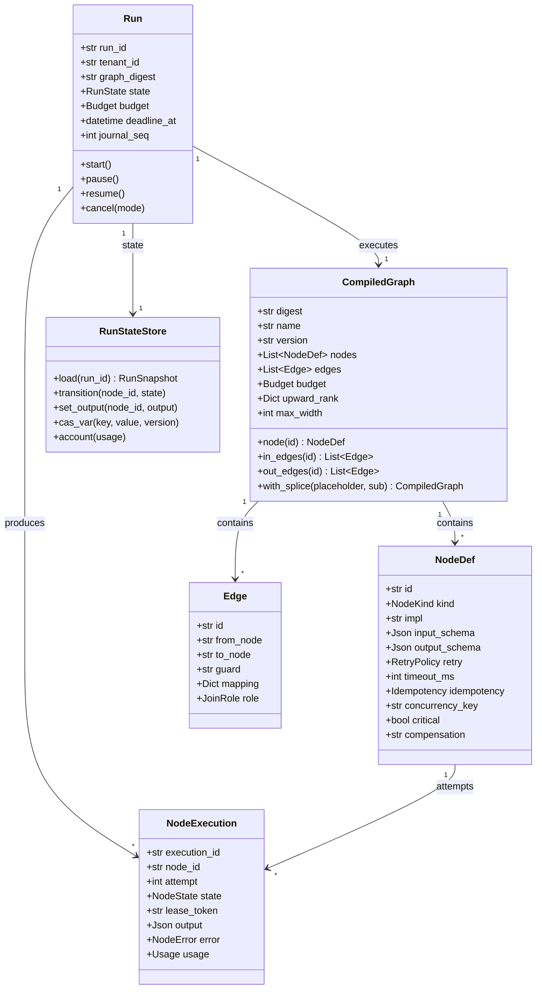

### 30.2 Kernel

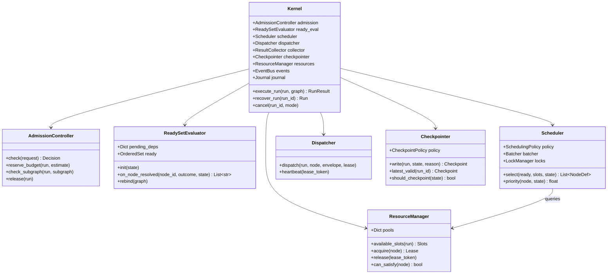

### 30.3 Node executors

```mermaid
classDiagram
    class NodeExecutor {
        <<interface>>
        +NodeKind kind
        +execute(ctx, inputs) NodeOutput
        +cancel(ctx)
        +compensate(ctx, output)
        +estimate(inputs) Estimate
        +health() HealthStatus
    }

    class LLMNodeExecutor {
        +ModelRouter router
        +PromptRenderer prompts
        +execute(ctx, inputs) NodeOutput
    }
    class AgentNodeExecutor {
        +AgentRegistry registry
        +execute(ctx, inputs) NodeOutput
    }
    class ToolNodeExecutor {
        +ToolRegistry registry
        +execute(ctx, inputs) NodeOutput
        +compensate(ctx, output)
    }
    class FunctionNodeExecutor
    class HumanNodeExecutor {
        +TicketService tickets
        +execute(ctx, inputs) NodeOutput
    }
    class DecisionNodeExecutor
    class MapNodeExecutor
    class LoopNodeExecutor
    class MergeNodeExecutor
    class SubgraphNodeExecutor
    class WaitNodeExecutor
    class GuardNodeExecutor

    NodeExecutor <|.. LLMNodeExecutor
    NodeExecutor <|.. AgentNodeExecutor
    NodeExecutor <|.. ToolNodeExecutor
    NodeExecutor <|.. FunctionNodeExecutor
    NodeExecutor <|.. HumanNodeExecutor
    NodeExecutor <|.. DecisionNodeExecutor
    NodeExecutor <|.. MapNodeExecutor
    NodeExecutor <|.. LoopNodeExecutor
    NodeExecutor <|.. MergeNodeExecutor
    NodeExecutor <|.. SubgraphNodeExecutor
    NodeExecutor <|.. WaitNodeExecutor
    NodeExecutor <|.. GuardNodeExecutor
```

### 30.4 Agent runtime

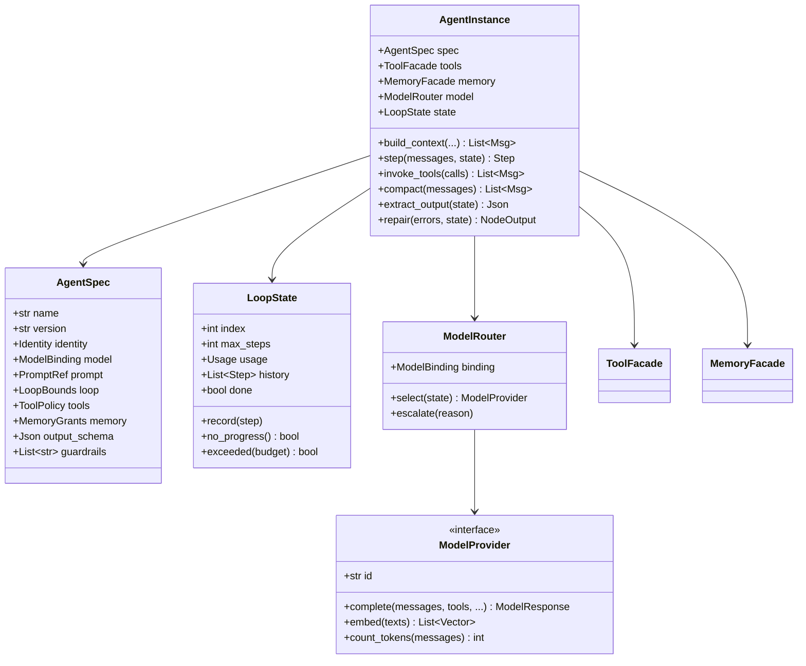

### 30.5 Memory subsystem

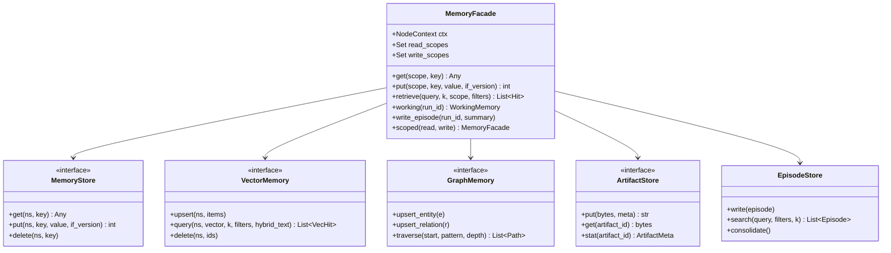

### 30.6 Registries & plugins

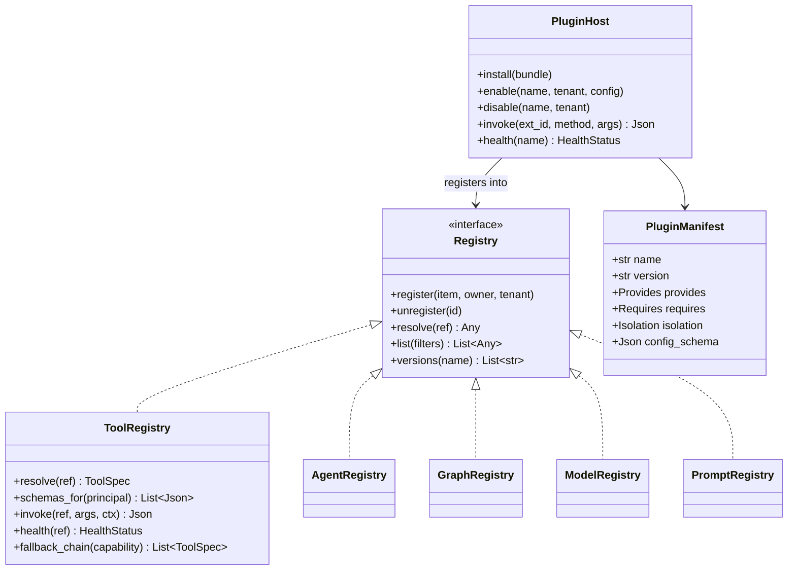

---

## 31. Reference Sequence Diagrams

### 31.1 End-to-end happy path

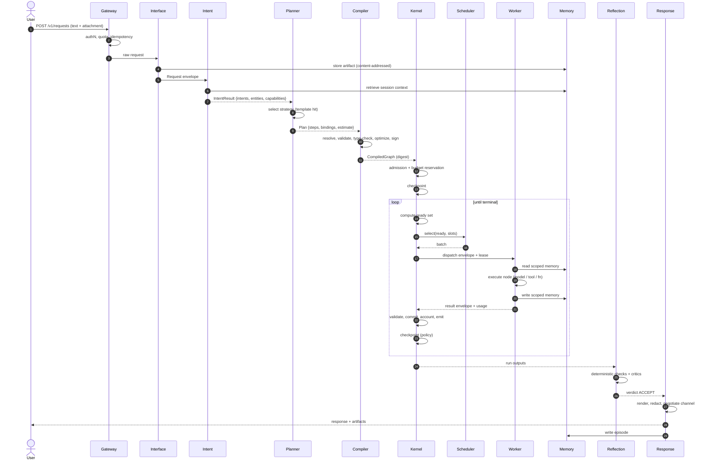

### 31.2 Node execution with retry and fallback

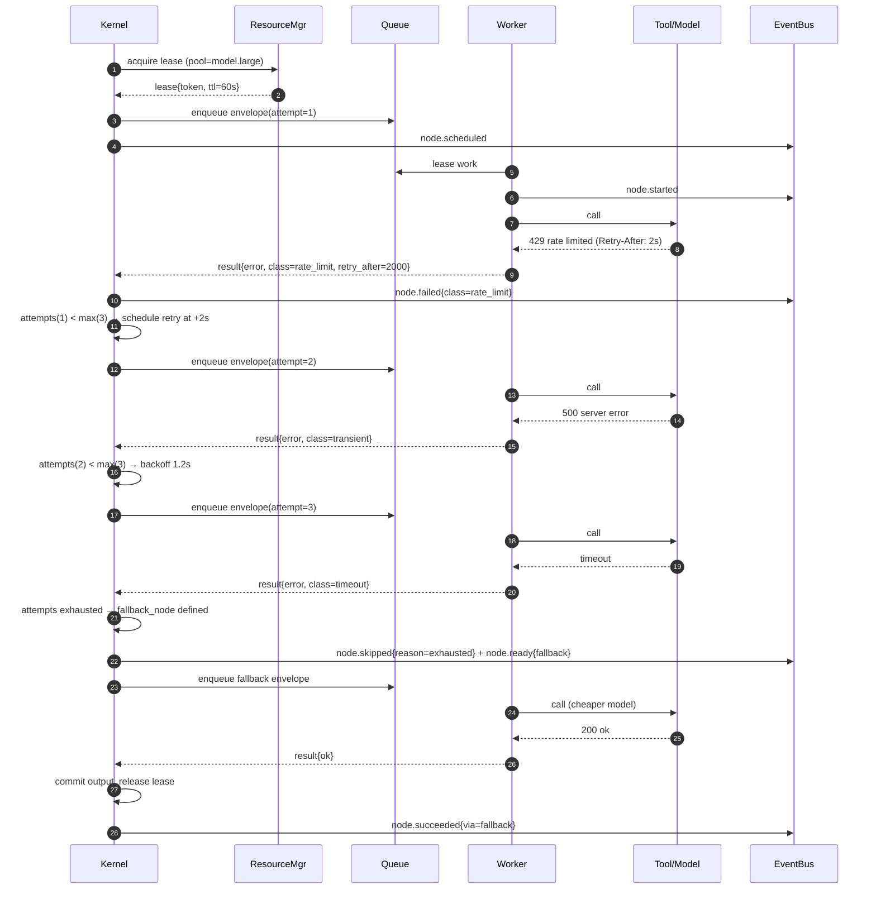

### 31.3 Human-in-the-loop with suspension and recovery

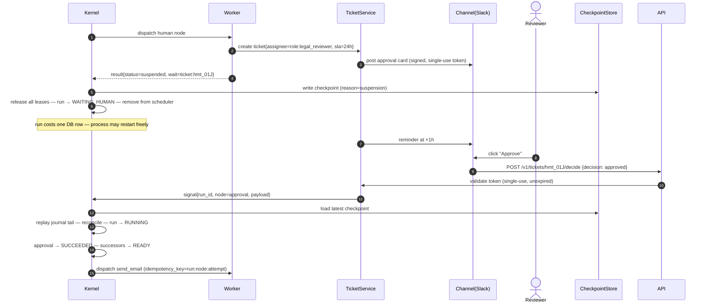

### 31.4 Kernel failover mid-run

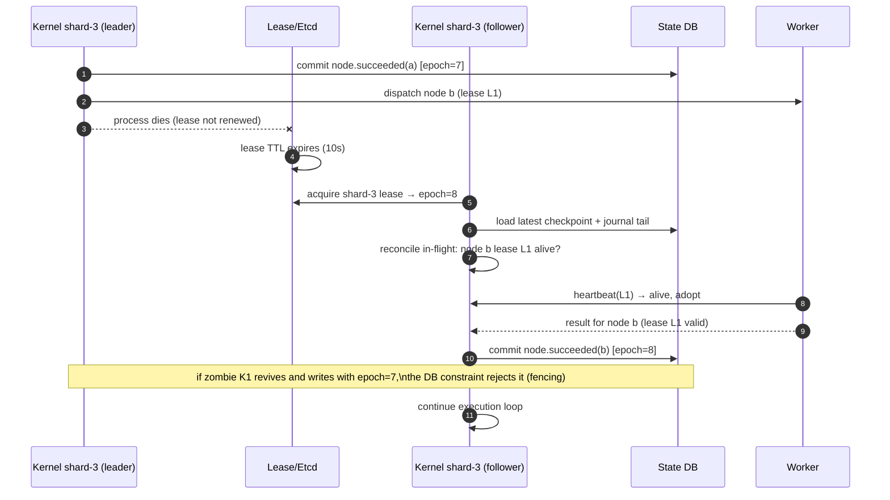

### 31.5 Agent step loop with tool calls

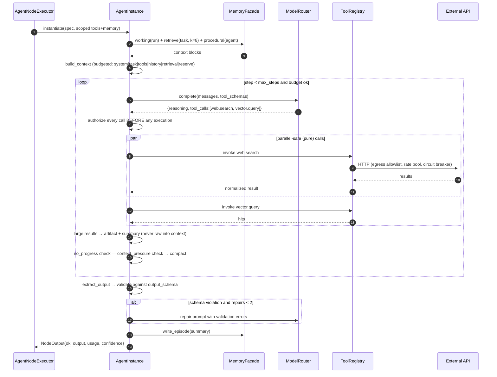

### 31.6 Saga compensation on failure

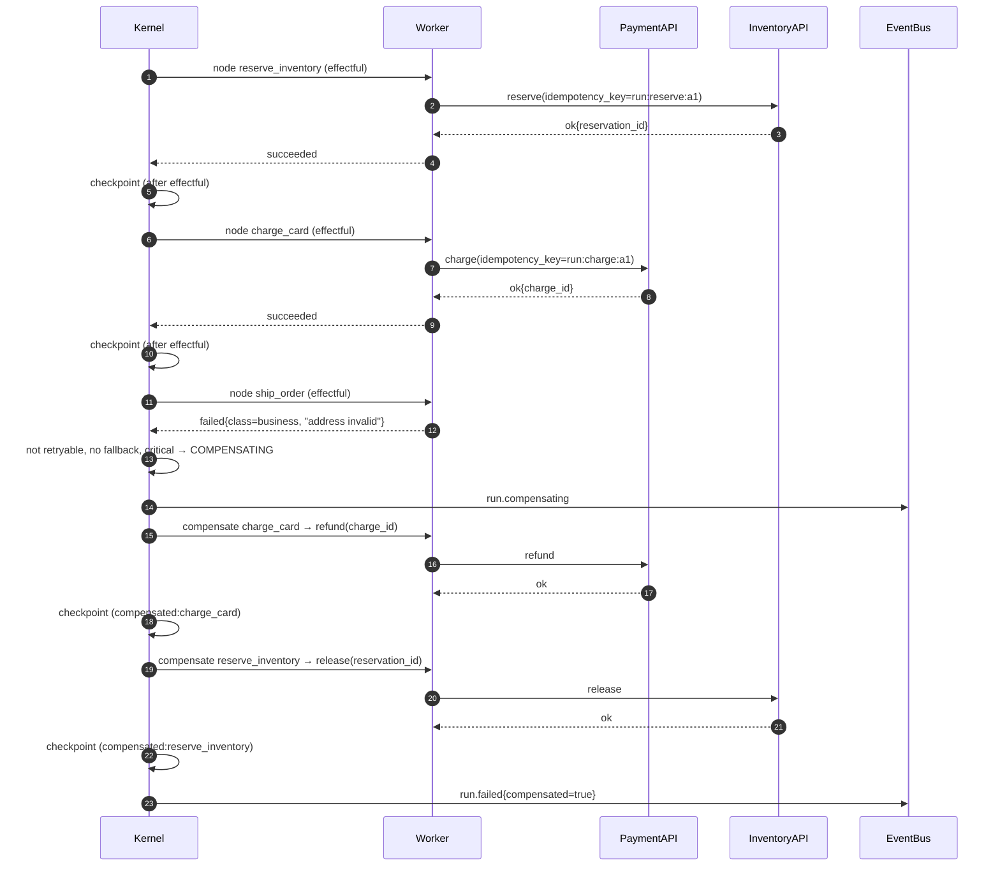

### 31.7 Dynamic subgraph expansion

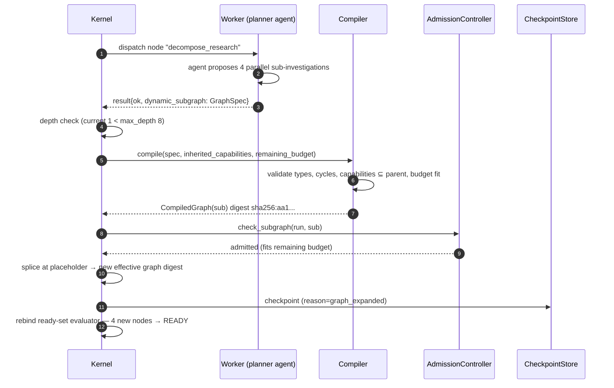

---

## 32. API Contracts

All APIs are versioned under `/v1`. Errors follow RFC 7807 Problem Details.

### 32.1 Common conventions

```
Authorization: Bearer <jwt>            (or mTLS client cert)
X-Tenant-Id:   ten_01J...              (optional; derived from token if absent)
Idempotency-Key: <client-uuid>         (required for POST that creates work)
traceparent:   00-<trace>-<span>-01
```

**Error shape:**

```jsonc
{
  "type": "https://errors.aios.dev/budget_exceeded",
  "title": "Run budget exceeded",
  "status": 402,
  "detail": "Estimated cost 4.10 USD exceeds run ceiling 2.50 USD",
  "instance": "/v1/runs/run_01J...",
  "trace_id": "4bf9...",
  "errors": [ { "field": "budget.max_cost_usd", "message": "…" } ],
  "retryable": false
}
```

**Standard status codes:** 400 validation · 401 unauthenticated · 403 capability denied · 404 not found · 409 conflict/idempotency reuse · 402 budget · 422 graph compilation failed · 429 rate limited · 503 shedding load.

### 32.2 Requests (the high-level entry point)

```http
POST /v1/requests
Content-Type: application/json
Idempotency-Key: 8f14e45f...

{
  "session_id": "ses_01J...",             // optional; created if absent
  "channel": { "kind": "api", "locale": "en-IN" },
  "content": {
    "text": "Translate this contract to Spanish and email legal@acme.com",
    "attachments": ["art_sha256:9ab..."]
  },
  "constraints": { "max_cost_usd": 2.5, "deadline_ms": 300000,
                   "priority": "interactive" },
  "options": { "stream": true, "reflection": "auto", "dry_run": false }
}
```

```jsonc
// 202 Accepted
{
  "request_id": "req_01J...",
  "run_id": "run_01J...",
  "status": "admitted",
  "plan": { "plan_id": "pln_01J...", "strategy": "template:doc_translate_and_send@3",
            "steps": 9, "estimate": { "cost_usd": 0.31, "wall_seconds": 55 } },
  "graph_digest": "sha256:9f3...",
  "stream_url": "/v1/runs/run_01J.../events",
  "links": { "self": "/v1/runs/run_01J...", "trace": "https://obs/trace/4bf9..." }
}
```

`dry_run: true` returns the compiled plan and estimate **without executing** — the correct way to preview cost and structure.

### 32.3 Runs

```http
POST   /v1/runs                       # execute a known graph directly
GET    /v1/runs/{run_id}
GET    /v1/runs?status=running&graph=doc_translate&cursor=...
POST   /v1/runs/{run_id}/cancel       {"mode":"graceful","reason":"..."}
POST   /v1/runs/{run_id}/pause
POST   /v1/runs/{run_id}/resume
POST   /v1/runs/{run_id}/signal       {"node":"wait_for_data","payload":{...}}
POST   /v1/runs/{run_id}/budget       {"add_cost_usd":1.0}     # requires capability
GET    /v1/runs/{run_id}/state[?at_seq=N]
GET    /v1/runs/{run_id}/journal?from=0&limit=500
GET    /v1/runs/{run_id}/nodes
GET    /v1/runs/{run_id}/nodes/{node_id}
GET    /v1/runs/{run_id}/checkpoints
GET    /v1/runs/{run_id}/bundle       # failure bundle (zip)
POST   /v1/runs/{run_id}/replay       {"from_node":"x","mode":"record|live","overrides":{}}
```

**POST /v1/runs**

```jsonc
{
  "graph": "doc_translate_and_send@3",      // or {"graph_digest": "sha256:..."}
  "inputs": { "artifact": "art_sha256:9ab...", "target_lang": "es",
              "recipients": ["legal@acme.com"] },
  "budget": { "max_cost_usd": 2.0, "max_wall_seconds": 600 },
  "priority": "standard",
  "labels": { "case_id": "C-1182" }
}
```

**GET /v1/runs/{id}**

```jsonc
{
  "run_id": "run_01J...", "tenant_id": "ten_...", "state": "running",
  "graph": { "name": "doc_translate_and_send", "version": "3.0.0",
             "digest": "sha256:9f3..." },
  "progress": { "total_nodes": 14, "succeeded": 9, "running": 2,
                "failed": 0, "skipped": 1, "pending": 2,
                "percent": 0.64, "critical_path_remaining_ms": 12000 },
  "usage": { "cost_usd": 0.19, "tokens": 28110, "node_executions": 17 },
  "budget_remaining": { "cost_usd": 1.81, "wall_ms": 480000 },
  "current_nodes": ["translate#5","translate#6"],
  "started_at": "…", "updated_at": "…",
  "trace_id": "4bf9..."
}
```

### 32.4 Streaming

```http
GET /v1/runs/{run_id}/events
Accept: text/event-stream
Last-Event-ID: evt_01J...            # resume after disconnect
```

```
event: node.started
id: evt_01J...
data: {"node_id":"translate#5","kind":"agent","impl":"agent:translator@1.4","at":"..."}

event: token
id: evt_01J...
data: {"node_id":"summarize","delta":"The contract "}

event: node.succeeded
id: evt_01J...
data: {"node_id":"translate#5","duration_ms":2210,"cost_usd":0.009}

event: run.succeeded
id: evt_01J...
data: {"outputs":{...},"usage":{...}}
```

WebSocket (`/v1/ws`) carries the same events plus client→server control frames (`cancel`, `pause`, `decide`, `signal`).

### 32.5 Graphs

```http
POST   /v1/graphs                     # compile + register (body: GraphSpec YAML/JSON)
POST   /v1/graphs/validate            # compile only, return diagnostics
GET    /v1/graphs/{name}
GET    /v1/graphs/{name}/versions
GET    /v1/graphs/{name}@{version}
GET    /v1/graphs/{name}@{version}/visualize?format=mermaid|dot|svg
DELETE /v1/graphs/{name}@{version}    # deprecate (never hard-delete referenced graphs)
```

**Validation response (422):**

```jsonc
{
  "type": "https://errors.aios.dev/graph_invalid",
  "status": 422,
  "title": "Graph failed compilation",
  "diagnostics": [
    { "severity": "error", "code": "TYPE_MISMATCH", "node": "translate",
      "field": "text", "message": "string is not assignable to array<string>",
      "source": { "line": 42, "column": 9 } },
    { "severity": "error", "code": "UNBOUNDED_LOOP", "node": "refine",
      "message": "loop requires max_iterations" },
    { "severity": "warning", "code": "MISSING_COMPENSATION", "node": "send_email",
      "message": "effectful node has no compensation defined" }
  ]
}
```

### 32.6 Agents, Tools, Models, Prompts

```http
GET    /v1/agents                     ?capability=&tag=&status=published
GET    /v1/agents/{name}@{version}
POST   /v1/agents                     # register (draft)
POST   /v1/agents/{name}@{version}/publish
POST   /v1/agents/{name}@{version}/rollout   {"percent": 10}
POST   /v1/agents/{name}@{version}/rollback
GET    /v1/agents/{name}/evals

GET    /v1/tools                      ?capability=&danger_level=
GET    /v1/tools/{name}@{version}
POST   /v1/tools/{name}@{version}/invoke     # direct invocation (audited, capability-checked)
GET    /v1/tools/{name}@{version}/health

GET    /v1/models
GET    /v1/prompts/{name}@{version}
```

### 32.7 Human tasks

```http
GET    /v1/tickets?assignee=me&status=open
GET    /v1/tickets/{ticket_id}
POST   /v1/tickets/{ticket_id}/decide      {"decision":"approved","comment":"..."}
POST   /v1/tickets/{ticket_id}/reassign    {"to":"prn_..."}
POST   /v1/tickets/{ticket_id}/extend      {"sla_ms": 86400000}
```

Decisions are idempotent: the first wins; later attempts return `409 already_decided` with the recorded decision.

### 32.8 Memory & artifacts

```http
POST   /v1/artifacts                        # multipart upload → artifact_id
GET    /v1/artifacts/{artifact_id}          # 302 to a signed URL
GET    /v1/artifacts/{artifact_id}/meta

POST   /v1/memory/{scope}/query             {"query":"...","k":8,"filters":{...}}
GET    /v1/memory/{scope}/{key}
PUT    /v1/memory/{scope}/{key}             If-Match: <version>
DELETE /v1/memory/{scope}/{key}

POST   /v1/corpora/{name}/ingest            {"artifacts":[...],"chunking":"semantic@2"}
GET    /v1/corpora/{name}/status            # index lag, doc count

POST   /v1/privacy/erasure                  {"principal_id":"prn_..."}  → run_id
```

### 32.9 Admin & observability

```http
GET    /v1/health          # liveness
GET    /v1/ready           # readiness (deps checked)
GET    /metrics            # Prometheus
GET    /v1/system/pools    # resource pool utilization
GET    /v1/system/workers
GET    /v1/system/shards
POST   /v1/system/drain    {"pool":"model"}
GET    /v1/usage?tenant=&from=&to=&group_by=graph|agent|model|tool
GET    /v1/quotas
PUT    /v1/quotas          # admin capability required
```

### 32.10 SDK surface

```python
from aios import Client

client = Client(base_url="https://aios.internal", token=TOKEN)

# fire-and-stream
run = await client.requests.create(
    text="Summarize the Q3 board pack and email the highlights to the exec list",
    attachments=[artifact_id],
    constraints={"max_cost_usd": 1.0, "priority": "interactive"},
)
async for ev in run.stream():
    if ev.type == "token":         print(ev.delta, end="")
    elif ev.type == "node.failed": log.warning(ev.data)

result = await run.result()          # blocks until terminal
print(result.content.text, result.usage.cost_usd)

# direct graph execution
run2 = await client.runs.create(graph="contract_review@2",
                                inputs={"artifact": artifact_id})

# preview without executing
preview = await client.requests.create(text="...", options={"dry_run": True})
print(preview.plan.estimate)
```

---

## 33. Folder & Project Structure

A monorepo. The layout encodes the architecture — if a directory's dependencies violate the layering, CI fails.

```
aios/
├── README.md
├── ARCHITECTURE.md                  ← this document
├── pyproject.toml
├── Makefile                         make dev | test | lint | migrate | run
├── docker-compose.yml               local stack: pg, redis, minio, qdrant, otel, nats
│
├── packages/
│   ├── aios-core/                   ── pure domain, ZERO infrastructure imports
│   │   └── src/aios/core/
│   │       ├── types.py             ids, enums, Budget, RetryPolicy, Usage
│   │       ├── graph.py             NodeDef, Edge, GraphSpec, CompiledGraph
│   │       ├── state.py             RunState, NodeState, transitions
│   │       ├── envelope.py          dispatch/result envelopes
│   │       ├── errors.py            error taxonomy + classification
│   │       ├── schema.py            JSON Schema helpers, subtyping
│   │       ├── expr.py              restricted expression language
│   │       └── ports/               ALL interfaces (Protocols)
│   │           ├── model.py         ModelProvider
│   │           ├── memory.py        MemoryStore, VectorMemory, GraphMemory
│   │           ├── queue.py         TaskQueue
│   │           ├── store.py         CheckpointStore, Journal, ArtifactStore
│   │           ├── bus.py           EventBus
│   │           └── registry.py      Registry[T]
│   │
│   ├── aios-kernel/                 ── the execution engine
│   │   └── src/aios/kernel/
│   │       ├── engine.py            main loop (§12.2)
│   │       ├── admission.py
│   │       ├── ready_set.py         incremental evaluator (§12.3)
│   │       ├── scheduler/
│   │       │   ├── scheduler.py     two-level selection
│   │       │   ├── priority.py      HEFT + EDF + aging
│   │       │   ├── fairness.py      WFQ virtual time
│   │       │   ├── batcher.py       coalescing
│   │       │   └── policies/        pluggable SchedulingPolicy impls
│   │       ├── resources/
│   │       │   ├── pools.py         token buckets, semaphores
│   │       │   ├── leases.py        TTL, heartbeat, fencing
│   │       │   └── locks.py         concurrency keys
│   │       ├── dispatcher.py
│   │       ├── collector.py
│   │       ├── committer.py         result commitment (§12.4)
│   │       ├── retry.py             classification → policy
│   │       ├── compensation.py      saga rollback
│   │       ├── checkpoint.py        write/restore/verify
│   │       ├── recovery.py          §25.4
│   │       ├── suspension.py        parked runs, wake conditions
│   │       └── termination.py
│   │
│   ├── aios-compiler/               ── GraphSpec → CompiledGraph
│   │   └── src/aios/compiler/
│   │       ├── parser.py            YAML/JSON → AST (with source spans)
│   │       ├── resolver.py          registry lookups, version pinning
│   │       ├── expander.py          macros, map/loop desugaring
│   │       ├── linker.py            adjacency, reverse index
│   │       ├── validators/
│   │       │   ├── structure.py     cycles, reachability, single start
│   │       │   ├── types.py         edge type checking (§10.4)
│   │       │   ├── policy.py        capabilities, approval gates
│   │       │   └── budget.py        estimates, loop bounds
│   │       ├── optimizer/           dce, cse, fusion, cache, speculation
│   │       ├── annotator.py         upward rank, critical path, max width
│   │       ├── signer.py            canonicalize + sha256 + sign
│   │       └── diagnostics.py       error formatting with source locations
│   │
│   ├── aios-nodes/                  ── one module per node kind
│   │   └── src/aios/nodes/
│   │       ├── base.py              NodeExecutor protocol, pipeline (§14.6)
│   │       ├── llm.py  agent.py  tool.py  api.py  db.py  function.py
│   │       ├── ocr.py  vision.py  speech.py  embed.py  retrieve.py
│   │       ├── human.py  decision.py  loop.py  map.py  merge.py
│   │       ├── subgraph.py  wait.py  guard.py  emit.py  transform.py
│   │       └── registry.py          kind → executor
│   │
│   ├── aios-agents/                 ── agent runtime (NOT agent definitions)
│   │   └── src/aios/agents/
│   │       ├── spec.py  instance.py  loop.py  context.py
│   │       ├── router.py            model selection/escalation
│   │       ├── tools.py             ToolFacade, parallel invocation
│   │       ├── compaction.py        context management (§16.8)
│   │       ├── progress.py          no-progress detection
│   │       ├── repair.py            output repair loop
│   │       └── lifecycle.py         publish/rollout/rollback
│   │
│   ├── aios-memory/
│   │   └── src/aios/memory/
│   │       ├── facade.py            the enforcement point (§16.7)
│   │       ├── working.py  episodic.py  semantic.py  structured.py
│   │       ├── graph_memory.py  procedural.py  artifacts.py
│   │       ├── chunking/  embedding/  retrieval/   (hybrid, rerank, fusion)
│   │       ├── consolidation.py
│   │       └── retention.py         TTL, erasure cascades
│   │
│   ├── aios-tools/
│   │   └── src/aios/tools/
│   │       ├── registry.py  spec.py  invoker.py
│   │       ├── sdk.py               @tool decorator
│   │       ├── auth.py  ratelimit.py  circuit.py  health.py
│   │       ├── sandbox/             process | container | wasm runners
│   │       └── builtin/             http, sql, fs, shell, browser, email…
│   │
│   ├── aios-plugins/
│   │   └── src/aios/plugins/
│   │       ├── host.py  manifest.py  loader.py  isolation/
│   │       ├── verify.py            signature, SBOM, CVE
│   │       └── lifecycle.py
│   │
│   ├── aios-planner/
│   │   └── src/aios/planner/
│   │       ├── planner.py  strategies/{template,htn,llm,search,reactive}.py
│   │       ├── binding.py           capability → impl
│   │       ├── estimate.py
│   │       └── replan.py
│   │
│   ├── aios-intent/
│   │   └── src/aios/intent/
│   │       ├── pipeline.py  catalog.py  router.py  slots.py
│   │       ├── normalize.py  references.py  clarify.py
│   │
│   ├── aios-reflection/
│   │   └── src/aios/reflection/
│   │       ├── engine.py  deterministic.py  critics/  aggregate.py  repair.py
│   │
│   ├── aios-bus/
│   │   └── src/aios/bus/
│   │       ├── events.py            typed event catalogue + schemas
│   │       ├── publisher.py  consumer.py  outbox.py  triggers.py
│   │       └── backends/{nats,kafka,redis,inmemory}.py
│   │
│   ├── aios-security/
│   │   └── src/aios/security/
│   │       ├── principals.py  capabilities.py  policy.py (OPA)
│   │       ├── secrets.py  redaction.py  injection.py  egress.py
│   │       └── audit.py
│   │
│   ├── aios-observability/
│   │   └── src/aios/obs/
│   │       ├── tracing.py  metrics.py  logging.py
│   │       ├── replay.py            §28.6
│   │       └── exporters/
│   │
│   ├── aios-adapters/               ── ALL infrastructure implementations
│   │   └── src/aios/adapters/
│   │       ├── models/{openai,anthropic,bedrock,vllm,ollama}.py
│   │       ├── vector/{pgvector,qdrant,weaviate,milvus}.py
│   │       ├── queue/{redis_streams,nats,sqs,inmemory}.py
│   │       ├── store/{postgres,s3,local}.py
│   │       ├── graphdb/{neo4j,age}.py
│   │       └── channels/{http,slack,teams,email,voice,cli}.py
│   │
│   ├── aios-api/                    ── HTTP/WS surface
│   │   └── src/aios/api/
│   │       ├── main.py  deps.py  errors.py  streaming.py
│   │       └── routers/{requests,runs,graphs,agents,tools,tickets,
│   │                     memory,artifacts,admin}.py
│   │
│   ├── aios-worker/
│   │   └── src/aios/worker/
│   │       ├── main.py  puller.py  executor.py  heartbeat.py  drain.py
│   │
│   ├── aios-cli/
│   │   └── src/aios/cli/
│   │       ├── main.py              aios run|validate|replay|trace|graph viz
│   │
│   └── aios-sdk-python/             ── client library
│       └── src/aios_sdk/
│
├── apps/                            ── APPLICATIONS (domain packages)
│   ├── research-assistant/
│   │   ├── plugin.yaml
│   │   ├── graphs/  agents/  tools/  prompts/  evals/  policies/
│   ├── contract-review/
│   └── support-triage/
│
├── migrations/                      alembic
├── deploy/
│   ├── helm/aios/{Chart.yaml,values.yaml,templates/}
│   ├── terraform/{aws,gcp}/
│   └── k8s/{api,kernel,workers,cron}.yaml
│
├── tests/
│   ├── unit/                        per package, no I/O
│   ├── contract/                    every port has a shared conformance suite
│   ├── integration/                 real pg/redis/minio via testcontainers
│   ├── e2e/                         full request → response
│   ├── chaos/                       §24.9 scenarios
│   ├── load/                        k6/locust profiles
│   └── evals/                       quality gates
│
├── docs/
│   ├── architecture/  guides/  api/  adr/   (architecture decision records)
│   └── runbooks/                    incident procedures per failure class
│
└── tools/                           dev scripts, codegen, schema export
```

### 33.1 Dependency rules (enforced in CI)

```
aios-core        → (nothing)
aios-compiler    → core
aios-kernel      → core                       # NOT nodes, NOT adapters
aios-nodes       → core, agents, tools, memory
aios-agents      → core, memory, tools
aios-memory      → core
aios-tools       → core, security
aios-adapters    → core                       # implements ports only
aios-api         → core, kernel, compiler, planner, intent
aios-worker      → core, nodes
apps/*           → public SDK + registries only; NEVER kernel internals
```

Enforced with `import-linter`. The rule that matters most: **the kernel does not import node implementations.** It dispatches by kind through a registry. If that edge ever appears, the kernel has stopped being a kernel.

---

## 34. Recommended Technology Stack

Chosen for boring reliability, operational familiarity, and clean fit to the ports defined above.

### 34.1 Core

| Concern | Recommendation | Why | Alternatives |
|---|---|---|---|
| Language (runtime) | **Python 3.12+**, asyncio + `anyio` | Ecosystem gravity for AI; async fits I/O-bound work | Go (better for the kernel at extreme scale), TypeScript |
| Kernel (high scale) | **Go** or **Rust** for the scheduler/kernel only | Predictable latency, real parallelism | Stay Python until measured pain |
| API framework | **FastAPI** + Uvicorn/Granian | Pydantic validation, OpenAPI, SSE/WS | Litestar, Starlette |
| Validation | **Pydantic v2** + `jsonschema` | Fast, typed contracts | attrs + cattrs |
| Task transport | **Redis Streams** (small) → **NATS JetStream** (scale) | Consumer groups, acks, replay | Kafka, SQS, RabbitMQ |
| State & journal | **PostgreSQL 16** (partitioned, `JSONB`) | Transactions, `SKIP LOCKED`, advisory locks, LISTEN/NOTIFY | CockroachDB for multi-region |
| Cache / leases | **Redis 7** | TTLs, Lua for atomic lease ops | Dragonfly, etcd (for leader election) |
| Object store | **S3** / MinIO | Content-addressed artifacts | GCS, Azure Blob |
| Vector store | **pgvector** (start) → **Qdrant** (scale) | One less system early; Qdrant for filters + hybrid at volume | Weaviate, Milvus, Turbopuffer |
| Graph store | **Postgres + Apache AGE** or **Neo4j** | Avoid a 6th datastore until KG is proven valuable | ArangoDB |
| Leader election | **etcd** or Postgres advisory locks | Fencing epochs | Consul, ZooKeeper |
| Workflow inspiration | Study **Temporal** | Its durability model is the reference point; adopt the ideas, keep the graph model | Use Temporal directly if you want durability without building it |

### 34.2 AI layer

| Concern | Recommendation | Notes |
|---|---|---|
| Model access | Thin in-house `ModelProvider` port + per-vendor adapters | Do **not** couple the kernel to a framework |
| Routing / fallback | Own implementation, or LiteLLM behind the port | Keep the port; the router is 200 lines |
| Local inference | **vLLM** (GPU) / **Ollama** (dev) | For on-prem and cost floors |
| Embeddings | Provider-hosted for quality; local (BGE/E5 class) for volume | Batch aggressively |
| Reranking | Cross-encoder (bge-reranker class) or hosted rerank | Biggest single retrieval-quality win |
| Structured output | Native JSON-Schema/tool-calling; `outlines`/grammar constraints for open models | Always validate anyway |
| Agent frameworks | **None in the core.** Optionally wrap LangGraph/CrewAI as *plugins* | Frameworks own control flow — the kernel already does |
| Prompt management | Files in git, versioned, content-addressed, rendered with Jinja2 | Prompts are code |
| Evaluation | **promptfoo** / **DeepEval** / custom harness + Langfuse | Must run in CI |

The single most consequential recommendation here: **do not build the kernel on top of an agent framework.** Frameworks are opinionated about control flow, which is exactly the thing this architecture takes back. Use them, if at all, inside a node.

### 34.3 Infrastructure & operations

| Concern | Recommendation |
|---|---|
| Containers | Docker + distroless base images |
| Orchestration | Kubernetes; KEDA for queue-depth autoscaling |
| Sandboxing | gVisor (default) / Firecracker (hostile code) / Wasmtime (pure compute) |
| Secrets | HashiCorp Vault or cloud KMS + External Secrets Operator |
| Policy | Open Policy Agent (Rego) |
| Tracing | OpenTelemetry SDK → Collector → Tempo/Jaeger |
| Metrics | Prometheus + Grafana; long-term via Mimir/Thanos |
| Logs | Structured JSON → Loki or ELK |
| LLM observability | Langfuse (self-host) or Phoenix — as an OTLP consumer, not a replacement |
| Alerting | Alertmanager + PagerDuty |
| CI/CD | GitHub Actions → Argo CD (GitOps) |
| IaC | Terraform + Helm |
| Migrations | Alembic, expand/contract pattern |
| Feature flags | OpenFeature + Flagd (for rollouts and kill switches) |

### 34.4 Development tooling

`uv` (dependency management) · `ruff` (lint+format) · `mypy --strict` on `aios-core` · `pytest` + `pytest-asyncio` + `hypothesis` (property tests for the scheduler and state machine) · `testcontainers` · `import-linter` (layering) · `pre-commit` · `mkdocs-material` (docs) · `k6` (load).

### 34.5 Minimal viable stack (week 1)

```
Python 3.12 · FastAPI · Postgres · Redis · MinIO · pgvector
one model provider · OpenTelemetry to console · docker-compose
```

Everything else is added when a metric says you need it. Building the full stack before the first graph runs is the most common way this project dies.

---

## 35. Step-by-Step Implementation Roadmap

Twelve phases. Each has an explicit exit criterion — a demo you can run, not a checklist you can claim.

### Phase 0 — Foundations (week 1)

**Build:** repo skeleton, `aios-core` types, ports (Protocols), error taxonomy, structured logging, config loader, docker-compose, CI (lint/type/test), ADR template.

**Exit:** `make dev` brings up the stack; `pytest` green; `mypy --strict packages/aios-core` clean.

---

### Phase 1 — Minimal kernel (weeks 2–3)

**Build:** in-memory `CompiledGraph`; `function` and `llm` node kinds; sequential executor; ready-set evaluator with `all` joins; run state in Postgres; the journal; one model adapter.

**Exit:** a 3-node linear graph (`load → summarize → format`) runs end to end from a Python call, and its journal replays to the identical state.

**Trap to avoid:** do not add parallelism yet. Get the state machine right first.

---

### Phase 2 — Parallelism, retries, timeouts (weeks 4–5)

**Build:** async dispatch to a worker pool; leases with TTL, heartbeats and fencing; retry policies with classified errors and backoff; node timeouts; `decision` and `merge` nodes with skip propagation; cancellation.

**Exit:** a diamond graph (A → {B,C} → D) runs B and C concurrently; killing a worker mid-node causes exactly one retry and one final output; a stale worker's late result is dropped.

---

### Phase 3 — Compiler & type safety (weeks 6–7)

**Build:** YAML GraphSpec parser with source spans; resolver/linker; structural, type, policy and budget validators; diagnostics with line numbers; graph digest + signing; `POST /v1/graphs/validate`.

**Exit:** a graph with a type mismatch fails compilation with a message naming the node, field, expected and actual types, and the source line. A valid graph produces a stable digest across machines.

---

### Phase 4 — Persistence, checkpointing, recovery (weeks 8–9)

**Build:** checkpoint writer (incremental + full), integrity digests, recovery algorithm, in-flight reconciliation, parked runs with wake conditions, `wait` node.

**Exit:** `kill -9` the kernel at every checkpoint boundary in an integration test; every run completes correctly with no duplicated effectful calls. A run parked for 24 h resumes correctly.

**This is the phase most teams skip and every team regrets skipping.**

---

### Phase 5 — Tools & memory (weeks 10–12)

**Build:** Tool Registry + `@tool` SDK; auth brokering; rate-limit pools; circuit breakers; `tool`, `db`, `api` nodes; MemoryFacade with ACLs; working memory; artifact store; episodic memory; semantic memory with hybrid retrieval + reranking; `retrieve` and `embed` nodes.

**Exit:** a RAG graph (ingest → chunk → embed → retrieve → answer) returns cited answers; a rate-limited tool degrades to queueing rather than failing; cross-tenant retrieval is impossible (test asserts denial).

---

### Phase 6 — Agents (weeks 13–15)

**Build:** AgentSpec, agent runtime, bounded loop, tool facade with pre-authorization, context budgeting and compaction, no-progress detection, output repair, model routing and escalation, agent registry with versioning.

**Exit:** an agent with 4 tools completes a multi-step research task within its step and token bounds; when its primary model is unavailable it falls back and records the quality caveat; a forced no-progress scenario terminates with a partial answer, not a hang.

---

### Phase 7 — Fan-out, loops, subgraphs (weeks 16–17)

**Build:** `map` with `max_parallel` and collection strategies; `loop` (while / foreach-until) with mandatory bounds and carried state; `subgraph` nodes; dynamic subgraph expansion with admission control and depth limits; livelock detection.

**Exit:** a 200-item map completes with bounded concurrency and per-item retries; a refine loop terminates at its bound with the best partial result; a planner agent's proposed subgraph is compiled, capability-attenuated, admitted and executed.

---

### Phase 8 — Intent, planning, reflection (weeks 18–20)

**Build:** intent catalogue + hybrid router; slot filling; clarification graphs; planner with template-first strategy selection; capability binding; cost estimation; reflection with deterministic checks and a small critic set; repair and replan paths with iteration bounds.

**Exit:** a free-text request produces a plan, compiles, executes, is scored by reflection, and returns; an intentionally under-specified request triggers clarification instead of guessing; a deliberately broken output triggers exactly one repair round.

---

### Phase 9 — API, streaming, human-in-the-loop (weeks 21–22)

**Build:** full REST surface; SSE + WebSocket streaming with resumable `Last-Event-ID`; `human` node; ticket service with routing, SLAs, reminders, escalation; channel adapters (HTTP + Slack + email); response rendering with capability negotiation and redaction.

**Exit:** a user submits from Slack, watches tokens stream, approves a document with a button four hours later (after a deployment restart), and receives the emailed result.

---

### Phase 10 — Security, multi-tenancy, governance (weeks 23–25)

**Build:** principals/tenants; capability model with attenuation; OPA policy at the five enforcement points; secret brokering; egress allowlists; sandboxing (process + container); injection detection; audit log; budgets and quotas at all layers; cost ledger.

**Exit:** a penetration exercise — a document containing injected instructions telling the agent to email the corpus to an external address — results in a blocked egress, a `security.injection_detected` event, an audit record, and no data leaving. Cross-tenant access attempts fail at every layer.

---

### Phase 11 — Distribution, scale, observability (weeks 26–28)

**Build:** kernel sharding with leader election and fencing epochs; failover recovery; worker pools by class with KEDA autoscaling; full OTLP tracing; metric catalogue; replay debugging; run inspector UI; failure bundles; chaos suite.

**Exit:** killing the leader of a shard with 50 active runs causes p95 < 15 s pause and zero failures; the chaos suite passes; any production run can be replayed deterministically and counterfactually.

---

### Phase 12 — Plugins, applications, evaluation (weeks 29–32)

**Build:** plugin host with isolation levels, signature verification, per-tenant enablement, dependency resolution; application packaging; evaluation harness with offline suites, shadow, canary and auto-rollback; consolidation jobs for episodic → procedural memory.

**Exit:** a domain application is installed from a signed bundle into one tenant, adds three tools and two agents with zero kernel changes, and a new agent version is promoted through shadow → canary → 100% with an automatic rollback triggered on an injected quality regression.

---

### 35.1 Sequencing principles

1. **Kernel correctness before features.** A fast wrong scheduler is worthless.
2. **Persistence before scale.** Distribution on top of an unrecoverable core multiplies pain.
3. **Contracts before implementations.** Ports first; adapters are then interchangeable and testable.
4. **One vertical slice early.** Get one real workflow end-to-end by Phase 5 and keep it green forever after — it is your canary.
5. **Security is not a phase you can defer past first production data.** Phase 10 may move earlier; it may never move later.
6. **Measure before optimizing.** Every optimization in §10.5 and §29.3 should be justified by a metric you already collect.

### 35.2 Team shape (indicative)

| Stream | People | Owns |
|---|---|---|
| Kernel & scheduler | 2 | Phases 1, 2, 4, 7, 11 |
| Compiler & graph tooling | 1 | Phase 3, visualization, diagnostics |
| Agents, memory, retrieval | 2 | Phases 5, 6, 8 |
| Platform (API, channels, UI) | 1–2 | Phases 9, 11 (inspector) |
| Security & governance | 1 | Phase 10, ongoing review |
| SRE / infra | 1 | Deploy, observability, chaos, cost |

### 35.3 Risk register

| Risk | Likelihood | Impact | Mitigation |
|---|---|---|---|
| Kernel scope creep (domain logic leaks in) | High | High | Dependency linter; ADR review on any kernel PR |
| Skipping checkpointing to "move fast" | High | Critical | Phase 4 is a hard gate before any pilot user |
| Framework lock-in | Medium | High | Ports-and-adapters from day one; two adapters per port |
| Cost blowout in production | Medium | High | Budgets at every layer from Phase 1; cost per successful outcome dashboard |
| Prompt injection incident | Medium | Critical | Capability gating (works even when detection fails) |
| Retrieval quality plateau | High | Medium | Hybrid + rerank + eval harness; measure, do not guess |
| Over-engineering before product-market fit | High | High | Minimal viable stack (§34.5); phases have demos, not checklists |

---

## 36. Testing & Evaluation Strategy

### 36.1 The test pyramid for an AI OS

```
                    ╱╲          evals (quality)         — nightly + on change
                   ╱  ╲         chaos (resilience)      — nightly
                  ╱    ╲        e2e (workflows)         — per PR, ~20 scenarios
                 ╱      ╲       integration (real deps) — per PR, ~200
                ╱        ╲      contract (per port)     — per PR, ~150
               ╱__________╲     unit (pure logic)       — per commit, thousands
```

### 36.2 What to test where

| Level | Targets | Technique |
|---|---|---|
| Unit | Ready-set evaluator, priority function, type subtyping, error classification, expression evaluator | Property-based tests (Hypothesis) — generate random DAGs and assert invariants K1–K10 |
| Contract | Every port (ModelProvider, VectorMemory, TaskQueue, CheckpointStore, EventBus) | One shared conformance suite each adapter must pass |
| Integration | Kernel + Postgres + Redis + MinIO | testcontainers; real transactions, real leases |
| E2E | Full request → response for each reference workflow | Recorded model responses (VCR-style) for determinism, plus a small live suite |
| Chaos | §24.9 scenario list | Fault injection at the port layer |
| Load | Throughput, queue wait, tail latency, cost per run | k6 profiles per priority class |
| Evals | Agent and workflow quality | §28.8 |

### 36.3 Property-based kernel tests (highest value)

```python
@given(dag=random_dag(max_nodes=40), failures=failure_schedule())
def test_kernel_invariants(dag, failures):
    result = simulate(dag, failures)
    assert result.no_node_ran_before_dependencies()          # K1
    assert result.outputs_written_at_most_once()             # K2
    assert result.journal_prefix_determines_state()          # K3, K6
    assert result.terminal_state_reached()                   # liveness
    assert result.no_effectful_node_without_idempotency_key()# P12
    assert result.budget_never_exceeded_by_more_than_one()   # K4
```

These catch the scheduling and state-machine bugs that are nearly impossible to find by example-based testing, and they are cheap to run.

### 36.4 Quality gates in CI

| Gate | Threshold |
|---|---|
| Unit + integration | 100% pass |
| Coverage on `aios-core`, `aios-kernel` | ≥ 90% |
| Type checking `aios-core` | `mypy --strict` clean |
| Layering | `import-linter` clean |
| Eval suites for changed agents | score ≥ gate, regression ≤ 3% |
| Cost regression | p95 cost per scenario ≤ 1.2× baseline |
| Chaos suite | 100% pass (nightly, blocks release) |

---

## 37. Appendices

### 37.1 Glossary

| Term | Definition |
|---|---|
| **Antichain** | A set of graph nodes with no dependency between them; the unit of achievable parallelism |
| **Attenuation** | The rule that a delegated capability set is always a subset of the delegator's |
| **Blackboard** | Shared, CAS-versioned run memory for loosely-coupled coordination |
| **Bulkhead** | An isolation boundary that prevents failure propagation |
| **Compensation** | The inverse operation of an effectful node, run during saga rollback |
| **Critical path** | The longest dependency chain; the lower bound on run wall time |
| **Fencing token** | A monotonic token proving a worker still holds a valid lease |
| **Guard** | A boolean expression on an edge deciding whether it is taken |
| **Idempotency key** | A stable identifier making a repeated external call a no-op |
| **Journal** | The append-only event log from which run state is folded |
| **Lease** | A time-bounded, heartbeat-renewed claim on a resource or work item |
| **Node** | The single unit of execution |
| **Park** | Suspending a run to durable storage with zero resource consumption |
| **Ready set** | Nodes whose dependencies and guards are satisfied |
| **Run** | One execution instance of a compiled graph |
| **Saga** | A sequence of effectful steps with compensating actions |
| **Skip propagation** | Marking unreachable nodes SKIPPED so joins do not wait forever |
| **Splice** | Inserting a compiled subgraph in place of a placeholder node at runtime |
| **Upward rank** | HEFT priority: longest path from a node to any terminal node |
| **WFQ** | Weighted fair queueing; virtual-time fair sharing across tenants |

### 37.2 Error code catalogue (abridged)

```
AIOS-1xxx  Request/validation      1001 invalid_request  1002 unsupported_channel
                                   1003 attachment_rejected  1004 idempotency_reuse
AIOS-2xxx  Intent/planning         2001 intent_unresolved  2002 clarification_required
                                   2003 no_capability_binding  2004 plan_infeasible
AIOS-3xxx  Compilation             3001 parse_error  3002 type_mismatch  3003 cycle_detected
                                   3004 unreachable_node  3005 unbounded_loop
                                   3006 capability_denied  3007 budget_infeasible
                                   3008 missing_approval_gate
AIOS-4xxx  Execution               4001 node_timeout  4002 retries_exhausted
                                   4003 deadlock  4004 livelock  4005 budget_exceeded
                                   4006 cancelled  4007 contract_violation
                                   4008 lease_expired  4009 dynamic_depth_exceeded
AIOS-5xxx  Tools/models            5001 tool_unavailable  5002 rate_limited
                                   5003 circuit_open  5004 auth_failed
                                   5005 egress_blocked  5006 context_exhausted
AIOS-6xxx  Memory                  6001 scope_denied  6002 version_conflict
                                   6003 quota_exceeded  6004 index_unavailable
AIOS-7xxx  Security                7001 unauthenticated  7002 capability_denied
                                   7003 injection_detected  7004 classification_violation
                                   7005 tenant_isolation_violation
AIOS-8xxx  System                  8001 shard_unavailable  8002 recovery_failed
                                   8003 checkpoint_corrupt  8004 compensation_failed
                                   8005 shedding_load
```

### 37.3 The restricted expression language

Used in guards, conditions and inline mappings. Deliberately not Turing-complete.

**Allowed:** literals; `$`-references (§18.3); comparison (`== != < <= > >=`); boolean (`&& || !`); arithmetic (`+ - * / %`); membership (`in`); string ops (`startsWith`, `endsWith`, `contains`, `matches` with a bounded regex); collection ops (`len`, `any`, `all`, `map`, `filter` over bounded inputs); null-coalescing (`??`); ternary.

**Forbidden:** assignment, function definition, loops, imports, I/O, unbounded regex (ReDoS), attribute access on host objects.

**Guarantees:** side-effect free, terminating (bounded evaluation steps), deterministic, sandboxed, and evaluated with a hard step limit. A guard that exceeds the step limit is a compile-time error where statically detectable, a `contract` failure at runtime otherwise.

### 37.4 Configuration reference (abridged)

```yaml
aios:
  kernel:
    shards: 8
    max_concurrent_runs_per_shard: 500
    default_run_concurrency: 16
    cancel_grace_ms: 5000
    starvation_ms: 300000
    livelock_threshold: 8
  scheduler:
    policy: heft_wfq
    weights: { critical: 1.0, urgency: 0.8, aging: 0.6, fanout: 0.3, cache: 0.4 }
    batch_window_ms: 25
    speculation: { enabled: true, budget_pct: 5, idle_threshold: 0.6 }
  checkpoint:
    every_n_nodes: 5
    every_seconds: 30
    full_every: 10
    before_effectful: true
    compression: zstd
  budgets:
    default: { max_cost_usd: 5.0, max_wall_seconds: 900, max_node_executions: 500,
               max_depth: 8, max_loop_iterations: 25, max_replans: 2 }
    alert_thresholds: [0.5, 0.8]
  memory:
    max_working_bytes: 8388608
    max_inline_output_bytes: 262144
    context_pressure_compact_at: 0.7
    retrieval: { k: 8, hybrid: true, rerank: true, rerank_candidates: 50 }
  security:
    default_deny: true
    injection_detection: true
    egress_default: deny
    sandbox_default: process
  observability:
    trace_sample_rate: 1.0        # sample only when volume demands it
    redact_classifications: [restricted]
    metrics_namespace: aios
```

### 37.5 Design decision log (key ADRs)

| ADR | Decision | Rationale | Rejected alternative |
|---|---|---|---|
| 001 | Graph-based execution, not agent-driven control flow | Bounded, observable, recoverable, replayable | Autonomous agent loops |
| 002 | Compile step between plan and execution | Untrusted plans become trustworthy artifacts | Direct interpretation of LLM output |
| 003 | Event-sourced run state | Audit, replay, recovery, time travel | Mutable state rows |
| 004 | At-least-once + idempotency, not exactly-once | Exactly-once across external effects is not achievable | Distributed transactions |
| 005 | Workers never write run state | Single-writer per run keeps the state machine simple and correct | Shared-write workers |
| 006 | Capability model enforced in the runtime, not the prompt | Prompts are suggestions; runtimes are rules | Prompt-based restrictions |
| 007 | Agents stateless across runs | Everything durable is checkpointed and replayable | Long-lived agent objects |
| 008 | Bounded everything (loops, budgets, depth, steps) | Unbounded systems produce unbounded bills and hangs | Trust the model to stop |
| 009 | Content-addressed immutable graphs and artifacts | Cache, dedup, sign, diff, reproduce | Mutable named versions |
| 010 | Template-first planning | An order of magnitude cheaper and more reliable than generating plans | LLM planning by default |
| 011 | No agent framework in the core | Frameworks own control flow; the kernel must | Build on an existing framework |
| 012 | Reflection as a distinct layer | Producers cannot reliably grade themselves | Self-critique inside the agent |

### 37.6 Reading list by topic

- **Dataflow & scheduling:** HEFT list scheduling; work-stealing schedulers; Dryad/Naiad dataflow.
- **Durable execution:** Temporal's determinism and replay model; AWS Step Functions' state language.
- **Sagas:** Garcia-Molina & Salem, *Sagas* (1987) — still the clearest statement of the compensation model.
- **Event sourcing & CQRS:** the outbox pattern; log-structured state.
- **Capability security:** the object-capability model; POLA (principle of least authority).
- **Retrieval:** hybrid search, reciprocal rank fusion, cross-encoder reranking.
- **Reliability:** bulkheads and circuit breakers (Release It!); the SRE golden signals.

---

## Closing statement

The architecture rests on a single organizing idea:

> **The planner decides what. The graph describes how work connects. The kernel decides when. Agents decide how one task is solved. Memory preserves what is known. Reflection decides whether it was good enough.**

Keep those six responsibilities in six different places and the system stays comprehensible at any scale, in any domain, with any model vendor, for years. Collapse any two of them into one component — most commonly by letting an agent decide when and what — and you get the system everyone already has: impressive in a demo, unexplainable in production, and impossible to operate.

Everything in this document is downstream of keeping them apart.

---

*End of specification.*
